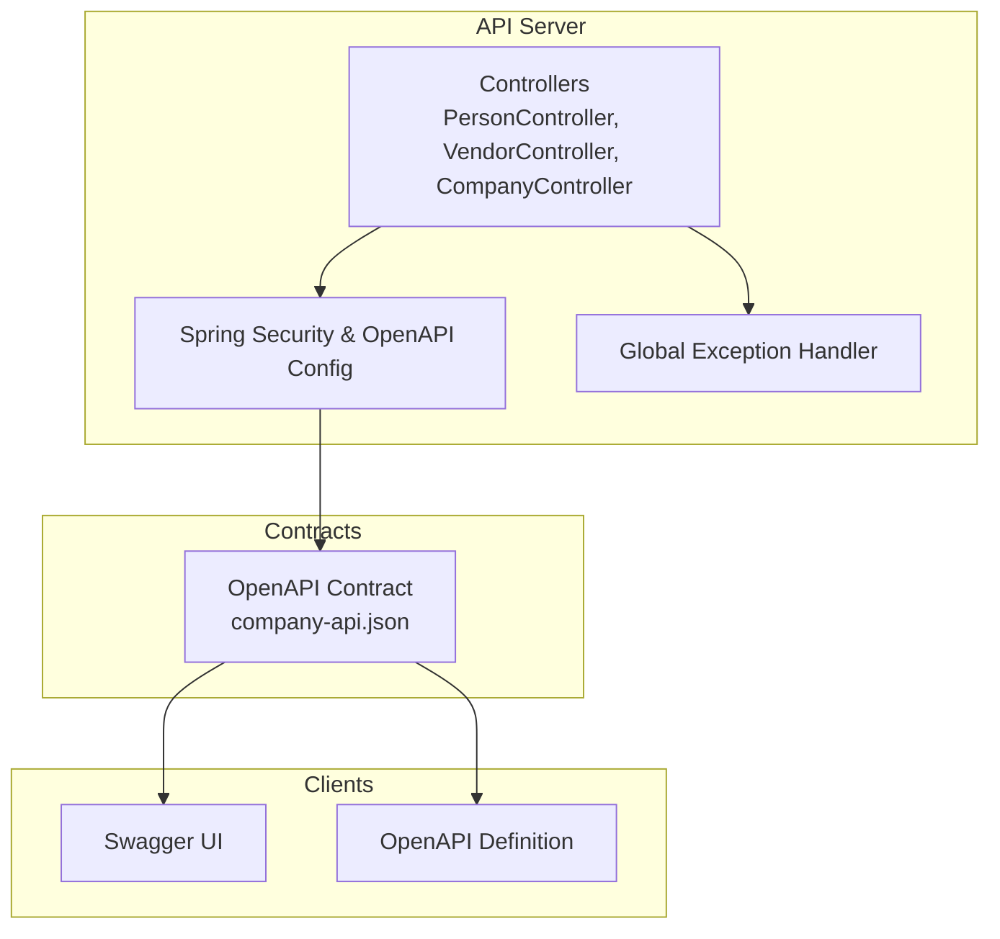
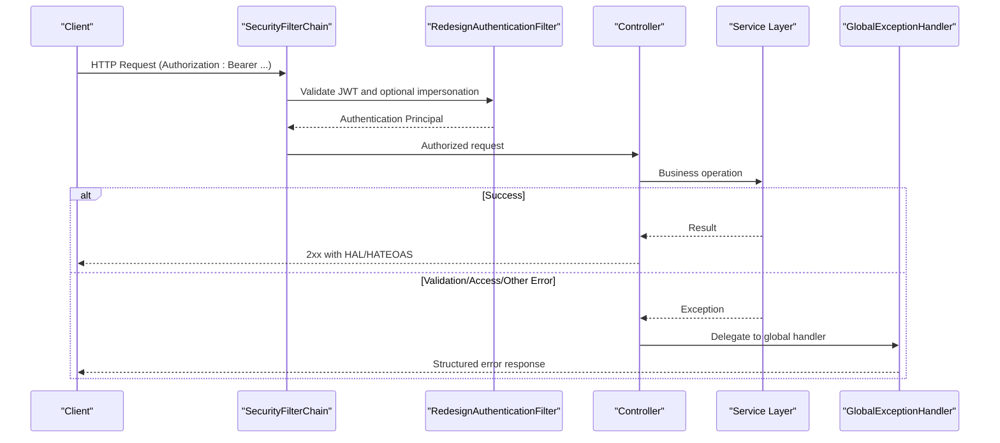
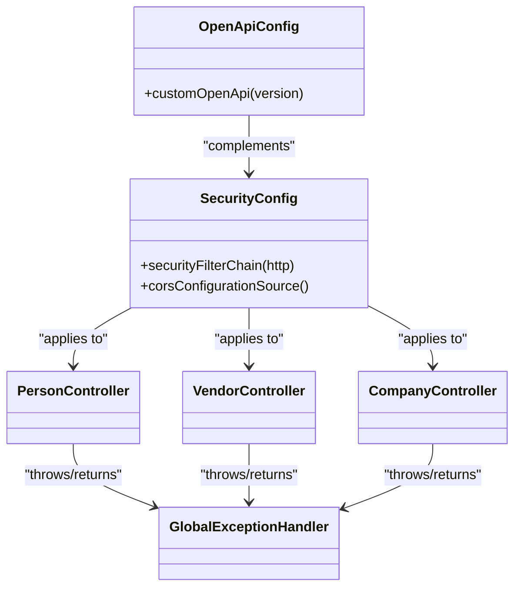

# API Reference

<cite>
**Referenced Files in This Document**
- [company-api.json](file://contracts/company-api/v1/company-api.json)
- [README.md](file://apps/company-api/README.md)
- [index.adoc](file://apps/company-api/application/src/docs/asciidoc/index.adoc)
- [person.adoc](file://apps/company-api/application/src/docs/asciidoc/person.adoc)
- [vendor.adoc](file://apps/company-api/application/src/docs/asciidoc/vendor.adoc)
- [OpenApiConfig.java](file://apps/company-api/application/src/main/java/com/redesignhealth/company/api/config/OpenApiConfig.java)
- [SecurityConfig.java](file://apps/company-api/application/src/main/java/com/redesignhealth/company/api/config/SecurityConfig.java)
- [application.yml](file://apps/company-api/application/src/main/resources/application.yml)
- [GlobalExceptionHandler.java](file://apps/company-api/application/src/main/java/com/redesignhealth/company/api/exception/handler/GlobalExceptionHandler.java)
- [PersonController.java](file://apps/company-api/application/src/main/java/com/redesignhealth/company/api/controller/PersonController.java)
- [VendorController.java](file://apps/company-api/application/src/main/java/com/redesignhealth/company/api/controller/VendorController.java)
- [CompanyController.java](file://apps/company-api/application/src/main/java/com/redesignhealth/company/api/controller/CompanyController.java)
</cite>

## Table of Contents
1. [Introduction](#introduction)
2. [Project Structure](#project-structure)
3. [Core Components](#core-components)
4. [Architecture Overview](#architecture-overview)
5. [Detailed Component Analysis](#detailed-component-analysis)
6. [Dependency Analysis](#dependency-analysis)
7. [Performance Considerations](#performance-considerations)
8. [Troubleshooting Guide](#troubleshooting-guide)
9. [Conclusion](#conclusion)
10. [Appendices](#appendices)

## Introduction
This document provides comprehensive API documentation for the Redesign Health Company API service. It covers REST endpoints, request/response schemas, authentication, authorization, error handling, and integration guidance. The API follows OpenAPI 3.0.1 and exposes Swagger and OpenAPI definitions for client generation.

## Project Structure
The Company API is implemented as a Spring Boot application with controllers grouped by domain (Company, Person, Vendor, etc.). The OpenAPI specification is embedded in the contract and generated at runtime. Documentation is produced via AsciiDoc and hosted under the public endpoints.

**Diagram sources**
- [OpenApiConfig.java:1-59](file://apps/company-api/application/src/main/java/com/redesignhealth/company/api/config/OpenApiConfig.java#L1-L59)
- [SecurityConfig.java:1-89](file://apps/company-api/application/src/main/java/com/redesignhealth/company/api/config/SecurityConfig.java#L1-L89)
- [GlobalExceptionHandler.java:1-157](file://apps/company-api/application/src/main/java/com/redesignhealth/company/api/exception/handler/GlobalExceptionHandler.java#L1-L157)
- [company-api.json:1-16776](file://contracts/company-api/v1/company-api.json#L1-L16776)

**Section sources**
- [README.md:1-259](file://apps/company-api/README.md#L1-L259)
- [index.adoc:1-342](file://apps/company-api/application/src/docs/asciidoc/index.adoc#L1-L342)

## Core Components
- Authentication and Authorization
  - Bearer JWT via Google Identity.
  - Impersonation via a dedicated header for super admin users.
  - Role-based access control enforced per endpoint.
- OpenAPI and Documentation
  - OpenAPI 3.0.1 specification embedded in the contract.
  - Swagger UI and OpenAPI definitions served under public endpoints.
- Error Handling
  - Centralized exception handling with structured error responses.
  - Distinction between generic and field-specific validation errors.

**Section sources**
- [OpenApiConfig.java:18-44](file://apps/company-api/application/src/main/java/com/redesignhealth/company/api/config/OpenApiConfig.java#L18-L44)
- [SecurityConfig.java:28-72](file://apps/company-api/application/src/main/java/com/redesignhealth/company/api/config/SecurityConfig.java#L28-L72)
- [application.yml:104-107](file://apps/company-api/application/src/main/resources/application.yml#L104-L107)
- [index.adoc:5-37](file://apps/company-api/application/src/docs/asciidoc/index.adoc#L5-L37)
- [GlobalExceptionHandler.java:28-157](file://apps/company-api/application/src/main/java/com/redesignhealth/company/api/exception/handler/GlobalExceptionHandler.java#L28-L157)

## Architecture Overview
The API uses stateless authentication, method-level authorization, and HATEOAS-friendly responses. CORS is configured centrally, and the OpenAPI configuration defines security schemes for JWT and impersonation.

**Diagram sources**
- [SecurityConfig.java:38-61](file://apps/company-api/application/src/main/java/com/redesignhealth/company/api/config/SecurityConfig.java#L38-L61)
- [OpenApiConfig.java:21-44](file://apps/company-api/application/src/main/java/com/redesignhealth/company/api/config/OpenApiConfig.java#L21-L44)
- [GlobalExceptionHandler.java:28-157](file://apps/company-api/application/src/main/java/com/redesignhealth/company/api/exception/handler/GlobalExceptionHandler.java#L28-L157)

## Detailed Component Analysis

### Authentication and Security
- JWT Bearer
  - Scheme name: “Google ID”.
  - Type: HTTP Bearer with JWT format.
- Impersonation
  - Header: RH-Impersonation-Email.
  - Required role: ROLE_SUPER_ADMIN.
- CORS
  - Allowed origin patterns, methods, and headers are configurable.

**Section sources**
- [OpenApiConfig.java:18-44](file://apps/company-api/application/src/main/java/com/redesignhealth/company/api/config/OpenApiConfig.java#L18-L44)
- [SecurityConfig.java:28-72](file://apps/company-api/application/src/main/java/com/redesignhealth/company/api/config/SecurityConfig.java#L28-L72)
- [application.yml:104-107](file://apps/company-api/application/src/main/resources/application.yml#L104-L107)
- [index.adoc:17-37](file://apps/company-api/application/src/docs/asciidoc/index.adoc#L17-L37)

### Person API
Endpoints
- GET /person
  - Description: Retrieve a paginated list of people.
  - Role requirement: ROLE_RH_USER.
  - Pagination supported via Pageable; expand query for child entities.
- GET /person/{email}
  - Description: Retrieve information about a person.
  - Role requirement: ROLE_OP_CO_USER.
  - Expand supported.
- POST /person
  - Description: Create a person.
  - Role requirement: ROLE_RH_ADMIN.
- PUT /person/{email}
  - Description: Create or update.
  - Role requirement: ROLE_RH_ADMIN.
- PUT /person/{email}/role/{authority}
  - Description: Add a role.
  - Role requirement: ROLE_RH_ADMIN.
  - Authority enum: ROLE_SUPER_ADMIN, ROLE_RH_ADMIN, ROLE_RH_USER, ROLE_OP_CO_USER, ROLE_OP_CO_CONTRACTOR.
- DELETE /person/{email}/role/{authority}
  - Description: Remove a role.
  - Role requirement: ROLE_RH_ADMIN.
- DELETE /person/{email}
  - Description: Remove a person (and related associations).
  - Role requirement: ROLE_RH_ADMIN.

Response Codes
- 200 OK, 201 Created, 204 No Content, 400 Bad Request, 403 Forbidden, 404 Not Found, 409 Conflict, 422 Unprocessable Entity, 500 Internal Server Error.

Security
- Requires Bearer JWT; impersonation allowed via header for super admins.

**Section sources**
- [PersonController.java:58-136](file://apps/company-api/application/src/main/java/com/redesignhealth/company/api/controller/PersonController.java#L58-L136)
- [person.adoc:1-67](file://apps/company-api/application/src/docs/asciidoc/person.adoc#L1-L67)
- [company-api.json:350-681](file://contracts/company-api/v1/company-api.json#L350-L681)

### Vendor API
Endpoints
- GET /vendor
  - Description: Search vendor information.
  - Role requirement: ROLE_OP_CO_USER.
  - Supports query and filter parameters; pagination defaults to large size with sort.
- GET /vendor/filters
  - Description: Retrieve filter options.
  - Role requirement: ROLE_OP_CO_USER.
- POST /vendor
  - Description: Add vendor data.
  - Role requirement: ROLE_RH_ADMIN.
- PUT /vendor/{vendorId}
  - Description: Update vendor data.
  - Role requirement: ROLE_RH_ADMIN.
- GET /vendor/{vendorId}
  - Description: Get vendor information.
  - Role requirement: ROLE_OP_CO_USER.
- DELETE /vendor/{vendorId}
  - Description: Delete a company vendor.
  - Role requirement: ROLE_RH_ADMIN.

Response Codes
- 200 OK, 201 Created, 204 No Content, 400 Bad Request, 403 Forbidden, 404 Not Found, 409 Conflict, 422 Unprocessable Entity, 500 Internal Server Error.

Security
- Requires Bearer JWT; impersonation allowed via header for super admins.

**Section sources**
- [VendorController.java:53-112](file://apps/company-api/application/src/main/java/com/redesignhealth/company/api/controller/VendorController.java#L53-L112)
- [vendor.adoc:1-44](file://apps/company-api/application/src/docs/asciidoc/vendor.adoc#L1-L44)
- [company-api.json:39-348](file://contracts/company-api/v1/company-api.json#L39-L348)

### Company API
Endpoints
- GET /company
  - Description: Query companies (paginated).
  - Expand supported.
- GET /company/{companyId}
  - Description: Get company details.
  - Role requirement: ROLE_OP_CO_CONTRACTOR or higher for members.
  - Expand supported.
- POST /company
  - Description: Create a company.
  - Role requirement: ROLE_RH_ADMIN.
- PUT /company/{companyId}
  - Description: Update a company.
  - Role requirement: ROLE_RH_ADMIN.
- GET /company/{companyId}/members
  - Description: List members.
  - Role requirement: ROLE_OP_CO_CONTRACTOR or higher for members.
- PUT /company/{companyId}/member/{email}
  - Description: Add a user to a company.
  - Role requirement: ROLE_RH_ADMIN.
- DELETE /company/{companyId}/member/{email}
  - Description: Remove a user from a company.
  - Role requirement: ROLE_RH_ADMIN.
- PUT /company/{companyId}/conflicts
  - Description: Upsert conflicts.
  - Role requirement: ROLE_OP_CO_CONTRACTOR or higher for members.
- GET /company/{companyId}/conflicts
  - Description: Return conflicts.
  - Role requirement: ROLE_OP_CO_CONTRACTOR or higher for members.
- DELETE /company/{companyId}
  - Description: Delete a company.
  - Role requirement: ROLE_RH_ADMIN.

Response Codes
- 200 OK, 201 Created, 204 No Content, 400 Bad Request, 403 Forbidden, 404 Not Found, 409 Conflict, 422 Unprocessable Entity, 500 Internal Server Error.

Security
- Requires Bearer JWT; impersonation allowed via header for super admins.

**Section sources**
- [CompanyController.java:73-175](file://apps/company-api/application/src/main/java/com/redesignhealth/company/api/controller/CompanyController.java#L73-L175)
- [company-api.json:39-348](file://contracts/company-api/v1/company-api.json#L39-L348)

### Additional Endpoints (from OpenAPI)
- Person Request, Infrastructure Request, User Info, Advise Token Exchange, Category, Consent, Expert Note, Form Definition, IP Marketplace, Library, Library Content, Research, Research Article, Subcategory, Task, Test Template, and Root endpoints are defined in the OpenAPI contract. Refer to the contract for precise paths, methods, parameters, and schemas.

**Section sources**
- [company-api.json:16-37](file://contracts/company-api/v1/company-api.json#L16-L37)
- [company-api.json:38-132](file://contracts/company-api/v1/company-api.json#L38-L132)

## Dependency Analysis
Key dependencies and relationships:
- OpenAPI configuration defines security schemes consumed by controllers.
- Security filter chain enforces stateless authentication and CORS.
- Global exception handler centralizes error responses.
- Controllers depend on services and assemblers for DTO/HATEOAS mapping.

**Diagram sources**
- [OpenApiConfig.java:18-44](file://apps/company-api/application/src/main/java/com/redesignhealth/company/api/config/OpenApiConfig.java#L18-L44)
- [SecurityConfig.java:38-88](file://apps/company-api/application/src/main/java/com/redesignhealth/company/api/config/SecurityConfig.java#L38-L88)
- [GlobalExceptionHandler.java:28-157](file://apps/company-api/application/src/main/java/com/redesignhealth/company/api/exception/handler/GlobalExceptionHandler.java#L28-L157)
- [PersonController.java:38-136](file://apps/company-api/application/src/main/java/com/redesignhealth/company/api/controller/PersonController.java#L38-L136)
- [VendorController.java:39-112](file://apps/company-api/application/src/main/java/com/redesignhealth/company/api/controller/VendorController.java#L39-L112)
- [CompanyController.java:42-175](file://apps/company-api/application/src/main/java/com/redesignhealth/company/api/controller/CompanyController.java#L42-L175)

**Section sources**
- [OpenApiConfig.java:18-44](file://apps/company-api/application/src/main/java/com/redesignhealth/company/api/config/OpenApiConfig.java#L18-L44)
- [SecurityConfig.java:38-88](file://apps/company-api/application/src/main/java/com/redesignhealth/company/api/config/SecurityConfig.java#L38-L88)
- [GlobalExceptionHandler.java:28-157](file://apps/company-api/application/src/main/java/com/redesignhealth/company/api/exception/handler/GlobalExceptionHandler.java#L28-L157)

## Performance Considerations
- Pagination
  - Query endpoints support pagination via Pageable; default page size is configured.
  - Vendor endpoint intentionally uses a large default page size to emulate “unpaged” behavior while retaining pagination opt-in.
- Rate Limiting
  - A rate limit configuration exists for a specific infrastructure request operation; consult application configuration for enforcement details.
- HATEOAS
  - Responses include HAL links to navigate pages and related resources.

**Section sources**
- [application.yml:9-11](file://apps/company-api/application/src/main/resources/application.yml#L9-L11)
- [application.yml:211-214](file://apps/company-api/application/src/main/resources/application.yml#L211-L214)
- [index.adoc:243-295](file://apps/company-api/application/src/docs/asciidoc/index.adoc#L243-L295)
- [VendorController.java:53-68](file://apps/company-api/application/src/main/java/com/redesignhealth/company/api/controller/VendorController.java#L53-L68)

## Troubleshooting Guide
Common issues and resolutions:
- Unauthorized Access
  - Ensure a valid Bearer JWT is provided. Verify the token issuer and audience align with Google Identity configuration.
  - Super admin privileges are required for impersonation.
- Forbidden or Insufficient Permissions
  - Confirm the user’s roles and company membership meet endpoint requirements.
- Validation Errors
  - 422 responses indicate invalid field values or field-specific validation failures. Review the error payload for details.
- Database Isolation Errors
  - CockroachDB SERIALIZABLE retries may trigger a 429 response; retry the request per guidance.
- CORS Issues
  - Verify the client origin is included in allowed origin patterns and that required headers are present.

**Section sources**
- [index.adoc:5-37](file://apps/company-api/application/src/docs/asciidoc/index.adoc#L5-L37)
- [GlobalExceptionHandler.java:42-120](file://apps/company-api/application/src/main/java/com/redesignhealth/company/api/exception/handler/GlobalExceptionHandler.java#L42-L120)
- [application.yml:104-107](file://apps/company-api/application/src/main/resources/application.yml#L104-L107)

## Conclusion
The Company API provides a secure, documented, and extensible REST interface with robust authentication, authorization, and error handling. The OpenAPI contract and generated documentation facilitate client integration across languages and frameworks.

## Appendices

### OpenAPI and Documentation Endpoints
- Swagger UI: /public/swagger
- OpenAPI Definition: /public/open-api
- Public root: /public/docs

**Section sources**
- [README.md:9-11](file://apps/company-api/README.md#L9-L11)
- [application.yml:46-51](file://apps/company-api/application/src/main/resources/application.yml#L46-L51)

### Example Requests and Responses
- See the AsciiDoc snippets for typical request/response patterns for each endpoint group.
- Use the OpenAPI definition to generate clients and collections for your preferred tooling.

**Section sources**
- [person.adoc:9-67](file://apps/company-api/application/src/docs/asciidoc/person.adoc#L9-L67)
- [vendor.adoc:16-44](file://apps/company-api/application/src/docs/asciidoc/vendor.adoc#L16-L44)
- [index.adoc:312-319](file://apps/company-api/application/src/docs/asciidoc/index.adoc#L312-L319)