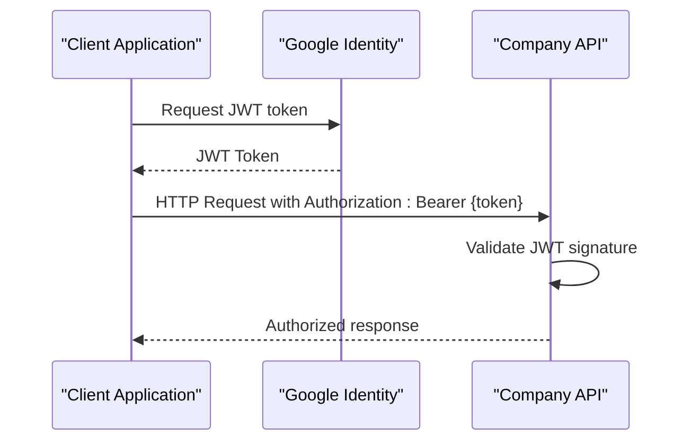

# API Reference

<cite>
**Referenced Files in This Document**
- [company-api.json](file://contracts/company-api/v1/company-api.json)
- [README.md](file://apps/company-api/README.md)
- [index.adoc](file://apps/company-api/application/src/docs/asciidoc/index.adoc)
- [person.adoc](file://apps/company-api/application/src/docs/asciidoc/person.adoc)
- [vendor.adoc](file://apps/company-api/application/src/docs/asciidoc/vendor.adoc)
- [company.adoc](file://apps/company-api/application/src/docs/asciidoc/company.adoc)
- [OpenApiConfig.java](file://apps/company-api/application/src/main/java/com/redesignhealth/company/api/config/OpenApiConfig.java)
- [SecurityConfig.java](file://apps/company-api/application/src/main/java/com/redesignhealth/company/api/config/SecurityConfig.java)
- [application.yml](file://apps/company-api/application/src/main/resources/application.yml)
- [GlobalExceptionHandler.java](file://apps/company-api/application/src/main/java/com/redesignhealth/company/api/exception/handler/GlobalExceptionHandler.java)
- [PersonController.java](file://apps/company-api/application/src/main/java/com/redesignhealth/company/api/controller/PersonController.java)
- [VendorController.java](file://apps/company-api/application/src/main/java/com/redesignhealth/company/api/controller/VendorController.java)
- [CompanyController.java](file://apps/company-api/application/src/main/java/com/redesignhealth/company/api/controller/CompanyController.java)
</cite>

## Update Summary
**Changes Made**
- Added comprehensive authentication and security documentation covering JWT via Google Identity and impersonation mechanisms
- Documented role-based access control system with five distinct roles and their permissions
- Expanded endpoint documentation with detailed request/response schemas and examples
- Added pagination and field expansion documentation
- Enhanced error handling patterns and response code coverage
- Integrated OpenAPI specification with Swagger UI and documentation endpoints

## Table of Contents
1. [Introduction](#introduction)
2. [Authentication and Security](#authentication-and-security)
3. [Role-Based Access Control](#role-based-access-control)
4. [API Endpoints](#api-endpoints)
5. [Pagination and Field Expansion](#pagination-and-field-expansion)
6. [Error Handling](#error-handling)
7. [OpenAPI Specification](#openapi-specification)
8. [Integration Guide](#integration-guide)
9. [Client Implementation Examples](#client-implementation-examples)
10. [Troubleshooting Guide](#troubleshooting-guide)
11. [Conclusion](#conclusion)

## Introduction
This document provides comprehensive API documentation for the Redesign Health Company API service. The API enables portfolio companies to accelerate time-to-market through software and hardware solutions. It covers REST endpoints, request/response schemas, authentication mechanisms, role-based access control, error handling patterns, and integration guidance. The API follows OpenAPI 3.0.1 and exposes Swagger and OpenAPI definitions for client generation.

## Authentication and Security

### JWT Bearer Authentication
The API uses JSON Web Tokens (JWT) generated via Google Identity for authentication. All requests must include an Authorization header with the Bearer scheme.

**Authentication Flow:**


**Diagram sources**
- [OpenApiConfig.java:18-44](file://apps/company-api/application/src/main/java/com/redesignhealth/company/api/config/OpenApiConfig.java#L18-L44)
- [SecurityConfig.java:37-61](file://apps/company-api/application/src/main/java/com/redesignhealth/company/api/config/SecurityConfig.java#L37-L61)

### Impersonation
Super administrators can make API calls on behalf of other users through impersonation. This feature requires the `ROLE_SUPER_ADMIN` role and uses a dedicated header.

**Impersonation Header:**
- Header name: `RH-Impersonation-Email`
- Required role: `ROLE_SUPER_ADMIN`
- Purpose: Make requests as another user without their credentials

**Section sources**
- [index.adoc:17-37](file://apps/company-api/application/src/docs/asciidoc/index.adoc#L17-L37)
- [OpenApiConfig.java:38-44](file://apps/company-api/application/src/main/java/com/redesignhealth/company/api/config/OpenApiConfig.java#L38-L44)
- [SecurityConfig.java:50-54](file://apps/company-api/application/src/main/java/com/redesignhealth/company/api/config/SecurityConfig.java#L50-L54)

## Role-Based Access Control

The API implements a hierarchical role-based access control system with five distinct roles, each with specific permissions and requirements.

### Role Hierarchy and Permissions

| Role | Description | Required Company Membership | Key Permissions |
|------|-------------|----------------------------|-----------------|
| `ROLE_SUPER_ADMIN` | System administrator with impersonation capabilities | Not required | Full system access, impersonate users, manage all resources |
| `ROLE_RH_ADMIN` | Redesign Health administrator | Not required | Full access to all resources except impersonation |
| `ROLE_RH_USER` | Redesign Health user | Not required | View company members, perform OP_CO tasks |
| `ROLE_OP_CO_USER` | Operational company user | Required for most actions | Request company infrastructure, perform company tasks |
| `ROLE_OP_CO_CONTRACTOR` | Operational company contractor | Required for company interactions | View company details, request company members |

### Role Requirements Matrix

**Company Operations Require Membership:**
- `ROLE_OP_CO_CONTRACTOR`: All company interactions
- `ROLE_OP_CO_USER`: Company infrastructure requests and member management
- `ROLE_RH_USER`: Company member viewing and basic operations

**Permission Matrix by Role:**

| Action | Contractor | User | RH User | Admin |
|--------|------------|------|---------|-------|
| View Company | ✅ | ✅ | ✅ | ✅ |
| Manage Company | ❌ | ❌ | ❌ | ✅ |
| Create Company | ❌ | ❌ | ❌ | ✅ |
| Grant/Revoke Membership | ❌ | ✅ | ✅ | ✅ |
| Request Infrastructure | ❌ | ✅ | ✅ | ✅ |
| Manage Person Records | ❌ | ❌ | ❌ | ✅ |
| Grant/Revoke Roles | ❌ | ❌ | ❌ | ✅ |

**Section sources**
- [index.adoc:39-131](file://apps/company-api/application/src/docs/asciidoc/index.adoc#L39-L131)
- [person.adoc:34-45](file://apps/company-api/application/src/docs/asciidoc/person.adoc#L34-L45)
- [company.adoc:41-53](file://apps/company-api/application/src/docs/asciidoc/company.adoc#L41-L53)

## API Endpoints

### Person Management API

#### Query People
**Endpoint:** `GET /person`
**Description:** Retrieve a paginated list of people
**Role Requirement:** `ROLE_RH_ADMIN`
**Response:** Paginated collection of PersonSummary

#### Get Person Details
**Endpoint:** `GET /person/{email}`
**Description:** Retrieve information about a specific person
**Role Requirement:** `ROLE_OP_CO_USER`
**Response:** PersonSummary with expandable fields

#### Create Person
**Endpoint:** `POST /person`
**Description:** Create a new person record
**Role Requirement:** `ROLE_RH_ADMIN`
**Response:** Created PersonSummary

#### Update Person
**Endpoint:** `PUT /person/{email}`
**Description:** Create or update person information
**Role Requirement:** `ROLE_RH_ADMIN`
**Response:** Updated PersonSummary

#### Add Role
**Endpoint:** `PUT /person/{email}/role/{authority}`
**Description:** Grant a role to a person
**Role Requirement:** `ROLE_RH_ADMIN`
**Authority Values:** `ROLE_SUPER_ADMIN`, `ROLE_RH_ADMIN`, `ROLE_RH_USER`, `ROLE_OP_CO_USER`, `ROLE_OP_CO_CONTRACTOR`

#### Remove Role
**Endpoint:** `DELETE /person/{email}/role/{authority}`
**Description:** Revoke a role from a person
**Role Requirement:** `ROLE_RH_ADMIN`

#### Delete Person
**Endpoint:** `DELETE /person/{email}`
**Description:** Remove a person and all related associations
**Role Requirement:** `ROLE_RH_ADMIN`
**Associated Cleanup:** Company membership, roles, requests

**Section sources**
- [PersonController.java:58-136](file://apps/company-api/application/src/main/java/com/redesignhealth/company/api/controller/PersonController.java#L58-L136)
- [person.adoc:1-67](file://apps/company-api/application/src/docs/asciidoc/person.adoc#L1-L67)
- [company-api.json:350-681](file://contracts/company-api/v1/company-api.json#L350-L681)

### Vendor Management API

#### Create Vendor Data
**Endpoint:** `POST /vendor`
**Description:** Add vendor data
**Role Requirement:** `ROLE_RH_ADMIN`
**Rules:**
- New vendor rejected if name already exists
- Can copy name from legacy data
- Multiple categories/subcategories allowed
- Category required for creation

#### Update Vendor Data
**Endpoint:** `PUT /vendor/{vendorId}`
**Description:** Update existing vendor data
**Role Requirement:** `ROLE_RH_ADMIN`

#### Query Vendors
**Endpoint:** `GET /vendor`
**Description:** Search vendor information
**Role Requirement:** `ROLE_OP_CO_USER`
**Features:** Query parameters, filter options, pagination

#### Get Vendor Details
**Endpoint:** `GET /vendor/{vendorId}`
**Description:** Retrieve specific vendor information
**Role Requirement:** `ROLE_OP_CO_USER`

#### Delete Vendor
**Endpoint:** `DELETE /vendor/{vendorId}`
**Description:** Delete a company vendor
**Role Requirement:** `ROLE_RH_ADMIN`

**Section sources**
- [VendorController.java:53-112](file://apps/company-api/application/src/main/java/com/redesignhealth/company/api/controller/VendorController.java#L53-L112)
- [vendor.adoc:1-44](file://apps/company-api/application/src/docs/asciidoc/vendor.adoc#L1-L44)
- [company-api.json:39-348](file://contracts/company-api/v1/company-api.json#L39-L348)

### Company Management API

#### Query Companies
**Endpoint:** `GET /company`
**Description:** Retrieve paginated list of companies
**Role Requirement:** None
**Response:** Paginated collection of CompanyDtoSummary

#### Get Company Details
**Endpoint:** `GET /company/{companyId}`
**Description:** Retrieve company information
**Role Requirement:** `ROLE_OP_CO_CONTRACTOR` or higher for members
**Response:** CompanyDtoSummary with expandable fields

#### Create Company
**Endpoint:** `POST /company`
**Description:** Create a new company
**Role Requirement:** `ROLE_RH_ADMIN`

#### Update Company
**Endpoint:** `PUT /company/{companyId}`
**Description:** Update company information
**Role Requirement:** `ROLE_RH_ADMIN`

#### Get Company Members
**Endpoint:** `GET /company/{companyId}/members`
**Description:** List company members
**Role Requirement:** `ROLE_OP_CO_CONTRACTOR` or higher for members

#### Add Company Member
**Endpoint:** `PUT /company/{companyId}/member/{email}`
**Description:** Add user to company
**Role Requirement:** `ROLE_RH_ADMIN`

#### Remove Company Member
**Endpoint:** `DELETE /company/{companyId}/member/{email}`
**Description:** Remove user from company
**Role Requirement:** `ROLE_RH_ADMIN`

#### Manage Company Conflicts
**Endpoint:** `PUT /company/{companyId}/conflicts`
**Description:** Establish conflicts with other companies
**Role Requirement:** `ROLE_OP_CO_CONTRACTOR` or higher for members
**Rules:**
- Bidirectional conflicts established
- Companies with common members forbidden
- Non-existing companies ignored
- Empty payload removes conflicts

#### Get Company Conflicts
**Endpoint:** `GET /company/{companyId}/conflicts`
**Description:** Retrieve conflicting companies
**Role Requirement:** `ROLE_OP_CO_CONTRACTOR` or higher for members

#### Delete Company
**Endpoint:** `DELETE /company/{companyId}`
**Description:** Remove company and all related entities
**Role Requirement:** `ROLE_RH_ADMIN`
**Associated Cleanup:** Members, infrastructure requests, person requests

**Section sources**
- [CompanyController.java:73-175](file://apps/company-api/application/src/main/java/com/redesignhealth/company/api/controller/CompanyController.java#L73-L175)
- [company.adoc:1-99](file://apps/company-api/application/src/docs/asciidoc/company.adoc#L1-L99)

## Pagination and Field Expansion

### Pagination
All query endpoints support pagination through standard Spring Data parameters:

**Query Parameters:**
- `page`: Page number (0-indexed)
- `size`: Number of elements per page
- Default page size: 20 elements

**Response Metadata:**
```json
{
  "page": {
    "size": 20,
    "totalElements": 200,
    "totalPages": 10,
    "number": 1
  }
}
```

**HAL Links for Navigation:**
- `first`: First page
- `next`: Next page
- `previous`: Previous page  
- `last`: Last page

### Field Expansion
Many endpoints support field expansion for child entities through the `expand` query parameter:

**Available Expansion Options:**
- `ancestors`, `children`, `contacts`
- `descendants`, `forms`, `members`
- `memberOf`, `highlightedText`, `subcategories`
- `metrics`, `requests`

**Examples:**
```bash
# Single expansion
curl "{service-host}/company?expand=members"

# Multiple expansions
curl "{service-host}/company?expand=members&expand=forms"
```

**Section sources**
- [index.adoc:243-295](file://apps/company-api/application/src/docs/asciidoc/index.adoc#L243-L295)
- [company-api.json:364-383](file://contracts/company-api/v1/company-api.json#L364-L383)

## Error Handling

### Response Codes
The API consistently returns standard HTTP status codes:

**Success Codes:**
- `200 OK`: Successful GET, PUT, PATCH operations
- `201 Created`: Successful POST operations
- `204 No Content`: Successful DELETE operations

**Client Error Codes:**
- `400 Bad Request`: Invalid request syntax or parameters
- `401 Unauthorized`: Missing or invalid authentication
- `403 Forbidden`: Insufficient permissions
- `404 Not Found`: Resource not found
- `409 Conflict`: Resource conflict (e.g., duplicate creation)
- `422 Unprocessable Entity`: Validation errors

**Server Error Codes:**
- `500 Internal Server Error`: Unexpected server error

### Error Response Format
Structured error responses include:
- `timestamp`: Error occurrence time
- `status`: HTTP status code
- `error`: Error message
- `path`: Requested endpoint
- `details`: Field-specific validation errors (when applicable)

**Section sources**
- [index.adoc:5-37](file://apps/company-api/application/src/docs/asciidoc/index.adoc#L5-L37)
- [GlobalExceptionHandler.java:28-157](file://apps/company-api/application/src/main/java/com/redesignhealth/company/api/exception/handler/GlobalExceptionHandler.java#L28-L157)

## OpenAPI Specification

### API Documentation Endpoints
The API provides comprehensive documentation through multiple formats:

**Swagger UI:**
- Endpoint: `/public/swagger`
- Interactive API documentation with testing capabilities

**OpenAPI Definition:**
- Endpoint: `/public/open-api`
- Machine-readable API specification in JSON format

**Static Documentation:**
- Endpoint: `/public/docs`
- Static HTML documentation generated from AsciiDoc

### OpenAPI Configuration
The API uses Springdoc OpenAPI with custom security schemes:

**Security Schemes:**
1. **Google ID JWT**: HTTP Bearer authentication with JWT format
2. **Impersonation Email**: API Key authentication via header

**Version Information:**
- Current version: `0.0.23-SNAPSHOT`
- Generated server URL: `http://localhost:8080`

**Section sources**
- [README.md:9-11](file://apps/company-api/README.md#L9-L11)
- [application.yml:46-51](file://apps/company-api/application/src/main/resources/application.yml#L46-L51)
- [OpenApiConfig.java:22-44](file://apps/company-api/application/src/main/java/com/redesignhealth/company/api/config/OpenApiConfig.java#L22-L44)

## Integration Guide

### Client Setup
1. **Obtain JWT Token**: Use Google Identity to acquire authentication token
2. **Set Headers**: Include `Authorization: Bearer {token}` in all requests
3. **Handle Impersonation**: For super admins, include `RH-Impersonation-Email: user@example.com`
4. **Parse Responses**: Handle HAL links for pagination navigation

### CORS Configuration
The API supports cross-origin requests with configurable origins:

**Allowed Origins:** `http://localhost:*`, `https://*.redesignhealth.com`
**Allowed Methods:** `PUT, GET, DELETE, POST`
**Allowed Headers:** `Authorization, Content-Type, Accept, RH-Impersonation-Email, RH-Google-Access-Token`

### Rate Limiting
- Specific infrastructure request operations have rate limiting configured
- Consult application configuration for enforcement details
- Implement client-side retry logic for rate-limited requests

**Section sources**
- [application.yml:104-107](file://apps/company-api/application/src/main/resources/application.yml#L104-L107)
- [SecurityConfig.java:63-72](file://apps/company-api/application/src/main/java/com/redesignhealth/company/api/config/SecurityConfig.java#L63-L72)

## Client Implementation Examples

### Basic Authentication Flow
```javascript
// Step 1: Obtain JWT from Google Identity
const jwt = await getGoogleToken();

// Step 2: Make authenticated request
const response = await fetch('https://api.redesignhealth.com/company', {
  headers: {
    'Authorization': `Bearer ${jwt}`,
    'Content-Type': 'application/json'
  }
});

// Step 3: Handle response with pagination
const data = await response.json();
console.log(`Total pages: ${data.page.totalPages}`);
```

### Impersonation Example
```javascript
// Super admin impersonation
const response = await fetch('https://api.redesignhealth.com/company', {
  headers: {
    'Authorization': `Bearer ${superAdminJwt}`,
    'RH-Impersonation-Email': 'target.user@example.com',
    'Content-Type': 'application/json'
  }
});
```

### Pagination Handling
```javascript
// Fetch first page
let currentPage = 0;
const pageSize = 20;

while (currentPage < totalPages) {
  const response = await fetch(
    `https://api.redesignhealth.com/company?page=${currentPage}&size=${pageSize}`
  );
  const data = await response.json();
  
  // Process current page
  data._embedded.companies.forEach(company => {
    console.log(company.name);
  });
  
  // Navigate to next page using HAL links
  const nextPage = data._links.next?.href;
  if (!nextPage) break;
  
  currentPage++;
}
```

## Troubleshooting Guide

### Common Authentication Issues
- **401 Unauthorized**: Verify JWT token validity and Google Identity configuration
- **403 Forbidden**: Check user roles and company membership requirements
- **Impersonation Failed**: Ensure requesting user has `ROLE_SUPER_ADMIN` role

### Validation Errors (422)
Review error payload for specific field validation failures:
```json
{
  "field": "email",
  "rejectedValue": "invalid-email",
  "message": "must be a well-formed email address"
}
```

### Database Issues
- **429 Too Many Requests**: CockroachDB SERIALIZABLE isolation may cause retries
- **409 Conflict**: Duplicate resource creation attempts
- **Database Connection**: Verify connection string and credentials

### CORS Problems
- Verify client origin is in allowed patterns
- Ensure required headers are present in preflight requests
- Check browser console for CORS error messages

**Section sources**
- [index.adoc:5-37](file://apps/company-api/application/src/docs/asciidoc/index.adoc#L5-L37)
- [GlobalExceptionHandler.java:42-120](file://apps/company-api/application/src/main/java/com/redesignhealth/company/api/exception/handler/GlobalExceptionHandler.java#L42-L120)
- [application.yml:104-107](file://apps/company-api/application/src/main/resources/application.yml#L104-L107)

## Conclusion

The Redesign Health Company API provides a comprehensive, secure, and well-documented REST interface for managing portfolio companies and their associated resources. The API's robust authentication system, hierarchical role-based access control, and extensive documentation make it suitable for integration across various client applications and development environments. The OpenAPI specification and generated documentation facilitate easy client generation and integration testing.

The addition of comprehensive AsciiDoc documentation ensures that developers have access to detailed endpoint specifications, authentication flows, role permissions, and practical integration examples. This documentation serves as both a developer reference and a foundation for automated client generation through the OpenAPI specification.