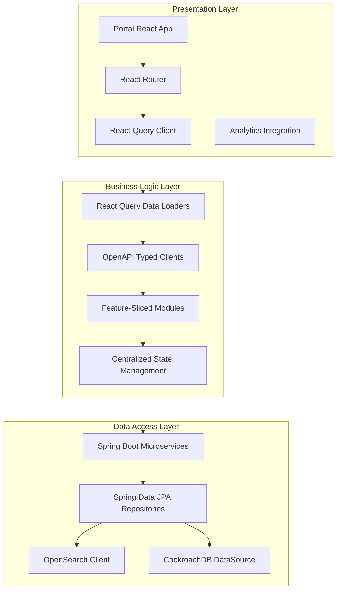
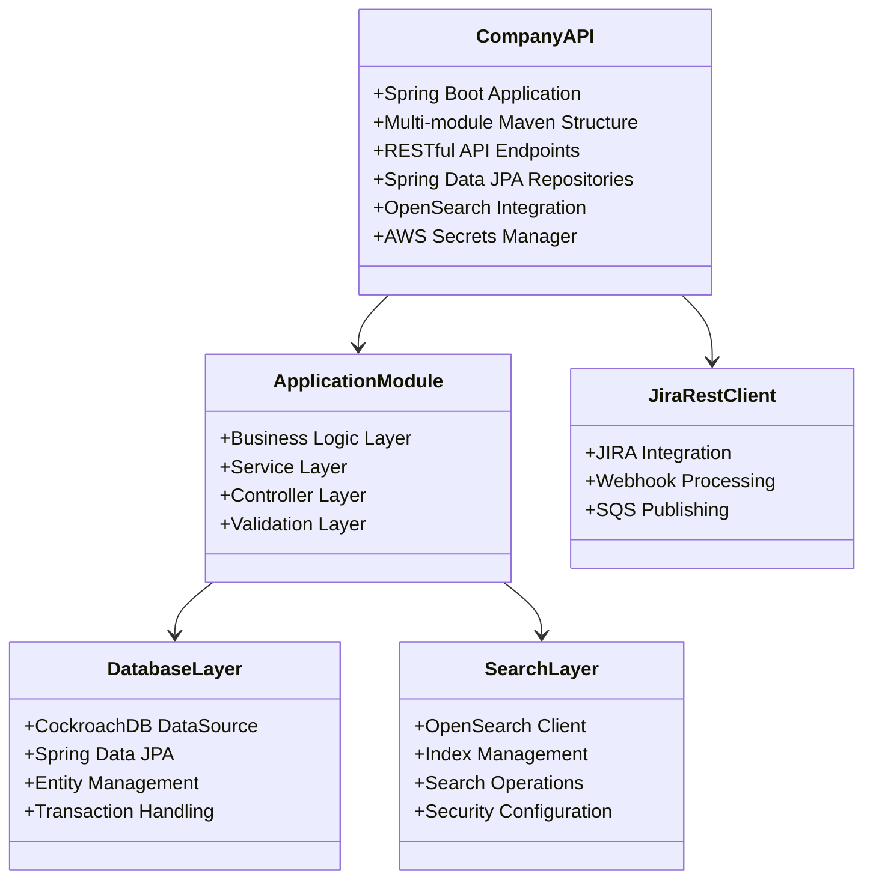
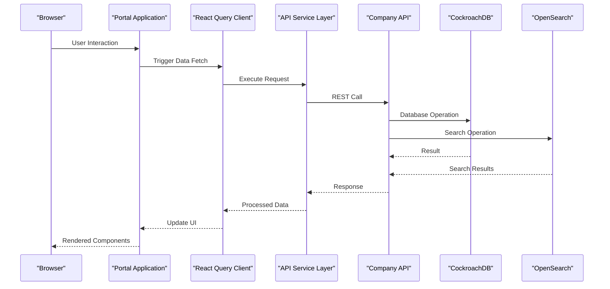
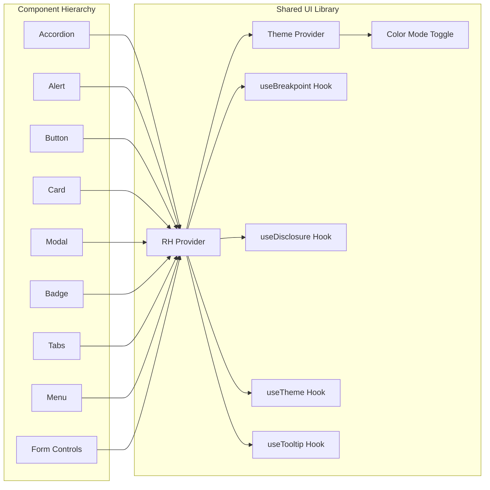
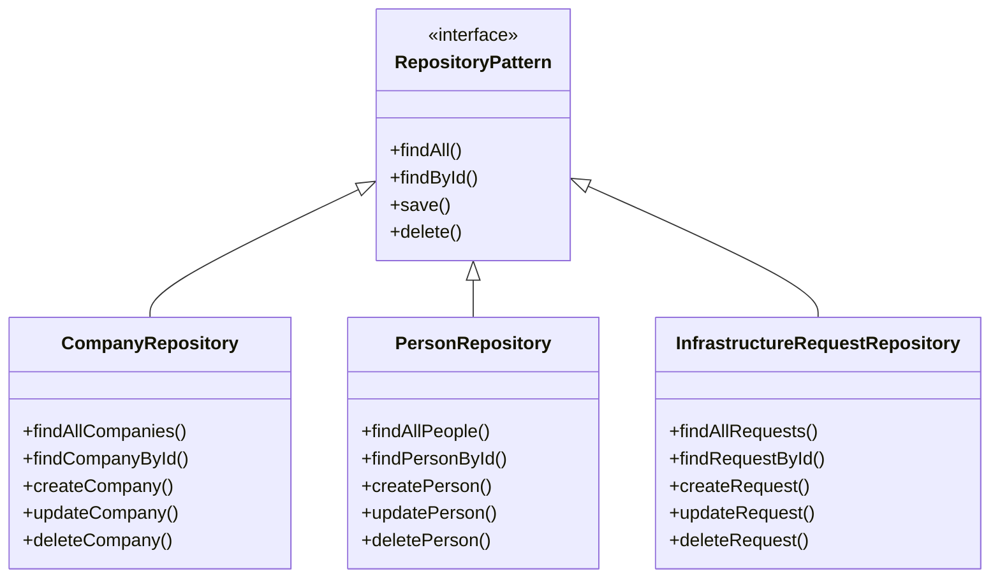
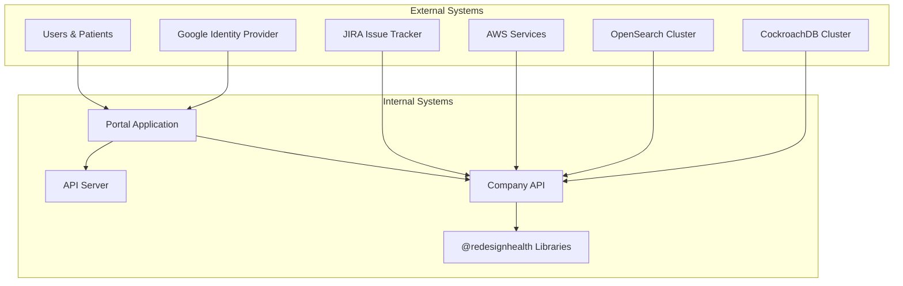

# Architecture & Design

<cite>
**Referenced Files in This Document**
- [README.md](file://README.md)
- [nx.json](file://nx.json)
- [package.json](file://package.json)
- [tsconfig.base.json](file://tsconfig.base.json)
- [apps/portal/project.json](file://apps/portal/project.json)
- [apps/portal/proxy.conf.json](file://apps/portal/proxy.conf.json)
- [apps/portal/src/app/app.tsx](file://apps/portal/src/app/app.tsx)
- [apps/api-server/project.json](file://apps/api-server/project.json)
- [apps/api-server/src/main.ts](file://apps/api-server/src/main.ts)
- [apps/company-api/project.json](file://apps/company-api/project.json)
- [apps/company-api/docker-compose.yml](file://apps/company-api/docker-compose.yml)
- [apps/company-api/doc/architecture/decisions/0001-record-architecture-decisions.md](file://apps/company-api/doc/architecture/decisions/0001-record-architecture-decisions.md)
- [apps/company-api/doc/architecture/decisions/0002-java-and-spring.md](file://apps/company-api/doc/architecture/decisions/0002-java-and-spring.md)
- [apps/company-api/doc/architecture/decisions/0005-orm.md](file://apps/company-api/doc/architecture/decisions/0005-orm.md)
- [apps/company-api/doc/architecture/decisions/0007-multi-module-project.md](file://apps/company-api/doc/architecture/decisions/0007-multi-module-project.md)
- [libs/shared/ui/src/index.ts](file://libs/shared/ui/src/index.ts)
- [libs/company-api-types/package.json](file://libs/company-api-types/package.json)
- [contracts/company-api/v1/company-api.json](file://contracts/company-api/v1/company-api.json)
- [tools/forgekit-nx-storybook/README.md](file://tools/forgekit-nx-storybook/README.md)
</cite>

## Update Summary
**Changes Made**
- Enhanced layered architecture documentation with comprehensive Nx monorepo structure analysis
- Added detailed architectural decision records section with concrete examples
- Expanded microservices architecture coverage with Spring Boot patterns
- Improved component relationship documentation with data flow patterns
- Added comprehensive system context diagrams with integration points
- Documented advanced architectural patterns including repository, factory, and observer patterns
- Enhanced cross-cutting concerns documentation with authentication, authorization, and monitoring

## Table of Contents
1. [Introduction](#introduction)
2. [Nx Monorepo Architecture](#nx-monorepo-architecture)
3. [Layered Architecture Pattern](#layered-architecture-pattern)
4. [Microservices Architecture](#microservices-architecture)
5. [Component Relationships & Data Flow](#component-relationships--data-flow)
6. [Architectural Decision Records](#architectural-decision-records)
7. [Advanced Architectural Patterns](#advanced-architectural-patterns)
8. [Cross-Cutting Concerns](#cross-cutting-constraints)
9. [System Context & Integration Points](#system-context--integration-points)
10. [Technology Stack & Trade-offs](#technology-stack--trade-offs)
11. [Performance & Scalability Considerations](#performance--scalability-considerations)
12. [Development Workflow & Tooling](#development-workflow--tooling)
13. [Conclusion](#conclusion)

## Introduction
This document provides a comprehensive architectural overview of the Redesign Health Nx monorepo, detailing the layered design patterns, Nx workspace organization, and architectural decision records. The system follows a modern full-stack architecture with React 19 frontend, Spring Boot microservices, and a sophisticated monorepo structure managed by Nx workspace tools.

The architecture emphasizes separation of concerns through distinct layers, implements robust microservices patterns, and leverages advanced tooling for component development and testing automation. Cross-cutting concerns including authentication, authorization, and observability are systematically addressed throughout the design.

## Nx Monorepo Architecture
The Redesign Health monorepo utilizes Nx workspace architecture to manage multiple applications and libraries efficiently. The workspace follows a clear separation of concerns with dedicated directories for applications, shared libraries, tools, and documentation.

### Workspace Structure
The monorepo maintains a hierarchical structure that promotes scalability and maintainability:

```mermaid
graph TB
subgraph "Nx Workspace Root"
Workspace["rh-nx-monorepo/"]
Workspace --> Apps["apps/"]
Workspace --> Libs["libs/"]
Workspace --> Tools["tools/"]
Workspace --> Docs["docs/"]
Workspace --> Contracts["contracts/"]
Workspace --> Playwright["playwright/"]
end
subgraph "Applications (apps/)"
Apps --> Portal["portal/"]
Apps --> APIServer["api-server/"]
Apps --> CompanyAPI["company-api/"]
Apps --> ChatPOCs["chat-pocs/"]
Apps --> ThirdPartyNetwork["third-party-network/"]
Apps --> ParserPlayground["parser-playground/"]
Apps --> OAuthJWT["oauth-jwt-generator/"]
Apps --> FF4J["ff4j-rh/"]
Apps --> KMDOCS["km-docs-lambda/"]
Apps --> Prometheus["prometheus/"]
Apps --> OPcoFin["opcofin/"]
end
subgraph "Shared Libraries (libs/)"
Libs --> Shared["shared/"]
Libs --> PortalLibs["portal/"]
Libs --> TPN["third-party-network/"]
Libs --> CompanyAPI["company-api-types/"]
Libs --> SharedJava["shared-java/"]
end
subgraph "Tools & Utilities"
Tools --> ForgeKit["forgekit-nx-storybook/"]
Tools --> StorybookMCP["storybook-mcp/"]
Tools --> Generators["generators/"]
Tools --> PortalDataLoaders["portal-data-loaders/"]
end
```

**Diagram sources**
- [README.md:41-70](file://README.md#L41-L70)

### Nx Configuration & Target Management
The Nx workspace configuration establishes comprehensive build and development workflows through target defaults, named inputs, and plugin integration. The configuration supports:

- **Target Dependencies**: Automatic dependency resolution between projects
- **Named Inputs**: Optimized caching strategies for different build scenarios
- **Plugin Integration**: Spring Boot and Storybook toolchain integration
- **Default Project**: Portal application as the primary development target

**Section sources**
- [nx.json:1-149](file://nx.json#L1-L149)
- [tsconfig.base.json:20-91](file://tsconfig.base.json#L20-L91)

## Layered Architecture Pattern
The system implements a comprehensive layered architecture that separates concerns across three primary layers: presentation, business logic, and data access.

### Presentation Layer (Portal)
The presentation layer consists of a React 19 Single Page Application built with Vite, featuring:
- **Routing**: React Router for navigation management
- **Design System**: Chakra UI v3 with comprehensive component library
- **State Management**: React Query for data fetching and caching
- **Analytics Integration**: Google Analytics 4 and Speed Insights
- **Development Workflow**: Hot Module Replacement and proxy configuration

### Business Logic Layer
The business logic layer handles application-specific logic and coordination:
- **Data Loading**: React Query data loaders for API communication
- **Type Safety**: OpenAPI-generated TypeScript clients
- **Feature Modules**: Modular organization following feature-sliced architecture
- **State Management**: Centralized caching with automatic invalidation

### Data Access Layer
The data access layer manages persistence and external service integration:
- **Spring Boot Services**: Microservice architecture with Spring Data JPA
- **Database Integration**: CockroachDB with OpenSearch for search capabilities
- **API Contracts**: OpenAPI specifications for service interfaces
- **Container Orchestration**: Docker Compose for local development dependencies

**Diagram sources**
- [apps/portal/src/app/app.tsx:1-45](file://apps/portal/src/app/app.tsx#L1-L45)
- [apps/portal/project.json:91-110](file://apps/portal/project.json#L91-L110)
- [apps/company-api/doc/architecture/decisions/0005-orm.md:1-31](file://apps/company-api/doc/architecture/decisions/0005-orm.md#L1-L31)

**Section sources**
- [apps/portal/src/app/app.tsx:1-45](file://apps/portal/src/app/app.tsx#L1-L45)
- [apps/portal/project.json:91-110](file://apps/portal/project.json#L91-L110)

## Microservices Architecture
The backend implements a microservices architecture using Spring Boot, providing scalability, maintainability, and independent deployment capabilities.

### Spring Boot Microservice Design
The Company API service demonstrates enterprise-grade microservice patterns:

**Diagram sources**
- [apps/company-api/project.json:1-74](file://apps/company-api/project.json#L1-L74)
- [apps/company-api/docker-compose.yml:1-82](file://apps/company-api/docker-compose.yml#L1-L82)

### Service Orchestration & Dependencies
The microservices architecture includes sophisticated dependency management and orchestration:

- **Docker Compose**: Local development environment with CockroachDB and OpenSearch
- **AWS Integration**: Secrets management and secure credential handling
- **JIRA Integration**: Webhook processing and SQS publishing for event-driven architecture
- **Multi-module Maven**: Clean separation of concerns and independent builds

**Section sources**
- [apps/company-api/project.json:1-74](file://apps/company-api/project.json#L1-L74)
- [apps/company-api/docker-compose.yml:1-82](file://apps/company-api/docker-compose.yml#L1-L82)

## Component Relationships & Data Flow
The system implements sophisticated component relationships with well-defined data flow patterns that ensure maintainability and scalability.

### Data Flow Architecture
The data flow follows a unidirectional pattern with clear boundaries:

**Diagram sources**
- [apps/portal/proxy.conf.json:1-7](file://apps/portal/proxy.conf.json#L1-L7)
- [apps/portal/project.json:91-110](file://apps/portal/project.json#L91-L110)

### Component Composition Patterns
The shared UI library demonstrates advanced composition patterns:

**Diagram sources**
- [libs/shared/ui/src/index.ts:1-84](file://libs/shared/ui/src/index.ts#L1-L84)

**Section sources**
- [libs/shared/ui/src/index.ts:1-84](file://libs/shared/ui/src/index.ts#L1-L84)

## Architectural Decision Records
The Company API maintains comprehensive Architectural Decision Records (ADRs) that document critical design decisions and their rationale.

### Decision Documentation Framework
The ADR system follows Michael Nygard's methodology with clear status tracking and consequences analysis:

| Decision ID | Title | Date | Status | Key Technologies |
|-------------|-------|------|--------|------------------|
| 0001 | Record architecture decisions | 2022-09-22 | Accepted | Documentation Framework |
| 0002 | Java and Spring | 2022-09-22 | Accepted | JVM Ecosystem |
| 0005 | ORM | 2022-09-27 | Accepted | Spring Data JPA |
| 0007 | Multi-module project | 2022-09-22 | Accepted | Maven Structure |

### Technical Decision Analysis
Each ADR captures not just the decision but also the context, consequences, and alternatives considered:

**Decision 0002: Java and Spring**
- **Context**: Need for JVM-based backend services with enterprise features
- **Decision**: Adopt Java and Spring for scalability and ecosystem support
- **Consequences**: Increased boilerplate but enhanced caching, monitoring, and reactive programming capabilities

**Decision 0005: ORM Selection**
- **Context**: Requirement for secure database access with transaction management
- **Decision**: Implement Spring Data JPA with Hibernate for developer experience
- **Consequences**: Learning curve offset by improved productivity and caching

**Section sources**
- [apps/company-api/doc/architecture/decisions/0001-record-architecture-decisions.md:1-20](file://apps/company-api/doc/architecture/decisions/0001-record-architecture-decisions.md#L1-L20)
- [apps/company-api/doc/architecture/decisions/0002-java-and-spring.md:1-22](file://apps/company-api/doc/architecture/decisions/0002-java-and-spring.md#L1-L22)
- [apps/company-api/doc/architecture/decisions/0005-orm.md:1-31](file://apps/company-api/doc/architecture/decisions/0005-orm.md#L1-L31)

## Advanced Architectural Patterns
The system implements several advanced architectural patterns that enhance maintainability, testability, and scalability.

### Repository Pattern Implementation
The Spring Boot application extensively uses the repository pattern for data access abstraction:

**Diagram sources**
- [apps/company-api/doc/architecture/decisions/0005-orm.md:1-31](file://apps/company-api/doc/architecture/decisions/0005-orm.md#L1-L31)

### Factory Pattern Usage
The design system and feature modules implement factory patterns for component creation and configuration:

- **Component Factories**: Dynamic component instantiation based on props
- **Configuration Factories**: Environment-specific service configuration
- **Test Factories**: Test data generation for unit and integration tests

### Observer Pattern Implementation
React Query and analytics systems implement observer patterns for state management and event handling:

- **React Query Observers**: Automatic cache invalidation and refetching
- **Analytics Observers**: Page view tracking and event monitoring
- **State Observers**: Component state synchronization across the application

**Section sources**
- [apps/company-api/doc/architecture/decisions/0005-orm.md:1-31](file://apps/company-api/doc/architecture/decisions/0005-orm.md#L1-L31)

## Cross-Cutting Concerns
The architecture addresses critical cross-cutting concerns through systematic design patterns and tooling integration.

### Authentication & Authorization
Authentication is handled through external identity providers with environment-driven configuration:

- **Google OAuth Integration**: Client ID configuration for user authentication
- **Environment Variables**: Secure credential management
- **Role-Based Access Control**: Permission-based feature access
- **Session Management**: Stateless authentication with JWT tokens

### Monitoring & Observability
Comprehensive monitoring is implemented across all layers:

- **Frontend Analytics**: Google Analytics 4 and Speed Insights integration
- **Backend Metrics**: Prometheus configuration for metrics collection
- **Performance Monitoring**: Real-user monitoring and performance tracking
- **Error Tracking**: Centralized error reporting and logging

### Testing Strategy
The architecture supports comprehensive testing across all layers:

- **Unit Testing**: Jest and Vitest for component and utility testing
- **Integration Testing**: API contract testing with OpenAPI specifications
- **End-to-End Testing**: Playwright for full application testing
- **Component Testing**: Storybook with automated interaction tests

**Section sources**
- [apps/portal/project.json:91-110](file://apps/portal/project.json#L91-L110)

## System Context & Integration Points
The system operates within a broader platform ecosystem with well-defined integration points and external dependencies.

### External System Integration
The architecture supports integration with various external systems:

**Diagram sources**
- [apps/portal/proxy.conf.json:1-7](file://apps/portal/proxy.conf.json#L1-L7)
- [apps/company-api/docker-compose.yml:1-82](file://apps/company-api/docker-compose.yml#L1-L82)

### API Contract Management
The system maintains strict API contract adherence through OpenAPI specifications:

- **Contract-First Development**: API specifications drive implementation
- **Type Safety**: Generated TypeScript clients ensure compile-time safety
- **Versioning Strategy**: Semantic versioning for API evolution
- **Documentation Generation**: Automated API documentation from specifications

**Section sources**
- [apps/portal/project.json:91-110](file://apps/portal/project.json#L91-L110)
- [libs/company-api-types/package.json:1-5](file://libs/company-api-types/package.json#L1-L5)

## Technology Stack & Trade-offs
The technology stack reflects deliberate trade-offs between developer experience, performance, and maintainability.

### Frontend Technology Stack
- **React 19**: Latest React features with concurrent rendering
- **Vite**: Lightning-fast build tooling and development server
- **Chakra UI v3**: Modern design system with improved developer experience
- **TypeScript 5**: Enhanced type safety and developer productivity
- **React Query**: Comprehensive data fetching and caching solution

### Backend Technology Stack
- **Spring Boot**: Enterprise-grade microservices framework
- **Maven Multi-module**: Clean separation of concerns and independent builds
- **CockroachDB**: PostgreSQL-compatible distributed database
- **OpenSearch**: Scalable search and analytics engine
- **AWS Integration**: Cloud-native deployment and security

### Tooling & Development Experience
- **Nx Workspace**: Monorepo management with intelligent caching
- **ForgeKit Nx Storybook**: Automated component testing and documentation
- **ESLint/Prettier**: Consistent code quality and formatting
- **Jest/Vitest**: Comprehensive testing framework
- **Playwright**: End-to-end testing automation

**Section sources**
- [README.md:28-40](file://README.md#L28-L40)

## Performance & Scalability Considerations
The architecture incorporates numerous performance optimizations and scalability patterns.

### Build Performance Optimization
- **Nx Caching**: Intelligent build caching across the monorepo
- **Incremental Builds**: Fast rebuilds using affected command patterns
- **Parallel Execution**: Concurrent build processes for maximum throughput
- **Bundle Optimization**: Vite's optimized production builds

### Runtime Performance
- **React Query Caching**: Efficient data caching with automatic invalidation
- **Component Memoization**: React.memo for expensive component rendering
- **Lazy Loading**: Code splitting for optimal bundle sizes
- **CDN Integration**: Static asset delivery optimization

### Scalability Patterns
- **Microservices Scaling**: Independent service scaling based on demand
- **Database Sharding**: Horizontal scaling with CockroachDB
- **Search Optimization**: Distributed search indexing with OpenSearch
- **Load Balancing**: Container orchestration for high availability

## Development Workflow & Tooling
The architecture supports efficient development workflows through comprehensive tooling integration.

### Development Environment
- **Devcontainer Support**: Reproducible development environments
- **Hot Module Replacement**: Fast feedback loop during development
- **Proxy Configuration**: Seamless API integration during development
- **Environment Management**: Configurable environment variables

### Automated Workflows
- **Storybook Integration**: Component-driven development with automated testing
- **CI/CD Pipeline**: Automated testing and deployment workflows
- **Code Quality Gates**: ESLint, Prettier, and TypeScript integration
- **Dependency Management**: Automated dependency updates and security scanning

### Component Development
- **ForgeKit Nx Storybook**: Automated component testing and documentation
- **Playwright Component Tests**: Visual regression and accessibility testing
- **Story Coverage Scoring**: Quality metrics for component documentation
- **Interactive CLI**: Developer-friendly component generation tools

**Section sources**
- [tools/forgekit-nx-storybook/README.md:1-249](file://tools/forgekit-nx-storybook/README.md#L1-L249)

## Conclusion
The Redesign Health Nx monorepo architecture represents a sophisticated, enterprise-grade solution that successfully balances scalability, maintainability, and developer productivity. The layered architecture pattern provides clear separation of concerns, while the Nx workspace enables efficient monorepo management.

The microservices architecture with Spring Boot demonstrates enterprise best practices for service design, while the comprehensive tooling ecosystem ensures high-quality development workflows. The architectural decision records provide transparency into design choices and their trade-offs.

Key strengths of the architecture include:
- **Modular Design**: Clear separation between presentation, business logic, and data access layers
- **Scalable Infrastructure**: Microservices architecture with proper service boundaries
- **Developer Experience**: Comprehensive tooling and automated workflows
- **Quality Assurance**: Extensive testing strategy across all layers
- **Documentation**: Architectural decision records and system documentation

The architecture successfully addresses the complex requirements of a healthcare technology platform while maintaining flexibility for future growth and evolution.