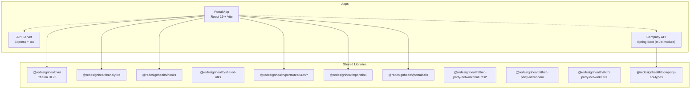
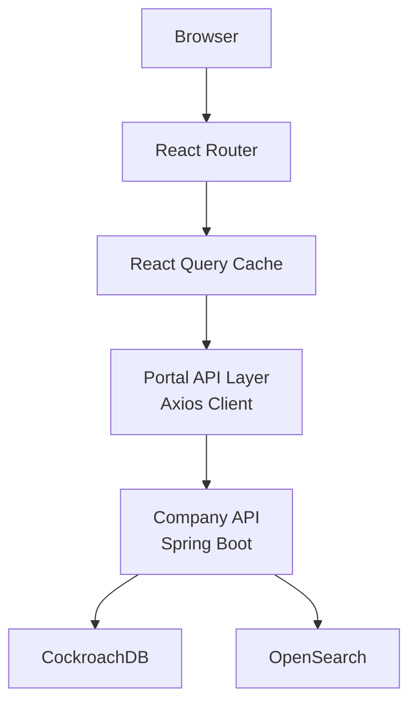
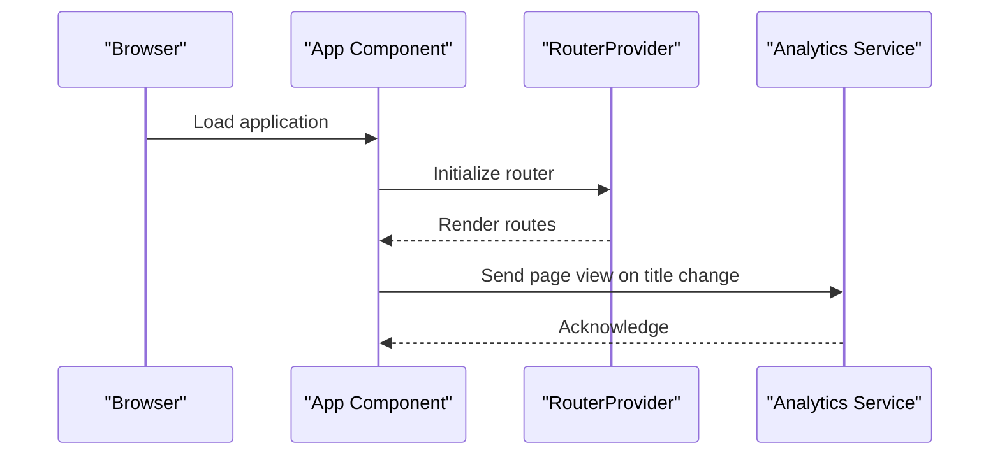
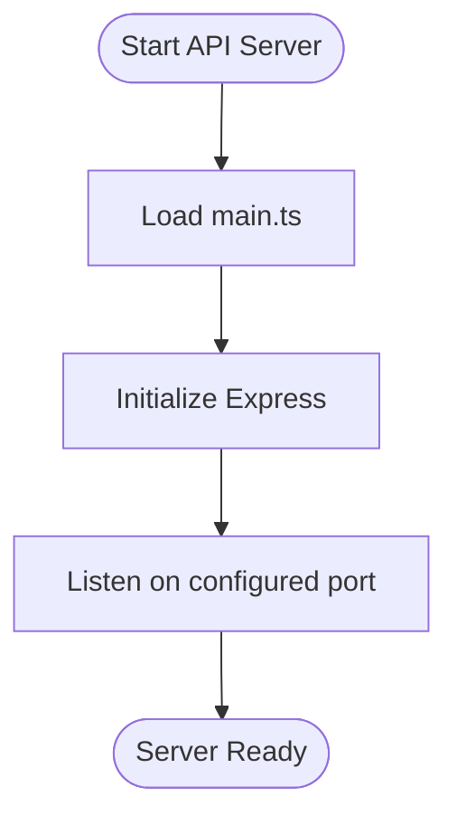
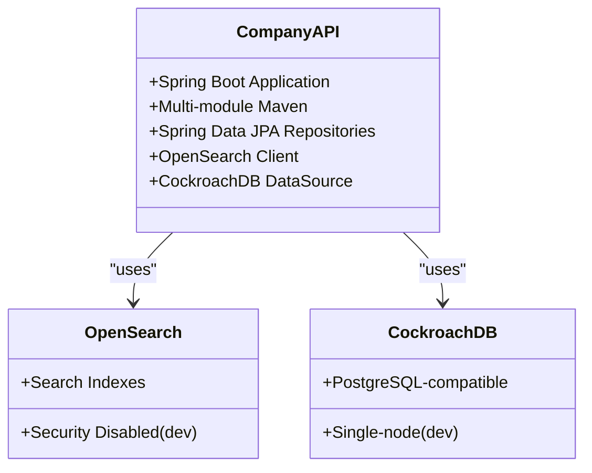
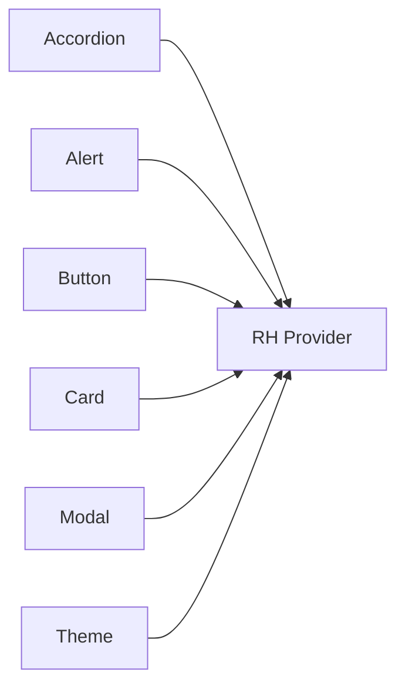
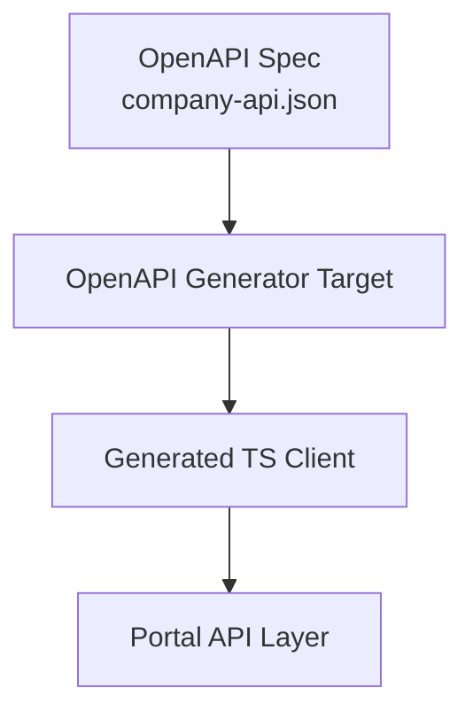
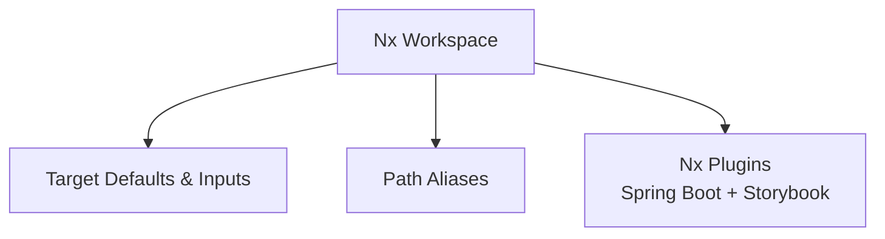
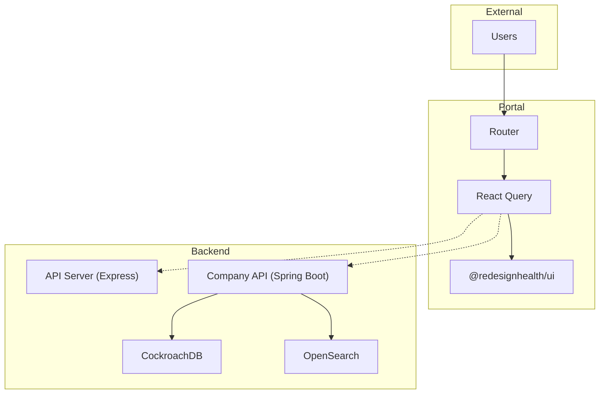

# Architecture & Design

<cite>
**Referenced Files in This Document**
- [README.md](file://README.md)
- [nx.json](file://nx.json)
- [package.json](file://package.json)
- [tsconfig.base.json](file://tsconfig.base.json)
- [apps/portal/project.json](file://apps/portal/project.json)
- [apps/portal/proxy.conf.json](file://apps/portal/proxy.conf.json)
- [apps/portal/src/app/app.tsx](file://apps/portal/src/app/app.tsx)
- [apps/api-server/project.json](file://apps/api-server/project.json)
- [apps/api-server/src/main.ts](file://apps/api-server/src/main.ts)
- [apps/company-api/project.json](file://apps/company-api/project.json)
- [apps/company-api/docker-compose.yml](file://apps/company-api/docker-compose.yml)
- [apps/company-api/doc/architecture/decisions/0002-java-and-spring.md](file://apps/company-api/doc/architecture/decisions/0002-java-and-spring.md)
- [apps/company-api/doc/architecture/decisions/0005-orm.md](file://apps/company-api/doc/architecture/decisions/0005-orm.md)
- [apps/company-api/doc/architecture/decisions/0007-multi-module-project.md](file://apps/company-api/doc/architecture/decisions/0007-multi-module-project.md)
- [libs/shared/ui/src/index.ts](file://libs/shared/ui/src/index.ts)
- [libs/company-api-types/package.json](file://libs/company-api-types/package.json)
- [contracts/company-api/v1/company-api.json](file://contracts/company-api/v1/company-api.json)
- [tools/forgekit-nx-storybook/README.md](file://tools/forgekit-nx-storybook/README.md)
</cite>

## Table of Contents
1. [Introduction](#introduction)
2. [Project Structure](#project-structure)
3. [Core Components](#core-components)
4. [Architecture Overview](#architecture-overview)
5. [Detailed Component Analysis](#detailed-component-analysis)
6. [Dependency Analysis](#dependency-analysis)
7. [Performance Considerations](#performance-considerations)
8. [Troubleshooting Guide](#troubleshooting-guide)
9. [Conclusion](#conclusion)
10. [Appendices](#appendices)

## Introduction
This document describes the architectural design and implementation patterns of the Redesign Health Nx monorepo. It explains the Nx workspace organization, layered architecture (presentation, business logic, data access), microservices approach using Spring Boot for backend services and React for frontend, and the integration points between applications. Cross-cutting concerns such as authentication, authorization, and observability are addressed alongside technology stack choices, trade-offs, and constraints.

## Project Structure
The repository follows an Nx workspace with a clear separation of applications (apps/) and shared libraries (libs/). Applications include:
- Portal: A React 19 SPA built with Vite and served via Nx dev server, configured with a proxy to the API server.
- API Server: A mock Express server started via tsx for local development.
- Company API: A Spring Boot microservice packaged as a multi-module Maven project, orchestrated with Docker Compose for local dependencies.

Shared libraries provide reusable UI, analytics, hooks, utilities, and feature modules for both the Portal and third-party network applications.

**Diagram sources**
- [apps/portal/project.json:1-138](file://apps/portal/project.json#L1-L138)
- [apps/api-server/project.json](file://apps/api-server/project.json)
- [apps/company-api/project.json:1-74](file://apps/company-api/project.json#L1-L74)
- [libs/shared/ui/src/index.ts:1-84](file://libs/shared/ui/src/index.ts#L1-L84)
- [libs/company-api-types/package.json:1-5](file://libs/company-api-types/package.json#L1-L5)

**Section sources**
- [README.md:41-70](file://README.md#L41-L70)
- [nx.json:1-149](file://nx.json#L1-L149)
- [tsconfig.base.json:20-91](file://tsconfig.base.json#L20-L91)

## Core Components
- Presentation layer (Portal): React application with routing, analytics integration, and a design system powered by Chakra UI v3. Path aliases enable modular imports from shared libraries and feature modules.
- Business logic: Implemented as React Query data loaders and typed API clients generated from OpenAPI specifications. The Portal project includes targets to regenerate client code from remote or local Company API OpenAPI specs.
- Data access: Spring Boot microservice with Spring Data JPA/Hibernate for persistence, OpenSearch for search, and CockroachDB for relational data. The project is structured as a multi-module Maven project to separate concerns and enable independent builds.

Key architectural patterns observed:
- Repository pattern: Used in the Spring Boot application via Spring Data JPA repositories for encapsulating data access logic.
- Factory pattern: Observed in the design system exports and feature module organization, enabling modular composition and consistent component creation.
- Observer pattern: Applied through React Query’s caching and invalidation mechanisms, and analytics page view tracking via Helmet state changes.

Cross-cutting concerns:
- Authentication and authorization: Managed via external identity providers and environment-driven configuration in the Portal. The Spring Boot service integrates with AWS Secrets Manager and exposes REST endpoints for company-related operations.
- Monitoring and observability: Vercel Speed Insights integration in the Portal, and Prometheus configuration present in the workspace for metrics collection.

**Section sources**
- [apps/portal/src/app/app.tsx:1-45](file://apps/portal/src/app/app.tsx#L1-L45)
- [apps/portal/project.json:91-110](file://apps/portal/project.json#L91-L110)
- [apps/company-api/doc/architecture/decisions/0005-orm.md:1-31](file://apps/company-api/doc/architecture/decisions/0005-orm.md#L1-L31)
- [apps/company-api/doc/architecture/decisions/0002-java-and-spring.md:1-22](file://apps/company-api/doc/architecture/decisions/0002-java-and-spring.md#L1-L22)
- [apps/company-api/doc/architecture/decisions/0007-multi-module-project.md:1-21](file://apps/company-api/doc/architecture/decisions/0007-multi-module-project.md#L1-L21)
- [libs/shared/ui/src/index.ts:1-84](file://libs/shared/ui/src/index.ts#L1-L84)

## Architecture Overview
The system employs a layered architecture:
- Presentation: React SPA with feature modules and a shared UI library.
- Business logic: Data fetching, caching, and state management via React Query and typed API clients.
- Data access: Spring Boot microservice with Spring Data JPA repositories, OpenSearch, and CockroachDB.

Integration points:
- Portal communicates with the API server during development and with the Company API in production via a generated Axios client.
- The Company API is containerized and can be run locally with Docker Compose, which provisions CockroachDB and OpenSearch.

**Diagram sources**
- [apps/portal/proxy.conf.json:1-7](file://apps/portal/proxy.conf.json#L1-L7)
- [apps/portal/project.json:91-110](file://apps/portal/project.json#L91-L110)
- [apps/company-api/docker-compose.yml:1-82](file://apps/company-api/docker-compose.yml#L1-L82)

**Section sources**
- [apps/portal/proxy.conf.json:1-7](file://apps/portal/proxy.conf.json#L1-L7)
- [apps/portal/project.json:91-110](file://apps/portal/project.json#L91-L110)
- [apps/company-api/docker-compose.yml:1-82](file://apps/company-api/docker-compose.yml#L1-L82)

## Detailed Component Analysis

### Portal Application
The Portal is a React 19 application built with Vite. It integrates analytics via Helmet and Speed Insights, and uses a design system library for UI components. Routing is handled by React Router, and the app supports hot module replacement during development.

**Diagram sources**
- [apps/portal/src/app/app.tsx:26-42](file://apps/portal/src/app/app.tsx#L26-L42)

**Section sources**
- [apps/portal/src/app/app.tsx:1-45](file://apps/portal/src/app/app.tsx#L1-L45)
- [apps/portal/project.json:1-138](file://apps/portal/project.json#L1-L138)

### API Server (Mock)
The API server is a lightweight Express application started via tsx for local development. The Portal’s proxy configuration forwards API requests to this server during development.

**Diagram sources**
- [apps/api-server/src/main.ts](file://apps/api-server/src/main.ts)

**Section sources**
- [apps/api-server/project.json](file://apps/api-server/project.json)
- [apps/portal/proxy.conf.json:1-7](file://apps/portal/proxy.conf.json#L1-L7)

### Company API (Spring Boot Microservice)
The Company API is a Spring Boot microservice with a multi-module Maven structure. It uses Spring Data JPA/Hibernate for persistence, OpenSearch for search capabilities, and CockroachDB for relational storage. Docker Compose orchestrates local dependencies.

**Diagram sources**
- [apps/company-api/project.json:1-74](file://apps/company-api/project.json#L1-L74)
- [apps/company-api/docker-compose.yml:1-82](file://apps/company-api/docker-compose.yml#L1-L82)
- [apps/company-api/doc/architecture/decisions/0005-orm.md:1-31](file://apps/company-api/doc/architecture/decisions/0005-orm.md#L1-L31)
- [apps/company-api/doc/architecture/decisions/0007-multi-module-project.md:1-21](file://apps/company-api/doc/architecture/decisions/0007-multi-module-project.md#L1-L21)

**Section sources**
- [apps/company-api/project.json:1-74](file://apps/company-api/project.json#L1-L74)
- [apps/company-api/docker-compose.yml:1-82](file://apps/company-api/docker-compose.yml#L1-L82)
- [apps/company-api/doc/architecture/decisions/0002-java-and-spring.md:1-22](file://apps/company-api/doc/architecture/decisions/0002-java-and-spring.md#L1-L22)
- [apps/company-api/doc/architecture/decisions/0005-orm.md:1-31](file://apps/company-api/doc/architecture/decisions/0005-orm.md#L1-L31)
- [apps/company-api/doc/architecture/decisions/0007-multi-module-project.md:1-21](file://apps/company-api/doc/architecture/decisions/0007-multi-module-project.md#L1-L21)

### Shared UI Library (@redesignhealth/ui)
The shared UI library exports a comprehensive set of Chakra UI v3 components and hooks. It enables consistent theming and component composition across applications.

**Diagram sources**
- [libs/shared/ui/src/index.ts:1-84](file://libs/shared/ui/src/index.ts#L1-L84)

**Section sources**
- [libs/shared/ui/src/index.ts:1-84](file://libs/shared/ui/src/index.ts#L1-L84)

### Company API Types and OpenAPI Client Generation
The Portal project includes targets to generate typed API clients from the Company API’s OpenAPI specification. This ensures type-safe integration and reduces coupling to raw HTTP endpoints.

**Diagram sources**
- [apps/portal/project.json:91-110](file://apps/portal/project.json#L91-L110)
- [contracts/company-api/v1/company-api.json](file://contracts/company-api/v1/company-api.json)

**Section sources**
- [apps/portal/project.json:91-110](file://apps/portal/project.json#L91-L110)
- [libs/company-api-types/package.json:1-5](file://libs/company-api-types/package.json#L1-L5)

## Dependency Analysis
The Nx workspace enforces dependency management through named inputs, target defaults, and path aliases. The default project is Portal, and plugins integrate Spring Boot and Storybook toolchains. Path aliases simplify imports across shared libraries and feature modules.

**Diagram sources**
- [nx.json:8-72](file://nx.json#L8-L72)
- [tsconfig.base.json:20-91](file://tsconfig.base.json#L20-L91)
- [package.json:109-126](file://package.json#L109-L126)

**Section sources**
- [nx.json:1-149](file://nx.json#L1-L149)
- [tsconfig.base.json:20-91](file://tsconfig.base.json#L20-L91)
- [package.json:109-126](file://package.json#L109-L126)

## Performance Considerations
- Build caching and incremental builds are enabled via Nx target defaults and named inputs, reducing CI time and developer feedback loops.
- Vite-based development server provides fast HMR and optimized production builds.
- React Query’s caching and background refetching minimize redundant network calls and improve perceived performance.
- Spring Boot multi-module structure improves build isolation and enables targeted deployments.

[No sources needed since this section provides general guidance]

## Troubleshooting Guide
Common areas to check:
- Development proxy misconfiguration: Verify the Portal proxy forwards API traffic to the correct host/port.
- OpenAPI client generation failures: Ensure the OpenAPI spec URL is reachable and the generator target runs without errors.
- Spring Boot service startup: Confirm Docker Compose dependencies are healthy and environment variables are set.
- Analytics integration: Validate page view events are triggered after dynamic titles are set in Helmet.

**Section sources**
- [apps/portal/proxy.conf.json:1-7](file://apps/portal/proxy.conf.json#L1-L7)
- [apps/portal/project.json:91-110](file://apps/portal/project.json#L91-L110)
- [apps/company-api/docker-compose.yml:1-82](file://apps/company-api/docker-compose.yml#L1-L82)

## Conclusion
The Redesign Health monorepo leverages Nx to organize a scalable full-stack architecture. The Portal application benefits from a cohesive design system and typed API integrations, while the Spring Boot microservice provides robust data access and search capabilities. Cross-cutting concerns such as analytics and observability are integrated thoughtfully, and architectural decisions emphasize maintainability, modularity, and developer productivity.

[No sources needed since this section summarizes without analyzing specific files]

## Appendices

### System Context Diagram
This diagram shows how the Portal, API server, and Company API interact within the broader platform ecosystem.

**Diagram sources**
- [apps/portal/src/app/app.tsx:1-45](file://apps/portal/src/app/app.tsx#L1-L45)
- [apps/portal/proxy.conf.json:1-7](file://apps/portal/proxy.conf.json#L1-L7)
- [apps/api-server/src/main.ts](file://apps/api-server/src/main.ts)
- [apps/company-api/docker-compose.yml:1-82](file://apps/company-api/docker-compose.yml#L1-L82)

### Architectural Decisions Summary
- Java and Spring: Chosen for JVM ecosystem familiarity and enterprise-grade features.
- ORM: Spring Data JPA/Hibernate selected for developer experience and caching.
- Multi-module project: Enables separation of concerns and independent builds.

**Section sources**
- [apps/company-api/doc/architecture/decisions/0002-java-and-spring.md:1-22](file://apps/company-api/doc/architecture/decisions/0002-java-and-spring.md#L1-L22)
- [apps/company-api/doc/architecture/decisions/0005-orm.md:1-31](file://apps/company-api/doc/architecture/decisions/0005-orm.md#L1-L31)
- [apps/company-api/doc/architecture/decisions/0007-multi-module-project.md:1-21](file://apps/company-api/doc/architecture/decisions/0007-multi-module-project.md#L1-L21)