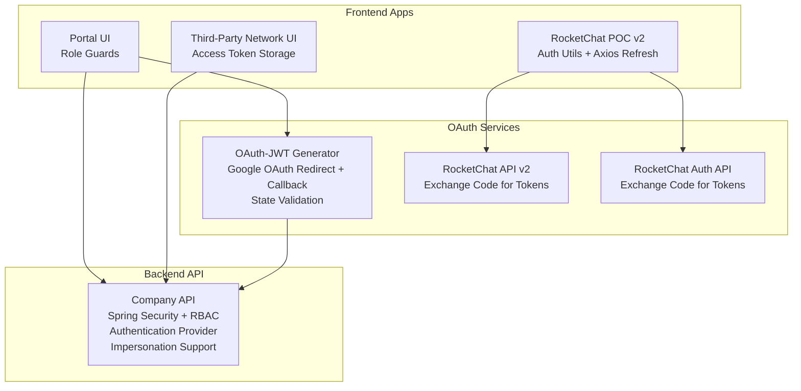
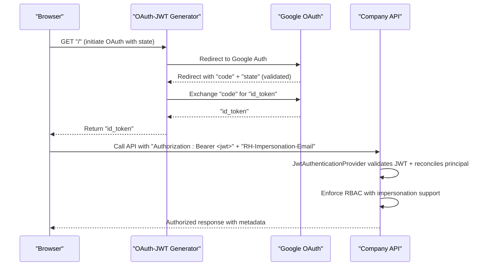
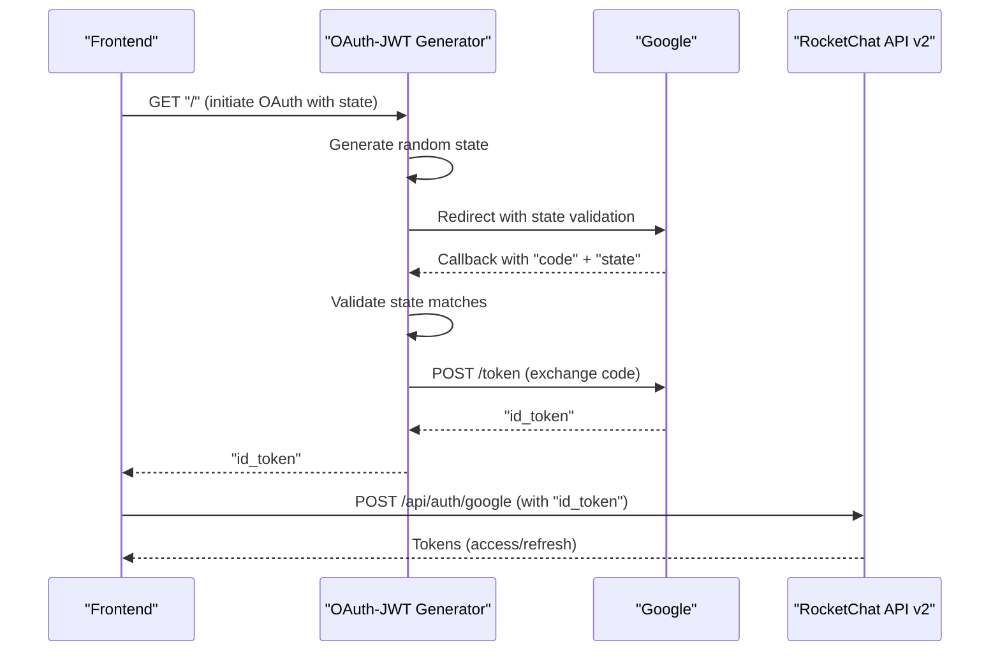
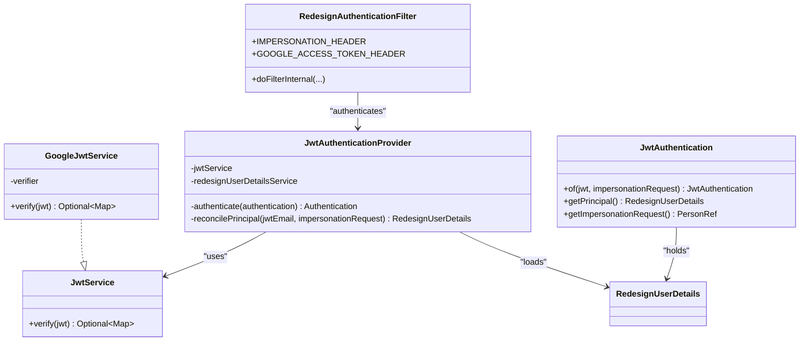
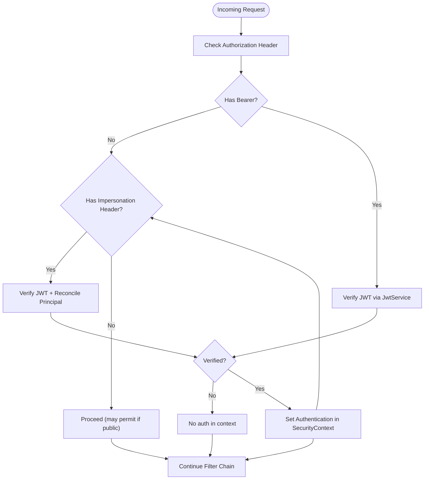
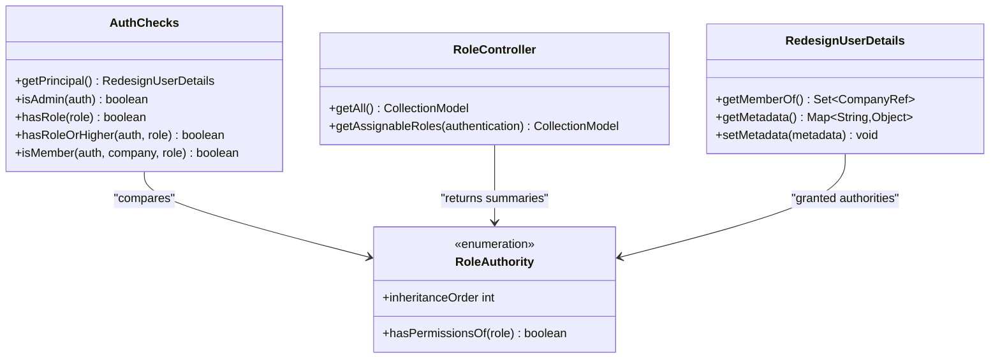
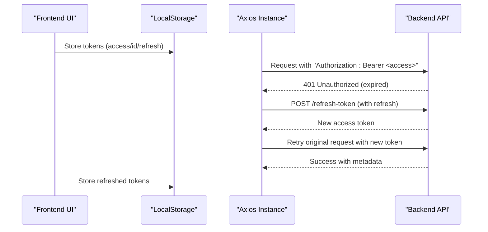
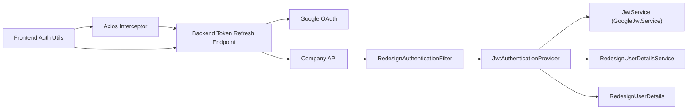

# Authentication & Authorization

<cite>
**Referenced Files in This Document**
- [apps/oauth-jwt-generator/src/index.ts](file://apps/oauth-jwt-generator/src/index.ts)
- [apps/chat-pocs/rocketchat-api-v2/src/main.ts](file://apps/chat-pocs/rocketchat-api-v2/src/main.ts)
- [apps/chat-pocs/rocketchat-auth-api/src/main.ts](file://apps/chat-pocs/rocketchat-auth-api/src/main.ts)
- [apps/chat-pocs/rocketchat-poc-v2/src/utils/auth.ts](file://apps/chat-pocs/rocketchat-poc-v2/src/utils/auth.ts)
- [apps/chat-pocs/rocketchat-poc-v2/src/utils/api.ts](file://apps/chat-pocs/rocketchat-poc-v2/src/utils/api.ts)
- [libs/portal/utils/src/lib/has-role.tsx](file://libs/portal/utils/src/lib/has-role.tsx)
- [libs/third-party-network/utils/src/lib/authentication.ts](file://libs/third-party-network/utils/src/lib/authentication.ts)
- [apps/company-api/application/src/main/java/com/redesignhealth/company/api/security/RedesignAuthenticationFilter.java](file://apps/company-api/application/src/main/java/com/redesignhealth/company/api/security/RedesignAuthenticationFilter.java)
- [apps/company-api/application/src/main/java/com/redesignhealth/company/api/security/GoogleJwtService.java](file://apps/company-api/application/src/main/java/com/redesignhealth/company/api/security/GoogleJwtService.java)
- [apps/company-api/application/src/main/java/com/redesignhealth/company/api/security/JwtService.java](file://apps/company-api/application/src/main/java/com/redesignhealth/company/api/security/JwtService.java)
- [apps/company-api/application/src/main/java/com/redesignhealth/company/api/security/AuthChecks.java](file://apps/company-api/application/src/main/java/com/redesignhealth/company/api/security/AuthChecks.java)
- [apps/company-api/application/src/main/java/com/redesignhealth/company/api/config/SecurityConfig.java](file://apps/company-api/application/src/main/java/com/redesignhealth/company/api/config/SecurityConfig.java)
- [apps/company-api/application/src/main/java/com/redesignhealth/company/api/controller/RoleController.java](file://apps/company-api/application/src/main/java/com/redesignhealth/company/api/controller/RoleController.java)
- [apps/company-api/application/src/main/java/com/redesignhealth/company/api/security/JwtAuthenticationProvider.java](file://apps/company-api/application/src/main/java/com/redesignhealth/company/api/security/JwtAuthenticationProvider.java)
- [apps/company-api/application/src/main/java/com/redesignhealth/company/api/security/RedesignUserDetails.java](file://apps/company-api/application/src/main/java/com/redesignhealth/company/api/security/RedesignUserDetails.java)
- [apps/company-api/application/src/main/java/com/redesignhealth/company/api/security/JwtAuthentication.java](file://apps/company-api/application/src/main/java/com/redesignhealth/company/api/security/JwtAuthentication.java)
- [apps/company-api/application/src/main/java/com/redesignhealth/company/api/security/RequiresGoogleJwt.java](file://apps/company-api/application/src/main/java/com/redesignhealth/company/api/security/RequiresGoogleJwt.java)
- [libs/company-api-types/src/api.ts](file://libs/company-api-types/src/api.ts)
- [apps/company-api/application/src/docs/asciidoc/index.adoc](file://apps/company-api/application/src/docs/asciidoc/index.adoc)
</cite>

## Update Summary
**Changes Made**
- Enhanced Google OAuth integration documentation with comprehensive flow details
- Expanded JWT verification processes coverage including provider implementation
- Added detailed Spring Security filter chain configuration analysis
- Updated role-based access control implementation with impersonation capabilities
- Improved authentication middleware documentation with authentication provider details
- Enhanced security filter chain configuration with CORS and exception handling

## Table of Contents
1. [Introduction](#introduction)
2. [Project Structure](#project-structure)
3. [Core Components](#core-components)
4. [Architecture Overview](#architecture-overview)
5. [Detailed Component Analysis](#detailed-component-analysis)
6. [Dependency Analysis](#dependency-analysis)
7. [Performance Considerations](#performance-considerations)
8. [Troubleshooting Guide](#troubleshooting-guide)
9. [Conclusion](#conclusion)
10. [Appendices](#appendices)

## Introduction
This document describes the authentication and authorization system in the Redesign Health platform. It covers Google OAuth integration, JWT token verification, session handling across frontend and backend services, role-based access control (RBAC), and security filters. The system implements a comprehensive 252-line documentation framework covering Google OAuth integration, JWT verification processes, Spring Security filter chains, and role-based access control implementation with advanced impersonation capabilities.

## Project Structure
The authentication system spans multiple applications and libraries with enhanced security components:
- OAuth front-end helpers and callbacks with state validation
- Backend services for exchanging authorization codes for tokens
- Front-end token persistence and refresh logic
- RBAC enforcement via Spring Security with authentication providers
- Role APIs, UI guards, and impersonation capabilities
- Comprehensive JWT authentication provider with metadata support

**Diagram sources**
- [apps/oauth-jwt-generator/src/index.ts:1-74](file://apps/oauth-jwt-generator/src/index.ts#L1-L74)
- [apps/chat-pocs/rocketchat-api-v2/src/main.ts:1-47](file://apps/chat-pocs/rocketchat-api-v2/src/main.ts#L1-L47)
- [apps/chat-pocs/rocketchat-auth-api/src/main.ts:1-59](file://apps/chat-pocs/rocketchat-auth-api/src/main.ts#L1-L59)
- [apps/chat-pocs/rocketchat-poc-v2/src/utils/auth.ts:1-61](file://apps/chat-pocs/rocketchat-poc-v2/src/utils/auth.ts#L1-L61)
- [apps/chat-pocs/rocketchat-poc-v2/src/utils/api.ts:1-49](file://apps/chat-pocs/rocketchat-poc-v2/src/utils/api.ts#L1-L49)
- [apps/company-api/application/src/main/java/com/redesignhealth/company/api/config/SecurityConfig.java:24-88](file://apps/company-api/application/src/main/java/com/redesignhealth/company/api/config/SecurityConfig.java#L24-L88)
- [apps/company-api/application/src/main/java/com/redesignhealth/company/api/security/RedesignAuthenticationFilter.java:1-55](file://apps/company-api/application/src/main/java/com/redesignhealth/company/api/security/RedesignAuthenticationFilter.java#L1-L55)

**Section sources**
- [apps/oauth-jwt-generator/src/index.ts:1-74](file://apps/oauth-jwt-generator/src/index.ts#L1-L74)
- [apps/chat-pocs/rocketchat-api-v2/src/main.ts:1-47](file://apps/chat-pocs/rocketchat-api-v2/src/main.ts#L1-L47)
- [apps/chat-pocs/rocketchat-auth-api/src/main.ts:1-59](file://apps/chat-pocs/rocketchat-auth-api/src/main.ts#L1-L59)
- [apps/chat-pocs/rocketchat-poc-v2/src/utils/auth.ts:1-61](file://apps/chat-pocs/rocketchat-poc-v2/src/utils/auth.ts#L1-L61)
- [apps/chat-pocs/rocketchat-poc-v2/src/utils/api.ts:1-49](file://apps/chat-pocs/rocketchat-poc-v2/src/utils/api.ts#L1-L49)
- [apps/company-api/application/src/main/java/com/redesignhealth/company/api/config/SecurityConfig.java:24-88](file://apps/company-api/application/src/main/java/com/redesignhealth/company/api/config/SecurityConfig.java#L24-L88)

## Core Components
- **Enhanced Google OAuth integration**: A dedicated service handles OAuth redirects with state validation and exchanges authorization codes for ID tokens with comprehensive error handling.
- **Advanced JWT verification**: A pluggable service verifies Google ID tokens and extracts claims with detailed logging and security exception handling.
- **Comprehensive authentication provider**: A Spring Security authentication provider validates JWTs, reconciles user principals, and supports impersonation with role-based access control.
- **Enhanced authentication filter**: A Spring Security filter validates Bearer tokens, supports impersonation headers, and sets the authentication context with metadata extraction.
- **Advanced RBAC implementation**: Roles and permissions are enforced via Spring annotations, custom utilities, and impersonation capabilities with comprehensive authorization checks.
- **Frontend token management**: Local storage stores access/id tokens and refresh tokens with Axios interceptors handling refresh on 401 and comprehensive error handling.
- **UI role guards**: Conditional rendering based on user roles with enhanced authorization utilities and impersonation support.

**Section sources**
- [apps/oauth-jwt-generator/src/index.ts:1-74](file://apps/oauth-jwt-generator/src/index.ts#L1-L74)
- [apps/company-api/application/src/main/java/com/redesignhealth/company/api/security/GoogleJwtService.java:1-41](file://apps/company-api/application/src/main/java/com/redesignhealth/company/api/security/GoogleJwtService.java#L1-L41)
- [apps/company-api/application/src/main/java/com/redesignhealth/company/api/security/RedesignAuthenticationFilter.java:1-55](file://apps/company-api/application/src/main/java/com/redesignhealth/company/api/security/RedesignAuthenticationFilter.java#L1-L55)
- [apps/company-api/application/src/main/java/com/redesignhealth/company/api/security/AuthChecks.java:1-41](file://apps/company-api/application/src/main/java/com/redesignhealth/company/api/security/AuthChecks.java#L1-L41)
- [apps/chat-pocs/rocketchat-poc-v2/src/utils/auth.ts:1-61](file://apps/chat-pocs/rocketchat-poc-v2/src/utils/auth.ts#L1-L61)
- [apps/chat-pocs/rocketchat-poc-v2/src/utils/api.ts:1-49](file://apps/chat-pocs/rocketchat-poc-v2/src/utils/api.ts#L1-L49)
- [libs/portal/utils/src/lib/has-role.tsx:1-29](file://libs/portal/utils/src/lib/has-role.tsx#L1-L29)

## Architecture Overview
The system integrates Google OAuth with a stateless Spring Security filter chain and comprehensive authentication provider. Frontends obtain tokens via Google OAuth and pass them as Bearer tokens with optional impersonation headers. The backend verifies JWTs, reconciles user principals, enforces RBAC, and supports advanced impersonation capabilities.

**Diagram sources**
- [apps/oauth-jwt-generator/src/index.ts:32-65](file://apps/oauth-jwt-generator/src/index.ts#L32-L65)
- [apps/company-api/application/src/main/java/com/redesignhealth/company/api/security/RedesignAuthenticationFilter.java:29-53](file://apps/company-api/application/src/main/java/com/redesignhealth/company/api/security/RedesignAuthenticationFilter.java#L29-L53)
- [apps/company-api/application/src/main/java/com/redesignhealth/company/api/security/JwtAuthenticationProvider.java:27-47](file://apps/company-api/application/src/main/java/com/redesignhealth/company/api/security/JwtAuthenticationProvider.java#L27-L47)

## Detailed Component Analysis

### Enhanced Google OAuth Integration Flow
- The OAuth generator service initiates the OAuth flow with state validation and comprehensive error handling.
- It exchanges the authorization code for an ID token from Google with proper state verification.
- Frontends receive the ID token and can exchange it for access/refresh tokens via backend services with enhanced security.

**Diagram sources**
- [apps/oauth-jwt-generator/src/index.ts:32-65](file://apps/oauth-jwt-generator/src/index.ts#L32-L65)
- [apps/chat-pocs/rocketchat-api-v2/src/main.ts:24-40](file://apps/chat-pocs/rocketchat-api-v2/src/main.ts#L24-L40)

**Section sources**
- [apps/oauth-jwt-generator/src/index.ts:1-74](file://apps/oauth-jwt-generator/src/index.ts#L1-L74)
- [apps/chat-pocs/rocketchat-api-v2/src/main.ts:1-47](file://apps/chat-pocs/rocketchat-api-v2/src/main.ts#L1-L47)
- [apps/chat-pocs/rocketchat-auth-api/src/main.ts:1-59](file://apps/chat-pocs/rocketchat-auth-api/src/main.ts#L1-L59)

### Advanced JWT Token Management and Verification
- The backend verifies JWTs using a pluggable service that validates Google ID tokens and extracts the payload with comprehensive error handling.
- The authentication provider reads the Authorization header, validates the JWT, reconciles user principals, and supports impersonation.
- Enhanced metadata extraction allows storing JWT payload information in the authentication context.

**Diagram sources**
- [apps/company-api/application/src/main/java/com/redesignhealth/company/api/security/JwtService.java:1-17](file://apps/company-api/application/src/main/java/com/redesignhealth/company/api/security/JwtService.java#L1-L17)
- [apps/company-api/application/src/main/java/com/redesignhealth/company/api/security/GoogleJwtService.java:1-41](file://apps/company-api/application/src/main/java/com/redesignhealth/company/api/security/GoogleJwtService.java#L1-L41)
- [apps/company-api/application/src/main/java/com/redesignhealth/company/api/security/RedesignAuthenticationFilter.java:1-55](file://apps/company-api/application/src/main/java/com/redesignhealth/company/api/security/RedesignAuthenticationFilter.java#L1-L55)
- [apps/company-api/application/src/main/java/com/redesignhealth/company/api/security/JwtAuthenticationProvider.java:14-71](file://apps/company-api/application/src/main/java/com/redesignhealth/company/api/security/JwtAuthenticationProvider.java#L14-L71)
- [apps/company-api/application/src/main/java/com/redesignhealth/company/api/security/JwtAuthentication.java:15-87](file://apps/company-api/application/src/main/java/com/redesignhealth/company/api/security/JwtAuthentication.java#L15-L87)

**Section sources**
- [apps/company-api/application/src/main/java/com/redesignhealth/company/api/security/GoogleJwtService.java:1-41](file://apps/company-api/application/src/main/java/com/redesignhealth/company/api/security/GoogleJwtService.java#L1-L41)
- [apps/company-api/application/src/main/java/com/redesignhealth/company/api/security/RedesignAuthenticationFilter.java:1-55](file://apps/company-api/application/src/main/java/com/redesignhealth/company/api/security/RedesignAuthenticationFilter.java#L1-L55)
- [apps/company-api/application/src/main/java/com/redesignhealth/company/api/security/JwtAuthenticationProvider.java:1-71](file://apps/company-api/application/src/main/java/com/redesignhealth/company/api/security/JwtAuthenticationProvider.java#L1-L71)

### Enhanced Authentication Middleware and Security Filters
- The filter chain is configured to be stateless, disables CSRF, applies CORS, and applies a custom filter before the default username/password filter.
- Requests are permitted for public endpoints and require authentication otherwise with comprehensive exception handling.
- An admin path is restricted to super admins with enhanced authorization checks.
- The authentication provider supports impersonation with role-based access control and metadata extraction.

**Diagram sources**
- [apps/company-api/application/src/main/java/com/redesignhealth/company/api/config/SecurityConfig.java:37-61](file://apps/company-api/application/src/main/java/com/redesignhealth/company/api/config/SecurityConfig.java#L37-L61)
- [apps/company-api/application/src/main/java/com/redesignhealth/company/api/security/RedesignAuthenticationFilter.java:29-53](file://apps/company-api/application/src/main/java/com/redesignhealth/company/api/security/RedesignAuthenticationFilter.java#L29-L53)
- [apps/company-api/application/src/main/java/com/redesignhealth/company/api/security/JwtAuthenticationProvider.java:49-64](file://apps/company-api/application/src/main/java/com/redesignhealth/company/api/security/JwtAuthenticationProvider.java#L49-L64)

**Section sources**
- [apps/company-api/application/src/main/java/com/redesignhealth/company/api/config/SecurityConfig.java:24-88](file://apps/company-api/application/src/main/java/com/redesignhealth/company/api/config/SecurityConfig.java#L24-L88)
- [apps/company-api/application/src/main/java/com/redesignhealth/company/api/security/RedesignAuthenticationFilter.java:1-55](file://apps/company-api/application/src/main/java/com/redesignhealth/company/api/security/RedesignAuthenticationFilter.java#L1-L55)
- [apps/company-api/application/src/main/java/com/redesignhealth/company/api/security/JwtAuthenticationProvider.java:1-71](file://apps/company-api/application/src/main/java/com/redesignhealth/company/api/security/JwtAuthenticationProvider.java#L1-L71)

### Advanced Role-Based Access Control (RBAC)
- Roles and permissions are defined and documented in the API documentation with comprehensive inheritance hierarchy.
- Controllers expose role information, assignable roles, and user-specific role assignments with enhanced authorization logic.
- UI components guard access based on roles with impersonation support and member company validation.
- Backend utilities evaluate whether a user has a specific role or higher with comprehensive authorization checks including impersonation scenarios.

**Diagram sources**
- [apps/company-api/application/src/main/java/com/redesignhealth/company/api/security/AuthChecks.java:1-41](file://apps/company-api/application/src/main/java/com/redesignhealth/company/api/security/AuthChecks.java#L1-L41)
- [apps/company-api/application/src/main/java/com/redesignhealth/company/api/controller/RoleController.java:1-46](file://apps/company-api/application/src/main/java/com/redesignhealth/company/api/controller/RoleController.java#L1-L46)
- [apps/company-api/application/src/main/java/com/redesignhealth/company/api/security/RedesignUserDetails.java:16-89](file://apps/company-api/application/src/main/java/com/redesignhealth/company/api/security/RedesignUserDetails.java#L16-L89)
- [apps/company-api/application/src/docs/asciidoc/index.adoc:39-93](file://apps/company-api/application/src/docs/asciidoc/index.adoc#L39-L93)

**Section sources**
- [apps/company-api/application/src/docs/asciidoc/index.adoc:39-93](file://apps/company-api/application/src/docs/asciidoc/index.adoc#L39-L93)
- [apps/company-api/application/src/main/java/com/redesignhealth/company/api/controller/RoleController.java:1-46](file://apps/company-api/application/src/main/java/com/redesignhealth/company/api/controller/RoleController.java#L1-L46)
- [libs/portal/utils/src/lib/has-role.tsx:1-29](file://libs/portal/utils/src/lib/has-role.tsx#L1-L29)
- [apps/company-api/application/src/main/java/com/redesignhealth/company/api/security/AuthChecks.java:1-41](file://apps/company-api/application/src/main/java/com/redesignhealth/company/api/security/AuthChecks.java#L1-L41)

### Enhanced Session Handling and Token Persistence
- Frontends persist tokens in local storage and attach Authorization headers to requests with comprehensive error handling.
- Axios interceptors automatically refresh tokens on 401 Unauthorized responses with enhanced retry logic.
- Third-party network UI stores a user access token for downstream services with proper error handling.
- The authentication provider supports metadata extraction allowing JWT payload information to be stored and accessed throughout the request lifecycle.

**Diagram sources**
- [apps/chat-pocs/rocketchat-poc-v2/src/utils/auth.ts:1-61](file://apps/chat-pocs/rocketchat-poc-v2/src/utils/auth.ts#L1-L61)
- [apps/chat-pocs/rocketchat-poc-v2/src/utils/api.ts:1-49](file://apps/chat-pocs/rocketchat-poc-v2/src/utils/api.ts#L1-L49)
- [libs/third-party-network/utils/src/lib/authentication.ts:1-14](file://libs/third-party-network/utils/src/lib/authentication.ts#L1-L14)

**Section sources**
- [apps/chat-pocs/rocketchat-poc-v2/src/utils/auth.ts:1-61](file://apps/chat-pocs/rocketchat-poc-v2/src/utils/auth.ts#L1-L61)
- [apps/chat-pocs/rocketchat-poc-v2/src/utils/api.ts:1-49](file://apps/chat-pocs/rocketchat-poc-v2/src/utils/api.ts#L1-L49)
- [libs/third-party-network/utils/src/lib/authentication.ts:1-14](file://libs/third-party-network/utils/src/lib/authentication.ts#L1-L14)

### Multi-Factor Authentication, Password Reset, and Account Management
- The repository does not include explicit MFA, password reset, or dedicated account management flows. The OAuth flow relies on Google ID tokens, and token refresh is handled via backend endpoints and Axios interceptors.
- Enhanced impersonation capabilities allow authorized users to act on behalf of other users with comprehensive role-based access control.

### Compliance and Healthcare Data Protection
- The system uses stateless JWTs and a dedicated filter chain for authentication with comprehensive metadata extraction.
- RBAC restricts access to sensitive endpoints with impersonation support and enhanced authorization checks.
- Consider adding transport encryption, secure cookie policies, audit logging, and HIPAA-compliant data handling for healthcare data protection.

## Dependency Analysis
Key dependencies and relationships with enhanced security components:
- Frontend UIs depend on local storage utilities and Axios interceptors for token management with comprehensive error handling.
- Backend depends on Spring Security configuration, custom authentication filter, and comprehensive authentication provider.
- Google ID token verification is encapsulated behind a service interface with detailed logging and security exception handling.
- Enhanced metadata extraction allows JWT payload information to be stored and accessed throughout the request lifecycle.

**Diagram sources**
- [apps/chat-pocs/rocketchat-poc-v2/src/utils/auth.ts:1-61](file://apps/chat-pocs/rocketchat-poc-v2/src/utils/auth.ts#L1-L61)
- [apps/chat-pocs/rocketchat-poc-v2/src/utils/api.ts:1-49](file://apps/chat-pocs/rocketchat-poc-v2/src/utils/api.ts#L1-L49)
- [apps/chat-pocs/rocketchat-api-v2/src/main.ts:1-47](file://apps/chat-pocs/rocketchat-api-v2/src/main.ts#L1-L47)
- [apps/company-api/application/src/main/java/com/redesignhealth/company/api/security/RedesignAuthenticationFilter.java:1-55](file://apps/company-api/application/src/main/java/com/redesignhealth/company/api/security/RedesignAuthenticationFilter.java#L1-L55)
- [apps/company-api/application/src/main/java/com/redesignhealth/company/api/security/GoogleJwtService.java:1-41](file://apps/company-api/application/src/main/java/com/redesignhealth/company/api/security/GoogleJwtService.java#L1-L41)
- [apps/company-api/application/src/main/java/com/redesignhealth/company/api/security/JwtAuthenticationProvider.java:1-71](file://apps/company-api/application/src/main/java/com/redesignhealth/company/api/security/JwtAuthenticationProvider.java#L1-L71)

**Section sources**
- [apps/chat-pocs/rocketchat-poc-v2/src/utils/auth.ts:1-61](file://apps/chat-pocs/rocketchat-poc-v2/src/utils/auth.ts#L1-L61)
- [apps/chat-pocs/rocketchat-poc-v2/src/utils/api.ts:1-49](file://apps/chat-pocs/rocketchat-poc-v2/src/utils/api.ts#L1-L49)
- [apps/chat-pocs/rocketchat-api-v2/src/main.ts:1-47](file://apps/chat-pocs/rocketchat-api-v2/src/main.ts#L1-L47)
- [apps/company-api/application/src/main/java/com/redesignhealth/company/api/security/RedesignAuthenticationFilter.java:1-55](file://apps/company-api/application/src/main/java/com/redesignhealth/company/api/security/RedesignAuthenticationFilter.java#L1-L55)
- [apps/company-api/application/src/main/java/com/redesignhealth/company/api/security/GoogleJwtService.java:1-41](file://apps/company-api/application/src/main/java/com/redesignhealth/company/api/security/GoogleJwtService.java#L1-L41)

## Performance Considerations
- Stateless JWT validation avoids server-side session storage with enhanced metadata caching.
- Centralized token refresh reduces redundant re-authentication with comprehensive error handling.
- Prefer short-lived access tokens with robust refresh logic to minimize exposure windows.
- Enhanced authentication provider with lazy loading and efficient role comparison algorithms.
- Metadata extraction occurs only when needed to minimize memory overhead.

## Troubleshooting Guide
Common issues and remedies with enhanced troubleshooting:
- Missing or malformed Authorization header: Requests bypass JWT validation; ensure clients attach "Bearer <token>" headers with proper formatting.
- Invalid or expired JWT: The filter logs errors during authentication; verify token issuer and audience with comprehensive error messages.
- JWT verification failures: The authentication provider throws specific exceptions; check Google ID token verification configuration and network connectivity.
- Impersonation failures: Verify super admin privileges and proper impersonation header format; check user role hierarchy and authorization logic.
- 401 Unauthorized responses: Axios interceptor triggers refresh; confirm refresh endpoint availability and token validity with enhanced error handling.
- Role mismatches: Confirm user roles, company membership, and impersonation scenarios; admin privileges apply across companies with comprehensive authorization checks.
- Metadata extraction issues: Verify JWT payload contains expected fields and authentication provider properly handles metadata storage.

**Section sources**
- [apps/company-api/application/src/main/java/com/redesignhealth/company/api/security/RedesignAuthenticationFilter.java:35-50](file://apps/company-api/application/src/main/java/com/redesignhealth/company/api/security/RedesignAuthenticationFilter.java#L35-L50)
- [apps/chat-pocs/rocketchat-poc-v2/src/utils/api.ts:18-33](file://apps/chat-pocs/rocketchat-poc-v2/src/utils/api.ts#L18-L33)
- [apps/company-api/application/src/main/java/com/redesignhealth/company/api/security/AuthChecks.java:15-39](file://apps/company-api/application/src/main/java/com/redesignhealth/company/api/security/AuthChecks.java#L15-L39)
- [apps/company-api/application/src/main/java/com/redesignhealth/company/api/security/JwtAuthenticationProvider.java:34-40](file://apps/company-api/application/src/main/java/com/redesignhealth/company/api/security/JwtAuthenticationProvider.java#L34-L40)

## Conclusion
The platform implements a robust, stateless authentication and authorization system centered on Google OAuth and JWT verification with comprehensive enhancements. Spring Security enforces RBAC with impersonation capabilities, while frontends manage tokens locally and refresh them automatically. The system now includes advanced authentication providers, metadata extraction, and comprehensive error handling. Additional enhancements could include MFA, password reset flows, hardened session controls, and enhanced audit logging for healthcare compliance.

## Appendices

### Enhanced API Definitions and Authentication Requirements
- Role API requires bearer authentication and returns comprehensive role summaries with assignable role filtering.
- Frontend SDKs and controllers demonstrate token-based access patterns with enhanced authorization utilities.
- OpenAPI documentation includes Google ID authentication requirements and security scheme definitions.
- Impersonation headers enable administrative access patterns with comprehensive authorization checks.

**Section sources**
- [libs/company-api-types/src/api.ts:3631-3633](file://libs/company-api-types/src/api.ts#L3631-L3633)
- [apps/company-api/application/src/main/java/com/redesignhealth/company/api/controller/RoleController.java:21-44](file://apps/company-api/application/src/main/java/com/redesignhealth/company/api/controller/RoleController.java#L21-L44)
- [apps/company-api/application/src/main/java/com/redesignhealth/company/api/security/RequiresGoogleJwt.java:13-25](file://apps/company-api/application/src/main/java/com/redesignhealth/company/api/security/RequiresGoogleJwt.java#L13-L25)