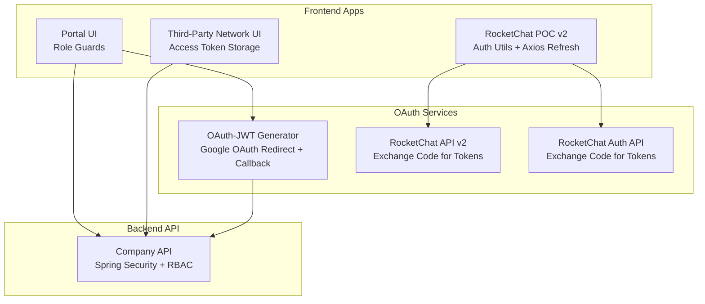
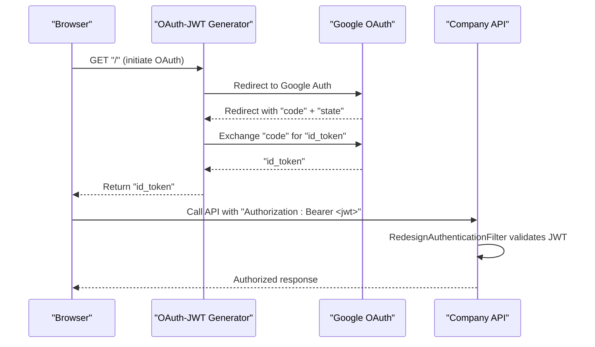
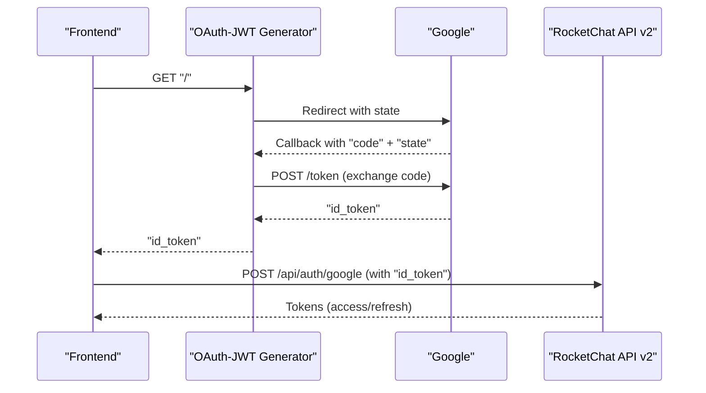
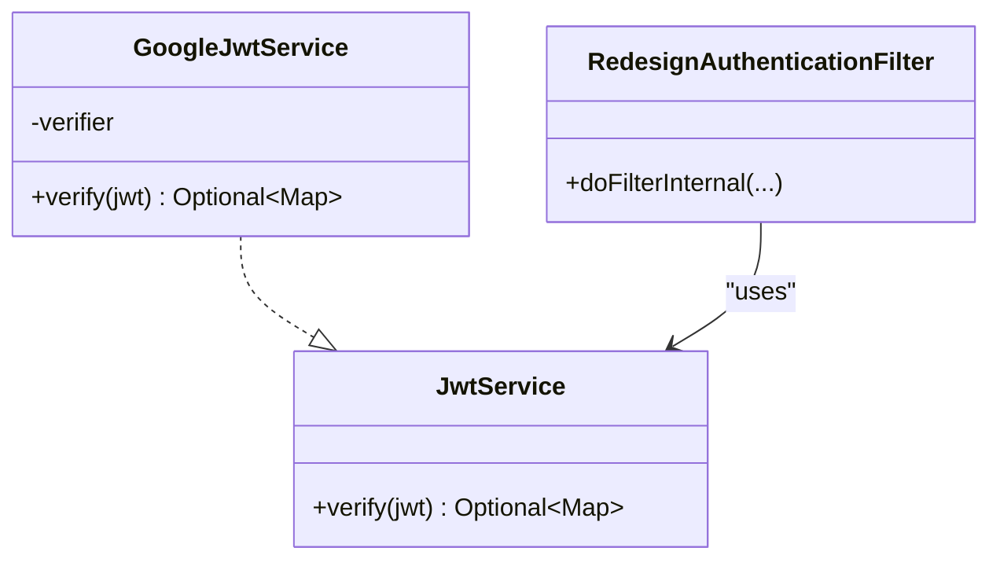
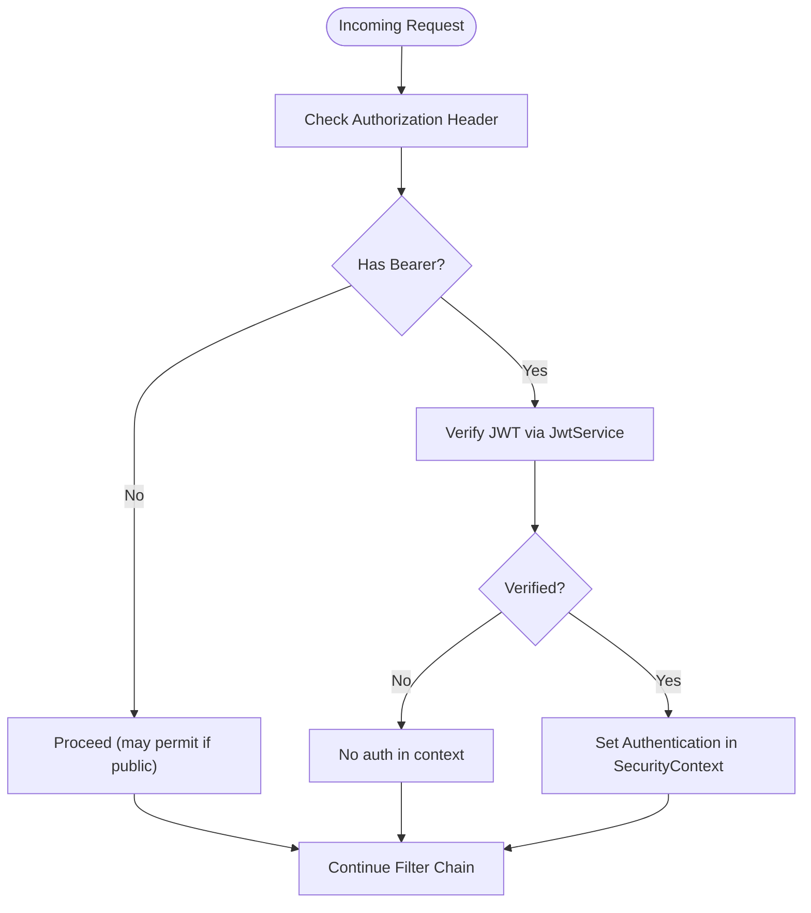
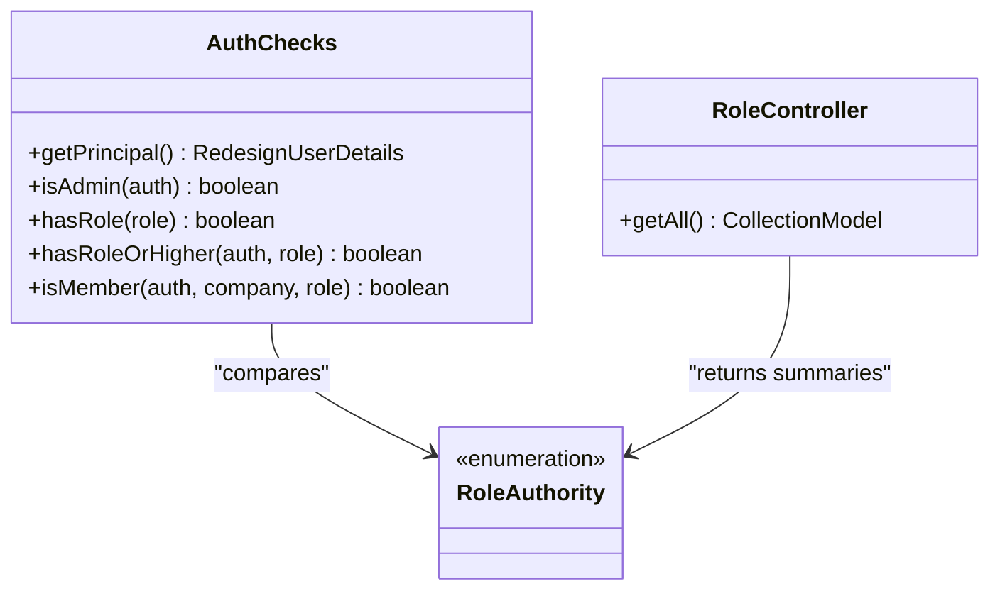
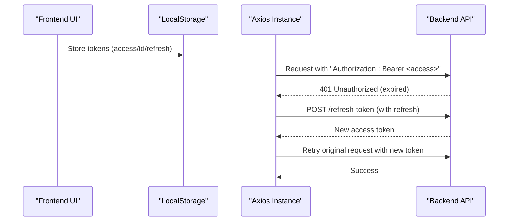
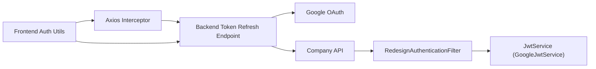

# Authentication & Authorization

<cite>
**Referenced Files in This Document**
- [apps/oauth-jwt-generator/src/index.ts](file://apps/oauth-jwt-generator/src/index.ts)
- [apps/chat-pocs/rocketchat-api-v2/src/main.ts](file://apps/chat-pocs/rocketchat-api-v2/src/main.ts)
- [apps/chat-pocs/rocketchat-auth-api/src/main.ts](file://apps/chat-pocs/rocketchat-auth-api/src/main.ts)
- [apps/chat-pocs/rocketchat-poc-v2/src/utils/auth.ts](file://apps/chat-pocs/rocketchat-poc-v2/src/utils/auth.ts)
- [apps/chat-pocs/rocketchat-poc-v2/src/utils/api.ts](file://apps/chat-pocs/rocketchat-poc-v2/src/utils/api.ts)
- [libs/portal/utils/src/lib/has-role.tsx](file://libs/portal/utils/src/lib/has-role.tsx)
- [libs/third-party-network/utils/src/lib/authentication.ts](file://libs/third-party-network/utils/src/lib/authentication.ts)
- [apps/company-api/application/src/main/java/com/redesignhealth/company/api/security/RedesignAuthenticationFilter.java](file://apps/company-api/application/src/main/java/com/redesignhealth/company/api/security/RedesignAuthenticationFilter.java)
- [apps/company-api/application/src/main/java/com/redesignhealth/company/api/security/GoogleJwtService.java](file://apps/company-api/application/src/main/java/com/redesignhealth/company/api/security/GoogleJwtService.java)
- [apps/company-api/application/src/main/java/com/redesignhealth/company/api/security/JwtService.java](file://apps/company-api/application/src/main/java/com/redesignhealth/company/api/security/JwtService.java)
- [apps/company-api/application/src/main/java/com/redesignhealth/company/api/security/AuthChecks.java](file://apps/company-api/application/src/main/java/com/redesignhealth/company/api/security/AuthChecks.java)
- [apps/company-api/application/src/main/java/com/redesignhealth/company/api/config/SecurityConfig.java](file://apps/company-api/application/src/main/java/com/redesignhealth/company/api/config/SecurityConfig.java)
- [apps/company-api/application/src/main/java/com/redesignhealth/company/api/controller/RoleController.java](file://apps/company-api/application/src/main/java/com/redesignhealth/company/api/controller/RoleController.java)
- [libs/company-api-types/src/api.ts](file://libs/company-api-types/src/api.ts)
- [apps/company-api/application/src/docs/asciidoc/index.adoc](file://apps/company-api/application/src/docs/asciidoc/index.adoc)
</cite>

## Table of Contents
1. [Introduction](#introduction)
2. [Project Structure](#project-structure)
3. [Core Components](#core-components)
4. [Architecture Overview](#architecture-overview)
5. [Detailed Component Analysis](#detailed-component-analysis)
6. [Dependency Analysis](#dependency-analysis)
7. [Performance Considerations](#performance-considerations)
8. [Troubleshooting Guide](#troubleshooting-guide)
9. [Conclusion](#conclusion)
10. [Appendices](#appendices)

## Introduction
This document describes the authentication and authorization system in the Redesign Health platform. It covers Google OAuth integration, JWT token verification, session handling across frontend and backend services, role-based access control (RBAC), and security filters. It also outlines token refresh mechanisms, session expiration handling, and compliance considerations for healthcare data protection.

## Project Structure
The authentication system spans multiple applications and libraries:
- OAuth front-end helpers and callbacks
- Backend services for exchanging authorization codes for tokens
- Front-end token persistence and refresh logic
- RBAC enforcement via Spring Security and custom filters
- Role APIs and UI guards

**Diagram sources**
- [apps/oauth-jwt-generator/src/index.ts:1-74](file://apps/oauth-jwt-generator/src/index.ts#L1-L74)
- [apps/chat-pocs/rocketchat-api-v2/src/main.ts:1-47](file://apps/chat-pocs/rocketchat-api-v2/src/main.ts#L1-L47)
- [apps/chat-pocs/rocketchat-auth-api/src/main.ts:1-59](file://apps/chat-pocs/rocketchat-auth-api/src/main.ts#L1-L59)
- [apps/chat-pocs/rocketchat-poc-v2/src/utils/auth.ts:1-61](file://apps/chat-pocs/rocketchat-poc-v2/src/utils/auth.ts#L1-L61)
- [apps/chat-pocs/rocketchat-poc-v2/src/utils/api.ts:1-49](file://apps/chat-pocs/rocketchat-poc-v2/src/utils/api.ts#L1-L49)
- [apps/company-api/application/src/main/java/com/redesignhealth/company/api/config/SecurityConfig.java:24-88](file://apps/company-api/application/src/main/java/com/redesignhealth/company/api/config/SecurityConfig.java#L24-L88)
- [apps/company-api/application/src/main/java/com/redesignhealth/company/api/security/RedesignAuthenticationFilter.java:1-55](file://apps/company-api/application/src/main/java/com/redesignhealth/company/api/security/RedesignAuthenticationFilter.java#L1-L55)

**Section sources**
- [apps/oauth-jwt-generator/src/index.ts:1-74](file://apps/oauth-jwt-generator/src/index.ts#L1-L74)
- [apps/chat-pocs/rocketchat-api-v2/src/main.ts:1-47](file://apps/chat-pocs/rocketchat-api-v2/src/main.ts#L1-L47)
- [apps/chat-pocs/rocketchat-auth-api/src/main.ts:1-59](file://apps/chat-pocs/rocketchat-auth-api/src/main.ts#L1-L59)
- [apps/chat-pocs/rocketchat-poc-v2/src/utils/auth.ts:1-61](file://apps/chat-pocs/rocketchat-poc-v2/src/utils/auth.ts#L1-L61)
- [apps/chat-pocs/rocketchat-poc-v2/src/utils/api.ts:1-49](file://apps/chat-pocs/rocketchat-poc-v2/src/utils/api.ts#L1-L49)
- [apps/company-api/application/src/main/java/com/redesignhealth/company/api/config/SecurityConfig.java:24-88](file://apps/company-api/application/src/main/java/com/redesignhealth/company/api/config/SecurityConfig.java#L24-L88)

## Core Components
- Google OAuth integration: A dedicated service handles OAuth redirects and exchanges authorization codes for ID tokens.
- JWT verification: A pluggable service verifies Google ID tokens and extracts claims.
- Authentication filter: A Spring Security filter validates Bearer tokens and sets the authentication context.
- RBAC: Roles and permissions are enforced via Spring annotations and custom utilities.
- Frontend token management: Local storage stores access/id tokens and refresh tokens; Axios interceptors handle refresh on 401.
- UI role guards: Conditional rendering based on user roles.

**Section sources**
- [apps/oauth-jwt-generator/src/index.ts:1-74](file://apps/oauth-jwt-generator/src/index.ts#L1-L74)
- [apps/company-api/application/src/main/java/com/redesignhealth/company/api/security/GoogleJwtService.java:1-41](file://apps/company-api/application/src/main/java/com/redesignhealth/company/api/security/GoogleJwtService.java#L1-L41)
- [apps/company-api/application/src/main/java/com/redesignhealth/company/api/security/RedesignAuthenticationFilter.java:1-55](file://apps/company-api/application/src/main/java/com/redesignhealth/company/api/security/RedesignAuthenticationFilter.java#L1-L55)
- [apps/company-api/application/src/main/java/com/redesignhealth/company/api/security/AuthChecks.java:1-41](file://apps/company-api/application/src/main/java/com/redesignhealth/company/api/security/AuthChecks.java#L1-L41)
- [apps/chat-pocs/rocketchat-poc-v2/src/utils/auth.ts:1-61](file://apps/chat-pocs/rocketchat-poc-v2/src/utils/auth.ts#L1-L61)
- [apps/chat-pocs/rocketchat-poc-v2/src/utils/api.ts:1-49](file://apps/chat-pocs/rocketchat-poc-v2/src/utils/api.ts#L1-L49)
- [libs/portal/utils/src/lib/has-role.tsx:1-29](file://libs/portal/utils/src/lib/has-role.tsx#L1-L29)

## Architecture Overview
The system integrates Google OAuth with a stateless Spring Security filter chain. Frontends obtain tokens via Google OAuth and pass them as Bearer tokens. The backend verifies JWTs and enforces RBAC.

**Diagram sources**
- [apps/oauth-jwt-generator/src/index.ts:32-65](file://apps/oauth-jwt-generator/src/index.ts#L32-L65)
- [apps/company-api/application/src/main/java/com/redesignhealth/company/api/security/RedesignAuthenticationFilter.java:29-53](file://apps/company-api/application/src/main/java/com/redesignhealth/company/api/security/RedesignAuthenticationFilter.java#L29-L53)

## Detailed Component Analysis

### Google OAuth Integration Flow
- The OAuth generator service initiates the OAuth flow and validates state.
- It exchanges the authorization code for an ID token from Google.
- Frontends receive the ID token and can exchange it for access/refresh tokens via backend services.

**Diagram sources**
- [apps/oauth-jwt-generator/src/index.ts:32-65](file://apps/oauth-jwt-generator/src/index.ts#L32-L65)
- [apps/chat-pocs/rocketchat-api-v2/src/main.ts:24-40](file://apps/chat-pocs/rocketchat-api-v2/src/main.ts#L24-L40)

**Section sources**
- [apps/oauth-jwt-generator/src/index.ts:1-74](file://apps/oauth-jwt-generator/src/index.ts#L1-L74)
- [apps/chat-pocs/rocketchat-api-v2/src/main.ts:1-47](file://apps/chat-pocs/rocketchat-api-v2/src/main.ts#L1-L47)
- [apps/chat-pocs/rocketchat-auth-api/src/main.ts:1-59](file://apps/chat-pocs/rocketchat-auth-api/src/main.ts#L1-L59)

### JWT Token Management and Verification
- The backend verifies JWTs using a pluggable service that validates Google ID tokens and extracts the payload.
- The authentication filter reads the Authorization header, validates the JWT, and sets the security context.

**Diagram sources**
- [apps/company-api/application/src/main/java/com/redesignhealth/company/api/security/JwtService.java:1-17](file://apps/company-api/application/src/main/java/com/redesignhealth/company/api/security/JwtService.java#L1-L17)
- [apps/company-api/application/src/main/java/com/redesignhealth/company/api/security/GoogleJwtService.java:1-41](file://apps/company-api/application/src/main/java/com/redesignhealth/company/api/security/GoogleJwtService.java#L1-L41)
- [apps/company-api/application/src/main/java/com/redesignhealth/company/api/security/RedesignAuthenticationFilter.java:1-55](file://apps/company-api/application/src/main/java/com/redesignhealth/company/api/security/RedesignAuthenticationFilter.java#L1-L55)

**Section sources**
- [apps/company-api/application/src/main/java/com/redesignhealth/company/api/security/GoogleJwtService.java:1-41](file://apps/company-api/application/src/main/java/com/redesignhealth/company/api/security/GoogleJwtService.java#L1-L41)
- [apps/company-api/application/src/main/java/com/redesignhealth/company/api/security/RedesignAuthenticationFilter.java:1-55](file://apps/company-api/application/src/main/java/com/redesignhealth/company/api/security/RedesignAuthenticationFilter.java#L1-L55)

### Authentication Middleware and Security Filters
- The filter chain is configured to be stateless, disables CSRF, and applies a custom filter before the default username/password filter.
- Requests are permitted for public endpoints and require authentication otherwise.
- An admin path is restricted to super admins.

**Diagram sources**
- [apps/company-api/application/src/main/java/com/redesignhealth/company/api/config/SecurityConfig.java:37-61](file://apps/company-api/application/src/main/java/com/redesignhealth/company/api/config/SecurityConfig.java#L37-L61)
- [apps/company-api/application/src/main/java/com/redesignhealth/company/api/security/RedesignAuthenticationFilter.java:29-53](file://apps/company-api/application/src/main/java/com/redesignhealth/company/api/security/RedesignAuthenticationFilter.java#L29-L53)

**Section sources**
- [apps/company-api/application/src/main/java/com/redesignhealth/company/api/config/SecurityConfig.java:24-88](file://apps/company-api/application/src/main/java/com/redesignhealth/company/api/config/SecurityConfig.java#L24-L88)
- [apps/company-api/application/src/main/java/com/redesignhealth/company/api/security/RedesignAuthenticationFilter.java:1-55](file://apps/company-api/application/src/main/java/com/redesignhealth/company/api/security/RedesignAuthenticationFilter.java#L1-L55)

### Role-Based Access Control (RBAC)
- Roles and permissions are defined and documented in the API documentation.
- Controllers expose role information, and UI components guard access based on roles.
- Backend utilities evaluate whether a user has a specific role or higher.

**Diagram sources**
- [apps/company-api/application/src/main/java/com/redesignhealth/company/api/security/AuthChecks.java:1-41](file://apps/company-api/application/src/main/java/com/redesignhealth/company/api/security/AuthChecks.java#L1-L41)
- [apps/company-api/application/src/main/java/com/redesignhealth/company/api/controller/RoleController.java:1-26](file://apps/company-api/application/src/main/java/com/redesignhealth/company/api/controller/RoleController.java#L1-L26)
- [apps/company-api/application/src/docs/asciidoc/index.adoc:39-93](file://apps/company-api/application/src/docs/asciidoc/index.adoc#L39-L93)

**Section sources**
- [apps/company-api/application/src/docs/asciidoc/index.adoc:39-93](file://apps/company-api/application/src/docs/asciidoc/index.adoc#L39-L93)
- [apps/company-api/application/src/main/java/com/redesignhealth/company/api/controller/RoleController.java:1-26](file://apps/company-api/application/src/main/java/com/redesignhealth/company/api/controller/RoleController.java#L1-L26)
- [libs/portal/utils/src/lib/has-role.tsx:1-29](file://libs/portal/utils/src/lib/has-role.tsx#L1-L29)
- [apps/company-api/application/src/main/java/com/redesignhealth/company/api/security/AuthChecks.java:1-41](file://apps/company-api/application/src/main/java/com/redesignhealth/company/api/security/AuthChecks.java#L1-L41)

### Session Handling and Token Persistence
- Frontends persist tokens in local storage and attach Authorization headers to requests.
- Axios interceptors automatically refresh tokens on 401 Unauthorized responses.
- Third-party network UI stores a user access token for downstream services.

**Diagram sources**
- [apps/chat-pocs/rocketchat-poc-v2/src/utils/auth.ts:1-61](file://apps/chat-pocs/rocketchat-poc-v2/src/utils/auth.ts#L1-L61)
- [apps/chat-pocs/rocketchat-poc-v2/src/utils/api.ts:1-49](file://apps/chat-pocs/rocketchat-poc-v2/src/utils/api.ts#L1-L49)
- [libs/third-party-network/utils/src/lib/authentication.ts:1-14](file://libs/third-party-network/utils/src/lib/authentication.ts#L1-L14)

**Section sources**
- [apps/chat-pocs/rocketchat-poc-v2/src/utils/auth.ts:1-61](file://apps/chat-pocs/rocketchat-poc-v2/src/utils/auth.ts#L1-L61)
- [apps/chat-pocs/rocketchat-poc-v2/src/utils/api.ts:1-49](file://apps/chat-pocs/rocketchat-poc-v2/src/utils/api.ts#L1-L49)
- [libs/third-party-network/utils/src/lib/authentication.ts:1-14](file://libs/third-party-network/utils/src/lib/authentication.ts#L1-L14)

### Multi-Factor Authentication, Password Reset, and Account Management
- The repository does not include explicit MFA, password reset, or dedicated account management flows. The OAuth flow relies on Google ID tokens, and token refresh is handled via backend endpoints and Axios interceptors.

[No sources needed since this section summarizes absence of specific features]

### Compliance and Healthcare Data Protection
- The system uses stateless JWTs and a dedicated filter chain for authentication. RBAC restricts access to sensitive endpoints.
- Consider adding transport encryption, secure cookie policies, and audit logging for healthcare data handling.

[No sources needed since this section provides general guidance]

## Dependency Analysis
Key dependencies and relationships:
- Frontend UIs depend on local storage utilities and Axios interceptors for token management.
- Backend depends on Spring Security configuration and a custom authentication filter.
- Google ID token verification is encapsulated behind a service interface.

**Diagram sources**
- [apps/chat-pocs/rocketchat-poc-v2/src/utils/auth.ts:1-61](file://apps/chat-pocs/rocketchat-poc-v2/src/utils/auth.ts#L1-L61)
- [apps/chat-pocs/rocketchat-poc-v2/src/utils/api.ts:1-49](file://apps/chat-pocs/rocketchat-poc-v2/src/utils/api.ts#L1-L49)
- [apps/chat-pocs/rocketchat-api-v2/src/main.ts:1-47](file://apps/chat-pocs/rocketchat-api-v2/src/main.ts#L1-L47)
- [apps/company-api/application/src/main/java/com/redesignhealth/company/api/security/RedesignAuthenticationFilter.java:1-55](file://apps/company-api/application/src/main/java/com/redesignhealth/company/api/security/RedesignAuthenticationFilter.java#L1-L55)
- [apps/company-api/application/src/main/java/com/redesignhealth/company/api/security/GoogleJwtService.java:1-41](file://apps/company-api/application/src/main/java/com/redesignhealth/company/api/security/GoogleJwtService.java#L1-L41)

**Section sources**
- [apps/chat-pocs/rocketchat-poc-v2/src/utils/auth.ts:1-61](file://apps/chat-pocs/rocketchat-poc-v2/src/utils/auth.ts#L1-L61)
- [apps/chat-pocs/rocketchat-poc-v2/src/utils/api.ts:1-49](file://apps/chat-pocs/rocketchat-poc-v2/src/utils/api.ts#L1-L49)
- [apps/chat-pocs/rocketchat-api-v2/src/main.ts:1-47](file://apps/chat-pocs/rocketchat-api-v2/src/main.ts#L1-L47)
- [apps/company-api/application/src/main/java/com/redesignhealth/company/api/security/RedesignAuthenticationFilter.java:1-55](file://apps/company-api/application/src/main/java/com/redesignhealth/company/api/security/RedesignAuthenticationFilter.java#L1-L55)
- [apps/company-api/application/src/main/java/com/redesignhealth/company/api/security/GoogleJwtService.java:1-41](file://apps/company-api/application/src/main/java/com/redesignhealth/company/api/security/GoogleJwtService.java#L1-L41)

## Performance Considerations
- Stateless JWT validation avoids server-side session storage.
- Centralized token refresh reduces redundant re-authentication.
- Prefer short-lived access tokens with robust refresh logic to minimize exposure windows.

[No sources needed since this section provides general guidance]

## Troubleshooting Guide
Common issues and remedies:
- Missing or malformed Authorization header: Requests bypass JWT validation; ensure clients attach "Bearer <token>" headers.
- Invalid or expired JWT: The filter logs errors during authentication; verify token issuer and audience.
- 401 Unauthorized responses: Axios interceptor triggers refresh; confirm refresh endpoint availability and token validity.
- Role mismatches: Confirm user roles and company membership; admin privileges apply across companies.

**Section sources**
- [apps/company-api/application/src/main/java/com/redesignhealth/company/api/security/RedesignAuthenticationFilter.java:35-50](file://apps/company-api/application/src/main/java/com/redesignhealth/company/api/security/RedesignAuthenticationFilter.java#L35-L50)
- [apps/chat-pocs/rocketchat-poc-v2/src/utils/api.ts:18-33](file://apps/chat-pocs/rocketchat-poc-v2/src/utils/api.ts#L18-L33)
- [apps/company-api/application/src/main/java/com/redesignhealth/company/api/security/AuthChecks.java:15-39](file://apps/company-api/application/src/main/java/com/redesignhealth/company/api/security/AuthChecks.java#L15-L39)

## Conclusion
The platform implements a robust, stateless authentication and authorization system centered on Google OAuth and JWT verification. Spring Security enforces RBAC, while frontends manage tokens locally and refresh them automatically. Additional enhancements could include MFA, password reset flows, and hardened session controls for healthcare compliance.

## Appendices

### API Definitions and Authentication Requirements
- Role API requires bearer authentication and returns role summaries.
- Frontend SDKs and controllers demonstrate token-based access patterns.

**Section sources**
- [libs/company-api-types/src/api.ts:3631-3633](file://libs/company-api-types/src/api.ts#L3631-L3633)
- [apps/company-api/application/src/main/java/com/redesignhealth/company/api/controller/RoleController.java:21-25](file://apps/company-api/application/src/main/java/com/redesignhealth/company/api/controller/RoleController.java#L21-L25)