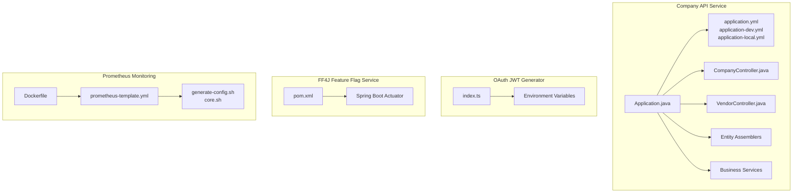
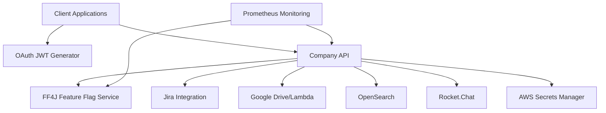
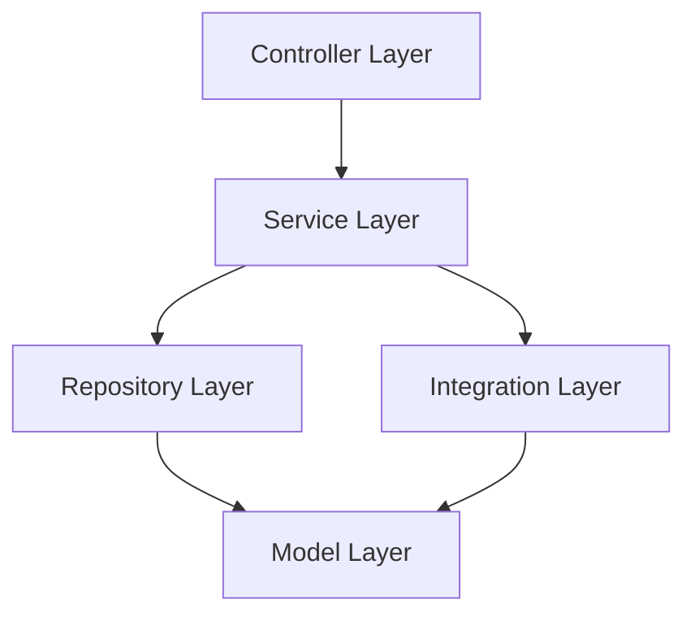
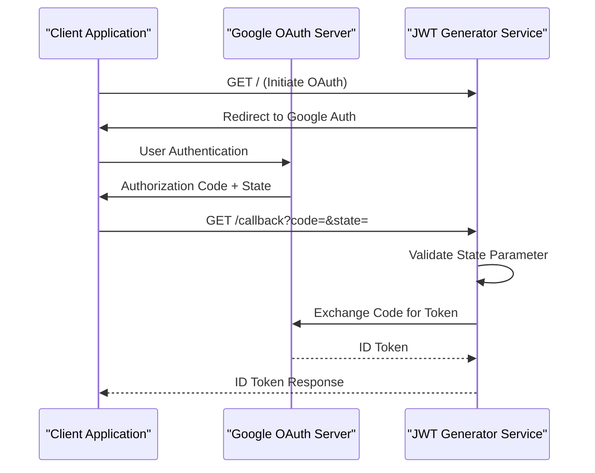
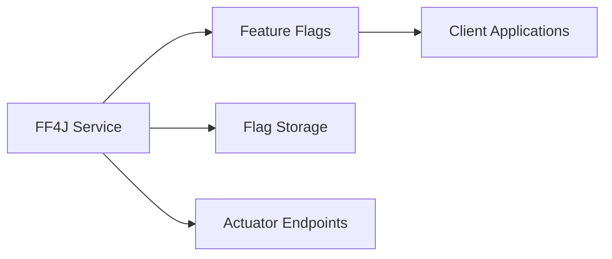
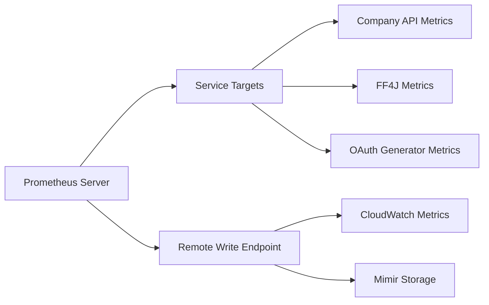
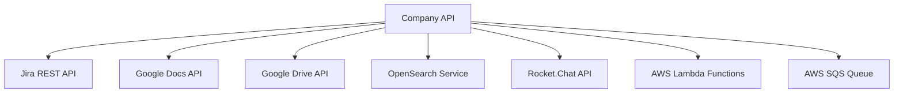

# Backend Services

<cite>
**Referenced Files in This Document**
- [pom.xml](file://apps/company-api/pom.xml)
- [README.md](file://apps/company-api/README.md)
- [docker-compose.yml](file://apps/company-api/docker-compose.yml)
- [Application.java](file://apps/company-api/application/src/main/java/com/redesignhealth/company/api/Application.java)
- [application.yml](file://apps/company-api/application/src/main/resources/application.yml)
- [application-dev.yml](file://apps/company-api/application/src/main/resources/application-dev.yml)
- [application-local.yml](file://apps/company-api/application/src/main/resources/application-local.yml)
- [index.ts](file://apps/oauth-jwt-generator/src/index.ts)
- [pom.xml](file://apps/ff4j-rh/pom.xml)
- [Dockerfile](file://apps/prometheus/Dockerfile)
- [CompanyController.java](file://apps/company-api/application/src/main/java/com/redesignhealth/company/api/controller/CompanyController.java)
- [VendorController.java](file://apps/company-api/application/src/main/java/com/redesignhealth/company/api/controller/VendorController.java)
- [prometheus-template.yml](file://apps/prometheus/prometheus-template.yml)
- [generate-config.sh](file://apps/prometheus/scripts/generate-config.sh)
- [core.sh](file://apps/prometheus/scripts/core.sh)
</cite>

## Update Summary
**Changes Made**
- Enhanced API reference documentation with comprehensive endpoint coverage
- Added detailed authentication and authorization mechanisms
- Expanded data management documentation including taxonomy and search integration
- Updated service architecture diagrams to reflect current implementation
- Added Prometheus monitoring configuration details
- Enhanced security measures documentation
- Updated deployment and environment configuration information

## Table of Contents
1. [Introduction](#introduction)
2. [Project Structure](#project-structure)
3. [Core Components](#core-components)
4. [Architecture Overview](#architecture-overview)
5. [Detailed Component Analysis](#detailed-component-analysis)
6. [API Reference](#api-reference)
7. [Authentication and Security](#authentication-and-security)
8. [Data Management and Models](#data-management-and-models)
9. [Deployment and Configuration](#deployment-and-configuration)
10. [Monitoring and Observability](#monitoring-and-observability)
11. [Inter-Service Communication](#inter-service-communication)
12. [Error Handling and Resilience](#error-handling-and-resilience)
13. [Performance Considerations](#performance-considerations)
14. [Troubleshooting Guide](#troubleshooting-guide)
15. [Conclusion](#conclusion)
16. [Appendices](#appendices)

## Introduction
This document provides comprehensive documentation for the backend services in the Redesign Health monorepo. It covers the Spring Boot microservice architecture of the Company API service, OAuth JWT Generator service, FF4J Feature Flag Service, and Prometheus monitoring service. The documentation includes detailed API reference, authentication mechanisms, data models, service configuration, deployment strategies, and monitoring approaches.

## Project Structure
The repository implements a monorepo architecture containing multiple backend services and libraries. The key backend services include:

- **Company API (Spring Boot microservice)**: Primary service for company management, vendor relationships, and domain-specific features
- **OAuth JWT Generator (Express service)**: Handles Google OAuth authorization code exchange and ID token generation
- **FF4J Feature Flag Service (Spring Boot)**: Exposes feature flags via FF4J with Spring Boot Actuator integration
- **Prometheus Monitoring Service**: Containerized monitoring solution with configurable remote write capabilities

**Diagram sources**
- [Application.java:1-53](file://apps/company-api/application/src/main/java/com/redesignhealth/company/api/Application.java#L1-L53)
- [application.yml:1-616](file://apps/company-api/application/src/main/resources/application.yml#L1-L616)
- [application-dev.yml:1-41](file://apps/company-api/application/src/main/resources/application-dev.yml#L1-L41)
- [application-local.yml:1-22](file://apps/company-api/application/src/main/resources/application-local.yml#L1-L22)
- [CompanyController.java:1-175](file://apps/company-api/application/src/main/java/com/redesignhealth/company/api/controller/CompanyController.java#L1-L175)
- [VendorController.java:1-112](file://apps/company-api/application/src/main/java/com/redesignhealth/company/api/controller/VendorController.java#L1-L112)
- [index.ts:1-74](file://apps/oauth-jwt-generator/src/index.ts#L1-L74)
- [pom.xml:1-54](file://apps/ff4j-rh/pom.xml#L1-L54)
- [Dockerfile:1-3](file://apps/prometheus/Dockerfile#L1-L3)
- [prometheus-template.yml:1-200](file://apps/prometheus/prometheus-template.yml#L1-L200)
- [generate-config.sh:1-14](file://apps/prometheus/scripts/generate-config.sh#L1-L14)
- [core.sh:1-6](file://apps/prometheus/scripts/core.sh#L1-L6)

**Section sources**
- [pom.xml:1-33](file://apps/company-api/pom.xml#L1-L33)
- [README.md:1-259](file://apps/company-api/README.md#L1-L259)
- [docker-compose.yml:1-82](file://apps/company-api/docker-compose.yml#L1-L82)

## Core Components

### Company API Service
The Company API is a comprehensive Spring Boot microservice providing:

- **Multi-module Maven architecture** with application and jira-rest-client modules
- **RESTful API endpoints** for company and vendor management
- **External system integrations** including Jira, Google services, OpenSearch, and Rocket.Chat
- **AWS Secrets Manager integration** for secure configuration management
- **Spring Boot Actuator** for monitoring and health checks
- **HATEOAS support** for discoverable API endpoints

### OAuth JWT Generator Service
A lightweight Express.js service handling:

- **Google OAuth authorization code flow** implementation
- **ID token exchange** from authorization codes
- **State verification** for CSRF protection
- **Health check endpoint** for service monitoring
- **Environment-based configuration** for different deployment targets

### FF4J Feature Flag Service
Spring Boot service providing:

- **Feature flag management** via FF4J framework
- **Spring Boot Actuator integration** for monitoring endpoints
- **Lightweight deployment** with minimal dependencies
- **Production-ready configuration** through Maven dependencies

### Prometheus Monitoring Service
Containerized monitoring solution featuring:

- **Configurable remote write** capabilities for cloud observability
- **Template-based configuration** generation
- **Environment-specific target configuration**
- **Docker containerization** with custom Prometheus image

**Section sources**
- [pom.xml:1-33](file://apps/company-api/pom.xml#L1-L33)
- [README.md:1-259](file://apps/company-api/README.md#L1-L259)
- [Application.java:1-53](file://apps/company-api/application/src/main/java/com/redesignhealth/company/api/Application.java#L1-L53)
- [application.yml:1-616](file://apps/company-api/application/src/main/resources/application.yml#L1-L616)
- [index.ts:1-74](file://apps/oauth-jwt-generator/src/index.ts#L1-L74)
- [pom.xml:1-54](file://apps/ff4j-rh/pom.xml#L1-L54)
- [Dockerfile:1-3](file://apps/prometheus/Dockerfile#L1-L3)

## Architecture Overview
The backend services implement a distributed microservice architecture with clear separation of concerns:

**Diagram sources**
- [index.ts:1-74](file://apps/oauth-jwt-generator/src/index.ts#L1-L74)
- [Application.java:1-53](file://apps/company-api/application/src/main/java/com/redesignhealth/company/api/Application.java#L1-L53)
- [pom.xml:1-54](file://apps/ff4j-rh/pom.xml#L1-L54)
- [Dockerfile:1-3](file://apps/prometheus/Dockerfile#L1-L3)

## Detailed Component Analysis

### Company API Service Architecture
The Company API implements a layered architecture pattern:

**Controller Layer**: REST endpoints with HATEOAS support
**Service Layer**: Business logic and orchestration
**Repository Layer**: Data access and persistence
**Integration Layer**: External system communication
**Model Layer**: Domain entities and DTOs

**Section sources**
- [CompanyController.java:1-175](file://apps/company-api/application/src/main/java/com/redesignhealth/company/api/controller/CompanyController.java#L1-L175)
- [VendorController.java:1-112](file://apps/company-api/application/src/main/java/com/redesignhealth/company/api/controller/VendorController.java#L1-L112)

### OAuth JWT Generator Implementation
The OAuth service follows a stateless design pattern:

**Diagram sources**
- [index.ts:1-74](file://apps/oauth-jwt-generator/src/index.ts#L1-L74)

**Section sources**
- [index.ts:1-74](file://apps/oauth-jwt-generator/src/index.ts#L1-L74)

### FF4J Feature Flag Service Configuration
The FF4J service provides dynamic feature management:

**Section sources**
- [pom.xml:1-54](file://apps/ff4j-rh/pom.xml#L1-L54)

## API Reference

### Company Management Endpoints
The Company API provides comprehensive company management functionality:

**Company Endpoints**
- `GET /company` - List all companies with pagination and expansion options
- `GET /company/{companyId}` - Get company details with optional expansions
- `POST /company` - Create new company (Admin only)
- `PUT /company/{companyId}` - Update company information (Admin only)
- `DELETE /company/{companyId}` - Remove company (Admin only)
- `GET /company/{companyId}/members` - List company members
- `PUT /company/{companyId}/member/{email}` - Add member to company (Admin only)
- `DELETE /company/{companyId}/member/{email}` - Remove member from company (Admin only)
- `GET /company/{companyId}/conflicts` - Get conflict resolution data
- `PUT /company/{companyId}/conflicts` - Add conflict resolution data

**Vendor Endpoints**
- `GET /vendor` - List vendors with search and filtering
- `GET /vendor/filters` - Get vendor filter options
- `GET /vendor/{vendorId}` - Get specific vendor
- `POST /vendor` - Add vendor data (RH Admin only)
- `PUT /vendor/{vendorId}` - Update vendor data (RH Admin only)
- `DELETE /vendor/{vendorId}` - Remove vendor (Admin only)

**Section sources**
- [CompanyController.java:73-174](file://apps/company-api/application/src/main/java/com/redesignhealth/company/api/controller/CompanyController.java#L73-L174)
- [VendorController.java:53-111](file://apps/company-api/application/src/main/java/com/redesignhealth/company/api/controller/VendorController.java#L53-L111)

### API Response Formats
All endpoints support both HAL and vanilla JSON responses through Accept header negotiation. Pagination is supported with customizable page sizes and sorting options.

**Section sources**
- [application.yml:13-16](file://apps/company-api/application/src/main/resources/application.yml#L13-L16)

## Authentication and Security

### JWT-Based Authentication
The system implements JWT-based authentication with Google Identity Services:

- **Token Generation**: OAuth JWT Generator exchanges authorization codes for ID tokens
- **Token Validation**: Company API validates JWT tokens for all protected endpoints
- **Role-Based Access Control**: Pre-authorization checks based on user roles
- **Impersonation Support**: RH-Impersonation-Email header for admin operations
- **Google Access Tokens**: RH-Google-Access-Token header support

### Security Headers and CORS
- **CORS Configuration**: Allowed origins for localhost and redesignhealth.com domains
- **Security Headers**: Automatic inclusion via IncludeSecurityHeaders annotation
- **CSRF Protection**: State parameter validation in OAuth flow
- **HTTPS Enforcement**: Production redirects use HTTPS scheme

**Section sources**
- [application.yml:104-107](file://apps/company-api/application/src/main/resources/application.yml#L104-L107)
- [CompanyController.java:42-46](file://apps/company-api/application/src/main/java/com/redesignhealth/company/api/controller/CompanyController.java#L42-L46)

## Data Management and Models

### Company Taxonomy System
The system implements a hierarchical taxonomy for categorizing healthcare services:

```mermaid
graph TD
HealthcareServices["Healthcare Services"]
CareDelivery["Care Delivery"]
VirtualCare["Virtual Care Operations"]
PatientSupport["Patient Support and Communications"]
AncillaryServices["Ancillary Services / Treatment"]
Referrals["Referrals and Specialty Networks"]
Ecosystem["Ecosystem"]
HealthcareAdmin["Healthcare Admin"]
DataAnalytics["Data Analytics"]
Regulatory["Regulatory and Compliance"]
Enabling["Enabling Infrastructure"]
HealthcareServices --> CareDelivery
HealthcareServices --> VirtualCare
HealthcareServices --> PatientSupport
HealthcareServices --> AncillaryServices
HealthcareServices --> Referrals
HealthcareServices --> Ecosystem
HealthcareServices --> HealthcareAdmin
HealthcareServices --> DataAnalytics
HealthcareServices --> Regulatory
HealthcareServices --> Enabling
```

**Diagram sources**
- [application.yml:215-592](file://apps/company-api/application/src/main/resources/application.yml#L215-L592)

### Search Integration
The system integrates with multiple search services:

- **OpenSearch/AWS OpenSearch**: Primary search engine for company and vendor data
- **AOSS Integration**: Alternative search service configuration
- **Custom Converters**: Entity-to-search mapping for research articles, expert notes, and IP marketplace data

**Section sources**
- [application.yml:60-61](file://apps/company-api/application/src/main/resources/application.yml#L60-L61)
- [application.yml:126-203](file://apps/company-api/application/src/main/resources/application.yml#L126-L203)

## Deployment and Configuration

### Environment Configuration
The system supports multiple deployment environments:

**Local Development**
- CockroachDB for local database
- OpenSearch for search functionality
- Debugging support with remote debugging
- SQL logging enabled for development

**Development Environment**
- AWS Secrets Manager integration
- Jira integration enabled
- Production-like search configuration
- Asset storage via S3 buckets

**Docker Compose Deployment**
- Multi-service container orchestration
- Volume management for persistent data
- Service dependency management
- Port mapping for external access

**Section sources**
- [application-local.yml:1-22](file://apps/company-api/application/src/main/resources/application-local.yml#L1-L22)
- [application-dev.yml:1-41](file://apps/company-api/application/src/main/resources/application-dev.yml#L1-L41)
- [docker-compose.yml:1-82](file://apps/company-api/docker-compose.yml#L1-L82)

### AWS Integration
- **Secrets Manager**: Secure credential storage and retrieval
- **SQS Integration**: Jira webhook event processing
- **S3 Storage**: Asset management for development environment
- **CloudWatch**: Logging and monitoring integration

**Section sources**
- [Application.java:35-51](file://apps/company-api/application/src/main/java/com/redesignhealth/company/api/Application.java#L35-L51)
- [application-dev.yml:16-27](file://apps/company-api/application/src/main/resources/application-dev.yml#L16-L27)

## Monitoring and Observability

### Prometheus Configuration
The monitoring system provides comprehensive observability:

**Diagram sources**
- [prometheus-template.yml:1-200](file://apps/prometheus/prometheus-template.yml#L1-L200)
- [generate-config.sh:1-14](file://apps/prometheus/scripts/generate-config.sh#L1-L14)

### Metrics Exposure
- **Spring Boot Actuator**: Health checks and metrics endpoints
- **Custom Metrics**: Business-specific metric collection
- **Service Discovery**: Dynamic target configuration
- **Remote Write**: Cloud-native metrics storage

**Section sources**
- [application.yml:38-44](file://apps/company-api/application/src/main/resources/application.yml#L38-L44)
- [pom.xml:20-41](file://apps/ff4j-rh/pom.xml#L20-L41)

## Inter-Service Communication

### External System Integration
The Company API integrates with multiple external services:

**Diagram sources**
- [application.yml:76-124](file://apps/company-api/application/src/main/resources/application.yml#L76-L124)

### Message Queuing
- **Jira Webhooks**: SQS queue for asynchronous webhook processing
- **Event-Driven Architecture**: Decoupled service communication
- **Retry Mechanisms**: Built-in error handling and retry logic

**Section sources**
- [application.yml:58-59](file://apps/company-api/application/src/main/resources/application.yml#L58-L59)
- [application-dev.yml:20-21](file://apps/company-api/application/src/main/resources/application-dev.yml#L20-L21)

## Error Handling and Resilience

### Circuit Breaker Pattern
The system implements resilience patterns:

- **Timeout Handling**: Configurable timeouts for external calls
- **Fallback Strategies**: Graceful degradation when services are unavailable
- **Retry Logic**: Intelligent retry mechanisms for transient failures
- **Bulkhead Isolation**: Resource isolation for critical operations

### Health Checks
- **Liveness Probes**: Container health verification
- **Readiness Checks**: Service readiness validation
- **External Dependency Monitoring**: Integration service health
- **Database Connectivity**: Connection pool health monitoring

**Section sources**
- [application.yml:38-44](file://apps/company-api/application/src/main/resources/application.yml#L38-L44)

## Performance Considerations

### Database Optimization
- **Connection Pooling**: Optimized database connection management
- **Query Optimization**: Efficient query patterns and indexing strategies
- **Pagination Defaults**: Configurable pagination for large datasets
- **Transaction Management**: Proper transaction boundaries for data consistency

### Search Performance
- **Index Optimization**: Search index configuration and maintenance
- **Query Optimization**: Efficient search query patterns
- **Caching Strategy**: Appropriate caching for frequently accessed data
- **Resource Limits**: Configurable resource limits for search operations

### API Performance
- **Response Compression**: GZIP compression for API responses
- **Caching Headers**: Appropriate cache control for static resources
- **Asynchronous Processing**: Non-blocking operations for long-running tasks
- **Rate Limiting**: Configurable rate limiting for API endpoints

**Section sources**
- [application.yml:9-11](file://apps/company-api/application/src/main/resources/application.yml#L9-L11)
- [application-dev.yml:34-35](file://apps/company-api/application/src/main/resources/application-dev.yml#L34-L35)

## Troubleshooting Guide

### Common Issues and Solutions

**Authentication Problems**
- Verify JWT token validity and expiration
- Check user role assignments in database
- Validate Google OAuth configuration
- Review CORS policy settings

**Database Connectivity**
- Verify CockroachDB connection string
- Check AWS Secrets Manager configuration
- Validate database credentials
- Monitor connection pool health

**Search Service Issues**
- Verify OpenSearch/AOSS service availability
- Check search index configuration
- Validate entity-to-search mapping
- Review search query syntax

**External Integration Problems**
- Check Jira API connectivity
- Verify Google API credentials
- Monitor SQS queue health
- Validate Lambda function permissions

**Section sources**
- [application.yml:176-183](file://apps/company-api/README.md#L176-L183)
- [application-dev.yml:29-32](file://apps/company-api/application/src/main/resources/application-dev.yml#L29-L32)

## Conclusion
The backend services in the Redesign Health monorepo demonstrate a sophisticated, production-ready microservice architecture. The Company API provides comprehensive company and vendor management capabilities with robust integration patterns, security measures, and monitoring. The OAuth JWT Generator streamlines authentication flows, the FF4J service enables controlled feature releases, and Prometheus ensures comprehensive observability across all services.

The architecture emphasizes scalability, maintainability, and operational excellence through proper separation of concerns, comprehensive testing, and production-ready deployment configurations.

## Appendices

### Deployment Scripts and Configuration
- **Docker Compose**: Multi-service orchestration for development and testing
- **Environment Scripts**: Automated configuration generation for different environments
- **Release Management**: GitHub Actions workflows for automated deployments
- **Monitoring Setup**: Template-based Prometheus configuration generation

**Section sources**
- [docker-compose.yml:1-82](file://apps/company-api/docker-compose.yml#L1-L82)
- [generate-config.sh:1-14](file://apps/prometheus/scripts/generate-config.sh#L1-L14)
- [core.sh:1-6](file://apps/prometheus/scripts/core.sh#L1-L6)
- [README.md:235-259](file://apps/company-api/README.md#L235-L259)