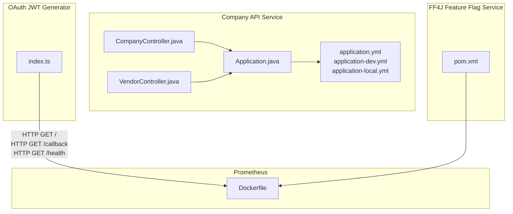
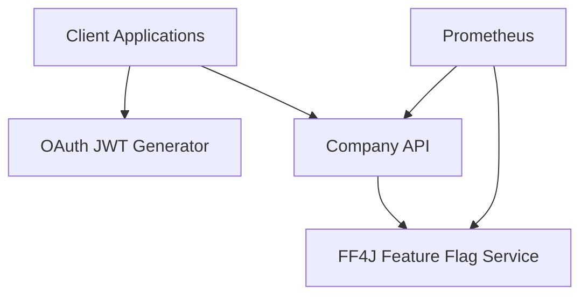
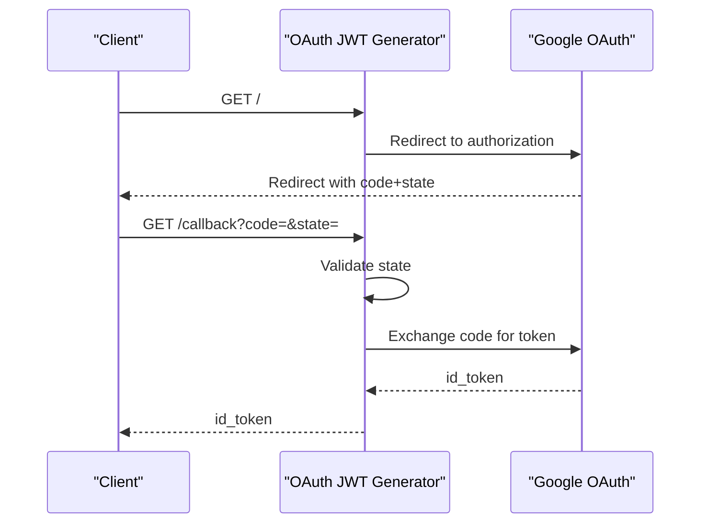
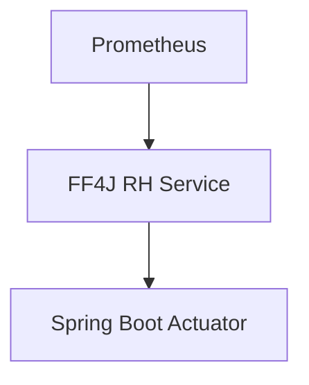
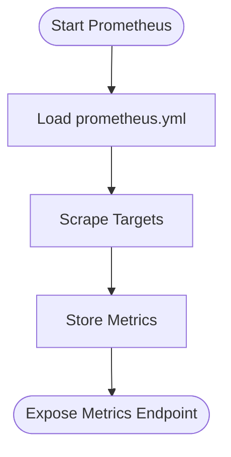
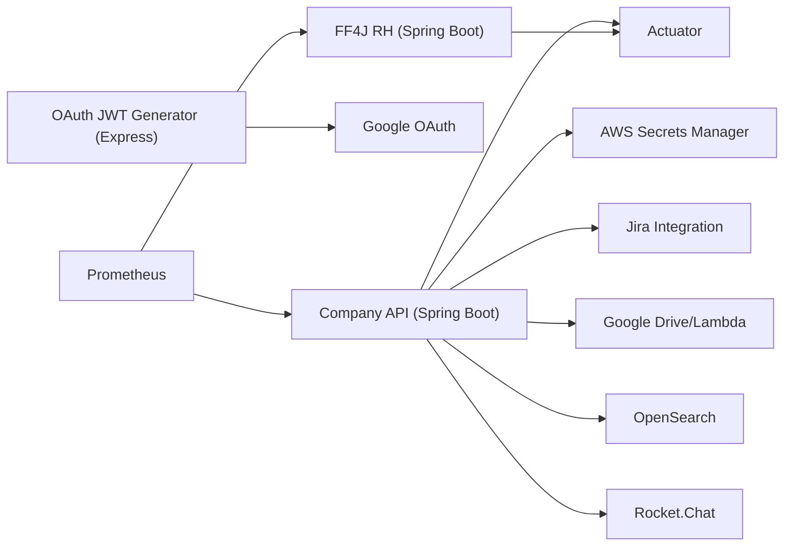

# Backend Services

<cite>
**Referenced Files in This Document**
- [pom.xml](file://apps/company-api/pom.xml)
- [README.md](file://apps/company-api/README.md)
- [docker-compose.yml](file://apps/company-api/docker-compose.yml)
- [Application.java](file://apps/company-api/application/src/main/java/com/redesignhealth/company/api/Application.java)
- [application.yml](file://apps/company-api/application/src/main/resources/application.yml)
- [application-dev.yml](file://apps/company-api/application/src/main/resources/application-dev.yml)
- [application-local.yml](file://apps/company-api/application/src/main/resources/application-local.yml)
- [index.ts](file://apps/oauth-jwt-generator/src/index.ts)
- [pom.xml](file://apps/ff4j-rh/pom.xml)
- [Dockerfile](file://apps/prometheus/Dockerfile)
- [CompanyController.java](file://apps/company-api/application/src/main/java/com/redesignhealth/company/api/controller/CompanyController.java)
- [VendorController.java](file://apps/company-api/application/src/main/java/com/redesignhealth/company/api/controller/VendorController.java)
</cite>

## Table of Contents
1. [Introduction](#introduction)
2. [Project Structure](#project-structure)
3. [Core Components](#core-components)
4. [Architecture Overview](#architecture-overview)
5. [Detailed Component Analysis](#detailed-component-analysis)
6. [Dependency Analysis](#dependency-analysis)
7. [Performance Considerations](#performance-considerations)
8. [Troubleshooting Guide](#troubleshooting-guide)
9. [Conclusion](#conclusion)
10. [Appendices](#appendices)

## Introduction
This document describes the backend services in the Redesign Health monorepo with a focus on the Spring Boot microservice architecture of the Company API service, the OAuth JWT Generator service, the FF4J Feature Flag Service, and the Prometheus monitoring service. It explains REST API endpoints, business logic, database integration patterns, security measures, configuration, deployment strategies, monitoring, inter-service communication, error handling, and scalability considerations.

## Project Structure
The repository is a monorepo containing multiple applications and libraries. The backend services relevant to this document include:
- Company API (Spring Boot microservice): responsible for company management, vendor relationships, and related domain features.
- OAuth JWT Generator (Express service): handles Google OAuth authorization code exchange and returns ID tokens.
- FF4J RH (Spring Boot service): exposes feature flags via FF4J with Spring Boot Actuator.
- Prometheus (monitoring service): Prometheus container configured via a custom YAML.



**Diagram sources**
- [Application.java:1-53](file://apps/company-api/application/src/main/java/com/redesignhealth/company/api/Application.java#L1-L53)
- [application.yml:1-616](file://apps/company-api/application/src/main/resources/application.yml#L1-L616)
- [application-dev.yml:1-41](file://apps/company-api/application/src/main/resources/application-dev.yml#L1-L41)
- [application-local.yml:1-22](file://apps/company-api/application/src/main/resources/application-local.yml#L1-L22)
- [CompanyController.java](file://apps/company-api/application/src/main/java/com/redesignhealth/company/api/controller/CompanyController.java)
- [VendorController.java](file://apps/company-api/application/src/main/java/com/redesignhealth/company/api/controller/VendorController.java)
- [index.ts:1-74](file://apps/oauth-jwt-generator/src/index.ts#L1-L74)
- [pom.xml:1-54](file://apps/ff4j-rh/pom.xml#L1-L54)
- [Dockerfile:1-3](file://apps/prometheus/Dockerfile#L1-L3)

**Section sources**
- [pom.xml:1-33](file://apps/company-api/pom.xml#L1-L33)
- [README.md:1-259](file://apps/company-api/README.md#L1-L259)
- [docker-compose.yml:1-82](file://apps/company-api/docker-compose.yml#L1-L82)

## Core Components
- Company API (Spring Boot microservice):
  - Multi-module Maven project with application and jira-rest-client modules.
  - Provides REST endpoints for company and vendor management and integrates with external systems (Jira, Google Drive, OpenSearch, Rocket.Chat).
  - Uses Spring profiles for environment-specific configuration and AWS Secrets Manager integration.
  - Exposes Prometheus metrics via Spring Boot Actuator.

- OAuth JWT Generator (Express service):
  - Implements Google OAuth authorization code flow and exchanges the code for an ID token.
  - Provides health check endpoint and supports state verification for CSRF protection.

- FF4J Feature Flag Service (Spring Boot):
  - Integrates FF4J starter and exposes Actuator endpoints for monitoring.

- Prometheus Monitoring:
  - Containerized Prometheus with a custom configuration mounted at runtime.

**Section sources**
- [pom.xml:1-33](file://apps/company-api/pom.xml#L1-L33)
- [README.md:1-259](file://apps/company-api/README.md#L1-L259)
- [Application.java:1-53](file://apps/company-api/application/src/main/java/com/redesignhealth/company/api/Application.java#L1-L53)
- [application.yml:1-616](file://apps/company-api/application/src/main/resources/application.yml#L1-L616)
- [index.ts:1-74](file://apps/oauth-jwt-generator/src/index.ts#L1-L74)
- [pom.xml:1-54](file://apps/ff4j-rh/pom.xml#L1-L54)
- [Dockerfile:1-3](file://apps/prometheus/Dockerfile#L1-L3)

## Architecture Overview
The backend services collaborate as follows:
- Company API orchestrates company and vendor operations, integrates with external systems, and exposes REST APIs with Swagger/OpenAPI documentation.
- OAuth JWT Generator provides ID tokens used by clients to authenticate with downstream services.
- FF4J Feature Flag Service exposes feature flags for controlled rollouts.
- Prometheus scrapes metrics from services (including Company API) for observability.



**Diagram sources**
- [index.ts:1-74](file://apps/oauth-jwt-generator/src/index.ts#L1-L74)
- [Application.java:1-53](file://apps/company-api/application/src/main/java/com/redesignhealth/company/api/Application.java#L1-L53)
- [pom.xml:1-54](file://apps/ff4j-rh/pom.xml#L1-L54)
- [Dockerfile:1-3](file://apps/prometheus/Dockerfile#L1-L3)

## Detailed Component Analysis

### Company API Service
- Purpose: Company management, vendor relationship handling, and related domain features.
- Configuration:
  - Centralized via application.yml with environment-specific overrides in application-dev.yml and application-local.yml.
  - Spring profiles activate different configurations (e.g., docker-compose, dev, local).
  - AWS Secrets Manager integration initializes properties before bean initialization.
  - CORS policies and pagination defaults are configured centrally.
- Security:
  - JWT-based authorization is documented; clients obtain tokens via the OAuth JWT Generator.
  - Impersonation and Google Access Token headers are supported via CORS configuration.
- Database and Search:
  - CockroachDB is used in local and dev environments; OpenSearch is configured for search.
  - AWS SQS queue configured for Jira webhook integration.
- Monitoring:
  - Prometheus endpoint exposed via Spring Boot Actuator.
- Endpoints:
  - Root endpoint returns links to documentation, Swagger, and OpenAPI.
  - Controllers include CompanyController and VendorController among others.

```mermaid
classDiagram
class Application {
+main(args)
}
class CompanyController {
+GET "/companies"
+GET "/companies/{id}"
+POST "/companies"
+PUT "/companies/{id}"
+DELETE "/companies/{id}"
}
class VendorController {
+GET "/vendors"
+GET "/vendors/{id}"
+POST "/vendors"
+PUT "/vendors/{id}"
+DELETE "/vendors/{id}"
}
Application --> CompanyController : "registers"
Application --> VendorController : "registers"
```

**Diagram sources**
- [Application.java:1-53](file://apps/company-api/application/src/main/java/com/redesignhealth/company/api/Application.java#L1-L53)
- [CompanyController.java](file://apps/company-api/application/src/main/java/com/redesignhealth/company/api/controller/CompanyController.java)
- [VendorController.java](file://apps/company-api/application/src/main/java/com/redesignhealth/company/api/controller/VendorController.java)

**Section sources**
- [README.md:1-259](file://apps/company-api/README.md#L1-L259)
- [Application.java:1-53](file://apps/company-api/application/src/main/java/com/redesignhealth/company/api/Application.java#L1-L53)
- [application.yml:1-616](file://apps/company-api/application/src/main/resources/application.yml#L1-L616)
- [application-dev.yml:1-41](file://apps/company-api/application/src/main/resources/application-dev.yml#L1-L41)
- [application-local.yml:1-22](file://apps/company-api/application/src/main/resources/application-local.yml#L1-L22)
- [CompanyController.java](file://apps/company-api/application/src/main/java/com/redesignhealth/company/api/controller/CompanyController.java)
- [VendorController.java](file://apps/company-api/application/src/main/java/com/redesignhealth/company/api/controller/VendorController.java)

### OAuth JWT Generator Service
- Purpose: Handles Google OAuth authorization code exchange and returns an ID token to clients.
- Endpoints:
  - GET /: Redirects to Google OAuth authorization endpoint with state parameter.
  - GET /callback: Validates state and exchanges authorization code for ID token via Google token endpoint.
  - GET /health: Returns service health status.
- Security:
  - State parameter validated to prevent CSRF.
  - Uses HTTPS for production redirects and Google endpoints.
- Error Handling:
  - Errors during token exchange are caught and returned to the client.



**Diagram sources**
- [index.ts:1-74](file://apps/oauth-jwt-generator/src/index.ts#L1-L74)

**Section sources**
- [index.ts:1-74](file://apps/oauth-jwt-generator/src/index.ts#L1-L74)

### FF4J Feature Flag Service
- Purpose: Expose feature flags to clients via FF4J with Spring Boot Actuator.
- Dependencies:
  - Spring Boot Starter Web and Actuator.
  - FF4J Spring Boot WebMVC starter.
- Monitoring:
  - Actuator endpoints enabled for health and Prometheus scraping.



**Diagram sources**
- [pom.xml:1-54](file://apps/ff4j-rh/pom.xml#L1-L54)
- [Dockerfile:1-3](file://apps/prometheus/Dockerfile#L1-L3)

**Section sources**
- [pom.xml:1-54](file://apps/ff4j-rh/pom.xml#L1-L54)

### Prometheus Monitoring Service
- Purpose: Scrape metrics from backend services.
- Configuration:
  - Dockerfile extends the official Prometheus image and adds a custom configuration file.
  - The configuration is mounted at runtime for service discovery and targets.



**Diagram sources**
- [Dockerfile:1-3](file://apps/prometheus/Dockerfile#L1-L3)

**Section sources**
- [Dockerfile:1-3](file://apps/prometheus/Dockerfile#L1-L3)

## Dependency Analysis
- Company API:
  - Multi-module Maven structure with application and jira-rest-client modules.
  - Spring Boot Actuator enables health and Prometheus endpoints.
  - AWS Secrets Manager integration for secure property loading.
  - External integrations include Jira, Google services, OpenSearch, and Rocket.Chat.
- OAuth JWT Generator:
  - Express-based service with minimal dependencies for HTTP routing and external HTTP calls.
- FF4J RH:
  - Spring Boot starter dependencies for web and actuator, plus FF4J web MVC starter.
- Prometheus:
  - Containerized service with custom configuration mounting.



**Diagram sources**
- [pom.xml:1-33](file://apps/company-api/pom.xml#L1-L33)
- [application.yml:1-616](file://apps/company-api/application/src/main/resources/application.yml#L1-L616)
- [index.ts:1-74](file://apps/oauth-jwt-generator/src/index.ts#L1-L74)
- [pom.xml:1-54](file://apps/ff4j-rh/pom.xml#L1-L54)
- [Dockerfile:1-3](file://apps/prometheus/Dockerfile#L1-L3)

**Section sources**
- [pom.xml:1-33](file://apps/company-api/pom.xml#L1-L33)
- [application.yml:1-616](file://apps/company-api/application/src/main/resources/application.yml#L1-L616)
- [index.ts:1-74](file://apps/oauth-jwt-generator/src/index.ts#L1-L74)
- [pom.xml:1-54](file://apps/ff4j-rh/pom.xml#L1-L54)
- [Dockerfile:1-3](file://apps/prometheus/Dockerfile#L1-L3)

## Performance Considerations
- Company API:
  - Pagination defaults and HATEOAS configuration influence API response sizes.
  - OpenSearch configuration and limits impact search performance.
  - AWS SQS integration for asynchronous Jira webhook events reduces synchronous latency.
- OAuth JWT Generator:
  - Stateless design with minimal in-memory state improves scalability.
  - External calls to Google OAuth endpoints introduce network latency; caching ID tokens client-side can reduce repeated exchanges.
- FF4J RH:
  - Lightweight feature flag evaluation; keep feature flag stores optimized for low-latency reads.
- Prometheus:
  - Configure scrape intervals and retention appropriately to balance observability and resource usage.

[No sources needed since this section provides general guidance]

## Troubleshooting Guide
- Company API:
  - Verify Spring profile activation and AWS secret configuration.
  - Check CORS headers and allowed origins for cross-origin requests.
  - Confirm database connectivity and OpenSearch availability.
- OAuth JWT Generator:
  - Ensure state parameter matches between authorization and callback.
  - Validate redirect URI scheme (http vs https) depending on host.
- FF4J RH:
  - Confirm Actuator endpoints are reachable and Prometheus scraping is configured.
- Prometheus:
  - Validate configuration file mounting and target endpoints.

**Section sources**
- [application.yml:1-616](file://apps/company-api/application/src/main/resources/application.yml#L1-L616)
- [application-dev.yml:1-41](file://apps/company-api/application/src/main/resources/application-dev.yml#L1-L41)
- [application-local.yml:1-22](file://apps/company-api/application/src/main/resources/application-local.yml#L1-L22)
- [index.ts:1-74](file://apps/oauth-jwt-generator/src/index.ts#L1-L74)
- [pom.xml:1-54](file://apps/ff4j-rh/pom.xml#L1-L54)
- [Dockerfile:1-3](file://apps/prometheus/Dockerfile#L1-L3)

## Conclusion
The backend services in the Redesign Health monorepo demonstrate a modular, observable, and extensible architecture. The Company API provides robust company and vendor management with strong integration points and security controls. The OAuth JWT Generator streamlines authentication, FF4J enables controlled feature releases, and Prometheus ensures continuous monitoring visibility across services.

[No sources needed since this section summarizes without analyzing specific files]

## Appendices
- Deployment and Environment Notes:
  - Company API supports local and Docker Compose environments with CockroachDB and OpenSearch.
  - Secrets are loaded from AWS Secrets Manager and can be overridden by environment variables.
  - Dev deployments are automated via GitHub Actions workflows.

**Section sources**
- [README.md:1-259](file://apps/company-api/README.md#L1-L259)
- [docker-compose.yml:1-82](file://apps/company-api/docker-compose.yml#L1-L82)
- [Application.java:1-53](file://apps/company-api/application/src/main/java/com/redesignhealth/company/api/Application.java#L1-L53)