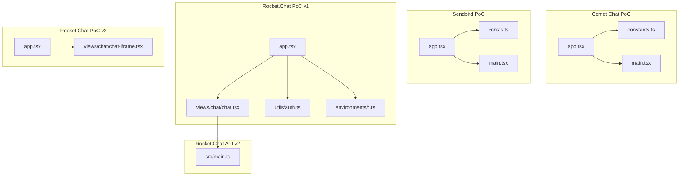
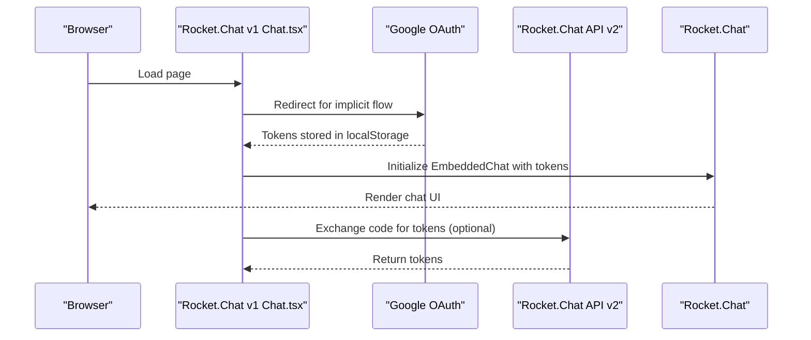
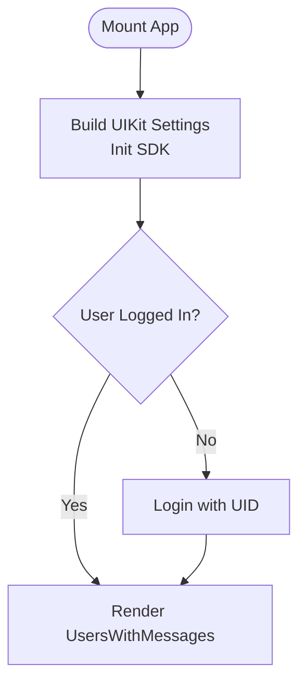
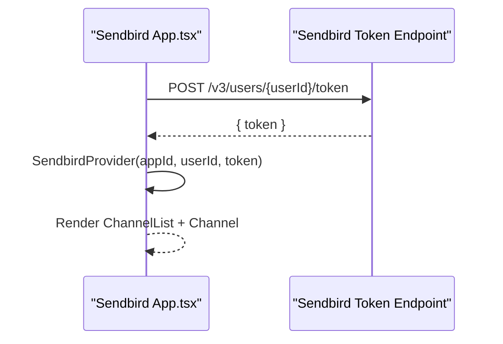
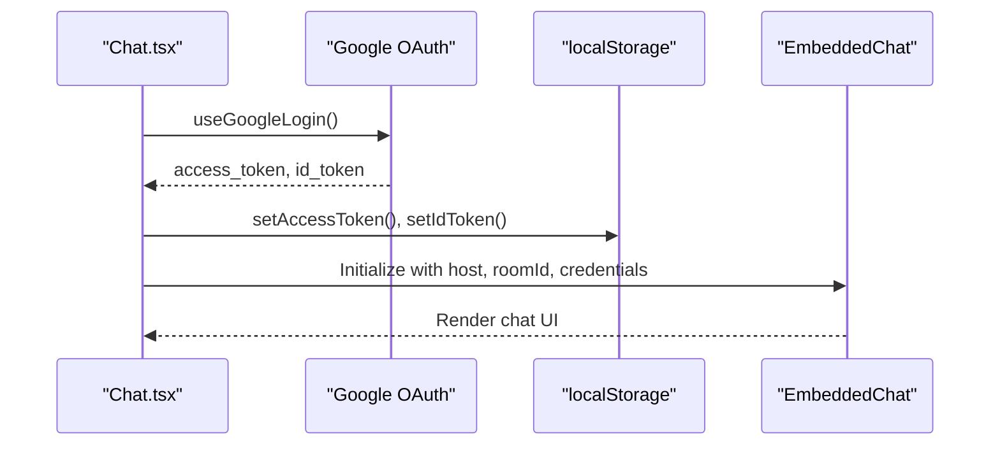
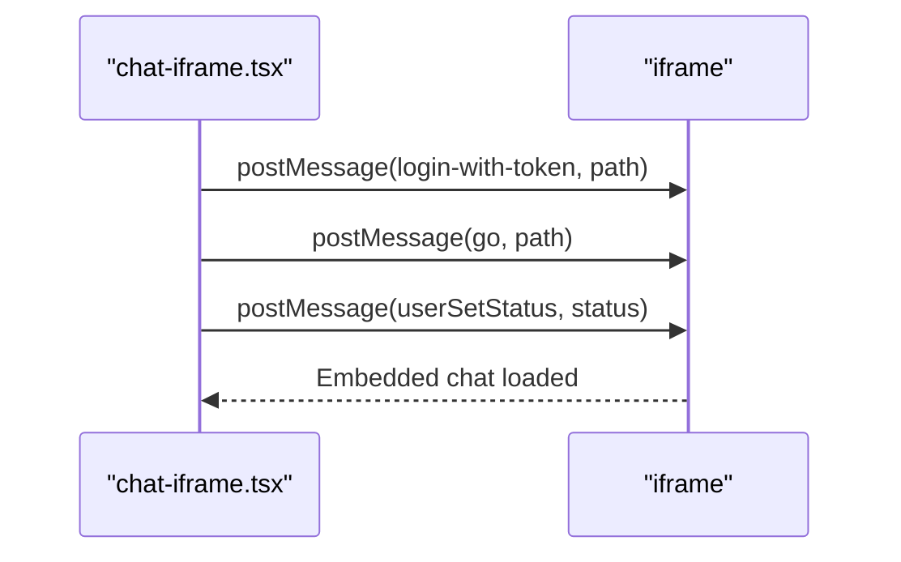
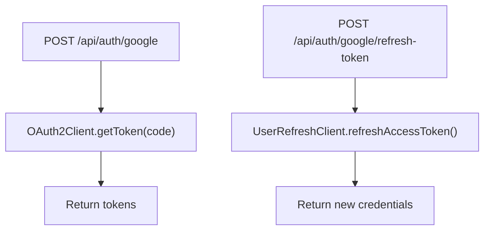
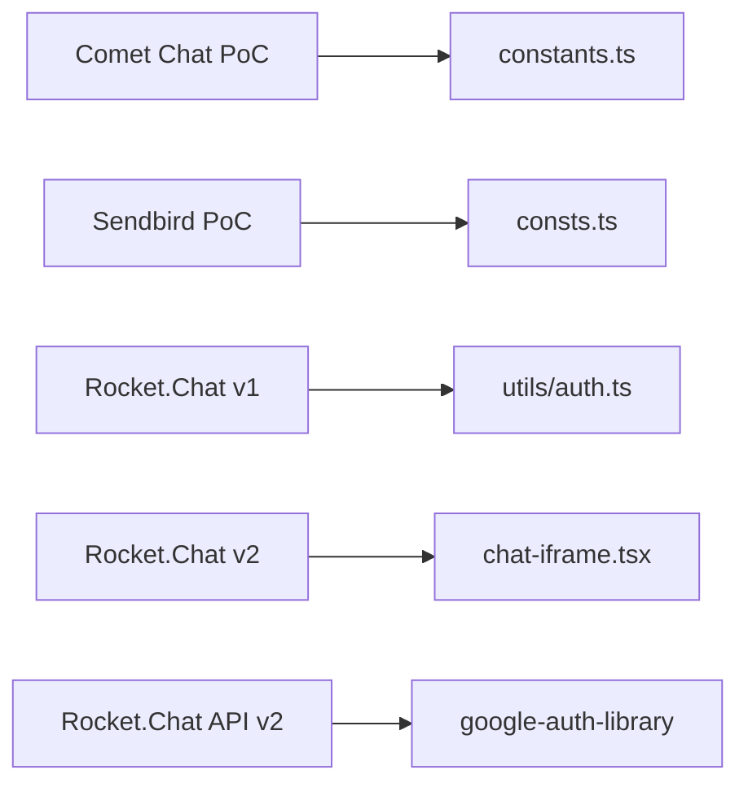

# Chat & Communication

<cite>
**Referenced Files in This Document**
- [apps/chat-pocs/comet-chat-poc/src/constants.ts](file://apps/chat-pocs/comet-chat-poc/src/constants.ts)
- [apps/chat-pocs/comet-chat-poc/src/app/app.tsx](file://apps/chat-pocs/comet-chat-poc/src/app/app.tsx)
- [apps/chat-pocs/comet-chat-poc/src/main.tsx](file://apps/chat-pocs/comet-chat-poc/src/main.tsx)
- [apps/chat-pocs/sendbird-poc/src/consts.ts](file://apps/chat-pocs/sendbird-poc/src/consts.ts)
- [apps/chat-pocs/sendbird-poc/src/app/app.tsx](file://apps/chat-pocs/sendbird-poc/src/app/app.tsx)
- [apps/chat-pocs/sendbird-poc/src/main.tsx](file://apps/chat-pocs/sendbird-poc/src/main.tsx)
- [apps/chat-pocs/rocketchat-poc/src/app/app.tsx](file://apps/chat-pocs/rocketchat-poc/src/app/app.tsx)
- [apps/chat-pocs/rocketchat-poc/src/views/chat/chat.tsx](file://apps/chat-pocs/rocketchat-poc/src/views/chat/chat.tsx)
- [apps/chat-pocs/rocketchat-poc/src/utils/auth.ts](file://apps/chat-pocs/rocketchat-poc/src/utils/auth.ts)
- [apps/chat-pocs/rocketchat-poc/src/environments/environment.ts](file://apps/chat-pocs/rocketchat-poc/src/environments/environment.ts)
- [apps/chat-pocs/rocketchat-poc/src/environments/environment.prod.ts](file://apps/chat-pocs/rocketchat-poc/src/environments/environment.prod.ts)
- [apps/chat-pocs/rocketchat-poc-v2/src/app/app.tsx](file://apps/chat-pocs/rocketchat-poc-v2/src/app/app.tsx)
- [apps/chat-pocs/rocketchat-poc-v2/src/views/chat/chat-iframe.tsx](file://apps/chat-pocs/rocketchat-poc-v2/src/views/chat/chat-iframe.tsx)
- [apps/chat-pocs/rocketchat-api-v2/src/main.ts](file://apps/chat-pocs/rocketchat-api-v2/src/main.ts)
- [apps/chat-pocs/rocketchat-auth-api/src/main.ts](file://apps/chat-pocs/rocketchat-auth-api/src/main.ts)
</cite>

## Table of Contents
1. [Introduction](#introduction)
2. [Project Structure](#project-structure)
3. [Core Components](#core-components)
4. [Architecture Overview](#architecture-overview)
5. [Detailed Component Analysis](#detailed-component-analysis)
6. [Dependency Analysis](#dependency-analysis)
7. [Performance Considerations](#performance-considerations)
8. [Security and Compliance](#security-and-compliance)
9. [Troubleshooting Guide](#troubleshooting-guide)
10. [Conclusion](#conclusion)

## Introduction
This document describes the chat and communication systems PoCs integrated with three providers: Comet Chat, Sendbird, and Rocket.Chat. It explains client-side initialization and authentication flows, embedded chat integrations, and backend support for Rocket.Chat OAuth token exchange. It also outlines configuration options per provider, authentication requirements, and highlights areas for security hardening and compliance for healthcare environments.

## Project Structure
The chat PoCs are organized as separate Next.js/Vite applications under apps/chat-pocs. Each provider has its own dedicated app with distinct initialization and integration patterns:
- Comet Chat PoC: React app initializing the UIKit and logging in a predefined user.
- Sendbird PoC: React app using SendbirdProvider with token issuance via a backend endpoint.
- Rocket.Chat PoC v1: React app embedding Rocket.Chat with Google OAuth and local storage tokens.
- Rocket.Chat PoC v2: React app embedding Rocket.Chat via iframe and posting external commands.
- Rocket.Chat API v2: Minimal Express server exchanging Google OAuth codes for tokens and refreshing access tokens.
- Rocket.Chat Auth API: Placeholder for future authentication API.

**Diagram sources**
- [apps/chat-pocs/comet-chat-poc/src/app/app.tsx:1-60](file://apps/chat-pocs/comet-chat-poc/src/app/app.tsx#L1-L60)
- [apps/chat-pocs/comet-chat-poc/src/constants.ts:1-7](file://apps/chat-pocs/comet-chat-poc/src/constants.ts#L1-L7)
- [apps/chat-pocs/comet-chat-poc/src/main.tsx:1-15](file://apps/chat-pocs/comet-chat-poc/src/main.tsx#L1-L15)
- [apps/chat-pocs/sendbird-poc/src/app/app.tsx:1-116](file://apps/chat-pocs/sendbird-poc/src/app/app.tsx#L1-L116)
- [apps/chat-pocs/sendbird-poc/src/consts.ts:1-17](file://apps/chat-pocs/sendbird-poc/src/consts.ts#L1-L17)
- [apps/chat-pocs/sendbird-poc/src/main.tsx:1-12](file://apps/chat-pocs/sendbird-poc/src/main.tsx#L1-L12)
- [apps/chat-pocs/rocketchat-poc/src/app/app.tsx:1-25](file://apps/chat-pocs/rocketchat-poc/src/app/app.tsx#L1-L25)
- [apps/chat-pocs/rocketchat-poc/src/views/chat/chat.tsx:1-54](file://apps/chat-pocs/rocketchat-poc/src/views/chat/chat.tsx#L1-L54)
- [apps/chat-pocs/rocketchat-poc/src/utils/auth.ts:1-38](file://apps/chat-pocs/rocketchat-poc/src/utils/auth.ts#L1-L38)
- [apps/chat-pocs/rocketchat-poc/src/environments/environment.ts:1-7](file://apps/chat-pocs/rocketchat-poc/src/environments/environment.ts#L1-L7)
- [apps/chat-pocs/rocketchat-poc/src/environments/environment.prod.ts:1-4](file://apps/chat-pocs/rocketchat-poc/src/environments/environment.prod.ts#L1-L4)
- [apps/chat-pocs/rocketchat-poc-v2/src/app/app.tsx:1-55](file://apps/chat-pocs/rocketchat-poc-v2/src/app/app.tsx#L1-L55)
- [apps/chat-pocs/rocketchat-poc-v2/src/views/chat/chat-iframe.tsx:1-57](file://apps/chat-pocs/rocketchat-poc-v2/src/views/chat/chat-iframe.tsx#L1-L57)
- [apps/chat-pocs/rocketchat-api-v2/src/main.ts:1-47](file://apps/chat-pocs/rocketchat-api-v2/src/main.ts#L1-L47)

**Section sources**
- [apps/chat-pocs/comet-chat-poc/src/app/app.tsx:1-60](file://apps/chat-pocs/comet-chat-poc/src/app/app.tsx#L1-L60)
- [apps/chat-pocs/sendbird-poc/src/app/app.tsx:1-116](file://apps/chat-pocs/sendbird-poc/src/app/app.tsx#L1-L116)
- [apps/chat-pocs/rocketchat-poc/src/app/app.tsx:1-25](file://apps/chat-pocs/rocketchat-poc/src/app/app.tsx#L1-L25)
- [apps/chat-pocs/rocketchat-poc-v2/src/app/app.tsx:1-55](file://apps/chat-pocs/rocketchat-poc-v2/src/app/app.tsx#L1-L55)

## Core Components
- Comet Chat UIKit integration initializes with app credentials and logs in a predefined UID. It renders a users-with-messages view after successful login.
- Sendbird Provider sets up the SDK with app ID, user ID, and a short-lived access token issued via a backend endpoint.
- Rocket.Chat v1 embeds the chat with Google OAuth, storing tokens in local storage and passing them to the embedded component.
- Rocket.Chat v2 embeds via iframe and posts external commands to control login, navigation, and user status.
- Rocket.Chat API v2 exposes endpoints to exchange Google OAuth codes for tokens and refresh access tokens using a refresh token.

**Section sources**
- [apps/chat-pocs/comet-chat-poc/src/app/app.tsx:15-57](file://apps/chat-pocs/comet-chat-poc/src/app/app.tsx#L15-L57)
- [apps/chat-pocs/comet-chat-poc/src/constants.ts:1-7](file://apps/chat-pocs/comet-chat-poc/src/constants.ts#L1-L7)
- [apps/chat-pocs/sendbird-poc/src/app/app.tsx:24-92](file://apps/chat-pocs/sendbird-poc/src/app/app.tsx#L24-L92)
- [apps/chat-pocs/sendbird-poc/src/consts.ts:1-17](file://apps/chat-pocs/sendbird-poc/src/consts.ts#L1-L17)
- [apps/chat-pocs/rocketchat-poc/src/views/chat/chat.tsx:10-51](file://apps/chat-pocs/rocketchat-poc/src/views/chat/chat.tsx#L10-L51)
- [apps/chat-pocs/rocketchat-poc/src/utils/auth.ts:1-38](file://apps/chat-pocs/rocketchat-poc/src/utils/auth.ts#L1-L38)
- [apps/chat-pocs/rocketchat-poc-v2/src/views/chat/chat-iframe.tsx:7-53](file://apps/chat-pocs/rocketchat-poc-v2/src/views/chat/chat-iframe.tsx#L7-L53)
- [apps/chat-pocs/rocketchat-api-v2/src/main.ts:17-40](file://apps/chat-pocs/rocketchat-api-v2/src/main.ts#L17-L40)

## Architecture Overview
The systems integrate chat clients through:
- Direct SDK initialization (Comet Chat, Sendbird)
- Embedded chat widgets (Rocket.Chat v1)
- Iframe-based embedded chat (Rocket.Chat v2)
- Backend token exchange (Rocket.Chat API v2)

**Diagram sources**
- [apps/chat-pocs/rocketchat-poc/src/views/chat/chat.tsx:17-31](file://apps/chat-pocs/rocketchat-poc/src/views/chat/chat.tsx#L17-L31)
- [apps/chat-pocs/rocketchat-api-v2/src/main.ts:24-29](file://apps/chat-pocs/rocketchat-api-v2/src/main.ts#L24-L29)

## Detailed Component Analysis

### Comet Chat PoC
- Initialization: Builds UIKit settings with app ID, region, and auth key; subscribes to friend presence.
- Authentication: Checks logged-in user; if none, logs in with a predefined UID.
- Rendering: Shows users-with-messages UI upon successful login.

**Diagram sources**
- [apps/chat-pocs/comet-chat-poc/src/app/app.tsx:18-50](file://apps/chat-pocs/comet-chat-poc/src/app/app.tsx#L18-L50)

**Section sources**
- [apps/chat-pocs/comet-chat-poc/src/app/app.tsx:15-57](file://apps/chat-pocs/comet-chat-poc/src/app/app.tsx#L15-L57)
- [apps/chat-pocs/comet-chat-poc/src/constants.ts:1-7](file://apps/chat-pocs/comet-chat-poc/src/constants.ts#L1-L7)

### Sendbird PoC
- Token Issuance: Issues a short-lived access token via a backend endpoint using an API token and user ID.
- Provider Setup: Wraps the app with SendbirdProvider using appId, userId, and accessToken.
- UI: Renders ChannelList and Channel components for conversation management.

**Diagram sources**
- [apps/chat-pocs/sendbird-poc/src/app/app.tsx:50-92](file://apps/chat-pocs/sendbird-poc/src/app/app.tsx#L50-L92)

**Section sources**
- [apps/chat-pocs/sendbird-poc/src/app/app.tsx:24-113](file://apps/chat-pocs/sendbird-poc/src/app/app.tsx#L24-L113)
- [apps/chat-pocs/sendbird-poc/src/consts.ts:1-17](file://apps/chat-pocs/sendbird-poc/src/consts.ts#L1-L17)

### Rocket.Chat PoC v1
- Routing: Uses React Router to protect the chat route with RequireAuth.
- Authentication: Uses Google OAuth implicit flow; stores tokens in localStorage.
- Embedding: Initializes EmbeddedChat with host, room, and credentials (idToken, accessToken).

**Diagram sources**
- [apps/chat-pocs/rocketchat-poc/src/views/chat/chat.tsx:17-31](file://apps/chat-pocs/rocketchat-poc/src/views/chat/chat.tsx#L17-L31)
- [apps/chat-pocs/rocketchat-poc/src/utils/auth.ts:7-23](file://apps/chat-pocs/rocketchat-poc/src/utils/auth.ts#L7-L23)

**Section sources**
- [apps/chat-pocs/rocketchat-poc/src/app/app.tsx:7-22](file://apps/chat-pocs/rocketchat-poc/src/app/app.tsx#L7-L22)
- [apps/chat-pocs/rocketchat-poc/src/views/chat/chat.tsx:10-51](file://apps/chat-pocs/rocketchat-poc/src/views/chat/chat.tsx#L10-L51)
- [apps/chat-pocs/rocketchat-poc/src/utils/auth.ts:1-38](file://apps/chat-pocs/rocketchat-poc/src/utils/auth.ts#L1-L38)
- [apps/chat-pocs/rocketchat-poc/src/environments/environment.ts:1-7](file://apps/chat-pocs/rocketchat-poc/src/environments/environment.ts#L1-L7)
- [apps/chat-pocs/rocketchat-poc/src/environments/environment.prod.ts:1-4](file://apps/chat-pocs/rocketchat-poc/src/environments/environment.prod.ts#L1-L4)

### Rocket.Chat PoC v2
- Embedding: Renders an iframe pointing to a Rocket.Chat instance configured for embedded mode.
- External Commands: Posts messages to the iframe to trigger login-with-token, navigate to a path, and set user status.

**Diagram sources**
- [apps/chat-pocs/rocketchat-poc-v2/src/views/chat/chat-iframe.tsx:21-43](file://apps/chat-pocs/rocketchat-poc-v2/src/views/chat/chat-iframe.tsx#L21-L43)

**Section sources**
- [apps/chat-pocs/rocketchat-poc-v2/src/app/app.tsx:18-52](file://apps/chat-pocs/rocketchat-poc-v2/src/app/app.tsx#L18-L52)
- [apps/chat-pocs/rocketchat-poc-v2/src/views/chat/chat-iframe.tsx:7-53](file://apps/chat-pocs/rocketchat-poc-v2/src/views/chat/chat-iframe.tsx#L7-L53)

### Rocket.Chat API v2
- Exchanges an authorization code for tokens using Google OAuth2Client.
- Refreshes access tokens using a refresh token via UserRefreshClient.
- Exposes endpoints for token exchange and refresh.

**Diagram sources**
- [apps/chat-pocs/rocketchat-api-v2/src/main.ts:24-40](file://apps/chat-pocs/rocketchat-api-v2/src/main.ts#L24-L40)

**Section sources**
- [apps/chat-pocs/rocketchat-api-v2/src/main.ts:17-40](file://apps/chat-pocs/rocketchat-api-v2/src/main.ts#L17-L40)

## Dependency Analysis
- Comet Chat PoC depends on UIKit settings builder and a predefined UID for login.
- Sendbird PoC depends on a backend endpoint to issue tokens and on SendbirdProvider for UI components.
- Rocket.Chat v1 depends on Google OAuth implicit flow and local storage for tokens.
- Rocket.Chat v2 depends on iframe messaging to control the embedded chat.
- Rocket.Chat API v2 depends on google-auth-library for token exchange and refresh.

**Diagram sources**
- [apps/chat-pocs/comet-chat-poc/src/constants.ts:1-7](file://apps/chat-pocs/comet-chat-poc/src/constants.ts#L1-L7)
- [apps/chat-pocs/sendbird-poc/src/consts.ts:1-17](file://apps/chat-pocs/sendbird-poc/src/consts.ts#L1-L17)
- [apps/chat-pocs/rocketchat-poc/src/utils/auth.ts:1-38](file://apps/chat-pocs/rocketchat-poc/src/utils/auth.ts#L1-L38)
- [apps/chat-pocs/rocketchat-poc-v2/src/views/chat/chat-iframe.tsx:1-57](file://apps/chat-pocs/rocketchat-poc-v2/src/views/chat/chat-iframe.tsx#L1-L57)
- [apps/chat-pocs/rocketchat-api-v2/src/main.ts:10-11](file://apps/chat-pocs/rocketchat-api-v2/src/main.ts#L10-L11)

**Section sources**
- [apps/chat-pocs/comet-chat-poc/src/app/app.tsx:1-60](file://apps/chat-pocs/comet-chat-poc/src/app/app.tsx#L1-L60)
- [apps/chat-pocs/sendbird-poc/src/app/app.tsx:1-116](file://apps/chat-pocs/sendbird-poc/src/app/app.tsx#L1-L116)
- [apps/chat-pocs/rocketchat-poc/src/views/chat/chat.tsx:1-54](file://apps/chat-pocs/rocketchat-poc/src/views/chat/chat.tsx#L1-L54)
- [apps/chat-pocs/rocketchat-poc-v2/src/views/chat/chat-iframe.tsx:1-57](file://apps/chat-pocs/rocketchat-poc-v2/src/views/chat/chat-iframe.tsx#L1-L57)
- [apps/chat-pocs/rocketchat-api-v2/src/main.ts:1-47](file://apps/chat-pocs/rocketchat-api-v2/src/main.ts#L1-L47)

## Performance Considerations
- Lazy loading and suspense boundaries are used in Rocket.Chat v2 to improve initial load performance.
- Token lifetimes and refresh strategies should be tuned to minimize re-authentication overhead.
- Avoid unnecessary re-renders by memoizing session handlers and channel selection callbacks.
- Network requests for token issuance should be cached or debounced to reduce latency.

[No sources needed since this section provides general guidance]

## Security and Compliance
- Authentication
  - Comet Chat: Uses a predefined UID for login; consider integrating with your identity provider for secure user binding.
  - Sendbird: Issues short-lived tokens; ensure token endpoints are protected and rate-limited.
  - Rocket.Chat v1: Stores tokens in localStorage; prefer HttpOnly cookies or token endpoints for safer storage.
  - Rocket.Chat v2: Uses iframe messaging; ensure trusted origins and validate message sources.
  - Rocket.Chat API v2: Exchanges codes for tokens; enforce client secret protection and HTTPS-only transport.

- Message Encryption
  - Implement end-to-end encryption at the application level or leverage provider-native encryption features.
  - Ensure keys are managed securely and rotated periodically.

- Moderation and Compliance
  - Enforce content moderation policies and audit logs for healthcare communications.
  - Comply with HIPAA/HITECH where applicable; sign Business Associate Agreements with providers.
  - Apply data loss prevention and retention policies aligned with healthcare regulations.

- Configuration Options
  - Comet Chat: App ID, region, auth key, and UID are configured in constants.
  - Sendbird: App ID, user ID, nickname, and API token are configured in constants.
  - Rocket.Chat: Host URL, room ID, and OAuth client credentials are configured in the UI and backend.

**Section sources**
- [apps/chat-pocs/comet-chat-poc/src/constants.ts:1-7](file://apps/chat-pocs/comet-chat-poc/src/constants.ts#L1-L7)
- [apps/chat-pocs/sendbird-poc/src/consts.ts:1-17](file://apps/chat-pocs/sendbird-poc/src/consts.ts#L1-L17)
- [apps/chat-pocs/rocketchat-poc/src/views/chat/chat.tsx:37-50](file://apps/chat-pocs/rocketchat-poc/src/views/chat/chat.tsx#L37-L50)
- [apps/chat-pocs/rocketchat-api-v2/src/main.ts:17-40](file://apps/chat-pocs/rocketchat-api-v2/src/main.ts#L17-L40)

## Troubleshooting Guide
- Comet Chat Initialization Failures
  - Verify app credentials and region; ensure the auth key matches the configured app.
  - Confirm the UID exists or can be created by the SDK.

- Sendbird Token Issuance Errors
  - Check backend endpoint availability and API token correctness.
  - Validate user ID mapping and token expiration settings.

- Rocket.Chat v1 OAuth Issues
  - Ensure Google OAuth client ID/secret are configured and redirect URIs match.
  - Confirm tokens are persisted in localStorage and passed correctly to the embedded component.

- Rocket.Chat v2 Iframe Controls
  - Verify iframe origin and message event handling.
  - Confirm external command payloads and target paths are correct.

- Rocket.Chat API v2 Token Exchange Failures
  - Validate client ID/secret and callback URI.
  - Ensure refresh token is present and valid for refresh requests.

**Section sources**
- [apps/chat-pocs/comet-chat-poc/src/app/app.tsx:26-47](file://apps/chat-pocs/comet-chat-poc/src/app/app.tsx#L26-L47)
- [apps/chat-pocs/sendbird-poc/src/app/app.tsx:50-65](file://apps/chat-pocs/sendbird-poc/src/app/app.tsx#L50-L65)
- [apps/chat-pocs/rocketchat-poc/src/views/chat/chat.tsx:17-31](file://apps/chat-pocs/rocketchat-poc/src/views/chat/chat.tsx#L17-L31)
- [apps/chat-pocs/rocketchat-poc-v2/src/views/chat/chat-iframe.tsx:16-43](file://apps/chat-pocs/rocketchat-poc-v2/src/views/chat/chat-iframe.tsx#L16-L43)
- [apps/chat-pocs/rocketchat-api-v2/src/main.ts:24-40](file://apps/chat-pocs/rocketchat-api-v2/src/main.ts#L24-L40)

## Conclusion
These PoCs demonstrate practical integrations with Comet Chat, Sendbird, and Rocket.Chat, covering initialization, authentication, and embedded chat experiences. For production, prioritize secure token management, encryption, and compliance with healthcare regulations. Consider provider-specific moderation and audit capabilities, and implement robust error handling and monitoring.