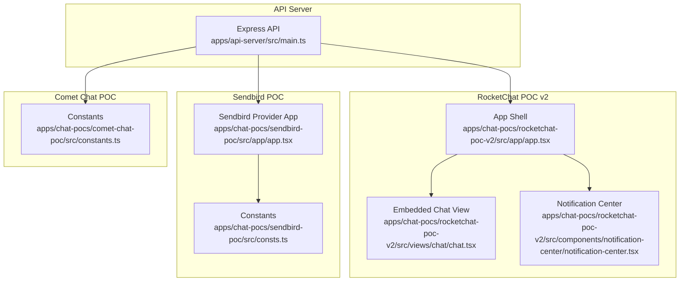
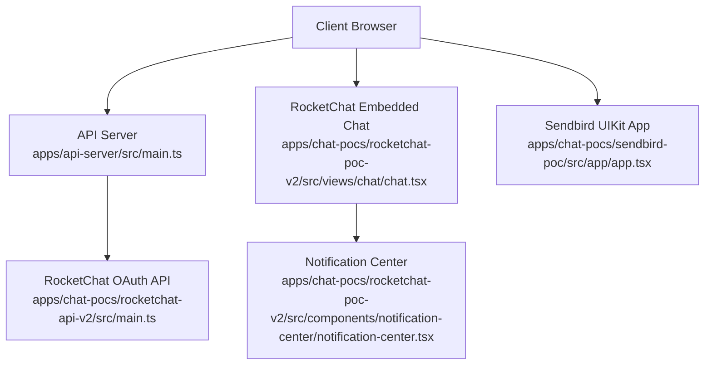
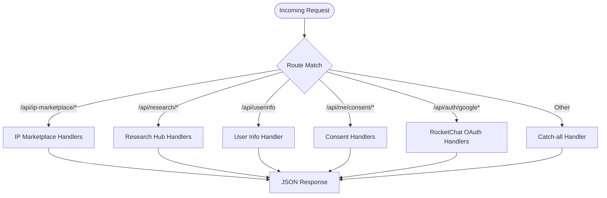
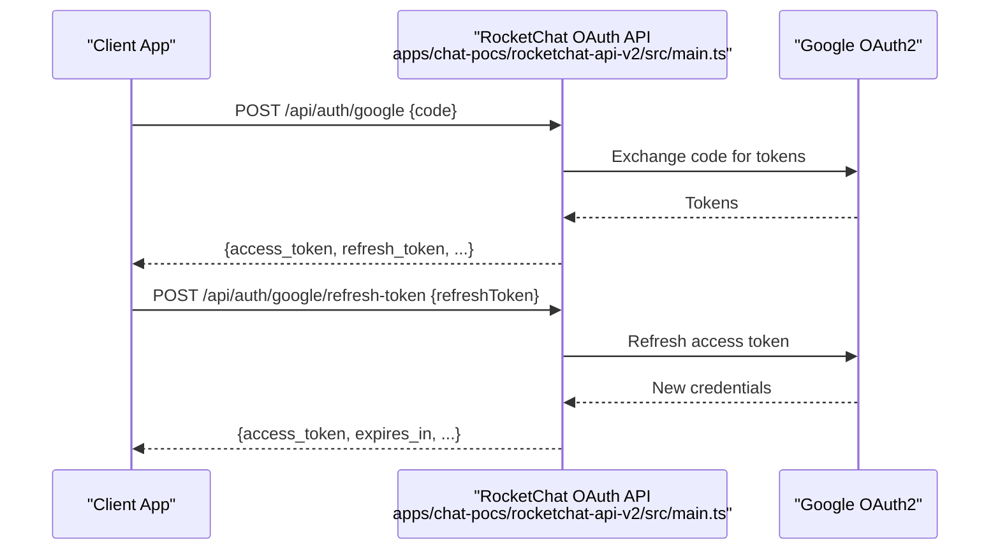
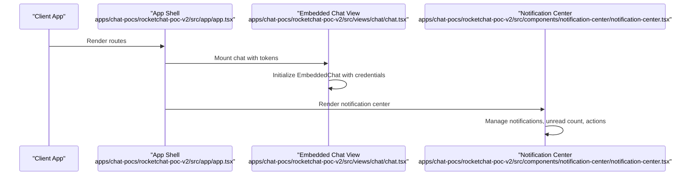
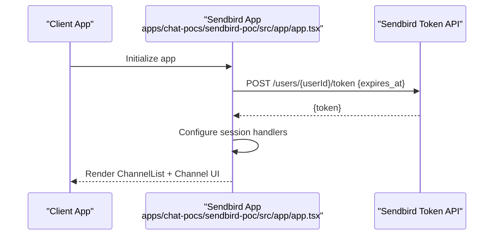
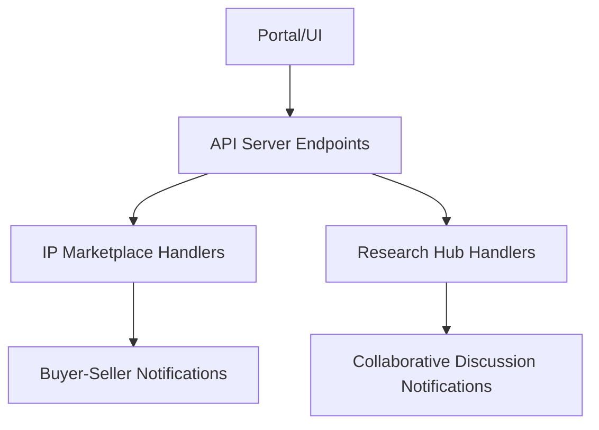
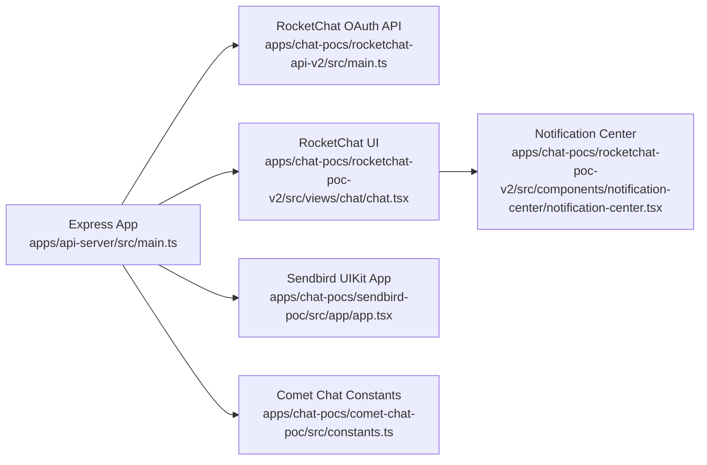

# Chat Webhooks & Notifications

<cite>
**Referenced Files in This Document**
- [apps/api-server/src/main.ts](file://apps/api-server/src/main.ts)
- [apps/chat-pocs/rocketchat-api-v2/src/main.ts](file://apps/chat-pocs/rocketchat-api-v2/src/main.ts)
- [apps/chat-pocs/rocketchat-poc-v2/src/views/chat/chat.tsx](file://apps/chat-pocs/rocketchat-poc-v2/src/views/chat/chat.tsx)
- [apps/chat-pocs/rocketchat-poc-v2/src/components/notification-center/notification-center.tsx](file://apps/chat-pocs/rocketchat-poc-v2/src/components/notification-center/notification-center.tsx)
- [apps/chat-pocs/rocketchat-poc-v2/src/components/notification-center/item-actions/item-actions.tsx](file://apps/chat-pocs/rocketchat-poc-v2/src/components/notification-center/item-actions/item-actions.tsx)
- [apps/chat-pocs/rocketchat-poc-v2/src/components/notification-center/time-tracker.tsx](file://apps/chat-pocs/rocketchat-poc-v2/src/components/notification-center/time-tracker.tsx)
- [apps/chat-pocs/rocketchat-poc-v2/src/components/notification-center/trigger.tsx](file://apps/chat-pocs/rocketchat-poc-v2/src/components/notification-center/trigger.tsx)
- [apps/chat-pocs/rocketchat-poc-v2/src/components/notification-center/switch.tsx](file://apps/chat-pocs/rocketchat-poc-v2/src/components/notification-center/switch.tsx)
- [apps/chat-pocs/rocketchat-poc-v2/src/components/notification-center/item-actions/pulsing-dot.tsx](file://apps/chat-pocs/rocketchat-poc-v2/src/components/notification-center/item-actions/pulsing-dot.tsx)
- [apps/chat-pocs/rocketchat-poc-v2/src/app/app.tsx](file://apps/chat-pocs/rocketchat-poc-v2/src/app/app.tsx)
- [apps/chat-pocs/sendbird-poc/src/app/app.tsx](file://apps/chat-pocs/sendbird-poc/src/app/app.tsx)
- [apps/chat-pocs/sendbird-poc/src/consts.ts](file://apps/chat-pocs/sendbird-poc/src/consts.ts)
- [apps/chat-pocs/comet-chat-poc/src/constants.ts](file://apps/chat-pocs/comet-chat-poc/src/constants.ts)
</cite>

## Table of Contents
1. [Introduction](#introduction)
2. [Project Structure](#project-structure)
3. [Core Components](#core-components)
4. [Architecture Overview](#architecture-overview)
5. [Detailed Component Analysis](#detailed-component-analysis)
6. [Dependency Analysis](#dependency-analysis)
7. [Performance Considerations](#performance-considerations)
8. [Troubleshooting Guide](#troubleshooting-guide)
9. [Conclusion](#conclusion)
10. [Appendices](#appendices)

## Introduction
This document describes the chat webhook processing and notification system across the RocketChat and Sendbird integrations, and how the API server supports buyer-seller communications via the IP marketplace and collaborative discussions via the research hub. It explains payload structures, event types, processing workflows, notification task implementation, scheduled execution, message delivery mechanisms, message formatting, user targeting, and delivery confirmation. It also covers webhook endpoint configuration, payload validation, error handling strategies, security considerations (authentication, rate limiting, retry mechanisms), and troubleshooting and monitoring approaches.

## Project Structure
The repository includes:
- A lightweight API server that exposes endpoints for IP marketplace and research hub, and acts as a developer proxy for chat-related integrations.
- RocketChat POCs (v1 and v2) with embedded chat and a notification center UI.
- Sendbird POC with session token issuance and chat UI.
- Comet Chat POC with constants for app configuration.

**Diagram sources**
- [apps/api-server/src/main.ts](file://apps/api-server/src/main.ts)
- [apps/chat-pocs/rocketchat-poc-v2/src/app/app.tsx](file://apps/chat-pocs/rocketchat-poc-v2/src/app/app.tsx)
- [apps/chat-pocs/rocketchat-poc-v2/src/views/chat/chat.tsx](file://apps/chat-pocs/rocketchat-poc-v2/src/views/chat/chat.tsx)
- [apps/chat-pocs/rocketchat-poc-v2/src/components/notification-center/notification-center.tsx](file://apps/chat-pocs/rocketchat-poc-v2/src/components/notification-center/notification-center.tsx)
- [apps/chat-pocs/sendbird-poc/src/app/app.tsx](file://apps/chat-pocs/sendbird-poc/src/app/app.tsx)
- [apps/chat-pocs/sendbird-poc/src/consts.ts](file://apps/chat-pocs/sendbird-poc/src/consts.ts)
- [apps/chat-pocs/comet-chat-poc/src/constants.ts](file://apps/chat-pocs/comet-chat-poc/src/constants.ts)

**Section sources**
- [apps/api-server/src/main.ts](file://apps/api-server/src/main.ts)
- [apps/chat-pocs/rocketchat-poc-v2/src/app/app.tsx](file://apps/chat-pocs/rocketchat-poc-v2/src/app/app.tsx)
- [apps/chat-pocs/sendbird-poc/src/app/app.tsx](file://apps/chat-pocs/sendbird-poc/src/app/app.tsx)
- [apps/chat-pocs/comet-chat-poc/src/constants.ts](file://apps/chat-pocs/comet-chat-poc/src/constants.ts)

## Core Components
- API Server: Provides endpoints for IP marketplace and research hub, and serves as a developer proxy for chat integrations. It includes Google OAuth token exchange endpoints for RocketChat POC v2 and an embedded chat view that authenticates via tokens.
- RocketChat POC v2: Implements an embedded chat experience and a notification center with unread filtering, mark-as-read/archive actions, and relative timestamps.
- Sendbird POC: Implements session token issuance and a chat UI using Sendbird’s UIKit provider.
- Comet Chat POC: Provides constants for app configuration.

Key responsibilities:
- API Server: Exposes endpoints for IP marketplace listings and research hub content; integrates with RocketChat OAuth endpoints for token exchange.
- RocketChat POC v2: Renders an embedded RocketChat chat room and manages notifications locally in the browser.
- Sendbird POC: Manages session tokens and renders a channel list and conversation UI.
- Comet Chat POC: Supplies configuration constants for app ID, region, auth key, and user ID.

**Section sources**
- [apps/api-server/src/main.ts](file://apps/api-server/src/main.ts)
- [apps/chat-pocs/rocketchat-api-v2/src/main.ts](file://apps/chat-pocs/rocketchat-api-v2/src/main.ts)
- [apps/chat-pocs/rocketchat-poc-v2/src/views/chat/chat.tsx](file://apps/chat-pocs/rocketchat-poc-v2/src/views/chat/chat.tsx)
- [apps/chat-pocs/rocketchat-poc-v2/src/components/notification-center/notification-center.tsx](file://apps/chat-pocs/rocketchat-poc-v2/src/components/notification-center/notification-center.tsx)
- [apps/chat-pocs/sendbird-poc/src/app/app.tsx](file://apps/chat-pocs/sendbird-poc/src/app/app.tsx)
- [apps/chat-pocs/comet-chat-poc/src/constants.ts](file://apps/chat-pocs/comet-chat-poc/src/constants.ts)

## Architecture Overview
The system comprises:
- API Server: Centralized backend for data and chat integration endpoints.
- RocketChat POC v2: Frontend chat widget with embedded RocketChat and a local notification center.
- Sendbird POC: Frontend chat widget with Sendbird UIKit and session token management.
- IP Marketplace and Research Hub: Data endpoints consumed by the portal and integrated chat experiences.

**Diagram sources**
- [apps/api-server/src/main.ts](file://apps/api-server/src/main.ts)
- [apps/chat-pocs/rocketchat-api-v2/src/main.ts](file://apps/chat-pocs/rocketchat-api-v2/src/main.ts)
- [apps/chat-pocs/rocketchat-poc-v2/src/views/chat/chat.tsx](file://apps/chat-pocs/rocketchat-poc-v2/src/views/chat/chat.tsx)
- [apps/chat-pocs/rocketchat-poc-v2/src/components/notification-center/notification-center.tsx](file://apps/chat-pocs/rocketchat-poc-v2/src/components/notification-center/notification-center.tsx)
- [apps/chat-pocs/sendbird-poc/src/app/app.tsx](file://apps/chat-pocs/sendbird-poc/src/app/app.tsx)

## Detailed Component Analysis

### API Server: Endpoints and Data Model
The API server exposes:
- IP Marketplace endpoints: listing retrieval, filters, creation, and contact request submission.
- Research hub endpoints: listing retrieval, creation, expert notes, and library documents.
- User info and consent endpoints for portal integration.
- RocketChat OAuth endpoints for token exchange and refresh in the POC.

Processing logic highlights:
- Data normalization for user records to match portal expectations.
- Pagination helpers for list endpoints.
- Catch-all handler for unimplemented routes returning empty lists or success objects.

**Diagram sources**
- [apps/api-server/src/main.ts](file://apps/api-server/src/main.ts)

**Section sources**
- [apps/api-server/src/main.ts](file://apps/api-server/src/main.ts)

### RocketChat OAuth API (POC v2)
Purpose:
- Exchange authorization code for tokens and refresh access tokens for embedded chat authentication.

Key behaviors:
- Accepts POST requests with authorization code.
- Uses Google OAuth2 client to retrieve tokens.
- Supports refresh token flow for long-lived access.

**Diagram sources**
- [apps/chat-pocs/rocketchat-api-v2/src/main.ts](file://apps/chat-pocs/rocketchat-api-v2/src/main.ts)

**Section sources**
- [apps/chat-pocs/rocketchat-api-v2/src/main.ts](file://apps/chat-pocs/rocketchat-api-v2/src/main.ts)

### RocketChat Embedded Chat and Notification Center
RocketChat POC v2 integrates:
- Embedded chat using RocketChat’s embedded SDK with token-based authentication.
- Local notification center with unread filtering, mark-as-read/archive actions, and relative timestamps.

**Diagram sources**
- [apps/chat-pocs/rocketchat-poc-v2/src/app/app.tsx](file://apps/chat-pocs/rocketchat-poc-v2/src/app/app.tsx)
- [apps/chat-pocs/rocketchat-poc-v2/src/views/chat/chat.tsx](file://apps/chat-pocs/rocketchat-poc-v2/src/views/chat/chat.tsx)
- [apps/chat-pocs/rocketchat-poc-v2/src/components/notification-center/notification-center.tsx](file://apps/chat-pocs/rocketchat-poc-v2/src/components/notification-center/notification-center.tsx)

**Section sources**
- [apps/chat-pocs/rocketchat-poc-v2/src/views/chat/chat.tsx](file://apps/chat-pocs/rocketchat-poc-v2/src/views/chat/chat.tsx)
- [apps/chat-pocs/rocketchat-poc-v2/src/components/notification-center/notification-center.tsx](file://apps/chat-pocs/rocketchat-poc-v2/src/components/notification-center/notification-center.tsx)
- [apps/chat-pocs/rocketchat-poc-v2/src/components/notification-center/item-actions/item-actions.tsx](file://apps/chat-pocs/rocketchat-poc-v2/src/components/notification-center/item-actions/item-actions.tsx)
- [apps/chat-pocs/rocketchat-poc-v2/src/components/notification-center/time-tracker.tsx](file://apps/chat-pocs/rocketchat-poc-v2/src/components/notification-center/time-tracker.tsx)
- [apps/chat-pocs/rocketchat-poc-v2/src/components/notification-center/trigger.tsx](file://apps/chat-pocs/rocketchat-poc-v2/src/components/notification-center/trigger.tsx)
- [apps/chat-pocs/rocketchat-poc-v2/src/components/notification-center/switch.tsx](file://apps/chat-pocs/rocketchat-poc-v2/src/components/notification-center/switch.tsx)
- [apps/chat-pocs/rocketchat-poc-v2/src/components/notification-center/item-actions/pulsing-dot.tsx](file://apps/chat-pocs/rocketchat-poc-v2/src/components/notification-center/item-actions/pulsing-dot.tsx)
- [apps/chat-pocs/rocketchat-poc-v2/src/app/app.tsx](file://apps/chat-pocs/rocketchat-poc-v2/src/app/app.tsx)

### Sendbird Chat Integration
Sendbird POC:
- Issues session tokens via API calls using an API token and user ID.
- Renders a channel list and conversation UI using Sendbird UIKit.
- Configures session handlers for token refresh and error handling.

**Diagram sources**
- [apps/chat-pocs/sendbird-poc/src/app/app.tsx](file://apps/chat-pocs/sendbird-poc/src/app/app.tsx)

**Section sources**
- [apps/chat-pocs/sendbird-poc/src/app/app.tsx](file://apps/chat-pocs/sendbird-poc/src/app/app.tsx)
- [apps/chat-pocs/sendbird-poc/src/consts.ts](file://apps/chat-pocs/sendbird-poc/src/consts.ts)

### IP Marketplace and Research Hub Integration
The API server exposes endpoints for:
- IP marketplace listings, filters, creation, and contact request submission.
- Research hub content, expert notes, and library documents.

These endpoints integrate with the portal and can be extended to trigger chat notifications or webhook events for buyer-seller communications and collaborative discussions.

**Diagram sources**
- [apps/api-server/src/main.ts](file://apps/api-server/src/main.ts)

**Section sources**
- [apps/api-server/src/main.ts](file://apps/api-server/src/main.ts)

## Dependency Analysis
High-level dependencies:
- API Server depends on Express and CORS middleware; it loads a local database file for mock data.
- RocketChat POC v2 depends on EmbeddedChat and React Toastify for notifications.
- Sendbird POC depends on Sendbird UIKit and session token APIs.
- Comet Chat POC depends on constants for app configuration.

**Diagram sources**
- [apps/api-server/src/main.ts](file://apps/api-server/src/main.ts)
- [apps/chat-pocs/rocketchat-api-v2/src/main.ts](file://apps/chat-pocs/rocketchat-api-v2/src/main.ts)
- [apps/chat-pocs/rocketchat-poc-v2/src/views/chat/chat.tsx](file://apps/chat-pocs/rocketchat-poc-v2/src/views/chat/chat.tsx)
- [apps/chat-pocs/rocketchat-poc-v2/src/components/notification-center/notification-center.tsx](file://apps/chat-pocs/rocketchat-poc-v2/src/components/notification-center/notification-center.tsx)
- [apps/chat-pocs/sendbird-poc/src/app/app.tsx](file://apps/chat-pocs/sendbird-poc/src/app/app.tsx)
- [apps/chat-pocs/comet-chat-poc/src/constants.ts](file://apps/chat-pocs/comet-chat-poc/src/constants.ts)

**Section sources**
- [apps/api-server/src/main.ts](file://apps/api-server/src/main.ts)
- [apps/chat-pocs/rocketchat-api-v2/src/main.ts](file://apps/chat-pocs/rocketchat-api-v2/src/main.ts)
- [apps/chat-pocs/rocketchat-poc-v2/src/views/chat/chat.tsx](file://apps/chat-pocs/rocketchat-poc-v2/src/views/chat/chat.tsx)
- [apps/chat-pocs/rocketchat-poc-v2/src/components/notification-center/notification-center.tsx](file://apps/chat-pocs/rocketchat-poc-v2/src/components/notification-center/notification-center.tsx)
- [apps/chat-pocs/sendbird-poc/src/app/app.tsx](file://apps/chat-pocs/sendbird-poc/src/app/app.tsx)
- [apps/chat-pocs/comet-chat-poc/src/constants.ts](file://apps/chat-pocs/comet-chat-poc/src/constants.ts)

## Performance Considerations
- API Server: Uses in-memory data loading and simple pagination helpers; optimize by adding caching, indexing, and pagination limits for large datasets.
- RocketChat POC v2: Notification center uses client-side state; keep notification lists bounded and avoid excessive re-renders by leveraging memoization and efficient list rendering.
- Sendbird POC: Session token issuance should be cached and refreshed proactively to minimize latency during chat interactions.

[No sources needed since this section provides general guidance]

## Troubleshooting Guide
Common issues and resolutions:
- RocketChat OAuth token exchange fails:
  - Verify client ID and secret environment variables.
  - Ensure the authorization code is valid and not expired.
  - Confirm the redirect URI matches the registered OAuth application configuration.
- Embedded chat does not load:
  - Check that access and ID tokens are present and valid.
  - Confirm the RocketChat host URL and room/channel identifiers.
- Notification center not updating:
  - Verify unread count and notification state updates.
  - Ensure actions (mark as read, archive) are invoked correctly.
- Sendbird session token errors:
  - Validate API token and user ID.
  - Confirm the token expiration time and refresh logic.
- API server endpoints return unexpected results:
  - Check data file loading and JSON parsing.
  - Verify route handlers and pagination parameters.

Monitoring approaches:
- Log incoming requests and responses at the API server.
- Track token issuance and refresh success rates.
- Monitor notification center interactions and unread counts.
- Observe chat UI initialization and error boundaries.

**Section sources**
- [apps/chat-pocs/rocketchat-api-v2/src/main.ts](file://apps/chat-pocs/rocketchat-api-v2/src/main.ts)
- [apps/chat-pocs/rocketchat-poc-v2/src/views/chat/chat.tsx](file://apps/chat-pocs/rocketchat-poc-v2/src/views/chat/chat.tsx)
- [apps/chat-pocs/rocketchat-poc-v2/src/components/notification-center/notification-center.tsx](file://apps/chat-pocs/rocketchat-poc-v2/src/components/notification-center/notification-center.tsx)
- [apps/chat-pocs/sendbird-poc/src/app/app.tsx](file://apps/chat-pocs/sendbird-poc/src/app/app.tsx)
- [apps/api-server/src/main.ts](file://apps/api-server/src/main.ts)

## Conclusion
The chat webhook and notification system integrates an API server with RocketChat and Sendbird chat experiences. The RocketChat POC v2 provides embedded chat and a local notification center, while the Sendbird POC manages session tokens and chat UI. The API server supports IP marketplace and research hub endpoints that can be extended to trigger notifications and webhooks for buyer-seller communications and collaborative discussions. Security, rate limiting, and retry mechanisms should be implemented at the API gateway and chat providers to ensure robust webhook processing and reliable message delivery.

[No sources needed since this section summarizes without analyzing specific files]

## Appendices

### Webhook Endpoint Configuration Examples
- RocketChat OAuth endpoints:
  - POST /api/auth/google: Exchanges authorization code for tokens.
  - POST /api/auth/google/refresh-token: Refreshes access tokens.
- IP Marketplace contact request:
  - PUT /api/ip-marketplace/{id}/request-contact: Submits contact request and returns timestamp.

Configuration notes:
- Set environment variables for client ID and secret.
- Ensure HTTPS endpoints for production deployments.
- Validate request payloads and enforce content-type headers.

**Section sources**
- [apps/chat-pocs/rocketchat-api-v2/src/main.ts](file://apps/chat-pocs/rocketchat-api-v2/src/main.ts)
- [apps/api-server/src/main.ts](file://apps/api-server/src/main.ts)

### Payload Validation and Error Handling Strategies
- Validate request bodies and required fields before processing.
- Return structured error responses with appropriate HTTP status codes.
- Implement retry logic for transient failures and exponential backoff.
- Log validation errors and unexpected conditions for monitoring.

**Section sources**
- [apps/api-server/src/main.ts](file://apps/api-server/src/main.ts)
- [apps/chat-pocs/rocketchat-api-v2/src/main.ts](file://apps/chat-pocs/rocketchat-api-v2/src/main.ts)

### Security Considerations
- Authentication:
  - Use signed JWTs or OAuth tokens for webhook authenticity.
  - Enforce HTTPS and TLS for all webhook endpoints.
- Rate Limiting:
  - Apply per-IP and per-endpoint rate limits.
  - Use sliding window or token bucket algorithms.
- Retry Mechanisms:
  - Implement idempotent processing and deduplication keys.
  - Use dead letter queues for failed retries after max attempts.

[No sources needed since this section provides general guidance]