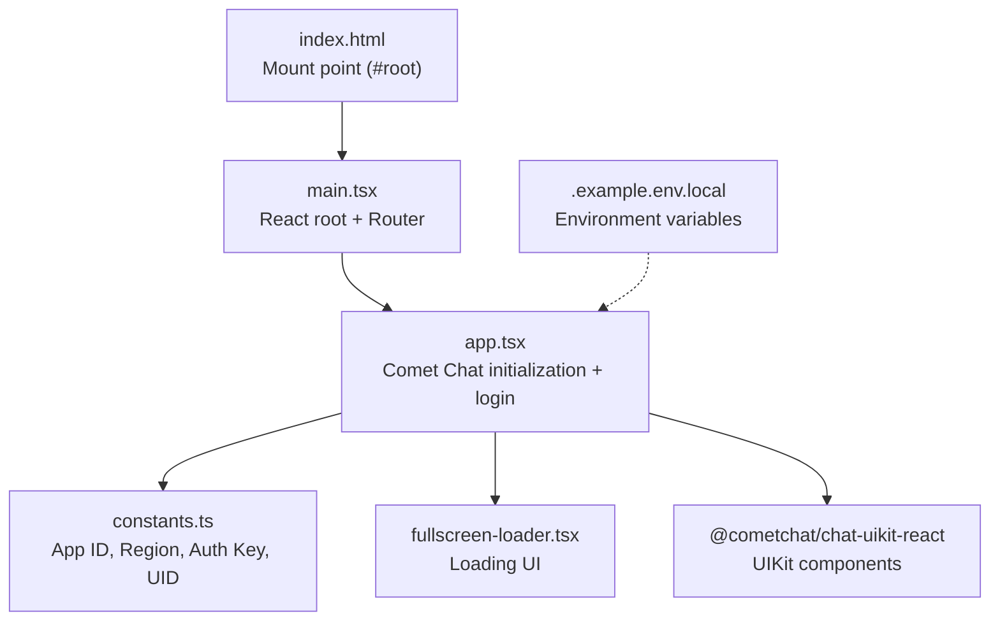
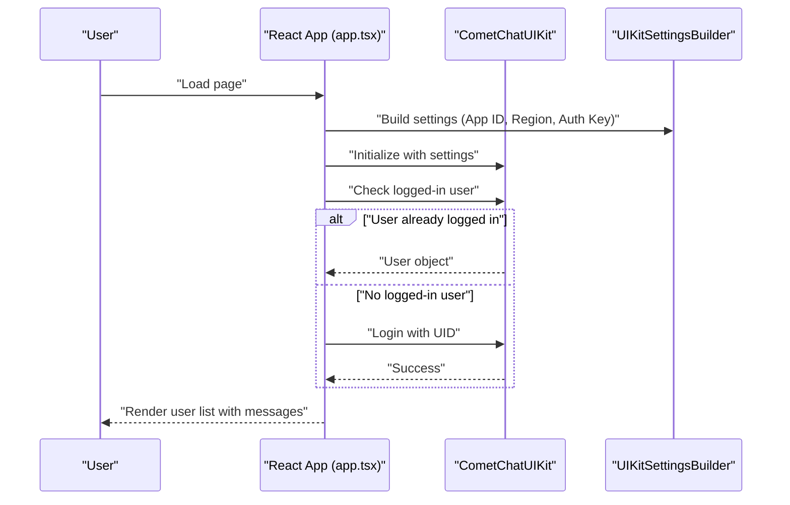
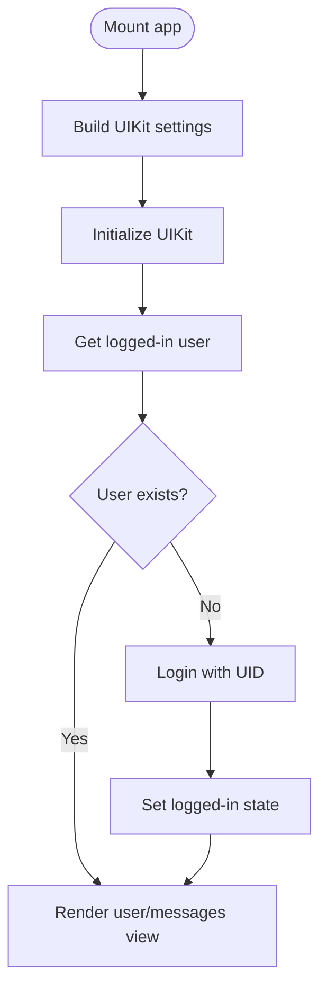
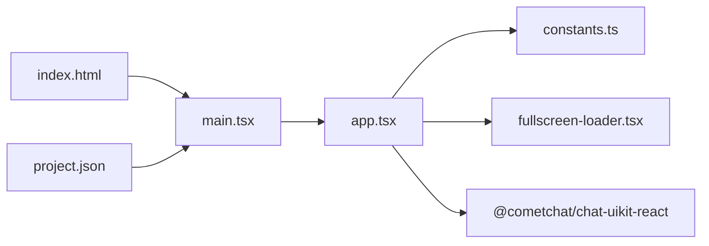

# Comet Chat Integration

<cite>
**Referenced Files in This Document**
- [main.tsx](file://apps/chat-pocs/comet-chat-poc/src/main.tsx)
- [app.tsx](file://apps/chat-pocs/comet-chat-poc/src/app/app.tsx)
- [constants.ts](file://apps/chat-pocs/comet-chat-poc/src/constants.ts)
- [fullscreen-loader.tsx](file://apps/chat-pocs/comet-chat-poc/src/components/fullscreen-loader.tsx)
- [.example.env.local](file://apps/chat-pocs/comet-chat-poc/.example.env.local)
- [index.html](file://apps/chat-pocs/comet-chat-poc/index.html)
- [project.json](file://apps/chat-pocs/comet-chat-poc/project.json)
</cite>

## Table of Contents
1. [Introduction](#introduction)
2. [Project Structure](#project-structure)
3. [Core Components](#core-components)
4. [Architecture Overview](#architecture-overview)
5. [Detailed Component Analysis](#detailed-component-analysis)
6. [Dependency Analysis](#dependency-analysis)
7. [Performance Considerations](#performance-considerations)
8. [Security and Compliance](#security-and-compliance)
9. [Troubleshooting Guide](#troubleshooting-guide)
10. [Conclusion](#conclusion)

## Introduction
This document describes the Comet Chat integration implemented as a proof-of-concept within the Redesign Health platform. It focuses on the React-based UI implementation using the Comet Chat UIKit, covering initialization, authentication flow, real-time messaging presentation, and configuration requirements. It also provides guidance for integrating the chat widget into larger applications, customizing appearance, handling events, and addressing performance and security considerations.

## Project Structure
The Comet Chat POC is a standalone Vite-powered React application located under apps/chat-pocs/comet-chat-poc. It initializes the Comet Chat UIKit, authenticates a predefined user, and renders the user list with recent messages.

**Diagram sources**
- [index.html:1-15](file://apps/chat-pocs/comet-chat-poc/index.html#L1-L15)
- [main.tsx:1-15](file://apps/chat-pocs/comet-chat-poc/src/main.tsx#L1-L15)
- [app.tsx:1-60](file://apps/chat-pocs/comet-chat-poc/src/app/app.tsx#L1-L60)
- [constants.ts:1-7](file://apps/chat-pocs/comet-chat-poc/src/constants.ts#L1-L7)
- [fullscreen-loader.tsx:1-12](file://apps/chat-pocs/comet-chat-poc/src/components/fullscreen-loader.tsx#L1-L12)
- [.example.env.local:1-9](file://apps/chat-pocs/comet-chat-poc/.example.env.local#L1-L9)

**Section sources**
- [index.html:1-15](file://apps/chat-pocs/comet-chat-poc/index.html#L1-L15)
- [main.tsx:1-15](file://apps/chat-pocs/comet-chat-poc/src/main.tsx#L1-L15)
- [project.json:1-71](file://apps/chat-pocs/comet-chat-poc/project.json#L1-L71)

## Core Components
- Application bootstrap and routing:
  - The React root mounts the application inside index.html and wraps it with a routing provider.
- Authentication and initialization:
  - The app builds UIKit settings using the application constants and initializes the UIKit.
  - It checks for an existing logged-in user; if none exists, it logs in using a predefined UID.
- UI rendering:
  - Displays a full-screen loader while initializing and switches to the user/messages view upon successful login.

Key implementation references:
- Initialization and login flow: [app.tsx:18-50](file://apps/chat-pocs/comet-chat-poc/src/app/app.tsx#L18-L50)
- UIKit settings builder usage: [app.tsx:20-25](file://apps/chat-pocs/comet-chat-poc/src/app/app.tsx#L20-L25)
- Constants usage: [app.tsx:21-24](file://apps/chat-pocs/comet-chat-poc/src/app/app.tsx#L21-L24), [constants.ts:1-7](file://apps/chat-pocs/comet-chat-poc/src/constants.ts#L1-L7)
- Conditional rendering: [app.tsx:52-56](file://apps/chat-pocs/comet-chat-poc/src/app/app.tsx#L52-L56)

**Section sources**
- [app.tsx:1-60](file://apps/chat-pocs/comet-chat-poc/src/app/app.tsx#L1-L60)
- [constants.ts:1-7](file://apps/chat-pocs/comet-chat-poc/src/constants.ts#L1-L7)
- [fullscreen-loader.tsx:1-12](file://apps/chat-pocs/comet-chat-poc/src/components/fullscreen-loader.tsx#L1-L12)

## Architecture Overview
The integration follows a straightforward initialization pattern:
- On mount, the app constructs UIKit settings from constants.
- It initializes the UIKit and determines whether a user is already logged in.
- If not logged in, it performs a login using a UID.
- Once authenticated, it renders the user list with recent messages.

**Diagram sources**
- [app.tsx:18-50](file://apps/chat-pocs/comet-chat-poc/src/app/app.tsx#L18-L50)

## Detailed Component Analysis

### Initialization and Authentication Flow
The initialization sequence ensures the UIKit is ready before attempting authentication. It subscribes to friend presence and uses a builder pattern to assemble settings from constants.

**Diagram sources**
- [app.tsx:18-50](file://apps/chat-pocs/comet-chat-poc/src/app/app.tsx#L18-L50)

**Section sources**
- [app.tsx:18-50](file://apps/chat-pocs/comet-chat-poc/src/app/app.tsx#L18-L50)

### Configuration and Environment Setup
Configuration is centralized in constants and optionally via environment variables. The example environment file demonstrates the expected keys for Comet Chat and Google OAuth.

- Constants used by the app:
  - App ID, Region, Auth Key, and UID
- Example environment variables:
  - Comet Chat keys and Google OAuth client identifiers

References:
- Constants definition: [constants.ts:1-7](file://apps/chat-pocs/comet-chat-poc/src/constants.ts#L1-L7)
- Environment variable keys: [.example.env.local:4-8](file://apps/chat-pocs/comet-chat-poc/.example.env.local#L4-L8)

**Section sources**
- [constants.ts:1-7](file://apps/chat-pocs/comet-chat-poc/src/constants.ts#L1-L7)
- [.example.env.local:1-9](file://apps/chat-pocs/comet-chat-poc/.example.env.local#L1-L9)

### Real-Time Messaging Presentation
The integration renders a user list with recent messages using a UIKit-provided component. Presence subscriptions are enabled during initialization.

- Component used: Users with messages view
- Presence subscription: Enabled in settings builder

References:
- Rendering component: [app.tsx:54](file://apps/chat-pocs/comet-chat-poc/src/app/app.tsx#L54)
- Presence subscription: [app.tsx:24](file://apps/chat-pocs/comet-chat-poc/src/app/app.tsx#L24)

**Section sources**
- [app.tsx:54](file://apps/chat-pocs/comet-chat-poc/src/app/app.tsx#L54)
- [app.tsx:24](file://apps/chat-pocs/comet-chat-poc/src/app/app.tsx#L24)

### Chat Widget Integration Patterns
To integrate the chat widget into a larger application:
- Mount the React root inside a designated DOM element (as seen in index.html).
- Wrap your app with routing providers if needed.
- Initialize the UIKit during app bootstrap and conditionally render the chat component after authentication.

References:
- Root mounting: [index.html:11-14](file://apps/chat-pocs/comet-chat-poc/index.html#L11-L14)
- React root setup: [main.tsx:7-14](file://apps/chat-pocs/comet-chat-poc/src/main.tsx#L7-L14)
- Conditional rendering: [app.tsx:52-56](file://apps/chat-pocs/comet-chat-poc/src/app/app.tsx#L52-L56)

**Section sources**
- [index.html:11-14](file://apps/chat-pocs/comet-chat-poc/index.html#L11-L14)
- [main.tsx:7-14](file://apps/chat-pocs/comet-chat-poc/src/main.tsx#L7-L14)
- [app.tsx:52-56](file://apps/chat-pocs/comet-chat-poc/src/app/app.tsx#L52-L56)

### Custom Styling Options
Styling can be applied using Chakra UI primitives around the UIKit component. The loader component demonstrates spacing and alignment with Chakra UI components.

References:
- Loader layout with Chakra UI: [fullscreen-loader.tsx:3-9](file://apps/chat-pocs/comet-chat-poc/src/components/fullscreen-loader.tsx#L3-L9)

**Section sources**
- [fullscreen-loader.tsx:1-12](file://apps/chat-pocs/comet-chat-poc/src/components/fullscreen-loader.tsx#L1-L12)

### Event Handling
The current implementation focuses on initialization and rendering. For advanced event handling (e.g., message sent/received, user presence changes), extend the app by:
- Subscribing to UIKit events after initialization.
- Managing state updates and side effects in response to events.

Note: The provided code does not include explicit event handlers; extend the initialization block to attach listeners as needed.

[No sources needed since this section provides general guidance]

## Dependency Analysis
The POC relies on:
- React and React Router for application structure.
- Chakra UI for UI primitives and layout.
- Comet Chat UIKit for chat functionality.
- Vite for build and development server.

**Diagram sources**
- [main.tsx:1-15](file://apps/chat-pocs/comet-chat-poc/src/main.tsx#L1-L15)
- [app.tsx:1-60](file://apps/chat-pocs/comet-chat-poc/src/app/app.tsx#L1-L60)
- [constants.ts:1-7](file://apps/chat-pocs/comet-chat-poc/src/constants.ts#L1-L7)
- [fullscreen-loader.tsx:1-12](file://apps/chat-pocs/comet-chat-poc/src/components/fullscreen-loader.tsx#L1-L12)
- [index.html:1-15](file://apps/chat-pocs/comet-chat-poc/index.html#L1-L15)
- [project.json:1-71](file://apps/chat-pocs/comet-chat-poc/project.json#L1-L71)

**Section sources**
- [project.json:1-71](file://apps/chat-pocs/comet-chat-poc/project.json#L1-L71)

## Performance Considerations
- Lazy initialization: Initialize the UIKit only when needed to avoid blocking the main thread.
- Conditional rendering: Show a lightweight loader while initializing to improve perceived performance.
- Minimize re-renders: Keep the authentication state stable and avoid unnecessary prop drilling.
- Bundle size: Use tree-shaking and only import required UIKit components.

[No sources needed since this section provides general guidance]

## Security and Compliance
- Authentication:
  - The current POC uses a predefined UID for login. In production, replace this with a secure, backend-generated session or JWT-based flow.
- Data protection:
  - Ensure sensitive communications meet healthcare compliance requirements. Use end-to-end encryption where available and configure server-side policies accordingly.
- Environment variables:
  - Store API keys and secrets in environment variables and never hardcode them in client-side code.
- Access control:
  - Enforce strict access control to chat rooms and messages. Verify user identity before granting access.

[No sources needed since this section provides general guidance]

## Troubleshooting Guide
Common issues and resolutions:
- Initialization failures:
  - Verify that the App ID, Region, and Auth Key are correct and match the environment variables.
  - Confirm the UIKit initialization completes without errors before attempting login.
- Login failures:
  - Ensure the UID is valid and registered in the Comet Chat dashboard.
  - Check network connectivity and CORS settings if the app runs behind a proxy.
- Blank screen or loading state:
  - Confirm the root DOM element exists and the React root is mounted correctly.
  - Verify the loader component renders while initialization is in progress.

References:
- Initialization and login logic: [app.tsx:18-50](file://apps/chat-pocs/comet-chat-poc/src/app/app.tsx#L18-L50)
- Root mounting: [index.html:11-14](file://apps/chat-pocs/comet-chat-poc/index.html#L11-L14)
- Loader component: [fullscreen-loader.tsx:3-9](file://apps/chat-pocs/comet-chat-poc/src/components/fullscreen-loader.tsx#L3-L9)

**Section sources**
- [app.tsx:18-50](file://apps/chat-pocs/comet-chat-poc/src/app/app.tsx#L18-L50)
- [index.html:11-14](file://apps/chat-pocs/comet-chat-poc/index.html#L11-L14)
- [fullscreen-loader.tsx:1-12](file://apps/chat-pocs/comet-chat-poc/src/components/fullscreen-loader.tsx#L1-L12)

## Conclusion
The Comet Chat POC demonstrates a clean, minimal integration of the UIKit into a React application. It covers initialization, authentication, and real-time messaging presentation. To deploy in production, strengthen authentication, enforce compliance, and expand event handling as needed.