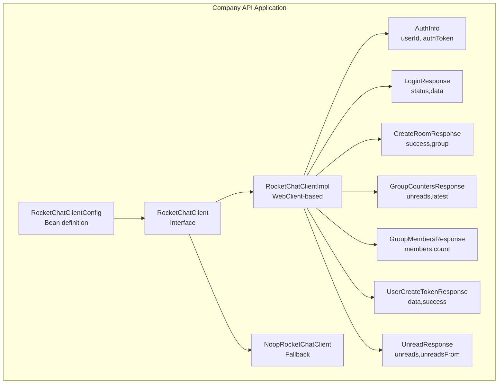
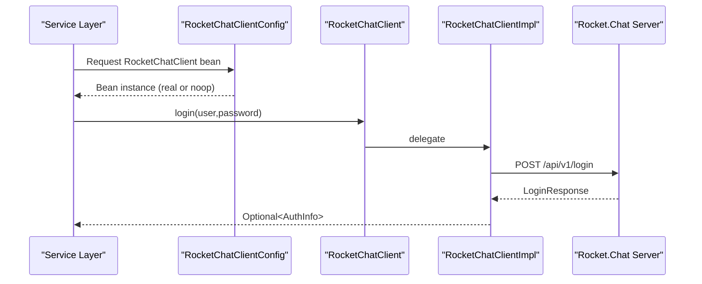
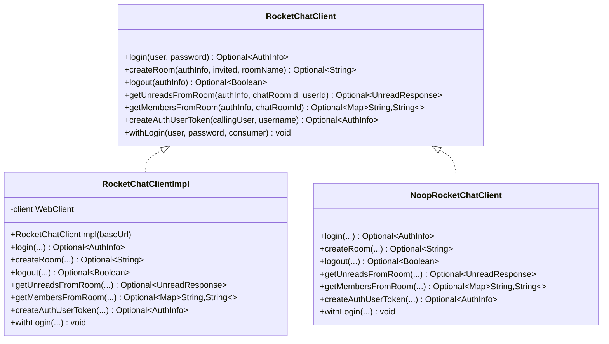
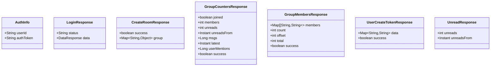
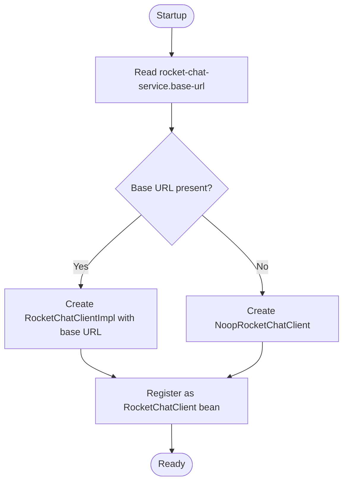
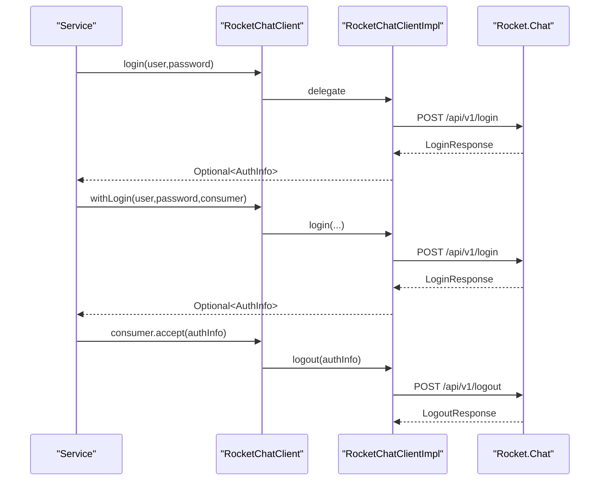
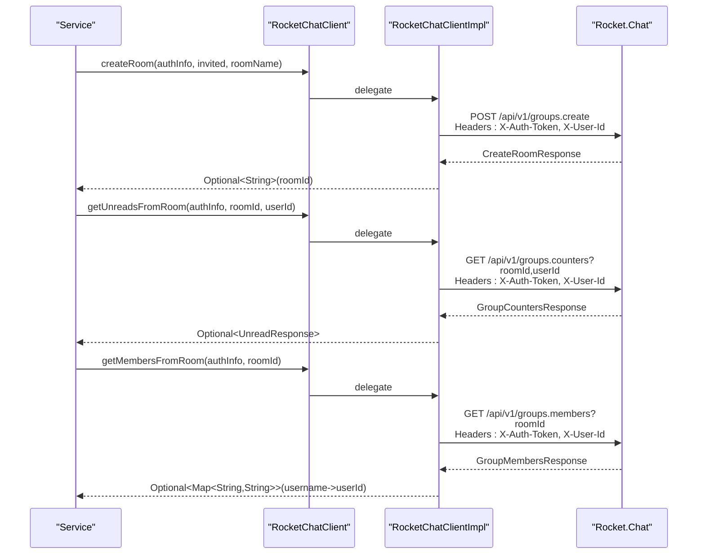
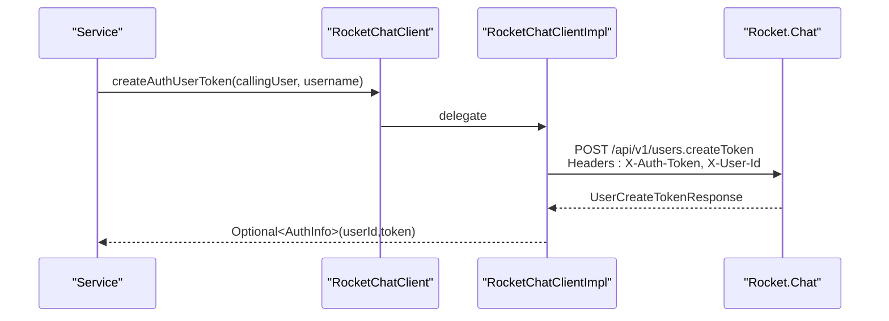
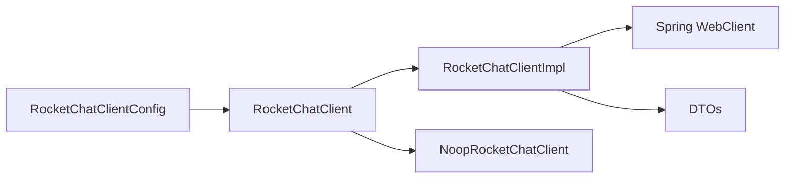

# Company API Chat Client

<cite>
**Referenced Files in This Document**
- [RocketChatClient.java](file://apps/company-api/application/src/main/java/com/redesignhealth/company/api/client/rocketchat/RocketChatClient.java)
- [RocketChatClientImpl.java](file://apps/company-api/application/src/main/java/com/redesignhealth/company/api/client/rocketchat/RocketChatClientImpl.java)
- [NoopRocketChatClient.java](file://apps/company-api/application/src/main/java/com/redesignhealth/company/api/client/rocketchat/NoopRocketChatClient.java)
- [RocketChatClientConfig.java](file://apps/company-api/application/src/main/java/com/redesignhealth/company/api/config/RocketChatClientConfig.java)
- [AuthInfo.java](file://apps/company-api/application/src/main/java/com/redesignhealth/company/api/client/rocketchat/dto/AuthInfo.java)
- [LoginResponse.java](file://apps/company-api/application/src/main/java/com/redesignhealth/company/api/client/rocketchat/dto/LoginResponse.java)
- [CreateRoomResponse.java](file://apps/company-api/application/src/main/java/com/redesignhealth/company/api/client/rocketchat/dto/CreateRoomResponse.java)
- [GroupCountersResponse.java](file://apps/company-api/application/src/main/java/com/redesignhealth/company/api/client/rocketchat/dto/GroupCountersResponse.java)
- [GroupMembersResponse.java](file://apps/company-api/application/src/main/java/com/redesignhealth/company/api/client/rocketchat/dto/GroupMembersResponse.java)
- [UserCreateTokenResponse.java](file://apps/company-api/application/src/main/java/com/redesignhealth/company/api/client/rocketchat/dto/UserCreateTokenResponse.java)
- [UnreadResponse.java](file://apps/company-api/application/src/main/java/com/redesignhealth/company/api/client/rocketchat/dto/UnreadResponse.java)
- [application.yml](file://apps/company-api/application/src/main/resources/application.yml)
- [application-dev.yml](file://apps/company-api/application/src/main/resources/application-dev.yml)
</cite>

## Table of Contents
1. [Introduction](#introduction)
2. [Project Structure](#project-structure)
3. [Core Components](#core-components)
4. [Architecture Overview](#architecture-overview)
5. [Detailed Component Analysis](#detailed-component-analysis)
6. [Dependency Analysis](#dependency-analysis)
7. [Performance Considerations](#performance-considerations)
8. [Troubleshooting Guide](#troubleshooting-guide)
9. [Conclusion](#conclusion)
10. [Appendices](#appendices)

## Introduction
This document describes the Company API chat client implementation focused on Rocket.Chat integration within the backend service. It covers the Java-based client architecture, configuration management, authentication mechanisms, DTO structures, Spring Boot integration patterns, and operational guidance for chat room creation, user invitations, and notification workflows. It also includes error handling, retry strategies, logging, and environment configuration examples.

## Project Structure
The Rocket.Chat integration resides in the Company API application module under the client.rocketchat package. It includes:
- A client interface defining the contract for chat operations
- An implementation using Spring WebClient to call Rocket.Chat REST APIs
- A no-op fallback client for environments without Rocket.Chat
- Spring configuration to wire the client bean conditionally
- DTOs representing Rocket.Chat API responses and internal auth data
- Application configuration files defining Rocket.Chat service settings

**Diagram sources**
- [RocketChatClientConfig.java:10-18](file://apps/company-api/application/src/main/java/com/redesignhealth/company/api/config/RocketChatClientConfig.java#L10-L18)
- [RocketChatClient.java:11-25](file://apps/company-api/application/src/main/java/com/redesignhealth/company/api/client/rocketchat/RocketChatClient.java#L11-L25)
- [RocketChatClientImpl.java:19-24](file://apps/company-api/application/src/main/java/com/redesignhealth/company/api/client/rocketchat/RocketChatClientImpl.java#L19-L24)
- [NoopRocketChatClient.java:13](file://apps/company-api/application/src/main/java/com/redesignhealth/company/api/client/rocketchat/NoopRocketChatClient.java#L13)
- [AuthInfo.java:8-11](file://apps/company-api/application/src/main/java/com/redesignhealth/company/api/client/rocketchat/dto/AuthInfo.java#L8-L11)
- [LoginResponse.java:6-9](file://apps/company-api/application/src/main/java/com/redesignhealth/company/api/client/rocketchat/dto/LoginResponse.java#L6-L9)
- [CreateRoomResponse.java:7-10](file://apps/company-api/application/src/main/java/com/redesignhealth/company/api/client/rocketchat/dto/CreateRoomResponse.java#L7-L10)
- [GroupCountersResponse.java:7-16](file://apps/company-api/application/src/main/java/com/redesignhealth/company/api/client/rocketchat/dto/GroupCountersResponse.java#L7-L16)
- [GroupMembersResponse.java:8-14](file://apps/company-api/application/src/main/java/com/redesignhealth/company/api/client/rocketchat/dto/GroupMembersResponse.java#L8-L14)
- [UserCreateTokenResponse.java:7-10](file://apps/company-api/application/src/main/java/com/redesignhealth/company/api/client/rocketchat/dto/UserCreateTokenResponse.java#L7-L10)
- [UnreadResponse.java:8-12](file://apps/company-api/application/src/main/java/com/redesignhealth/company/api/client/rocketchat/dto/UnreadResponse.java#L8-L12)

**Section sources**
- [RocketChatClientConfig.java:10-18](file://apps/company-api/application/src/main/java/com/redesignhealth/company/api/config/RocketChatClientConfig.java#L10-L18)
- [RocketChatClient.java:11-25](file://apps/company-api/application/src/main/java/com/redesignhealth/company/api/client/rocketchat/RocketChatClient.java#L11-L25)
- [RocketChatClientImpl.java:19-24](file://apps/company-api/application/src/main/java/com/redesignhealth/company/api/client/rocketchat/RocketChatClientImpl.java#L19-L24)
- [NoopRocketChatClient.java:13](file://apps/company-api/application/src/main/java/com/redesignhealth/company/api/client/rocketchat/NoopRocketChatClient.java#L13)

## Core Components
- RocketChatClient: Defines the contract for chat operations including login, room creation, logout, unread counts, member retrieval, token creation, and scoped login execution.
- RocketChatClientImpl: Implements the contract using Spring WebClient to call Rocket.Chat REST endpoints, passing required headers and parsing responses into DTOs.
- NoopRocketChatClient: Provides a safe fallback that logs and returns empty optional results when Rocket.Chat is disabled.
- RocketChatClientConfig: Registers the appropriate client bean based on configuration presence.
- DTOs: Encapsulate Rocket.Chat API response shapes and internal auth info.

Key capabilities:
- Authentication: login with user credentials, logout, and scoped login execution
- Room management: create group rooms, fetch unread counters, and list members
- Token management: create user tokens for delegated access
- Optional operation: fallback behavior when base URL is not configured

**Section sources**
- [RocketChatClient.java:11-25](file://apps/company-api/application/src/main/java/com/redesignhealth/company/api/client/rocketchat/RocketChatClient.java#L11-L25)
- [RocketChatClientImpl.java:26-42](file://apps/company-api/application/src/main/java/com/redesignhealth/company/api/client/rocketchat/RocketChatClientImpl.java#L26-L42)
- [RocketChatClientImpl.java:44-60](file://apps/company-api/application/src/main/java/com/redesignhealth/company/api/client/rocketchat/RocketChatClientImpl.java#L44-L60)
- [RocketChatClientImpl.java:62-73](file://apps/company-api/application/src/main/java/com/redesignhealth/company/api/client/rocketchat/RocketChatClientImpl.java#L62-L73)
- [RocketChatClientImpl.java:75-96](file://apps/company-api/application/src/main/java/com/redesignhealth/company/api/client/rocketchat/RocketChatClientImpl.java#L75-L96)
- [RocketChatClientImpl.java:98-121](file://apps/company-api/application/src/main/java/com/redesignhealth/company/api/client/rocketchat/RocketChatClientImpl.java#L98-L121)
- [RocketChatClientImpl.java:123-141](file://apps/company-api/application/src/main/java/com/redesignhealth/company/api/client/rocketchat/RocketChatClientImpl.java#L123-L141)
- [RocketChatClientImpl.java:143-151](file://apps/company-api/application/src/main/java/com/redesignhealth/company/api/client/rocketchat/RocketChatClientImpl.java#L143-L151)
- [NoopRocketChatClient.java:13-56](file://apps/company-api/application/src/main/java/com/redesignhealth/company/api/client/rocketchat/NoopRocketChatClient.java#L13-L56)

## Architecture Overview
The Rocket.Chat client integrates as a Spring-managed bean. The configuration checks for a base URL and wires either the real implementation or the no-op client. The implementation uses WebClient to call Rocket.Chat REST endpoints with proper headers and parses responses into DTOs.

**Diagram sources**
- [RocketChatClientConfig.java:12-17](file://apps/company-api/application/src/main/java/com/redesignhealth/company/api/config/RocketChatClientConfig.java#L12-L17)
- [RocketChatClient.java:12](file://apps/company-api/application/src/main/java/com/redesignhealth/company/api/client/rocketchat/RocketChatClient.java#L12)
- [RocketChatClientImpl.java:26-42](file://apps/company-api/application/src/main/java/com/redesignhealth/company/api/client/rocketchat/RocketChatClientImpl.java#L26-L42)
- [LoginResponse.java:6-9](file://apps/company-api/application/src/main/java/com/redesignhealth/company/api/client/rocketchat/dto/LoginResponse.java#L6-L9)

**Section sources**
- [RocketChatClientConfig.java:10-18](file://apps/company-api/application/src/main/java/com/redesignhealth/company/api/config/RocketChatClientConfig.java#L10-L18)
- [RocketChatClientImpl.java:26-42](file://apps/company-api/application/src/main/java/com/redesignhealth/company/api/client/rocketchat/RocketChatClientImpl.java#L26-L42)

## Detailed Component Analysis

### Client Interface and Implementation
The client interface defines the operations available to the service layer. The implementation performs HTTP requests using WebClient, sets Rocket.Chat-required headers (X-Auth-Token, X-User-Id), and maps responses to DTOs.

**Diagram sources**
- [RocketChatClient.java:11-25](file://apps/company-api/application/src/main/java/com/redesignhealth/company/api/client/rocketchat/RocketChatClient.java#L11-L25)
- [RocketChatClientImpl.java:19-24](file://apps/company-api/application/src/main/java/com/redesignhealth/company/api/client/rocketchat/RocketChatClientImpl.java#L19-L24)
- [NoopRocketChatClient.java:13](file://apps/company-api/application/src/main/java/com/redesignhealth/company/api/client/rocketchat/NoopRocketChatClient.java#L13)

**Section sources**
- [RocketChatClient.java:11-25](file://apps/company-api/application/src/main/java/com/redesignhealth/company/api/client/rocketchat/RocketChatClient.java#L11-L25)
- [RocketChatClientImpl.java:19-24](file://apps/company-api/application/src/main/java/com/redesignhealth/company/api/client/rocketchat/RocketChatClientImpl.java#L19-L24)
- [NoopRocketChatClient.java:13](file://apps/company-api/application/src/main/java/com/redesignhealth/company/api/client/rocketchat/NoopRocketChatClient.java#L13)

### DTO Structures
The DTOs model Rocket.Chat API responses and internal auth data used across operations.

**Diagram sources**
- [AuthInfo.java:8-11](file://apps/company-api/application/src/main/java/com/redesignhealth/company/api/client/rocketchat/dto/AuthInfo.java#L8-L11)
- [LoginResponse.java:6-9](file://apps/company-api/application/src/main/java/com/redesignhealth/company/api/client/rocketchat/dto/LoginResponse.java#L6-L9)
- [CreateRoomResponse.java:7-10](file://apps/company-api/application/src/main/java/com/redesignhealth/company/api/client/rocketchat/dto/CreateRoomResponse.java#L7-L10)
- [GroupCountersResponse.java:7-16](file://apps/company-api/application/src/main/java/com/redesignhealth/company/api/client/rocketchat/dto/GroupCountersResponse.java#L7-L16)
- [GroupMembersResponse.java:8-14](file://apps/company-api/application/src/main/java/com/redesignhealth/company/api/client/rocketchat/dto/GroupMembersResponse.java#L8-L14)
- [UserCreateTokenResponse.java:7-10](file://apps/company-api/application/src/main/java/com/redesignhealth/company/api/client/rocketchat/dto/UserCreateTokenResponse.java#L7-L10)
- [UnreadResponse.java:8-12](file://apps/company-api/application/src/main/java/com/redesignhealth/company/api/client/rocketchat/dto/UnreadResponse.java#L8-L12)

**Section sources**
- [AuthInfo.java:8-11](file://apps/company-api/application/src/main/java/com/redesignhealth/company/api/client/rocketchat/dto/AuthInfo.java#L8-L11)
- [LoginResponse.java:6-9](file://apps/company-api/application/src/main/java/com/redesignhealth/company/api/client/rocketchat/dto/LoginResponse.java#L6-L9)
- [CreateRoomResponse.java:7-10](file://apps/company-api/application/src/main/java/com/redesignhealth/company/api/client/rocketchat/dto/CreateRoomResponse.java#L7-L10)
- [GroupCountersResponse.java:7-16](file://apps/company-api/application/src/main/java/com/redesignhealth/company/api/client/rocketchat/dto/GroupCountersResponse.java#L7-L16)
- [GroupMembersResponse.java:8-14](file://apps/company-api/application/src/main/java/com/redesignhealth/company/api/client/rocketchat/dto/GroupMembersResponse.java#L8-L14)
- [UserCreateTokenResponse.java:7-10](file://apps/company-api/application/src/main/java/com/redesignhealth/company/api/client/rocketchat/dto/UserCreateTokenResponse.java#L7-L10)
- [UnreadResponse.java:8-12](file://apps/company-api/application/src/main/java/com/redesignhealth/company/api/client/rocketchat/dto/UnreadResponse.java#L8-L12)

### Configuration Management
The client bean is conditionally created based on the presence of a base URL. When configured, the implementation uses WebClient with the base URL; otherwise, the no-op client is returned.

**Diagram sources**
- [RocketChatClientConfig.java:12-17](file://apps/company-api/application/src/main/java/com/redesignhealth/company/api/config/RocketChatClientConfig.java#L12-L17)
- [application.yml:610-616](file://apps/company-api/application/src/main/resources/application.yml#L610-L616)
- [application-dev.yml:39-41](file://apps/company-api/application/src/main/resources/application-dev.yml#L39-L41)

**Section sources**
- [RocketChatClientConfig.java:10-18](file://apps/company-api/application/src/main/java/com/redesignhealth/company/api/config/RocketChatClientConfig.java#L10-L18)
- [application.yml:610-616](file://apps/company-api/application/src/main/resources/application.yml#L610-L616)
- [application-dev.yml:39-41](file://apps/company-api/application/src/main/resources/application-dev.yml#L39-L41)

### Authentication Mechanisms
- Login: Sends user credentials to the login endpoint and extracts user ID and auth token for subsequent requests.
- Logout: Invalidates the current session using stored credentials.
- Scoped login: Performs an operation with temporary credentials, then logs out automatically.

**Diagram sources**
- [RocketChatClientImpl.java:26-42](file://apps/company-api/application/src/main/java/com/redesignhealth/company/api/client/rocketchat/RocketChatClientImpl.java#L26-L42)
- [RocketChatClientImpl.java:62-73](file://apps/company-api/application/src/main/java/com/redesignhealth/company/api/client/rocketchat/RocketChatClientImpl.java#L62-L73)
- [RocketChatClientImpl.java:143-151](file://apps/company-api/application/src/main/java/com/redesignhealth/company/api/client/rocketchat/RocketChatClientImpl.java#L143-L151)

**Section sources**
- [RocketChatClientImpl.java:26-42](file://apps/company-api/application/src/main/java/com/redesignhealth/company/api/client/rocketchat/RocketChatClientImpl.java#L26-L42)
- [RocketChatClientImpl.java:62-73](file://apps/company-api/application/src/main/java/com/redesignhealth/company/api/client/rocketchat/RocketChatClientImpl.java#L62-L73)
- [RocketChatClientImpl.java:143-151](file://apps/company-api/application/src/main/java/com/redesignhealth/company/api/client/rocketchat/RocketChatClientImpl.java#L143-L151)

### Room Management and User Invitation Workflows
- Create room: Posts to groups.create with a list of member usernames and room name; returns the new room ID.
- Get unread counters: Queries group counters for unread messages and last unread timestamp.
- Get members: Lists members and returns a map of usernames to user IDs.

**Diagram sources**
- [RocketChatClientImpl.java:44-60](file://apps/company-api/application/src/main/java/com/redesignhealth/company/api/client/rocketchat/RocketChatClientImpl.java#L44-L60)
- [RocketChatClientImpl.java:75-96](file://apps/company-api/application/src/main/java/com/redesignhealth/company/api/client/rocketchat/RocketChatClientImpl.java#L75-L96)
- [RocketChatClientImpl.java:98-121](file://apps/company-api/application/src/main/java/com/redesignhealth/company/api/client/rocketchat/RocketChatClientImpl.java#L98-L121)

**Section sources**
- [RocketChatClientImpl.java:44-60](file://apps/company-api/application/src/main/java/com/redesignhealth/company/api/client/rocketchat/RocketChatClientImpl.java#L44-L60)
- [RocketChatClientImpl.java:75-96](file://apps/company-api/application/src/main/java/com/redesignhealth/company/api/client/rocketchat/RocketChatClientImpl.java#L75-L96)
- [RocketChatClientImpl.java:98-121](file://apps/company-api/application/src/main/java/com/redesignhealth/company/api/client/rocketchat/RocketChatClientImpl.java#L98-L121)

### Message Moderation Features
- Token-based delegation: The createAuthUserToken endpoint allows generating tokens for specific users, enabling controlled access for moderation tasks.
- Header-based authentication: All operations set X-Auth-Token and X-User-Id headers required by Rocket.Chat.

**Diagram sources**
- [RocketChatClientImpl.java:123-141](file://apps/company-api/application/src/main/java/com/redesignhealth/company/api/client/rocketchat/RocketChatClientImpl.java#L123-L141)

**Section sources**
- [RocketChatClientImpl.java:123-141](file://apps/company-api/application/src/main/java/com/redesignhealth/company/api/client/rocketchat/RocketChatClientImpl.java#L123-L141)

### Webhook Processing and Real-time Event Handling
- The repository includes database migration files indicating chat-related monitoring and IP marketplace attributes, suggesting potential integration points for chat events and notifications.
- Rocket.Chat webhook configurations are not present in the analyzed client code; however, the existing chat-related database artifacts imply that chat events could be surfaced to downstream systems.

Note: The current client implementation focuses on REST API calls. Webhook ingestion and real-time event handling would require additional server-side components not included in the analyzed files.

**Section sources**
- [V202312082200__add_new_attributes_for_chat_in_ip_marketplace_track.sql](file://apps/company-api/application/src/main/resources/db/migration/V202312082200__add_new_attributes_for_chat_in_ip_marketplace_track.sql)
- [V202401042040__rocketchat_check_monitoring.sql](file://apps/company-api/application/src/main/resources/db/migration/V202401042040__rocketchat_check_monitoring.sql)

## Dependency Analysis
The client depends on Spring WebClient for HTTP communication and uses Rocket.Chat REST endpoints. The configuration controls whether the real client or the no-op client is injected.

**Diagram sources**
- [RocketChatClientConfig.java:12-17](file://apps/company-api/application/src/main/java/com/redesignhealth/company/api/config/RocketChatClientConfig.java#L12-L17)
- [RocketChatClientImpl.java:19-24](file://apps/company-api/application/src/main/java/com/redesignhealth/company/api/client/rocketchat/RocketChatClientImpl.java#L19-L24)

**Section sources**
- [RocketChatClientConfig.java:10-18](file://apps/company-api/application/src/main/java/com/redesignhealth/company/api/config/RocketChatClientConfig.java#L10-L18)
- [RocketChatClientImpl.java:19-24](file://apps/company-api/application/src/main/java/com/redesignhealth/company/api/client/rocketchat/RocketChatClientImpl.java#L19-L24)

## Performance Considerations
- Synchronous blocking: The implementation uses blockOptional() on Mono responses, which blocks threads. In high-throughput scenarios, consider reactive streams end-to-end to avoid thread blocking.
- Retry and timeout: Configure WebClient timeouts and retry policies at the bean level to improve resilience against transient failures.
- Logging overhead: Excessive logging in hot paths can impact performance; tune log levels appropriately.

[No sources needed since this section provides general guidance]

## Troubleshooting Guide
Common issues and resolutions:
- Base URL not configured: The client falls back to no-op. Verify rocket-chat-service.base-url in application configuration.
- Authentication failures: Ensure user credentials are correct and the user exists in Rocket.Chat. Confirm X-Auth-Token and X-User-Id headers are being sent.
- Room creation errors: Validate member usernames and room name constraints. Check group creation permissions.
- Unread counters and member queries: Confirm roomId and userId correctness and that the caller belongs to the room.
- Token creation: Ensure the calling user has permission to create tokens for other users.

Operational tips:
- Enable request/response logging for Rocket.Chat endpoints during debugging.
- Monitor WebClient timeouts and retry behavior.
- Use scoped login for short-lived operations to minimize token lifetime.

**Section sources**
- [RocketChatClientConfig.java:12-17](file://apps/company-api/application/src/main/java/com/redesignhealth/company/api/config/RocketChatClientConfig.java#L12-L17)
- [RocketChatClientImpl.java:26-42](file://apps/company-api/application/src/main/java/com/redesignhealth/company/api/client/rocketchat/RocketChatClientImpl.java#L26-L42)
- [RocketChatClientImpl.java:44-60](file://apps/company-api/application/src/main/java/com/redesignhealth/company/api/client/rocketchat/RocketChatClientImpl.java#L44-L60)
- [RocketChatClientImpl.java:75-96](file://apps/company-api/application/src/main/java/com/redesignhealth/company/api/client/rocketchat/RocketChatClientImpl.java#L75-L96)
- [RocketChatClientImpl.java:98-121](file://apps/company-api/application/src/main/java/com/redesignhealth/company/api/client/rocketchat/RocketChatClientImpl.java#L98-L121)
- [RocketChatClientImpl.java:123-141](file://apps/company-api/application/src/main/java/com/redesignhealth/company/api/client/rocketchat/RocketChatClientImpl.java#L123-L141)

## Conclusion
The Rocket.Chat integration in the Company API provides a clean, configurable client abstraction with DTO-driven responses. It supports essential chat operations and can be extended to handle webhooks and real-time events. Proper configuration, resilient HTTP client setup, and careful logging are key to reliable operation.

[No sources needed since this section summarizes without analyzing specific files]

## Appendices

### Configuration Examples
- Production environment: Set rocket-chat-service.base-url to the Rocket.Chat instance URL.
- Development environment: Configure rocket-chat-service.base-url to the dev Rocket.Chat endpoint.

Environment-specific overrides:
- application.yml: Global defaults and Rocket.Chat service settings
- application-dev.yml: Environment-specific overrides including base URL

**Section sources**
- [application.yml:610-616](file://apps/company-api/application/src/main/resources/application.yml#L610-L616)
- [application-dev.yml:39-41](file://apps/company-api/application/src/main/resources/application-dev.yml#L39-L41)