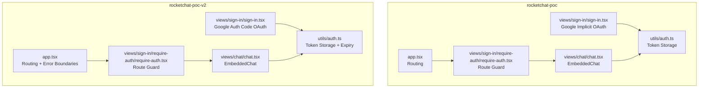
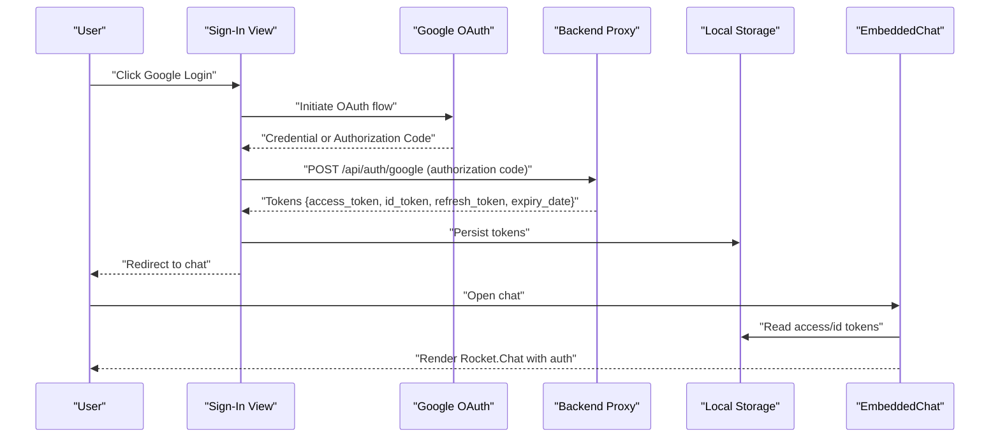
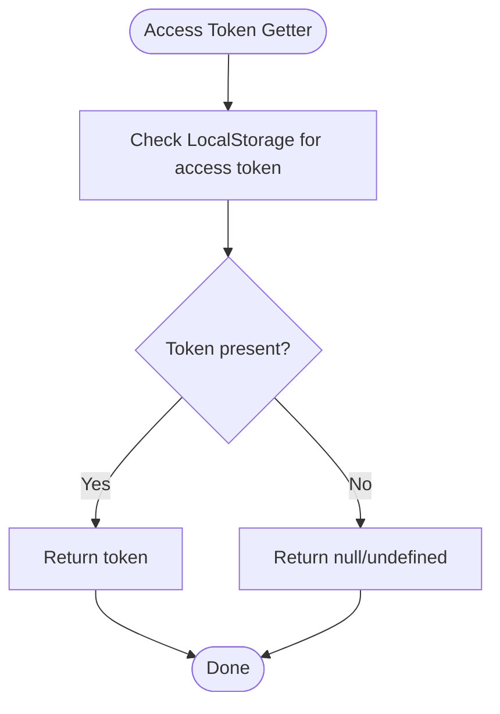
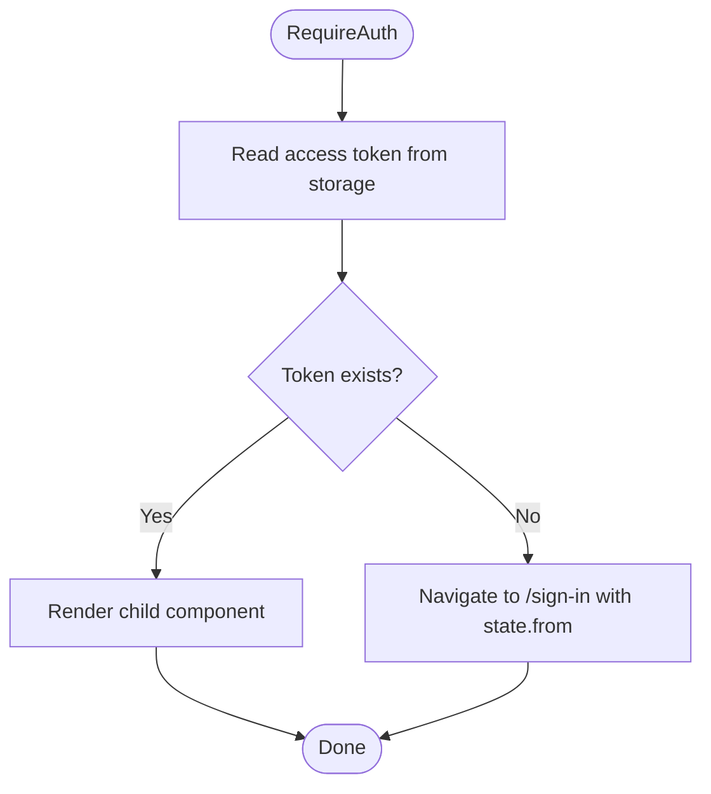
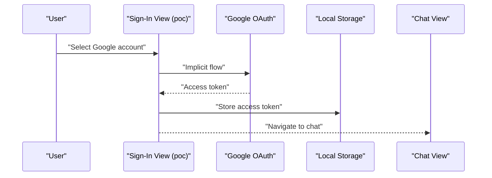
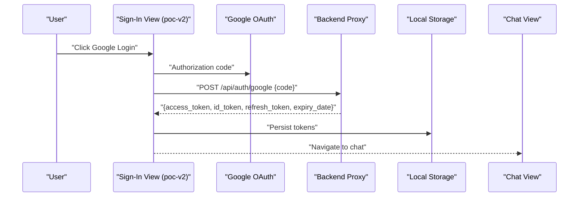
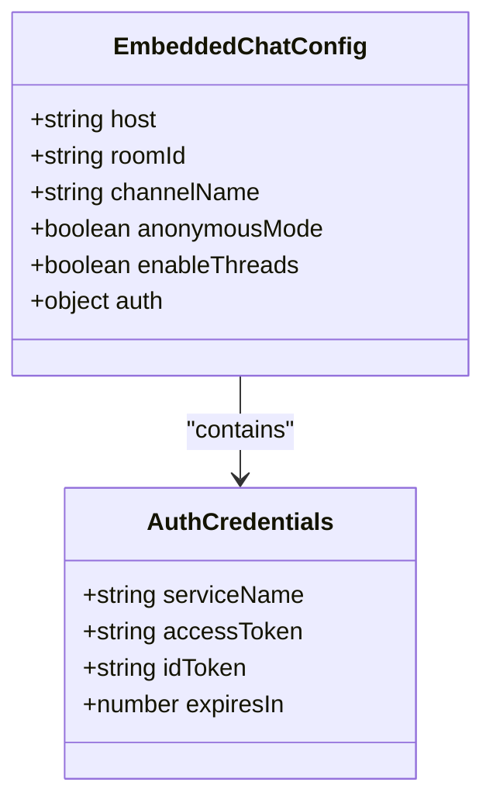
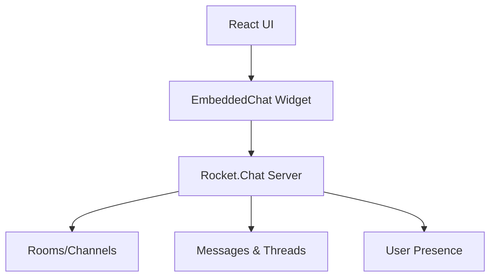
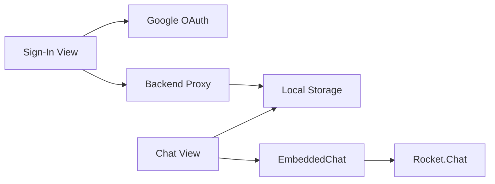

# Rocket.Chat Integration

<cite>
**Referenced Files in This Document**
- [apps/chat-pocs/rocketchat-poc/src/app/app.tsx](file://apps/chat-pocs/rocketchat-poc/src/app/app.tsx)
- [apps/chat-pocs/rocketchat-poc/src/views/chat/chat.tsx](file://apps/chat-pocs/rocketchat-poc/src/views/chat/chat.tsx)
- [apps/chat-pocs/rocketchat-poc/src/views/sign-in/sign-in.tsx](file://apps/chat-pocs/rocketchat-poc/src/views/sign-in/sign-in.tsx)
- [apps/chat-pocs/rocketchat-poc/src/views/sign-in/require-auth/require-auth.tsx](file://apps/chat-pocs/rocketchat-poc/src/views/sign-in/require-auth/require-auth.tsx)
- [apps/chat-pocs/rocketchat-poc/src/utils/auth.ts](file://apps/chat-pocs/rocketchat-poc/src/utils/auth.ts)
- [apps/chat-pocs/rocketchat-poc/src/environments/environment.ts](file://apps/chat-pocs/rocketchat-poc/src/environments/environment.ts)
- [apps/chat-pocs/rocketchat-poc-v2/src/app/app.tsx](file://apps/chat-pocs/rocketchat-poc-v2/src/app/app.tsx)
- [apps/chat-pocs/rocketchat-poc-v2/src/views/chat/chat.tsx](file://apps/chat-pocs/rocketchat-poc-v2/src/views/chat/chat.tsx)
- [apps/chat-pocs/rocketchat-poc-v2/src/views/sign-in/sign-in.tsx](file://apps/chat-pocs/rocketchat-poc-v2/src/views/sign-in/sign-in.tsx)
- [apps/chat-pocs/rocketchat-poc-v2/src/views/sign-in/require-auth/require-auth.tsx](file://apps/chat-pocs/rocketchat-poc-v2/src/views/sign-in/require-auth/require-auth.tsx)
- [apps/chat-pocs/rocketchat-poc-v2/src/utils/auth.ts](file://apps/chat-pocs/rocketchat-poc-v2/src/utils/auth.ts)
- [apps/chat-pocs/rocketchat-poc-v2/src/environments/environment.ts](file://apps/chat-pocs/rocketchat-poc-v2/src/environments/environment.ts)
</cite>

## Table of Contents
1. [Introduction](#introduction)
2. [Project Structure](#project-structure)
3. [Core Components](#core-components)
4. [Architecture Overview](#architecture-overview)
5. [Detailed Component Analysis](#detailed-component-analysis)
6. [Dependency Analysis](#dependency-analysis)
7. [Performance Considerations](#performance-considerations)
8. [Troubleshooting Guide](#troubleshooting-guide)
9. [Conclusion](#conclusion)
10. [Appendices](#appendices)

## Introduction
This document describes the Rocket.Chat integration built as part of the React applications in the repository. It covers the frontend React applications that embed Rocket.Chat, the authentication flows using Google OAuth, session management via browser storage, and the integration points for real-time chat. It also outlines how the UI integrates with Rocket.Chat’s embedded chat component and highlights areas for extending the integration with company API verification and authorization, webhook processing, room management, and message history retrieval.

## Project Structure
The Rocket.Chat integration spans two primary React applications under the chat-pocs workspace:
- rocketchat-poc: A minimal React application embedding Rocket.Chat via @embeddedchat/react and using Google OAuth implicit flow for token acquisition.
- rocketchat-poc-v2: A more structured React application embedding Rocket.Chat with improved routing, error boundaries, and an explicit OAuth authorization code flow to exchange an authorization code for tokens.

Key directories and files:
- apps/chat-pocs/rocketchat-poc
  - Routing and app shell: [app.tsx](file://apps/chat-pocs/rocketchat-poc/src/app/app.tsx)
  - Authentication utilities: [utils/auth.ts](file://apps/chat-pocs/rocketchat-poc/src/utils/auth.ts)
  - Chat view with embedded Rocket.Chat: [views/chat/chat.tsx](file://apps/chat-pocs/rocketchat-poc/src/views/chat/chat.tsx)
  - Sign-in view with Google OAuth implicit flow: [views/sign-in/sign-in.tsx](file://apps/chat-pocs/rocketchat-poc/src/views/sign-in/sign-in.tsx)
  - Protected route guard: [views/sign-in/require-auth/require-auth.tsx](file://apps/chat-pocs/rocketchat-poc/src/views/sign-in/require-auth/require-auth.tsx)
  - Environment configuration: [environments/environment.ts](file://apps/chat-pocs/rocketchat-poc/src/environments/environment.ts)
- apps/chat-pocs/rocketchat-poc-v2
  - Routing and app shell: [app.tsx](file://apps/chat-pocs/rocketchat-poc-v2/src/app/app.tsx)
  - Authentication utilities: [utils/auth.ts](file://apps/chat-pocs/rocketchat-poc-v2/src/utils/auth.ts)
  - Chat view with embedded Rocket.Chat: [views/chat/chat.tsx](file://apps/chat-pocs/rocketchat-poc-v2/src/views/chat/chat.tsx)
  - Sign-in view with Google OAuth authorization code flow: [views/sign-in/sign-in.tsx](file://apps/chat-pocs/rocketchat-poc-v2/src/views/sign-in/sign-in.tsx)
  - Protected route guard: [views/sign-in/require-auth/require-auth.tsx](file://apps/chat-pocs/rocketchat-poc-v2/src/views/sign-in/require-auth/require-auth.tsx)
  - Environment configuration: [environments/environment.ts](file://apps/chat-pocs/rocketchat-poc-v2/src/environments/environment.ts)

**Diagram sources**
- [apps/chat-pocs/rocketchat-poc/src/app/app.tsx:1-25](file://apps/chat-pocs/rocketchat-poc/src/app/app.tsx#L1-L25)
- [apps/chat-pocs/rocketchat-poc/src/views/chat/chat.tsx:1-54](file://apps/chat-pocs/rocketchat-poc/src/views/chat/chat.tsx#L1-L54)
- [apps/chat-pocs/rocketchat-poc/src/views/sign-in/sign-in.tsx:1-129](file://apps/chat-pocs/rocketchat-poc/src/views/sign-in/sign-in.tsx#L1-L129)
- [apps/chat-pocs/rocketchat-poc/src/views/sign-in/require-auth/require-auth.tsx:1-21](file://apps/chat-pocs/rocketchat-poc/src/views/sign-in/require-auth/require-auth.tsx#L1-L21)
- [apps/chat-pocs/rocketchat-poc/src/utils/auth.ts:1-38](file://apps/chat-pocs/rocketchat-poc/src/utils/auth.ts#L1-L38)
- [apps/chat-pocs/rocketchat-poc-v2/src/app/app.tsx:1-55](file://apps/chat-pocs/rocketchat-poc-v2/src/app/app.tsx#L1-L55)
- [apps/chat-pocs/rocketchat-poc-v2/src/views/chat/chat.tsx:1-39](file://apps/chat-pocs/rocketchat-poc-v2/src/views/chat/chat.tsx#L1-L39)
- [apps/chat-pocs/rocketchat-poc-v2/src/views/sign-in/sign-in.tsx:1-95](file://apps/chat-pocs/rocketchat-poc-v2/src/views/sign-in/sign-in.tsx#L1-L95)
- [apps/chat-pocs/rocketchat-poc-v2/src/views/sign-in/require-auth/require-auth.tsx:1-21](file://apps/chat-pocs/rocketchat-poc-v2/src/views/sign-in/require-auth/require-auth.tsx#L1-L21)
- [apps/chat-pocs/rocketchat-poc-v2/src/utils/auth.ts:1-62](file://apps/chat-pocs/rocketchat-poc-v2/src/utils/auth.ts#L1-L62)

**Section sources**
- [apps/chat-pocs/rocketchat-poc/src/app/app.tsx:1-25](file://apps/chat-pocs/rocketchat-poc/src/app/app.tsx#L1-L25)
- [apps/chat-pocs/rocketchat-poc-v2/src/app/app.tsx:1-55](file://apps/chat-pocs/rocketchat-poc-v2/src/app/app.tsx#L1-L55)

## Core Components
- Authentication utilities
  - Token storage and retrieval for access tokens, ID tokens, refresh tokens, and user info.
  - Version differences between poc and poc-v2:
    - poc stores tokens as a single serialized object in local storage.
    - poc-v2 stores individual token fields and expiry date separately for better separation of concerns.
- Protected route guard
  - Enforces authentication by checking for presence of tokens before rendering protected views.
- Sign-in views
  - poc uses Google OAuth implicit flow to obtain an access token and sets an ID token in storage.
  - poc-v2 uses Google OAuth authorization code flow, posts the authorization code to a backend endpoint, receives tokens, and redirects on success.
- Embedded chat view
  - Renders @embeddedchat/react with Rocket.Chat host, room/channel identifiers, and token-based authentication credentials.

**Section sources**
- [apps/chat-pocs/rocketchat-poc/src/utils/auth.ts:1-38](file://apps/chat-pocs/rocketchat-poc/src/utils/auth.ts#L1-L38)
- [apps/chat-pocs/rocketchat-poc-v2/src/utils/auth.ts:1-62](file://apps/chat-pocs/rocketchat-poc-v2/src/utils/auth.ts#L1-L62)
- [apps/chat-pocs/rocketchat-poc/src/views/sign-in/require-auth/require-auth.tsx:1-21](file://apps/chat-pocs/rocketchat-poc/src/views/sign-in/require-auth/require-auth.tsx#L1-L21)
- [apps/chat-pocs/rocketchat-poc-v2/src/views/sign-in/require-auth/require-auth.tsx:1-21](file://apps/chat-pocs/rocketchat-poc-v2/src/views/sign-in/require-auth/require-auth.tsx#L1-L21)
- [apps/chat-pocs/rocketchat-poc/src/views/sign-in/sign-in.tsx:1-129](file://apps/chat-pocs/rocketchat-poc/src/views/sign-in/sign-in.tsx#L1-L129)
- [apps/chat-pocs/rocketchat-poc-v2/src/views/sign-in/sign-in.tsx:1-95](file://apps/chat-pocs/rocketchat-poc-v2/src/views/sign-in/sign-in.tsx#L1-L95)
- [apps/chat-pocs/rocketchat-poc/src/views/chat/chat.tsx:1-54](file://apps/chat-pocs/rocketchat-poc/src/views/chat/chat.tsx#L1-L54)
- [apps/chat-pocs/rocketchat-poc-v2/src/views/chat/chat.tsx:1-39](file://apps/chat-pocs/rocketchat-poc-v2/src/views/chat/chat.tsx#L1-L39)

## Architecture Overview
The integration consists of:
- Frontend React applications that render the sign-in page, enforce authentication, and embed Rocket.Chat.
- Google OAuth integration for user identity and token acquisition.
- Local storage for token persistence across sessions.
- Embedded Rocket.Chat widget configured with token-based authentication credentials.

**Diagram sources**
- [apps/chat-pocs/rocketchat-poc-v2/src/views/sign-in/sign-in.tsx:24-40](file://apps/chat-pocs/rocketchat-poc-v2/src/views/sign-in/sign-in.tsx#L24-L40)
- [apps/chat-pocs/rocketchat-poc-v2/src/utils/auth.ts:51-62](file://apps/chat-pocs/rocketchat-poc-v2/src/utils/auth.ts#L51-L62)
- [apps/chat-pocs/rocketchat-poc-v2/src/views/chat/chat.tsx:14-35](file://apps/chat-pocs/rocketchat-poc-v2/src/views/chat/chat.tsx#L14-L35)

## Detailed Component Analysis

### Authentication Utilities
- Purpose: Manage tokens and user info in local storage.
- Key responsibilities:
  - Store and retrieve access tokens, ID tokens, refresh tokens, and user info.
  - Support expiry date handling for token lifecycle management.
- Implementation notes:
  - poc stores a single serialized tokens object.
  - poc-v2 separates token fields and expiry date for clarity and future expiration checks.

**Diagram sources**
- [apps/chat-pocs/rocketchat-poc/src/utils/auth.ts:7-9](file://apps/chat-pocs/rocketchat-poc/src/utils/auth.ts#L7-L9)
- [apps/chat-pocs/rocketchat-poc-v2/src/utils/auth.ts:20-20](file://apps/chat-pocs/rocketchat-poc-v2/src/utils/auth.ts#L20-L20)

**Section sources**
- [apps/chat-pocs/rocketchat-poc/src/utils/auth.ts:1-38](file://apps/chat-pocs/rocketchat-poc/src/utils/auth.ts#L1-L38)
- [apps/chat-pocs/rocketchat-poc-v2/src/utils/auth.ts:1-62](file://apps/chat-pocs/rocketchat-poc-v2/src/utils/auth.ts#L1-L62)

### Protected Route Guard
- Purpose: Prevent unauthenticated access to the chat view.
- Behavior:
  - Redirects to the sign-in page if the required token is missing.
  - Preserves the intended destination for seamless post-login navigation.

**Diagram sources**
- [apps/chat-pocs/rocketchat-poc-v2/src/views/sign-in/require-auth/require-auth.tsx:5-18](file://apps/chat-pocs/rocketchat-poc-v2/src/views/sign-in/require-auth/require-auth.tsx#L5-L18)

**Section sources**
- [apps/chat-pocs/rocketchat-poc/src/views/sign-in/require-auth/require-auth.tsx:1-21](file://apps/chat-pocs/rocketchat-poc/src/views/sign-in/require-auth/require-auth.tsx#L1-L21)
- [apps/chat-pocs/rocketchat-poc-v2/src/views/sign-in/require-auth/require-auth.tsx:1-21](file://apps/chat-pocs/rocketchat-poc-v2/src/views/sign-in/require-auth/require-auth.tsx#L1-L21)

### Sign-In Views

#### rocketchat-poc (Implicit OAuth)
- Uses Google OAuth implicit flow to obtain an access token.
- Stores an ID token in local storage and navigates to the chat view.

**Diagram sources**
- [apps/chat-pocs/rocketchat-poc/src/views/chat/chat.tsx:17-31](file://apps/chat-pocs/rocketchat-poc/src/views/chat/chat.tsx#L17-L31)
- [apps/chat-pocs/rocketchat-poc/src/utils/auth.ts:12-14](file://apps/chat-pocs/rocketchat-poc/src/utils/auth.ts#L12-L14)

**Section sources**
- [apps/chat-pocs/rocketchat-poc/src/views/chat/chat.tsx:1-54](file://apps/chat-pocs/rocketchat-poc/src/views/chat/chat.tsx#L1-L54)
- [apps/chat-pocs/rocketchat-poc/src/views/sign-in/sign-in.tsx:1-129](file://apps/chat-pocs/rocketchat-poc/src/views/sign-in/sign-in.tsx#L1-L129)

#### rocketchat-poc-v2 (Authorization Code OAuth)
- Uses Google OAuth authorization code flow.
- Posts the authorization code to a backend endpoint to receive tokens.
- Persists tokens and redirects to the chat view.

**Diagram sources**
- [apps/chat-pocs/rocketchat-poc-v2/src/views/sign-in/sign-in.tsx:24-40](file://apps/chat-pocs/rocketchat-poc-v2/src/views/sign-in/sign-in.tsx#L24-L40)
- [apps/chat-pocs/rocketchat-poc-v2/src/utils/auth.ts:51-62](file://apps/chat-pocs/rocketchat-poc-v2/src/utils/auth.ts#L51-L62)

**Section sources**
- [apps/chat-pocs/rocketchat-poc-v2/src/views/sign-in/sign-in.tsx:1-95](file://apps/chat-pocs/rocketchat-poc-v2/src/views/sign-in/sign-in.tsx#L1-L95)

### Embedded Chat View
- Renders @embeddedchat/react with:
  - Rocket.Chat host URL.
  - Room identifier and channel name.
  - Anonymous mode toggle.
  - Thread support toggle.
  - Token-based authentication credentials including service name, access token, ID token, and expiry.

**Diagram sources**
- [apps/chat-pocs/rocketchat-poc-v2/src/views/chat/chat.tsx:15-30](file://apps/chat-pocs/rocketchat-poc-v2/src/views/chat/chat.tsx#L15-L30)

**Section sources**
- [apps/chat-pocs/rocketchat-poc/src/views/chat/chat.tsx:1-54](file://apps/chat-pocs/rocketchat-poc/src/views/chat/chat.tsx#L1-L54)
- [apps/chat-pocs/rocketchat-poc-v2/src/views/chat/chat.tsx:1-39](file://apps/chat-pocs/rocketchat-poc-v2/src/views/chat/chat.tsx#L1-L39)

### Conceptual Overview
- Real-time chat is rendered via the EmbeddedChat component.
- User presence indicators and message formatting are handled by Rocket.Chat; the UI passes tokens and configuration to the widget.
- Room management and message history are controlled by Rocket.Chat; the UI requests the widget to connect to a specific room/channel.

[No sources needed since this diagram shows conceptual workflow, not actual code structure]

## Dependency Analysis
- Component coupling:
  - Chat view depends on authentication utilities for token retrieval.
  - Sign-in view depends on Google OAuth libraries and backend proxy for token exchange.
  - Route guards depend on authentication utilities to decide navigation.
- External dependencies:
  - @embeddedchat/react for the embedded chat widget.
  - @react-oauth/google for Google OAuth integration.
  - Local storage for token persistence.

**Diagram sources**
- [apps/chat-pocs/rocketchat-poc-v2/src/views/sign-in/sign-in.tsx:24-40](file://apps/chat-pocs/rocketchat-poc-v2/src/views/sign-in/sign-in.tsx#L24-L40)
- [apps/chat-pocs/rocketchat-poc-v2/src/views/chat/chat.tsx:15-30](file://apps/chat-pocs/rocketchat-poc-v2/src/views/chat/chat.tsx#L15-L30)

**Section sources**
- [apps/chat-pocs/rocketchat-poc/src/views/chat/chat.tsx:1-54](file://apps/chat-pocs/rocketchat-poc/src/views/chat/chat.tsx#L1-L54)
- [apps/chat-pocs/rocketchat-poc-v2/src/views/chat/chat.tsx:1-39](file://apps/chat-pocs/rocketchat-poc-v2/src/views/chat/chat.tsx#L1-L39)

## Performance Considerations
- Minimize re-renders by memoizing token reads and avoiding unnecessary state updates.
- Defer heavy initialization until tokens are confirmed present.
- Use lazy loading for views and error boundaries to improve perceived performance.
- Cache tokens in memory for the duration of the session to reduce repeated local storage reads.

[No sources needed since this section provides general guidance]

## Troubleshooting Guide
Common issues and resolutions:
- Missing tokens after sign-in
  - Verify that the backend endpoint receives the authorization code and returns tokens.
  - Confirm that tokens are persisted in local storage and retrieved by the chat view.
- Embedded chat does not load
  - Ensure the host URL and room/channel identifiers are correct.
  - Confirm that the access token and ID token are present and valid.
- OAuth flow errors
  - Check the error messages returned by Google OAuth and the backend proxy.
  - Validate scopes and redirect URIs for the OAuth client configuration.

**Section sources**
- [apps/chat-pocs/rocketchat-poc-v2/src/views/sign-in/sign-in.tsx:78-87](file://apps/chat-pocs/rocketchat-poc-v2/src/views/sign-in/sign-in.tsx#L78-L87)
- [apps/chat-pocs/rocketchat-poc-v2/src/views/chat/chat.tsx:14-35](file://apps/chat-pocs/rocketchat-poc-v2/src/views/chat/chat.tsx#L14-L35)

## Conclusion
The Rocket.Chat integration leverages React applications with Google OAuth for authentication and @embeddedchat/react for real-time chat. The poc-v2 implementation improves on the original by using an authorization code flow, persisting tokens, and adding robust routing and error handling. Extending the integration to include company API verification, webhook processing, room management, and message history would involve integrating backend services and enhancing the UI with appropriate controls and data fetching.

[No sources needed since this section summarizes without analyzing specific files]

## Appendices

### Configuration Options
- Rocket.Chat server connectivity
  - Host URL for the EmbeddedChat component.
  - Room identifier and channel name for the chat view.
- Authentication tokens
  - Access token and ID token stored in local storage.
  - Refresh token and expiry date (poc-v2).
- Security settings
  - Anonymous mode toggle for the chat widget.
  - Thread support toggle for threaded conversations.

**Section sources**
- [apps/chat-pocs/rocketchat-poc-v2/src/views/chat/chat.tsx:15-30](file://apps/chat-pocs/rocketchat-poc-v2/src/views/chat/chat.tsx#L15-L30)
- [apps/chat-pocs/rocketchat-poc-v2/src/utils/auth.ts:51-62](file://apps/chat-pocs/rocketchat-poc-v2/src/utils/auth.ts#L51-L62)