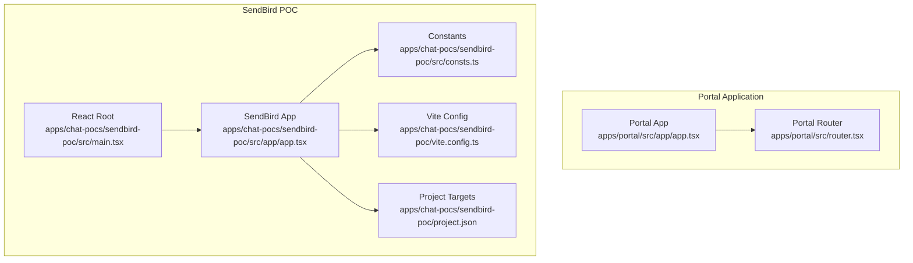
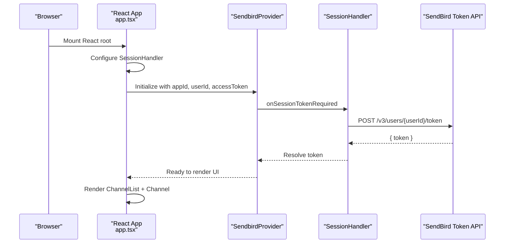
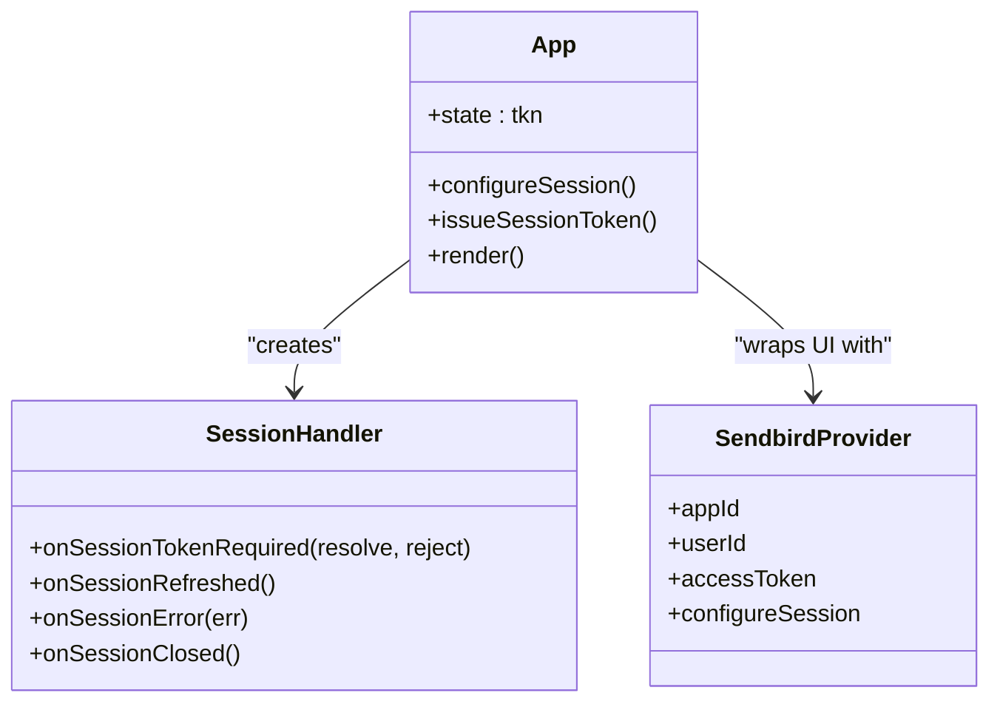
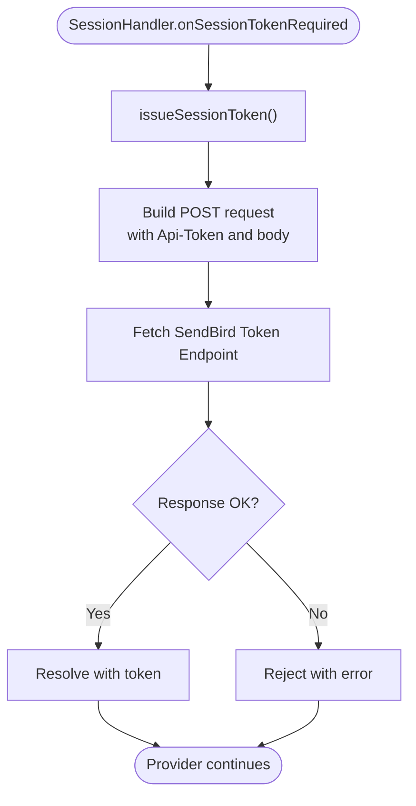
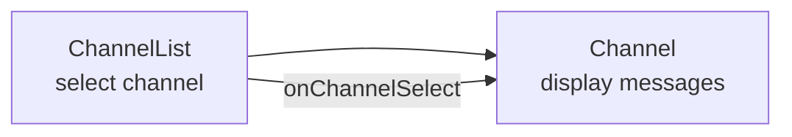
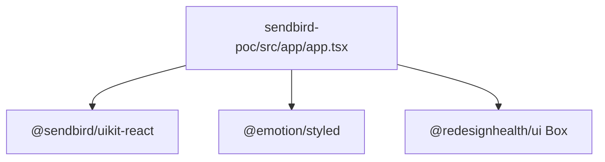

# Sendbird Integration

<cite>
**Referenced Files in This Document**
- [apps/chat-pocs/sendbird-poc/src/app/app.tsx](file://apps/chat-pocs/sendbird-poc/src/app/app.tsx)
- [apps/chat-pocs/sendbird-poc/src/consts.ts](file://apps/chat-pocs/sendbird-poc/src/consts.ts)
- [apps/chat-pocs/sendbird-poc/src/main.tsx](file://apps/chat-pocs/sendbird-poc/src/main.tsx)
- [apps/chat-pocs/sendbird-poc/vite.config.ts](file://apps/chat-pocs/sendbird-poc/vite.config.ts)
- [apps/chat-pocs/sendbird-poc/project.json](file://apps/chat-pocs/sendbird-poc/project.json)
- [apps/portal/src/app/app.tsx](file://apps/portal/src/app/app.tsx)
- [apps/portal/src/router.tsx](file://apps/portal/src/router.tsx)
- [package.json](file://package.json)
</cite>

## Table of Contents
1. [Introduction](#introduction)
2. [Project Structure](#project-structure)
3. [Core Components](#core-components)
4. [Architecture Overview](#architecture-overview)
5. [Detailed Component Analysis](#detailed-component-analysis)
6. [Dependency Analysis](#dependency-analysis)
7. [Performance Considerations](#performance-considerations)
8. [Security and Compliance](#security-and-compliance)
9. [Troubleshooting Guide](#troubleshooting-guide)
10. [Conclusion](#conclusion)

## Introduction
This document describes the SendBird chat integration implementation within the monorepo’s chat proof-of-concept applications. It explains how the React-based chat application is structured, how user authentication and session token generation are handled via the SendBird SDK, how channels and conversations are managed, and how the chat experience can be embedded into the broader Portal application. It also covers customization options such as reaction widgets and file sharing, along with security and compliance considerations for healthcare environments.

## Project Structure
The SendBird integration exists as a standalone Vite-powered React application under the chat-pocs workspace. It uses the SendBird UIKit React components to render a channel list and a conversation view. The Portal application provides the main routing and UI shell, and can integrate the chat application either as a separate route or via an iframe/embedded widget.

**Diagram sources**
- [apps/portal/src/app/app.tsx:26-42](file://apps/portal/src/app/app.tsx#L26-L42)
- [apps/portal/src/router.tsx:82-249](file://apps/portal/src/router.tsx#L82-L249)
- [apps/chat-pocs/sendbird-poc/src/main.tsx:1-12](file://apps/chat-pocs/sendbird-poc/src/main.tsx#L1-L12)
- [apps/chat-pocs/sendbird-poc/src/app/app.tsx:66-116](file://apps/chat-pocs/sendbird-poc/src/app/app.tsx#L66-L116)
- [apps/chat-pocs/sendbird-poc/src/consts.ts:1-17](file://apps/chat-pocs/sendbird-poc/src/consts.ts#L1-L17)
- [apps/chat-pocs/sendbird-poc/vite.config.ts:1-34](file://apps/chat-pocs/sendbird-poc/vite.config.ts#L1-L34)
- [apps/chat-pocs/sendbird-poc/project.json:1-63](file://apps/chat-pocs/sendbird-poc/project.json#L1-L63)

**Section sources**
- [apps/chat-pocs/sendbird-poc/src/main.tsx:1-12](file://apps/chat-pocs/sendbird-poc/src/main.tsx#L1-L12)
- [apps/chat-pocs/sendbird-poc/src/app/app.tsx:66-116](file://apps/chat-pocs/sendbird-poc/src/app/app.tsx#L66-L116)
- [apps/chat-pocs/sendbird-poc/src/consts.ts:1-17](file://apps/chat-pocs/sendbird-poc/src/consts.ts#L1-L17)
- [apps/chat-pocs/sendbird-poc/vite.config.ts:1-34](file://apps/chat-pocs/sendbird-poc/vite.config.ts#L1-L34)
- [apps/chat-pocs/sendbird-poc/project.json:1-63](file://apps/chat-pocs/sendbird-poc/project.json#L1-L63)
- [apps/portal/src/app/app.tsx:26-42](file://apps/portal/src/app/app.tsx#L26-L42)
- [apps/portal/src/router.tsx:82-249](file://apps/portal/src/router.tsx#L82-L249)

## Core Components
- React entry point initializes the root and mounts the main application component.
- SendBird Provider wraps the UI to supply app credentials and session configuration.
- Session handler manages token acquisition and refresh events.
- Channel list and channel components from SendBird UIKit render the chat UI.
- Constants module centralizes app identifiers and user credentials for quick configuration.

Key responsibilities:
- Authentication: Generates a short-lived session token via the SendBird API and supplies it to the provider.
- Channel Management: Renders a channel list and allows selection of a conversation.
- Real-time Messaging: Delegates message rendering and interaction to SendBird UIKit components.

**Section sources**
- [apps/chat-pocs/sendbird-poc/src/main.tsx:1-12](file://apps/chat-pocs/sendbird-poc/src/main.tsx#L1-L12)
- [apps/chat-pocs/sendbird-poc/src/app/app.tsx:24-65](file://apps/chat-pocs/sendbird-poc/src/app/app.tsx#L24-L65)
- [apps/chat-pocs/sendbird-poc/src/app/app.tsx:69-77](file://apps/chat-pocs/sendbird-poc/src/app/app.tsx#L69-L77)
- [apps/chat-pocs/sendbird-poc/src/app/app.tsx:84-113](file://apps/chat-pocs/sendbird-poc/src/app/app.tsx#L84-L113)
- [apps/chat-pocs/sendbird-poc/src/consts.ts:1-17](file://apps/chat-pocs/sendbird-poc/src/consts.ts#L1-L17)

## Architecture Overview
The integration follows a provider-based pattern:
- The app bootstraps a SendBird provider with appId, userId, and accessToken.
- A session handler intercepts token requests and triggers a token issuance endpoint.
- The UI renders a channel list and a selected channel conversation area.

**Diagram sources**
- [apps/chat-pocs/sendbird-poc/src/app/app.tsx:29-49](file://apps/chat-pocs/sendbird-poc/src/app/app.tsx#L29-L49)
- [apps/chat-pocs/sendbird-poc/src/app/app.tsx:50-65](file://apps/chat-pocs/sendbird-poc/src/app/app.tsx#L50-L65)
- [apps/chat-pocs/sendbird-poc/src/app/app.tsx:84-113](file://apps/chat-pocs/sendbird-poc/src/app/app.tsx#L84-L113)

## Detailed Component Analysis

### React Application Bootstrap
- The root creates a React DOM root and renders the main App component.
- Minimal wiring ensures the rest of the logic resides in the App component.

**Section sources**
- [apps/chat-pocs/sendbird-poc/src/main.tsx:1-12](file://apps/chat-pocs/sendbird-poc/src/main.tsx#L1-L12)

### SendBird Provider and Session Configuration
- App credentials are defined centrally and passed to the provider.
- A SessionHandler is configured to handle token acquisition and lifecycle events.
- The provider is initialized with logging enabled for diagnostics.

**Diagram sources**
- [apps/chat-pocs/sendbird-poc/src/app/app.tsx:29-49](file://apps/chat-pocs/sendbird-poc/src/app/app.tsx#L29-L49)
- [apps/chat-pocs/sendbird-poc/src/app/app.tsx:84-113](file://apps/chat-pocs/sendbird-poc/src/app/app.tsx#L84-L113)

**Section sources**
- [apps/chat-pocs/sendbird-poc/src/app/app.tsx:24-28](file://apps/chat-pocs/sendbird-poc/src/app/app.tsx#L24-L28)
- [apps/chat-pocs/sendbird-poc/src/app/app.tsx:29-49](file://apps/chat-pocs/sendbird-poc/src/app/app.tsx#L29-L49)
- [apps/chat-pocs/sendbird-poc/src/app/app.tsx:84-113](file://apps/chat-pocs/sendbird-poc/src/app/app.tsx#L84-L113)

### Token Generation Flow
- On demand, the SessionHandler triggers a token issuance call to the SendBird API.
- The token is resolved to the provider, enabling secure chat sessions.

**Diagram sources**
- [apps/chat-pocs/sendbird-poc/src/app/app.tsx:50-65](file://apps/chat-pocs/sendbird-poc/src/app/app.tsx#L50-L65)

**Section sources**
- [apps/chat-pocs/sendbird-poc/src/app/app.tsx:50-65](file://apps/chat-pocs/sendbird-poc/src/app/app.tsx#L50-L65)

### Channel List and Conversation UI
- The UI consists of two primary areas:
  - Channel list for browsing and selecting conversations.
  - Conversation area for viewing and sending messages.
- Styling adjusts layout and hides non-essential UI elements.

**Diagram sources**
- [apps/chat-pocs/sendbird-poc/src/app/app.tsx:96-107](file://apps/chat-pocs/sendbird-poc/src/app/app.tsx#L96-L107)

**Section sources**
- [apps/chat-pocs/sendbird-poc/src/app/app.tsx:96-107](file://apps/chat-pocs/sendbird-poc/src/app/app.tsx#L96-L107)

### Constants and Credentials
- Centralized constants define the SendBird application ID, API token, and user identifier.
- These values can be overridden via environment variables in production deployments.

**Section sources**
- [apps/chat-pocs/sendbird-poc/src/consts.ts:1-17](file://apps/chat-pocs/sendbird-poc/src/consts.ts#L1-L17)

### Portal Integration
- The Portal application provides routing and layout; it does not currently include a dedicated chat route.
- To integrate chat into the Portal:
  - Option A: Add a route that mounts the SendBird POC as a child component.
  - Option B: Embed the SendBird POC via an iframe and pass authentication context via postMessage.
  - Option C: Replace the current iframe-based RocketChat integration pattern with SendBird.

**Section sources**
- [apps/portal/src/app/app.tsx:26-42](file://apps/portal/src/app/app.tsx#L26-L42)
- [apps/portal/src/router.tsx:82-249](file://apps/portal/src/router.tsx#L82-L249)

## Dependency Analysis
- The SendBird POC depends on:
  - React and ReactDOM for rendering.
  - SendBird UIKit React components for chat UI.
  - Emotion for styling and a design system component for layout.
- Build tooling is provided by Vite with NX plugins for TypeScript path resolution.

**Diagram sources**
- [apps/chat-pocs/sendbird-poc/src/app/app.tsx:4-7](file://apps/chat-pocs/sendbird-poc/src/app/app.tsx#L4-L7)
- [package.json:103-129](file://package.json#L103-L129)

**Section sources**
- [apps/chat-pocs/sendbird-poc/src/app/app.tsx:4-7](file://apps/chat-pocs/sendbird-poc/src/app/app.tsx#L4-L7)
- [package.json:103-129](file://package.json#L103-L129)

## Performance Considerations
- Token caching: Reuse tokens until expiration to reduce network calls.
- Lazy initialization: Initialize the provider only when the token is available.
- Conditional rendering: Avoid rendering the provider until credentials are ready.
- Bundle size: Prefer tree-shaking and avoid importing unused UIKit modules.
- Logging: Disable verbose logs in production to minimize overhead.

[No sources needed since this section provides general guidance]

## Security and Compliance
- Access tokens: Generated per-session and short-lived; ensure the issuer enforces strict rate limits and IP restrictions.
- Data in transit: Use HTTPS endpoints for token issuance and chat traffic.
- Data at rest: Rely on SendBird’s platform-level encryption; do not store sensitive data in local storage.
- HIPAA considerations: Use SendBird’s enterprise-grade controls and audit logs; enable compliance exports and data retention policies as required by your organization.
- Authentication: Avoid embedding long-lived secrets in client-side code; rely on server-side token issuance.
- Privacy: Hide non-essential UI elements and ensure user consent for analytics and telemetry.

[No sources needed since this section provides general guidance]

## Troubleshooting Guide
Common issues and resolutions:
- Authentication failures
  - Verify appId, userId, and Api-Token are correct.
  - Confirm the token endpoint responds with a valid token.
  - Check network errors and CORS configuration for the token endpoint.
- Provider not rendering
  - Ensure the provider receives a valid accessToken before mounting the UI.
  - Confirm the SessionHandler resolves the token promise successfully.
- UI not appearing
  - Check that the channel list and channel components are rendered within the provider.
  - Verify CSS imports for UIKit are present.
- Build and dev server
  - Confirm Vite server ports and host settings match expectations.
  - Ensure NX plugins are active for TypeScript path resolution.

**Section sources**
- [apps/chat-pocs/sendbird-poc/src/app/app.tsx:50-65](file://apps/chat-pocs/sendbird-poc/src/app/app.tsx#L50-L65)
- [apps/chat-pocs/sendbird-poc/src/app/app.tsx:84-113](file://apps/chat-pocs/sendbird-poc/src/app/app.tsx#L84-L113)
- [apps/chat-pocs/sendbird-poc/vite.config.ts:17-25](file://apps/chat-pocs/sendbird-poc/vite.config.ts#L17-L25)
- [apps/chat-pocs/sendbird-poc/project.json:24-40](file://apps/chat-pocs/sendbird-poc/project.json#L24-L40)

## Conclusion
The SendBird integration demonstrates a clean, modular approach to adding real-time chat to the monorepo. By centralizing credentials, delegating UI to UIKit components, and managing tokens via a session handler, the solution is maintainable and extensible. Integrating this chat experience into the Portal can be achieved through routing or iframe embedding, while adhering to security and compliance best practices ensures readiness for healthcare environments.