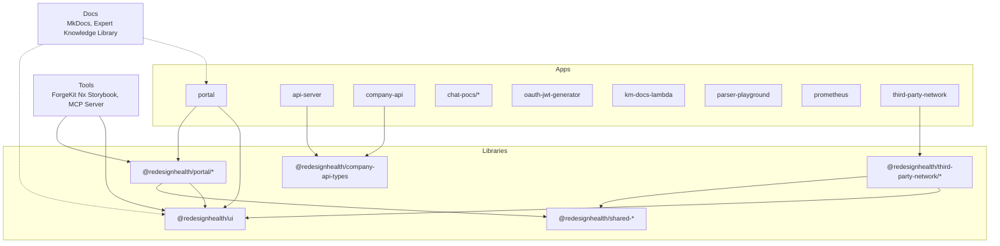
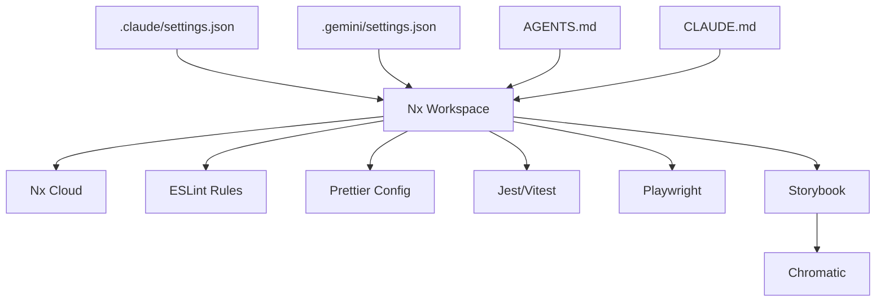
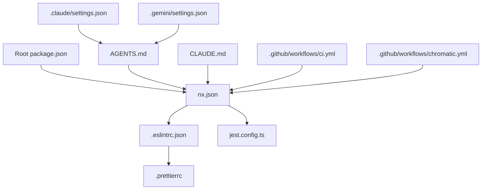
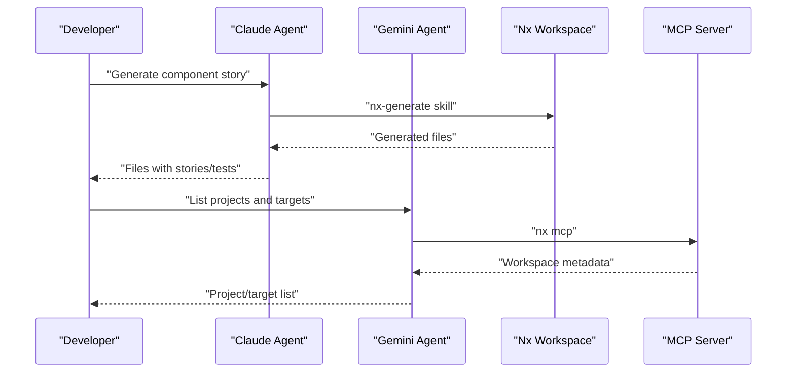

# Contributing Guidelines

<cite>
**Referenced Files in This Document**
- [README.md](file://README.md)
- [package.json](file://package.json)
- [nx.json](file://nx.json)
- [.eslintrc.json](file://.eslintrc.json)
- [.prettierrc](file://.prettierrc)
- [jest.config.ts](file://jest.config.ts)
- [.claude/settings.json](file://.claude/settings.json)
- [.gemini/settings.json](file://.gemini/settings.json)
- [.github/copilot-instructions.md](file://.github/copilot-instructions.md)
- [.github/workflows/ci.yml](file://.github/workflows/ci.yml)
- [.github/workflows/chromatic.yml](file://.github/workflows/chromatic.yml)
- [AGENTS.md](file://AGENTS.md)
- [CLAUDE.md](file://CLAUDE.md)
- [CHANGELOG.md](file://CHANGELOG.md)
</cite>

## Table of Contents
1. [Introduction](#introduction)
2. [Project Structure](#project-structure)
3. [Core Components](#core-components)
4. [Architecture Overview](#architecture-overview)
5. [Detailed Component Analysis](#detailed-component-analysis)
6. [Dependency Analysis](#dependency-analysis)
7. [Performance Considerations](#performance-considerations)
8. [Troubleshooting Guide](#troubleshooting-guide)
9. [Conclusion](#conclusion)
10. [Appendices](#appendices)

## Introduction
This document defines the end-to-end contribution workflow for the Redesign Health Nx monorepo. It covers code style and formatting, commit hygiene, pull request processes, development workflow (branching, issue tracking, code review), contribution types (bug fixes, features, documentation), testing and quality gates, CI expectations, monorepo and dependency management, cross-project changes, AI assistant configurations for Claude and Gemini, and release/versioning/changelog practices.

## Project Structure
The repository is an Nx-powered monorepo with:
- Apps: Portal, API server, Company API, Chat POCs, OAuth JWT generator, KM docs Lambda, Parser Playground, Prometheus, Third-party Network
- Libraries: Shared UI, Shared utilities/hooks/analytics, Portal-specific features/UI/utils, Third-party network features/UI/utils, Company API types
- Tools: ForgeKit Nx Storybook plugin, Storybook MCP server, VS Code theme
- Docs: MkDocs site and expert knowledge library
- CI: Nx Cloud-enabled CI, Chromatic visual regression, Nx Agents

**Diagram sources**
- [README.md:41-70](file://README.md#L41-L70)
- [package.json:1-267](file://package.json#L1-L267)

**Section sources**
- [README.md:41-70](file://README.md#L41-L70)
- [package.json:1-267](file://package.json#L1-L267)

## Core Components
- Build and orchestration: Nx (22) with Nx Cloud task distribution
- Frontend: React 19 + Vite, Chakra UI v3, TypeScript 5
- Backend: Express mock server (tsx), Spring Boot Company API
- Testing: Jest/Vitest, Playwright, Storybook Test Runner, Chromatic
- Linting and formatting: ESLint + Prettier
- AI assistants: Claude (Nx agents, plugins), Gemini (MCP), Nx Agents context

Key configuration touchpoints:
- Scripts and tasks live in root package.json
- Nx target defaults, named inputs, and plugins in nx.json
- ESLint extends and rules in .eslintrc.json
- Prettier formatting in .prettierrc
- Jest project discovery in jest.config.ts
- AI assistant integrations in .claude/settings.json, .gemini/settings.json, AGENTS.md, CLAUDE.md
- Copilot instructions for Chakra v3 in .github/copilot-instructions.md
- CI workflows in .github/workflows

**Section sources**
- [package.json:1-267](file://package.json#L1-L267)
- [nx.json:1-149](file://nx.json#L1-L149)
- [.eslintrc.json:1-225](file://.eslintrc.json#L1-L225)
- [.prettierrc:1-9](file://.prettierrc#L1-L9)
- [jest.config.ts:1-6](file://jest.config.ts#L1-L6)
- [AGENTS.md:1-63](file://AGENTS.md#L1-L63)
- [CLAUDE.md:1-470](file://CLAUDE.md#L1-L470)
- [.github/copilot-instructions.md:1-92](file://.github/copilot-instructions.md#L1-L92)

## Architecture Overview
The monorepo follows Nx’s feature-based architecture with strict module boundaries enforced by ESLint. Libraries are the primary location for reusable code; apps are thin shells. Nx Cloud accelerates CI via task distribution and caching. AI agents and MCP servers streamline Storybook generation and workspace navigation.

**Diagram sources**
- [nx.json:1-149](file://nx.json#L1-L149)
- [.eslintrc.json:1-225](file://.eslintrc.json#L1-L225)
- [.prettierrc:1-9](file://.prettierrc#L1-L9)
- [jest.config.ts:1-6](file://jest.config.ts#L1-L6)
- [.claude/settings.json:1-14](file://.claude/settings.json#L1-L14)
- [.gemini/settings.json:1-11](file://.gemini/settings.json#L1-L11)
- [AGENTS.md:1-63](file://AGENTS.md#L1-L63)
- [CLAUDE.md:1-470](file://CLAUDE.md#L1-L470)

## Detailed Component Analysis

### Code Style and Formatting Standards
- Linting: ESLint with TypeScript, React, React Hooks, JSX A11y, Storybook, TanStack Query, and Prettier integration
- Imports: Automatically sorted via simple-import-sort with a defined group order
- Naming: kebab-case enforced for filenames
- Formatting: Prettier with 2-space tabs, single quotes, no semicolons, no trailing commas, arrow parens avoided
- Console usage: Warn on unexpected console method calls; restrict to log/warn/error/info/trace
- Module boundaries: Enforced via @nx/enforce-module-boundaries with scope-based dependency constraints

Recommended developer workflow:
- Run lint with auto-fix before committing
- Format with Prettier (dry-run, then write)
- Keep console statements minimal and intentional

**Section sources**
- [.eslintrc.json:1-225](file://.eslintrc.json#L1-L225)
- [.prettierrc:1-9](file://.prettierrc#L1-L9)
- [README.md:107-120](file://README.md#L107-L120)

### Commit Message Conventions
Commit messages should be concise, imperative, and scoped. Use the following pattern:
- <type>(<scope>): 

- feat: add new component story
- fix(portal): resolve auth redirect loop
- refactor(shared): rename hook for clarity
- docs: update contribution guidelines

Avoid vague messages like “update” or “fix”. Reference related issues or PRs when applicable.

[No sources needed since this section provides general guidance]

### Pull Request Processes
- Branch naming: Use kebab-case; prefix with feature/, fix/, chore/, docs/, refactor/
- Create a PR targeting main
- Include a summary of changes, rationale, and testing performed
- Ensure all CI checks pass (lint, test, build, Chromatic for UI changes)
- Request reviews from maintainers; address feedback promptly

[No sources needed since this section provides general guidance]

### Development Workflow
- Install dependencies at the repository root
- Use Nx scripts for serving, building, testing, linting, and Storybook
- Use affected commands to limit work to changed projects
- Run Nx Graph to visualize dependencies before adding new libraries
- Use Nx Console (VS Code) for generator and task execution

Common commands:
- Serve portal: nx run portal:serve
- Serve API server: nx run api-server:serve
- Build portal: nx build portal
- Run all tests: nx run-many -t test
- Run portal tests: nx test portal
- Lint all projects: nx run-many -t lint
- Run E2E tests: nx e2e portal-e2e
- View dependency graph: nx graph
- Run Storybook: npm run storybook

**Section sources**
- [README.md:72-120](file://README.md#L72-L120)
- [package.json:5-47](file://package.json#L5-L47)
- [nx.json:8-72](file://nx.json#L8-L72)

### Issue Tracking
- Track issues in the repository’s issue tracker
- Reference issues in commit messages and PR descriptions
- Use labels to categorize issues (enhancement, bug, documentation, etc.)

[No sources needed since this section provides general guidance]

### Code Review Procedures
- At least one maintainer approval required
- Automated checks must pass (CI, lint, tests, build)
- For UI changes, Chromatic acceptance is mandatory
- Verify Storybook stories and interaction tests for components

[No sources needed since this section provides general guidance]

### Contribution Types

#### Bug Fixes
- Create a branch prefixed with fix/<scope>
- Add or update unit and/or integration tests
- Include reproduction steps and fix details in the PR description
- Run affected tests and lint before opening the PR

**Section sources**
- [README.md:107-120](file://README.md#L107-L120)

#### Feature Additions
- Create a branch prefixed with feature/<scope>
- Use Nx generators to scaffold apps/libs/components
- Add Storybook stories and interaction tests for UI components
- Update documentation and run Storybook verification
- For backend services, ensure proper Spring Boot configuration and tests

**Section sources**
- [CLAUDE.md:268-328](file://CLAUDE.md#L268-L328)
- [AGENTS.md:13-24](file://AGENTS.md#L13-L24)

#### Documentation Improvements
- Update MkDocs site content under docs/
- Ensure clarity and completeness
- Run local preview before submitting PR

**Section sources**
- [README.md:161-167](file://README.md#L161-L167)

### Testing Requirements and Code Quality Checks
- Unit tests: Jest/Vitest configured via Nx; run with nx test or nx run-many -t test
- E2E tests: Playwright via Nx Playwright plugin
- Storybook tests: Storybook Test Runner for interaction tests
- Accessibility: jest-axe integration
- Type checking: nx check-types or npm run check-types:all
- Linting: nx lint or npm run lint with auto-fix
- Formatting: npm run format and npm run format:write
- Visual regression: Chromatic for UI projects; PRs cannot merge until changes are accepted

Quality gates enforced by CI:
- Lint, test, and build on affected projects
- Nx Cloud self-healing fixes on failure

**Section sources**
- [jest.config.ts:1-6](file://jest.config.ts#L1-L6)
- [package.json:15-47](file://package.json#L15-L47)
- [nx.json:24-36](file://nx.json#L24-L36)
- [.github/workflows/ci.yml:1-43](file://.github/workflows/ci.yml#L1-L43)
- [.github/workflows/chromatic.yml:1-24](file://.github/workflows/chromatic.yml#L1-L24)
- [CLAUDE.md:395-409](file://CLAUDE.md#L395-L409)

### Continuous Integration Expectations
- CI runs on push to main and all pull requests
- Nx Cloud distributes tasks across agents
- Node version pinned in CI; npm ci used for deterministic installs
- Affected targets lint, test, and build
- Self-healing fixes applied when possible

**Section sources**
- [.github/workflows/ci.yml:1-43](file://.github/workflows/ci.yml#L1-L43)

### Working with the Monorepo Structure and Dependencies
- Install dependencies at the root; Nx prunes unused packages during builds
- Use path aliases for libraries (e.g., @redesignhealth/ui)
- Respect module boundaries enforced by ESLint
- Prefer Nx generators for scaffolding new apps/libs/components
- Keep root package.json scripts aligned with project targets

**Section sources**
- [README.md:121-127](file://README.md#L121-L127)
- [.eslintrc.json:101-132](file://.eslintrc.json#L101-L132)
- [AGENTS.md:13-24](file://AGENTS.md#L13-L24)

### Cross-Project Changes
- Use Nx affected commands to scope changes
- Review dependency graphs to understand impact
- For UI changes, ensure Storybook stories exist and Chromatic passes
- For backend changes, coordinate with Spring Boot services and OpenAPI clients

**Section sources**
- [nx.json:18-23](file://nx.json#L18-L23)
- [CLAUDE.md:395-409](file://CLAUDE.md#L395-L409)

### AI Assistant Configurations: Claude and Gemini

#### Claude (Claude Code)
- Nx agents and plugins enabled via .claude/settings.json
- Nx plugin “nx@nx-claude-plugins” activated
- Extra known marketplace for nx-claude-plugins configured
- Use nx-docs and nx-generate skills as directed in AGENTS.md and CLAUDE.md

Recommended usage:
- Explore workspace with nx-workspace skill
- Use nx-generate skill for scaffolding
- Run nx-docs for advanced configuration and plugin guidance

**Section sources**
- [.claude/settings.json:1-14](file://.claude/settings.json#L1-L14)
- [AGENTS.md:1-24](file://AGENTS.md#L1-L24)
- [CLAUDE.md:329-351](file://CLAUDE.md#L329-L351)

#### Gemini (Model Context Protocol)
- MCP server configured in .gemini/settings.json
- Context file AGENTS.md loaded for agent context
- Use nx mcp server for Storybook component generation and workspace tools

Recommended usage:
- Ensure MCP server is running via nx mcp
- Leverage MCP skills for workspace navigation and generation tasks

**Section sources**
- [.gemini/settings.json:1-11](file://.gemini/settings.json#L1-L11)
- [AGENTS.md:1-24](file://AGENTS.md#L1-L24)

### Release Procedures, Versioning, and Changelog Maintenance
- Versioning: Follow semantic versioning; current changelog indicates major version bump
- Changelog: Maintain entries in CHANGELOG.md with feature highlights, fixes, and acknowledgments
- Releases: Tag releases and publish artifacts as appropriate for each project (apps, libs, tools)
- CI: Ensure CI passes on release candidates; verify Storybook and Chromatic outputs

**Section sources**
- [CHANGELOG.md:1-13](file://CHANGELOG.md#L1-L13)

## Dependency Analysis
Monorepo dependencies are managed at the root with Nx resolving per-project needs during builds. Nx Cloud enables caching and task distribution. AI agents integrate via Claude and Gemini configurations.

**Diagram sources**
- [package.json:1-267](file://package.json#L1-L267)
- [nx.json:1-149](file://nx.json#L1-L149)
- [.eslintrc.json:1-225](file://.eslintrc.json#L1-L225)
- [.prettierrc:1-9](file://.prettierrc#L1-L9)
- [jest.config.ts:1-6](file://jest.config.ts#L1-L6)
- [.claude/settings.json:1-14](file://.claude/settings.json#L1-L14)
- [.gemini/settings.json:1-11](file://.gemini/settings.json#L1-L11)
- [AGENTS.md:1-63](file://AGENTS.md#L1-L63)
- [CLAUDE.md:1-470](file://CLAUDE.md#L1-L470)
- [.github/workflows/ci.yml:1-43](file://.github/workflows/ci.yml#L1-L43)
- [.github/workflows/chromatic.yml:1-24](file://.github/workflows/chromatic.yml#L1-L24)

**Section sources**
- [package.json:1-267](file://package.json#L1-L267)
- [nx.json:1-149](file://nx.json#L1-L149)

## Performance Considerations
- Use Nx affected commands to limit work to changed projects
- Prefer concurrent operations (e.g., Promise.all) to avoid waterfall fetches
- Keep Storybook stories and tests focused and isolated
- Minimize console usage and avoid unnecessary logging in production builds

[No sources needed since this section provides general guidance]

## Troubleshooting Guide
- CI failures: Run nx fix-ci to apply self-healing fixes; inspect failing targets (lint, test, build)
- Formatting issues: Run npm run format and npm run format:write
- Type errors: Run npm run check-types:all or affected:check-types
- Storybook visual regressions: Review Chromatic dashboard and accept changes after validation
- AI agent issues: Verify MCP server is running and context files are present

**Section sources**
- [.github/workflows/ci.yml:41-43](file://.github/workflows/ci.yml#L41-L43)
- [package.json:26-30](file://package.json#L26-L30)
- [CLAUDE.md:260-267](file://CLAUDE.md#L260-L267)

## Conclusion
By following these guidelines—consistent code style, disciplined PR processes, rigorous testing and quality gates, and seamless AI-assisted workflows—you will contribute effectively to the Redesign Health Nx monorepo while maintaining high standards for reliability, accessibility, and maintainability.

## Appendices

### AI Assistant Quick Reference

**Diagram sources**
- [AGENTS.md:13-24](file://AGENTS.md#L13-L24)
- [.gemini/settings.json:1-11](file://.gemini/settings.json#L1-L11)
- [CLAUDE.md:329-351](file://CLAUDE.md#L329-L351)