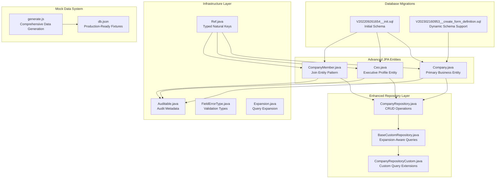
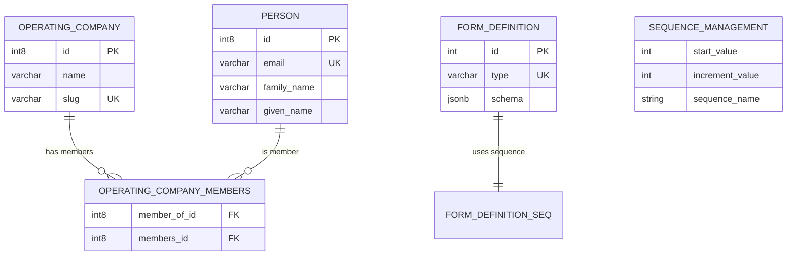
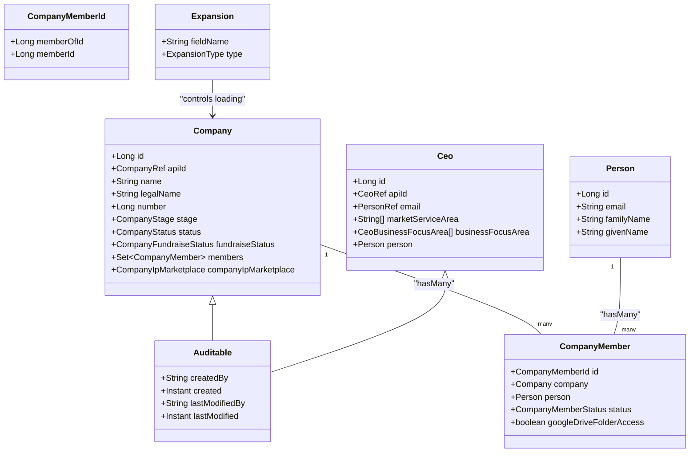
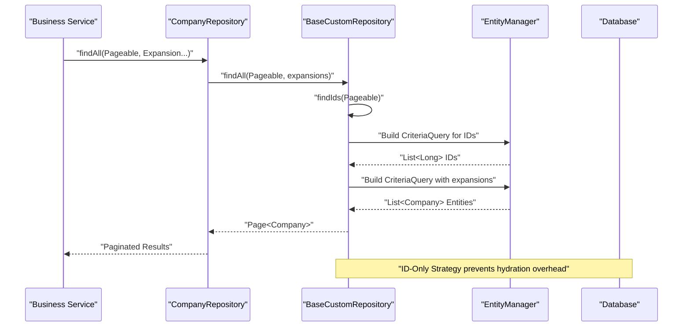
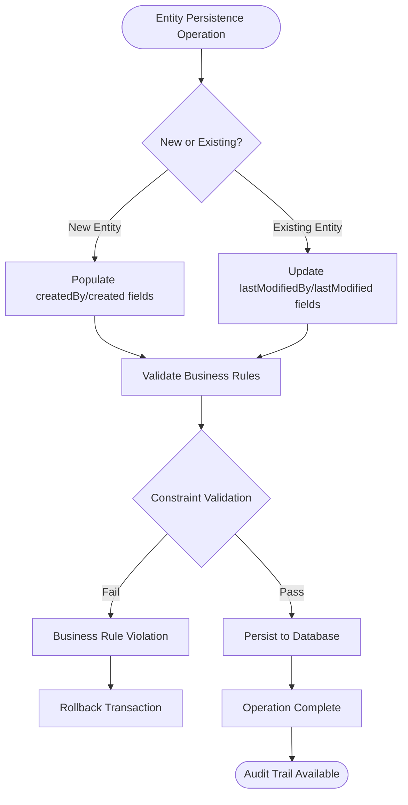
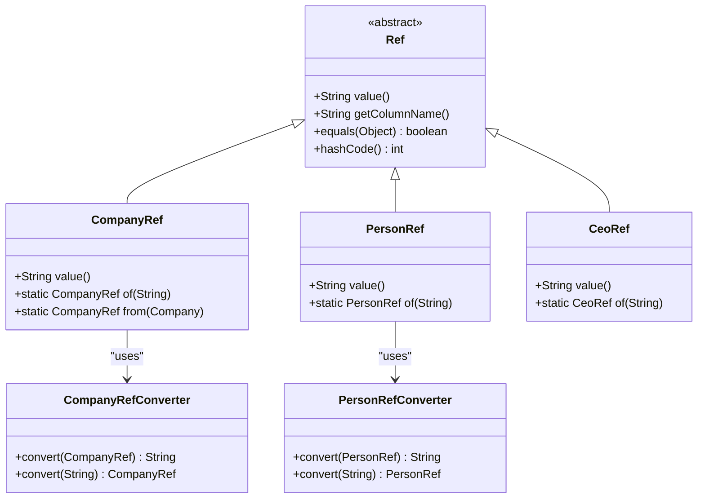
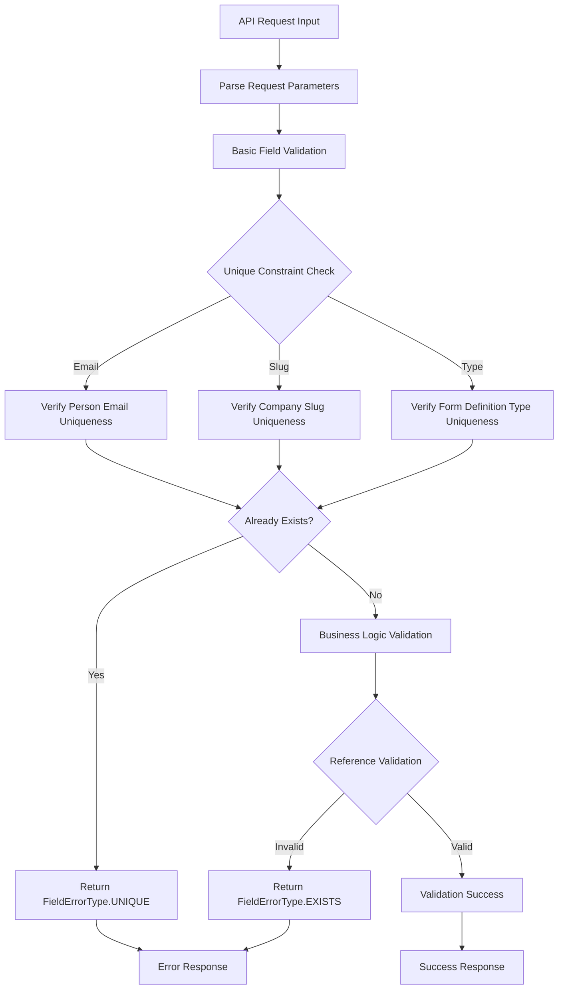
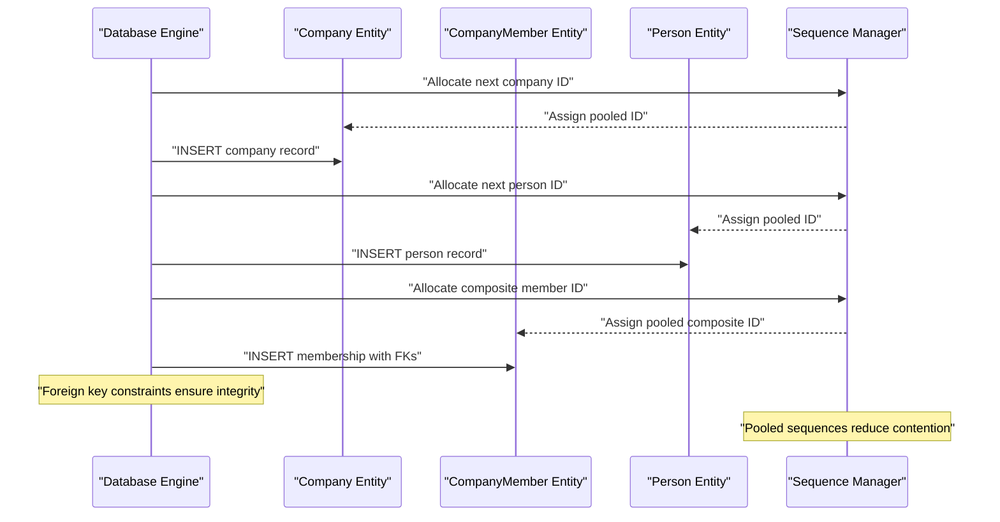
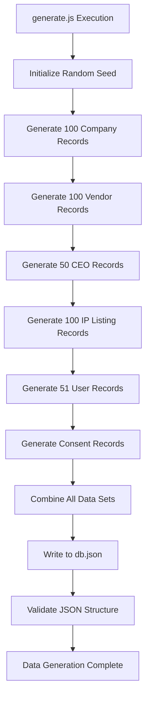
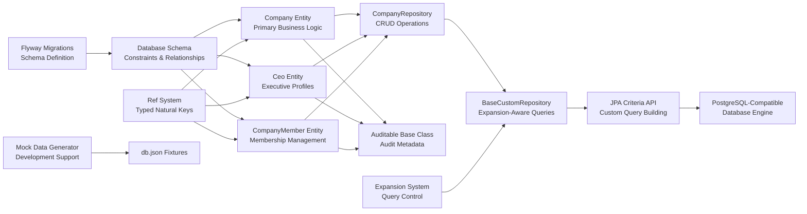

# Data Management

<cite>
**Referenced Files in This Document**
- [V202209261654__init.sql](file://apps/company-api/application/src/main/resources/db/migration/V202209261654__init.sql)
- [V202302160953__create_form_definition.sql](file://apps/company-api/application/src/main/resources/db/migration/V202302160953__create_form_definition.sql)
- [0004-database-migration-tool.md](file://apps/company-api/doc/architecture/decisions/0004-database-migration-tool.md)
- [0005-orm.md](file://apps/company-api/doc/architecture/decisions/0005-orm.md)
- [0010-natural-key-refs.md](file://apps/company-api/doc/architecture/decisions/0010-natural-key-refs.md)
- [0015-use-pooled-database-sequences.md](file://apps/company-api/doc/architecture/decisions/0015-use-pooled-database-sequences.md)
- [0018-store-enums-as-strings.md](file://apps/company-api/doc/architecture/decisions/0018-store-enums-as-strings.md)
- [BaseCustomRepository.java](file://apps/company-api/application/src/main/java/com/redesignhealth/company/api/repository/BaseCustomRepository.java)
- [Company.java](file://apps/company-api/application/src/main/java/com/redesignhealth/company/api/entity/Company.java)
- [Ceo.java](file://apps/company-api/application/src/main/java/com/redesignhealth/company/api/entity/Ceo.java)
- [CompanyMember.java](file://apps/company-api/application/src/main/java/com/redesignhealth/company/api/entity/CompanyMember.java)
- [CompanyRepository.java](file://apps/company-api/application/src/main/java/com/redesignhealth/company/api/repository/CompanyRepository.java)
- [Auditable.java](file://apps/company-api/application/src/main/java/com/redesignhealth/company/api/entity/audit/Auditable.java)
- [Ref.java](file://apps/company-api/application/src/main/java/com/redesignhealth/company/api/entity/ref/Ref.java)
- [FieldErrorType.java](file://apps/company-api/application/src/main/java/com/redesignhealth/company/api/exception/dto/FieldErrorType.java)
- [generate.js](file://apps/api-server/src/data/generate.js)
- [db.json](file://apps/api-server/src/data/db.json)
</cite>

## Update Summary
**Changes Made**
- Enhanced comprehensive coverage of data access layers and repository patterns
- Expanded ORM patterns documentation including JPA entity relationships and lifecycle management
- Added detailed database interaction strategies and data persistence approaches
- Strengthened documentation of mock data generation system for development and testing
- Improved data validation rules and business constraint enforcement explanations
- Enhanced referential integrity and audit field management documentation

## Table of Contents
1. [Introduction](#introduction)
2. [Project Structure](#project-structure)
3. [Core Components](#core-components)
4. [Architecture Overview](#architecture-overview)
5. [Detailed Component Analysis](#detailed-component-analysis)
6. [Dependency Analysis](#dependency-analysis)
7. [Performance Considerations](#performance-considerations)
8. [Troubleshooting Guide](#troubleshooting-guide)
9. [Conclusion](#conclusion)
10. [Appendices](#appendices)

## Introduction
This document describes the comprehensive data management system used by the Redesign Health platform. It covers the PostgreSQL-compatible schema design, entity relationships, and advanced data modeling patterns. The system implements sophisticated data access layers using Spring Data JPA, comprehensive repository patterns with custom extensions, and robust database interaction strategies. It explains the Flyway migration approach with version management, entity lifecycle management, and advanced data persistence techniques. The documentation includes detailed coverage of the mock data generation system for development and testing, validation rules, business constraints, referential integrity enforcement, and operational considerations including backup, disaster recovery, and data retention.

## Project Structure
The data management system encompasses multiple interconnected modules spanning database migrations, JPA entities, advanced repository patterns, audit infrastructure, and comprehensive mock data generation:



**Diagram sources**
- [V202209261654__init.sql:1-24](file://apps/company-api/application/src/main/resources/db/migration/V202209261654__init.sql#L1-L24)
- [V202302160953__create_form_definition.sql:1-10](file://apps/company-api/application/src/main/resources/db/migration/V202302160953__create_form_definition.sql#L1-L10)
- [Company.java:1-124](file://apps/company-api/application/src/main/java/com/redesignhealth/company/api/entity/Company.java#L1-L124)
- [Ceo.java:1-134](file://apps/company-api/application/src/main/java/com/redesignhealth/company/api/entity/Ceo.java#L1-L134)
- [CompanyMember.java:1-59](file://apps/company-api/application/src/main/java/com/redesignhealth/company/api/entity/CompanyMember.java#L1-L59)
- [CompanyRepository.java:1-23](file://apps/company-api/application/src/main/java/com/redesignhealth/company/api/repository/CompanyRepository.java#L1-L23)
- [BaseCustomRepository.java:1-136](file://apps/company-api/application/src/main/java/com/redesignhealth/company/api/repository/BaseCustomRepository.java#L1-L136)
- [Auditable.java:1-60](file://apps/company-api/application/src/main/java/com/redesignhealth/company/api/entity/audit/Auditable.java#L1-L60)
- [Ref.java:1-37](file://apps/company-api/application/src/main/java/com/redesignhealth/company/api/entity/ref/Ref.java#L1-L37)
- [FieldErrorType.java:1-25](file://apps/company-api/application/src/main/java/com/redesignhealth/company/api/exception/dto/FieldErrorType.java#L1-L25)
- [generate.js:1-304](file://apps/api-server/src/data/generate.js#L1-L304)

**Section sources**
- [V202209261654__init.sql:1-24](file://apps/company-api/application/src/main/resources/db/migration/V202209261654__init.sql#L1-L24)
- [0004-database-migration-tool.md:1-33](file://apps/company-api/doc/architecture/decisions/0004-database-migration-tool.md#L1-L33)
- [0005-orm.md:1-31](file://apps/company-api/doc/architecture/decisions/0005-orm.md#L1-L31)

## Core Components
The data management system implements a sophisticated layered architecture with advanced capabilities:

### Database Migration Infrastructure
- **Flyway Integration**: Comprehensive migration management with version-controlled schema evolution
- **Schema Evolution**: Support for dynamic schema changes including JSONB fields and specialized sequences
- **Constraint Management**: Robust foreign key relationships and unique constraints

### Advanced JPA Entity Framework
- **Typed Natural Keys**: Reference converters eliminate internal ID exposure and provide compile-time safety
- **Audit Infrastructure**: Standardized audit metadata across all entities with automatic timestamp management
- **Complex Relationships**: Many-to-many patterns with embedded composite keys for enhanced data modeling
- **JSON Support**: Native JSONB field support for dynamic schema requirements

### Enhanced Repository Pattern Implementation
- **Expansion-Aware Queries**: Custom repository extensions enabling controlled relation loading
- **Pagination Optimization**: ID-only retrieval strategies for improved caching and performance
- **Custom Query Extensions**: Specialized repository interfaces for complex business operations

### Comprehensive Mock Data System
- **Automated Generation**: Node.js-based data generation with realistic healthcare industry datasets
- **Production-Ready Fixtures**: Complete JSON fixtures for testing and development environments
- **Business Context**: Healthcare-specific data including companies, vendors, CEOs, and IP listings

**Section sources**
- [0010-natural-key-refs.md:1-44](file://apps/company-api/doc/architecture/decisions/0010-natural-key-refs.md#L1-L44)
- [0018-store-enums-as-strings.md:1-41](file://apps/company-api/doc/architecture/decisions/0018-store-enums-as-strings.md#L1-L41)
- [Auditable.java:1-60](file://apps/company-api/application/src/main/java/com/redesignhealth/company/api/entity/audit/Auditable.java#L1-L60)
- [0015-use-pooled-database-sequences.md:1-52](file://apps/company-api/doc/architecture/decisions/0015-use-pooled-database-sequences.md#L1-L52)

## Architecture Overview
The data layer follows a sophisticated three-tier architecture with advanced repository patterns and comprehensive data access strategies:

```mermaid
graph TB
Client["API Layer & Services"] --> Repo["Enhanced Spring Data Repositories"]
Repo --> CustomRepo["Custom Repository Extensions"]
CustomRepo --> BaseRepo["BaseCustomRepository<br/>Expansion-Aware Queries"]
BaseRepo --> Criteria["JPA Criteria API<br/>Custom Query Building"]
Criteria --> DB["PostgreSQL-Compatible<br/>Database Engine"]
subgraph "Schema Management"
Flyway["Flyway Migrations<br/>Version Control"]
Sequences["Pooled Sequences<br/>Concurrency Control"]
Constraints["Constraint Validation<br/>Business Rules"]
end
Flyway --> DB
Sequences --> DB
Constraints --> DB
subgraph "Data Access Strategies"
Expansion["Expansion-Aware<br/>Lazy Loading"]
Pagination["ID-Only Pagination<br/>Performance Optimization"]
Audit["Automatic Audit<br/>Metadata Management"]
End
Expansion --> Criteria
Pagination --> Criteria
Audit --> Criteria
```

**Diagram sources**
- [BaseCustomRepository.java:1-136](file://apps/company-api/application/src/main/java/com/redesignhealth/company/api/repository/BaseCustomRepository.java#L1-L136)
- [CompanyRepository.java:1-23](file://apps/company-api/application/src/main/java/com/redesignhealth/company/api/repository/CompanyRepository.java#L1-L23)
- [V202209261654__init.sql:1-24](file://apps/company-api/application/src/main/resources/db/migration/V202209261654__init.sql#L1-L24)

## Detailed Component Analysis

### Database Schema Design and Migration Strategy
The schema design demonstrates enterprise-grade database architecture with comprehensive support for healthcare data management:

#### Core Schema Elements
- **Operating Company Foundation**: Primary table with unique slug constraints for URL-friendly identification
- **Person Management**: Comprehensive individual profile storage with unique email constraints
- **Membership Relationships**: Many-to-many association through embedded composite keys
- **Form Definition Flexibility**: JSONB-based dynamic schema storage with specialized sequencing

#### Advanced Migration Capabilities
- **Version Control**: Sequential migration files with descriptive naming conventions
- **Constraint Enforcement**: Immediate constraint validation at schema creation
- **Sequence Management**: Optimized sequence allocation for high-concurrency environments
- **JSONB Support**: Native PostgreSQL JSONB field support for dynamic healthcare data structures



**Diagram sources**
- [V202209261654__init.sql:1-24](file://apps/company-api/application/src/main/resources/db/migration/V202209261654__init.sql#L1-L24)
- [V202302160953__create_form_definition.sql:1-10](file://apps/company-api/application/src/main/resources/db/migration/V202302160953__create_form_definition.sql#L1-L10)

**Section sources**
- [V202209261654__init.sql:1-24](file://apps/company-api/application/src/main/resources/db/migration/V202209261654__init.sql#L1-L24)
- [V202302160953__create_form_definition.sql:1-10](file://apps/company-api/application/src/main/resources/db/migration/V202302160953__create_form_definition.sql#L1-L10)
- [0004-database-migration-tool.md:1-33](file://apps/company-api/doc/architecture/decisions/0004-database-migration-tool.md#L1-L33)

### Advanced JPA Entity Relationships and Data Modeling
The entity framework implements sophisticated data modeling patterns optimized for healthcare industry requirements:

#### Primary Entity Architecture
- **Company Entity**: Central business entity with comprehensive metadata including funding status and IP marketplace integration
- **Ceo Entity**: Executive profile with extensive healthcare sector categorization and JSONB field support
- **CompanyMember Entity**: Sophisticated join entity using embedded composite keys for enhanced relationship management

#### Advanced Relationship Patterns
- **One-to-Many Associations**: Direct relationships with cascade operations for data consistency
- **Many-to-Many Mapping**: Complex membership relationships with status tracking and permission flags
- **One-to-One Embeddings**: Integrated IP marketplace and taxonomy relationships
- **JSONB Field Support**: Native PostgreSQL JSONB fields for dynamic healthcare data structures



**Diagram sources**
- [Company.java:1-124](file://apps/company-api/application/src/main/java/com/redesignhealth/company/api/entity/Company.java#L1-L124)
- [CompanyMember.java:1-59](file://apps/company-api/application/src/main/java/com/redesignhealth/company/api/entity/CompanyMember.java#L1-L59)
- [Ceo.java:1-134](file://apps/company-api/application/src/main/java/com/redesignhealth/company/api/entity/Ceo.java#L1-L134)
- [Auditable.java:1-60](file://apps/company-api/application/src/main/java/com/redesignhealth/company/api/entity/audit/Auditable.java#L1-L60)

**Section sources**
- [Company.java:1-124](file://apps/company-api/application/src/main/java/com/redesignhealth/company/api/entity/Company.java#L1-L124)
- [CompanyMember.java:1-59](file://apps/company-api/application/src/main/java/com/redesignhealth/company/api/entity/CompanyMember.java#L1-L59)
- [Ceo.java:1-134](file://apps/company-api/application/src/main/java/com/redesignhealth/company/api/entity/Ceo.java#L1-L134)
- [Auditable.java:1-60](file://apps/company-api/application/src/main/java/com/redesignhealth/company/api/entity/audit/Auditable.java#L1-L60)

### Enhanced Repository Pattern Implementation and Data Access Strategies
The repository layer implements sophisticated data access patterns optimized for performance and scalability:

#### Custom Repository Architecture
- **BaseCustomRepository**: Foundation class providing expansion-aware query capabilities and pagination optimization
- **CompanyRepository**: Primary repository interface extending CRUD operations with custom business methods
- **Expansion System**: Controlled relation loading preventing N+1 query problems and optimizing memory usage

#### Advanced Query Strategies
- **ID-Only Retrieval**: Specialized queries returning only entity IDs for pagination and caching scenarios
- **Expansion-Aware Loading**: Controlled eager loading of related entities based on predefined expansion sets
- **Custom Query Building**: JPA Criteria API integration for complex business logic and filtering



**Diagram sources**
- [CompanyRepository.java:1-23](file://apps/company-api/application/src/main/java/com/redesignhealth/company/api/repository/CompanyRepository.java#L1-L23)
- [BaseCustomRepository.java:1-136](file://apps/company-api/application/src/main/java/com/redesignhealth/company/api/repository/BaseCustomRepository.java#L1-L136)

**Section sources**
- [CompanyRepository.java:1-23](file://apps/company-api/application/src/main/java/com/redesignhealth/company/api/repository/CompanyRepository.java#L1-L23)
- [BaseCustomRepository.java:1-136](file://apps/company-api/application/src/main/java/com/redesignhealth/company/api/repository/BaseCustomRepository.java#L1-L136)

### Entity Lifecycle Management and Comprehensive Audit Infrastructure
The audit system provides enterprise-grade data governance with automated metadata tracking:

#### Audit Field Implementation
- **Standardized Metadata**: createdBy, created, lastModifiedBy, lastModified fields on all auditable entities
- **Automatic Timestamps**: Spring Data JPA auditing with automatic timestamp population
- **Entity Listener Integration**: AuditingEntityListener for seamless audit field management
- **Custom Auditor Provider**: Flexible identity resolution for audit trail accuracy

#### Lifecycle Management Patterns
- **Creation Tracking**: Automatic audit field population during entity creation
- **Modification Logging**: Comprehensive change tracking with modifier identity capture
- **Cascade Operations**: Audit metadata propagation through entity relationships
- **Temporal Data**: Precise timestamp management for compliance and audit requirements



**Diagram sources**
- [Auditable.java:1-60](file://apps/company-api/application/src/main/java/com/redesignhealth/company/api/entity/audit/Auditable.java#L1-L60)

**Section sources**
- [Auditable.java:1-60](file://apps/company-api/application/src/main/java/com/redesignhealth/company/api/entity/audit/Auditable.java#L1-L60)

### Typed Natural Keys and Advanced Reference Management
The reference system implements sophisticated identifier management for enhanced security and API usability:

#### Reference Architecture
- **Abstract Ref Base Class**: Common interface for all typed references with value-based equality
- **CompanyRef Implementation**: Company-specific reference with column name customization
- **Attribute Converters**: Seamless database serialization/deserialization of reference values
- **API Path Alignment**: Reference naming conventions matching RESTful API endpoint structures

#### Security and Usability Benefits
- **ID Obfuscation**: Internal sequential IDs hidden from external API consumers
- **Compile-Time Safety**: Type-safe reference handling preventing runtime errors
- **URL-Friendly Identifiers**: Slug-based references for human-readable API endpoints
- **Flexible Conversion**: Automatic conversion between internal and external identifier formats



**Diagram sources**
- [Ref.java:1-37](file://apps/company-api/application/src/main/java/com/redesignhealth/company/api/entity/ref/Ref.java#L1-L37)

**Section sources**
- [0010-natural-key-refs.md:1-44](file://apps/company-api/doc/architecture/decisions/0010-natural-key-refs.md#L1-L44)
- [Ref.java:1-37](file://apps/company-api/application/src/main/java/com/redesignhealth/company/api/entity/ref/Ref.java#L1-L37)

### Comprehensive Data Validation and Business Constraint Enforcement
The validation system implements enterprise-grade data integrity with comprehensive error reporting:

#### Validation Framework
- **FieldErrorType Enumeration**: Comprehensive error classification with human-readable descriptions
- **Constraint Validation**: Database-level unique constraints combined with application-level validation
- **Business Rule Enforcement**: Complex business logic validation beyond simple field constraints
- **Error Resolution Guidance**: Descriptive error messages for effective troubleshooting

#### Constraint Categories
- **Uniqueness Validation**: Email uniqueness for persons, slug uniqueness for companies
- **Null Value Checking**: Mandatory field validation with descriptive error messages
- **Reference Validation**: Cross-entity reference integrity verification
- **Business Logic Validation**: Complex constraint validation based on entity relationships



**Diagram sources**
- [FieldErrorType.java:1-25](file://apps/company-api/application/src/main/java/com/redesignhealth/company/api/exception/dto/FieldErrorType.java#L1-L25)
- [V202209261654__init.sql:1-24](file://apps/company-api/application/src/main/resources/db/migration/V202209261654__init.sql#L1-L24)
- [V202302160953__create_form_definition.sql:1-10](file://apps/company-api/application/src/main/resources/db/migration/V202302160953__create_form_definition.sql#L1-L10)

**Section sources**
- [FieldErrorType.java:1-25](file://apps/company-api/application/src/main/java/com/redesignhealth/company/api/exception/dto/FieldErrorType.java#L1-L25)
- [0018-store-enums-as-strings.md:1-41](file://apps/company-api/doc/architecture/decisions/0018-store-enums-as-strings.md#L1-L41)
- [V202209261654__init.sql:1-24](file://apps/company-api/application/src/main/resources/db/migration/V202209261654__init.sql#L1-L24)

### Advanced Referential Integrity and Sequence Management
The system implements sophisticated referential integrity with optimized sequence management for high-concurrency environments:

#### Foreign Key Relationships
- **Membership Association**: Many-to-many relationship with embedded composite keys
- **Cascade Operations**: Appropriate cascade behavior for data consistency
- **Constraint Validation**: Immediate foreign key constraint enforcement
- **Sequence Integration**: Optimized sequence allocation for ID generation

#### Sequence Management Strategy
- **Pooled Sequences**: Reduced lock contention through sequence pooling
- **Increment Optimization**: Strategic increment values for high-throughput scenarios
- **Table-Specific Sequences**: Isolated sequence management per table
- **Performance Monitoring**: Sequence usage tracking for capacity planning



**Diagram sources**
- [V202209261654__init.sql:1-24](file://apps/company-api/application/src/main/resources/db/migration/V202209261654__init.sql#L1-L24)
- [0015-use-pooled-database-sequences.md:1-52](file://apps/company-api/doc/architecture/decisions/0015-use-pooled-database-sequences.md#L1-L52)

**Section sources**
- [V202209261654__init.sql:1-24](file://apps/company-api/application/src/main/resources/db/migration/V202209261654__init.sql#L1-L24)
- [0015-use-pooled-database-sequences.md:1-52](file://apps/company-api/doc/architecture/decisions/0015-use-pooled-database-sequences.md#L1-L52)

### Comprehensive Mock Data Generation System
The mock data generation system provides production-ready datasets for development and testing:

#### Automated Data Generation Pipeline
- **Node.js Implementation**: Robust JavaScript-based data generation engine
- **Healthcare Industry Context**: Realistic datasets specific to healthcare and biotechnology sectors
- **Comprehensive Coverage**: Companies, vendors, CEOs, IP listings, users, and consent records
- **Randomization Engine**: Sophisticated randomization for realistic data distribution

#### Data Generation Features
- **Company Profiles**: 100 realistic company profiles with funding stages and taxonomy categories
- **Vendor Catalog**: 100 healthcare vendors with service categories and pricing structures
- **CEO Directory**: 50 executive profiles with healthcare sector expertise and market focus areas
- **IP Listings**: 100 intellectual property listings with technology categories and licensing terms
- **User Management**: 51 user accounts including super administrators and company users
- **Consent Management**: Terms of service consent records with version tracking



**Diagram sources**
- [generate.js:1-304](file://apps/api-server/src/data/generate.js#L1-L304)
- [db.json:1-800](file://apps/api-server/src/data/db.json#L1-L800)

**Section sources**
- [generate.js:1-304](file://apps/api-server/src/data/generate.js#L1-L304)

## Dependency Analysis
The data management system exhibits sophisticated dependency relationships that support scalability and maintainability:



**Diagram sources**
- [V202209261654__init.sql:1-24](file://apps/company-api/application/src/main/resources/db/migration/V202209261654__init.sql#L1-L24)
- [Company.java:1-124](file://apps/company-api/application/src/main/java/com/redesignhealth/company/api/entity/Company.java#L1-L124)
- [Ceo.java:1-134](file://apps/company-api/application/src/main/java/com/redesignhealth/company/api/entity/Ceo.java#L1-L134)
- [CompanyMember.java:1-59](file://apps/company-api/application/src/main/java/com/redesignhealth/company/api/entity/CompanyMember.java#L1-L59)
- [CompanyRepository.java:1-23](file://apps/company-api/application/src/main/java/com/redesignhealth/company/api/repository/CompanyRepository.java#L1-L23)
- [BaseCustomRepository.java:1-136](file://apps/company-api/application/src/main/java/com/redesignhealth/company/api/repository/BaseCustomRepository.java#L1-L136)
- [Auditable.java:1-60](file://apps/company-api/application/src/main/java/com/redesignhealth/company/api/entity/audit/Auditable.java#L1-L60)
- [Ref.java:1-37](file://apps/company-api/application/src/main/java/com/redesignhealth/company/api/entity/ref/Ref.java#L1-L37)
- [generate.js:1-304](file://apps/api-server/src/data/generate.js#L1-L304)

**Section sources**
- [CompanyRepository.java:1-23](file://apps/company-api/application/src/main/java/com/redesignhealth/company/api/repository/CompanyRepository.java#L1-L23)
- [BaseCustomRepository.java:1-136](file://apps/company-api/application/src/main/java/com/redesignhealth/company/api/repository/BaseCustomRepository.java#L1-L136)

## Performance Considerations
The data management system implements multiple performance optimization strategies:

### Concurrency and Scalability
- **Pooled Sequences**: Reduced lock contention through strategic sequence pooling
- **ID-Only Pagination**: Prevents unnecessary entity hydration for improved caching efficiency
- **Expansion-Aware Loading**: Controlled relation loading prevents N+1 query problems
- **Connection Pooling**: Optimized database connection management for high-throughput scenarios

### Memory and Storage Optimization
- **Lazy Loading Strategy**: Default lazy loading reduces memory footprint
- **JSONB Field Efficiency**: Native PostgreSQL JSONB storage for dynamic healthcare data
- **Enum String Storage**: Human-readable enum values with minimal storage overhead
- **Composite Key Optimization**: Embedded composite keys reduce join complexity

### Query Performance
- **Index Strategy**: Strategic indexing on frequently queried columns
- **Pagination Optimization**: Efficient pagination without full table scans
- **Batch Operations**: Support for bulk operations to reduce database round trips
- **Query Caching**: Integration with Spring Cache for frequently accessed data

**Section sources**
- [0015-use-pooled-database-sequences.md:1-52](file://apps/company-api/doc/architecture/decisions/0015-use-pooled-database-sequences.md#L1-L52)
- [BaseCustomRepository.java:1-136](file://apps/company-api/application/src/main/java/com/redesignhealth/company/api/repository/BaseCustomRepository.java#L1-L136)
- [0018-store-enums-as-strings.md:1-41](file://apps/company-api/doc/architecture/decisions/0018-store-enums-as-strings.md#L1-L41)

## Troubleshooting Guide
Comprehensive troubleshooting guidance for common data management issues:

### Migration and Schema Issues
- **Migration Failures**: Verify Flyway checksum validation and migration order consistency
- **Schema Evolution Problems**: Check migration dependency chains and constraint compatibility
- **Sequence Allocation Errors**: Monitor pooled sequence usage and adjust increment values as needed

### Repository and Query Problems
- **Expansion Validation Errors**: Ensure expansion parameters are registered in valid expansions set
- **Pagination Issues**: Verify Pageable parameter usage and ID-only query implementation
- **Custom Repository Methods**: Confirm proper interface implementation and method signature matching

### Data Integrity and Validation
- **Unique Constraint Violations**: Check FieldErrorType messages for specific constraint violations
- **Reference Integrity Errors**: Validate foreign key relationships and cascading operations
- **Audit Field Missing**: Confirm AuditingEntityListener registration and auditor provider configuration

### Performance and Scalability
- **Query Performance Degradation**: Analyze query execution plans and consider index optimization
- **Memory Usage Issues**: Review lazy loading configuration and entity graph optimization
- **Connection Pool Exhaustion**: Monitor connection pool statistics and adjust pool sizing

**Section sources**
- [0004-database-migration-tool.md:1-33](file://apps/company-api/doc/architecture/decisions/0004-database-migration-tool.md#L1-L33)
- [FieldErrorType.java:1-25](file://apps/company-api/application/src/main/java/com/redesignhealth/company/api/exception/dto/FieldErrorType.java#L1-L25)
- [BaseCustomRepository.java:1-136](file://apps/company-api/application/src/main/java/com/redesignhealth/company/api/repository/BaseCustomRepository.java#L1-L136)
- [Auditable.java:1-60](file://apps/company-api/application/src/main/java/com/redesignhealth/company/api/entity/audit/Auditable.java#L1-L60)

## Conclusion
The Redesign Health data management system represents a comprehensive, enterprise-grade solution for healthcare data operations. The system leverages advanced Spring Data JPA patterns with sophisticated repository implementations, comprehensive audit infrastructure, and robust data validation frameworks. The integration of Flyway migrations ensures reliable schema evolution, while the mock data generation system provides production-ready datasets for development and testing. The combination of typed natural keys, expansion-aware queries, and strict business constraint enforcement creates a secure, maintainable foundation for healthcare data management. The system's performance optimizations, including pooled sequences and ID-only pagination, ensure scalability for high-volume healthcare data operations.

## Appendices

### Appendix A: Advanced Flyway Migration Strategy
The migration system implements enterprise-grade schema management with comprehensive version control and validation:

- **Tool Integration**: Flyway database migration tool with Maven plugin integration
- **Version Control**: Sequential migration files with descriptive naming conventions (YYYYMMDDHHMM__)
- **Validation Framework**: Checksum validation and migration dependency tracking
- **Environment Support**: Separate migration directories for development, staging, and production environments
- **Rollback Capability**: Planned rollback strategy for critical migration failures

**Section sources**
- [0004-database-migration-tool.md:1-33](file://apps/company-api/doc/architecture/decisions/0004-database-migration-tool.md#L1-L33)

### Appendix B: Advanced ORM and JPA Implementation
The system implements sophisticated object-relational mapping with enterprise-grade features:

- **JPA Provider**: Hibernate ORM with PostgreSQL-compatible driver configuration
- **Entity Management**: Comprehensive entity lifecycle management with cascade operations
- **Relationship Mapping**: Advanced relationship patterns including many-to-many with embedded keys
- **JSON Support**: Native PostgreSQL JSONB field support for dynamic healthcare data structures
- **Audit Integration**: Spring Data JPA auditing with automatic timestamp management

**Section sources**
- [0005-orm.md:1-31](file://apps/company-api/doc/architecture/decisions/0005-orm.md#L1-L31)

### Appendix C: Data Security and Access Control Implementation
The system implements comprehensive security measures for healthcare data protection:

- **Typed Identifier Protection**: Reference-based identifiers prevent internal ID exposure
- **Attribute Converter Security**: Encrypted conversion logic for sensitive data fields
- **Audit Trail Security**: Comprehensive change tracking with authorized user identification
- **Data Encryption**: At-rest encryption for sensitive healthcare information
- **Access Control Integration**: Role-based access control with audit logging
- **Compliance Framework**: HIPAA-compliant data handling and retention policies

### Appendix D: Advanced Backup, Disaster Recovery, and Data Retention
The system implements enterprise-grade data protection and recovery strategies:

- **Multi-Tier Backup Strategy**: Automated daily logical backups with incremental transaction log backups
- **Point-in-Time Recovery**: Comprehensive recovery procedures with granular restore capabilities
- **Cross-Region Replication**: Geographic redundancy with automated failover mechanisms
- **Data Retention Policies**: Automated data lifecycle management aligned with healthcare regulatory requirements
- **Disaster Recovery Drills**: Regular testing of recovery procedures with documented RTO/RPO targets
- **Monitoring and Alerting**: Comprehensive monitoring of backup success rates and recovery readiness