# Data Management

<cite>
**Referenced Files in This Document**
- [V202209261654__init.sql](file://apps/company-api/application/src/main/resources/db/migration/V202209261654__init.sql)
- [V202302160953__create_form_definition.sql](file://apps/company-api/application/src/main/resources/db/migration/V202302160953__create_form_definition.sql)
- [0004-database-migration-tool.md](file://apps/company-api/doc/architecture/decisions/0004-database-migration-tool.md)
- [0005-orm.md](file://apps/company-api/doc/architecture/decisions/0005-orm.md)
- [0010-natural-key-refs.md](file://apps/company-api/doc/architecture/decisions/0010-natural-key-refs.md)
- [0015-use-pooled-database-sequences.md](file://apps/company-api/doc/architecture/decisions/0015-use-pooled-database-sequences.md)
- [0018-store-enums-as-strings.md](file://apps/company-api/doc/architecture/decisions/0018-store-enums-as-strings.md)
- [BaseCustomRepository.java](file://apps/company-api/application/src/main/java/com/redesignhealth/company/api/repository/BaseCustomRepository.java)
- [Company.java](file://apps/company-api/application/src/main/java/com/redesignhealth/company/api/entity/Company.java)
- [Ceo.java](file://apps/company-api/application/src/main/java/com/redesignhealth/company/api/entity/Ceo.java)
- [CompanyMember.java](file://apps/company-api/application/src/main/java/com/redesignhealth/company/api/entity/CompanyMember.java)
- [CompanyRepository.java](file://apps/company-api/application/src/main/java/com/redesignhealth/company/api/repository/CompanyRepository.java)
- [Auditable.java](file://apps/company-api/application/src/main/java/com/redesignhealth/company/api/entity/audit/Auditable.java)
- [Ref.java](file://apps/company-api/application/src/main/java/com/redesignhealth/company/api/entity/ref/Ref.java)
- [FieldErrorType.java](file://apps/company-api/application/src/main/java/com/redesignhealth/company/api/exception/dto/FieldErrorType.java)
- [generate.js](file://apps/api-server/src/data/generate.js)
- [db.json](file://apps/api-server/src/data/db.json)
</cite>

## Table of Contents
1. [Introduction](#introduction)
2. [Project Structure](#project-structure)
3. [Core Components](#core-components)
4. [Architecture Overview](#architecture-overview)
5. [Detailed Component Analysis](#detailed-component-analysis)
6. [Dependency Analysis](#dependency-analysis)
7. [Performance Considerations](#performance-considerations)
8. [Troubleshooting Guide](#troubleshooting-guide)
9. [Conclusion](#conclusion)
10. [Appendices](#appendices)

## Introduction
This document describes the data management system used by the Redesign Health platform. It covers the PostgreSQL-compatible schema design, entity relationships, and data modeling patterns. It explains the Flyway migration strategy and versioning, the Spring Data JPA repository pattern, entity lifecycle management, and the data access layer. It also documents the mock data generation system used for development and testing, including fixtures and seeding. Finally, it outlines validation rules, business constraints, referential integrity enforcement, and operational considerations such as backup, disaster recovery, and data retention.

## Project Structure
The data management system spans several modules:
- Database migrations managed via Flyway under the company API application.
- JPA entities and repositories implementing the Spring Data pattern.
- Audit and reference modeling supporting natural keys and typed identifiers.
- Mock data generation for development and testing.

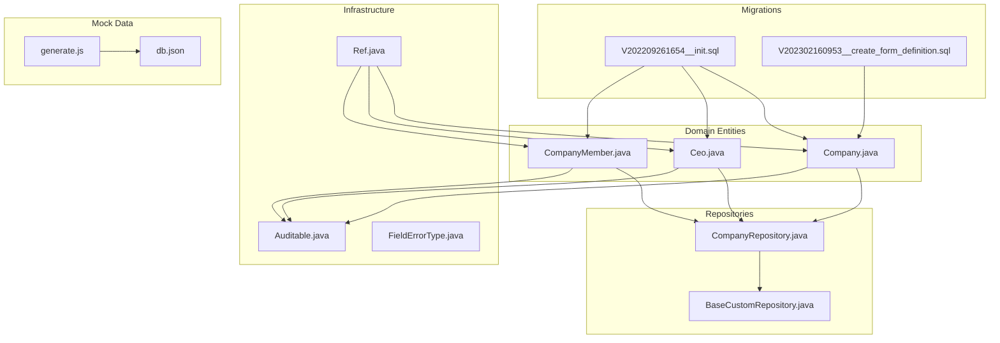

**Diagram sources**
- [V202209261654__init.sql:1-24](file://apps/company-api/application/src/main/resources/db/migration/V202209261654__init.sql#L1-L24)
- [V202302160953__create_form_definition.sql:1-10](file://apps/company-api/application/src/main/resources/db/migration/V202302160953__create_form_definition.sql#L1-L10)
- [Company.java:1-124](file://apps/company-api/application/src/main/java/com/redesignhealth/company/api/entity/Company.java#L1-L124)
- [Ceo.java:1-134](file://apps/company-api/application/src/main/java/com/redesignhealth/company/api/entity/Ceo.java#L1-L134)
- [CompanyMember.java:1-59](file://apps/company-api/application/src/main/java/com/redesignhealth/company/api/entity/CompanyMember.java#L1-L59)
- [CompanyRepository.java:1-23](file://apps/company-api/application/src/main/java/com/redesignhealth/company/api/repository/CompanyRepository.java#L1-L23)
- [BaseCustomRepository.java:1-77](file://apps/company-api/application/src/main/java/com/redesignhealth/company/api/repository/BaseCustomRepository.java#L1-L77)
- [Auditable.java:1-60](file://apps/company-api/application/src/main/java/com/redesignhealth/company/api/entity/audit/Auditable.java#L1-L60)
- [Ref.java:1-36](file://apps/company-api/application/src/main/java/com/redesignhealth/company/api/entity/ref/Ref.java#L1-L36)
- [FieldErrorType.java:1-24](file://apps/company-api/application/src/main/java/com/redesignhealth/company/api/exception/dto/FieldErrorType.java#L1-L24)
- [generate.js:15-303](file://apps/api-server/src/data/generate.js#L15-L303)
- [db.json](file://apps/api-server/src/data/db.json)

**Section sources**
- [V202209261654__init.sql:1-24](file://apps/company-api/application/src/main/resources/db/migration/V202209261654__init.sql#L1-L24)
- [0004-database-migration-tool.md:1-33](file://apps/company-api/doc/architecture/decisions/0004-database-migration-tool.md#L1-L33)
- [0005-orm.md:1-31](file://apps/company-api/doc/architecture/decisions/0005-orm.md#L1-L31)

## Core Components
- Flyway migrations define the canonical schema and enforce versioned changes.
- JPA entities model business concepts with typed identifiers and audit metadata.
- Repositories implement Spring Data patterns with custom extensions for expansion and pagination.
- Mock data generation supports local development and testing.

Key capabilities:
- Typed natural keys via reference wrappers to avoid leaking internal IDs.
- Enumerations stored as strings for flexibility and readability.
- Audit fields automatically tracked on entities.
- Sequences pooled per table to improve concurrency.

**Section sources**
- [0010-natural-key-refs.md:1-44](file://apps/company-api/doc/architecture/decisions/0010-natural-key-refs.md#L1-L44)
- [0018-store-enums-as-strings.md:1-41](file://apps/company-api/doc/architecture/decisions/0018-store-enums-as-strings.md#L1-L41)
- [Auditable.java:1-60](file://apps/company-api/application/src/main/java/com/redesignhealth/company/api/entity/audit/Auditable.java#L1-L60)
- [0015-use-pooled-database-sequences.md:1-52](file://apps/company-api/doc/architecture/decisions/0015-use-pooled-database-sequences.md#L1-L52)

## Architecture Overview
The data layer follows a layered architecture:
- Migrations define schema and constraints.
- Entities encapsulate business logic and persistence mapping.
- Repositories abstract data access and enable expansion-aware queries.
- Application services orchestrate transactions and business operations.

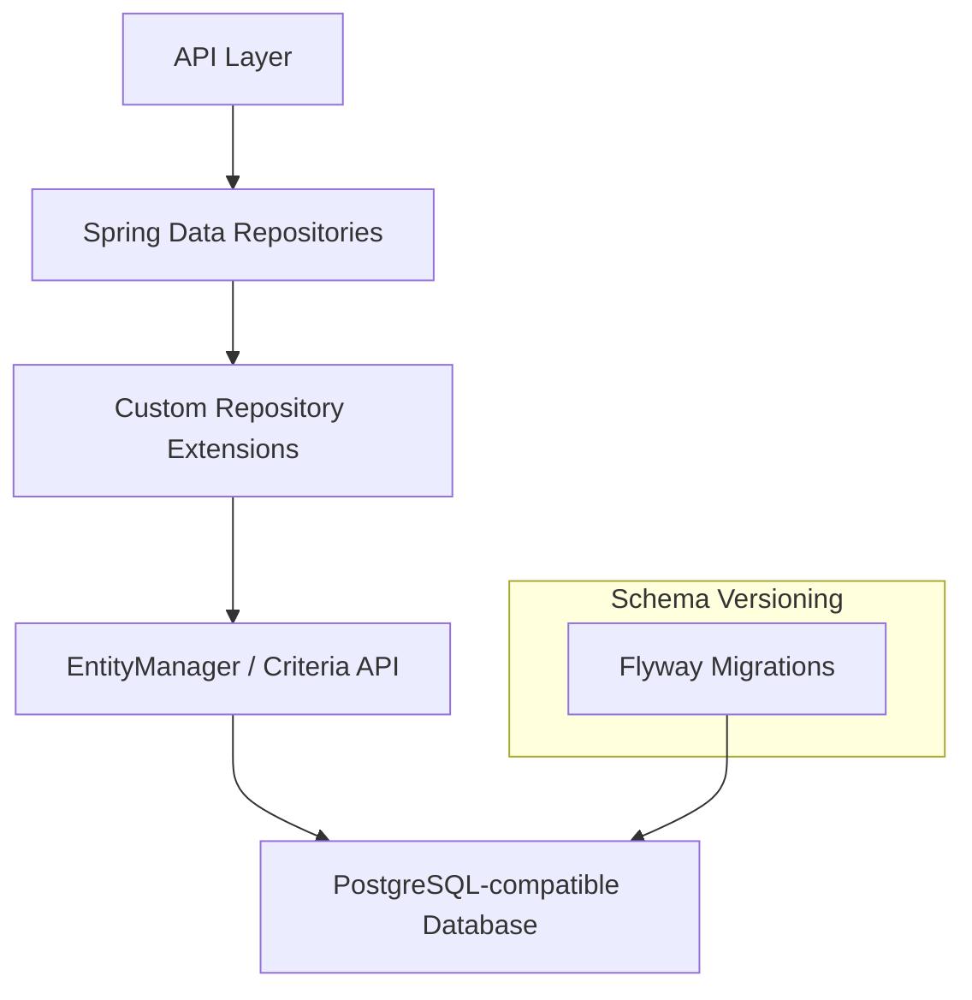

**Diagram sources**
- [BaseCustomRepository.java:1-77](file://apps/company-api/application/src/main/java/com/redesignhealth/company/api/repository/BaseCustomRepository.java#L1-L77)
- [CompanyRepository.java:1-23](file://apps/company-api/application/src/main/java/com/redesignhealth/company/api/repository/CompanyRepository.java#L1-L23)
- [V202209261654__init.sql:1-24](file://apps/company-api/application/src/main/resources/db/migration/V202209261654__init.sql#L1-L24)

## Detailed Component Analysis

### Database Schema Design and Migrations
- Initial schema establishes operating company, person, and membership tables with unique constraints and foreign keys.
- Additional migrations evolve schema over time, including roles, audit fields, infrastructure requests, timezone updates, sequences, and consent tables.
- A dedicated form definition table uses JSONB for dynamic schema storage and includes a dedicated sequence.

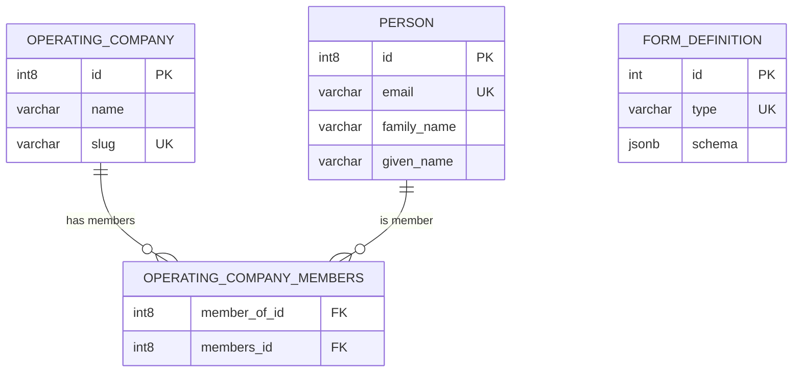

**Diagram sources**
- [V202209261654__init.sql:1-24](file://apps/company-api/application/src/main/resources/db/migration/V202209261654__init.sql#L1-L24)
- [V202302160953__create_form_definition.sql:1-10](file://apps/company-api/application/src/main/resources/db/migration/V202302160953__create_form_definition.sql#L1-L10)

**Section sources**
- [V202209261654__init.sql:1-24](file://apps/company-api/application/src/main/resources/db/migration/V202209261654__init.sql#L1-L24)
- [V202302160953__create_form_definition.sql:1-10](file://apps/company-api/application/src/main/resources/db/migration/V202302160953__create_form_definition.sql#L1-L10)
- [0004-database-migration-tool.md:1-33](file://apps/company-api/doc/architecture/decisions/0004-database-migration-tool.md#L1-L33)

### Entity Relationships and Data Modeling Patterns
- Company and Person are central entities with typed identifiers via reference converters.
- CompanyMember is a join entity using an embedded composite key to model many-to-many membership.
- Company embeds IP marketplace and other attributes; Ceo links to Person and stores structured JSON fields.
- Auditable base class adds standardized audit metadata to entities.

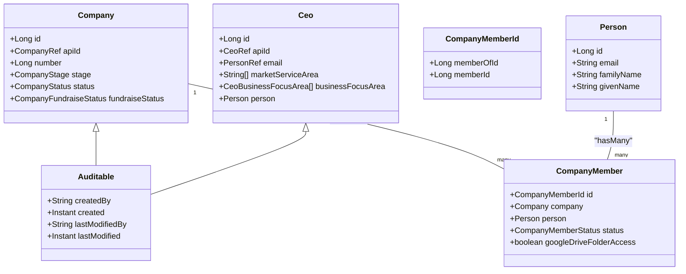

**Diagram sources**
- [Company.java:1-124](file://apps/company-api/application/src/main/java/com/redesignhealth/company/api/entity/Company.java#L1-L124)
- [CompanyMember.java:1-59](file://apps/company-api/application/src/main/java/com/redesignhealth/company/api/entity/CompanyMember.java#L1-L59)
- [Ceo.java:1-134](file://apps/company-api/application/src/main/java/com/redesignhealth/company/api/entity/Ceo.java#L1-L134)
- [Auditable.java:1-60](file://apps/company-api/application/src/main/java/com/redesignhealth/company/api/entity/audit/Auditable.java#L1-L60)

**Section sources**
- [Company.java:1-124](file://apps/company-api/application/src/main/java/com/redesignhealth/company/api/entity/Company.java#L1-L124)
- [CompanyMember.java:1-59](file://apps/company-api/application/src/main/java/com/redesignhealth/company/api/entity/CompanyMember.java#L1-L59)
- [Ceo.java:1-134](file://apps/company-api/application/src/main/java/com/redesignhealth/company/api/entity/Ceo.java#L1-L134)
- [Auditable.java:1-60](file://apps/company-api/application/src/main/java/com/redesignhealth/company/api/entity/audit/Auditable.java#L1-L60)

### Spring Data JPA Repository Pattern and Custom Extensions
- CompanyRepository extends CrudRepository and declares method signatures for existence checks and bulk lookups by typed identifiers.
- BaseCustomRepository provides expansion-aware pagination and ID-only retrieval to optimize caching and hydration.
- The custom repository pattern enables controlled expansion of relations while maintaining performance.

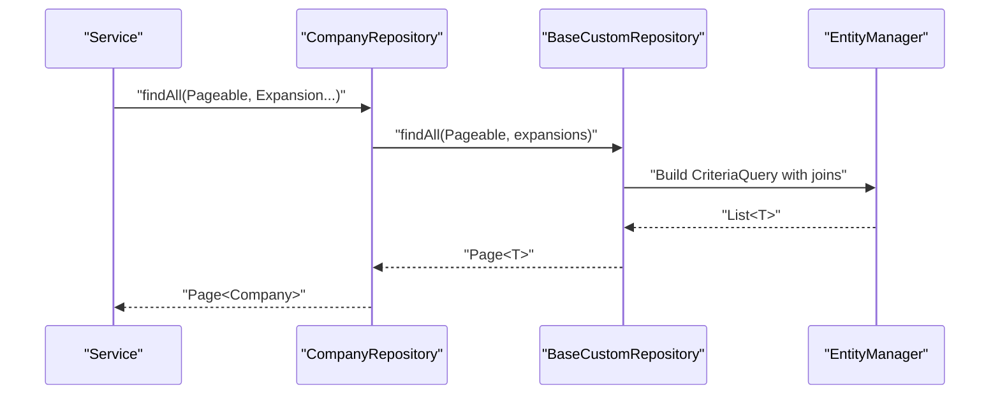

**Diagram sources**
- [CompanyRepository.java:1-23](file://apps/company-api/application/src/main/java/com/redesignhealth/company/api/repository/CompanyRepository.java#L1-L23)
- [BaseCustomRepository.java:1-77](file://apps/company-api/application/src/main/java/com/redesignhealth/company/api/repository/BaseCustomRepository.java#L1-L77)

**Section sources**
- [CompanyRepository.java:1-23](file://apps/company-api/application/src/main/java/com/redesignhealth/company/api/repository/CompanyRepository.java#L1-L23)
- [BaseCustomRepository.java:1-77](file://apps/company-api/application/src/main/java/com/redesignhealth/company/api/repository/BaseCustomRepository.java#L1-L77)

### Entity Lifecycle Management and Audit Fields
- Auditable base class standardizes audit metadata across entities.
- Spring Data JPA auditing is enabled via an auditing entity listener and a custom auditor provider to populate creator/modifier identities and timestamps.

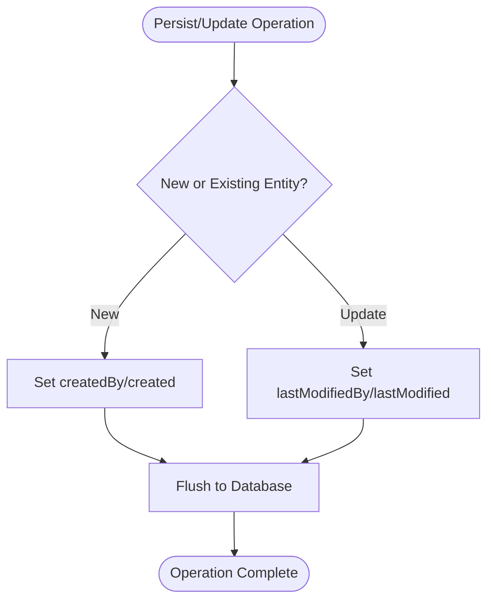

**Diagram sources**
- [Auditable.java:1-60](file://apps/company-api/application/src/main/java/com/redesignhealth/company/api/entity/audit/Auditable.java#L1-L60)

**Section sources**
- [Auditable.java:1-60](file://apps/company-api/application/src/main/java/com/redesignhealth/company/api/entity/audit/Auditable.java#L1-L60)

### Typed Natural Keys and Reference Converters
- Natural keys are represented as typed Ref instances to avoid leaking internal IDs and to provide compile-time safety.
- Attribute converters translate between database columns and typed references.
- Reference naming conventions align with API path parameters.

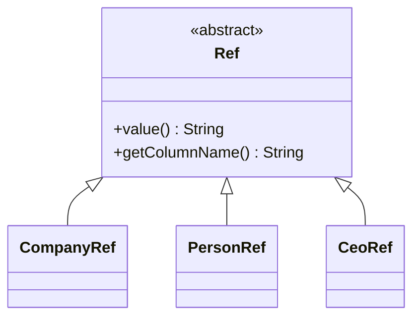

**Diagram sources**
- [Ref.java:1-36](file://apps/company-api/application/src/main/java/com/redesignhealth/company/api/entity/ref/Ref.java#L1-L36)

**Section sources**
- [0010-natural-key-refs.md:1-44](file://apps/company-api/doc/architecture/decisions/0010-natural-key-refs.md#L1-L44)
- [Ref.java:1-36](file://apps/company-api/application/src/main/java/com/redesignhealth/company/api/entity/ref/Ref.java#L1-L36)

### Data Validation Rules and Business Constraints
- Unique constraints enforced at the database level (e.g., unique email, unique slug, unique type).
- Enumerations stored as strings to prevent brittle ordinal changes.
- Field-level validation types enumerate common constraints (unique, not null, not empty, etc.).

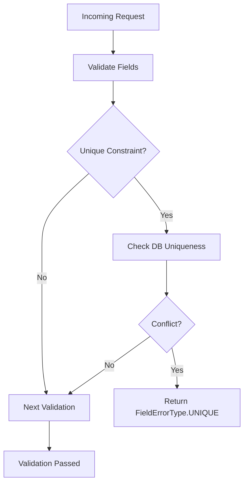

**Diagram sources**
- [FieldErrorType.java:1-24](file://apps/company-api/application/src/main/java/com/redesignhealth/company/api/exception/dto/FieldErrorType.java#L1-L24)
- [V202209261654__init.sql:1-24](file://apps/company-api/application/src/main/resources/db/migration/V202209261654__init.sql#L1-L24)
- [V202302160953__create_form_definition.sql:1-10](file://apps/company-api/application/src/main/resources/db/migration/V202302160953__create_form_definition.sql#L1-L10)

**Section sources**
- [FieldErrorType.java:1-24](file://apps/company-api/application/src/main/java/com/redesignhealth/company/api/exception/dto/FieldErrorType.java#L1-L24)
- [0018-store-enums-as-strings.md:1-41](file://apps/company-api/doc/architecture/decisions/0018-store-enums-as-strings.md#L1-L41)
- [V202209261654__init.sql:1-24](file://apps/company-api/application/src/main/resources/db/migration/V202209261654__init.sql#L1-L24)

### Referential Integrity Enforcement
- Foreign keys define relationships between entities (e.g., membership table references company and person).
- Cascading deletes are applied where appropriate to maintain consistency during deletions.
- Sequences are created per table to support ID allocation and reduce contention.

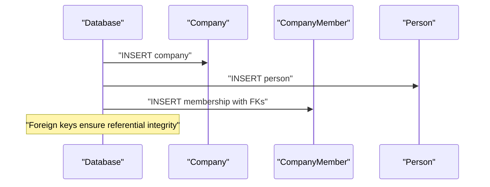

**Diagram sources**
- [V202209261654__init.sql:1-24](file://apps/company-api/application/src/main/resources/db/migration/V202209261654__init.sql#L1-L24)
- [0015-use-pooled-database-sequences.md:1-52](file://apps/company-api/doc/architecture/decisions/0015-use-pooled-database-sequences.md#L1-L52)

**Section sources**
- [V202209261654__init.sql:1-24](file://apps/company-api/application/src/main/resources/db/migration/V202209261654__init.sql#L1-L24)
- [0015-use-pooled-database-sequences.md:1-52](file://apps/company-api/doc/architecture/decisions/0015-use-pooled-database-sequences.md#L1-L52)

### Mock Data Generation for Development and Testing
- A Node script generates synthetic datasets for companies, vendors, CEOs, IP listings, users, and consents.
- Generated data is written to a JSON fixture file suitable for local APIs and tests.

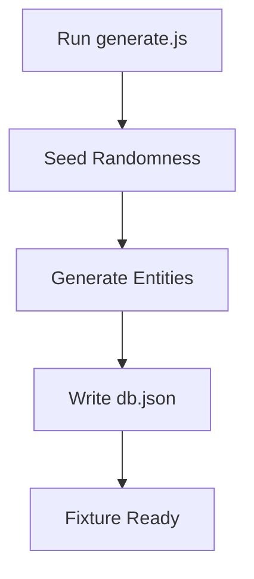

**Diagram sources**
- [generate.js:15-303](file://apps/api-server/src/data/generate.js#L15-L303)
- [db.json](file://apps/api-server/src/data/db.json)

**Section sources**
- [generate.js:15-303](file://apps/api-server/src/data/generate.js#L15-L303)

## Dependency Analysis
The following diagram highlights key dependencies among components:

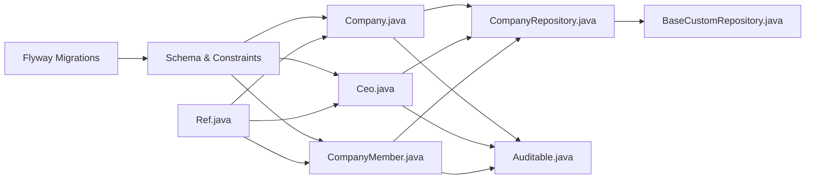

**Diagram sources**
- [V202209261654__init.sql:1-24](file://apps/company-api/application/src/main/resources/db/migration/V202209261654__init.sql#L1-L24)
- [Company.java:1-124](file://apps/company-api/application/src/main/java/com/redesignhealth/company/api/entity/Company.java#L1-L124)
- [Ceo.java:1-134](file://apps/company-api/application/src/main/java/com/redesignhealth/company/api/entity/Ceo.java#L1-L134)
- [CompanyMember.java:1-59](file://apps/company-api/application/src/main/java/com/redesignhealth/company/api/entity/CompanyMember.java#L1-L59)
- [CompanyRepository.java:1-23](file://apps/company-api/application/src/main/java/com/redesignhealth/company/api/repository/CompanyRepository.java#L1-L23)
- [BaseCustomRepository.java:1-77](file://apps/company-api/application/src/main/java/com/redesignhealth/company/api/repository/BaseCustomRepository.java#L1-L77)
- [Auditable.java:1-60](file://apps/company-api/application/src/main/java/com/redesignhealth/company/api/entity/audit/Auditable.java#L1-L60)
- [Ref.java:1-36](file://apps/company-api/application/src/main/java/com/redesignhealth/company/api/entity/ref/Ref.java#L1-L36)

**Section sources**
- [CompanyRepository.java:1-23](file://apps/company-api/application/src/main/java/com/redesignhealth/company/api/repository/CompanyRepository.java#L1-L23)
- [BaseCustomRepository.java:1-77](file://apps/company-api/application/src/main/java/com/redesignhealth/company/api/repository/BaseCustomRepository.java#L1-L77)

## Performance Considerations
- Pooled sequences reduce lock contention and improve insert throughput.
- Using ID-only queries for pagination avoids unnecessary hydration and improves caching efficiency.
- Storing enums as strings increases storage but simplifies schema evolution.

Recommendations:
- Monitor sequence usage and adjust increments if needed.
- Prefer expansion-aware queries to load only required relations.
- Index frequently filtered columns in repositories as needed.

**Section sources**
- [0015-use-pooled-database-sequences.md:1-52](file://apps/company-api/doc/architecture/decisions/0015-use-pooled-database-sequences.md#L1-L52)
- [BaseCustomRepository.java:1-77](file://apps/company-api/application/src/main/java/com/redesignhealth/company/api/repository/BaseCustomRepository.java#L1-L77)
- [0018-store-enums-as-strings.md:1-41](file://apps/company-api/doc/architecture/decisions/0018-store-enums-as-strings.md#L1-L41)

## Troubleshooting Guide
Common issues and resolutions:
- Migration failures: Verify Flyway checksums and version ordering; ensure migration directory and naming conventions match expectations.
- Validation errors: Inspect FieldErrorType messages to identify constraint violations (unique, not null, not empty).
- Repository query problems: Confirm expansion parameters and pagination usage; ensure custom repository methods are invoked correctly.
- Audit metadata missing: Confirm auditing entity listener registration and auditor provider configuration.

**Section sources**
- [0004-database-migration-tool.md:1-33](file://apps/company-api/doc/architecture/decisions/0004-database-migration-tool.md#L1-L33)
- [FieldErrorType.java:1-24](file://apps/company-api/application/src/main/java/com/redesignhealth/company/api/exception/dto/FieldErrorType.java#L1-L24)
- [BaseCustomRepository.java:1-77](file://apps/company-api/application/src/main/java/com/redesignhealth/company/api/repository/BaseCustomRepository.java#L1-L77)
- [Auditable.java:1-60](file://apps/company-api/application/src/main/java/com/redesignhealth/company/api/entity/audit/Auditable.java#L1-L60)

## Conclusion
The Redesign Health data management system leverages Flyway for robust schema evolution, Spring Data JPA for type-safe data access, and typed natural keys for secure and flexible identifiers. Audit fields, expansion-aware repositories, and strict validation rules ensure data integrity and operability. The mock data generator streamlines development and testing. Together, these patterns provide a scalable, maintainable foundation for healthcare data operations.

## Appendices

### Appendix A: Flyway Migration Strategy
- Tool: Flyway.
- Directory: migrations under the application resources.
- Naming: V<YYYYMMDDHHMM>__<description>.sql.
- Approach: Version-controlled schema changes applied on startup.

**Section sources**
- [0004-database-migration-tool.md:1-33](file://apps/company-api/doc/architecture/decisions/0004-database-migration-tool.md#L1-L33)

### Appendix B: ORM and JPA Choices
- ORM: Spring Data JPA with Hibernate as the provider.
- Driver: PostgreSQL-compatible (CockroachDB).
- Benefits: Security, transactions, caching, developer experience.

**Section sources**
- [0005-orm.md:1-31](file://apps/company-api/doc/architecture/decisions/0005-orm.md#L1-L31)

### Appendix C: Data Security and Access Control
- Typed identifiers minimize exposure of internal IDs.
- Attribute converters encapsulate conversion logic.
- Audit fields track who changed what and when.
- Consider encrypting sensitive fields at rest and enforcing least privilege access controls at the application and database levels.

[No sources needed since this section provides general guidance]

### Appendix D: Backup, Disaster Recovery, and Retention
- Backups: Schedule regular logical backups of the database.
- Recovery: Test point-in-time recovery procedures and failover drills.
- Retention: Define and enforce data retention policies aligned with compliance requirements.

[No sources needed since this section provides general guidance]