# Deployment & Operations

<cite>
**Referenced Files in This Document**
- [README.md](file://README.md)
- [nx.json](file://nx.json)
- [apps/portal/Dockerfile](file://apps/portal/Dockerfile)
- [apps/third-party-network/Dockerfile](file://apps/third-party-network/Dockerfile)
- [apps/oauth-jwt-generator/Dockerfile](file://apps/oauth-jwt-generator/Dockerfile)
- [apps/km-docs-lambda/Dockerfile](file://apps/km-docs-lambda/Dockerfile)
- [apps/prometheus/Dockerfile](file://apps/prometheus/Dockerfile)
- [apps/company-api/Dockerfile](file://apps/company-api/Dockerfile)
- [apps/company-api/docker-compose.yml](file://apps/company-api/docker-compose.yml)
- [mkdocs.yml](file://mkdocs.yml)
- [.devcontainer/Dockerfile](file://.devcontainer/Dockerfile)
- [apps/portal/project.json](file://apps/portal/project.json)
- [apps/third-party-network/project.json](file://apps/third-party-network/project.json)
- [apps/oauth-jwt-generator/project.json](file://apps/oauth-jwt-generator/project.json)
- [apps/km-docs-lambda/project.json](file://apps/km-docs-lambda/project.json)
- [apps/prometheus/project.json](file://apps/prometheus/project.json)
- [apps/company-api/project.json](file://apps/company-api/project.json)
- [apps/api-server/project.json](file://apps/api-server/project.json)
- [apps/ff4j-rh/project.json](file://apps/ff4j-rh/project.json)
- [apps/opcofin/project.json](file://apps/opcofin/project.json)
- [apps/parser-playground/project.json](file://apps/parser-playground/project.json)
- [apps/chat-pocs/rocketchat-poc/Dockerfile](file://apps/chat-pocs/rocketchat-poc/Dockerfile)
- [apps/chat-pocs/rocketchat-poc/project.json](file://apps/chat-pocs/rocketchat-poc/project.json)
- [apps/portal/.env.local.example](file://apps/portal/.env.local.example)
- [apps/company-api/application/src/main/resources/application.yml](file://apps/company-api/application/src/main/resources/application.yml)
- [apps/company-api/application/src/main/resources/application-dev.yml](file://apps/company-api/application/src/main/resources/application-dev.yml)
- [apps/company-api/application/src/main/resources/application-prod.yml](file://apps/company-api/application/src/main/resources/application-prod.yml)
- [apps/company-api/application/src/main/resources/application-staging.yml](file://apps/company-api/application/src/main/resources/application-staging.yml)
- [apps/company-api/application/src/main/resources/application-docker-compose.yml](file://apps/company-api/application/src/main/resources/application-docker-compose.yml)
- [apps/prometheus/prometheus-template.yml](file://apps/prometheus/prometheus-template.yml)
- [docs/platform-documentation-library/understanding-the-environment.md](file://docs/platform-documentation-library/understanding-the-environment.md)
- [docs/platform-documentation-library/telemetry-and-data-infrastructure-overview.md](file://docs/platform-documentation-library/telemetry-and-data-infrastructure-overview.md)
- [docs/infrastructure-doc/00-overview.md](file://docs/infrastructure-doc/00-overview.md)
- [docs/infrastructure-doc/01-create-account.md](file://docs/infrastructure-doc/01-create-account.md)
- [docs/infrastructure-doc/02-tf-remote-state.md](file://docs/infrastructure-doc/02-tf-remote-state.md)
- [docs/infrastructure-doc/03-iam.md](file://docs/infrastructure-doc/03-iam.md)
- [docs/infrastructure-doc/04-network.md](file://docs/infrastructure-doc/04-network.md)
- [docs/infrastructure-doc/05-waf.md](file://docs/infrastructure-doc/05-waf.md)
- [docs/infrastructure-doc/06-dns-acm.md](file://docs/infrastructure-doc/06-dns-acm.md)
- [docs/infrastructure-doc/07-vpn.md](file://docs/infrastructure-doc/07-vpn.md)
- [docs/infrastructure-doc/08-guardduty-ecr.md](file://docs/infrastructure-doc/08-guardduty-ecr.md)
- [docs/infrastructure-doc/09-rds-ecs.md](file://docs/infrastructure-doc/09-rds-ecs.md)
- [docs/infrastructure-doc/10-vault.md](file://docs/infrastructure-doc/10-vault.md)
- [docs/glossary/a/amazon-elastic-container-service.md](file://docs/glossary/a/amazon-elastic-container-service.md)
- [docs/glossary/a/amazon-elastic-container-registry.md](file://docs/glossary/a/amazon-elastic-container-registry.md)
- [docs/glossary/a/artifactory.md](file://docs/glossary/a/artifactory.md)
- [docs/glossary/c/cloudfront.md](file://docs/glossary/c/cloudfront.md)
- [docs/glossary/c/cloudwatch.md](file://docs/glossary/c/cloudwatch.md)
- [docs/glossary/e/ecr.md](file://docs/glossary/e/ecr.md)
- [docs/glossary/g/github-actions.md](file://docs/glossary/g/github-actions.md)
- [docs/glossary/h/hashicorp-terraform.md](file://docs/glossary/h/hashicorp-terraform.md)
- [docs/glossary/h/hashicorp-vault.md](file://docs/glossary/h/hashicorp-vault.md)
- [docs/glossary/n/nginx.md](file://docs/glossary/n/nginx.md)
- [docs/glossary/r/route53.md](file://docs/glossary/r/route53.md)
- [docs/glossary/s/s3.md](file://docs/glossary/s/s3.md)
- [docs/glossary/t/terraform.md](file://docs/glossary/t/terraform.md)
- [docs/glossary/v/vault.md](file://docs/glossary/v/vault.md)
- [docs/glossary/w/web-application-firewall.md](file://docs/glossary/w/web-application-firewall.md)
- [docs/glossary/a/amazon-web-application-firewall.md](file://docs/glossary/a/amazon-web-application-firewall.md)
- [docs/glossary/a/amazon-route-53.md](file://docs/glossary/a/amazon-route-53.md)
- [docs/glossary/a/amazon-simple-storage-service.md](file://docs/glossary/a/amazon-simple-storage-service.md)
- [docs/glossary/a/amazon-cloudfront.md](file://docs/glossary/a/amazon-cloudfront.md)
- [docs/glossary/a/amazon-cloudwatch.md](file://docs/glossary/a/amazon-cloudwatch.md)
- [docs/glossary/a/amazon-cognito.md](file://docs/glossary/a/amazon-cognito.md)
- [docs/glossary/a/amazon-elasticache.md](file://docs/glossary/a/amazon-elasticache.md)
- [docs/glossary/a/amazon-aurora-postgresql.md](file://docs/glossary/a/amazon-aurora-postgresql.md)
- [docs/glossary/a/amazon-web-application-firewall.md](file://docs/glossary/a/amazon-web-application-firewall.md)
- [docs/glossary/p/prometheus.md](file://docs/glossary/p/prometheus.md)
- [docs/glossary/g/grafana.md](file://docs/glossary/g/grafana.md)
- [docs/glossary/h/hashicorp-vault.md](file://docs/glossary/h/hashicorp-vault.md)
- [docs/glossary/a/amazon-elastic-container-service.md](file://docs/glossary/a/amazon-elastic-container-service.md)
- [docs/glossary/a/amazon-elastic-container-registry.md](file://docs/glossary/a/amazon-elastic-container-registry.md)
- [docs/glossary/a/amazon-elastic-container-service.md](file://docs/glossary/a/amazon-elastic-container-service.md)
- [docs/glossary/a/amazon-elastic-container-registry.md](file://docs/glossary/a/amazon-elastic-container-registry.md)
</cite>

## Table of Contents
1. [Introduction](#introduction)
2. [Project Structure](#project-structure)
3. [Core Components](#core-components)
4. [Architecture Overview](#architecture-overview)
5. [Detailed Component Analysis](#detailed-component-analysis)
6. [Dependency Analysis](#dependency-analysis)
7. [Performance Considerations](#performance-considerations)
8. [Troubleshooting Guide](#troubleshooting-guide)
9. [Conclusion](#conclusion)
10. [Appendices](#appendices)

## Introduction
This document provides comprehensive deployment and operations guidance for the Redesign Health platform. It covers containerization strategies, CI/CD considerations, infrastructure requirements, environment configuration, observability, scaling, security, and disaster recovery. The platform includes a React single-page application (SPA), a Java-based Spring Boot API, a Node.js JWT generator, a Python AWS Lambda function, and a Prometheus service. Container images are built using Dockerfiles per application, and a local development environment is supported via docker-compose for the Spring Boot API and its dependencies.

## Project Structure
The repository is an Nx monorepo with multiple applications and libraries. Deployment artifacts are produced by Nx build targets and packaged into containers per application. The SPA applications are served via Nginx containers, while backend services are packaged as JVM or Lambda runtimes.

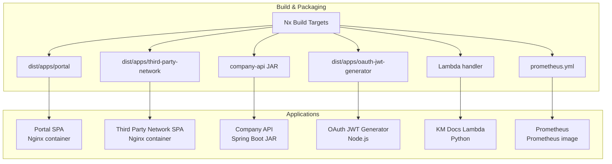

**Diagram sources**
- [apps/portal/Dockerfile](file://apps/portal/Dockerfile)
- [apps/third-party-network/Dockerfile](file://apps/third-party-network/Dockerfile)
- [apps/oauth-jwt-generator/Dockerfile](file://apps/oauth-jwt-generator/Dockerfile)
- [apps/km-docs-lambda/Dockerfile](file://apps/km-docs-lambda/Dockerfile)
- [apps/prometheus/Dockerfile](file://apps/prometheus/Dockerfile)
- [apps/company-api/Dockerfile](file://apps/company-api/Dockerfile)

**Section sources**
- [README.md:41-70](file://README.md#L41-L70)
- [nx.json:8-72](file://nx.json#L8-L72)

## Core Components
- Portal SPA: Built by Nx and served by an Nginx container. The Dockerfile copies the SPA build output and serves it with Nginx.
- Third Party Network SPA: Similar to the Portal SPA, served via Nginx.
- Company API: A Spring Boot application packaged as a JAR and executed in a container with a non-root user and mounted certificates.
- OAuth JWT Generator: A Node.js service built and run in a slim container.
- KM Docs Lambda: A Python Lambda packaged for AWS Lambda runtime.
- Prometheus: A Prometheus container configured with a custom configuration file.

**Section sources**
- [apps/portal/Dockerfile:1-7](file://apps/portal/Dockerfile#L1-L7)
- [apps/third-party-network/Dockerfile:1-7](file://apps/third-party-network/Dockerfile#L1-L7)
- [apps/company-api/Dockerfile:1-9](file://apps/company-api/Dockerfile#L1-L9)
- [apps/oauth-jwt-generator/Dockerfile:1-12](file://apps/oauth-jwt-generator/Dockerfile#L1-L12)
- [apps/km-docs-lambda/Dockerfile:1-7](file://apps/km-docs-lambda/Dockerfile#L1-L7)
- [apps/prometheus/Dockerfile:1-3](file://apps/prometheus/Dockerfile#L1-L3)

## Architecture Overview
The deployment architecture combines containerized microservices and SPAs behind a CDN and WAF. The Spring Boot API runs in a containerized environment, optionally backed by CockroachDB and OpenSearch in local docker-compose. Observability is achieved via Prometheus scraping and Grafana dashboards. Secrets and infrastructure are managed via Terraform and Vault.

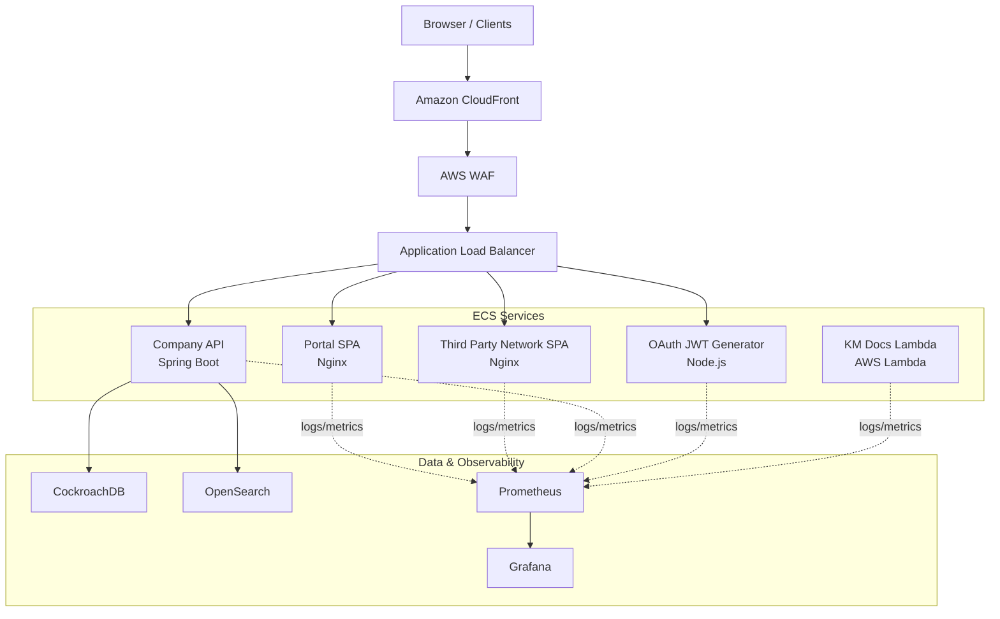

**Diagram sources**
- [docs/glossary/a/amazon-cloudfront.md](file://docs/glossary/a/amazon-cloudfront.md)
- [docs/glossary/a/amazon-web-application-firewall.md](file://docs/glossary/a/amazon-web-application-firewall.md)
- [docs/glossary/a/amazon-elastic-container-service.md](file://docs/glossary/a/amazon-elastic-container-service.md)
- [docs/glossary/a/amazon-elastic-container-registry.md](file://docs/glossary/a/amazon-elastic-container-registry.md)
- [docs/glossary/p/prometheus.md](file://docs/glossary/p/prometheus.md)
- [docs/glossary/g/grafana.md](file://docs/glossary/g/grafana.md)
- [apps/company-api/docker-compose.yml:1-82](file://apps/company-api/docker-compose.yml#L1-L82)

## Detailed Component Analysis

### Portal SPA Containerization
- Base image: Nginx stable.
- Copies Nginx configuration and SPA build output to the Nginx HTML directory.
- Runs Nginx in the foreground.

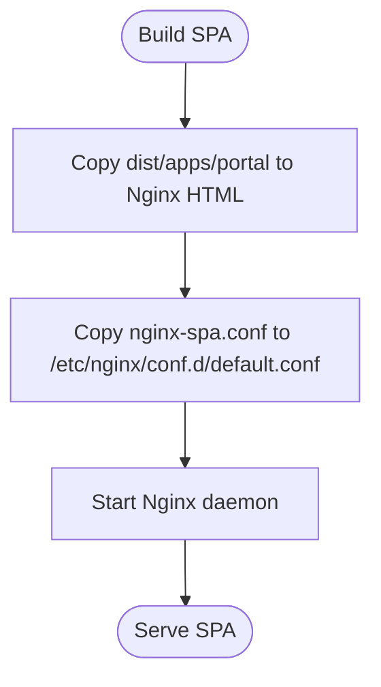

**Diagram sources**
- [apps/portal/Dockerfile:1-7](file://apps/portal/Dockerfile#L1-L7)

**Section sources**
- [apps/portal/Dockerfile:1-7](file://apps/portal/Dockerfile#L1-L7)
- [apps/portal/project.json](file://apps/portal/project.json)

### Third Party Network SPA Containerization
- Identical pattern to the Portal SPA using Nginx and the shared Nginx configuration.

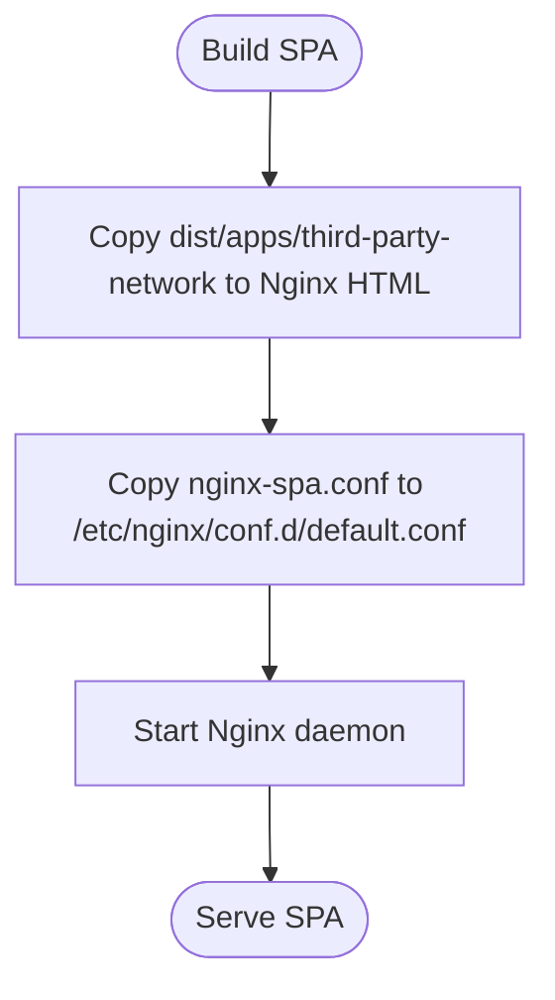

**Diagram sources**
- [apps/third-party-network/Dockerfile:1-7](file://apps/third-party-network/Dockerfile#L1-L7)

**Section sources**
- [apps/third-party-network/Dockerfile:1-7](file://apps/third-party-network/Dockerfile#L1-L7)
- [apps/third-party-network/project.json](file://apps/third-party-network/project.json)

### Company API Containerization
- Base image: Eclipse Temurin 17 JRE.
- Creates a dedicated non-root user and group.
- Copies certificates and the built JAR into the container.
- Runs the JAR with java -jar.

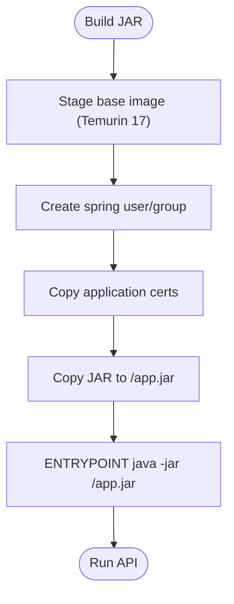

**Diagram sources**
- [apps/company-api/Dockerfile:1-9](file://apps/company-api/Dockerfile#L1-L9)

**Section sources**
- [apps/company-api/Dockerfile:1-9](file://apps/company-api/Dockerfile#L1-L9)
- [apps/company-api/project.json](file://apps/company-api/project.json)

### OAuth JWT Generator Containerization
- Base image: Node 16.20.2 slim.
- Copies built output and installs dependencies.
- Exposes port 3000 and starts the Node process.

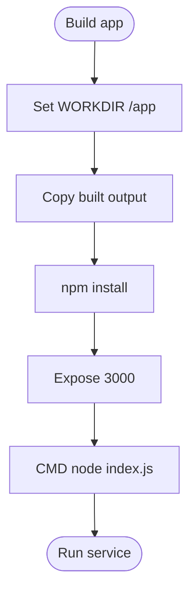

**Diagram sources**
- [apps/oauth-jwt-generator/Dockerfile:1-12](file://apps/oauth-jwt-generator/Dockerfile#L1-L12)

**Section sources**
- [apps/oauth-jwt-generator/Dockerfile:1-12](file://apps/oauth-jwt-generator/Dockerfile#L1-L12)
- [apps/oauth-jwt-generator/project.json](file://apps/oauth-jwt-generator/project.json)

### KM Docs Lambda Containerization
- Base image: aws-lambda python 3.9.
- Installs Python dependencies into the Lambda task root.
- Copies the handler module and sets the Lambda entry point.

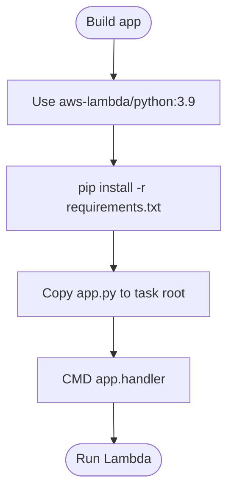

**Diagram sources**
- [apps/km-docs-lambda/Dockerfile:1-7](file://apps/km-docs-lambda/Dockerfile#L1-L7)

**Section sources**
- [apps/km-docs-lambda/Dockerfile:1-7](file://apps/km-docs-lambda/Dockerfile#L1-L7)
- [apps/km-docs-lambda/project.json](file://apps/km-docs-lambda/project.json)

### Prometheus Containerization
- Base image: official Prometheus.
- Copies a custom prometheus.yml into the container.

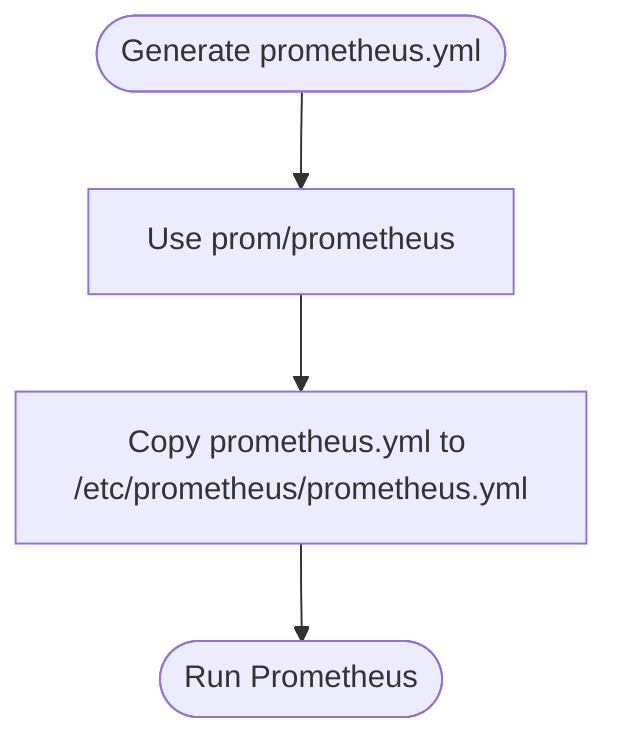

**Diagram sources**
- [apps/prometheus/Dockerfile:1-3](file://apps/prometheus/Dockerfile#L1-L3)

**Section sources**
- [apps/prometheus/Dockerfile:1-3](file://apps/prometheus/Dockerfile#L1-L3)
- [apps/prometheus/project.json](file://apps/prometheus/project.json)

### Local Development with docker-compose
The Spring Boot API can be run locally with CockroachDB and OpenSearch using docker-compose. This enables end-to-end testing and development without deploying to production infrastructure.

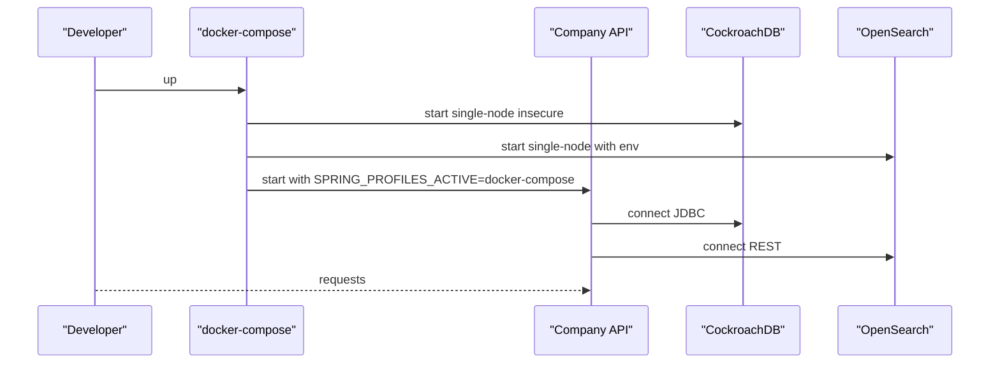

**Diagram sources**
- [apps/company-api/docker-compose.yml:1-82](file://apps/company-api/docker-compose.yml#L1-L82)

**Section sources**
- [apps/company-api/docker-compose.yml:1-82](file://apps/company-api/docker-compose.yml#L1-L82)

## Dependency Analysis
- Build-time dependencies: Nx orchestrates builds and caches; target defaults define inputs and caching behavior.
- Runtime dependencies: Applications depend on their respective base images and build outputs.
- Infrastructure dependencies: The Spring Boot API depends on CockroachDB and OpenSearch in local compose; production uses managed AWS services.

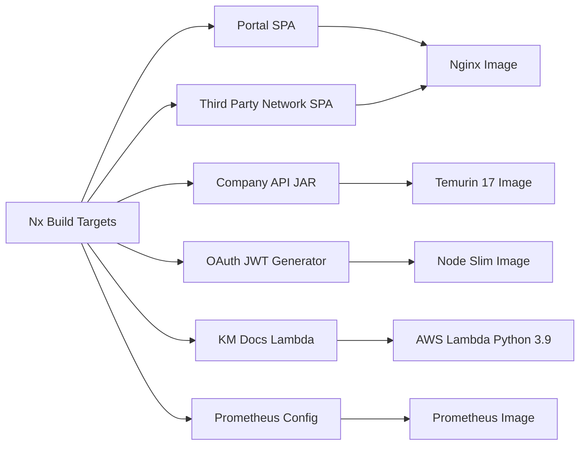

**Diagram sources**
- [nx.json:8-72](file://nx.json#L8-L72)
- [apps/portal/Dockerfile:1-7](file://apps/portal/Dockerfile#L1-L7)
- [apps/third-party-network/Dockerfile:1-7](file://apps/third-party-network/Dockerfile#L1-L7)
- [apps/company-api/Dockerfile:1-9](file://apps/company-api/Dockerfile#L1-L9)
- [apps/oauth-jwt-generator/Dockerfile:1-12](file://apps/oauth-jwt-generator/Dockerfile#L1-L12)
- [apps/km-docs-lambda/Dockerfile:1-7](file://apps/km-docs-lambda/Dockerfile#L1-L7)
- [apps/prometheus/Dockerfile:1-3](file://apps/prometheus/Dockerfile#L1-L3)

**Section sources**
- [nx.json:8-72](file://nx.json#L8-L72)

## Performance Considerations
- SPA delivery: Serve SPAs via Nginx with compression and caching headers to minimize latency.
- JVM tuning: Configure JVM heap and GC settings for the Spring Boot API based on workload and container CPU/memory limits.
- Lambda cold start: Keep the Python runtime warm with scheduled invocations or provisioned concurrency if latency-sensitive.
- Observability: Enable metrics scraping and dashboarding to detect performance regressions early.

[No sources needed since this section provides general guidance]

## Troubleshooting Guide
- SPA not loading: Verify the Nginx configuration and that the SPA build output exists in the expected directory before copying.
- API connectivity: Confirm database and search endpoints are reachable from the API container; check credentials and network policies.
- Prometheus metrics missing: Validate the prometheus.yml configuration and scrape targets; ensure firewall rules allow scraping.
- Secrets and configuration: Use environment variables or secret managers for sensitive values; avoid committing secrets to source control.

**Section sources**
- [apps/portal/Dockerfile:1-7](file://apps/portal/Dockerfile#L1-L7)
- [apps/third-party-network/Dockerfile:1-7](file://apps/third-party-network/Dockerfile#L1-L7)
- [apps/company-api/docker-compose.yml:1-82](file://apps/company-api/docker-compose.yml#L1-L82)
- [apps/prometheus/Dockerfile:1-3](file://apps/prometheus/Dockerfile#L1-L3)

## Conclusion
The Redesign Health platform employs a container-first deployment model with clear separation between SPAs and backend services. The Nx build system streamlines artifact generation, while Dockerfiles encapsulate packaging and runtime behavior. Local development is supported via docker-compose for the Spring Boot API and its dependencies. Production-grade infrastructure, observability, and security controls are documented in the platform’s infrastructure and glossary documents.

[No sources needed since this section summarizes without analyzing specific files]

## Appendices

### CI/CD Pipeline Configuration
- Build and cache: Nx target defaults define caching and inputs for build, test, lint, and storybook tasks.
- Testing: Unit and integration tests are orchestrated by Nx; E2E tests are available for the portal.
- Artifact publishing: Container images are built per application and pushed to a container registry.

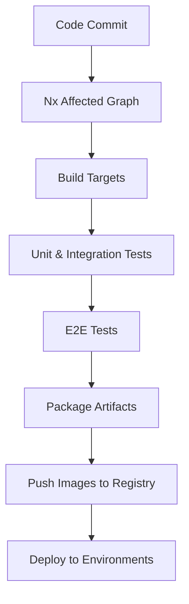

**Diagram sources**
- [nx.json:8-72](file://nx.json#L8-L72)

**Section sources**
- [nx.json:8-72](file://nx.json#L8-L72)
- [README.md:107-119](file://README.md#L107-L119)

### Environment Configuration Management
- Application profiles: Spring Boot profiles drive environment-specific configuration for dev, staging, and prod.
- Example environment variables: The portal expects API host and analytics identifiers via environment variables.

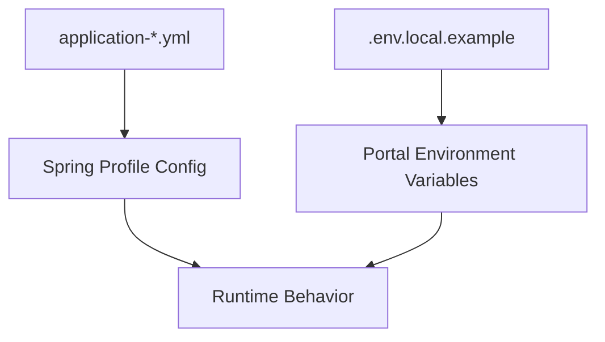

**Diagram sources**
- [apps/portal/.env.local.example](file://apps/portal/.env.local.example)
- [apps/company-api/application/src/main/resources/application.yml](file://apps/company-api/application/src/main/resources/application.yml)
- [apps/company-api/application/src/main/resources/application-dev.yml](file://apps/company-api/application/src/main/resources/application-dev.yml)
- [apps/company-api/application/src/main/resources/application-staging.yml](file://apps/company-api/application/src/main/resources/application-staging.yml)
- [apps/company-api/application/src/main/resources/application-prod.yml](file://apps/company-api/application/src/main/resources/application-prod.yml)

**Section sources**
- [apps/portal/.env.local.example](file://apps/portal/.env.local.example)
- [apps/company-api/application/src/main/resources/application.yml](file://apps/company-api/application/src/main/resources/application.yml)
- [apps/company-api/application/src/main/resources/application-dev.yml](file://apps/company-api/application/src/main/resources/application-dev.yml)
- [apps/company-api/application/src/main/resources/application-staging.yml](file://apps/company-api/application/src/main/resources/application-staging.yml)
- [apps/company-api/application/src/main/resources/application-prod.yml](file://apps/company-api/application/src/main/resources/application-prod.yml)

### Infrastructure Requirements and Secrets Handling
- Infrastructure: The platform leverages AWS services including ECS, ECR, CloudFront, WAF, Route 53, S3, and CloudWatch. Secrets and infrastructure are provisioned via Terraform and managed via HashiCorp Vault.
- Compliance: Security controls include WAF, DNS/ACM, VPN, GuardDuty, and ECR scanning.

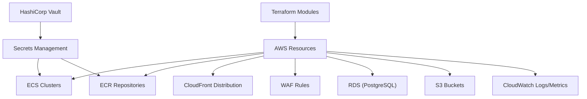

**Diagram sources**
- [docs/infrastructure-doc/00-overview.md](file://docs/infrastructure-doc/00-overview.md)
- [docs/infrastructure-doc/01-create-account.md](file://docs/infrastructure-doc/01-create-account.md)
- [docs/infrastructure-doc/02-tf-remote-state.md](file://docs/infrastructure-doc/02-tf-remote-state.md)
- [docs/infrastructure-doc/03-iam.md](file://docs/infrastructure-doc/03-iam.md)
- [docs/infrastructure-doc/04-network.md](file://docs/infrastructure-doc/04-network.md)
- [docs/infrastructure-doc/05-waf.md](file://docs/infrastructure-doc/05-waf.md)
- [docs/infrastructure-doc/06-dns-acm.md](file://docs/infrastructure-doc/06-dns-acm.md)
- [docs/infrastructure-doc/07-vpn.md](file://docs/infrastructure-doc/07-vpn.md)
- [docs/infrastructure-doc/08-guardduty-ecr.md](file://docs/infrastructure-doc/08-guardduty-ecr.md)
- [docs/infrastructure-doc/09-rds-ecs.md](file://docs/infrastructure-doc/09-rds-ecs.md)
- [docs/infrastructure-doc/10-vault.md](file://docs/infrastructure-doc/10-vault.md)
- [docs/glossary/a/amazon-elastic-container-service.md](file://docs/glossary/a/amazon-elastic-container-service.md)
- [docs/glossary/a/amazon-elastic-container-registry.md](file://docs/glossary/a/amazon-elastic-container-registry.md)
- [docs/glossary/a/amazon-cloudfront.md](file://docs/glossary/a/amazon-cloudfront.md)
- [docs/glossary/a/amazon-web-application-firewall.md](file://docs/glossary/a/amazon-web-application-firewall.md)
- [docs/glossary/a/amazon-route-53.md](file://docs/glossary/a/amazon-route-53.md)
- [docs/glossary/a/amazon-simple-storage-service.md](file://docs/glossary/a/amazon-simple-storage-service.md)
- [docs/glossary/a/amazon-cloudwatch.md](file://docs/glossary/a/amazon-cloudwatch.md)
- [docs/glossary/h/hashicorp-vault.md](file://docs/glossary/h/hashicorp-vault.md)

**Section sources**
- [docs/infrastructure-doc/00-overview.md](file://docs/infrastructure-doc/00-overview.md)
- [docs/infrastructure-doc/01-create-account.md](file://docs/infrastructure-doc/01-create-account.md)
- [docs/infrastructure-doc/02-tf-remote-state.md](file://docs/infrastructure-doc/02-tf-remote-state.md)
- [docs/infrastructure-doc/03-iam.md](file://docs/infrastructure-doc/03-iam.md)
- [docs/infrastructure-doc/04-network.md](file://docs/infrastructure-doc/04-network.md)
- [docs/infrastructure-doc/05-waf.md](file://docs/infrastructure-doc/05-waf.md)
- [docs/infrastructure-doc/06-dns-acm.md](file://docs/infrastructure-doc/06-dns-acm.md)
- [docs/infrastructure-doc/07-vpn.md](file://docs/infrastructure-doc/07-vpn.md)
- [docs/infrastructure-doc/08-guardduty-ecr.md](file://docs/infrastructure-doc/08-guardduty-ecr.md)
- [docs/infrastructure-doc/09-rds-ecs.md](file://docs/infrastructure-doc/09-rds-ecs.md)
- [docs/infrastructure-doc/10-vault.md](file://docs/infrastructure-doc/10-vault.md)

### Monitoring and Observability
- Metrics: Prometheus scrapes application endpoints; configure targets in prometheus.yml.
- Dashboards: Grafana visualizes metrics; integrate with Prometheus data source.
- Logging: Centralize logs to CloudWatch for containers and Lambda; enable structured logging in applications.

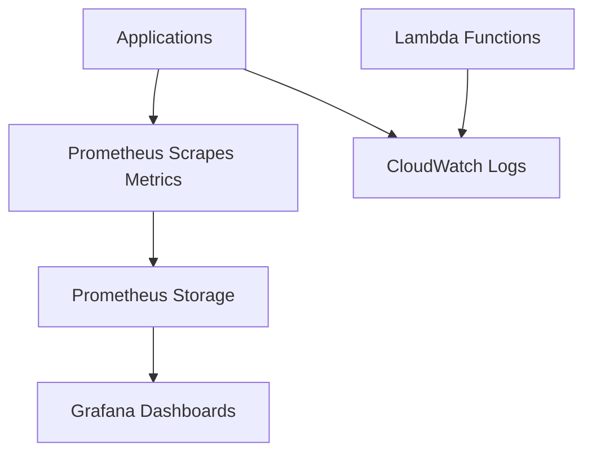

**Diagram sources**
- [apps/prometheus/prometheus-template.yml](file://apps/prometheus/prometheus-template.yml)
- [docs/glossary/p/prometheus.md](file://docs/glossary/p/prometheus.md)
- [docs/glossary/g/grafana.md](file://docs/glossary/g/grafana.md)
- [docs/glossary/a/amazon-cloudwatch.md](file://docs/glossary/a/amazon-cloudwatch.md)

**Section sources**
- [apps/prometheus/prometheus-template.yml](file://apps/prometheus/prometheus-template.yml)
- [docs/glossary/p/prometheus.md](file://docs/glossary/p/prometheus.md)
- [docs/glossary/g/grafana.md](file://docs/glossary/g/grafana.md)
- [docs/glossary/a/amazon-cloudwatch.md](file://docs/glossary/a/amazon-cloudwatch.md)

### Scaling, Load Balancing, and High Availability
- Horizontal scaling: ECS services scale based on target tracking policies; autoscaling groups manage capacity.
- Load balancing: ALB distributes traffic across service tasks; CloudFront provides global acceleration and caching.
- High availability: Multi-AZ placement, health checks, and circuit breaker patterns reduce failure impact.

**Section sources**
- [docs/glossary/a/amazon-elastic-container-service.md](file://docs/glossary/a/amazon-elastic-container-service.md)
- [docs/glossary/a/amazon-cloudfront.md](file://docs/glossary/a/amazon-cloudfront.md)
- [docs/glossary/a/amazon-web-application-firewall.md](file://docs/glossary/a/amazon-web-application-firewall.md)

### Security Hardening and Compliance
- Network policies: Restrict inbound/outbound traffic via security groups and NACLs; enforce TLS termination at CloudFront/WAF.
- Secrets: Store secrets in Vault; mount via environment variables or ECS secrets.
- Compliance: HIPAA-ready controls include encryption at rest/in-transit, audit logging, and access control.

**Section sources**
- [docs/glossary/a/amazon-web-application-firewall.md](file://docs/glossary/a/amazon-web-application-firewall.md)
- [docs/glossary/h/hashicorp-vault.md](file://docs/glossary/h/hashicorp-vault.md)
- [docs/infrastructure-doc/05-waf.md](file://docs/infrastructure-doc/05-waf.md)
- [docs/infrastructure-doc/08-guardduty-ecr.md](file://docs/infrastructure-doc/08-guardduty-ecr.md)

### Rollback Procedures, Health Checks, and Disaster Recovery
- Rollback: ECS supports rolling updates with rollback; maintain previous task definition revisions.
- Health checks: Configure ELB health checks and container health endpoints; monitor CloudWatch alarms.
- Disaster recovery: Back up RDS snapshots, S3 buckets, and ECR images; replicate across regions as needed.

**Section sources**
- [docs/glossary/a/amazon-elastic-container-service.md](file://docs/glossary/a/amazon-elastic-container-service.md)
- [docs/infrastructure-doc/09-rds-ecs.md](file://docs/infrastructure-doc/09-rds-ecs.md)
- [docs/infrastructure-doc/10-vault.md](file://docs/infrastructure-doc/10-vault.md)

### Additional References
- Platform documentation library and glossary provide detailed operational and architectural guidance.

**Section sources**
- [docs/platform-documentation-library/understanding-the-environment.md](file://docs/platform-documentation-library/understanding-the-environment.md)
- [docs/platform-documentation-library/telemetry-and-data-infrastructure-overview.md](file://docs/platform-documentation-library/telemetry-and-data-infrastructure-overview.md)
- [mkdocs.yml](file://mkdocs.yml)