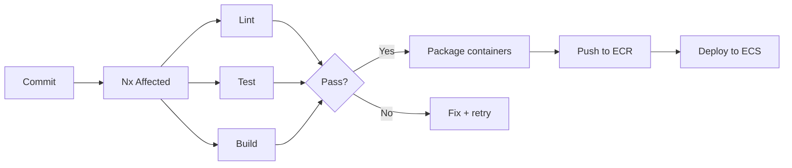
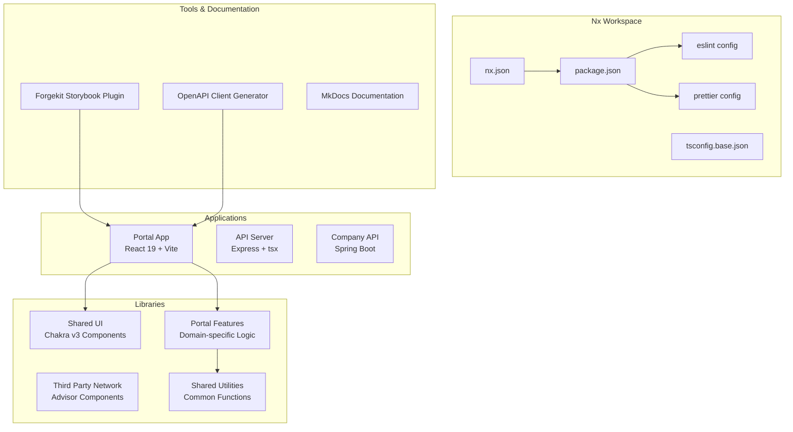
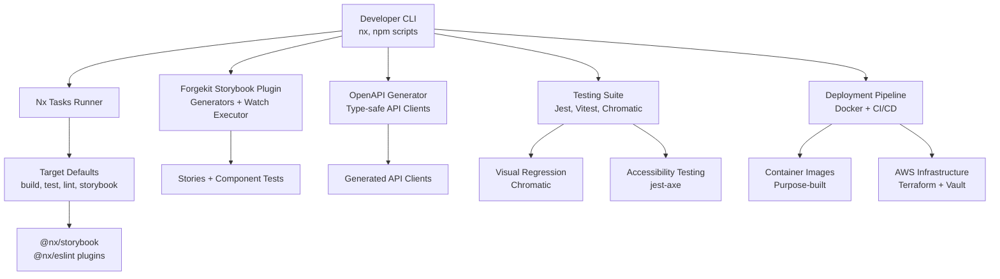
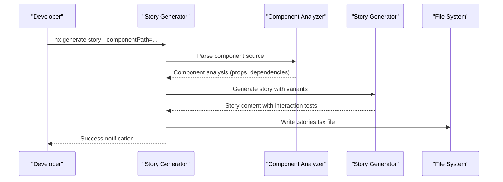

# Development Tools

<cite>
**Referenced Files in This Document**
- [nx.json](file://nx.json)
- [package.json](file://package.json)
- [tsconfig.base.json](file://tsconfig.base.json)
- [.eslintrc.json](file://.eslintrc.json)
- [.prettierrc](file://.prettierrc)
- [tools/forgekit-nx-storybook/project.json](file://tools/forgekit-nx-storybook/project.json)
- [tools/forgekit-nx-storybook/executors.json](file://tools/forgekit-nx-storybook/executors.json)
- [tools/forgekit-nx-storybook/generators.json](file://tools/forgekit-nx-storybook/generators.json)
- [tools/forgekit-nx-storybook/src/index.ts](file://tools/forgekit-nx-storybook/src/index.ts)
- [tools/forgekit-nx-storybook/src/generators/story/generator.ts](file://tools/forgekit-nx-storybook/src/generators/story/generator.ts)
- [tools/forgekit-nx-storybook/src/executors/watch/executor.ts](file://tools/forgekit-nx-storybook/src/executors/watch/executor.ts)
- [tools/generators/openapi-to-axios-client/schema.json](file://tools/generators/openapi-to-axios-client/schema.json)
- [tools/generators/openapi-to-axios-client/templates.ts](file://tools/generators/openapi-to-axios-client/templates.ts)
- [tools/generators/openapi-to-axios-client/index.ts](file://tools/generators/openapi-to-axios-client/index.ts)
- [tools/generators/openapi-to-axios-client/utils.ts](file://tools/generators/openapi-to-axios-client/utils.ts)
- [apps/docs/tooling/development-tools.mdx](file://apps/docs/tooling/development-tools.mdx)
- [apps/docs/tooling/contributing.mdx](file://apps/docs/tooling/contributing.mdx)
- [apps/docs/tooling/testing.mdx](file://apps/docs/tooling/testing.mdx)
- [apps/docs/tooling/deployment.mdx](file://apps/docs/tooling/deployment.mdx)
- [apps/docs/applications/portal/development-workflow.mdx](file://apps/docs/applications/portal/development-workflow.mdx)
- [apps/docs/applications/portal/components.mdx](file://apps/docs/applications/portal/components.mdx)
- [apps/docs/applications/portal/overview.mdx](file://apps/docs/applications/portal/overview.mdx)
- [apps/prometheus/README.md](file://apps/prometheus/README.md)
- [README.md](file://README.md)
</cite>

## Update Summary
**Changes Made**
- Added comprehensive development workflow documentation covering common commands, feature development procedures, and daily development practices
- Integrated detailed testing strategies including unit testing, visual regression, accessibility testing, and component testing approaches
- Documented deployment procedures including containerization strategy, CI/CD pipeline, infrastructure as code, and monitoring systems
- Enhanced shared UI component usage guidelines with feature-sliced architecture patterns and component organization
- Added troubleshooting guides for common development issues and tooling problems

## Table of Contents
1. [Introduction](#introduction)
2. [Development Workflows](#development-workflows)
3. [Feature Development Procedures](#feature-development-procedures)
4. [Shared UI Component Usage](#shared-ui-component-usage)
5. [Testing Strategies](#testing-strategies)
6. [Deployment Procedures](#deployment-procedures)
7. [Project Structure](#project-structure)
8. [Core Components](#core-components)
9. [Architecture Overview](#architecture-overview)
10. [Detailed Component Analysis](#detailed-component-analysis)
11. [Dependency Analysis](#dependency-analysis)
12. [Performance Considerations](#performance-considerations)
13. [Troubleshooting Guide](#troubleshooting-guide)
14. [Conclusion](#conclusion)
15. [Appendices](#appendices)

## Introduction
This document explains the comprehensive development tools and workflows in the Redesign Health monorepo. It covers Nx workspace configuration, project generation capabilities, build orchestration, development workflows, testing strategies, deployment procedures, and the forgekit-nx-storybook plugin for automated Storybook story generation, component testing, and accessibility auditing. The documentation includes detailed guidance on feature development procedures, shared UI component usage patterns, testing methodologies, and deployment pipelines.

## Development Workflows
The monorepo implements structured development workflows designed for efficient collaboration and maintainable code:

### Common Commands
The workspace provides streamlined commands for daily development tasks:

| Task | Command |
|------|---------|
| Start portal dev server | `npm run start:portal` |
| Build portal | `npm run build:portal` |
| Run all tests | `npm test` |
| Test affected projects | `npm run affected:test` |
| Lint affected projects | `npm run affected:lint` |
| Type-check all projects | `npm run check-types:all` |
| Run shared-ui Storybook | `npm run storybook` |
| Run portal-ui Storybook | `npm run storybook-portal-ui` |
| View dependency graph | `npm run graph` |
| Generate Chakra theme types | `npm run theme` |

### Development Environment Setup
- **API Server**: Start with `npm run start:api` for Express mock server on port 8080
- **Portal Application**: Launch with `npm run start:portal` for Vite dev server on port 4200
- **Environment Variables**: Configure `.env.local` with API hostnames, Google OAuth client IDs, and analytics settings

### Development Workflow Patterns
- **Affected Commands**: Use `nx affected` commands to run tasks only on projects changed since the last commit
- **Path Aliases**: Leverage `@redesignhealth/*` aliases for clean imports across shared libraries
- **Workspace TypeScript**: Select workspace TypeScript version in VS Code for consistent development experience

**Section sources**
- [apps/docs/tooling/development-tools.mdx:161-190](file://apps/docs/tooling/development-tools.mdx#L161-L190)
- [apps/docs/applications/portal/development-workflow.mdx:8-21](file://apps/docs/applications/portal/development-workflow.mdx#L8-L21)
- [README.md:107-126](file://README.md#L107-L126)

## Feature Development Procedures
Structured procedures ensure consistent feature development across the monorepo:

### Feature Library Generation
1. **Generate Feature Library**: Use Nx generator to scaffold new feature libraries
   ```bash
   nx g @nx/react:lib my-feature --directory=libs/portal/features/my-feature
   ```

2. **Export Public API**: Add exports to `libs/portal/features/my-feature/src/index.ts`
3. **Verify Path Aliases**: Confirm automatic path alias registration in `tsconfig.base.json`
4. **Add Routes**: Import feature components in `apps/portal/src/router.tsx` and add routes
5. **Write Tests**: Create colocated test files using `*.spec.tsx` convention
6. **Quality Assurance**: Run linting and type checking with `nx lint` and `nx check-types`

### Component Architecture Patterns
- **Route Components**: Thin wrappers composing feature components with data fetching
- **Data-connected Components**: Use React Query hooks from data-assets for server state
- **Presentational Components**: Pure UI components receiving data through props
- **Feature Modules**: Self-contained libraries with components, hooks, and tests

### Testing Integration
Every feature must include comprehensive testing:
- Unit tests with `@testing-library/react`
- Storybook stories with interaction tests
- Accessibility testing with `jest-axe`
- Visual regression testing with Chromatic

**Section sources**
- [apps/docs/applications/portal/development-workflow.mdx:22-67](file://apps/docs/applications/portal/development-workflow.mdx#L22-L67)
- [apps/docs/applications/portal/components.mdx:32-56](file://apps/docs/applications/portal/components.mdx#L32-L56)

## Shared UI Component Usage
The shared UI system provides a foundation for consistent component development:

### Component Organization
- **Shared UI Library**: Foundation components (buttons, inputs, layout primitives) via `@redesignhealth/ui`
- **Portal UI Library**: Domain-specific components extending shared UI via `@redesignhealth/portal/ui`
- **Feature Libraries**: Domain-specific components organized under `libs/portal/features/`

### Integration Patterns
```tsx
import { Loader, RootBoundary } from '@redesignhealth/ui'
import { CompanyTable } from '@redesignhealth/portal/ui'
```

### Component Lifecycle
1. **Browse Components**: Use Storybook to explore available components
2. **Edit Components**: Modify components in `libs/shared/ui/src/lib/<component-name>/`
3. **Export Components**: Add new exports to `libs/shared/ui/src/index.ts`
4. **Build Library**: Run `npm run build:ui` to update the compiled library

### Quality Gates
- Every UI component must have corresponding `*.stories.tsx` files
- CI enforces story presence for components in `type:ui` libraries
- Automatic formatting with Prettier for generated files

**Section sources**
- [apps/docs/applications/portal/components.mdx:74-83](file://apps/docs/applications/portal/components.mdx#L74-L83)
- [apps/docs/applications/portal/development-workflow.mdx:69-81](file://apps/docs/applications/portal/development-workflow.mdx#L69-L81)

## Testing Strategies
The monorepo implements a comprehensive multi-layered testing approach:

### Testing Pyramid
| Layer | Tool | Scope |
| :--- | :--- | :--- |
| Unit / integration | Jest, Vitest | Component logic, hooks, utilities |
| Component | @testing-library/react | DOM rendering, user interactions |
| Visual regression | Chromatic + Storybook | Pixel-level UI diffs |
| Interaction | Storybook play functions | Multi-step user flows |
| Accessibility | jest-axe, @storybook/addon-a11y | WCAG 2.1 AA compliance |
| Playwright component | @playwright/experimental-ct-react | Cross-browser component mounting |
| E2E | Playwright | Full application flows |

### Test Configuration
- **Jest Setup**: Global setup with `@testing-library/jest-dom` matchers
- **Vitest Setup**: Equivalent setup for Vite-based projects
- **Component Testing**: Colocated `.ct.tsx` files for cross-browser testing
- **API Testing**: React Query test utilities with mock fixtures

### Visual Regression Testing
- **Chromatic Integration**: Automated screenshot comparison on every push
- **Storybook Coverage**: All stories participate in visual regression testing
- **Acceptance Workflow**: Visual changes require explicit approval in Chromatic dashboard

### Accessibility Testing
- **Storybook Addon**: Real-time accessibility checking in Storybook UI
- **Programmatic Testing**: `jest-axe` integration for automated accessibility validation
- **Manual Verification**: Human review for complex accessibility scenarios

**Section sources**
- [apps/docs/tooling/testing.mdx:6-19](file://apps/docs/tooling/testing.mdx#L6-L19)
- [apps/docs/tooling/testing.mdx:89-134](file://apps/docs/tooling/testing.mdx#L89-L134)
- [apps/docs/tooling/testing.mdx:136-162](file://apps/docs/tooling/testing.mdx#L136-L162)

## Deployment Procedures
The monorepo implements containerized deployment with comprehensive CI/CD automation:

### Containerization Strategy
Each application receives a purpose-built Docker image:

| Application | Base Image | Key Features |
| :--- | :--- | :--- |
| Portal SPA | `nginx:stable` | Static SPA with client-side routing |
| Third-Party Network | `nginx:stable` | Static SPA with SPA-friendly routing |
| Company API | `eclipse-temurin:17-jdk-jammy` | Spring Boot JAR with JDWP debugging |
| OAuth JWT Generator | `node:16.20.2-bookworm-slim` | Lightweight Node.js container |
| KM Docs Lambda | `public.ecr.aws/lambda/python:3.9` | AWS Lambda Python runtime |
| Prometheus | `prom/prometheus` | Custom configuration baked in |

### CI/CD Pipeline
Automated deployment from commit to production:



### Infrastructure as Code
- **Terraform Management**: Infrastructure provisioning and management
- **Vault Integration**: Secure secrets management and injection
- **Multi-environment Support**: Separate configurations for dev, staging, prod

### Monitoring and Observability
- **Prometheus**: Metrics collection from Spring Boot Actuator endpoints
- **Grafana**: Visualization dashboards for system metrics
- **CloudWatch**: Centralized logging and alerting
- **Health Checks**: Automated service health monitoring

**Section sources**
- [apps/docs/tooling/deployment.mdx:6-35](file://apps/docs/tooling/deployment.mdx#L6-L35)
- [apps/docs/tooling/deployment.mdx:90-131](file://apps/docs/tooling/deployment.mdx#L90-L131)
- [apps/docs/tooling/deployment.mdx:184-203](file://apps/docs/tooling/deployment.mdx#L184-L203)

## Project Structure
The repository is an Nx workspace with a comprehensive monorepo layout:



**Section sources**
- [README.md:41-70](file://README.md#L41-L70)
- [apps/docs/applications/portal/overview.mdx:8-20](file://apps/docs/applications/portal/overview.mdx#L8-L20)

## Core Components
The development ecosystem consists of several interconnected components:

### Nx Workspace Configuration
- **Target Defaults**: Optimized caching and computation for build, test, lint, and Storybook targets
- **Named Inputs**: Reusable file sets defining cache invalidation rules
- **Generator Presets**: Standardized project scaffolding with consistent tooling
- **Plugin Integration**: Storybook and ESLint plugins with auto-inferred targets

### Development Tools Integration
- **Forgekit Storybook Plugin**: Automated story generation with component analysis
- **OpenAPI Client Generator**: Type-safe API client generation from specifications
- **Custom Executors**: Watch mode for live story updates and development assistance
- **VS Code Integration**: Nx Console extension for IDE-based task execution

### Code Quality Infrastructure
- **ESLint Configuration**: Comprehensive rule set enforcing code style and best practices
- **Prettier Setup**: Consistent formatting across all project files
- **Lint-Staged Integration**: Pre-commit quality gates for staged changes

**Section sources**
- [nx.json:8-72](file://nx.json#L8-L72)
- [apps/docs/tooling/development-tools.mdx:55-143](file://apps/docs/tooling/development-tools.mdx#L55-L143)
- [.eslintrc.json:1-225](file://.eslintrc.json#L1-L225)

## Architecture Overview
The development workflow integrates multiple layers of automation and quality assurance:



**Section sources**
- [apps/docs/tooling/development-tools.mdx:190-208](file://apps/docs/tooling/development-tools.mdx#L190-L208)
- [apps/docs/tooling/testing.mdx:20-36](file://apps/docs/tooling/testing.mdx#L20-L36)
- [apps/docs/tooling/deployment.mdx:94-107](file://apps/docs/tooling/deployment.mdx#L94-L107)

## Detailed Component Analysis

### Forgekit Storybook Plugin
The plugin provides comprehensive automation for component documentation:

#### Generators
- **Init Generator**: Validates prerequisites and installs missing dependencies
- **Story Generator**: Creates comprehensive stories with prop analysis and interaction tests
- **Stories Generator**: Bulk generation across entire projects with coverage reporting
- **Component Test Generator**: Creates colocated Playwright component tests

#### Watch Executor
- **Live Updates**: Monitors component directories for changes
- **Intelligent Filtering**: Ignores non-component files and spec/test files
- **Debounced Processing**: Prevents excessive regeneration during rapid edits
- **Recursive Monitoring**: Watches entire component hierarchies

#### Story Generation Process


**Section sources**
- [tools/forgekit-nx-storybook/src/generators/story/generator.ts:1-208](file://tools/forgekit-nx-storybook/src/generators/story/generator.ts#L1-L208)
- [tools/forgekit-nx-storybook/src/executors/watch/executor.ts:1-203](file://tools/forgekit-nx-storybook/src/executors/watch/executor.ts#L1-L203)

### OpenAPI Client Generator
Automated API client generation from OpenAPI specifications:

#### Generation Process
1. **Specification Fetching**: Retrieves OpenAPI spec from configured endpoints
2. **Type Generation**: Uses `openapi-typescript` for path definitions
3. **Client Generation**: Creates typed API classes with Axios integration
4. **Post-processing**: Normalizes optional parameters and formats output

#### Supported Environments
- **Development**: `nx generate-company-api-client portal`
- **Local Development**: `nx generate-company-api-client-local portal`

#### Output Structure
- **paths.d.ts**: Typed path definitions for endpoint URLs
- **types.d.ts**: Request/response types with `FilteredAxiosRequestConfig`
- **api.ts**: Fully typed API client class with method implementations

**Section sources**
- [tools/generators/openapi-to-axios-client/index.ts:1-32](file://tools/generators/openapi-to-axios-client/index.ts#L1-L32)
- [tools/generators/openapi-to-axios-client/templates.ts:1-223](file://tools/generators/openapi-to-axios-client/templates.ts#L1-L223)

### Build Orchestration and Scripts
Comprehensive script ecosystem for development and deployment:

#### Development Scripts
- **`npm start`**: Serves default project (portal) on port 4200
- **`npm run build:portal`**: Production build to `dist/apps/portal`
- **`npm run affected:test`**: Tests only affected projects
- **`npm run chromatic`**: Visual regression testing with Chromatic

#### Testing Scripts
- **`npm run test-storybook:shared-ui`**: Storybook interaction tests
- **`npm run check-types:all`**: Full workspace type checking
- **`npm run format:check`**: Dry-run formatting validation

#### Documentation Scripts
- **`npm run docs:dev`**: Development server for MkDocs documentation
- **`npm run docs:build`**: Production build of documentation site

**Section sources**
- [apps/docs/tooling/development-tools.mdx:190-208](file://apps/docs/tooling/development-tools.mdx#L190-L208)
- [package.json:5-52](file://package.json#L5-L52)

### Code Quality: ESLint and Prettier
Comprehensive code quality enforcement:

#### ESLint Configuration
- **TypeScript Rules**: Strict type checking with `@typescript-eslint`
- **React Best Practices**: Hooks rules, JSX accessibility, and component patterns
- **Import Sorting**: `simple-import-sort` with logical ordering
- **Module Boundaries**: `@nx/enforce-module-boundaries` for library isolation

#### Prettier Configuration
- **Consistent Formatting**: 2-space indentation, single quotes, no semicolons
- **JSX Handling**: Double quotes for JSX attributes, single quotes for JS
- **Arrow Functions**: Parentheses avoidance for readability

#### Pre-commit Integration
- **lint-staged**: Automatic linting and formatting of staged files
- **ESLint Fix**: Automatic fixing of fixable issues
- **Prettier Formatting**: Consistent code formatting before commits

**Section sources**
- [apps/docs/tooling/development-tools.mdx:211-282](file://apps/docs/tooling/development-tools.mdx#L211-L282)
- [.eslintrc.json:1-225](file://.eslintrc.json#L1-L225)
- [.prettierrc:1-9](file://.prettierrc#L1-L9)

### Storybook Integration and Design System Maintenance
Integrated design system documentation and maintenance:

#### Multiple Storybook Instances
- **Shared UI**: `npm run storybook` for foundation components
- **Portal UI**: `npm run storybook-portal-ui` for domain-specific components
- **Combined Access**: `npm run storybook-all` for simultaneous development

#### MCP Integration
- **Model Context Protocol**: AI-assisted component generation
- **Development Server**: `npm run mcp:storybook:dev` for interactive development
- **Setup Automation**: `npm run mcp:setup` for initial configuration

#### Theme Management
- **Chakra UI v3**: Automatic theme type generation
- **Token Sync**: `npm run theme` and `npm run theme:watch` for real-time updates
- **Design System Consistency**: Centralized theme management across components

**Section sources**
- [apps/docs/tooling/development-tools.mdx:285-311](file://apps/docs/tooling/development-tools.mdx#L285-L311)
- [apps/docs/tooling/development-tools.mdx:302-310](file://apps/docs/tooling/development-tools.mdx#L302-L310)

### VS Code Extensions and Nx Console
Enhanced development environment:

#### Recommended Extensions
- **Nx Console**: Visual task execution and project management
- **Prettier**: Consistent code formatting
- **Jest Runner**: Direct test execution from editor
- **ESLint**: Real-time linting integration
- **Playwright**: E2E test runner integration

#### Workspace Configuration
- **TypeScript Version**: Workspace-managed TypeScript for consistency
- **Extensions List**: `.vscode/extensions.json` with recommended tools
- **Settings**: Custom editor preferences for monorepo development

**Section sources**
- [apps/docs/tooling/development-tools.mdx:313-329](file://apps/docs/tooling/development-tools.mdx#L313-L329)
- [README.md:128-139](file://README.md#L128-L139)

## Dependency Analysis
The development ecosystem relies on carefully coordinated dependencies:

```mermaid
graph TB
subgraph "Core Development Tools"
NX["Nx Workspace<br/>22.3.3"]
TYPESCRIPT["TypeScript<br/>~5.9.2"]
NODE["Node.js<br/>24.11.1"]
END
subgraph "React Ecosystem"
REACT["React 19<br/>19.1.0"]
VITE["Vite<br/>^7.3.1"]
CHAKRA["Chakra UI v3<br/>^3.31.0"]
REACT_QUERY["React Query<br/>^5.0.0"]
END
subgraph "Testing Framework"
JEST["Jest<br/>30.0.5"]
VITEST["Vitest<br/>4.0.0"]
PLAYWRIGHT["Playwright<br/>^1.57.0"]
STORYBOOK["Storybook<br/>10.1.0"]
CHROMATIC["Chromatic<br/>^7.6.0"]
END
subgraph "Code Quality"
ESLINT["ESLint<br/>8.57.1"]
PRETTIER["Prettier<br/>2.6.2"]
END
subgraph "Backend Services"
EXPRESS["Express<br/>4.21.2"]
SPRING_BOOT["Spring Boot<br/>3.x"]
END
NX --> REACT
TYPESCRIPT --> CHAKRA
REACT --> REACT_QUERY
VITE --> PLAYWRIGHT
JEST --> STORYBOOK
VITEST --> CHROMATIC
ESLINT --> PRETTIER
EXPRESS --> SPRING_BOOT
```

**Section sources**
- [package.json:60-134](file://package.json#L60-L134)
- [apps/docs/applications/portal/overview.mdx:8-20](file://apps/docs/applications/portal/overview.mdx#L8-L20)

## Performance Considerations
Optimized development experience through strategic caching and parallel processing:

### Nx Caching Strategy
- **Remote Caching**: Nx Cloud provides distributed caching across team members
- **Named Inputs**: Precise cache invalidation rules prevent unnecessary rebuilds
- **Affected Commands**: Only processes projects changed since last commit
- **Parallel Execution**: Multiple agents execute tasks concurrently for faster CI

### Development Experience Optimizations
- **Watch Mode**: Live component updates with debounced processing
- **Incremental Builds**: Fast rebuilds during development iterations
- **Storybook Caching**: Efficient story compilation and preview updates
- **Type Checking**: Fast incremental type checking with `check-types:all`

### Resource Management
- **Memory Optimization**: Vite-based builds minimize memory usage
- **Bundle Analysis**: Automatic bundle size monitoring and optimization
- **Asset Optimization**: Automatic compression and optimization for production builds

**Section sources**
- [apps/docs/tooling/development-tools.mdx:205-207](file://apps/docs/tooling/development-tools.mdx#L205-L207)
- [apps/docs/tooling/deployment.mdx:309-312](file://apps/docs/tooling/deployment.mdx#L309-L312)

## Troubleshooting Guide
Comprehensive solutions for common development issues:

### Package Installation Issues
- **Peer Dependency Errors**: Always use `--legacy-peer-deps` flag when installing packages
- **Cache Corruption**: Reset Nx cache with `npm run reset` command
- **Version Mismatch**: Ensure workspace TypeScript version selection in VS Code

### Development Server Problems
- **Port Conflicts**: Change default ports in environment configuration
- **API Connectivity**: Verify API server is running before frontend development
- **Environment Variables**: Check `.env.local` configuration for proper API endpoints

### Testing Issues
- **TextEncoder Errors**: Ensure Jest setup includes `jest.setup.js` polyfills
- **Vitest MatchMedia**: Verify `vitest.setup.ts` includes `matchMedia` mocks
- **Storybook Timeouts**: Increase test timeouts for complex interaction tests

### Build and Deployment Problems
- **Docker Build Failures**: Verify base images and build context paths
- **CI Pipeline Issues**: Use `nx fix-ci` for automated failure resolution
- **Container Startup**: Check health endpoints and dependency service availability

### Storybook and Component Issues
- **Missing Stories**: Generate stories with `forgekit-nx-storybook:story` generator
- **Component Not Found**: Verify path aliases in `tsconfig.base.json`
- **Theme Issues**: Regenerate theme types with `npm run theme` command

**Section sources**
- [apps/docs/tooling/contributing.mdx:326-358](file://apps/docs/tooling/contributing.mdx#L326-L358)
- [apps/docs/tooling/testing.mdx:350-372](file://apps/docs/tooling/testing.mdx#L350-L372)
- [apps/docs/tooling/deployment.mdx:251-274](file://apps/docs/tooling/deployment.mdx#L251-L274)

## Conclusion
The Redesign Health monorepo provides a comprehensive development ecosystem that balances developer productivity with code quality and maintainability. Through Nx orchestration, automated tooling, and structured workflows, the platform enables efficient feature development, rigorous testing, and reliable deployment. The combination of automated Storybook generation, type-safe API clients, and comprehensive testing strategies ensures consistent quality across the entire application stack.

The documented workflows, testing strategies, and deployment procedures create a foundation for scalable development while maintaining the flexibility needed for rapid iteration and innovation.

## Appendices

### Appendix A: Nx Console Integration
- **Installation**: Install Nx Console extension in VS Code for IDE-based task execution
- **Configuration**: Connect to workspace for seamless command execution and project visualization
- **Task Execution**: Run Nx commands, generators, and project operations directly from the editor interface

### Appendix B: Path Aliases and Module Resolution
- **Automatic Generation**: Nx automatically adds path aliases when creating new libraries
- **Shared Library Access**: Use `@redesignhealth/*` prefixes for clean imports across the monorepo
- **Module Boundaries**: Enforced import restrictions prevent circular dependencies and maintain architectural integrity

### Appendix C: Development Environment Setup
- **Devcontainer Support**: Reproducible development environment with pre-configured tooling
- **Local Backend**: Docker Compose support for complete local development stack
- **Environment Configuration**: Separate configuration files for different development contexts

**Section sources**
- [apps/docs/tooling/development-tools.mdx:332-350](file://apps/docs/tooling/development-tools.mdx#L332-L350)
- [README.md:140-159](file://README.md#L140-L159)