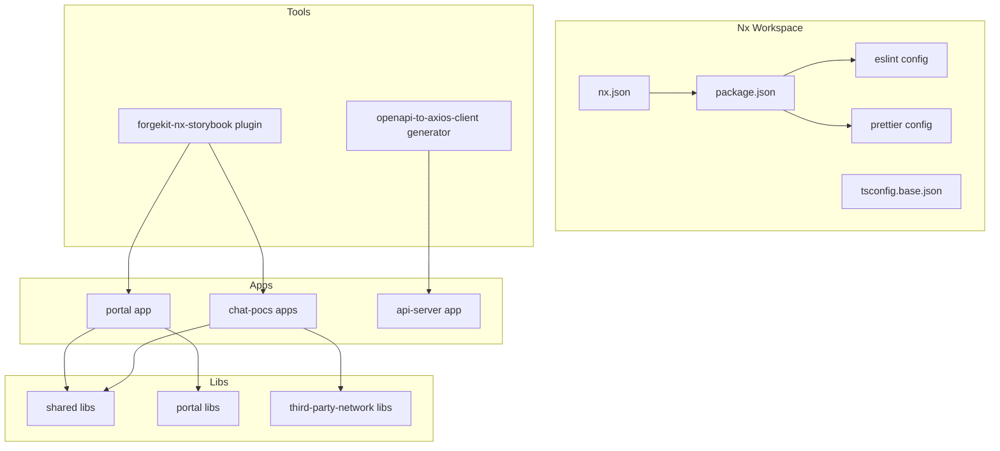
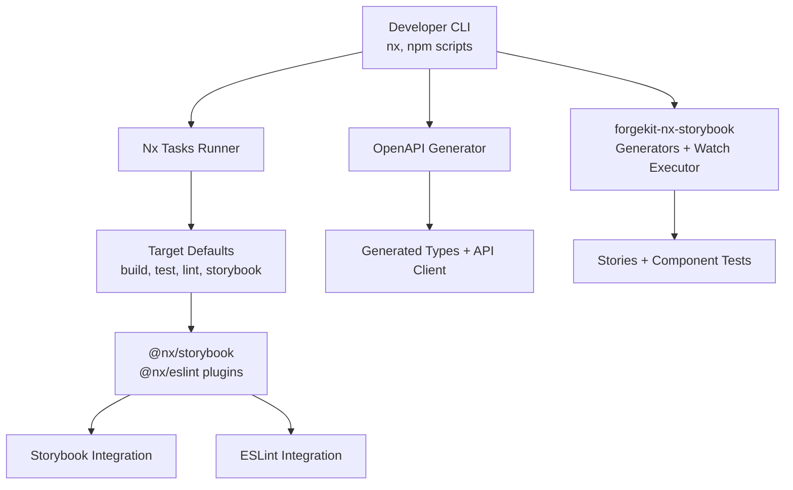
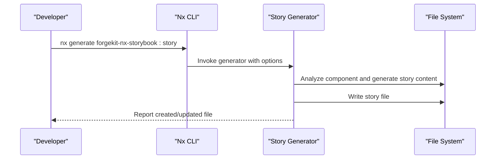
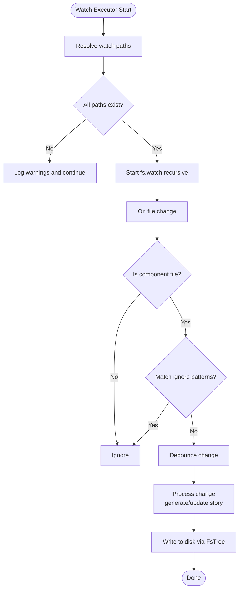
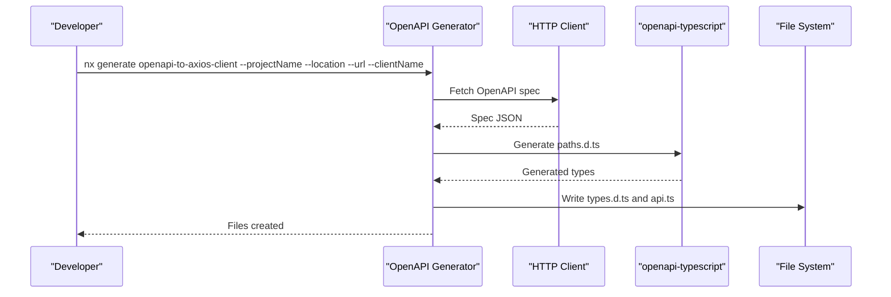
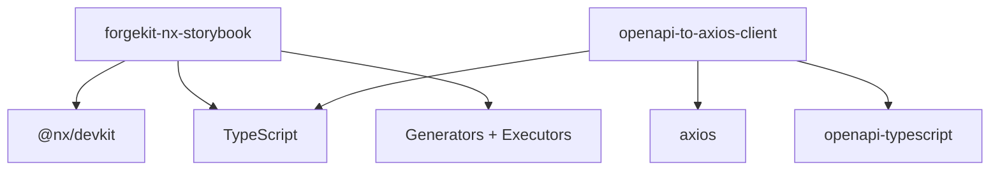

# Development Tools

<cite>
**Referenced Files in This Document**
- [nx.json](file://nx.json)
- [package.json](file://package.json)
- [tsconfig.base.json](file://tsconfig.base.json)
- [.eslintrc.json](file://.eslintrc.json)
- [.prettierrc](file://.prettierrc)
- [tools/forgekit-nx-storybook/project.json](file://tools/forgekit-nx-storybook/project.json)
- [tools/forgekit-nx-storybook/executors.json](file://tools/forgekit-nx-storybook/executors.json)
- [tools/forgekit-nx-storybook/generators.json](file://tools/forgekit-nx-storybook/generators.json)
- [tools/forgekit-nx-storybook/src/index.ts](file://tools/forgekit-nx-storybook/src/index.ts)
- [tools/forgekit-nx-storybook/src/generators/story/generator.ts](file://tools/forgekit-nx-storybook/src/generators/story/generator.ts)
- [tools/forgekit-nx-storybook/src/executors/watch/executor.ts](file://tools/forgekit-nx-storybook/src/executors/watch/executor.ts)
- [tools/generators/openapi-to-axios-client/schema.json](file://tools/generators/openapi-to-axios-client/schema.json)
- [tools/generators/openapi-to-axios-client/templates.ts](file://tools/generators/openapi-to-axios-client/templates.ts)
- [tools/generators/openapi-to-axios-client/index.ts](file://tools/generators/openapi-to-axios-client/index.ts)
- [tools/generators/openapi-to-axios-client/utils.ts](file://tools/generators/openapi-to-axios-client/utils.ts)
</cite>

## Table of Contents
1. [Introduction](#introduction)
2. [Project Structure](#project-structure)
3. [Core Components](#core-components)
4. [Architecture Overview](#architecture-overview)
5. [Detailed Component Analysis](#detailed-component-analysis)
6. [Dependency Analysis](#dependency-analysis)
7. [Performance Considerations](#performance-considerations)
8. [Troubleshooting Guide](#troubleshooting-guide)
9. [Conclusion](#conclusion)
10. [Appendices](#appendices)

## Introduction
This document explains the development tools and custom generators in the Redesign Health monorepo. It covers the Nx workspace configuration, project generation capabilities, build orchestration, and the forgekit-nx-storybook plugin for automated Storybook story generation, component testing, and accessibility auditing. It also documents the OpenAPI client generator for creating TypeScript clients from API specifications, VS Code extension recommendations, Nx Console integration, and development workflow optimization tools. Code quality tools such as ESLint and Prettier are documented alongside Storybook integration, design system maintenance, and component documentation workflows.

## Project Structure
The repository is an Nx workspace with a monorepo layout containing applications, libraries, tools, and documentation. Key areas:
- Apps: Application projects such as portal, chat PoCs, and API servers
- Libs: Shared libraries for UI, features, and utilities
- Tools: Nx plugins and custom generators under tools/
- Docs: MkDocs-based documentation and design system guides

**Diagram sources**
- [nx.json:1-149](file://nx.json#L1-L149)
- [package.json:1-267](file://package.json#L1-L267)
- [tsconfig.base.json:1-95](file://tsconfig.base.json#L1-L95)

**Section sources**
- [nx.json:1-149](file://nx.json#L1-L149)
- [package.json:1-267](file://package.json#L1-L267)
- [tsconfig.base.json:1-95](file://tsconfig.base.json#L1-L95)

## Core Components
- Nx workspace configuration defines target defaults, named inputs, plugins, and generators presets for React, Next, and Web projects.
- Scripts in package.json provide convenient commands for serving, building, testing, linting, Storybook, Chromatic, and graph generation.
- Global ESLint and Prettier configurations enforce code quality and formatting standards across the monorepo.
- forgekit-nx-storybook plugin adds generators and an executor for automated Storybook story creation and watching.
- OpenAPI client generator produces TypeScript clients and types from OpenAPI specs.

**Section sources**
- [nx.json:8-126](file://nx.json#L8-L126)
- [package.json:5-47](file://package.json#L5-L47)
- [.eslintrc.json:1-225](file://.eslintrc.json#L1-L225)
- [.prettierrc:1-9](file://.prettierrc#L1-L9)

## Architecture Overview
The development workflow integrates Nx orchestration, Nx plugins, and custom generators:
- Nx orchestrates builds, tests, linting, and Storybook builds with target defaults and caching.
- Plugins enable Storybook and ESLint integrations with standardized target names.
- forgekit-nx-storybook provides generators for stories and component tests, plus a watch executor for live updates.
- The OpenAPI generator fetches specs and generates strongly typed API clients and types.

**Diagram sources**
- [nx.json:3-72](file://nx.json#L3-L72)
- [tools/forgekit-nx-storybook/executors.json:1-10](file://tools/forgekit-nx-storybook/executors.json#L1-L10)
- [tools/forgekit-nx-storybook/generators.json:1-25](file://tools/forgekit-nx-storybook/generators.json#L1-L25)
- [tools/generators/openapi-to-axios-client/schema.json:1-30](file://tools/generators/openapi-to-axios-client/schema.json#L1-L30)

## Detailed Component Analysis

### Nx Workspace Configuration
- Target defaults define inputs and caching for build, test, lint, and Storybook targets. Inputs exclude test files, ESLint configs, Storybook files, and spec tsconfigs to optimize computation.
- Generators presets configure default styles, linters, bundlers, and unit test runners for React, Next, and Web projects.
- Plugins register Storybook and ESLint integrations with standardized target names.
- Named inputs segment default and production inputs to improve cache hit rates.

**Section sources**
- [nx.json:8-72](file://nx.json#L8-L72)
- [nx.json:73-107](file://nx.json#L73-L107)
- [nx.json:109-126](file://nx.json#L109-L126)
- [nx.json:127-146](file://nx.json#L127-L146)

### forgekit-nx-storybook Plugin
The plugin provides:
- Generators:
  - init: initialize the plugin in the workspace
  - story: generate a Storybook story with optional interaction tests for a React component
  - stories: bulk-generate stories for all components in a project
  - component-test: generate a co-located Playwright component test
- Executor:
  - watch: watch component directories and auto-generate/update stories with debouncing and ignore patterns

Key behaviors:
- The story generator resolves component paths, analyzes props and dependencies, infers story titles, and writes stories with dynamic story sets (Default, Sizes, Variants, ColorPalettes, Disabled, RendersCorrectly, ClickInteraction, KeyboardNavigation).
- The watch executor monitors directories recursively, debounces rapid changes, and re-runs story generation on file changes.

**Diagram sources**
- [tools/forgekit-nx-storybook/src/generators/story/generator.ts:20-143](file://tools/forgekit-nx-storybook/src/generators/story/generator.ts#L20-L143)

**Diagram sources**
- [tools/forgekit-nx-storybook/src/executors/watch/executor.ts:21-133](file://tools/forgekit-nx-storybook/src/executors/watch/executor.ts#L21-L133)

Implementation highlights:
- Project definition and build/test targets for the plugin
- Executable registration and generator metadata
- Story generation logic including analysis, content generation, and formatting
- Watch executor with debouncing, ignore patterns, and recursive directory monitoring

**Section sources**
- [tools/forgekit-nx-storybook/project.json:1-39](file://tools/forgekit-nx-storybook/project.json#L1-L39)
- [tools/forgekit-nx-storybook/executors.json:1-10](file://tools/forgekit-nx-storybook/executors.json#L1-L10)
- [tools/forgekit-nx-storybook/generators.json:1-25](file://tools/forgekit-nx-storybook/generators.json#L1-L25)
- [tools/forgekit-nx-storybook/src/index.ts:1-31](file://tools/forgekit-nx-storybook/src/index.ts#L1-L31)
- [tools/forgekit-nx-storybook/src/generators/story/generator.ts:1-208](file://tools/forgekit-nx-storybook/src/generators/story/generator.ts#L1-L208)
- [tools/forgekit-nx-storybook/src/executors/watch/executor.ts:1-203](file://tools/forgekit-nx-storybook/src/executors/watch/executor.ts#L1-L203)

### OpenAPI Client Generator
The generator fetches an OpenAPI specification and produces:
- Strongly typed paths via openapi-typescript
- Type-safe client methods and argument types derived from endpoints and schemas
- A class-based API client with Axios integration

Workflow:
- Reads schema from a URL, resolves project output location, and runs openapi-typescript to generate paths types.
- Generates types and API client code using templates.
- Post-processes generated types to normalize optional parameters.

**Diagram sources**
- [tools/generators/openapi-to-axios-client/index.ts:7-31](file://tools/generators/openapi-to-axios-client/index.ts#L7-L31)
- [tools/generators/openapi-to-axios-client/templates.ts:19-222](file://tools/generators/openapi-to-axios-client/templates.ts#L19-L222)
- [tools/generators/openapi-to-axios-client/utils.ts:3-21](file://tools/generators/openapi-to-axios-client/utils.ts#L3-L21)

**Section sources**
- [tools/generators/openapi-to-axios-client/schema.json:1-30](file://tools/generators/openapi-to-axios-client/schema.json#L1-L30)
- [tools/generators/openapi-to-axios-client/templates.ts:1-223](file://tools/generators/openapi-to-axios-client/templates.ts#L1-L223)
- [tools/generators/openapi-to-axios-client/index.ts:1-32](file://tools/generators/openapi-to-axios-client/index.ts#L1-L32)
- [tools/generators/openapi-to-axios-client/utils.ts:1-21](file://tools/generators/openapi-to-axios-client/utils.ts#L1-L21)

### Build Orchestration and Scripts
- Nx tasks runner options are configured at the root.
- Target defaults for build, test, lint, and Storybook builds define inputs and caching.
- Scripts in package.json provide shortcuts for serving, building, testing, linting, Storybook, Chromatic, and dependency graph visualization.

**Section sources**
- [nx.json:3-72](file://nx.json#L3-L72)
- [package.json:5-47](file://package.json#L5-L47)

### Code Quality: ESLint and Prettier
- ESLint configuration extends recommended rulesets for TypeScript, React, JSX runtime, React Hooks, Storybook, JSX accessibility, and TanStack Query. It includes import sorting, unicorn rules, and module boundary enforcement.
- Prettier configuration enforces consistent formatting across the monorepo.

**Section sources**
- [.eslintrc.json:1-225](file://.eslintrc.json#L1-L225)
- [.prettierrc:1-9](file://.prettierrc#L1-L9)

### Storybook Integration and Design System Maintenance
- Nx plugins integrate Storybook with standardized target names for serving, building, testing, and static builds.
- Target defaults include Storybook inputs to ensure deterministic builds.
- Scripts provide commands to start Storybook and build Storybook for specific projects.

**Section sources**
- [nx.json:109-126](file://nx.json#L109-L126)
- [nx.json:37-54](file://nx.json#L37-L54)
- [package.json:35-42](file://package.json#L35-L42)

### VS Code Extensions and Nx Console
- Recommended extensions for improved developer experience include those that support Nx, TypeScript, ESLint, Prettier, and Storybook.
- Nx Console integrates with the IDE to run Nx commands and generators.

[No sources needed since this section provides general guidance]

## Dependency Analysis
Forgekit-nx-storybook and the OpenAPI generator are Nx plugins and generators integrated into the workspace. They depend on Nx DevKit, TypeScript, and related tooling.

**Diagram sources**
- [tools/forgekit-nx-storybook/src/index.ts:1-31](file://tools/forgekit-nx-storybook/src/index.ts#L1-L31)
- [tools/generators/openapi-to-axios-client/index.ts:1-32](file://tools/generators/openapi-to-axios-client/index.ts#L1-L32)

**Section sources**
- [tools/forgekit-nx-storybook/src/index.ts:1-31](file://tools/forgekit-nx-storybook/src/index.ts#L1-L31)
- [tools/generators/openapi-to-axios-client/index.ts:1-32](file://tools/generators/openapi-to-axios-client/index.ts#L1-L32)

## Performance Considerations
- Use Nx target defaults and named inputs to maximize caching and avoid unnecessary rebuilds.
- Prefer incremental builds and test targets with caching enabled.
- Debounced watch mode reduces redundant work during rapid edits.
- Limit Storybook inputs to relevant files to keep builds fast.

[No sources needed since this section provides general guidance]

## Troubleshooting Guide
- Story generation fails due to missing component file: ensure the path is correct and points to a .tsx/.ts file.
- Watch executor exits immediately: verify watch paths exist and are accessible.
- ESLint errors on module boundaries: review depConstraints and adjust imports accordingly.
- Formatting inconsistencies: run format scripts and ensure pre-commit hooks are installed.

**Section sources**
- [tools/forgekit-nx-storybook/src/generators/story/generator.ts:32-60](file://tools/forgekit-nx-storybook/src/generators/story/generator.ts#L32-L60)
- [tools/forgekit-nx-storybook/src/executors/watch/executor.ts:36-41](file://tools/forgekit-nx-storybook/src/executors/watch/executor.ts#L36-L41)
- [.eslintrc.json:101-132](file://.eslintrc.json#L101-L132)
- [package.json:26-30](file://package.json#L26-L30)

## Conclusion
The Redesign Health monorepo leverages Nx for robust orchestration, forgekit-nx-storybook for automated Storybook story generation and component testing, and a custom OpenAPI client generator for type-safe API consumption. Combined with ESLint and Prettier, these tools streamline development, improve code quality, and accelerate component documentation and design system maintenance.

[No sources needed since this section summarizes without analyzing specific files]

## Appendices

### Appendix A: Nx Console Integration
- Install Nx Console in VS Code to visualize and run Nx tasks and generators.
- Configure Nx Console to connect to the workspace for seamless command execution.

[No sources needed since this section provides general guidance]

### Appendix B: Path Aliases and Module Resolution
- tsconfig.base.json defines path aliases for shared and scoped libraries to simplify imports across the monorepo.

**Section sources**
- [tsconfig.base.json:20-91](file://tsconfig.base.json#L20-L91)