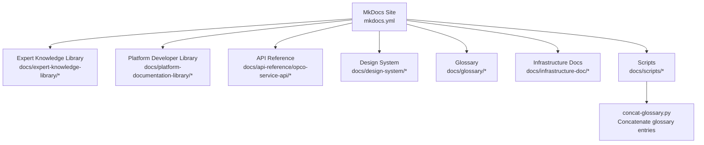
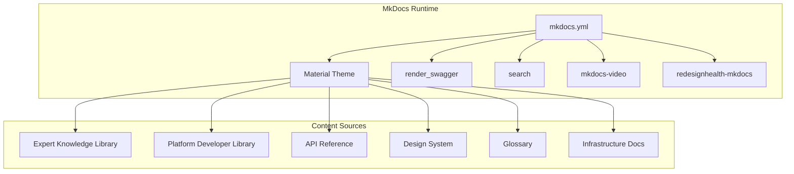
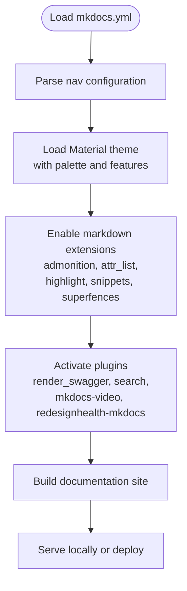
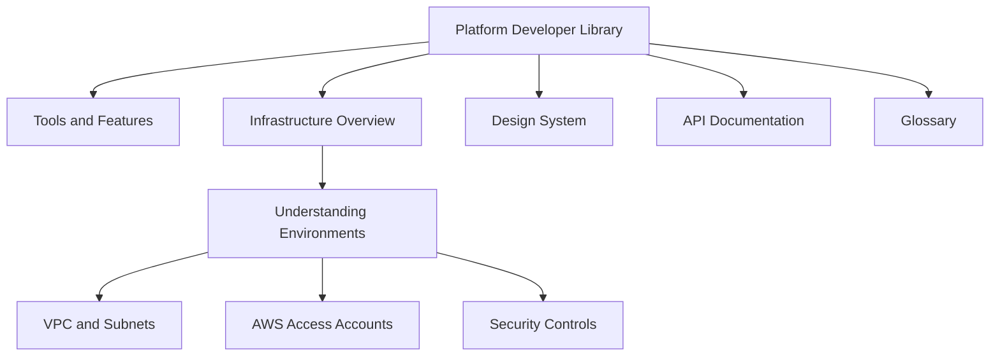
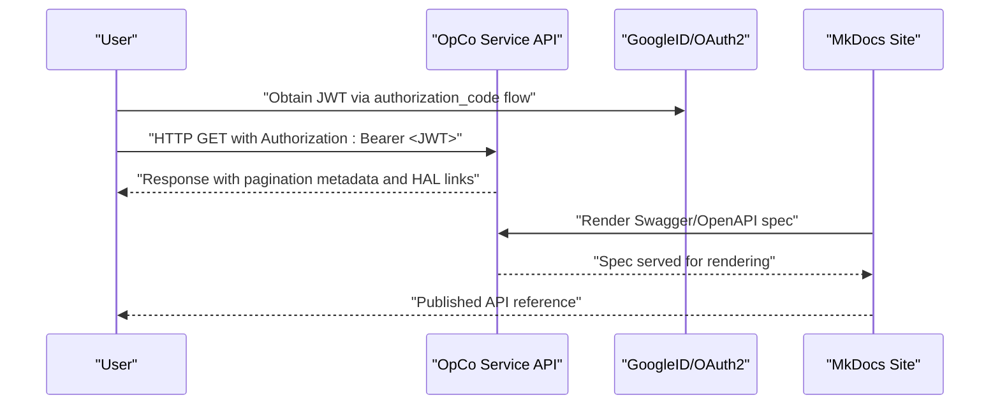
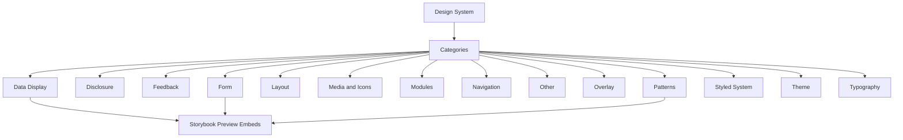
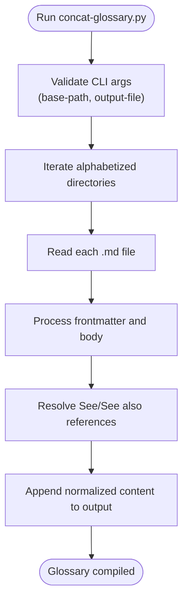
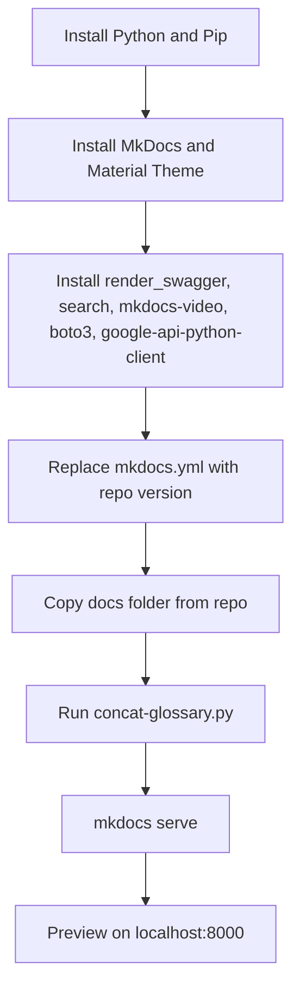
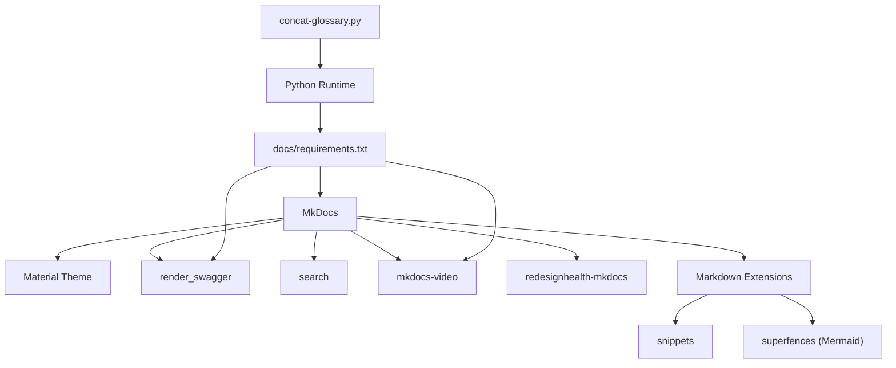

# Documentation System

<cite>
**Referenced Files in This Document**
- [mkdocs.yml](file://mkdocs.yml)
- [docs/index.md](file://docs/index.md)
- [docs/readme.md](file://docs/readme.md)
- [docs/requirements.txt](file://docs/requirements.txt)
- [docs/scripts/concat-glossary.py](file://docs/scripts/concat-glossary.py)
- [docs/api-reference/opco-service-api/index.md](file://docs/api-reference/opco-service-api/index.md)
- [docs/design-system/overview.md](file://docs/design-system/overview.md)
- [docs/design-system/data-display/badge.md](file://docs/design-system/data-display/badge.md)
- [docs/design-system/form/button.md](file://docs/design-system/form/button.md)
- [docs/expert-knowledge-library/index.md](file://docs/expert-knowledge-library/index.md)
- [docs/platform-documentation-library/platform-intro.md](file://docs/platform-documentation-library/platform-intro.md)
- [docs/platform-documentation-library/understanding-the-environment.md](file://docs/platform-documentation-library/understanding-the-environment.md)
</cite>

## Table of Contents
1. [Introduction](#introduction)
2. [Project Structure](#project-structure)
3. [Core Components](#core-components)
4. [Architecture Overview](#architecture-overview)
5. [Detailed Component Analysis](#detailed-component-analysis)
6. [Dependency Analysis](#dependency-analysis)
7. [Performance Considerations](#performance-considerations)
8. [Troubleshooting Guide](#troubleshooting-guide)
9. [Conclusion](#conclusion)
10. [Appendices](#appendices)

## Introduction
This document describes the documentation system for the Redesign Health monorepo. It covers the MkDocs configuration, site structure, and content organization strategy. It explains how API reference documentation is generated from OpenAPI specifications, how the design system documentation integrates with Storybook, and how the expert knowledge library is managed. It also documents the documentation workflow, content creation guidelines, maintenance procedures, and publishing considerations. Finally, it outlines the relationship between internal documentation and external knowledge bases, and provides contribution and review guidelines.

## Project Structure
The documentation system centers on MkDocs with a Material theme and several plugins. The repository organizes content under a dedicated docs directory, with separate areas for:
- Expert Knowledge Library: curated guidance and templates for company foundations, go-to-market, team construction, MVP product build, fundraising, and community resources.
- Platform Developer Library: developer-focused content covering platform components, infrastructure, design system, APIs, and glossary.
- API Reference: generated and hand-authored API documentation, including authentication, pagination, field expansion, and Swagger integration.
- Design System: component documentation with live Storybook previews and usage examples.
- Scripts and Utilities: automation for glossary concatenation and build-time tasks.

**Diagram sources**
- [mkdocs.yml](file://mkdocs.yml)
- [docs/index.md](file://docs/index.md)

**Section sources**
- [mkdocs.yml](file://mkdocs.yml)
- [docs/index.md](file://docs/index.md)

## Core Components
- MkDocs configuration and theme: defines navigation, plugins, and rendering features.
- Expert Knowledge Library: structured content for OpCo founding teams, organized by domain and topic.
- Platform Developer Library: developer-centric documentation for platform tools, infrastructure, design system, and APIs.
- API Reference: OpenAPI-driven API documentation with authentication, pagination, and field expansion guidance.
- Design System: component documentation with Storybook integration and live previews.
- Glossary: automated concatenation of glossary entries with cross-reference resolution.
- Scripts: build-time utilities to prepare content for publication.

**Section sources**
- [mkdocs.yml](file://mkdocs.yml)
- [docs/readme.md](file://docs/readme.md)
- [docs/requirements.txt](file://docs/requirements.txt)
- [docs/scripts/concat-glossary.py](file://docs/scripts/concat-glossary.py)

## Architecture Overview
The documentation architecture is driven by MkDocs and Material theme, with plugins enabling Swagger rendering, search, and custom extensions. The navigation structure separates Expert Knowledge Library and Platform Developer Library, reflecting distinct audiences and content domains. Plugins include:
- render_swagger: renders Swagger/OpenAPI specifications.
- search: enables site-wide search.
- redesignhealth-mkdocs: custom plugin for the Knowledge Hub.
- mkdocs-video: embeds videos.

**Diagram sources**
- [mkdocs.yml](file://mkdocs.yml)

**Section sources**
- [mkdocs.yml](file://mkdocs.yml)

## Detailed Component Analysis

### MkDocs Configuration and Navigation
- Site identity and URLs: site name and directory URL settings configure the site branding and URL structure.
- Navigation: hierarchical navigation groups Expert Knowledge Library and Platform Developer Library, with nested topics and subtopics.
- Theme: Material theme with navigation tabs and sections; icons for admonitions; primary color customization.
- Markdown extensions: admonitions, attribute lists, syntax highlighting, snippet inclusion, and Mermaid fenced code blocks.
- Plugins: Swagger rendering, search, video embedding, and the custom redesignhealth-mkdocs plugin.

**Diagram sources**
- [mkdocs.yml](file://mkdocs.yml)

**Section sources**
- [mkdocs.yml](file://mkdocs.yml)

### Expert Knowledge Library Organization
- Purpose: curate evergreen resources for OpCo founding teams to reduce risk and accelerate decision-making.
- Structure: organized by domain (Company Foundations, Go To Market, Team Construction and Management, MVP Product Build, Fundraising, CEO and OpCo Community) with subtopics and templates.
- Content types: guides, checklists, templates, videos, and curated third-party resources.

```mermaid
graph TB
Root["Expert Knowledge Library"] --> CF["Company Foundations"]
Root --> GTM["Go To Market"]
Root --> TCM["Team Construction and Management"]
Root --> MVP["MVP Product Build"]
Root --> FR["Fundraising"]
Root --> CEOP["CEO and OpCo Community"]
CF --> CG["Corporate Governance"]
CF --> TC["Tax Considerations"]
CF --> LC["Legal Considerations"]
CF --> PS["Privacy and Security"]
CF --> AM["Advertising and Marketing"]
GTM --> LMKJ["Launching Your Market Engagement Journey"]
GTM --> GTMS["Crafting and Executing Your Go-to-Market Strategy"]
GTM --> MSO["MSO/PC Resources"]
TCM --> CYFT["Constructing Your Founding Team"]
TCM --> GYTAO["Growing Your Team and Operations"]
TCM --> JPT["Job Post Templates and At-Home Exercises"]
MVP --> BYPJ["Beginning Your Product Journey"]
MVP --> BB["Building Blocks of Your Product"]
FR --> BYFJ["Beginning Your Fundraising Journey"]
FR --> CYFSC["Crafting Your Financial Strategy and Controls"]
CEOP --> CSV["CEO Summit 2023 Videos"]
CEOP --> CCR["CEO Community Resources"]
```

**Diagram sources**
- [mkdocs.yml](file://mkdocs.yml)
- [docs/expert-knowledge-library/index.md](file://docs/expert-knowledge-library/index.md)

**Section sources**
- [mkdocs.yml](file://mkdocs.yml)
- [docs/expert-knowledge-library/index.md](file://docs/expert-knowledge-library/index.md)

### Platform Developer Library and Infrastructure Docs
- Developer Library overview: introduces platform components, tools, infrastructure, design system, APIs, and glossary.
- Understanding Environments: describes VPC, environments (Dev/Staging/Prod/Core), AWS organizational units, and security controls.

**Diagram sources**
- [docs/platform-documentation-library/platform-intro.md](file://docs/platform-documentation-library/platform-intro.md)
- [docs/platform-documentation-library/understanding-the-environment.md](file://docs/platform-documentation-library/understanding-the-environment.md)

**Section sources**
- [docs/platform-documentation-library/platform-intro.md](file://docs/platform-documentation-library/platform-intro.md)
- [docs/platform-documentation-library/understanding-the-environment.md](file://docs/platform-documentation-library/understanding-the-environment.md)

### API Reference Generation and Content
- Authentication: JWT via GoogleID using OAuth2 authorization code flow; Authorization header usage.
- Pagination: query parameters page and size; HAL links for navigation.
- Field Expansion: expand child entities via query parameters; multiple expansions supported.
- Swagger integration: plugin-enabled rendering of OpenAPI specifications.

**Diagram sources**
- [docs/api-reference/opco-service-api/index.md](file://docs/api-reference/opco-service-api/index.md)
- [mkdocs.yml](file://mkdocs.yml)

**Section sources**
- [docs/api-reference/opco-service-api/index.md](file://docs/api-reference/opco-service-api/index.md)
- [mkdocs.yml](file://mkdocs.yml)

### Design System Documentation and Storybook Integration
- Overview: categorized components (Data Display, Disclosure, Feedback, Form, Layout, Media and Icons, Modules, Navigation, Other, Overlay, Patterns, Styled System, Theme, Typography).
- Storybook integration: component documentation includes embedded Storybook iframes for live previews and interactive examples.
- Component examples: import statements, usage patterns, variants, sizes, colors, icons, loading states, accessibility notes, and composition guidance.

**Diagram sources**
- [docs/design-system/overview.md](file://docs/design-system/overview.md)
- [docs/design-system/data-display/badge.md](file://docs/design-system/data-display/badge.md)
- [docs/design-system/form/button.md](file://docs/design-system/form/button.md)

**Section sources**
- [docs/design-system/overview.md](file://docs/design-system/overview.md)
- [docs/design-system/data-display/badge.md](file://docs/design-system/data-display/badge.md)
- [docs/design-system/form/button.md](file://docs/design-system/form/button.md)

### Glossary Management and Automation
- Purpose: consolidate glossary entries across alphabetized sections and resolve cross-references.
- Script: concatenates glossary entries, normalizes headings, and builds See/See also links; writes a single output file for the glossary.

**Diagram sources**
- [docs/scripts/concat-glossary.py](file://docs/scripts/concat-glossary.py)

**Section sources**
- [docs/scripts/concat-glossary.py](file://docs/scripts/concat-glossary.py)

### Content Creation Guidelines and Maintenance Procedures
- Local build and preview: install Python, pip, MkDocs, Material theme, and plugins; replace mkdocs.yml with the repository version; copy docs; run the glossary concatenation script; serve locally.
- Plugin dependencies: explicit requirements for MkDocs, Material theme, Swagger renderer, video plugin, and supporting libraries.
- Navigation and content placement: ensure new content aligns with existing nav structure; use appropriate frontmatter for cards and ordering.

**Diagram sources**
- [docs/readme.md](file://docs/readme.md)
- [docs/requirements.txt](file://docs/requirements.txt)

**Section sources**
- [docs/readme.md](file://docs/readme.md)
- [docs/requirements.txt](file://docs/requirements.txt)

### Publishing and Integration with External Sites
- Internal site: Knowledge Hub built with MkDocs Material and plugins.
- External integration: the site serves as an internal hub powering external-facing Library and Developer Library experiences; platform components and APIs are documented for external consumption.
- Video and media: mkdocs-video plugin supports embedding videos within documentation.

**Section sources**
- [docs/index.md](file://docs/index.md)
- [mkdocs.yml](file://mkdocs.yml)

## Dependency Analysis
The documentation system depends on MkDocs and its ecosystem, with specific plugin and theme requirements. The custom redesignhealth-mkdocs plugin extends functionality for the Knowledge Hub. The glossary script depends on Python standard libraries and CLI arguments.

**Diagram sources**
- [mkdocs.yml](file://mkdocs.yml)
- [docs/requirements.txt](file://docs/requirements.txt)
- [docs/scripts/concat-glossary.py](file://docs/scripts/concat-glossary.py)

**Section sources**
- [mkdocs.yml](file://mkdocs.yml)
- [docs/requirements.txt](file://docs/requirements.txt)
- [docs/scripts/concat-glossary.py](file://docs/scripts/concat-glossary.py)

## Performance Considerations
- Minimize heavy assets: avoid large images or videos in frequently accessed pages; use the video plugin selectively.
- Optimize plugin usage: keep only necessary plugins enabled to reduce build time.
- Efficient navigation: maintain a concise nav tree to improve site load and usability.
- Preprocessing: run the glossary concatenation script during CI/CD to avoid runtime overhead.

## Troubleshooting Guide
- Build failures due to missing dependencies: ensure all packages in requirements.txt are installed.
- Navigation errors: verify nav entries match actual file paths and filenames.
- Swagger rendering issues: confirm OpenAPI specs are accessible and properly formatted.
- Video embedding problems: validate video URLs and plugin configuration.
- Glossary inconsistencies: rerun concat-glossary.py with correct base path and output file arguments.

**Section sources**
- [docs/requirements.txt](file://docs/requirements.txt)
- [docs/scripts/concat-glossary.py](file://docs/scripts/concat-glossary.py)
- [mkdocs.yml](file://mkdocs.yml)

## Conclusion
The Redesign Health documentation system leverages MkDocs with a Material theme and specialized plugins to deliver a structured, searchable, and extensible Knowledge Hub. Content is organized into Expert Knowledge Library and Platform Developer Library, with robust API reference generation, design system documentation integrated with Storybook, and automated glossary management. The system supports both internal and external knowledge delivery, with clear workflows for building, reviewing, and publishing documentation.

## Appendices

### Navigation Structure and Search
- Navigation groups: Expert Knowledge Library and Platform Developer Library with nested topics.
- Search: enabled plugin for site-wide indexing and discovery.
- Frontmatter: cards and ordering metadata for enhanced presentation.

**Section sources**
- [mkdocs.yml](file://mkdocs.yml)

### Contributing, Review, and Publishing
- Contribution guidelines: follow content creation steps, align with nav structure, and use appropriate frontmatter.
- Review process: validate builds locally, ensure plugin compatibility, and confirm glossary updates.
- Publishing: deploy the built site according to platform standards; ensure external integrations remain functional.

**Section sources**
- [docs/readme.md](file://docs/readme.md)
- [mkdocs.yml](file://mkdocs.yml)