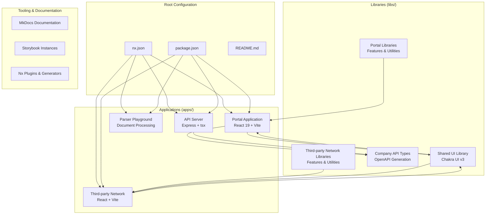
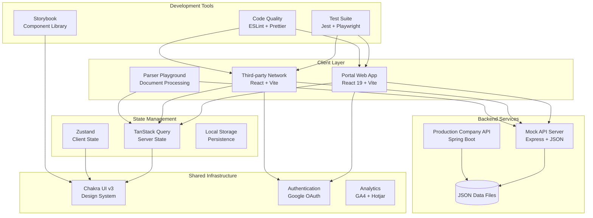
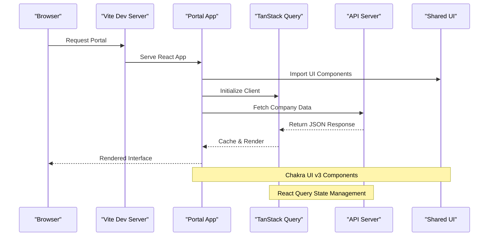
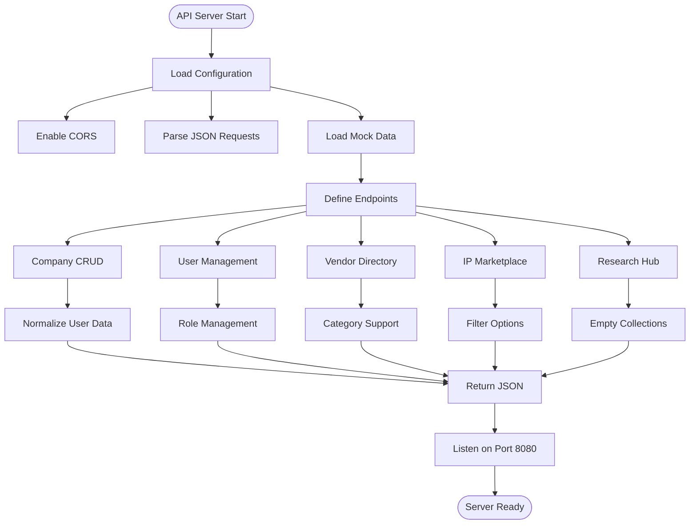
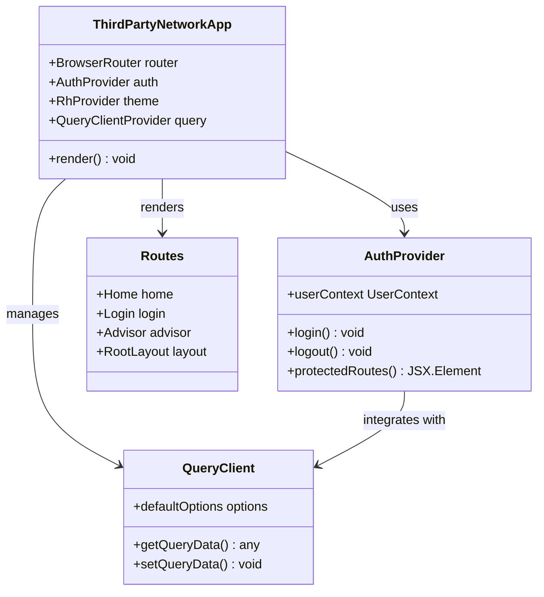
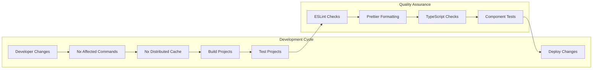

# Applications Overview

<cite>
**Referenced Files in This Document**
- [README.md](file://README.md)
- [package.json](file://package.json)
- [nx.json](file://nx.json)
- [apps/docs/index.mdx](file://apps/docs/index.mdx)
- [apps/docs/getting-started.mdx](file://apps/docs/getting-started.mdx)
- [apps/portal/project.json](file://apps/portal/project.json)
- [apps/portal/src/main.tsx](file://apps/portal/src/main.tsx)
- [apps/api-server/project.json](file://apps/api-server/project.json)
- [apps/api-server/src/main.ts](file://apps/api-server/src/main.ts)
- [apps/third-party-network/project.json](file://apps/third-party-network/project.json)
- [apps/third-party-network/src/main.tsx](file://apps/third-party-network/src/main.tsx)
- [apps/parser-playground/project.json](file://apps/parser-playground/project.json)
- [apps/parser-playground/src/main.tsx](file://apps/parser-playground/src/main.tsx)
- [libs/shared/ui/project.json](file://libs/shared/ui/project.json)
- [libs/company-api-types/project.json](file://libs/company-api-types/project.json)
</cite>

## Table of Contents
1. [Introduction](#introduction)
2. [Project Structure](#project-structure)
3. [Core Applications](#core-applications)
4. [Architecture Overview](#architecture-overview)
5. [Application Details](#application-details)
6. [Development Workflow](#development-workflow)
7. [Technology Stack](#technology-stack)
8. [Conclusion](#conclusion)

## Introduction

The Redesign Health Nx monorepo is a comprehensive healthcare-focused platform that serves as the foundation for company building, advisor networking, and internal tooling. Built on Nx 22, this monorepo architecture enables efficient development, testing, and deployment of multiple applications while maintaining a unified design system and shared infrastructure.

The platform consists of four primary applications: the main Portal application, the Third-party Network application, a Parser Playground for document processing, and supporting libraries that provide shared UI components and type definitions. This architecture promotes code reuse, consistent development practices, and streamlined maintenance across the entire platform ecosystem.

## Project Structure

The monorepo follows a well-organized structure that separates concerns while enabling seamless collaboration between applications and shared libraries:

**Diagram sources**
- [nx.json:1-149](file://nx.json#L1-L149)
- [package.json:1-271](file://package.json#L1-L271)
- [README.md:41-70](file://README.md#L41-L70)

**Section sources**
- [README.md:41-70](file://README.md#L41-L70)
- [nx.json:108-109](file://nx.json#L108-L109)

## Core Applications

The monorepo contains four primary applications, each serving distinct purposes within the Redesign Health ecosystem:

### Portal Application
The main application for managing companies, CEO directories, IP marketplace, and knowledge management. Built with React 19 + Vite and react-router v6, featuring advanced state management through TanStack Query and a comprehensive feature set for healthcare company operations.

### Third-party Network Application
Advisor network application for connecting consultants and subject-matter experts with healthcare organizations. Shares data access patterns with the portal while providing specialized functionality for advisor management and networking.

### API Server
Express-based mock server providing REST endpoints for company data, authentication, and business logic. Designed for local development and testing, simulating the production Company API with realistic data structures and business rules.

### Parser Playground
Interactive document processing application demonstrating advanced parsing capabilities for healthcare-related documents, showcasing the platform's document handling and analysis features.

**Section sources**
- [apps/docs/index.mdx:10-25](file://apps/docs/index.mdx#L10-L25)
- [apps/portal/project.json:1-138](file://apps/portal/project.json#L1-L138)
- [apps/third-party-network/project.json:1-78](file://apps/third-party-network/project.json#L1-L78)
- [apps/api-server/project.json:1-85](file://apps/api-server/project.json#L1-L85)
- [apps/parser-playground/project.json:1-63](file://apps/parser-playground/project.json#L1-L63)

## Architecture Overview

The platform employs a modern micro-frontend architecture with centralized state management and shared component libraries:

**Diagram sources**
- [apps/portal/src/main.tsx:1-41](file://apps/portal/src/main.tsx#L1-L41)
- [apps/third-party-network/src/main.tsx:1-40](file://apps/third-party-network/src/main.tsx#L1-L40)
- [apps/api-server/src/main.ts:1-485](file://apps/api-server/src/main.ts#L1-L485)
- [libs/shared/ui/project.json:1-92](file://libs/shared/ui/project.json#L1-L92)

**Section sources**
- [apps/docs/getting-started.mdx:63-73](file://apps/docs/getting-started.mdx#L63-L73)
- [README.md:28-40](file://README.md#L28-L40)

## Application Details

### Portal Application Architecture

The Portal application serves as the central hub for healthcare company management, implementing a sophisticated client-side architecture:

**Diagram sources**
- [apps/portal/src/main.tsx:30-41](file://apps/portal/src/main.tsx#L30-L41)
- [apps/portal/project.json:33-50](file://apps/portal/project.json#L33-L50)

Key architectural components include:
- **State Management**: TanStack Query for server state caching and synchronization
- **Authentication**: Google OAuth provider integration
- **Analytics**: React GA4 and Hotjar for user behavior tracking
- **Component System**: Chakra UI v3 with comprehensive design system
- **Routing**: React Router v6 for navigation management

**Section sources**
- [apps/portal/src/main.tsx:1-41](file://apps/portal/src/main.tsx#L1-L41)
- [apps/portal/project.json:7-138](file://apps/portal/project.json#L7-L138)

### API Server Implementation

The Express-based mock server provides comprehensive REST API functionality for development and testing:

**Diagram sources**
- [apps/api-server/src/main.ts:66-485](file://apps/api-server/src/main.ts#L66-L485)
- [apps/api-server/project.json:65-82](file://apps/api-server/project.json#L65-L82)

The API server implements comprehensive endpoints for:
- **Company Management**: CRUD operations with pagination support
- **User Authentication**: Role-based access control simulation
- **Vendor Directory**: Hierarchical category structure
- **Intellectual Property**: Marketplace with filtering capabilities
- **Research Hub**: Content management endpoints
- **Consent Management**: Terms and conditions tracking

**Section sources**
- [apps/api-server/src/main.ts:1-485](file://apps/api-server/src/main.ts#L1-L485)
- [apps/api-server/project.json:1-85](file://apps/api-server/project.json#L1-L85)

### Third-party Network Application

The advisor network application provides specialized functionality for healthcare professional connections:

**Diagram sources**
- [apps/third-party-network/src/main.tsx:15-40](file://apps/third-party-network/src/main.tsx#L15-L40)
- [apps/third-party-network/project.json:27-53](file://apps/third-party-network/project.json#L27-L53)

**Section sources**
- [apps/third-party-network/src/main.tsx:1-40](file://apps/third-party-network/src/main.tsx#L1-L40)
- [apps/third-party-network/project.json:1-78](file://apps/third-party-network/project.json#L1-L78)

### Parser Playground Application

The interactive document processing application demonstrates advanced parsing capabilities:

**Section sources**
- [apps/parser-playground/src/main.tsx:1-34](file://apps/parser-playground/src/main.tsx#L1-L34)
- [apps/parser-playground/project.json:1-63](file://apps/parser-playground/project.json#L1-L63)

## Development Workflow

The monorepo implements a comprehensive development workflow leveraging Nx's distributed caching and affected command system:

**Diagram sources**
- [nx.json:8-72](file://nx.json#L8-L72)
- [package.json:15-34](file://package.json#L15-L34)

Key development features include:
- **Affected Commands**: Automatic detection of changed projects for optimized builds
- **Distributed Caching**: Nx Cloud integration for accelerated builds
- **Multi-project Testing**: Jest and Vitest integration across all applications
- **Component Storytelling**: Automated Storybook generation and testing
- **Visual Regression**: Chromatic integration for component testing

**Section sources**
- [nx.json:1-149](file://nx.json#L1-L149)
- [package.json:5-52](file://package.json#L5-L52)

## Technology Stack

The platform leverages cutting-edge technologies across all layers:

### Frontend Technologies
- **React 19**: Latest React features with concurrent rendering
- **Vite**: Lightning-fast build tool and development server
- **Chakra UI v3**: Comprehensive design system with improved component APIs
- **TanStack Query**: Advanced state management and caching
- **TypeScript 5**: Enhanced type safety and developer experience

### Backend Technologies
- **Express**: Lightweight and flexible API server
- **Spring Boot**: Production-ready backend service
- **Java 17**: Modern JVM runtime with enhanced performance

### Development Tools
- **Nx 22**: Intelligent project management and orchestration
- **Jest/Vitest**: Comprehensive testing framework
- **Playwright**: End-to-end testing capabilities
- **Storybook**: Component development and documentation
- **Chromatic**: Visual regression testing

### Infrastructure
- **Docker**: Containerized development and deployment
- **Nx Cloud**: Distributed caching and CI optimization
- **GitHub Actions**: Automated testing and deployment pipelines

**Section sources**
- [README.md:28-40](file://README.md#L28-L40)
- [apps/docs/index.mdx:27-40](file://apps/docs/index.mdx#L27-L40)

## Conclusion

The Redesign Health Nx monorepo represents a sophisticated, scalable platform architecture designed for healthcare innovation. Through its modular design, comprehensive shared libraries, and modern development practices, the platform enables rapid iteration while maintaining code quality and consistency across all applications.

The architecture successfully balances flexibility with structure, allowing teams to develop specialized features while leveraging shared infrastructure and design systems. The combination of Nx's intelligent project management, comprehensive testing suites, and automated tooling creates an efficient development environment that scales with the organization's growth.

This applications overview provides a foundation for understanding the platform's structure and capabilities, enabling developers to contribute effectively and stakeholders to appreciate the technical sophistication underlying the Redesign Health ecosystem.