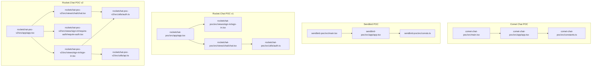
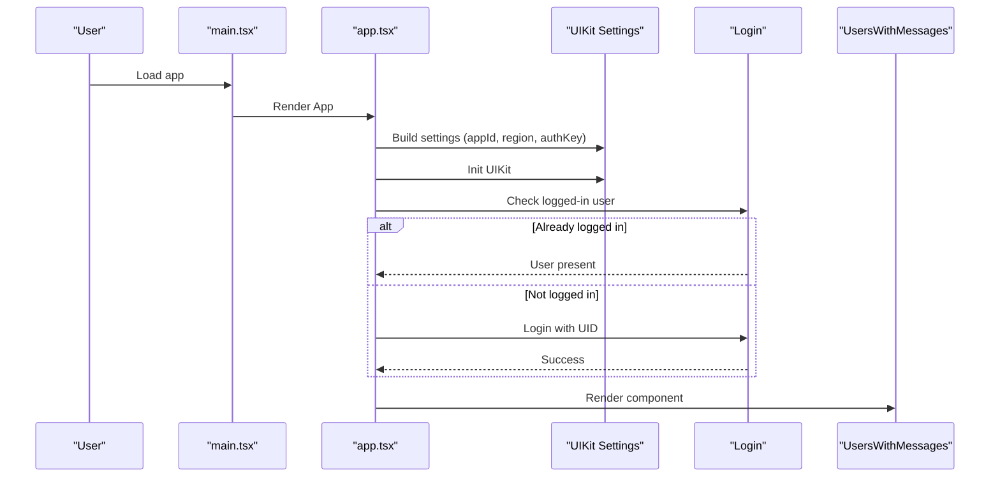
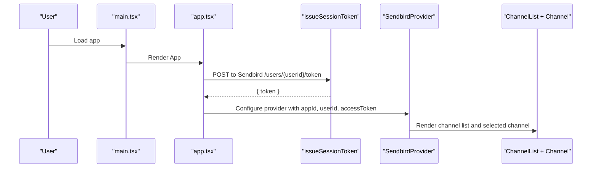
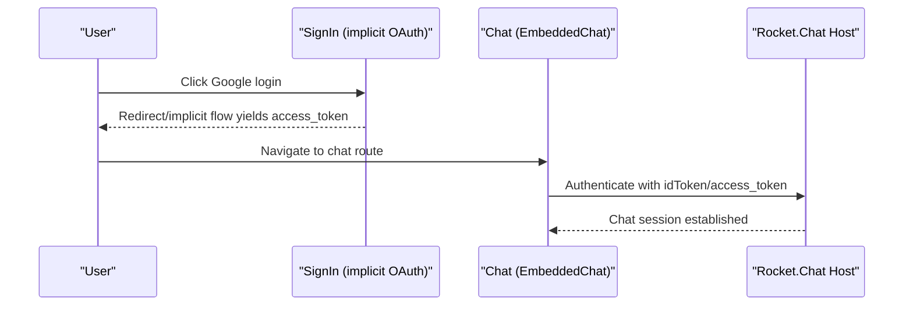
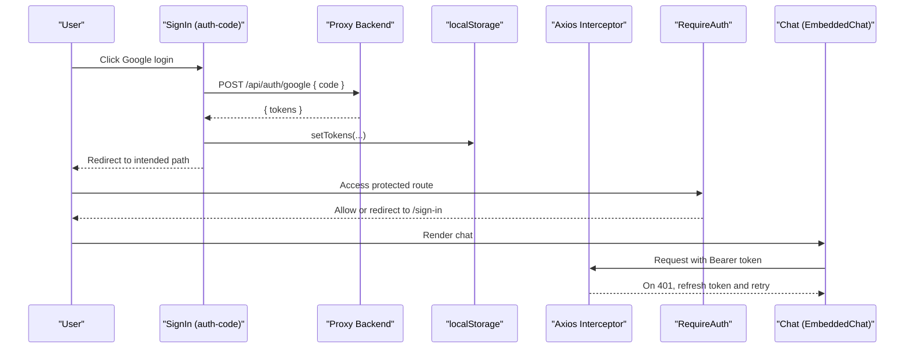
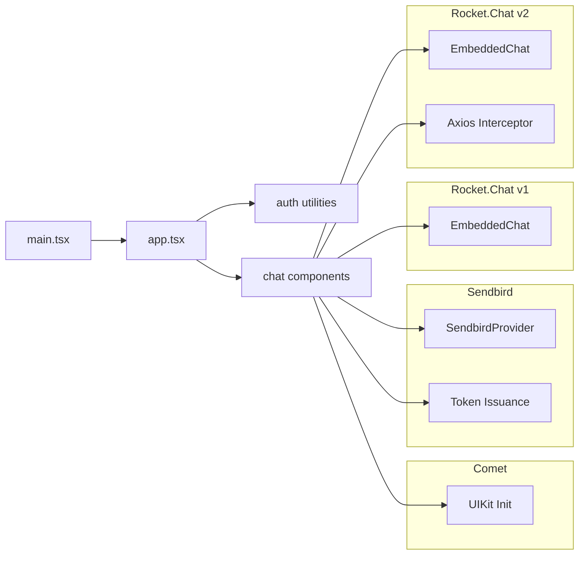

# Chat Proof of Concepts

<cite>
**Referenced Files in This Document**
- [comet-chat-poc/src/constants.ts](file://apps/chat-pocs/comet-chat-poc/src/constants.ts)
- [comet-chat-poc/src/main.tsx](file://apps/chat-pocs/comet-chat-poc/src/main.tsx)
- [comet-chat-poc/src/app/app.tsx](file://apps/chat-pocs/comet-chat-poc/src/app/app.tsx)
- [sendbird-poc/src/consts.ts](file://apps/chat-pocs/sendbird-poc/src/consts.ts)
- [sendbird-poc/src/main.tsx](file://apps/chat-pocs/sendbird-poc/src/main.tsx)
- [sendbird-poc/src/app/app.tsx](file://apps/chat-pocs/sendbird-poc/src/app/app.tsx)
- [rocketchat-poc/src/app/app.tsx](file://apps/chat-pocs/rocketchat-poc/src/app/app.tsx)
- [rocketchat-poc/src/views/sign-in/sign-in.tsx](file://apps/chat-pocs/rocketchat-poc/src/views/sign-in/sign-in.tsx)
- [rocketchat-poc/src/utils/auth.ts](file://apps/chat-pocs/rocketchat-poc/src/utils/auth.ts)
- [rocketchat-poc/src/views/chat/chat.tsx](file://apps/chat-pocs/rocketchat-poc/src/views/chat/chat.tsx)
- [rocketchat-poc-v2/src/app/app.tsx](file://apps/chat-pocs/rocketchat-poc-v2/src/app/app.tsx)
- [rocketchat-poc-v2/src/views/sign-in/sign-in.tsx](file://apps/chat-pocs/rocketchat-poc-v2/src/views/sign-in/sign-in.tsx)
- [rocketchat-poc-v2/src/views/sign-in/require-auth/require-auth.tsx](file://apps/chat-pocs/rocketchat-poc-v2/src/views/sign-in/require-auth/require-auth.tsx)
- [rocketchat-poc-v2/src/views/chat/chat.tsx](file://apps/chat-pocs/rocketchat-poc-v2/src/views/chat/chat.tsx)
- [rocketchat-poc-v2/src/utils/auth.ts](file://apps/chat-pocs/rocketchat-poc-v2/src/utils/auth.ts)
- [rocketchat-poc-v2/src/utils/api.ts](file://apps/chat-pocs/rocketchat-poc-v2/src/utils/api.ts)
- [rocketchat-poc-v2/src/types/rocketchat.d.ts](file://apps/chat-pocs/rocketchat-poc-v2/src/types/rocketchat.d.ts)
</cite>

## Table of Contents
1. [Introduction](#introduction)
2. [Project Structure](#project-structure)
3. [Core Components](#core-components)
4. [Architecture Overview](#architecture-overview)
5. [Detailed Component Analysis](#detailed-component-analysis)
6. [Dependency Analysis](#dependency-analysis)
7. [Performance Considerations](#performance-considerations)
8. [Troubleshooting Guide](#troubleshooting-guide)
9. [Conclusion](#conclusion)

## Introduction
This document explains three chat proof-of-concept (POC) applications integrated with different chat platforms:
- Comet Chat: A hosted chat SDK with a UIKit-based React integration.
- Rocket.Chat: Two distinct integrations—one using an embedded iframe-based chat widget and another using a modernized auth flow with a proxy backend and refresh logic.
- Sendbird: A hosted chat SDK with a React provider and token-based session management.

Each POC demonstrates:
- Authentication flows (Google OAuth and token exchange)
- API integrations (direct SDK calls or proxy-backed token issuance)
- Real-time communication patterns (embedded chat widgets and SDK initialization)
- Component architecture and state management
- UI design patterns for chat experiences
- Setup, environment configuration, and testing approaches

## Project Structure
The chat POCs live under apps/chat-pocs and are organized by platform. Each app includes:
- An entry point (main.tsx) mounting the root React component
- A routing/app shell (app.tsx)
- Platform-specific UI components and utilities
- Environment/configuration files (e.g., constants, auth helpers, API clients)

**Diagram sources**
- [comet-chat-poc/src/main.tsx:1-15](file://apps/chat-pocs/comet-chat-poc/src/main.tsx#L1-L15)
- [comet-chat-poc/src/app/app.tsx:1-60](file://apps/chat-pocs/comet-chat-poc/src/app/app.tsx#L1-L60)
- [comet-chat-poc/src/constants.ts:1-7](file://apps/chat-pocs/comet-chat-poc/src/constants.ts#L1-L7)
- [sendbird-poc/src/main.tsx:1-12](file://apps/chat-pocs/sendbird-poc/src/main.tsx#L1-L12)
- [sendbird-poc/src/app/app.tsx:1-116](file://apps/chat-pocs/sendbird-poc/src/app/app.tsx#L1-L116)
- [sendbird-poc/src/consts.ts:1-17](file://apps/chat-pocs/sendbird-poc/src/consts.ts#L1-L17)
- [rocketchat-poc/src/app/app.tsx:1-25](file://apps/chat-pocs/rocketchat-poc/src/app/app.tsx#L1-L25)
- [rocketchat-poc/src/views/sign-in/sign-in.tsx:1-129](file://apps/chat-pocs/rocketchat-poc/src/views/sign-in/sign-in.tsx#L1-L129)
- [rocketchat-poc/src/views/chat/chat.tsx:1-54](file://apps/chat-pocs/rocketchat-poc/src/views/chat/chat.tsx#L1-L54)
- [rocketchat-poc/src/utils/auth.ts:1-38](file://apps/chat-pocs/rocketchat-poc/src/utils/auth.ts#L1-L38)
- [rocketchat-poc-v2/src/app/app.tsx:1-55](file://apps/chat-pocs/rocketchat-poc-v2/src/app/app.tsx#L1-L55)
- [rocketchat-poc-v2/src/views/sign-in/sign-in.tsx:1-95](file://apps/chat-pocs/rocketchat-poc-v2/src/views/sign-in/sign-in.tsx#L1-L95)
- [rocketchat-poc-v2/src/views/sign-in/require-auth/require-auth.tsx:1-21](file://apps/chat-pocs/rocketchat-poc-v2/src/views/sign-in/require-auth/require-auth.tsx#L1-L21)
- [rocketchat-poc-v2/src/views/chat/chat.tsx:1-39](file://apps/chat-pocs/rocketchat-poc-v2/src/views/chat/chat.tsx#L1-L39)
- [rocketchat-poc-v2/src/utils/auth.ts:1-62](file://apps/chat-pocs/rocketchat-poc-v2/src/utils/auth.ts#L1-L62)
- [rocketchat-poc-v2/src/utils/api.ts:1-92](file://apps/chat-pocs/rocketchat-poc-v2/src/utils/api.ts#L1-L92)

**Section sources**
- [comet-chat-poc/src/main.tsx:1-15](file://apps/chat-pocs/comet-chat-poc/src/main.tsx#L1-L15)
- [sendbird-poc/src/main.tsx:1-12](file://apps/chat-pocs/sendbird-poc/src/main.tsx#L1-L12)
- [rocketchat-poc/src/app/app.tsx:1-25](file://apps/chat-pocs/rocketchat-poc/src/app/app.tsx#L1-L25)
- [rocketchat-poc-v2/src/app/app.tsx:1-55](file://apps/chat-pocs/rocketchat-poc-v2/src/app/app.tsx#L1-L55)

## Core Components
- Comet Chat POC
  - Initializes the UIKit with app credentials and logs in a predefined user.
  - Renders a users-with-messages UI when logged in.
- Sendbird POC
  - Issues a short-lived session token via a Sendbird API endpoint using an API token.
  - Wraps the UI with a provider configured with appId, userId, and accessToken.
  - Provides a channel list and a selected channel conversation.
- Rocket.Chat POC v1
  - Uses Google OAuth implicit flow to obtain an access token.
  - Embeds Rocket.Chat via an iframe-based widget with token-based auth.
- Rocket.Chat POC v2
  - Uses Google OAuth authorization code flow and posts the authorization code to a proxy backend.
  - Stores tokens in localStorage and uses an axios interceptor with a refresh strategy.
  - Protects routes with a RequireAuth component and renders an EmbeddedChat widget.

**Section sources**
- [comet-chat-poc/src/app/app.tsx:15-60](file://apps/chat-pocs/comet-chat-poc/src/app/app.tsx#L15-L60)
- [sendbird-poc/src/app/app.tsx:66-116](file://apps/chat-pocs/sendbird-poc/src/app/app.tsx#L66-L116)
- [rocketchat-poc/src/views/chat/chat.tsx:10-54](file://apps/chat-pocs/rocketchat-poc/src/views/chat/chat.tsx#L10-L54)
- [rocketchat-poc-v2/src/views/chat/chat.tsx:7-39](file://apps/chat-pocs/rocketchat-poc-v2/src/views/chat/chat.tsx#L7-L39)
- [rocketchat-poc-v2/src/utils/api.ts:10-62](file://apps/chat-pocs/rocketchat-poc-v2/src/utils/api.ts#L10-L62)

## Architecture Overview
The systems share a common pattern: a React SPA bootstrapped from main.tsx, routed via app.tsx, and protected by platform-specific authentication utilities. Differences lie in:
- Authentication: implicit vs. authorization code flow
- Token management: localStorage vs. SDK-provided handlers
- Real-time integration: iframe/embedded widget vs. UIKit initialization

```mermaid
graph TB
subgraph "Comet Chat"
CC_Init["UIKit Init<br/>and Login"]
CC_UI["UsersWithMessages UI"]
end
subgraph "Sendbird"
SB_Session["Session Token Issuance"]
SB_Provider["SendbirdProvider"]
SB_Conversation["ChannelList + Channel"]
end
subgraph "Rocket.Chat v1"
RCv1_OAuth["Implicit OAuth"]
RCv1_Embed["EmbeddedChat Widget"]
end
subgraph "Rocket.Chat v2"
RCv2_OAuth["Auth Code OAuth"]
RCv2_Proxy["Proxy Backend"]
RCv2_Tokens["Axios Interceptor + Refresh"]
RCv2_Route["RequireAuth Guard"]
RCv2_Embed["EmbeddedChat Widget"]
end
CC_Init --> CC_UI
SB_Session --> SB_Provider --> SB_Conversation
RCv1_OAuth --> RCv1_Embed
RCv2_OAuth --> RCv2_Proxy --> RCv2_Tokens --> RCv2_Route --> RCv2_Embed
```

**Diagram sources**
- [comet-chat-poc/src/app/app.tsx:18-50](file://apps/chat-pocs/comet-chat-poc/src/app/app.tsx#L18-L50)
- [sendbird-poc/src/app/app.tsx:29-92](file://apps/chat-pocs/sendbird-poc/src/app/app.tsx#L29-L92)
- [rocketchat-poc/src/views/chat/chat.tsx:17-31](file://apps/chat-pocs/rocketchat-poc/src/views/chat/chat.tsx#L17-L31)
- [rocketchat-poc-v2/src/views/sign-in/sign-in.tsx:24-40](file://apps/chat-pocs/rocketchat-poc-v2/src/views/sign-in/sign-in.tsx#L24-L40)
- [rocketchat-poc-v2/src/utils/api.ts:18-33](file://apps/chat-pocs/rocketchat-poc-v2/src/utils/api.ts#L18-L33)
- [rocketchat-poc-v2/src/views/sign-in/require-auth/require-auth.tsx:5-18](file://apps/chat-pocs/rocketchat-poc-v2/src/views/sign-in/require-auth/require-auth.tsx#L5-L18)
- [rocketchat-poc-v2/src/views/chat/chat.tsx:14-30](file://apps/chat-pocs/rocketchat-poc-v2/src/views/chat/chat.tsx#L14-L30)

## Detailed Component Analysis

### Comet Chat Integration
- Initialization and login
  - Builds UIKit settings with app ID, region, and auth key.
  - Checks for an existing logged-in user; otherwise logs in programmatically with a UID.
- UI rendering
  - Displays a fullscreen loader until login completes, then renders the users-with-messages component.

**Diagram sources**
- [comet-chat-poc/src/main.tsx:1-15](file://apps/chat-pocs/comet-chat-poc/src/main.tsx#L1-L15)
- [comet-chat-poc/src/app/app.tsx:18-50](file://apps/chat-pocs/comet-chat-poc/src/app/app.tsx#L18-L50)

**Section sources**
- [comet-chat-poc/src/constants.ts:1-7](file://apps/chat-pocs/comet-chat-poc/src/constants.ts#L1-L7)
- [comet-chat-poc/src/app/app.tsx:15-60](file://apps/chat-pocs/comet-chat-poc/src/app/app.tsx#L15-L60)

### Sendbird Integration
- Session token issuance
  - Issues a short-lived token against Sendbird’s V3 Users API using an API token and user ID.
- Provider configuration
  - Configures a session handler to supply tokens on demand and wraps the UI with SendbirdProvider.
- Conversation UI
  - Renders a channel list and a selected channel conversation area.

**Diagram sources**
- [sendbird-poc/src/main.tsx:1-12](file://apps/chat-pocs/sendbird-poc/src/main.tsx#L1-L12)
- [sendbird-poc/src/app/app.tsx:50-92](file://apps/chat-pocs/sendbird-poc/src/app/app.tsx#L50-L92)

**Section sources**
- [sendbird-poc/src/consts.ts:1-17](file://apps/chat-pocs/sendbird-poc/src/consts.ts#L1-L17)
- [sendbird-poc/src/app/app.tsx:29-116](file://apps/chat-pocs/sendbird-poc/src/app/app.tsx#L29-L116)

### Rocket.Chat POC v1 (Embedded Chat)
- Authentication
  - Uses Google OAuth implicit flow to obtain an access token.
- Chat embedding
  - Renders an EmbeddedChat widget with host, room/channel identifiers, and token-based credentials.

**Diagram sources**
- [rocketchat-poc/src/views/sign-in/sign-in.tsx:99-113](file://apps/chat-pocs/rocketchat-poc/src/views/sign-in/sign-in.tsx#L99-L113)
- [rocketchat-poc/src/views/chat/chat.tsx:17-31](file://apps/chat-pocs/rocketchat-poc/src/views/chat/chat.tsx#L17-L31)

**Section sources**
- [rocketchat-poc/src/views/sign-in/sign-in.tsx:24-129](file://apps/chat-pocs/rocketchat-poc/src/views/sign-in/sign-in.tsx#L24-L129)
- [rocketchat-poc/src/views/chat/chat.tsx:10-54](file://apps/chat-pocs/rocketchat-poc/src/views/chat/chat.tsx#L10-L54)
- [rocketchat-poc/src/utils/auth.ts:1-38](file://apps/chat-pocs/rocketchat-poc/src/utils/auth.ts#L1-L38)

### Rocket.Chat POC v2 (Modernized Auth and Proxy)
- Authentication
  - Uses Google OAuth authorization code flow; exchanges the code for tokens via a proxy backend.
- Token persistence and refresh
  - Stores tokens in localStorage; axios interceptor handles 401 refresh via a dedicated endpoint.
- Routing and protection
  - RequireAuth guard redirects unauthenticated users to sign-in while preserving intended destination.
- Chat embedding
  - Renders an EmbeddedChat widget with token-based credentials.

**Diagram sources**
- [rocketchat-poc-v2/src/views/sign-in/sign-in.tsx:24-40](file://apps/chat-pocs/rocketchat-poc-v2/src/views/sign-in/sign-in.tsx#L24-L40)
- [rocketchat-poc-v2/src/utils/api.ts:18-33](file://apps/chat-pocs/rocketchat-poc-v2/src/utils/api.ts#L18-L33)
- [rocketchat-poc-v2/src/views/sign-in/require-auth/require-auth.tsx:5-18](file://apps/chat-pocs/rocketchat-poc-v2/src/views/sign-in/require-auth/require-auth.tsx#L5-L18)
- [rocketchat-poc-v2/src/views/chat/chat.tsx:14-30](file://apps/chat-pocs/rocketchat-poc-v2/src/views/chat/chat.tsx#L14-L30)

**Section sources**
- [rocketchat-poc-v2/src/utils/auth.ts:1-62](file://apps/chat-pocs/rocketchat-poc-v2/src/utils/auth.ts#L1-L62)
- [rocketchat-poc-v2/src/utils/api.ts:1-92](file://apps/chat-pocs/rocketchat-poc-v2/src/utils/api.ts#L1-L92)
- [rocketchat-poc-v2/src/views/sign-in/sign-in.tsx:1-95](file://apps/chat-pocs/rocketchat-poc-v2/src/views/sign-in/sign-in.tsx#L1-L95)
- [rocketchat-poc-v2/src/views/sign-in/require-auth/require-auth.tsx:1-21](file://apps/chat-pocs/rocketchat-poc-v2/src/views/sign-in/require-auth/require-auth.tsx#L1-L21)
- [rocketchat-poc-v2/src/views/chat/chat.tsx:1-39](file://apps/chat-pocs/rocketchat-poc-v2/src/views/chat/chat.tsx#L1-L39)

### Conceptual Overview
- All apps mount a root React component and render a routing shell.
- Authentication utilities manage tokens and protect routes.
- Real-time chat is delivered either via an embedded widget or a UIKit-initialized chat surface.
- UI composition emphasizes minimal scaffolding around platform-provided components.

[No sources needed since this section doesn't analyze specific source files]

## Dependency Analysis
- Shared patterns
  - All apps rely on React Router for navigation and route protection.
  - LocalStorage is used for token persistence in v1 and v2 Rocket.Chat implementations.
- Platform-specific dependencies
  - Comet Chat: UIKit builder and users-with-messages component.
  - Sendbird: Provider and channel components with session token issuance.
  - Rocket.Chat: EmbeddedChat widget and Google OAuth libraries.

**Diagram sources**
- [comet-chat-poc/src/main.tsx:1-15](file://apps/chat-pocs/comet-chat-poc/src/main.tsx#L1-L15)
- [sendbird-poc/src/main.tsx:1-12](file://apps/chat-pocs/sendbird-poc/src/main.tsx#L1-L12)
- [rocketchat-poc/src/app/app.tsx:1-25](file://apps/chat-pocs/rocketchat-poc/src/app/app.tsx#L1-L25)
- [rocketchat-poc-v2/src/app/app.tsx:1-55](file://apps/chat-pocs/rocketchat-poc-v2/src/app/app.tsx#L1-L55)

**Section sources**
- [comet-chat-poc/src/app/app.tsx:1-60](file://apps/chat-pocs/comet-chat-poc/src/app/app.tsx#L1-L60)
- [sendbird-poc/src/app/app.tsx:1-116](file://apps/chat-pocs/sendbird-poc/src/app/app.tsx#L1-L116)
- [rocketchat-poc/src/views/chat/chat.tsx:1-54](file://apps/chat-pocs/rocketchat-poc/src/views/chat/chat.tsx#L1-L54)
- [rocketchat-poc-v2/src/views/chat/chat.tsx:1-39](file://apps/chat-pocs/rocketchat-poc-v2/src/views/chat/chat.tsx#L1-L39)

## Performance Considerations
- Comet Chat
  - Initialization cost depends on network latency to UIKit endpoints; consider preloading settings and deferring heavy UI until ready.
- Sendbird
  - Token issuance adds an extra network hop; cache tokens per session and avoid redundant requests.
- Rocket.Chat
  - Implicit flow reduces backend complexity but may increase browser roundtrips; consider server-side exchange for production-grade security.
  - Authorization code flow with proxy enables refresh logic and safer token handling; ensure efficient retry policies to minimize user disruption.

[No sources needed since this section provides general guidance]

## Troubleshooting Guide
- Authentication failures
  - Verify token storage keys and expiration in localStorage.
  - For Rocket.Chat v2, confirm the proxy endpoint responds to token refresh requests and updates Authorization headers.
- Network errors
  - Inspect axios interceptors and toast notifications for error messages.
  - Ensure proper CORS and proxy configuration for cross-origin requests.
- UI rendering issues
  - Confirm that loaders are replaced once tokens or user sessions are resolved.
  - Validate that EmbeddedChat receives valid credentials and the target room/channel exists.

**Section sources**
- [rocketchat-poc/src/utils/auth.ts:1-38](file://apps/chat-pocs/rocketchat-poc/src/utils/auth.ts#L1-L38)
- [rocketchat-poc-v2/src/utils/auth.ts:1-62](file://apps/chat-pocs/rocketchat-poc-v2/src/utils/auth.ts#L1-L62)
- [rocketchat-poc-v2/src/utils/api.ts:35-62](file://apps/chat-pocs/rocketchat-poc-v2/src/utils/api.ts#L35-L62)

## Conclusion
These POCs demonstrate practical patterns for integrating hosted chat SDKs and embedded chat widgets:
- Comet Chat showcases a streamlined UIKit initialization and programmatic login.
- Sendbird highlights token-based session management and provider configuration.
- Rocket.Chat presents two complementary approaches—implicit OAuth for simplicity and authorization code with a proxy for robust token lifecycle management.

Choose the approach that best fits your security posture, deployment model, and UX requirements. For production, augment each POC with comprehensive error handling, token refresh strategies, and observability.