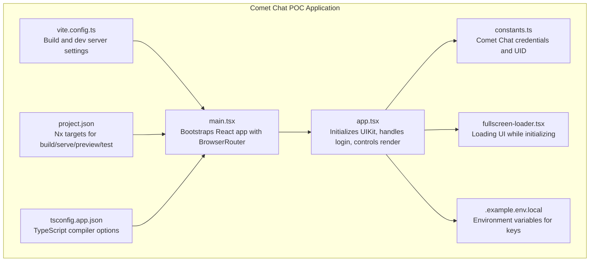
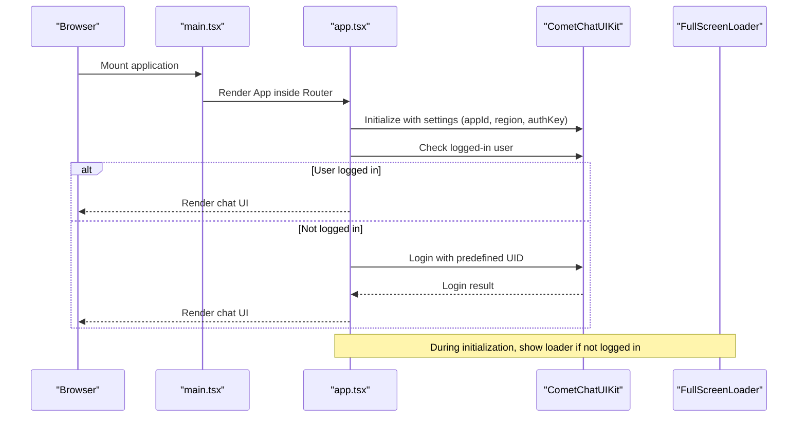
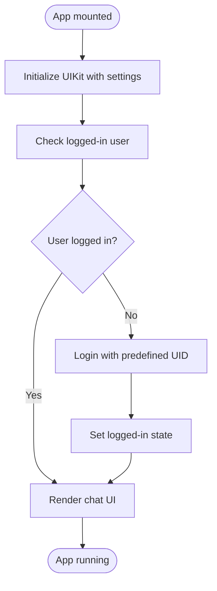
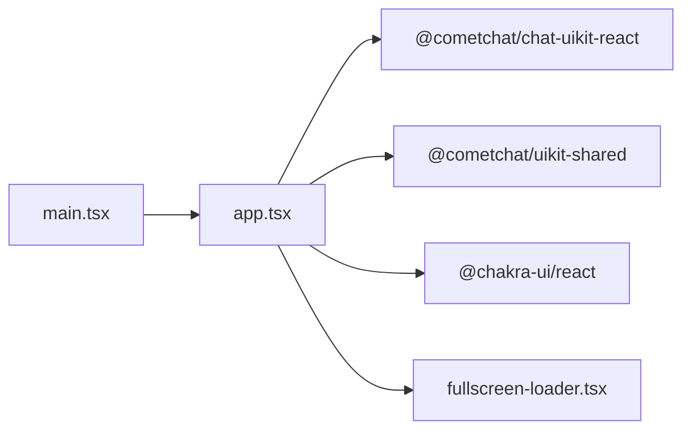

# Comet Chat Integration

<cite>
**Referenced Files in This Document**
- [app.tsx](file://apps/chat-pocs/comet-chat-poc/src/app/app.tsx)
- [main.tsx](file://apps/chat-pocs/comet-chat-poc/src/main.tsx)
- [constants.ts](file://apps/chat-pocs/comet-chat-poc/src/constants.ts)
- [.example.env.local](file://apps/chat-pocs/comet-chat-poc/.example.env.local)
- [fullscreen-loader.tsx](file://apps/chat-pocs/comet-chat-poc/src/components/fullscreen-loader.tsx)
- [project.json](file://apps/chat-pocs/comet-chat-poc/project.json)
- [vite.config.ts](file://apps/chat-pocs/comet-chat-poc/vite.config.ts)
- [tsconfig.app.json](file://apps/chat-pocs/comet-chat-poc/tsconfig.app.json)
</cite>

## Table of Contents
1. [Introduction](#introduction)
2. [Project Structure](#project-structure)
3. [Core Components](#core-components)
4. [Architecture Overview](#architecture-overview)
5. [Detailed Component Analysis](#detailed-component-analysis)
6. [Dependency Analysis](#dependency-analysis)
7. [Performance Considerations](#performance-considerations)
8. [Troubleshooting Guide](#troubleshooting-guide)
9. [Conclusion](#conclusion)
10. [Appendices](#appendices)

## Introduction
This document describes the Comet Chat integration proof-of-concept built as a React application. It explains the initialization and authentication flow, user session management, and the rendering of Comet Chat's UI components. The implementation leverages the Comet Chat UIKit for React to provide a ready-made chat experience with user presence subscriptions and a simple login mechanism. The document also covers configuration requirements, environment variables, and setup instructions to help you deploy and customize the integration.

## Project Structure
The Comet Chat POC is a Vite-powered React application configured as an Nx project. It initializes the Comet Chat UIKit, authenticates a predefined user, and renders a composite chat UI that displays users and messages.

**Diagram sources**
- [main.tsx:1-15](file://apps/chat-pocs/comet-chat-poc/src/main.tsx#L1-L15)
- [app.tsx:1-60](file://apps/chat-pocs/comet-chat-poc/src/app/app.tsx#L1-L60)
- [constants.ts:1-7](file://apps/chat-pocs/comet-chat-poc/src/constants.ts#L1-L7)
- [fullscreen-loader.tsx:1-12](file://apps/chat-pocs/comet-chat-poc/src/components/fullscreen-loader.tsx#L1-L12)
- [.example.env.local:1-9](file://apps/chat-pocs/comet-chat-poc/.example.env.local#L1-L9)
- [vite.config.ts:1-48](file://apps/chat-pocs/comet-chat-poc/vite.config.ts#L1-L48)
- [project.json:1-71](file://apps/chat-pocs/comet-chat-poc/project.json#L1-L71)
- [tsconfig.app.json:1-24](file://apps/chat-pocs/comet-chat-poc/tsconfig.app.json#L1-L24)

**Section sources**
- [project.json:1-71](file://apps/chat-pocs/comet-chat-poc/project.json#L1-L71)
- [vite.config.ts:1-48](file://apps/chat-pocs/comet-chat-poc/vite.config.ts#L1-L48)
- [tsconfig.app.json:1-24](file://apps/chat-pocs/comet-chat-poc/tsconfig.app.json#L1-L24)

## Core Components
- Application bootstrap and routing:
  - The app is bootstrapped with React and wrapped in a browser router to enable client-side routing.
  - The root element mounts the App component inside the router context.

- Authentication and session management:
  - On mount, the app initializes the Comet Chat UIKit with region, app ID, and auth key.
  - It checks if a user is already logged in; if not, it logs in using a predefined UID.
  - A state flag controls whether the chat UI is rendered or a loading indicator is shown.

- UI rendering:
  - Once authenticated, the composite chat component is rendered to display users and messages.
  - While initializing, a full-screen spinner is shown via a dedicated loader component.

- Configuration and environment:
  - Credentials and UID are defined in a constants module.
  - Environment variables are provided in an example file for local development.

**Section sources**
- [main.tsx:1-15](file://apps/chat-pocs/comet-chat-poc/src/main.tsx#L1-L15)
- [app.tsx:15-60](file://apps/chat-pocs/comet-chat-poc/src/app/app.tsx#L15-L60)
- [constants.ts:1-7](file://apps/chat-pocs/comet-chat-poc/src/constants.ts#L1-L7)
- [.example.env.local:1-9](file://apps/chat-pocs/comet-chat-poc/.example.env.local#L1-L9)
- [fullscreen-loader.tsx:1-12](file://apps/chat-pocs/comet-chat-poc/src/components/fullscreen-loader.tsx#L1-L12)

## Architecture Overview
The integration follows a straightforward initialization pattern:
- On startup, the app constructs UIKit settings using constants.
- It initializes the UIKit and checks the current login state.
- If not logged in, it performs a login with a fixed UID.
- After successful login, it renders the chat UI; otherwise, it shows a loading spinner.

**Diagram sources**
- [main.tsx:1-15](file://apps/chat-pocs/comet-chat-poc/src/main.tsx#L1-L15)
- [app.tsx:18-50](file://apps/chat-pocs/comet-chat-poc/src/app/app.tsx#L18-L50)
- [fullscreen-loader.tsx:1-12](file://apps/chat-pocs/comet-chat-poc/src/components/fullscreen-loader.tsx#L1-L12)

## Detailed Component Analysis

### Application Initialization and Authentication Flow
- Initialization:
  - UIKit settings are constructed with app ID, region, and auth key.
  - Presence subscription for friends is enabled during settings creation.
  - The UIKit is initialized with these settings.

- Login flow:
  - The app checks if a user is already logged in.
  - If not, it triggers a login using a predefined UID.
  - On successful login, the state flips to indicate the user is logged in.

- Rendering:
  - When logged in, the composite chat component is rendered.
  - Otherwise, a full-screen loader is displayed.

**Diagram sources**
- [app.tsx:18-50](file://apps/chat-pocs/comet-chat-poc/src/app/app.tsx#L18-L50)

**Section sources**
- [app.tsx:18-50](file://apps/chat-pocs/comet-chat-poc/src/app/app.tsx#L18-L50)

### UI Component: FullScreenLoader
- Purpose:
  - Provides a centered spinner while the app initializes UIKit and authenticates the user.
- Behavior:
  - Renders a container that centers a spinner vertically and horizontally.

**Section sources**
- [fullscreen-loader.tsx:1-12](file://apps/chat-pocs/comet-chat-poc/src/components/fullscreen-loader.tsx#L1-L12)

### Configuration and Environment Variables
- Constants:
  - App ID, region, auth key, and UID are defined in a constants module.
- Environment variables:
  - An example environment file provides keys for Google OAuth and Comet Chat configuration.
  - These can be used to override defaults during development.

**Section sources**
- [constants.ts:1-7](file://apps/chat-pocs/comet-chat-poc/src/constants.ts#L1-L7)
- [.example.env.local:1-9](file://apps/chat-pocs/comet-chat-poc/.example.env.local#L1-L9)

### Build and Runtime Configuration
- Nx targets:
  - Build, serve, preview, and test configurations are defined for the project.
- Vite configuration:
  - Defines ports, plugin usage, and test environment settings.
- TypeScript configuration:
  - Compiler options include necessary typings for React and Vite.

**Section sources**
- [project.json:7-64](file://apps/chat-pocs/comet-chat-poc/project.json#L7-L64)
- [vite.config.ts:6-47](file://apps/chat-pocs/comet-chat-poc/vite.config.ts#L6-L47)
- [tsconfig.app.json:3-11](file://apps/chat-pocs/comet-chat-poc/tsconfig.app.json#L3-L11)

## Dependency Analysis
The application depends on:
- React and Chakra UI for UI primitives.
- Comet Chat UIKit for React to provide chat UI and messaging capabilities.
- UIKit Shared for building settings and enabling presence subscriptions.

**Diagram sources**
- [app.tsx:5-10](file://apps/chat-pocs/comet-chat-poc/src/app/app.tsx#L5-L10)
- [main.tsx:1-5](file://apps/chat-pocs/comet-chat-poc/src/main.tsx#L1-L5)

**Section sources**
- [app.tsx:5-10](file://apps/chat-pocs/comet-chat-poc/src/app/app.tsx#L5-L10)
- [main.tsx:1-5](file://apps/chat-pocs/comet-chat-poc/src/main.tsx#L1-L5)

## Performance Considerations
- Initialization cost:
  - UIKit initialization and login occur once on mount; subsequent navigations reuse the initialized instance.
- Rendering:
  - The loader component is lightweight and only shown during initialization.
- Build and dev server:
  - Vite provides fast development builds and hot module replacement; adjust ports and plugins as needed.

[No sources needed since this section provides general guidance]

## Troubleshooting Guide
- Initialization failures:
  - If initialization fails, errors are logged to the console. Verify credentials and network connectivity.
- Login issues:
  - If login does not succeed, confirm the UID exists and credentials are correct.
- Routing:
  - The app is wrapped in a browser router; ensure any future routing is added consistently.

**Section sources**
- [app.tsx:44-46](file://apps/chat-pocs/comet-chat-poc/src/app/app.tsx#L44-L46)
- [main.tsx:3](file://apps/chat-pocs/comet-chat-poc/src/main.tsx#L3)

## Conclusion
This proof-of-concept demonstrates a minimal yet functional integration of Comet Chat’s UIKit for React. It initializes the SDK, authenticates a user, subscribes to friend presence, and renders a chat UI. The setup is straightforward and suitable for rapid prototyping or as a foundation for further customization.

[No sources needed since this section summarizes without analyzing specific files]

## Appendices

### Setup Instructions
- Install dependencies and run the development server using Nx targets.
- Configure environment variables using the provided example file.
- Customize credentials and UID in the constants module for your environment.

**Section sources**
- [project.json:24-39](file://apps/chat-pocs/comet-chat-poc/project.json#L24-L39)
- [.example.env.local:1-9](file://apps/chat-pocs/comet-chat-poc/.example.env.local#L1-L9)
- [constants.ts:1-7](file://apps/chat-pocs/comet-chat-poc/src/constants.ts#L1-L7)

### Customization Examples
- Change credentials:
  - Update the constants module with your app ID, region, and auth key.
- Modify login behavior:
  - Replace the predefined UID with dynamic user selection or external authentication.
- UI adjustments:
  - Adjust the loader component or replace it with a brand-specific spinner.
- Presence subscriptions:
  - Enable or disable presence subscriptions via UIKit settings builder.

**Section sources**
- [constants.ts:1-7](file://apps/chat-pocs/comet-chat-poc/src/constants.ts#L1-L7)
- [app.tsx:20-25](file://apps/chat-pocs/comet-chat-poc/src/app/app.tsx#L20-L25)
- [fullscreen-loader.tsx:1-12](file://apps/chat-pocs/comet-chat-poc/src/components/fullscreen-loader.tsx#L1-L12)