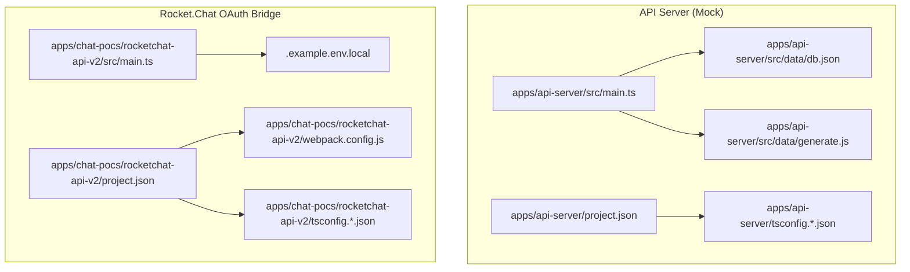
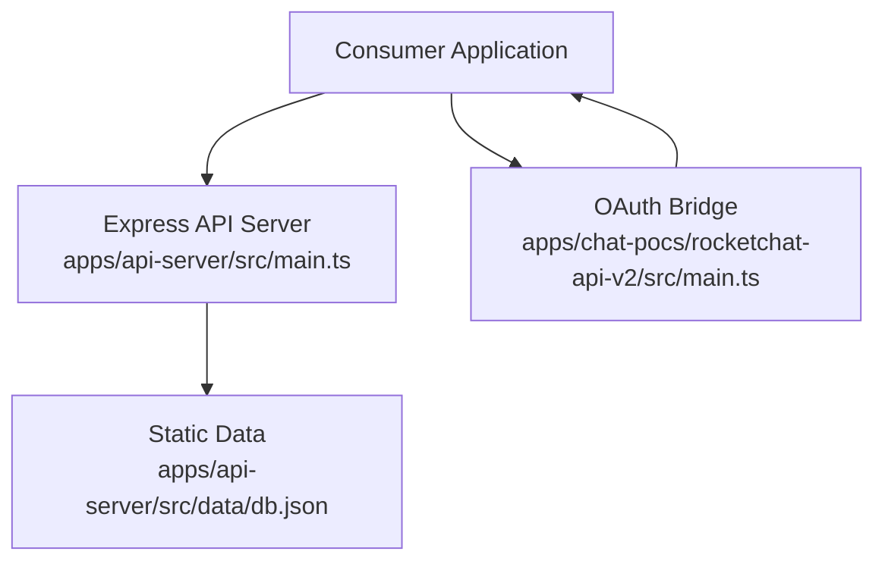
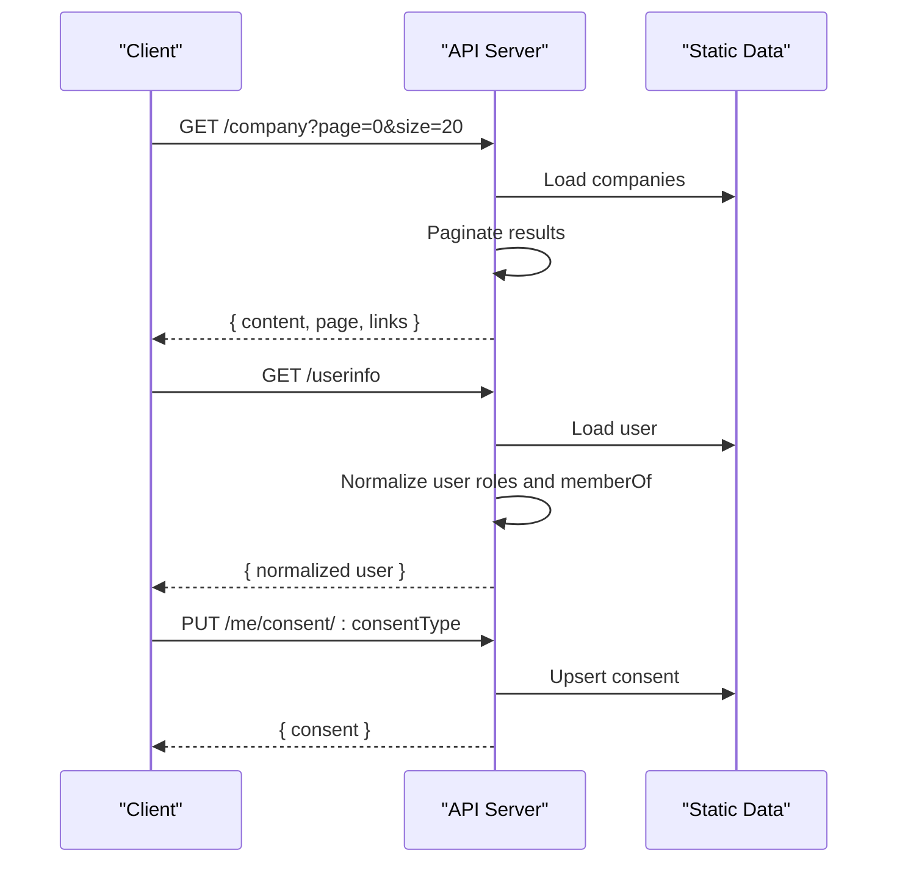
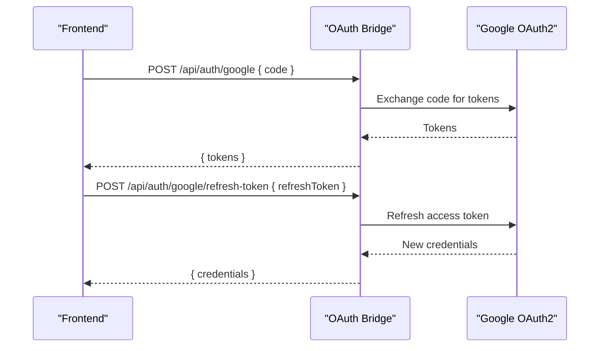
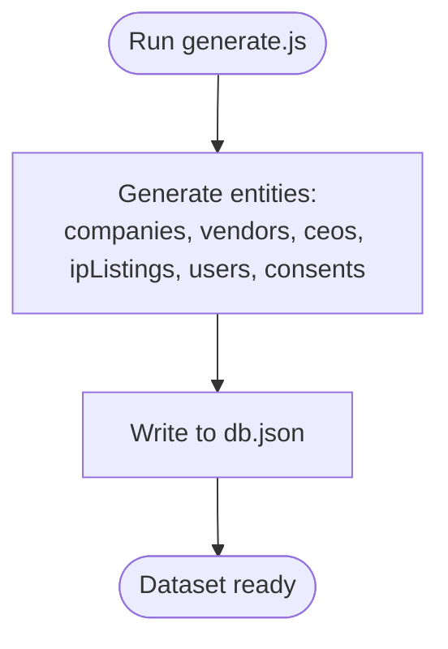
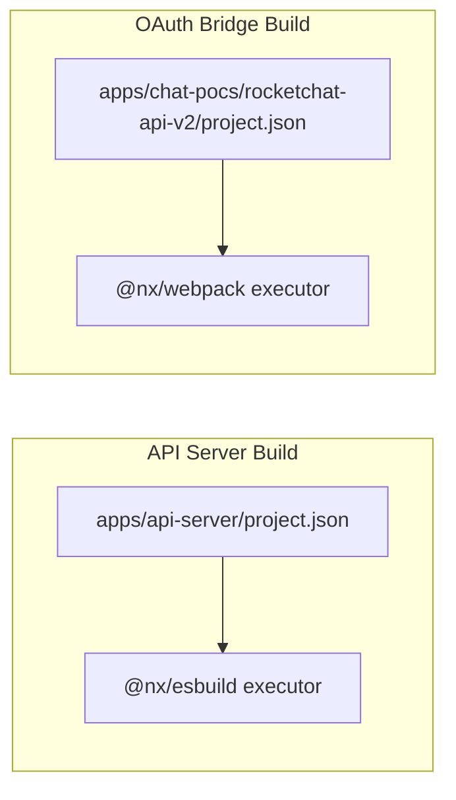

# Rocket.Chat API v2 Service

<cite>
**Referenced Files in This Document**
- [main.ts](file://apps/api-server/src/main.ts)
- [db.json](file://apps/api-server/src/data/db.json)
- [generate.js](file://apps/api-server/src/data/generate.js)
- [project.json](file://apps/api-server/project.json)
- [tsconfig.json](file://apps/api-server/tsconfig.json)
- [tsconfig.app.json](file://apps/api-server/tsconfig.app.json)
- [main.ts](file://apps/chat-pocs/rocketchat-api-v2/src/main.ts)
- [.example.env.local](file://apps/chat-pocs/rocketchat-api-v2/.example.env.local)
- [webpack.config.js](file://apps/chat-pocs/rocketchat-api-v2/webpack.config.js)
- [project.json](file://apps/chat-pocs/rocketchat-api-v2/project.json)
- [tsconfig.json](file://apps/chat-pocs/rocketchat-api-v2/tsconfig.json)
- [jest.config.ts](file://jest.config.ts)
</cite>

## Table of Contents
1. [Introduction](#introduction)
2. [Project Structure](#project-structure)
3. [Core Components](#core-components)
4. [Architecture Overview](#architecture-overview)
5. [Detailed Component Analysis](#detailed-component-analysis)
6. [Dependency Analysis](#dependency-analysis)
7. [Performance Considerations](#performance-considerations)
8. [Troubleshooting Guide](#troubleshooting-guide)
9. [Conclusion](#conclusion)
10. [Appendices](#appendices)

## Introduction
This document describes the Rocket.Chat API v2 service implementation within the monorepo, focusing on the enhanced API design, integration capabilities, and operational setup. It explains the service architecture, endpoint design, data handling, configuration, testing, and deployment patterns. It also outlines authentication mechanisms, error handling strategies, performance characteristics, and best practices for consuming applications.

## Project Structure
The Rocket.Chat API v2 service is composed of two primary parts:
- A mock API server that exposes a comprehensive set of endpoints aligned with Rocket.Chat’s v2 semantics and integrates with portal expectations.
- A lightweight Google OAuth bridge service that exchanges authorization codes for tokens and refreshes access tokens for Rocket.Chat integrations.

**Diagram sources**
- [main.ts:1-485](file://apps/api-server/src/main.ts#L1-L485)
- [db.json:1-800](file://apps/api-server/src/data/db.json#L1-L800)
- [generate.js:1-304](file://apps/api-server/src/data/generate.js#L1-L304)
- [project.json:1-85](file://apps/api-server/project.json#L1-L85)
- [tsconfig.json:1-14](file://apps/api-server/tsconfig.json#L1-L14)
- [tsconfig.app.json:1-10](file://apps/api-server/tsconfig.app.json#L1-L10)
- [main.ts:1-47](file://apps/chat-pocs/rocketchat-api-v2/src/main.ts#L1-L47)
- [.example.env.local:1-5](file://apps/chat-pocs/rocketchat-api-v2/.example.env.local#L1-L5)
- [webpack.config.js:1-13](file://apps/chat-pocs/rocketchat-api-v2/webpack.config.js#L1-L13)
- [project.json:1-47](file://apps/chat-pocs/rocketchat-api-v2/project.json#L1-L47)
- [tsconfig.json:1-14](file://apps/chat-pocs/rocketchat-api-v2/tsconfig.json#L1-L14)

**Section sources**
- [main.ts:1-485](file://apps/api-server/src/main.ts#L1-L485)
- [project.json:1-85](file://apps/api-server/project.json#L1-L85)
- [tsconfig.json:1-14](file://apps/api-server/tsconfig.json#L1-L14)
- [tsconfig.app.json:1-10](file://apps/api-server/tsconfig.app.json#L1-L10)
- [main.ts:1-47](file://apps/chat-pocs/rocketchat-api-v2/src/main.ts#L1-L47)
- [webpack.config.js:1-13](file://apps/chat-pocs/rocketchat-api-v2/webpack.config.js#L1-L13)
- [project.json:1-47](file://apps/chat-pocs/rocketchat-api-v2/project.json#L1-L47)
- [tsconfig.json:1-14](file://apps/chat-pocs/rocketchat-api-v2/tsconfig.json#L1-L14)

## Core Components
- Mock API Server
  - Provides REST endpoints for companies, vendors, CEOs, IP marketplace, user info, consent, research, expert notes, asset uploads, and library documents.
  - Normalizes user records to align with portal expectations (roles as arrays, memberOf as objects).
  - Implements pagination for list endpoints.
  - Includes a catch-all handler for unimplemented endpoints returning standardized shapes.
- Google OAuth Bridge
  - Exchanges authorization codes for tokens and refreshes access tokens using Google OAuth2.
  - Reads client credentials from environment variables.

Key implementation references:
- [Endpoint handlers and normalization:66-480](file://apps/api-server/src/main.ts#L66-L480)
- [OAuth endpoints:24-40](file://apps/chat-pocs/rocketchat-api-v2/src/main.ts#L24-L40)
- [Environment variables:1-5](file://apps/chat-pocs/rocketchat-api-v2/.example.env.local#L1-L5)

**Section sources**
- [main.ts:34-64](file://apps/api-server/src/main.ts#L34-L64)
- [main.ts:66-480](file://apps/api-server/src/main.ts#L66-L480)
- [main.ts:17-40](file://apps/chat-pocs/rocketchat-api-v2/src/main.ts#L17-L40)
- [.example.env.local:1-5](file://apps/chat-pocs/rocketchat-api-v2/.example.env.local#L1-L5)

## Architecture Overview
The Rocket.Chat API v2 service is structured around two complementary services:
- A Node.js Express server that serves as the primary API surface for Rocket.Chat v2-related operations and portal integrations.
- A small OAuth bridge that handles Google OAuth flows for Rocket.Chat integrations.

**Diagram sources**
- [main.ts:1-485](file://apps/api-server/src/main.ts#L1-L485)
- [main.ts:1-47](file://apps/chat-pocs/rocketchat-api-v2/src/main.ts#L1-L47)
- [db.json:1-800](file://apps/api-server/src/data/db.json#L1-L800)

## Detailed Component Analysis

### Mock API Server: Endpoint Design and Data Handling
The API server exposes a comprehensive set of endpoints designed to mirror Rocket.Chat v2 semantics and integrate with portal expectations. Notable features:
- Data normalization for users to ensure roles and memberOf fields conform to expected shapes.
- Pagination for list endpoints with page and size query parameters.
- Standardized response envelopes for lists and single resources.
- Catch-all handler to gracefully handle unimplemented routes.

**Diagram sources**
- [main.ts:66-480](file://apps/api-server/src/main.ts#L66-L480)
- [db.json:1-800](file://apps/api-server/src/data/db.json#L1-L800)

**Section sources**
- [main.ts:34-64](file://apps/api-server/src/main.ts#L34-L64)
- [main.ts:66-480](file://apps/api-server/src/main.ts#L66-L480)

### OAuth Bridge: Authentication Mechanisms
The OAuth bridge implements Google OAuth2 flows to exchange authorization codes for tokens and refresh access tokens. It reads client credentials from environment variables and listens on a configurable port.

**Diagram sources**
- [main.ts:24-40](file://apps/chat-pocs/rocketchat-api-v2/src/main.ts#L24-L40)
- [.example.env.local:1-5](file://apps/chat-pocs/rocketchat-api-v2/.example.env.local#L1-L5)

**Section sources**
- [main.ts:17-40](file://apps/chat-pocs/rocketchat-api-v2/src/main.ts#L17-L40)
- [.example.env.local:1-5](file://apps/chat-pocs/rocketchat-api-v2/.example.env.local#L1-L5)

### Data Generation and Static Dataset
The static dataset is generated programmatically and persisted to a JSON file. The generator creates realistic entities for companies, vendors, CEOs, IP listings, users, and consents. The API server loads this dataset at runtime to serve requests.

**Diagram sources**
- [generate.js:246-304](file://apps/api-server/src/data/generate.js#L246-L304)
- [db.json:1-800](file://apps/api-server/src/data/db.json#L1-L800)

**Section sources**
- [generate.js:1-304](file://apps/api-server/src/data/generate.js#L1-L304)
- [db.json:1-800](file://apps/api-server/src/data/db.json#L1-L800)

## Dependency Analysis
The project uses Nx for orchestration and build tooling. The API server and OAuth bridge each define their own build targets and TypeScript configurations.

**Diagram sources**
- [project.json:7-39](file://apps/api-server/project.json#L7-L39)
- [project.json:8-25](file://apps/chat-pocs/rocketchat-api-v2/project.json#L8-L25)

**Section sources**
- [project.json:1-85](file://apps/api-server/project.json#L1-L85)
- [project.json:1-47](file://apps/chat-pocs/rocketchat-api-v2/project.json#L1-L47)

## Performance Considerations
- In-memory data access: The API server loads a static dataset into memory and performs in-memory filtering and pagination. This is efficient for moderate datasets and avoids database overhead.
- Minimal middleware: The server uses lightweight middleware (CORS, JSON body parsing) to reduce latency.
- Build optimizations: The API server build disables source maps in production to minimize bundle size and improve cold start times.
- Catch-all handler: Unimplemented endpoints return standardized responses quickly, preventing expensive fallbacks.

[No sources needed since this section provides general guidance]

## Troubleshooting Guide
Common issues and resolutions:
- Missing environment variables for OAuth bridge:
  - Ensure client ID and secret are configured in the environment file and loaded by the runtime.
  - Reference: [.example.env.local:1-5](file://apps/chat-pocs/rocketchat-api-v2/.example.env.local#L1-L5)
- Unauthorized user info:
  - The userinfo endpoint returns unauthorized if no user data is present in the dataset.
  - Reference: [main.ts:161-169](file://apps/api-server/src/main.ts#L161-L169)
- Unimplemented endpoints:
  - The catch-all handler returns either an empty list envelope for GET or a success object for other methods.
  - Reference: [main.ts:472-480](file://apps/api-server/src/main.ts#L472-L480)
- CORS errors:
  - The server enables CORS globally; verify client origin policies and headers.
  - Reference: [main.ts:9-10](file://apps/api-server/src/main.ts#L9-L10)

**Section sources**
- [.example.env.local:1-5](file://apps/chat-pocs/rocketchat-api-v2/.example.env.local#L1-L5)
- [main.ts:161-169](file://apps/api-server/src/main.ts#L161-L169)
- [main.ts:472-480](file://apps/api-server/src/main.ts#L472-L480)
- [main.ts:9-10](file://apps/api-server/src/main.ts#L9-L10)

## Conclusion
The Rocket.Chat API v2 service provides a robust, modular foundation for integrating with Rocket.Chat’s v2 ecosystem. It offers a well-structured set of endpoints, standardized data handling, and a lightweight OAuth bridge. With clear build and configuration setups, it supports rapid iteration and reliable deployment within the monorepo.

[No sources needed since this section summarizes without analyzing specific files]

## Appendices

### Environment Variables
- OAuth Bridge:
  - ROCKETCHAT_POC_CLIENT_ID
  - ROCKETCHAT_POC_CLIENT_SECRET
  - PORT

Reference: [.example.env.local:1-5](file://apps/chat-pocs/rocketchat-api-v2/.example.env.local#L1-L5)

**Section sources**
- [.example.env.local:1-5](file://apps/chat-pocs/rocketchat-api-v2/.example.env.local#L1-L5)

### TypeScript and Build Configuration
- API Server:
  - Base and app TypeScript configs extend the workspace base.
  - Build uses esbuild with Node target and generates package.json for distribution.
- OAuth Bridge:
  - Uses webpack with Nx plugin targeting Node.
  - TypeScript configs mirror the API server structure.

References:
- [tsconfig.json:1-14](file://apps/api-server/tsconfig.json#L1-L14)
- [tsconfig.app.json:1-10](file://apps/api-server/tsconfig.app.json#L1-L10)
- [project.json:8-39](file://apps/api-server/project.json#L8-L39)
- [tsconfig.json:1-14](file://apps/chat-pocs/rocketchat-api-v2/tsconfig.json#L1-L14)
- [webpack.config.js:1-13](file://apps/chat-pocs/rocketchat-api-v2/webpack.config.js#L1-L13)
- [project.json:8-25](file://apps/chat-pocs/rocketchat-api-v2/project.json#L8-L25)

**Section sources**
- [tsconfig.json:1-14](file://apps/api-server/tsconfig.json#L1-L14)
- [tsconfig.app.json:1-10](file://apps/api-server/tsconfig.app.json#L1-L10)
- [project.json:1-85](file://apps/api-server/project.json#L1-L85)
- [tsconfig.json:1-14](file://apps/chat-pocs/rocketchat-api-v2/tsconfig.json#L1-L14)
- [webpack.config.js:1-13](file://apps/chat-pocs/rocketchat-api-v2/webpack.config.js#L1-L13)
- [project.json:1-47](file://apps/chat-pocs/rocketchat-api-v2/project.json#L1-L47)

### Testing Setup
- Jest configuration aggregates projects from Nx workspaces.
- Projects:
  - API Server
  - Rocket.Chat OAuth Bridge
  - Additional workspace projects

Reference: [jest.config.ts:1-6](file://jest.config.ts#L1-L6)

**Section sources**
- [jest.config.ts:1-6](file://jest.config.ts#L1-L6)

### Deployment Instructions
- Build:
  - API Server: Use the build target defined in its project configuration.
  - OAuth Bridge: Use the build target defined in its project configuration.
- Serve:
  - Both services expose a serve target for development.
- Production:
  - Production builds disable source maps for the API server.
  - Ensure environment variables are set for the OAuth bridge.

References:
- [project.json:65-82](file://apps/api-server/project.json#L65-L82)
- [project.json:26-40](file://apps/chat-pocs/rocketchat-api-v2/project.json#L26-L40)

**Section sources**
- [project.json:65-82](file://apps/api-server/project.json#L65-L82)
- [project.json:26-40](file://apps/chat-pocs/rocketchat-api-v2/project.json#L26-L40)

### Integration Guidelines
- Authentication:
  - Use the OAuth bridge to exchange authorization codes for tokens and refresh access tokens.
- Endpoints:
  - Align with the documented endpoint patterns for companies, vendors, users, consent, and marketplace resources.
- Data Handling:
  - Expect normalized user records with roles as arrays and memberOf as objects.
  - Use pagination via page and size query parameters for list endpoints.

References:
- [main.ts:24-40](file://apps/chat-pocs/rocketchat-api-v2/src/main.ts#L24-L40)
- [main.ts:34-64](file://apps/api-server/src/main.ts#L34-L64)
- [main.ts:66-480](file://apps/api-server/src/main.ts#L66-L480)

**Section sources**
- [main.ts:24-40](file://apps/chat-pocs/rocketchat-api-v2/src/main.ts#L24-L40)
- [main.ts:34-64](file://apps/api-server/src/main.ts#L34-L64)
- [main.ts:66-480](file://apps/api-server/src/main.ts#L66-L480)