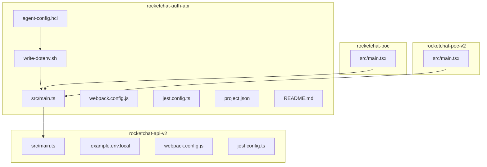
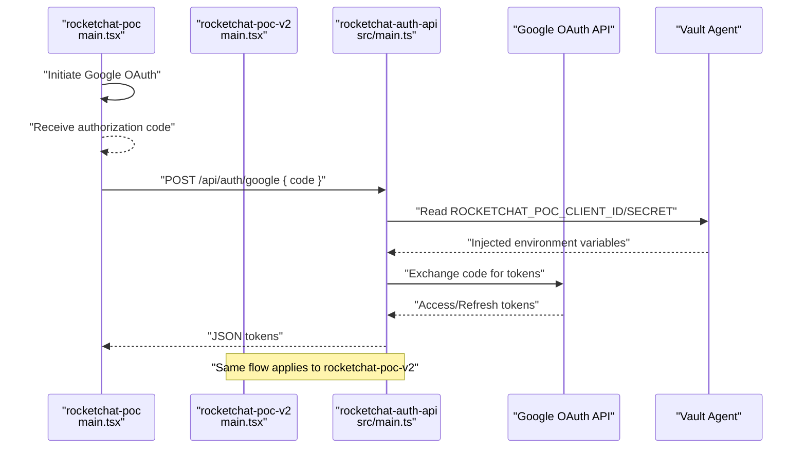
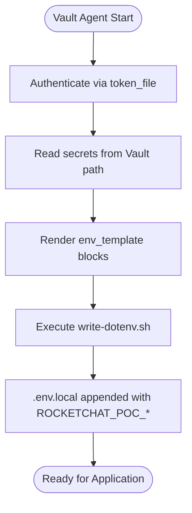
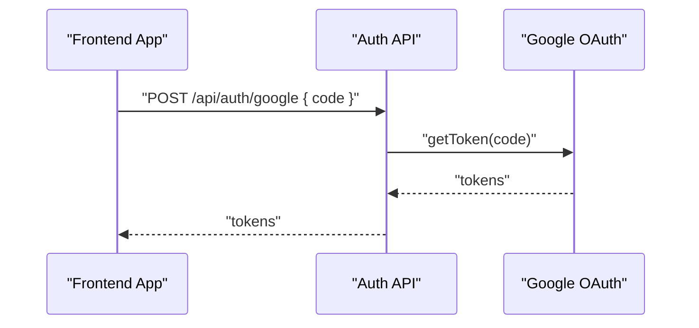
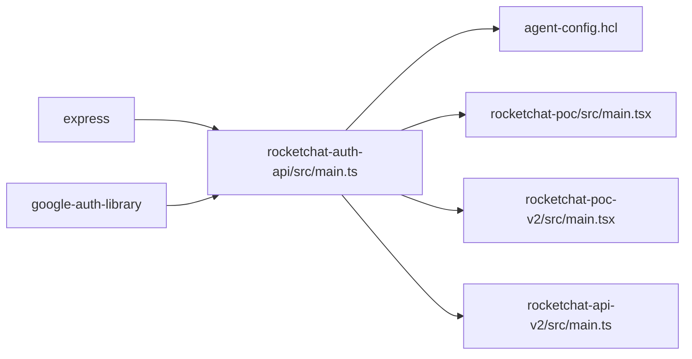

# Rocket.Chat Authentication API

<cite>
**Referenced Files in This Document**
- [src/main.ts](file://apps/chat-pocs/rocketchat-auth-api/src/main.ts)
- [agent-config.hcl](file://apps/chat-pocs/rocketchat-auth-api/agent-config.hcl)
- [webpack.config.js](file://apps/chat-pocs/rocketchat-auth-api/webpack.config.js)
- [jest.config.ts](file://apps/chat-pocs/rocketchat-auth-api/jest.config.ts)
- [project.json](file://apps/chat-pocs/rocketchat-auth-api/project.json)
- [README.md](file://apps/chat-pocs/rocketchat-auth-api/README.md)
- [write-dotenv.sh](file://apps/chat-pocs/rocketchat-auth-api/write-dotenv.sh)
- [rocketchat-api-v2/src/main.ts](file://apps/chat-pocs/rocketchat-api-v2/src/main.ts)
- [rocketchat-api-v2/.example.env.local](file://apps/chat-pocs/rocketchat-api-v2/.example.env.local)
- [rocketchat-api-v2/webpack.config.js](file://apps/chat-pocs/rocketchat-api-v2/webpack.config.js)
- [rocketchat-api-v2/jest.config.ts](file://apps/chat-pocs/rocketchat-api-v2/jest.config.ts)
- [rocketchat-poc/src/main.tsx](file://apps/chat-pocs/rocketchat-poc/src/main.tsx)
- [rocketchat-poc-v2/src/main.tsx](file://apps/chat-pocs/rocketchat-poc-v2/src/main.tsx)
</cite>

## Table of Contents
1. [Introduction](#introduction)
2. [Project Structure](#project-structure)
3. [Core Components](#core-components)
4. [Architecture Overview](#architecture-overview)
5. [Detailed Component Analysis](#detailed-component-analysis)
6. [Dependency Analysis](#dependency-analysis)
7. [Performance Considerations](#performance-considerations)
8. [Troubleshooting Guide](#troubleshooting-guide)
9. [Conclusion](#conclusion)
10. [Appendices](#appendices)

## Introduction
This document describes the dedicated Rocket.Chat authentication API service, a lightweight Express-based Node.js application responsible for exchanging Google OAuth authorization codes for access and refresh tokens. It also documents the HashiCorp Vault agent configuration for secret injection, the webpack bundling setup, testing configuration, environment variable requirements, authentication endpoints, and security considerations. Additionally, it explains integration patterns with Rocket.Chat's authentication system, token refresh mechanisms, session management, deployment instructions, and troubleshooting steps.

## Project Structure
The authentication API is implemented as a small Express server with a minimal TypeScript entrypoint. It integrates with HashiCorp Vault via a Vault Agent configuration to inject Google OAuth client credentials into the runtime environment, and exposes a single endpoint to exchange an authorization code for tokens.

**Diagram sources**
- [src/main.ts:1-59](file://apps/chat-pocs/rocketchat-auth-api/src/main.ts#L1-L59)
- [agent-config.hcl:1-36](file://apps/chat-pocs/rocketchat-auth-api/agent-config.hcl#L1-L36)
- [webpack.config.js:1-9](file://apps/chat-pocs/rocketchat-auth-api/webpack.config.js#L1-L9)
- [jest.config.ts:1-12](file://apps/chat-pocs/rocketchat-auth-api/jest.config.ts#L1-L12)
- [project.json:1-48](file://apps/chat-pocs/rocketchat-auth-api/project.json#L1-L48)
- [README.md:1-41](file://apps/chat-pocs/rocketchat-auth-api/README.md#L1-L41)
- [write-dotenv.sh:1-4](file://apps/chat-pocs/rocketchat-auth-api/write-dotenv.sh#L1-L4)
- [rocketchat-api-v2/src/main.ts:1-47](file://apps/chat-pocs/rocketchat-api-v2/src/main.ts#L1-L47)
- [rocketchat-api-v2/.example.env.local:1-5](file://apps/chat-pocs/rocketchat-api-v2/.example.env.local#L1-L5)
- [rocketchat-api-v2/webpack.config.js:1-13](file://apps/chat-pocs/rocketchat-api-v2/webpack.config.js#L1-L13)
- [rocketchat-api-v2/jest.config.ts:1-12](file://apps/chat-pocs/rocketchat-api-v2/jest.config.ts#L1-L12)
- [rocketchat-poc/src/main.tsx:1-24](file://apps/chat-pocs/rocketchat-poc/src/main.tsx#L1-L24)
- [rocketchat-poc-v2/src/main.tsx:1-35](file://apps/chat-pocs/rocketchat-poc-v2/src/main.tsx#L1-L35)

**Section sources**
- [project.json:1-48](file://apps/chat-pocs/rocketchat-auth-api/project.json#L1-L48)

## Core Components
- Express server with CORS enabled and static asset serving for the assets directory.
- Google OAuth2 token exchange endpoint that accepts an authorization code and returns access/refresh tokens.
- Vault Agent integration to securely inject client ID and secret into the environment.
- Build and serve targets orchestrated via Nx with webpack for Node.js bundling.
- Jest-based test configuration for Node.js environment.

Key implementation references:
- Server initialization and middleware: [src/main.ts:18-29](file://apps/chat-pocs/rocketchat-auth-api/src/main.ts#L18-L29)
- Token exchange endpoint: [src/main.ts:36-42](file://apps/chat-pocs/rocketchat-auth-api/src/main.ts#L36-L42)
- Vault agent configuration: [agent-config.hcl:1-36](file://apps/chat-pocs/rocketchat-auth-api/agent-config.hcl#L1-L36)
- Webpack configuration: [webpack.config.js:1-9](file://apps/chat-pocs/rocketchat-auth-api/webpack.config.js#L1-L9)
- Jest configuration: [jest.config.ts:1-12](file://apps/chat-pocs/rocketchat-auth-api/jest.config.ts#L1-L12)
- Build and serve targets: [project.json:7-41](file://apps/chat-pocs/rocketchat-auth-api/project.json#L7-L41)

**Section sources**
- [src/main.ts:1-59](file://apps/chat-pocs/rocketchat-auth-api/src/main.ts#L1-L59)
- [agent-config.hcl:1-36](file://apps/chat-pocs/rocketchat-auth-api/agent-config.hcl#L1-L36)
- [webpack.config.js:1-9](file://apps/chat-pocs/rocketchat-auth-api/webpack.config.js#L1-L9)
- [jest.config.ts:1-12](file://apps/chat-pocs/rocketchat-auth-api/jest.config.ts#L1-L12)
- [project.json:1-48](file://apps/chat-pocs/rocketchat-auth-api/project.json#L1-L48)

## Architecture Overview
The authentication API acts as a thin bridge between the Rocket.Chat POC frontends and Google OAuth. The frontends initiate the OAuth flow and receive an authorization code. They then call the authentication API to exchange the code for tokens. The API uses Vault Agent to securely load client credentials and performs the token exchange using the Google OAuth2 client library.

**Diagram sources**
- [rocketchat-poc/src/main.tsx:1-24](file://apps/chat-pocs/rocketchat-poc/src/main.tsx#L1-L24)
- [rocketchat-poc-v2/src/main.tsx:1-35](file://apps/chat-pocs/rocketchat-poc-v2/src/main.tsx#L1-L35)
- [src/main.ts:1-59](file://apps/chat-pocs/rocketchat-auth-api/src/main.ts#L1-L59)
- [agent-config.hcl:1-36](file://apps/chat-pocs/rocketchat-auth-api/agent-config.hcl#L1-L36)

## Detailed Component Analysis

### Express Server and Endpoints
- Initializes Express, enables CORS, serves static assets, and exposes a root endpoint for health checks.
- Provides a single POST endpoint to exchange an authorization code for tokens using the Google OAuth2 client configured with injected client credentials.

Implementation highlights:
- Endpoint registration and handler: [src/main.ts:27-42](file://apps/chat-pocs/rocketchat-auth-api/src/main.ts#L27-L42)
- Environment-driven client initialization: [src/main.ts:31-34](file://apps/chat-pocs/rocketchat-auth-api/src/main.ts#L31-L34)

Security considerations:
- CORS is enabled broadly; restrict origins in production deployments.
- Tokens are returned as JSON; ensure HTTPS and secure storage in clients.

**Section sources**
- [src/main.ts:1-59](file://apps/chat-pocs/rocketchat-auth-api/src/main.ts#L1-L59)

### Vault Agent Integration and Secret Injection
- Vault agent configuration defines a token file method, Vault address, and environment template blocks for client ID and secret.
- An exec block runs a shell script to append matching environment variables to a local .env.local file.
- The README outlines the steps to install the Vault CLI, authenticate, and run the agent to populate secrets.

Key references:
- Vault agent config: [agent-config.hcl:1-36](file://apps/chat-pocs/rocketchat-auth-api/agent-config.hcl#L1-L36)
- Env template rendering: [agent-config.hcl:22-29](file://apps/chat-pocs/rocketchat-auth-api/agent-config.hcl#L22-L29)
- Exec script invocation: [agent-config.hcl:31-35](file://apps/chat-pocs/rocketchat-auth-api/agent-config.hcl#L31-L35)
- Shell script: [write-dotenv.sh:1-4](file://apps/chat-pocs/rocketchat-auth-api/write-dotenv.sh#L1-L4)
- Setup instructions: [README.md:3-41](file://apps/chat-pocs/rocketchat-auth-api/README.md#L3-L41)

**Diagram sources**
- [agent-config.hcl:1-36](file://apps/chat-pocs/rocketchat-auth-api/agent-config.hcl#L1-L36)
- [write-dotenv.sh:1-4](file://apps/chat-pocs/rocketchat-auth-api/write-dotenv.sh#L1-L4)

**Section sources**
- [agent-config.hcl:1-36](file://apps/chat-pocs/rocketchat-auth-api/agent-config.hcl#L1-L36)
- [write-dotenv.sh:1-4](file://apps/chat-pocs/rocketchat-auth-api/write-dotenv.sh#L1-L4)
- [README.md:1-41](file://apps/chat-pocs/rocketchat-auth-api/README.md#L1-L41)

### Token Exchange Flow and Security
- The token exchange endpoint uses the Google OAuth2 client to exchange the received authorization code for tokens.
- The client ID and secret are loaded from environment variables injected by Vault.
- The implementation includes a commented-out token refresh mechanism using UserRefreshClient, indicating future capability.

References:
- Token exchange endpoint: [src/main.ts:36-42](file://apps/chat-pocs/rocketchat-auth-api/src/main.ts#L36-L42)
- Client initialization: [src/main.ts:31-34](file://apps/chat-pocs/rocketchat-auth-api/src/main.ts#L31-L34)
- Refresh token placeholder: [src/main.ts:44-52](file://apps/chat-pocs/rocketchat-auth-api/src/main.ts#L44-L52)

**Diagram sources**
- [src/main.ts:1-59](file://apps/chat-pocs/rocketchat-auth-api/src/main.ts#L1-L59)

**Section sources**
- [src/main.ts:1-59](file://apps/chat-pocs/rocketchat-auth-api/src/main.ts#L1-L59)

### Integration Patterns with Rocket.Chat POCs
- Frontend applications (rocketchat-poc and rocketchat-poc-v2) configure Google OAuth providers with client IDs.
- After obtaining an authorization code, the frontends call the authentication API to exchange it for tokens.
- The rocketchat-api-v2 project demonstrates a similar token exchange pattern and includes a token refresh endpoint.

References:
- Frontend provider setup: [rocketchat-poc/src/main.tsx:8-11](file://apps/chat-pocs/rocketchat-poc/src/main.tsx#L8-L11), [rocketchat-poc-v2/src/main.tsx:12-14](file://apps/chat-pocs/rocketchat-poc-v2/src/main.tsx#L12-L14)
- Token exchange in API v2: [rocketchat-api-v2/src/main.ts:24-29](file://apps/chat-pocs/rocketchat-api-v2/src/main.ts#L24-L29)
- Token refresh in API v2: [rocketchat-api-v2/src/main.ts:31-40](file://apps/chat-pocs/rocketchat-api-v2/src/main.ts#L31-L40)

**Section sources**
- [rocketchat-poc/src/main.tsx:1-24](file://apps/chat-pocs/rocketchat-poc/src/main.tsx#L1-L24)
- [rocketchat-poc-v2/src/main.tsx:1-35](file://apps/chat-pocs/rocketchat-poc-v2/src/main.tsx#L1-L35)
- [rocketchat-api-v2/src/main.ts:1-47](file://apps/chat-pocs/rocketchat-api-v2/src/main.ts#L1-L47)

### Token Refresh Mechanisms and Session Management
- The current implementation focuses on code-to-tokens exchange.
- A token refresh endpoint exists in the rocketchat-api-v2 project using UserRefreshClient, demonstrating a pattern for refresh token handling.
- The rocketchat-auth-api includes commented code indicating future refresh token support.

References:
- Token refresh in API v2: [rocketchat-api-v2/src/main.ts:31-40](file://apps/chat-pocs/rocketchat-api-v2/src/main.ts#L31-L40)
- Refresh placeholder in auth API: [src/main.ts:44-52](file://apps/chat-pocs/rocketchat-auth-api/src/main.ts#L44-L52)

**Section sources**
- [rocketchat-api-v2/src/main.ts:1-47](file://apps/chat-pocs/rocketchat-api-v2/src/main.ts#L1-L47)
- [src/main.ts:1-59](file://apps/chat-pocs/rocketchat-auth-api/src/main.ts#L1-L59)

### Build, Bundling, and Testing Configuration
- Build target uses @nx/webpack:webpack with Node target and TypeScript compiler.
- Serve target uses @nx/js:node to run the built application.
- Webpack plugin composition via Nx.
- Jest preset and Node test environment.

References:
- Build target: [project.json:8-26](file://apps/chat-pocs/rocketchat-auth-api/project.json#L8-L26)
- Serve target: [project.json:27-41](file://apps/chat-pocs/rocketchat-auth-api/project.json#L27-L41)
- Webpack config: [webpack.config.js:1-9](file://apps/chat-pocs/rocketchat-auth-api/webpack.config.js#L1-L9)
- Jest config: [jest.config.ts:1-12](file://apps/chat-pocs/rocketchat-auth-api/jest.config.ts#L1-L12)

**Section sources**
- [project.json:1-48](file://apps/chat-pocs/rocketchat-auth-api/project.json#L1-L48)
- [webpack.config.js:1-9](file://apps/chat-pocs/rocketchat-auth-api/webpack.config.js#L1-L9)
- [jest.config.ts:1-12](file://apps/chat-pocs/rocketchat-auth-api/jest.config.ts#L1-L12)

## Dependency Analysis
The authentication API depends on:
- Express for HTTP routing and middleware.
- google-auth-library for OAuth2 token exchange.
- Optional UserRefreshClient for refresh token handling (implemented in API v2).

**Diagram sources**
- [src/main.ts:1-59](file://apps/chat-pocs/rocketchat-auth-api/src/main.ts#L1-L59)
- [agent-config.hcl:1-36](file://apps/chat-pocs/rocketchat-auth-api/agent-config.hcl#L1-L36)
- [rocketchat-poc/src/main.tsx:1-24](file://apps/chat-pocs/rocketchat-poc/src/main.tsx#L1-L24)
- [rocketchat-poc-v2/src/main.tsx:1-35](file://apps/chat-pocs/rocketchat-poc-v2/src/main.tsx#L1-L35)
- [rocketchat-api-v2/src/main.ts:1-47](file://apps/chat-pocs/rocketchat-api-v2/src/main.ts#L1-L47)

**Section sources**
- [src/main.ts:1-59](file://apps/chat-pocs/rocketchat-auth-api/src/main.ts#L1-L59)

## Performance Considerations
- Keep the server lightweight; avoid heavy synchronous operations in request handlers.
- Use HTTPS in production to protect token transmission.
- Consider rate limiting and input validation for the token exchange endpoint.
- Cache token metadata on the server only if necessary; prefer client-side token storage with secure flags.

## Troubleshooting Guide
Common issues and resolutions:
- Missing environment variables:
  - Ensure Vault agent has successfully written ROCKETCHAT_POC_CLIENT_ID and ROCKETCHAT_POC_CLIENT_SECRET to .env.local.
  - Verify the write-dotenv.sh script is executed by the agent and that the file contains the expected keys.
  - Reference: [agent-config.hcl:31-35](file://apps/chat-pocs/rocketchat-auth-api/agent-config.hcl#L31-L35), [write-dotenv.sh:1-4](file://apps/chat-pocs/rocketchat-auth-api/write-dotenv.sh#L1-L4), [README.md:25-32](file://apps/chat-pocs/rocketchat-auth-api/README.md#L25-L32)
- Authorization code errors:
  - Confirm the frontend is sending the correct code and that the redirect URI matches Google OAuth settings.
  - Validate the client ID/secret correctness injected by Vault.
  - Reference: [src/main.ts:36-42](file://apps/chat-pocs/rocketchat-auth-api/src/main.ts#L36-L42)
- CORS issues:
  - Adjust CORS policy to allowlist specific origins in production.
  - Reference: [src/main.ts:24](file://apps/chat-pocs/rocketchat-auth-api/src/main.ts#L24)
- Port conflicts:
  - Set PORT environment variable if the default port is unavailable.
  - Reference: [src/main.ts:54](file://apps/chat-pocs/rocketchat-auth-api/src/main.ts#L54)

**Section sources**
- [agent-config.hcl:1-36](file://apps/chat-pocs/rocketchat-auth-api/agent-config.hcl#L1-L36)
- [write-dotenv.sh:1-4](file://apps/chat-pocs/rocketchat-auth-api/write-dotenv.sh#L1-L4)
- [README.md:1-41](file://apps/chat-pocs/rocketchat-auth-api/README.md#L1-L41)
- [src/main.ts:1-59](file://apps/chat-pocs/rocketchat-auth-api/src/main.ts#L1-L59)

## Conclusion
The Rocket.Chat authentication API provides a focused, secure bridge for exchanging Google OAuth authorization codes into usable tokens. By leveraging Vault Agent for secret management and maintaining a minimal Express server, it integrates cleanly with Rocket.Chat POC frontends. The documented endpoints, configuration, and troubleshooting steps enable reliable deployment and maintenance within the broader chat POC ecosystem.

## Appendices

### Environment Variables
- ROCKETCHAT_POC_CLIENT_ID: Injected by Vault agent.
- ROCKETCHAT_POC_CLIENT_SECRET: Injected by Vault agent.
- PORT: Optional; defaults to 3000.

References:
- [agent-config.hcl:22-29](file://apps/chat-pocs/rocketchat-auth-api/agent-config.hcl#L22-L29)
- [src/main.ts:31-34](file://apps/chat-pocs/rocketchat-auth-api/src/main.ts#L31-L34)
- [src/main.ts:54](file://apps/chat-pocs/rocketchat-auth-api/src/main.ts#L54)

### Authentication Endpoints
- POST /api/auth/google
  - Request body: { code: string }
  - Response: tokens (access_token, refresh_token, expires_in, scope, token_type)
  - References: [src/main.ts:36-42](file://apps/chat-pocs/rocketchat-auth-api/src/main.ts#L36-L42)

### Deployment Instructions
- Install Vault CLI and authenticate to the Vault instance.
- Run the Vault agent to inject secrets into .env.local.
- Build and serve the application using Nx targets.
- Ensure HTTPS and appropriate CORS policies in production.

References:
- [README.md:3-41](file://apps/chat-pocs/rocketchat-auth-api/README.md#L3-L41)
- [project.json:7-41](file://apps/chat-pocs/rocketchat-auth-api/project.json#L7-L41)

### Related Projects and Integration Notes
- rocketchat-api-v2 demonstrates a comparable token exchange and includes a token refresh endpoint.
- Frontend POCs configure Google OAuth providers and rely on the authentication API for token acquisition.

References:
- [rocketchat-api-v2/src/main.ts:24-40](file://apps/chat-pocs/rocketchat-api-v2/src/main.ts#L24-L40)
- [rocketchat-poc/src/main.tsx:8-11](file://apps/chat-pocs/rocketchat-poc/src/main.tsx#L8-L11)
- [rocketchat-poc-v2/src/main.tsx:12-14](file://apps/chat-pocs/rocketchat-poc-v2/src/main.tsx#L12-L14)