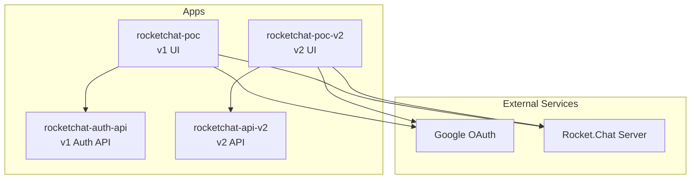
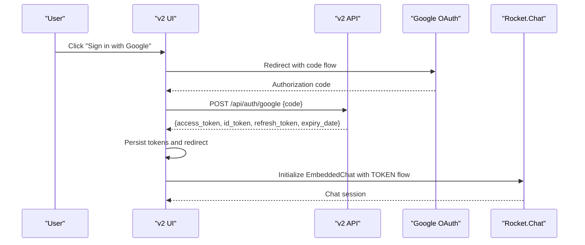
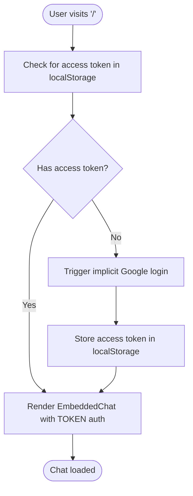
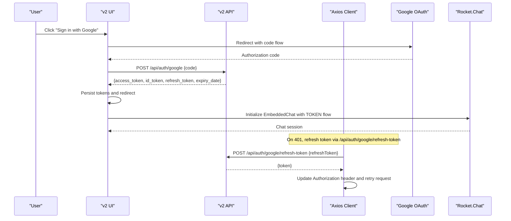
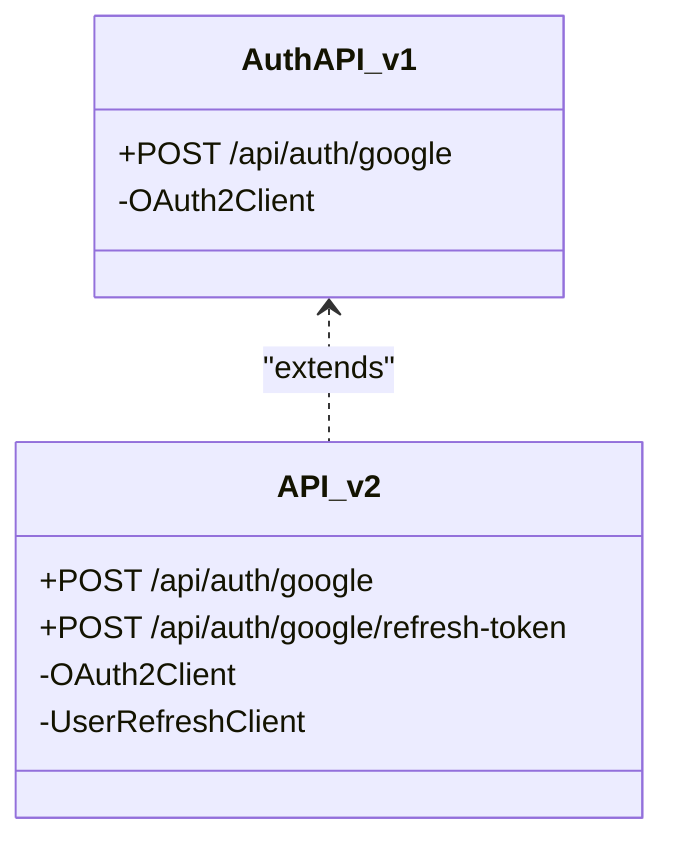
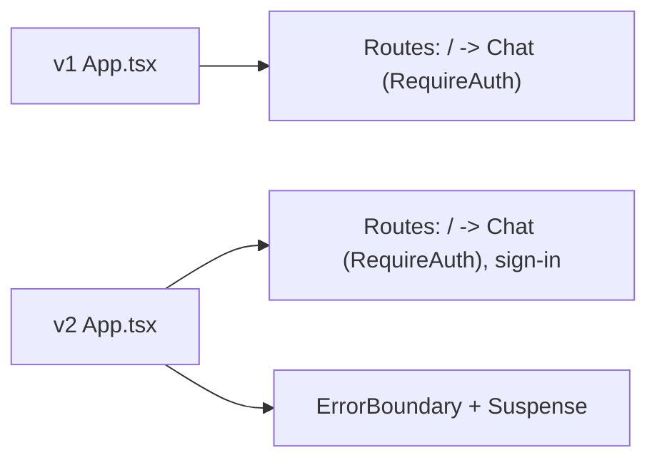
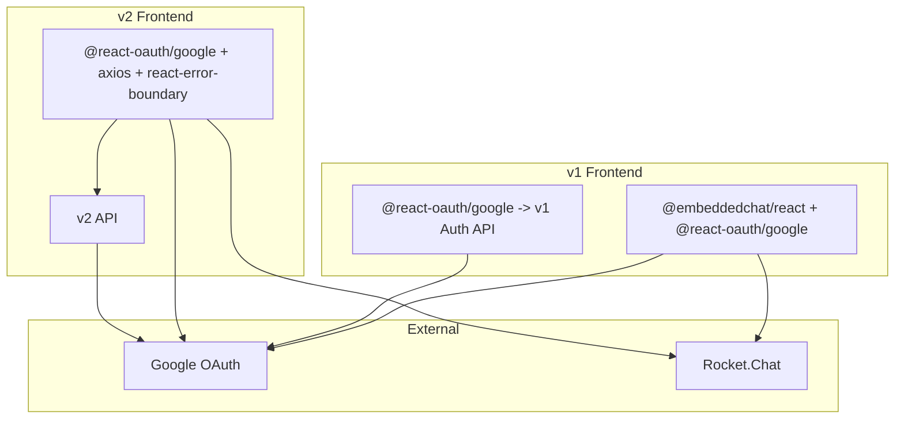

# Rocket.Chat Integrations

<cite>
**Referenced Files in This Document**
- [rocketchat-poc/src/app/app.tsx](file://apps/chat-pocs/rocketchat-poc/src/app/app.tsx)
- [rocketchat-poc/src/views/sign-in/sign-in.tsx](file://apps/chat-pocs/rocketchat-poc/src/views/sign-in/sign-in.tsx)
- [rocketchat-poc/src/utils/auth.ts](file://apps/chat-pocs/rocketchat-poc/src/utils/auth.ts)
- [rocketchat-poc/src/views/chat/chat.tsx](file://apps/chat-pocs/rocketchat-poc/src/views/chat/chat.tsx)
- [rocketchat-poc-v2/src/app/app.tsx](file://apps/chat-pocs/rocketchat-poc-v2/src/app/app.tsx)
- [rocketchat-poc-v2/src/views/sign-in/sign-in.tsx](file://apps/chat-pocs/rocketchat-poc-v2/src/views/sign-in/sign-in.tsx)
- [rocketchat-poc-v2/src/utils/auth.ts](file://apps/chat-pocs/rocketchat-poc-v2/src/utils/auth.ts)
- [rocketchat-poc-v2/src/utils/api.ts](file://apps/chat-pocs/rocketchat-poc-v2/src/utils/api.ts)
- [rocketchat-poc-v2/src/views/chat/chat.tsx](file://apps/chat-pocs/rocketchat-poc-v2/src/views/chat/chat.tsx)
- [rocketchat-auth-api/src/main.ts](file://apps/chat-pocs/rocketchat-auth-api/src/main.ts)
- [rocketchat-api-v2/src/main.ts](file://apps/chat-pocs/rocketchat-api-v2/src/main.ts)
- [rocketchat-api-v2/.example.env.local](file://apps/chat-pocs/rocketchat-api-v2/.example.env.local)
</cite>

## Table of Contents
1. [Introduction](#introduction)
2. [Project Structure](#project-structure)
3. [Core Components](#core-components)
4. [Architecture Overview](#architecture-overview)
5. [Detailed Component Analysis](#detailed-component-analysis)
6. [Dependency Analysis](#dependency-analysis)
7. [Performance Considerations](#performance-considerations)
8. [Troubleshooting Guide](#troubleshooting-guide)
9. [Conclusion](#conclusion)
10. [Appendices](#appendices)

## Introduction
This document explains the Rocket.Chat integration implementations across two versions in the monorepo: v1 and v2. It covers the evolution from a basic embedded chat integration to a more robust, scalable, and secure architecture. It documents the authentication flows, JWT token handling, API services, routing patterns, UI components, and configuration requirements. It also highlights the differences in authentication mechanisms, real-time communication handling, and user experience improvements between the two versions.

## Project Structure
The Rocket.Chat integrations live under apps/chat-pocs. Two primary UI applications demonstrate the evolution:
- v1: A minimal React app embedding Rocket.Chat via @embeddedchat/react with implicit Google OAuth flow.
- v2: A more advanced React app using explicit OAuth code flow, centralized token management, automatic token refresh, and improved UI/UX.

Key backend services:
- Authentication API service (v1): Minimal Express server exchanging Google OAuth authorization code for tokens.
- API v2: Enhanced Express server with explicit OAuth code flow and refresh-token endpoint.

**Diagram sources**
- [rocketchat-poc/src/app/app.tsx:7-22](file://apps/chat-pocs/rocketchat-poc/src/app/app.tsx#L7-L22)
- [rocketchat-poc-v2/src/app/app.tsx:18-52](file://apps/chat-pocs/rocketchat-poc-v2/src/app/app.tsx#L18-L52)
- [rocketchat-auth-api/src/main.ts:34-42](file://apps/chat-pocs/rocketchat-auth-api/src/main.ts#L34-L42)
- [rocketchat-api-v2/src/main.ts:24-40](file://apps/chat-pocs/rocketchat-api-v2/src/main.ts#L24-L40)

**Section sources**
- [rocketchat-poc/src/app/app.tsx:1-25](file://apps/chat-pocs/rocketchat-poc/src/app/app.tsx#L1-L25)
- [rocketchat-poc-v2/src/app/app.tsx:1-55](file://apps/chat-pocs/rocketchat-poc-v2/src/app/app.tsx#L1-L55)
- [rocketchat-auth-api/src/main.ts:1-59](file://apps/chat-pocs/rocketchat-auth-api/src/main.ts#L1-L59)
- [rocketchat-api-v2/src/main.ts:1-47](file://apps/chat-pocs/rocketchat-api-v2/src/main.ts#L1-L47)

## Core Components
- v1 UI routing and chat embedding:
  - Routing with React Router and a RequireAuth wrapper.
  - Embedded chat component configured with token-based credentials.
  - Local storage utilities for tokens.
- v2 UI routing, authentication, and API:
  - Lazy-loaded routes and error boundaries for resilience.
  - Explicit OAuth code flow with backend exchange.
  - Centralized Axios API client with automatic token refresh and error handling.
  - Enhanced token model including refresh token and expiry date.
- Backend services:
  - v1 Auth API: Exchanges authorization code for tokens.
  - v2 API: Adds refresh-token endpoint using UserRefreshClient.

**Section sources**
- [rocketchat-poc/src/app/app.tsx:1-25](file://apps/chat-pocs/rocketchat-poc/src/app/app.tsx#L1-L25)
- [rocketchat-poc/src/views/chat/chat.tsx:1-54](file://apps/chat-pocs/rocketchat-poc/src/views/chat/chat.tsx#L1-L54)
- [rocketchat-poc/src/utils/auth.ts:1-38](file://apps/chat-pocs/rocketchat-poc/src/utils/auth.ts#L1-L38)
- [rocketchat-poc-v2/src/app/app.tsx:1-55](file://apps/chat-pocs/rocketchat-poc-v2/src/app/app.tsx#L1-L55)
- [rocketchat-poc-v2/src/views/sign-in/sign-in.tsx:1-95](file://apps/chat-pocs/rocketchat-poc-v2/src/views/sign-in/sign-in.tsx#L1-L95)
- [rocketchat-poc-v2/src/utils/auth.ts:1-62](file://apps/chat-pocs/rocketchat-poc-v2/src/utils/auth.ts#L1-L62)
- [rocketchat-poc-v2/src/utils/api.ts:1-92](file://apps/chat-pocs/rocketchat-poc-v2/src/utils/api.ts#L1-L92)
- [rocketchat-auth-api/src/main.ts:34-42](file://apps/chat-pocs/rocketchat-auth-api/src/main.ts#L34-L42)
- [rocketchat-api-v2/src/main.ts:24-40](file://apps/chat-pocs/rocketchat-api-v2/src/main.ts#L24-L40)

## Architecture Overview
The v1 architecture embeds Rocket.Chat directly in the browser using implicit flow tokens. The v2 architecture separates concerns with explicit OAuth code flow, a dedicated backend service for token exchange, and a resilient API client with token refresh and error handling.

**Diagram sources**
- [rocketchat-poc-v2/src/views/sign-in/sign-in.tsx:24-40](file://apps/chat-pocs/rocketchat-poc-v2/src/views/sign-in/sign-in.tsx#L24-L40)
- [rocketchat-api-v2/src/main.ts:24-29](file://apps/chat-pocs/rocketchat-api-v2/src/main.ts#L24-L29)
- [rocketchat-poc-v2/src/utils/auth.ts:51-62](file://apps/chat-pocs/rocketchat-poc-v2/src/utils/auth.ts#L51-L62)
- [rocketchat-poc-v2/src/views/chat/chat.tsx:1-54](file://apps/chat-pocs/rocketchat-poc-v2/src/views/chat/chat.tsx#L1-L54)

## Detailed Component Analysis

### v1 Authentication and Chat Embedding
- Routing:
  - Root route renders RequireAuth wrapper around Chat.
- Authentication:
  - Uses implicit flow via @react-oauth/google to obtain an access token.
  - Stores tokens in localStorage and passes them to the embedded chat.
- Chat embedding:
  - Initializes @embeddedchat/react with host, room, and auth credentials using TOKEN flow.
- Limitations:
  - Implicit flow tokens are stored in localStorage without refresh logic.
  - No centralized API client or error handling.

**Diagram sources**
- [rocketchat-poc/src/views/chat/chat.tsx:15-31](file://apps/chat-pocs/rocketchat-poc/src/views/chat/chat.tsx#L15-L31)
- [rocketchat-poc/src/utils/auth.ts:7-14](file://apps/chat-pocs/rocketchat-poc/src/utils/auth.ts#L7-L14)

**Section sources**
- [rocketchat-poc/src/app/app.tsx:7-22](file://apps/chat-pocs/rocketchat-poc/src/app/app.tsx#L7-L22)
- [rocketchat-poc/src/views/chat/chat.tsx:1-54](file://apps/chat-pocs/rocketchat-poc/src/views/chat/chat.tsx#L1-L54)
- [rocketchat-poc/src/utils/auth.ts:1-38](file://apps/chat-pocs/rocketchat-poc/src/utils/auth.ts#L1-L38)

### v2 Authentication and API Client
- Routing:
  - Lazy-loaded routes with ErrorBoundary and Suspense for resilience.
- Authentication:
  - Explicit OAuth code flow exchanges code for tokens via backend.
  - Enhanced token model includes access_token, id_token, refresh_token, and expiry_date.
- API client:
  - Centralized Axios instance with request interceptor adding Authorization header.
  - Automatic token refresh via axios-auth-refresh on 401 errors.
  - Toast notifications for server-side validation errors.
- Chat embedding:
  - Same TOKEN flow as v1 but with robust token lifecycle.

**Diagram sources**
- [rocketchat-poc-v2/src/views/sign-in/sign-in.tsx:24-40](file://apps/chat-pocs/rocketchat-poc-v2/src/views/sign-in/sign-in.tsx#L24-L40)
- [rocketchat-api-v2/src/main.ts:24-40](file://apps/chat-pocs/rocketchat-api-v2/src/main.ts#L24-L40)
- [rocketchat-poc-v2/src/utils/api.ts:18-33](file://apps/chat-pocs/rocketchat-poc-v2/src/utils/api.ts#L18-L33)
- [rocketchat-poc-v2/src/utils/auth.ts:51-62](file://apps/chat-pocs/rocketchat-poc-v2/src/utils/auth.ts#L51-L62)
- [rocketchat-poc-v2/src/views/chat/chat.tsx:1-54](file://apps/chat-pocs/rocketchat-poc-v2/src/views/chat/chat.tsx#L1-L54)

**Section sources**
- [rocketchat-poc-v2/src/app/app.tsx:18-52](file://apps/chat-pocs/rocketchat-poc-v2/src/app/app.tsx#L18-L52)
- [rocketchat-poc-v2/src/views/sign-in/sign-in.tsx:1-95](file://apps/chat-pocs/rocketchat-poc-v2/src/views/sign-in/sign-in.tsx#L1-L95)
- [rocketchat-poc-v2/src/utils/auth.ts:1-62](file://apps/chat-pocs/rocketchat-poc-v2/src/utils/auth.ts#L1-L62)
- [rocketchat-poc-v2/src/utils/api.ts:1-92](file://apps/chat-pocs/rocketchat-poc-v2/src/utils/api.ts#L1-L92)

### Authentication API Services
- v1 Auth API:
  - Minimal Express server exposing /api/auth/google to exchange authorization code for tokens.
  - Uses OAuth2Client with postmessage redirect URI.
- v2 API:
  - Extends v1 with /api/auth/google/refresh-token endpoint using UserRefreshClient.
  - Environment variables for client ID/secret and port.

**Diagram sources**
- [rocketchat-auth-api/src/main.ts:34-42](file://apps/chat-pocs/rocketchat-auth-api/src/main.ts#L34-L42)
- [rocketchat-api-v2/src/main.ts:24-40](file://apps/chat-pocs/rocketchat-api-v2/src/main.ts#L24-L40)

**Section sources**
- [rocketchat-auth-api/src/main.ts:1-59](file://apps/chat-pocs/rocketchat-auth-api/src/main.ts#L1-L59)
- [rocketchat-api-v2/src/main.ts:1-47](file://apps/chat-pocs/rocketchat-api-v2/src/main.ts#L1-L47)
- [rocketchat-api-v2/.example.env.local:1-5](file://apps/chat-pocs/rocketchat-api-v2/.example.env.local#L1-L5)

### Component Architecture and Routing Patterns
- v1:
  - Simple routing with React Router.
  - RequireAuth wrapper ensures protected routes.
- v2:
  - Lazy loading with React.lazy and Suspense.
  - Error boundary wrapping for graceful error handling.
  - Protected routes with RequireAuth.

**Diagram sources**
- [rocketchat-poc/src/app/app.tsx:7-22](file://apps/chat-pocs/rocketchat-poc/src/app/app.tsx#L7-L22)
- [rocketchat-poc-v2/src/app/app.tsx:18-52](file://apps/chat-pocs/rocketchat-poc-v2/src/app/app.tsx#L18-L52)

**Section sources**
- [rocketchat-poc/src/app/app.tsx:1-25](file://apps/chat-pocs/rocketchat-poc/src/app/app.tsx#L1-L25)
- [rocketchat-poc-v2/src/app/app.tsx:1-55](file://apps/chat-pocs/rocketchat-poc-v2/src/app/app.tsx#L1-L55)

### User Interface Implementations
- v1:
  - SignIn component integrates GoogleLogin and stores idToken/access token in localStorage.
  - Chat component initializes EmbeddedChat with TOKEN flow.
- v2:
  - SignIn component uses explicit code flow and posts code to backend.
  - Enhanced token persistence and UI error messages.
  - Chat component remains similar but benefits from robust token lifecycle.

**Section sources**
- [rocketchat-poc/src/views/sign-in/sign-in.tsx:1-129](file://apps/chat-pocs/rocketchat-poc/src/views/sign-in/sign-in.tsx#L1-L129)
- [rocketchat-poc/src/views/chat/chat.tsx:1-54](file://apps/chat-pocs/rocketchat-poc/src/views/chat/chat.tsx#L1-L54)
- [rocketchat-poc-v2/src/views/sign-in/sign-in.tsx:1-95](file://apps/chat-pocs/rocketchat-poc-v2/src/views/sign-in/sign-in.tsx#L1-L95)
- [rocketchat-poc-v2/src/views/chat/chat.tsx:1-54](file://apps/chat-pocs/rocketchat-poc-v2/src/views/chat/chat.tsx#L1-L54)

## Dependency Analysis
- Frontend dependencies:
  - v1: @embeddedchat/react, @react-oauth/google, @redesignhealth/ui.
  - v2: @chakra-ui/react, @react-oauth/google, axios, axios-auth-refresh, react-error-boundary, @tanstack/react-query, react-toastify.
- Backend dependencies:
  - google-auth-library (OAuth2Client, UserRefreshClient).
- Interactions:
  - v1 UI communicates directly with Google and Rocket.Chat; token exchange handled by v1 Auth API.
  - v2 UI communicates with backend API for token exchange and refresh; Rocket.Chat receives TOKEN credentials.

**Diagram sources**
- [rocketchat-poc/src/views/chat/chat.tsx:37-50](file://apps/chat-pocs/rocketchat-poc/src/views/chat/chat.tsx#L37-L50)
- [rocketchat-poc-v2/src/views/sign-in/sign-in.tsx:24-40](file://apps/chat-pocs/rocketchat-poc-v2/src/views/sign-in/sign-in.tsx#L24-L40)
- [rocketchat-auth-api/src/main.ts:34-42](file://apps/chat-pocs/rocketchat-auth-api/src/main.ts#L34-L42)
- [rocketchat-api-v2/src/main.ts:24-40](file://apps/chat-pocs/rocketchat-api-v2/src/main.ts#L24-L40)

**Section sources**
- [rocketchat-poc/src/views/chat/chat.tsx:1-54](file://apps/chat-pocs/rocketchat-poc/src/views/chat/chat.tsx#L1-L54)
- [rocketchat-poc-v2/src/views/sign-in/sign-in.tsx:1-95](file://apps/chat-pocs/rocketchat-poc-v2/src/views/sign-in/sign-in.tsx#L1-L95)
- [rocketchat-auth-api/src/main.ts:1-59](file://apps/chat-pocs/rocketchat-auth-api/src/main.ts#L1-L59)
- [rocketchat-api-v2/src/main.ts:1-47](file://apps/chat-pocs/rocketchat-api-v2/src/main.ts#L1-L47)

## Performance Considerations
- Token lifecycle:
  - v2 introduces automatic token refresh on 401, reducing manual refresh logic and improving reliability.
- Network efficiency:
  - Centralized Axios client reduces redundant token checks and improves error handling.
- UI responsiveness:
  - Lazy loading and error boundaries improve perceived performance and stability.

[No sources needed since this section provides general guidance]

## Troubleshooting Guide
- Authentication failures:
  - Verify environment variables for client ID/secret and port in the v2 API service.
  - Ensure the redirect URI matches the configured OAuth client.
- Token refresh errors:
  - Confirm refresh-token endpoint is reachable and the refresh token is present in localStorage.
  - Check that the backend responds with a new access token on refresh requests.
- Embedded chat initialization:
  - Ensure the host and room identifiers are correct and the TOKEN credentials are properly set.

**Section sources**
- [rocketchat-api-v2/.example.env.local:1-5](file://apps/chat-pocs/rocketchat-api-v2/.example.env.local#L1-L5)
- [rocketchat-api-v2/src/main.ts:31-40](file://apps/chat-pocs/rocketchat-api-v2/src/main.ts#L31-L40)
- [rocketchat-poc-v2/src/utils/api.ts:18-33](file://apps/chat-pocs/rocketchat-poc-v2/src/utils/api.ts#L18-L33)

## Conclusion
The Rocket.Chat integrations evolved from a simple embedded chat with implicit OAuth in v1 to a robust, scalable solution in v2 featuring explicit OAuth code flow, centralized token management, automatic refresh, and resilient UI patterns. These improvements enhance security, maintainability, and user experience while preserving compatibility with Rocket.Chat’s TOKEN-based authentication.

[No sources needed since this section summarizes without analyzing specific files]

## Appendices

### Configuration Requirements
- v2 API environment variables:
  - ROCKETCHAT_POC_CLIENT_ID
  - ROCKETCHAT_POC_CLIENT_SECRET
  - PORT

**Section sources**
- [rocketchat-api-v2/.example.env.local:1-5](file://apps/chat-pocs/rocketchat-api-v2/.example.env.local#L1-L5)

### Integration Patterns with Rocket.Chat
- Authentication:
  - v1: Implicit flow tokens stored locally; Rocket.Chat receives TOKEN credentials.
  - v2: Explicit code flow; backend exchanges code for tokens; TOKEN credentials include idToken and accessToken.
- Real-time communication:
  - Both versions rely on @embeddedchat/react for chat rendering and TOKEN-based authentication.
- User experience:
  - v2 adds lazy loading, error boundaries, toast notifications, and centralized API client for smoother UX.

**Section sources**
- [rocketchat-poc/src/views/chat/chat.tsx:37-50](file://apps/chat-pocs/rocketchat-poc/src/views/chat/chat.tsx#L37-L50)
- [rocketchat-poc-v2/src/views/chat/chat.tsx:1-54](file://apps/chat-pocs/rocketchat-poc-v2/src/views/chat/chat.tsx#L1-L54)
- [rocketchat-poc-v2/src/utils/api.ts:1-92](file://apps/chat-pocs/rocketchat-poc-v2/src/utils/api.ts#L1-L92)