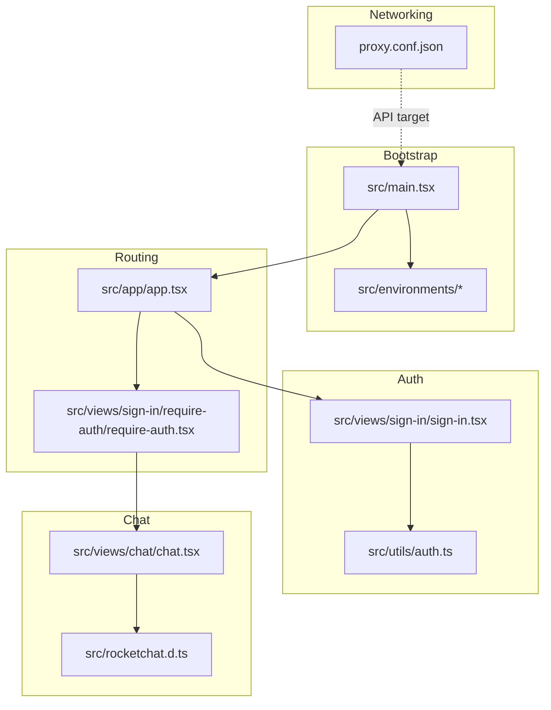
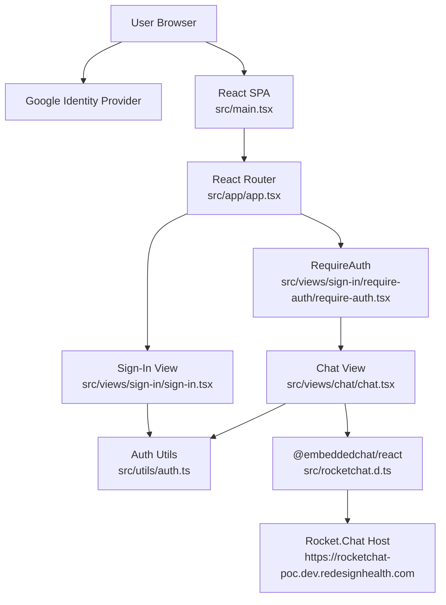
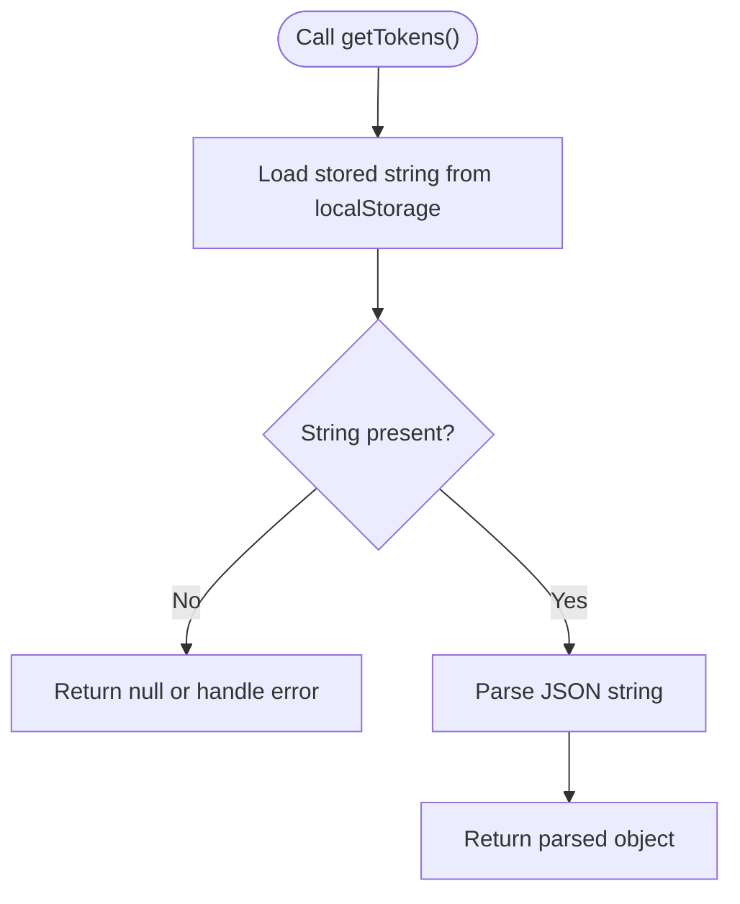
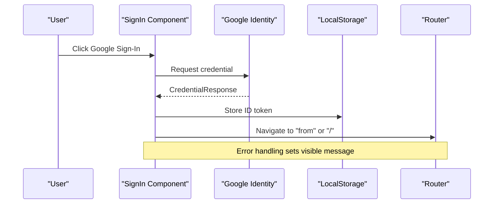
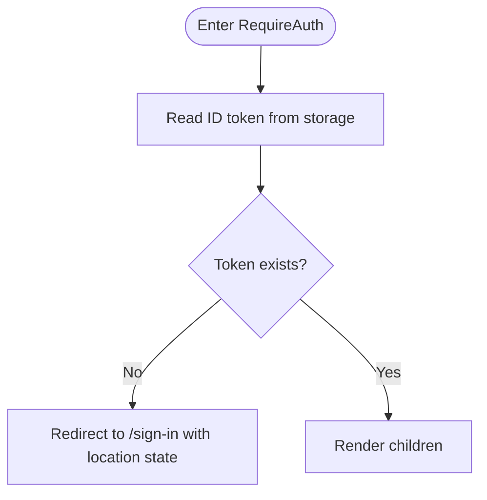
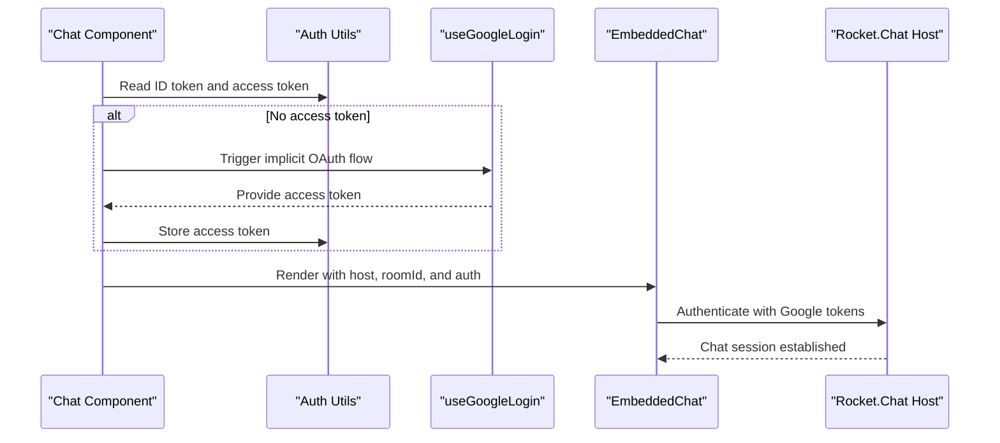
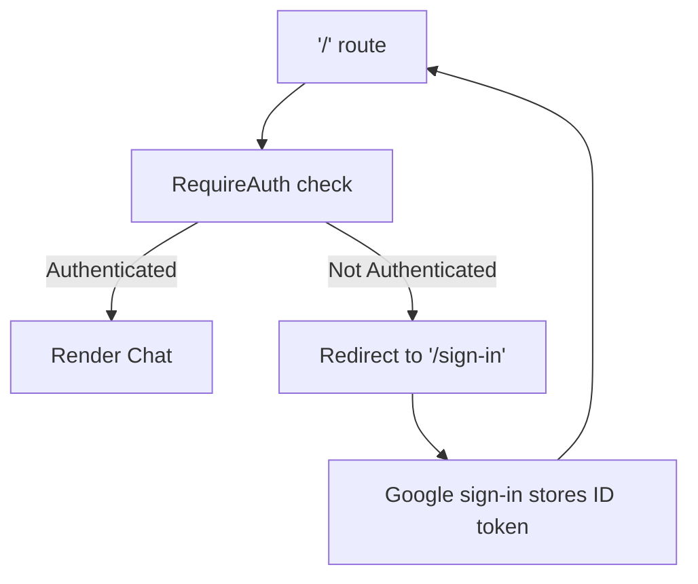
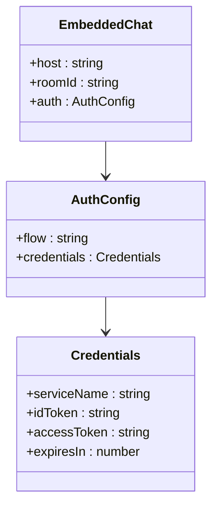
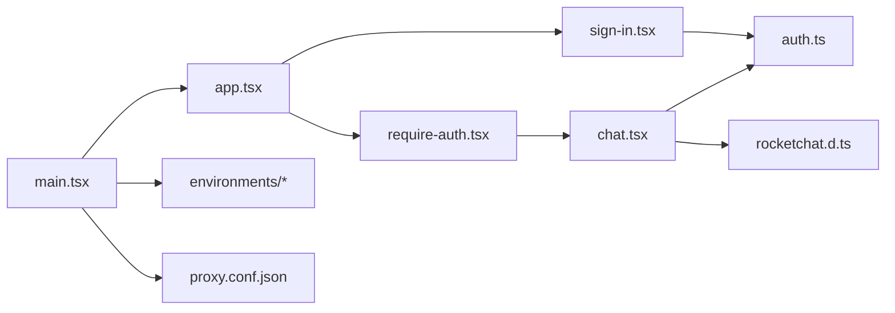

# Rocket.Chat POC v1

<cite>
**Referenced Files in This Document**
- [main.tsx](file://apps/chat-pocs/rocketchat-poc/src/main.tsx)
- [app.tsx](file://apps/chat-pocs/rocketchat-poc/src/app/app.tsx)
- [environment.ts](file://apps/chat-pocs/rocketchat-poc/src/environments/environment.ts)
- [environment.prod.ts](file://apps/chat-pocs/rocketchat-poc/src/environments/environment.prod.ts)
- [auth.ts](file://apps/chat-pocs/rocketchat-poc/src/utils/auth.ts)
- [sign-in.tsx](file://apps/chat-pocs/rocketchat-poc/src/views/sign-in/sign-in.tsx)
- [require-auth.tsx](file://apps/chat-pocs/rocketchat-poc/src/views/sign-in/require-auth/require-auth.tsx)
- [chat.tsx](file://apps/chat-pocs/rocketchat-poc/src/views/chat/chat.tsx)
- [rocketchat.d.ts](file://apps/chat-pocs/rocketchat-poc/src/rocketchat.d.ts)
- [proxy.conf.json](file://apps/chat-pocs/rocketchat-poc/proxy.conf.json)
</cite>

## Table of Contents
1. [Introduction](#introduction)
2. [Project Structure](#project-structure)
3. [Core Components](#core-components)
4. [Architecture Overview](#architecture-overview)
5. [Detailed Component Analysis](#detailed-component-analysis)
6. [Dependency Analysis](#dependency-analysis)
7. [Performance Considerations](#performance-considerations)
8. [Troubleshooting Guide](#troubleshooting-guide)
9. [Conclusion](#conclusion)
10. [Appendices](#appendices)

## Introduction
This document describes the Rocket.Chat Proof of Concept v1 (POC v1) implementation. It explains the basic chat integration architecture, Google OAuth authentication flow, component structure, routing patterns, environment configuration, authentication utilities, and integration with Rocket.Chat's embedded chat. It also covers the React component architecture, state management patterns, and user interface implementation. Finally, it provides setup instructions, configuration requirements, troubleshooting guidance, and highlights the limitations of the v1 implementation to prepare the foundation for understanding v2 improvements.

## Project Structure
The Rocket.Chat POC v1 is a React application organized around a small set of focused modules:
- Application bootstrap and providers
- Routing and protected routes
- Authentication utilities and sign-in view
- Chat interface using Rocket.Chat's embedded chat component
- Environment configuration
- Proxy configuration for API requests

**Diagram sources**
- [main.tsx:1-24](file://apps/chat-pocs/rocketchat-poc/src/main.tsx#L1-L24)
- [app.tsx:1-25](file://apps/chat-pocs/rocketchat-poc/src/app/app.tsx#L1-L25)
- [require-auth.tsx:1-21](file://apps/chat-pocs/rocketchat-poc/src/views/sign-in/require-auth/require-auth.tsx#L1-L21)
- [sign-in.tsx:1-129](file://apps/chat-pocs/rocketchat-poc/src/views/sign-in/sign-in.tsx#L1-L129)
- [auth.ts:1-38](file://apps/chat-pocs/rocketchat-poc/src/utils/auth.ts#L1-L38)
- [chat.tsx:1-54](file://apps/chat-pocs/rocketchat-poc/src/views/chat/chat.tsx#L1-L54)
- [rocketchat.d.ts:1-2](file://apps/chat-pocs/rocketchat-poc/src/rocketchat.d.ts#L1-L2)
- [proxy.conf.json:1-7](file://apps/chat-pocs/rocketchat-poc/proxy.conf.json#L1-L7)

**Section sources**
- [main.tsx:1-24](file://apps/chat-pocs/rocketchat-poc/src/main.tsx#L1-L24)
- [app.tsx:1-25](file://apps/chat-pocs/rocketchat-poc/src/app/app.tsx#L1-L25)
- [environment.ts:1-7](file://apps/chat-pocs/rocketchat-poc/src/environments/environment.ts#L1-L7)
- [environment.prod.ts:1-4](file://apps/chat-pocs/rocketchat-poc/src/environments/environment.prod.ts#L1-L4)
- [proxy.conf.json:1-7](file://apps/chat-pocs/rocketchat-poc/proxy.conf.json#L1-L7)

## Core Components
- Bootstrap and Providers: Initializes React, routing, theming, and Google OAuth provider.
- App and Routing: Declares sign-in and protected chat routes.
- Authentication Utilities: Manages tokens in local storage for API calls.
- Sign-In View: Handles Google credential-based sign-in and redirects.
- Protected Route Wrapper: Enforces authentication via token presence.
- Chat View: Integrates Rocket.Chat embedded chat with implicit OAuth flow and token-based authentication.

Key implementation references:
- Providers and root render: [main.tsx:1-24](file://apps/chat-pocs/rocketchat-poc/src/main.tsx#L1-L24)
- Routing and protected route: [app.tsx:1-25](file://apps/chat-pocs/rocketchat-poc/src/app/app.tsx#L1-L25), [require-auth.tsx:1-21](file://apps/chat-pocs/rocketchat-poc/src/views/sign-in/require-auth/require-auth.tsx#L1-L21)
- Tokens utilities: [auth.ts:1-38](file://apps/chat-pocs/rocketchat-poc/src/utils/auth.ts#L1-L38)
- Sign-in flow: [sign-in.tsx:1-129](file://apps/chat-pocs/rocketchat-poc/src/views/sign-in/sign-in.tsx#L1-L129)
- Chat integration: [chat.tsx:1-54](file://apps/chat-pocs/rocketchat-poc/src/views/chat/chat.tsx#L1-L54)

**Section sources**
- [main.tsx:1-24](file://apps/chat-pocs/rocketchat-poc/src/main.tsx#L1-L24)
- [app.tsx:1-25](file://apps/chat-pocs/rocketchat-poc/src/app/app.tsx#L1-L25)
- [auth.ts:1-38](file://apps/chat-pocs/rocketchat-poc/src/utils/auth.ts#L1-L38)
- [sign-in.tsx:1-129](file://apps/chat-pocs/rocketchat-poc/src/views/sign-in/sign-in.tsx#L1-L129)
- [require-auth.tsx:1-21](file://apps/chat-pocs/rocketchat-poc/src/views/sign-in/require-auth/require-auth.tsx#L1-L21)
- [chat.tsx:1-54](file://apps/chat-pocs/rocketchat-poc/src/views/chat/chat.tsx#L1-L54)

## Architecture Overview
The v1 architecture follows a client-side React SPA pattern with:
- Google OAuth for identity
- Local storage for token persistence
- Protected routing to gate the chat interface
- Embedded Rocket.Chat widget for chat UI

**Diagram sources**
- [main.tsx:1-24](file://apps/chat-pocs/rocketchat-poc/src/main.tsx#L1-L24)
- [app.tsx:1-25](file://apps/chat-pocs/rocketchat-poc/src/app/app.tsx#L1-L25)
- [require-auth.tsx:1-21](file://apps/chat-pocs/rocketchat-poc/src/views/sign-in/require-auth/require-auth.tsx#L1-L21)
- [sign-in.tsx:1-129](file://apps/chat-pocs/rocketchat-poc/src/views/sign-in/sign-in.tsx#L1-L129)
- [auth.ts:1-38](file://apps/chat-pocs/rocketchat-poc/src/utils/auth.ts#L1-L38)
- [chat.tsx:1-54](file://apps/chat-pocs/rocketchat-poc/src/views/chat/chat.tsx#L1-L54)
- [rocketchat.d.ts:1-2](file://apps/chat-pocs/rocketchat-poc/src/rocketchat.d.ts#L1-L2)

## Detailed Component Analysis

### Authentication Utilities
The authentication utilities provide a simple abstraction over local storage for tokens:
- Access token retrieval and storage
- ID token retrieval and storage
- Combined tokens retrieval and parsing

**Diagram sources**
- [auth.ts:25-37](file://apps/chat-pocs/rocketchat-poc/src/utils/auth.ts#L25-L37)

**Section sources**
- [auth.ts:1-38](file://apps/chat-pocs/rocketchat-poc/src/utils/auth.ts#L1-L38)

### Sign-In Mechanism
The sign-in view integrates Google OAuth via the credential response flow:
- Renders a Google login button
- On success, stores the ID token in local storage
- Navigates to the intended destination or root
- Displays an error message on failure

**Diagram sources**
- [sign-in.tsx:99-113](file://apps/chat-pocs/rocketchat-poc/src/views/sign-in/sign-in.tsx#L99-L113)
- [auth.ts:16-23](file://apps/chat-pocs/rocketchat-poc/src/utils/auth.ts#L16-L23)

**Section sources**
- [sign-in.tsx:1-129](file://apps/chat-pocs/rocketchat-poc/src/views/sign-in/sign-in.tsx#L1-L129)
- [auth.ts:1-38](file://apps/chat-pocs/rocketchat-poc/src/utils/auth.ts#L1-L38)

### Protected Route Wrapper
The RequireAuth component enforces authentication by checking for an ID token:
- Reads ID token from local storage
- Redirects unauthenticated users to the sign-in page with location state
- Renders children when authenticated

**Diagram sources**
- [require-auth.tsx:5-18](file://apps/chat-pocs/rocketchat-poc/src/views/sign-in/require-auth/require-auth.tsx#L5-L18)
- [auth.ts:16-18](file://apps/chat-pocs/rocketchat-poc/src/utils/auth.ts#L16-L18)

**Section sources**
- [require-auth.tsx:1-21](file://apps/chat-pocs/rocketchat-poc/src/views/sign-in/require-auth/require-auth.tsx#L1-L21)
- [auth.ts:1-38](file://apps/chat-pocs/rocketchat-poc/src/utils/auth.ts#L1-L38)

### Chat Interface Implementation
The chat view integrates Rocket.Chat via the embedded chat component:
- Retrieves ID and access tokens from local storage
- Uses an implicit Google OAuth flow to obtain an access token when missing
- Renders the embedded chat with token-based authentication

**Diagram sources**
- [chat.tsx:10-51](file://apps/chat-pocs/rocketchat-poc/src/views/chat/chat.tsx#L10-L51)
- [auth.ts:7-14](file://apps/chat-pocs/rocketchat-poc/src/utils/auth.ts#L7-L14)
- [rocketchat.d.ts:1-2](file://apps/chat-pocs/rocketchat-poc/src/rocketchat.d.ts#L1-L2)

**Section sources**
- [chat.tsx:1-54](file://apps/chat-pocs/rocketchat-poc/src/views/chat/chat.tsx#L1-L54)
- [auth.ts:1-38](file://apps/chat-pocs/rocketchat-poc/src/utils/auth.ts#L1-L38)
- [rocketchat.d.ts:1-2](file://apps/chat-pocs/rocketchat-poc/src/rocketchat.d.ts#L1-L2)

### Routing Patterns
The application defines two primary routes:
- Sign-in route: Public access for authentication
- Root route: Protected, requiring an ID token via RequireAuth wrapper

**Diagram sources**
- [app.tsx:7-22](file://apps/chat-pocs/rocketchat-poc/src/app/app.tsx#L7-L22)
- [require-auth.tsx:5-18](file://apps/chat-pocs/rocketchat-poc/src/views/sign-in/require-auth/require-auth.tsx#L5-L18)

**Section sources**
- [app.tsx:1-25](file://apps/chat-pocs/rocketchat-poc/src/app/app.tsx#L1-L25)
- [require-auth.tsx:1-21](file://apps/chat-pocs/rocketchat-poc/src/views/sign-in/require-auth/require-auth.tsx#L1-L21)

### Environment Configuration
Environment files define the production flag used by the build system:
- Development environment sets production to false
- Production environment sets production to true

These files are referenced by the build pipeline and can be extended to include API endpoints and feature flags.

**Section sources**
- [environment.ts:1-7](file://apps/chat-pocs/rocketchat-poc/src/environments/environment.ts#L1-L7)
- [environment.prod.ts:1-4](file://apps/chat-pocs/rocketchat-poc/src/environments/environment.prod.ts#L1-L4)

### Integration with Rocket.Chat's Embedded Chat
The chat integration leverages the @embeddedchat/react component:
- Declares module typing for the embedded chat package
- Configures the host, room ID, and authentication credentials
- Uses Google OAuth tokens for service-based authentication

**Diagram sources**
- [chat.tsx:36-50](file://apps/chat-pocs/rocketchat-poc/src/views/chat/chat.tsx#L36-L50)
- [rocketchat.d.ts:1-2](file://apps/chat-pocs/rocketchat-poc/src/rocketchat.d.ts#L1-L2)

**Section sources**
- [chat.tsx:1-54](file://apps/chat-pocs/rocketchat-poc/src/views/chat/chat.tsx#L1-L54)
- [rocketchat.d.ts:1-2](file://apps/chat-pocs/rocketchat-poc/src/rocketchat.d.ts#L1-L2)

## Dependency Analysis
The v1 implementation has minimal coupling and clear boundaries:
- Bootstrap depends on routing, theming, and Google OAuth providers
- Views depend on utilities for authentication
- Chat view depends on the embedded chat component and environment-specific host configuration
- Proxy configuration supports local API development targets

**Diagram sources**
- [main.tsx:1-24](file://apps/chat-pocs/rocketchat-poc/src/main.tsx#L1-L24)
- [app.tsx:1-25](file://apps/chat-pocs/rocketchat-poc/src/app/app.tsx#L1-L25)
- [sign-in.tsx:1-129](file://apps/chat-pocs/rocketchat-poc/src/views/sign-in/sign-in.tsx#L1-L129)
- [require-auth.tsx:1-21](file://apps/chat-pocs/rocketchat-poc/src/views/sign-in/require-auth/require-auth.tsx#L1-L21)
- [chat.tsx:1-54](file://apps/chat-pocs/rocketchat-poc/src/views/chat/chat.tsx#L1-L54)
- [auth.ts:1-38](file://apps/chat-pocs/rocketchat-poc/src/utils/auth.ts#L1-L38)
- [rocketchat.d.ts:1-2](file://apps/chat-pocs/rocketchat-poc/src/rocketchat.d.ts#L1-L2)
- [environment.ts:1-7](file://apps/chat-pocs/rocketchat-poc/src/environments/environment.ts#L1-L7)
- [proxy.conf.json:1-7](file://apps/chat-pocs/rocketchat-poc/proxy.conf.json#L1-L7)

**Section sources**
- [main.tsx:1-24](file://apps/chat-pocs/rocketchat-poc/src/main.tsx#L1-L24)
- [app.tsx:1-25](file://apps/chat-pocs/rocketchat-poc/src/app/app.tsx#L1-L25)
- [chat.tsx:1-54](file://apps/chat-pocs/rocketchat-poc/src/views/chat/chat.tsx#L1-L54)
- [auth.ts:1-38](file://apps/chat-pocs/rocketchat-poc/src/utils/auth.ts#L1-L38)
- [proxy.conf.json:1-7](file://apps/chat-pocs/rocketchat-poc/proxy.conf.json#L1-L7)

## Performance Considerations
- Token caching: Using local storage avoids repeated network calls for tokens during the session.
- Conditional rendering: The chat view renders a loader while obtaining the access token, preventing unnecessary re-renders.
- Minimal dependencies: The app relies on lightweight libraries, reducing bundle size and initial load time.
- Network optimization: The proxy configuration simplifies local development by routing API calls to a backend server.

[No sources needed since this section provides general guidance]

## Troubleshooting Guide
Common integration issues and resolutions:
- Missing ID token after sign-in
  - Verify the credential response handler stores the ID token and navigates correctly.
  - Confirm local storage contains the ID token before accessing the chat route.
  - Reference: [sign-in.tsx:101-108](file://apps/chat-pocs/rocketchat-poc/src/views/sign-in/sign-in.tsx#L101-L108), [auth.ts:16-23](file://apps/chat-pocs/rocketchat-poc/src/utils/auth.ts#L16-L23)
- Redirect loop to sign-in
  - Ensure RequireAuth reads the ID token and redirects only when absent.
  - Check that the navigation state preserves the intended destination.
  - Reference: [require-auth.tsx:5-18](file://apps/chat-pocs/rocketchat-poc/src/views/sign-in/require-auth/require-auth.tsx#L5-L18)
- Access token not available for embedded chat
  - Confirm the implicit OAuth flow triggers and stores the access token.
  - Verify the chat view conditionally renders the loader until the token is present.
  - Reference: [chat.tsx:17-35](file://apps/chat-pocs/rocketchat-poc/src/views/chat/chat.tsx#L17-L35)
- Rocket.Chat host configuration
  - Ensure the host URL matches the deployed Rocket.Chat instance.
  - Reference: [chat.tsx](file://apps/chat-pocs/rocketchat-poc/src/views/chat/chat.tsx#L38)
- API proxy misconfiguration
  - Validate the proxy target points to the correct backend port.
  - Reference: [proxy.conf.json:1-7](file://apps/chat-pocs/rocketchat-poc/proxy.conf.json#L1-L7)

**Section sources**
- [sign-in.tsx:1-129](file://apps/chat-pocs/rocketchat-poc/src/views/sign-in/sign-in.tsx#L1-L129)
- [require-auth.tsx:1-21](file://apps/chat-pocs/rocketchat-poc/src/views/sign-in/require-auth/require-auth.tsx#L1-L21)
- [chat.tsx:1-54](file://apps/chat-pocs/rocketchat-poc/src/views/chat/chat.tsx#L1-L54)
- [auth.ts:1-38](file://apps/chat-pocs/rocketchat-poc/src/utils/auth.ts#L1-L38)
- [proxy.conf.json:1-7](file://apps/chat-pocs/rocketchat-poc/proxy.conf.json#L1-L7)

## Conclusion
The Rocket.Chat POC v1 establishes a clean, minimal architecture for integrating Rocket.Chat into a React SPA using Google OAuth. It demonstrates:
- A clear separation between sign-in, routing protection, and chat presentation
- Practical token management via local storage
- Seamless integration with Rocket.Chat's embedded chat component
- A foundation for future enhancements such as improved error handling, token refresh, and backend API integration

Limitations of v1 include:
- Implicit OAuth flow for access tokens in the browser
- Basic token persistence without refresh mechanisms
- Simplified error handling and UX
- Static host configuration

These observations set the stage for v2 improvements.

[No sources needed since this section summarizes without analyzing specific files]

## Appendices

### Setup Instructions
- Install dependencies for the Rocket.Chat POC app
- Start the development server with the configured proxy
- Open the application in a browser and sign in with Google
- Access the chat interface after successful authentication

References:
- [main.tsx:1-24](file://apps/chat-pocs/rocketchat-poc/src/main.tsx#L1-L24)
- [proxy.conf.json:1-7](file://apps/chat-pocs/rocketchat-poc/proxy.conf.json#L1-L7)

**Section sources**
- [main.tsx:1-24](file://apps/chat-pocs/rocketchat-poc/src/main.tsx#L1-L24)
- [proxy.conf.json:1-7](file://apps/chat-pocs/rocketchat-poc/proxy.conf.json#L1-L7)