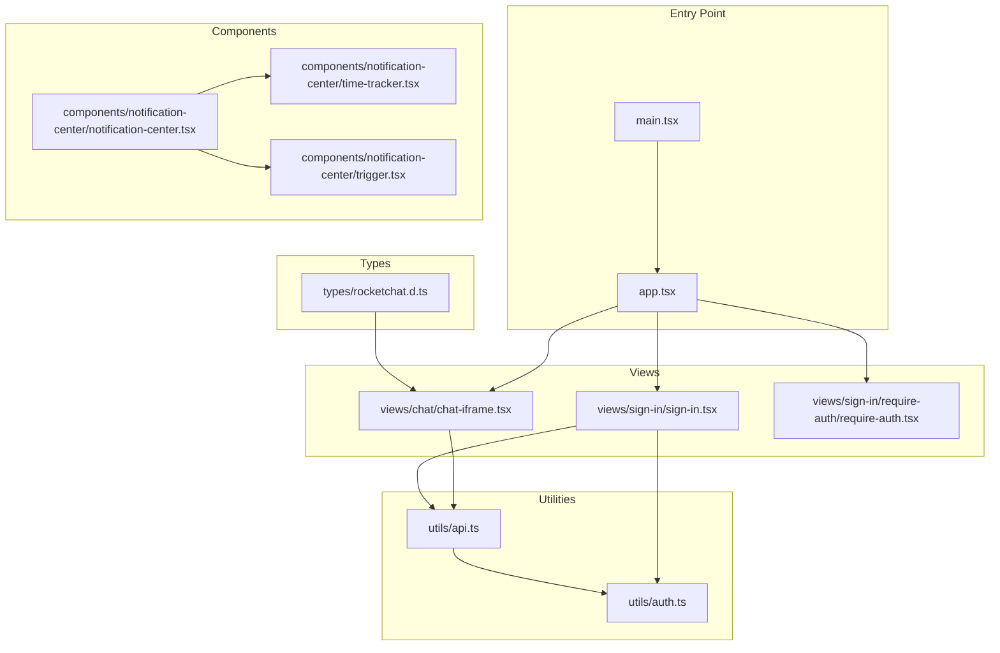
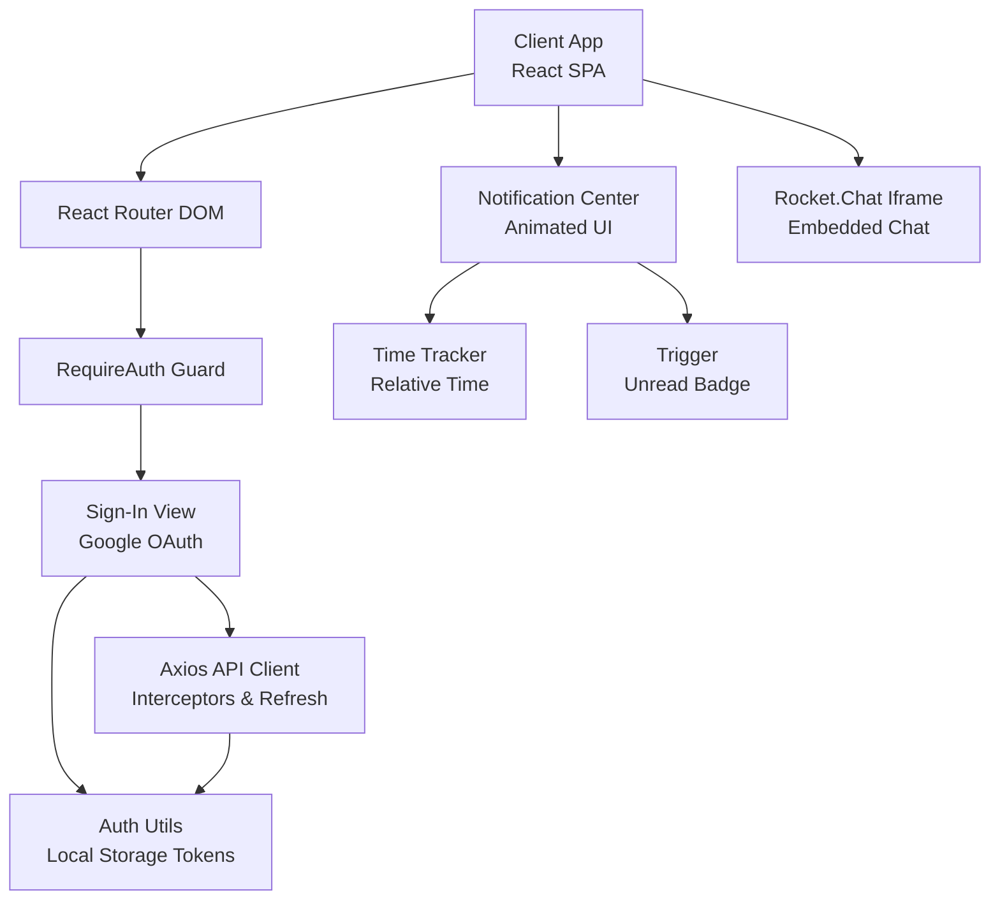
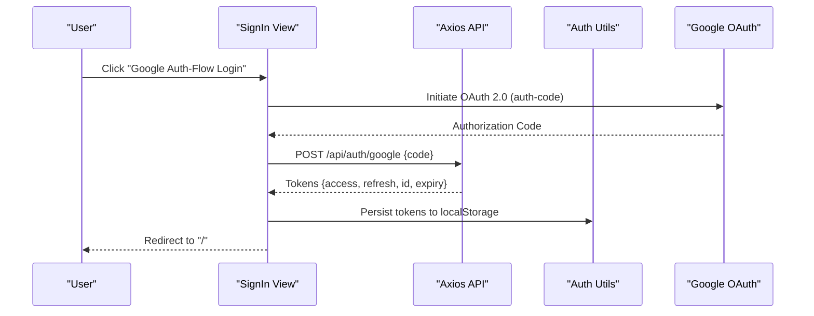
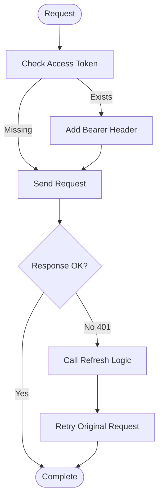
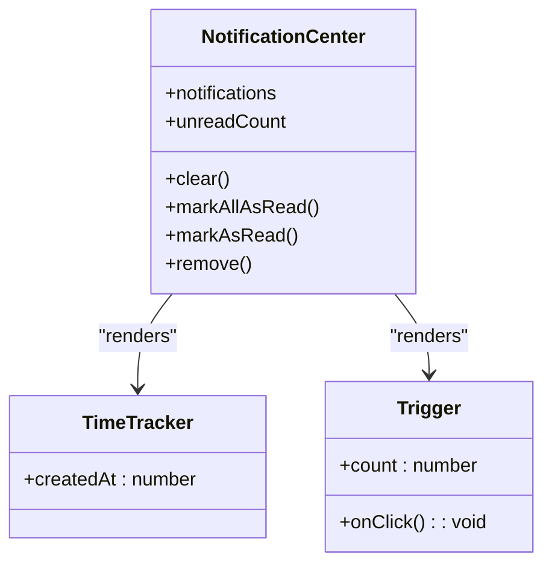
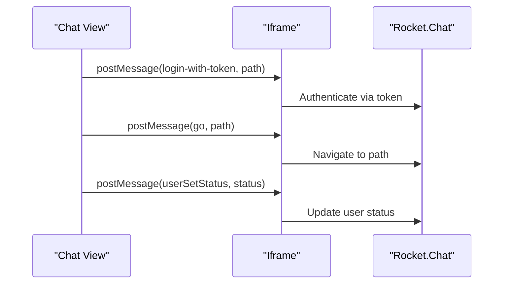
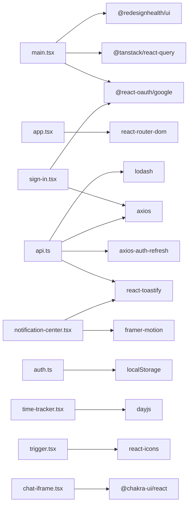

# Rocket.Chat POC v2

<cite>
**Referenced Files in This Document**
- [main.tsx](file://apps/chat-pocs/rocketchat-poc-v2/src/main.tsx)
- [app.tsx](file://apps/chat-pocs/rocketchat-poc-v2/src/app/app.tsx)
- [rocketchat.d.ts](file://apps/chat-pocs/rocketchat-poc-v2/src/types/rocketchat.d.ts)
- [api.ts](file://apps/chat-pocs/rocketchat-poc-v2/src/utils/api.ts)
- [auth.ts](file://apps/chat-pocs/rocketchat-poc-v2/src/utils/auth.ts)
- [chat-iframe.tsx](file://apps/chat-pocs/rocketchat-poc-v2/src/views/chat/chat-iframe.tsx)
- [notification-center.tsx](file://apps/chat-pocs/rocketchat-poc-v2/src/components/notification-center/notification-center.tsx)
- [time-tracker.tsx](file://apps/chat-pocs/rocketchat-poc-v2/src/components/notification-center/time-tracker.tsx)
- [trigger.tsx](file://apps/chat-pocs/rocketchat-poc-v2/src/components/notification-center/trigger.tsx)
- [sign-in.tsx](file://apps/chat-pocs/rocketchat-poc-v2/src/views/sign-in/sign-in.tsx)
- [require-auth.tsx](file://apps/chat-pocs/rocketchat-poc-v2/src/views/sign-in/require-auth/require-auth.tsx)
</cite>

## Table of Contents
1. [Introduction](#introduction)
2. [Project Structure](#project-structure)
3. [Core Components](#core-components)
4. [Architecture Overview](#architecture-overview)
5. [Detailed Component Analysis](#detailed-component-analysis)
6. [Dependency Analysis](#dependency-analysis)
7. [Performance Considerations](#performance-considerations)
8. [Troubleshooting Guide](#troubleshooting-guide)
9. [Conclusion](#conclusion)
10. [Appendices](#appendices)

## Introduction
Rocket.Chat POC v2 delivers an enhanced, production-ready integration of Rocket.Chat via an iframe-based chat widget, a modern notification center with animated transitions, robust authentication flows, and improved real-time capabilities. Compared to v1, this iteration emphasizes:
- Secure iframe-based Rocket.Chat embedding with explicit postMessage commands
- A polished notification center with unread filtering, animated item rendering, and time tracking
- Advanced authentication using Google OAuth 2.0 with automatic token refresh and persistent storage
- Real-time API utilities leveraging axios interceptors and toast-based error handling
- Scalable UI patterns using Chakra UI, Emotion, and Framer Motion

## Project Structure
The POC v2 application is organized by feature and layer:
- Entry point initializes providers for routing, theming, OAuth, and global state
- Views define sign-in and chat routes with protected access
- Utilities encapsulate API configuration and token management
- Components implement reusable UI elements like the notification center and time tracker
- Types declare embedded Rocket.Chat module augmentation

**Diagram sources**
- [main.tsx:1-35](file://apps/chat-pocs/rocketchat-poc-v2/src/main.tsx#L1-L35)
- [app.tsx:1-55](file://apps/chat-pocs/rocketchat-poc-v2/src/app/app.tsx#L1-L55)
- [chat-iframe.tsx:1-57](file://apps/chat-pocs/rocketchat-poc-v2/src/views/chat/chat-iframe.tsx#L1-L57)
- [sign-in.tsx:1-95](file://apps/chat-pocs/rocketchat-poc-v2/src/views/sign-in/sign-in.tsx#L1-L95)
- [require-auth.tsx:1-21](file://apps/chat-pocs/rocketchat-poc-v2/src/views/sign-in/require-auth/require-auth.tsx#L1-L21)
- [api.ts:1-92](file://apps/chat-pocs/rocketchat-poc-v2/src/utils/api.ts#L1-L92)
- [auth.ts:1-62](file://apps/chat-pocs/rocketchat-poc-v2/src/utils/auth.ts#L1-L62)
- [notification-center.tsx:1-215](file://apps/chat-pocs/rocketchat-poc-v2/src/components/notification-center/notification-center.tsx#L1-L215)
- [time-tracker.tsx:1-40](file://apps/chat-pocs/rocketchat-poc-v2/src/components/notification-center/time-tracker.tsx#L1-L40)
- [trigger.tsx:1-38](file://apps/chat-pocs/rocketchat-poc-v2/src/components/notification-center/trigger.tsx#L1-L38)
- [rocketchat.d.ts:1-2](file://apps/chat-pocs/rocketchat-poc-v2/src/types/rocketchat.d.ts#L1-L2)

**Section sources**
- [main.tsx:1-35](file://apps/chat-pocs/rocketchat-poc-v2/src/main.tsx#L1-L35)
- [app.tsx:1-55](file://apps/chat-pocs/rocketchat-poc-v2/src/app/app.tsx#L1-L55)

## Core Components
- Entry Providers: Initializes React Query, Google OAuth provider, and design system provider
- Routing and Authentication Guards: Protects the chat route and redirects unauthenticated users to sign-in
- API Layer: Centralized axios client with automatic token refresh and error toast handling
- Authentication Utilities: Local storage-backed token management for access, refresh, ID, and expiry
- Notification Center: Animated, filterable notification hub with per-item actions and time tracking
- Time Tracker: Live-relative-time display with periodic updates
- Trigger: Bell-shaped unread indicator with numeric badge
- Rocket.Chat Integration: Iframe-based embedding with explicit postMessage commands

**Section sources**
- [main.tsx:10-34](file://apps/chat-pocs/rocketchat-poc-v2/src/main.tsx#L10-L34)
- [app.tsx:12-49](file://apps/chat-pocs/rocketchat-poc-v2/src/app/app.tsx#L12-L49)
- [api.ts:10-62](file://apps/chat-pocs/rocketchat-poc-v2/src/utils/api.ts#L10-L62)
- [auth.ts:9-62](file://apps/chat-pocs/rocketchat-poc-v2/src/utils/auth.ts#L9-L62)
- [notification-center.tsx:115-215](file://apps/chat-pocs/rocketchat-poc-v2/src/components/notification-center/notification-center.tsx#L115-L215)
- [time-tracker.tsx:18-39](file://apps/chat-pocs/rocketchat-poc-v2/src/components/notification-center/time-tracker.tsx#L18-L39)
- [trigger.tsx:30-37](file://apps/chat-pocs/rocketchat-poc-v2/src/components/notification-center/trigger.tsx#L30-L37)
- [chat-iframe.tsx:7-54](file://apps/chat-pocs/rocketchat-poc-v2/src/views/chat/chat-iframe.tsx#L7-L54)

## Architecture Overview
The v2 architecture centers on a secure, modular design:
- Provider initialization sets up routing, theming, and global state
- Protected routes enforce authentication via access tokens
- API utilities centralize HTTP requests, token injection, and refresh logic
- Notification center integrates with toast-based notification management
- Rocket.Chat is embedded via iframe with explicit commands for login, navigation, and status

**Diagram sources**
- [main.tsx:24-34](file://apps/chat-pocs/rocketchat-poc-v2/src/main.tsx#L24-L34)
- [app.tsx:36-43](file://apps/chat-pocs/rocketchat-poc-v2/src/app/app.tsx#L36-L43)
- [sign-in.tsx:24-40](file://apps/chat-pocs/rocketchat-poc-v2/src/views/sign-in/sign-in.tsx#L24-L40)
- [api.ts:18-33](file://apps/chat-pocs/rocketchat-poc-v2/src/utils/api.ts#L18-L33)
- [auth.ts:17-61](file://apps/chat-pocs/rocketchat-poc-v2/src/utils/auth.ts#L17-L61)
- [notification-center.tsx:115-215](file://apps/chat-pocs/rocketchat-poc-v2/src/components/notification-center/notification-center.tsx#L115-L215)
- [time-tracker.tsx:18-39](file://apps/chat-pocs/rocketchat-poc-v2/src/components/notification-center/time-tracker.tsx#L18-L39)
- [trigger.tsx:30-37](file://apps/chat-pocs/rocketchat-poc-v2/src/components/notification-center/trigger.tsx#L30-L37)
- [chat-iframe.tsx:46-53](file://apps/chat-pocs/rocketchat-poc-v2/src/views/chat/chat-iframe.tsx#L46-L53)

## Detailed Component Analysis

### Authentication and Token Management
- Google OAuth 2.0 flow initiates an auth-code flow and exchanges the code for tokens via the backend
- Tokens are persisted to local storage and injected into API requests
- Automatic token refresh is handled via axios-auth-refresh interceptor on 401 responses
- Access guard enforces route protection by checking for presence of access tokens

**Diagram sources**
- [sign-in.tsx:24-40](file://apps/chat-pocs/rocketchat-poc-v2/src/views/sign-in/sign-in.tsx#L24-L40)
- [api.ts:18-28](file://apps/chat-pocs/rocketchat-poc-v2/src/utils/api.ts#L18-L28)
- [auth.ts:17-61](file://apps/chat-pocs/rocketchat-poc-v2/src/utils/auth.ts#L17-L61)

**Section sources**
- [sign-in.tsx:12-46](file://apps/chat-pocs/rocketchat-poc-v2/src/views/sign-in/sign-in.tsx#L12-L46)
- [require-auth.tsx:5-18](file://apps/chat-pocs/rocketchat-poc-v2/src/views/sign-in/require-auth/require-auth.tsx#L5-L18)
- [api.ts:10-62](file://apps/chat-pocs/rocketchat-poc-v2/src/utils/api.ts#L10-L62)
- [auth.ts:9-62](file://apps/chat-pocs/rocketchat-poc-v2/src/utils/auth.ts#L9-L62)

### API Utilities and Interceptors
- Central axios instance configured with JSON content type
- Request interceptor injects Authorization header when access token exists
- Refresh interceptor triggers on 401 responses, posts refresh token to backend, updates access token, and retries original request
- Error handler displays user-friendly toast messages derived from server errors

**Diagram sources**
- [api.ts:44-60](file://apps/chat-pocs/rocketchat-poc-v2/src/utils/api.ts#L44-L60)
- [api.ts:18-33](file://apps/chat-pocs/rocketchat-poc-v2/src/utils/api.ts#L18-L33)

**Section sources**
- [api.ts:10-62](file://apps/chat-pocs/rocketchat-poc-v2/src/utils/api.ts#L10-L62)

### Notification Center Implementation
- Uses react-toastify’s useNotificationCenter hook to manage notifications
- Animated transitions powered by Framer Motion with staggered child animations
- Filter toggles unread-only view; actions include mark-as-read and remove
- Integrates TimeTracker to display relative timestamps

**Diagram sources**
- [notification-center.tsx:115-215](file://apps/chat-pocs/rocketchat-poc-v2/src/components/notification-center/notification-center.tsx#L115-L215)
- [time-tracker.tsx:18-39](file://apps/chat-pocs/rocketchat-poc-v2/src/components/notification-center/time-tracker.tsx#L18-L39)
- [trigger.tsx:30-37](file://apps/chat-pocs/rocketchat-poc-v2/src/components/notification-center/trigger.tsx#L30-L37)

**Section sources**
- [notification-center.tsx:115-215](file://apps/chat-pocs/rocketchat-poc-v2/src/components/notification-center/notification-center.tsx#L115-L215)
- [time-tracker.tsx:18-39](file://apps/chat-pocs/rocketchat-poc-v2/src/components/notification-center/time-tracker.tsx#L18-L39)
- [trigger.tsx:30-37](file://apps/chat-pocs/rocketchat-poc-v2/src/components/notification-center/trigger.tsx#L30-L37)

### Rocket.Chat Iframe Integration
- Embeds Rocket.Chat in an iframe with an aspect-ratio constrained container
- Sends explicit postMessage commands to the iframe for login, navigation, and status updates
- Supports dynamic command dispatch to control the embedded chat experience

**Diagram sources**
- [chat-iframe.tsx:21-43](file://apps/chat-pocs/rocketchat-poc-v2/src/views/chat/chat-iframe.tsx#L21-L43)

**Section sources**
- [chat-iframe.tsx:7-54](file://apps/chat-pocs/rocketchat-poc-v2/src/views/chat/chat-iframe.tsx#L7-L54)
- [rocketchat.d.ts:1-2](file://apps/chat-pocs/rocketchat-poc-v2/src/types/rocketchat.d.ts#L1-L2)

### TypeScript Definitions for Rocket.Chat Integration
- Declares module augmentation for @embeddedchat/react to enable type-safe usage of embedded components

**Section sources**
- [rocketchat.d.ts:1-2](file://apps/chat-pocs/rocketchat-poc-v2/src/types/rocketchat.d.ts#L1-L2)

## Dependency Analysis
Key internal and external dependencies:
- React Query for caching and error boundaries
- Chakra UI for design system primitives
- Emotion for styled components
- Framer Motion for animations
- Day.js for relative time calculations
- axios-auth-refresh for automatic token refresh
- react-toastify for notifications and error handling

**Diagram sources**
- [main.tsx:1-35](file://apps/chat-pocs/rocketchat-poc-v2/src/main.tsx#L1-L35)
- [app.tsx:1-55](file://apps/chat-pocs/rocketchat-poc-v2/src/app/app.tsx#L1-L55)
- [sign-in.tsx:1-10](file://apps/chat-pocs/rocketchat-poc-v2/src/views/sign-in/sign-in.tsx#L1-L10)
- [api.ts:1-6](file://apps/chat-pocs/rocketchat-poc-v2/src/utils/api.ts#L1-L6)
- [auth.ts:1-8](file://apps/chat-pocs/rocketchat-poc-v2/src/utils/auth.ts#L1-L8)
- [notification-center.tsx:1-6](file://apps/chat-pocs/rocketchat-poc-v2/src/components/notification-center/notification-center.tsx#L1-L6)
- [time-tracker.tsx:1-6](file://apps/chat-pocs/rocketchat-poc-v2/src/components/notification-center/time-tracker.tsx#L1-L6)
- [trigger.tsx:1-2](file://apps/chat-pocs/rocketchat-poc-v2/src/components/notification-center/trigger.tsx#L1-L2)
- [chat-iframe.tsx:1](file://apps/chat-pocs/rocketchat-poc-v2/src/views/chat/chat-iframe.tsx#L1)

**Section sources**
- [main.tsx:1-35](file://apps/chat-pocs/rocketchat-poc-v2/src/main.tsx#L1-L35)
- [api.ts:1-62](file://apps/chat-pocs/rocketchat-poc-v2/src/utils/api.ts#L1-L62)
- [auth.ts:1-62](file://apps/chat-pocs/rocketchat-poc-v2/src/utils/auth.ts#L1-L62)

## Performance Considerations
- Lazy loading of routes and components reduces initial bundle size
- React Query default retry disabled to prevent unnecessary network retries
- Efficient token refresh via interceptor avoids repeated manual checks
- Relative time updates use minimal intervals to balance accuracy and performance
- Iframe aspect-ratio ensures responsive embedding without layout thrashing

[No sources needed since this section provides general guidance]

## Troubleshooting Guide
- Authentication failures: Verify Google OAuth client ID and backend token exchange endpoint
- 401 responses: Confirm refresh token logic and access token persistence
- Iframe commands not working: Ensure postMessage targets the correct origin and commands are supported
- Notifications not appearing: Check react-toastify initialization and useNotificationCenter hook usage
- Time tracker not updating: Validate interval cleanup and dayjs plugin registration

**Section sources**
- [api.ts:35-42](file://apps/chat-pocs/rocketchat-poc-v2/src/utils/api.ts#L35-L42)
- [chat-iframe.tsx:16-19](file://apps/chat-pocs/rocketchat-poc-v2/src/views/chat/chat-iframe.tsx#L16-L19)
- [time-tracker.tsx:24-32](file://apps/chat-pocs/rocketchat-poc-v2/src/components/notification-center/time-tracker.tsx#L24-L32)

## Conclusion
Rocket.Chat POC v2 introduces a robust, scalable foundation for integrating Rocket.Chat within a React SPA. It leverages modern patterns for authentication, real-time API handling, and UI composition, while maintaining a clean separation of concerns across components and utilities. The iframe-based integration, animated notification center, and resilient auth flows collectively deliver an improved user experience over v1.

[No sources needed since this section summarizes without analyzing specific files]

## Appendices

### Configuration Requirements
- Environment variables for Google OAuth client ID and backend base URL
- Proxy configuration for API requests to avoid CORS issues
- Iframe origin permissions for Rocket.Chat embedded domain

**Section sources**
- [main.tsx:12-14](file://apps/chat-pocs/rocketchat-poc-v2/src/main.tsx#L12-L14)
- [chat-iframe.tsx:48-49](file://apps/chat-pocs/rocketchat-poc-v2/src/views/chat/chat-iframe.tsx#L48-L49)

### Migration Considerations from v1
- Replace legacy chat widgets with iframe-based embedding
- Migrate authentication to Google OAuth 2.0 with backend token exchange
- Introduce axios interceptors for centralized token refresh and error handling
- Adopt react-toastify for notification management and Framer Motion for animations
- Persist tokens in local storage with structured keys for access, refresh, ID, and expiry

**Section sources**
- [sign-in.tsx:24-40](file://apps/chat-pocs/rocketchat-poc-v2/src/views/sign-in/sign-in.tsx#L24-L40)
- [api.ts:18-33](file://apps/chat-pocs/rocketchat-poc-v2/src/utils/api.ts#L18-L33)
- [auth.ts:17-61](file://apps/chat-pocs/rocketchat-poc-v2/src/utils/auth.ts#L17-L61)
- [notification-center.tsx:115-215](file://apps/chat-pocs/rocketchat-poc-v2/src/components/notification-center/notification-center.tsx#L115-L215)