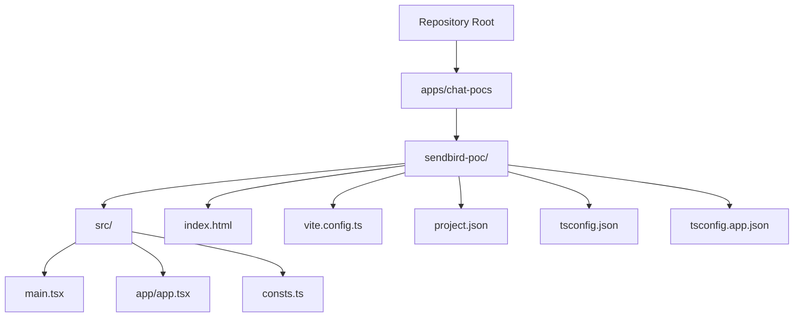
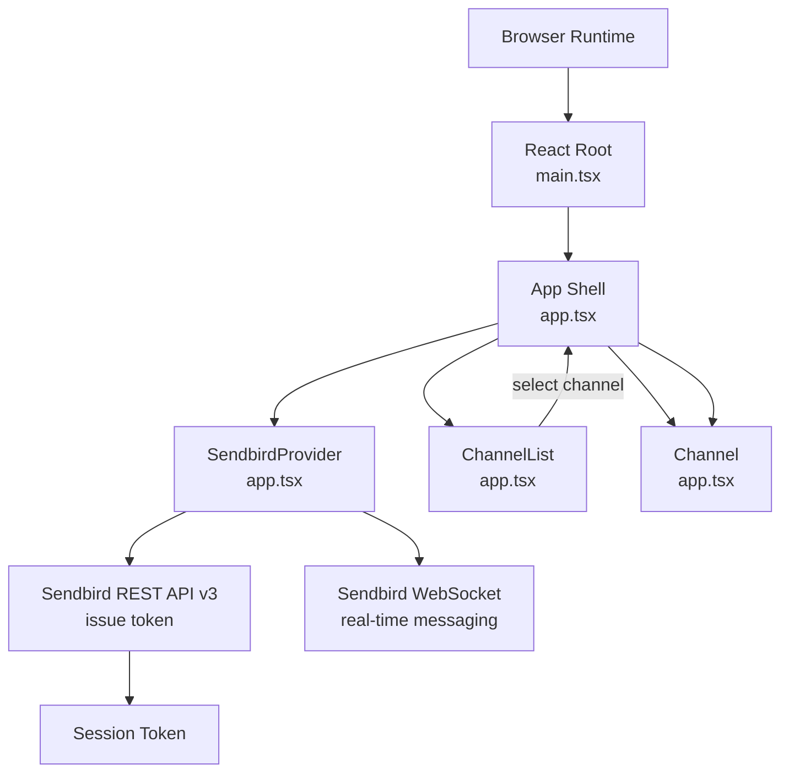
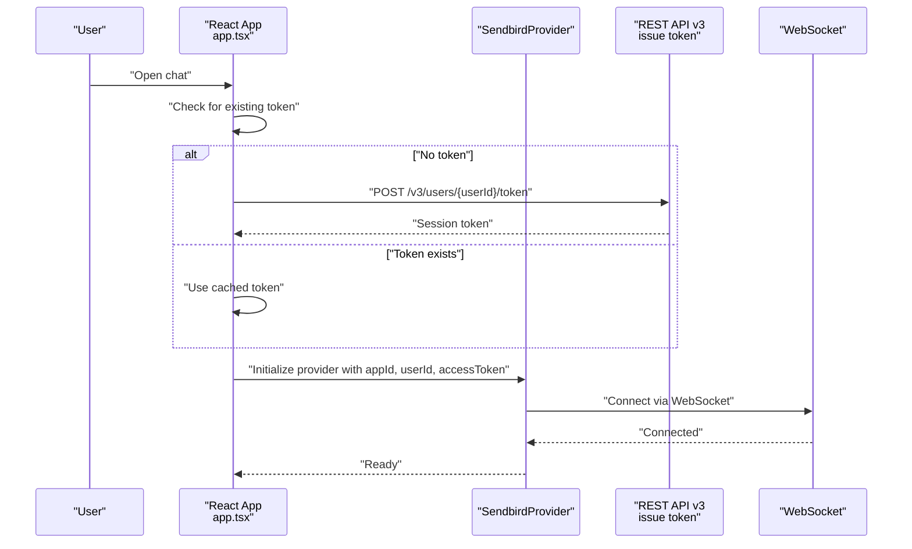
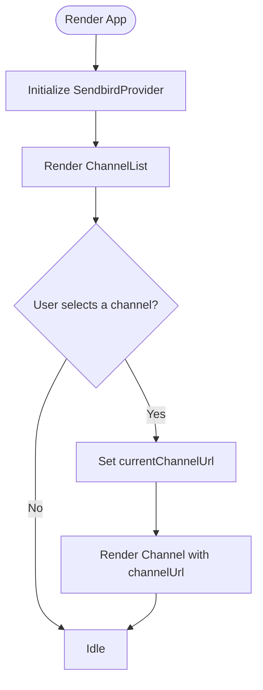
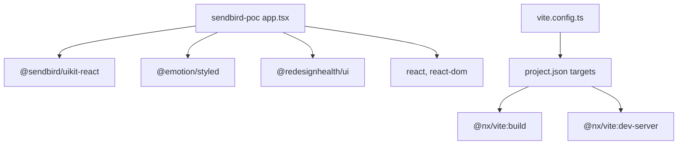

# Sendbird Integration

<cite>
**Referenced Files in This Document**
- [index.html](file://apps/chat-pocs/sendbird-poc/index.html)
- [main.tsx](file://apps/chat-pocs/sendbird-poc/src/main.tsx)
- [app.tsx](file://apps/chat-pocs/sendbird-poc/src/app/app.tsx)
- [consts.ts](file://apps/chat-pocs/sendbird-poc/src/consts.ts)
- [vite.config.ts](file://apps/chat-pocs/sendbird-poc/vite.config.ts)
- [project.json](file://apps/chat-pocs/sendbird-poc/project.json)
- [tsconfig.json](file://apps/chat-pocs/sendbird-poc/tsconfig.json)
- [tsconfig.app.json](file://apps/chat-pocs/sendbird-poc/tsconfig.app.json)
- [package.json](file://package.json)
</cite>

## Table of Contents
1. [Introduction](#introduction)
2. [Project Structure](#project-structure)
3. [Core Components](#core-components)
4. [Architecture Overview](#architecture-overview)
5. [Detailed Component Analysis](#detailed-component-analysis)
6. [Dependency Analysis](#dependency-analysis)
7. [Performance Considerations](#performance-considerations)
8. [Troubleshooting Guide](#troubleshooting-guide)
9. [Conclusion](#conclusion)
10. [Appendices](#appendices)

## Introduction
This document explains the Sendbird chat integration proof-of-concept built as a React application within the monorepo. It covers the setup, routing configuration, Sendbird SDK integration, authentication flow, user registration and login processes, channel management, component architecture for chat UI and real-time communication, REST API integration, and WebSocket connections. It also documents configuration requirements, environment setup, constants definition, UI implementation patterns, message handling, and customization approaches for a Sendbird-powered chat experience.

## Project Structure
The Sendbird POC is a Vite-based React application located under apps/chat-pocs/sendbird-poc. It includes:
- Application entry point and root HTML scaffold
- Main React bootstrap and routing wiring
- Sendbird provider and chat UI components
- Build targets and development server configuration
- TypeScript compiler options and project metadata

**Diagram sources**
- [index.html:1-16](file://apps/chat-pocs/sendbird-poc/index.html#L1-L16)
- [main.tsx:1-12](file://apps/chat-pocs/sendbird-poc/src/main.tsx#L1-L12)
- [app.tsx:1-116](file://apps/chat-pocs/sendbird-poc/src/app/app.tsx#L1-L116)
- [consts.ts:1-17](file://apps/chat-pocs/sendbird-poc/src/consts.ts#L1-L17)
- [vite.config.ts:1-34](file://apps/chat-pocs/sendbird-poc/vite.config.ts#L1-L34)
- [project.json:1-63](file://apps/chat-pocs/sendbird-poc/project.json#L1-L63)
- [tsconfig.json:1-20](file://apps/chat-pocs/sendbird-poc/tsconfig.json#L1-L20)
- [tsconfig.app.json:1-24](file://apps/chat-pocs/sendbird-poc/tsconfig.app.json#L1-L24)

**Section sources**
- [index.html:1-16](file://apps/chat-pocs/sendbird-poc/index.html#L1-L16)
- [main.tsx:1-12](file://apps/chat-pocs/sendbird-poc/src/main.tsx#L1-L12)
- [app.tsx:1-116](file://apps/chat-pocs/sendbird-poc/src/app/app.tsx#L1-L116)
- [consts.ts:1-17](file://apps/chat-pocs/sendbird-poc/src/consts.ts#L1-L17)
- [vite.config.ts:1-34](file://apps/chat-pocs/sendbird-poc/vite.config.ts#L1-L34)
- [project.json:1-63](file://apps/chat-pocs/sendbird-poc/project.json#L1-L63)
- [tsconfig.json:1-20](file://apps/chat-pocs/sendbird-poc/tsconfig.json#L1-L20)
- [tsconfig.app.json:1-24](file://apps/chat-pocs/sendbird-poc/tsconfig.app.json#L1-L24)

## Core Components
- Application entry and rendering
  - The React root mounts the App component into the DOM via main.tsx.
- Chat UI shell
  - The App component defines a styled layout with two regions: channel list and conversation.
- Sendbird provider and session management
  - Uses SendbirdProvider to initialize the SDK with appId, userId, and accessToken.
  - Implements a SessionHandler to manage token acquisition and refresh.
- Token issuance
  - Issues a short-lived session token via Sendbird REST API v3 endpoint using Api-Token header and a configured expiration.
- Channel management
  - Renders ChannelList and Channel components from @sendbird/uikit-react.
  - Tracks current channel URL and updates the conversation view accordingly.

Key implementation references:
- Provider and session handler setup: [app.tsx:86-92](file://apps/chat-pocs/sendbird-poc/src/app/app.tsx#L86-L92)
- Token issuance flow: [app.tsx:50-65](file://apps/chat-pocs/sendbird-poc/src/app/app.tsx#L50-L65)
- Channel list and conversation wiring: [app.tsx:96-107](file://apps/chat-pocs/sendbird-poc/src/app/app.tsx#L96-L107)

**Section sources**
- [main.tsx:1-12](file://apps/chat-pocs/sendbird-poc/src/main.tsx#L1-L12)
- [app.tsx:1-116](file://apps/chat-pocs/sendbird-poc/src/app/app.tsx#L1-L116)

## Architecture Overview
The application initializes the Sendbird SDK through a provider, manages authentication via a session token issued by Sendbird’s REST API, and renders a split-pane UI with channel list and conversation. Real-time messaging is handled by the Sendbird UIKit components and underlying WebSocket connections managed by the SDK.

**Diagram sources**
- [main.tsx:1-12](file://apps/chat-pocs/sendbird-poc/src/main.tsx#L1-L12)
- [app.tsx:86-107](file://apps/chat-pocs/sendbird-poc/src/app/app.tsx#L86-L107)
- [app.tsx:50-65](file://apps/chat-pocs/sendbird-poc/src/app/app.tsx#L50-L65)

## Detailed Component Analysis

### Authentication Flow and Session Management
The authentication flow uses a session token issued by Sendbird’s REST API v3. The process:
- On mount, the app checks for a token and requests one if missing.
- The token request posts to the Sendbird API endpoint with Api-Token and a JSON body containing an expiration timestamp.
- The SessionHandler is configured to supply the token to the SDK and handle refresh, errors, and closure events.

**Diagram sources**
- [app.tsx:66-83](file://apps/chat-pocs/sendbird-poc/src/app/app.tsx#L66-L83)
- [app.tsx:50-65](file://apps/chat-pocs/sendbird-poc/src/app/app.tsx#L50-L65)
- [app.tsx:86-92](file://apps/chat-pocs/sendbird-poc/src/app/app.tsx#L86-L92)

Implementation highlights:
- Token issuance endpoint and headers: [app.tsx:50-65](file://apps/chat-pocs/sendbird-poc/src/app/app.tsx#L50-L65)
- Session handler callbacks: [app.tsx:29-49](file://apps/chat-pocs/sendbird-poc/src/app/app.tsx#L29-L49)
- Provider initialization: [app.tsx:86-92](file://apps/chat-pocs/sendbird-poc/src/app/app.tsx#L86-L92)

**Section sources**
- [app.tsx:29-65](file://apps/chat-pocs/sendbird-poc/src/app/app.tsx#L29-L65)
- [app.tsx:86-92](file://apps/chat-pocs/sendbird-poc/src/app/app.tsx#L86-L92)

### Routing Configuration
The application does not implement explicit client-side routing. The App component serves as the single-page shell that renders the Sendbird UI. The HTML root element and Vite dev server configuration provide the runtime environment for the SPA.

- Root element and module entry: [index.html:11-14](file://apps/chat-pocs/sendbird-poc/index.html#L11-L14), [main.tsx:1-12](file://apps/chat-pocs/sendbird-poc/src/main.tsx#L1-L12)
- Development server and ports: [vite.config.ts:17-25](file://apps/chat-pocs/sendbird-poc/vite.config.ts#L17-L25)
- Build targets and Nx executor: [project.json:7-61](file://apps/chat-pocs/sendbird-poc/project.json#L7-L61)

**Section sources**
- [index.html:1-16](file://apps/chat-pocs/sendbird-poc/index.html#L1-L16)
- [main.tsx:1-12](file://apps/chat-pocs/sendbird-poc/src/main.tsx#L1-L12)
- [vite.config.ts:1-34](file://apps/chat-pocs/sendbird-poc/vite.config.ts#L1-L34)
- [project.json:1-63](file://apps/chat-pocs/sendbird-poc/project.json#L1-L63)

### Channel Management and UI Wiring
The UI is structured as a split-pane:
- Left pane: ChannelList component that triggers selection callbacks.
- Right pane: Channel component bound to the selected channel URL.

Selection flow:
- onChannelSelect updates the current channel URL state.
- The Channel component receives the channelUrl prop and renders the conversation.

**Diagram sources**
- [app.tsx:96-107](file://apps/chat-pocs/sendbird-poc/src/app/app.tsx#L96-L107)

**Section sources**
- [app.tsx:96-107](file://apps/chat-pocs/sendbird-poc/src/app/app.tsx#L96-L107)

### Constants and Configuration
Two sources of configuration are present:
- Inline constants in the main App component (appId, apiToken, userId)
- A separate constants module exporting APP_ID, USER_ID, NICKNAME, API_TOKEN

Recommendation:
- Prefer a single source of truth for credentials and environment-specific values.
- Externalize secrets and environment variables for production use.

References:
- Inline constants and token issuance: [app.tsx:24-28](file://apps/chat-pocs/sendbird-poc/src/app/app.tsx#L24-L28), [app.tsx:50-65](file://apps/chat-pocs/sendbird-poc/src/app/app.tsx#L50-L65)
- Separate constants module: [consts.ts:1-17](file://apps/chat-pocs/sendbird-poc/src/consts.ts#L1-L17)

**Section sources**
- [app.tsx:24-28](file://apps/chat-pocs/sendbird-poc/src/app/app.tsx#L24-L28)
- [app.tsx:50-65](file://apps/chat-pocs/sendbird-poc/src/app/app.tsx#L50-L65)
- [consts.ts:1-17](file://apps/chat-pocs/sendbird-poc/src/consts.ts#L1-L17)

### Message Handling and Real-Time Communication
- The Chat UI components (ChannelList and Channel) from @sendbird/uikit-react render messages and manage real-time updates.
- The SessionHandler integrates with the provider to supply tokens and handle lifecycle events.
- WebSocket connectivity is managed by the SDK; the app relies on UIKit components for message posting, receiving, and UI updates.

References:
- UIKit imports and provider usage: [app.tsx:5-9](file://apps/chat-pocs/sendbird-poc/src/app/app.tsx#L5-L9)
- Provider and session handler: [app.tsx:86-92](file://apps/chat-pocs/sendbird-poc/src/app/app.tsx#L86-L92)

**Section sources**
- [app.tsx:5-9](file://apps/chat-pocs/sendbird-poc/src/app/app.tsx#L5-L9)
- [app.tsx:86-92](file://apps/chat-pocs/sendbird-poc/src/app/app.tsx#L86-L92)

### Customization Examples
- Theming and layout: The App is wrapped in a styled Box with flex layout and CSS targeting UIKit class names to adjust spacing and hide specific UI elements.
- Example customization points:
  - Adjusting the split-pane layout and hiding header info button via CSS selectors.
  - Extending the provider config (e.g., logLevel) for diagnostics.

References:
- Styled layout and CSS overrides: [app.tsx:11-22](file://apps/chat-pocs/sendbird-poc/src/app/app.tsx#L11-L22)
- Provider config: [app.tsx](file://apps/chat-pocs/sendbird-poc/src/app/app.tsx#L90)

**Section sources**
- [app.tsx:11-22](file://apps/chat-pocs/sendbird-poc/src/app/app.tsx#L11-L22)
- [app.tsx](file://apps/chat-pocs/sendbird-poc/src/app/app.tsx#L90)

## Dependency Analysis
The application depends on:
- React and ReactDOM for rendering
- Emotion for styling
- RedesignHealth UI primitives (Box)
- Sendbird UIKit React components and provider
- Vite for build and dev server

External libraries and versions are declared in the root package.json. The project targets are configured via Nx executors for Vite.

**Diagram sources**
- [app.tsx:1-116](file://apps/chat-pocs/sendbird-poc/src/app/app.tsx#L1-L116)
- [vite.config.ts:1-34](file://apps/chat-pocs/sendbird-poc/vite.config.ts#L1-L34)
- [project.json:7-61](file://apps/chat-pocs/sendbird-poc/project.json#L7-L61)
- [package.json:56-129](file://package.json#L56-L129)

**Section sources**
- [package.json:56-129](file://package.json#L56-L129)
- [vite.config.ts:1-34](file://apps/chat-pocs/sendbird-poc/vite.config.ts#L1-L34)
- [project.json:1-63](file://apps/chat-pocs/sendbird-poc/project.json#L1-L63)

## Performance Considerations
- Token caching: The app caches the session token until the component unmounts. Consider persisting tokens and refreshing proactively to minimize connection interruptions.
- Lazy loading: Defer heavy UI initialization until after token acquisition completes.
- Bundle size: Keep UIKit imports scoped to necessary components to reduce bundle overhead.
- Network efficiency: Use appropriate expiration windows for tokens to balance security and connection stability.

[No sources needed since this section provides general guidance]

## Troubleshooting Guide
Common issues and remedies:
- Authentication failures
  - Verify appId, apiToken, and userId are correct and match the Sendbird dashboard configuration.
  - Confirm the REST API endpoint and headers during token issuance.
  - Check SessionHandler callbacks for error logs.
- Connection problems
  - Ensure the provider is initialized with a valid accessToken and that the WebSocket connection is established.
  - Review provider config logLevel for diagnostic output.
- UI not rendering
  - Confirm the root element exists and React is mounting the App component.
  - Validate CSS class names used for layout adjustments.

References:
- Token issuance and error logging: [app.tsx:50-65](file://apps/chat-pocs/sendbird-poc/src/app/app.tsx#L50-L65)
- SessionHandler callbacks: [app.tsx:29-49](file://apps/chat-pocs/sendbird-poc/src/app/app.tsx#L29-L49)
- Provider initialization: [app.tsx:86-92](file://apps/chat-pocs/sendbird-poc/src/app/app.tsx#L86-L92)
- Root element and mount: [index.html:11-14](file://apps/chat-pocs/sendbird-poc/index.html#L11-L14), [main.tsx:6-11](file://apps/chat-pocs/sendbird-poc/src/main.tsx#L6-L11)

**Section sources**
- [app.tsx:29-65](file://apps/chat-pocs/sendbird-poc/src/app/app.tsx#L29-L65)
- [app.tsx:86-92](file://apps/chat-pocs/sendbird-poc/src/app/app.tsx#L86-L92)
- [index.html:11-14](file://apps/chat-pocs/sendbird-poc/index.html#L11-L14)
- [main.tsx:6-11](file://apps/chat-pocs/sendbird-poc/src/main.tsx#L6-L11)

## Conclusion
This Sendbird POC demonstrates a minimal yet functional integration using React, Vite, and Sendbird UIKit. It establishes authentication via REST API token issuance, wires a provider with session management, and renders a channel list and conversation view. The architecture is straightforward and extensible, enabling further customization of UI, message handling, and real-time features.

[No sources needed since this section summarizes without analyzing specific files]

## Appendices

### Environment Setup and Configuration
- Development server
  - Host: localhost
  - Ports: dev 4200, preview 4300
- Build output
  - Dist path: dist/apps/chat-pocs/sendbird-poc
- TypeScript configuration
  - JSX: react-jsx
  - Strict mode enabled
  - Emotion JSX import source configured

References:
- Dev server and ports: [vite.config.ts:17-25](file://apps/chat-pocs/sendbird-poc/vite.config.ts#L17-L25)
- Build target: [project.json:8-22](file://apps/chat-pocs/sendbird-poc/project.json#L8-L22)
- TypeScript options: [tsconfig.json:2-9](file://apps/chat-pocs/sendbird-poc/tsconfig.json#L2-L9), [tsconfig.app.json:3-10](file://apps/chat-pocs/sendbird-poc/tsconfig.app.json#L3-L10)

**Section sources**
- [vite.config.ts:17-25](file://apps/chat-pocs/sendbird-poc/vite.config.ts#L17-L25)
- [project.json:8-22](file://apps/chat-pocs/sendbird-poc/project.json#L8-L22)
- [tsconfig.json:2-9](file://apps/chat-pocs/sendbird-poc/tsconfig.json#L2-L9)
- [tsconfig.app.json:3-10](file://apps/chat-pocs/sendbird-poc/tsconfig.app.json#L3-L10)