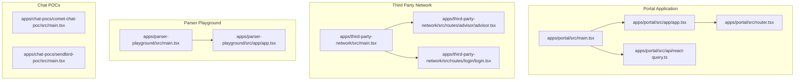
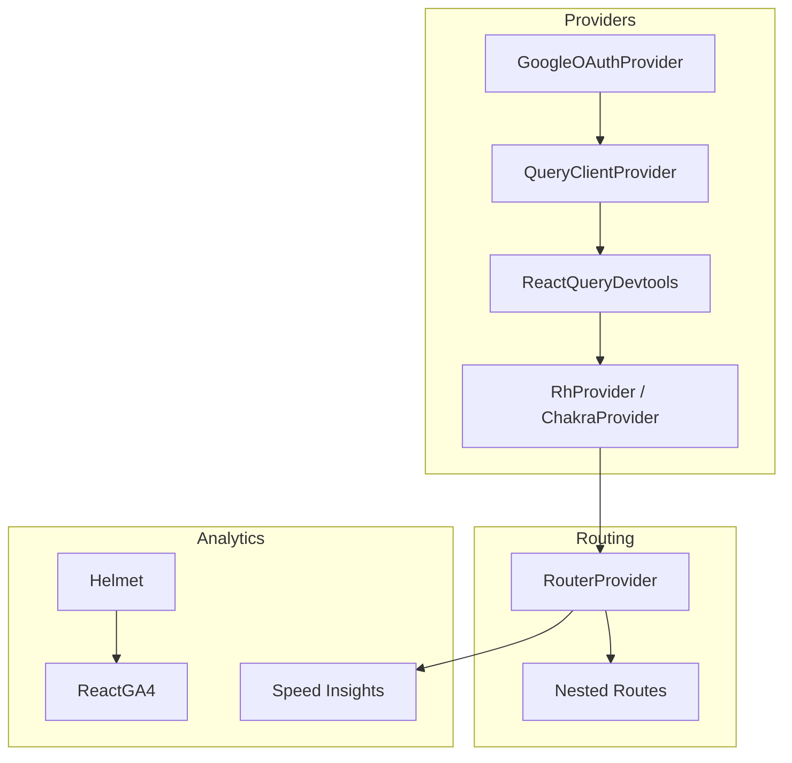
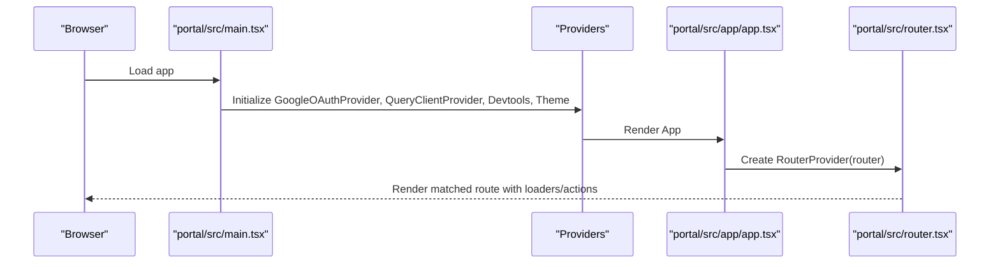
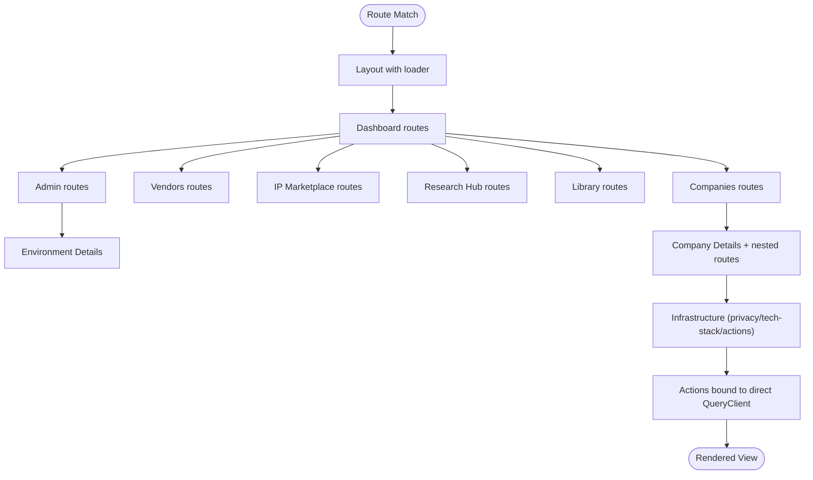
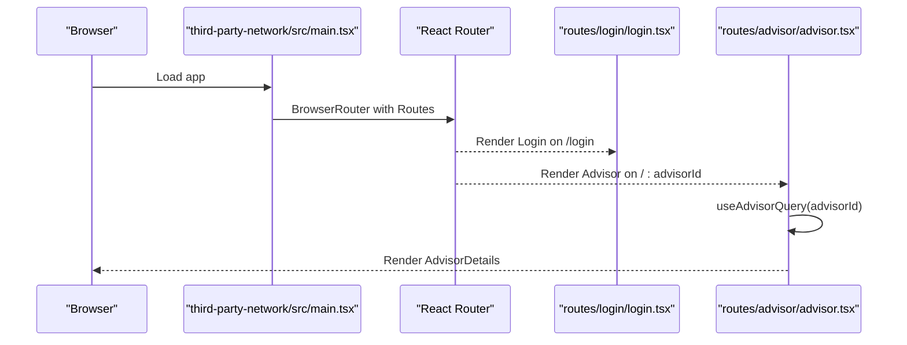
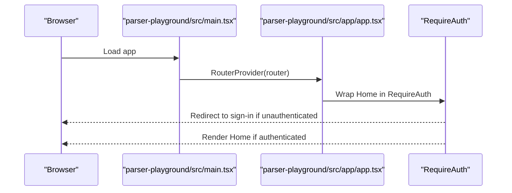
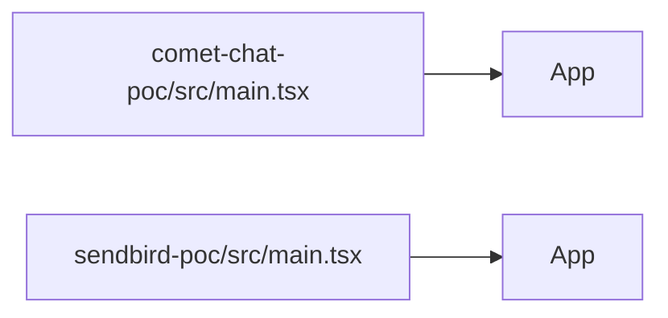
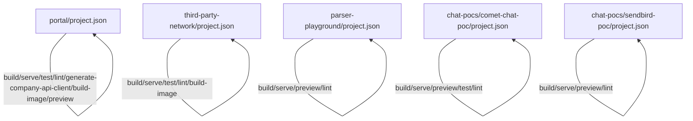

# Frontend Applications

<cite>
**Referenced Files in This Document**
- [apps/portal/src/main.tsx](file://apps/portal/src/main.tsx)
- [apps/portal/src/app/app.tsx](file://apps/portal/src/app/app.tsx)
- [apps/portal/src/router.tsx](file://apps/portal/src/router.tsx)
- [apps/portal/src/api/react-query.ts](file://apps/portal/src/api/react-query.ts)
- [apps/portal/project.json](file://apps/portal/project.json)
- [apps/third-party-network/src/main.tsx](file://apps/third-party-network/src/main.tsx)
- [apps/third-party-network/src/routes/advisor/advisor.tsx](file://apps/third-party-network/src/routes/advisor/advisor.tsx)
- [apps/third-party-network/src/routes/login/login.tsx](file://apps/third-party-network/src/routes/login/login.tsx)
- [apps/third-party-network/project.json](file://apps/third-party-network/project.json)
- [apps/parser-playground/src/main.tsx](file://apps/parser-playground/src/main.tsx)
- [apps/parser-playground/src/app/app.tsx](file://apps/parser-playground/src/app/app.tsx)
- [apps/parser-playground/project.json](file://apps/parser-playground/project.json)
- [apps/chat-pocs/comet-chat-poc/src/main.tsx](file://apps/chat-pocs/comet-chat-poc/src/main.tsx)
- [apps/chat-pocs/comet-chat-poc/project.json](file://apps/chat-pocs/comet-chat-poc/project.json)
- [apps/chat-pocs/sendbird-poc/src/main.tsx](file://apps/chat-pocs/sendbird-poc/src/main.tsx)
- [apps/chat-pocs/sendbird-poc/project.json](file://apps/chat-pocs/sendbird-poc/project.json)
</cite>

## Table of Contents
1. [Introduction](#introduction)
2. [Project Structure](#project-structure)
3. [Core Components](#core-components)
4. [Architecture Overview](#architecture-overview)
5. [Detailed Component Analysis](#detailed-component-analysis)
6. [Dependency Analysis](#dependency-analysis)
7. [Performance Considerations](#performance-considerations)
8. [Troubleshooting Guide](#troubleshooting-guide)
9. [Conclusion](#conclusion)
10. [Appendices](#appendices)

## Introduction
This document describes the frontend applications in the Redesign Health monorepo. It focuses on:
- The Portal application (Next.js + React 19), covering routing, state management via React Query, and authentication flow.
- The Third Party Network application for advisor-facing features.
- Several chat proof-of-concept applications integrating Comet Chat, Rocket.Chat, and Sendbird.
- The Parser Playground application for document processing.

For each application, we explain project structure, key components, data flow patterns, backend integration, configuration, environment variables, deployment considerations, performance optimization, accessibility, and responsive design.

## Project Structure
Each application is an Nx-managed project with Vite-based builds and standardized targets for development, testing, linting, type checking, and containerized builds. The Portal application integrates React Router 6 with loaders/actions and React Query for caching and optimistic updates. The Third Party Network and Parser Playground applications use React Router for navigation and React Query for data fetching. The chat POCs demonstrate lightweight SPA setups for external chat SDKs.

**Diagram sources**
- [apps/portal/src/main.tsx:1-41](file://apps/portal/src/main.tsx#L1-L41)
- [apps/portal/src/app/app.tsx:1-45](file://apps/portal/src/app/app.tsx#L1-L45)
- [apps/portal/src/router.tsx:1-250](file://apps/portal/src/router.tsx#L1-L250)
- [apps/portal/src/api/react-query.ts](file://apps/portal/src/api/react-query.ts)
- [apps/third-party-network/src/main.tsx:1-40](file://apps/third-party-network/src/main.tsx#L1-L40)
- [apps/third-party-network/src/routes/advisor/advisor.tsx:1-34](file://apps/third-party-network/src/routes/advisor/advisor.tsx#L1-L34)
- [apps/third-party-network/src/routes/login/login.tsx:1-24](file://apps/third-party-network/src/routes/login/login.tsx#L1-L24)
- [apps/parser-playground/src/main.tsx:1-34](file://apps/parser-playground/src/main.tsx#L1-L34)
- [apps/parser-playground/src/app/app.tsx:1-44](file://apps/parser-playground/src/app/app.tsx#L1-L44)
- [apps/chat-pocs/comet-chat-poc/src/main.tsx:1-15](file://apps/chat-pocs/comet-chat-poc/src/main.tsx#L1-L15)
- [apps/chat-pocs/sendbird-poc/src/main.tsx:1-12](file://apps/chat-pocs/sendbird-poc/src/main.tsx#L1-L12)

**Section sources**
- [apps/portal/src/main.tsx:1-41](file://apps/portal/src/main.tsx#L1-L41)
- [apps/third-party-network/src/main.tsx:1-40](file://apps/third-party-network/src/main.tsx#L1-L40)
- [apps/parser-playground/src/main.tsx:1-34](file://apps/parser-playground/src/main.tsx#L1-L34)
- [apps/chat-pocs/comet-chat-poc/src/main.tsx:1-15](file://apps/chat-pocs/comet-chat-poc/src/main.tsx#L1-L15)
- [apps/chat-pocs/sendbird-poc/src/main.tsx:1-12](file://apps/chat-pocs/sendbird-poc/src/main.tsx#L1-L12)

## Core Components
- Portal
  - Root provider chain: Google OAuth provider, React Query provider, UI theme provider, and RouterProvider.
  - Router with loaders for initial user info and extensive nested routes for dashboard, libraries, companies, vendors, IP marketplace, research hub, and admin.
  - Analytics integration via Helmet and Speed Insights.
- Third Party Network
  - Router with public and protected routes, authentication provider, and advisor-centric pages.
  - Responsive layout with login and advisor detail views.
- Parser Playground
  - Minimal SPA with RequireAuth wrapper around the home view and sign-in route.
  - React Query configured with retry and staleTime defaults.
- Chat POCs
  - Comet Chat POC: React Router-based SPA bootstrap.
  - Sendbird POC: Minimal SPA bootstrap.

**Section sources**
- [apps/portal/src/main.tsx:1-41](file://apps/portal/src/main.tsx#L1-L41)
- [apps/portal/src/app/app.tsx:1-45](file://apps/portal/src/app/app.tsx#L1-L45)
- [apps/portal/src/router.tsx:82-249](file://apps/portal/src/router.tsx#L82-L249)
- [apps/third-party-network/src/main.tsx:15-39](file://apps/third-party-network/src/main.tsx#L15-L39)
- [apps/third-party-network/src/routes/advisor/advisor.tsx:9-33](file://apps/third-party-network/src/routes/advisor/advisor.tsx#L9-L33)
- [apps/third-party-network/src/routes/login/login.tsx:7-23](file://apps/third-party-network/src/routes/login/login.tsx#L7-L23)
- [apps/parser-playground/src/main.tsx:12-19](file://apps/parser-playground/src/main.tsx#L12-L19)
- [apps/parser-playground/src/app/app.tsx:18-41](file://apps/parser-playground/src/app/app.tsx#L18-L41)
- [apps/chat-pocs/comet-chat-poc/src/main.tsx:7-14](file://apps/chat-pocs/comet-chat-poc/src/main.tsx#L7-L14)
- [apps/chat-pocs/sendbird-poc/src/main.tsx:6-11](file://apps/chat-pocs/sendbird-poc/src/main.tsx#L6-L11)

## Architecture Overview
The applications share common patterns:
- Provider composition at the root for authentication, analytics, and data fetching.
- React Router 6 for declarative routing with nested routes and loaders.
- React Query for caching, retries, and optimistic updates.
- Nx/Vite for build tooling and containerized deployments.

**Diagram sources**
- [apps/portal/src/main.tsx:30-40](file://apps/portal/src/main.tsx#L30-L40)
- [apps/portal/src/app/app.tsx:26-41](file://apps/portal/src/app/app.tsx#L26-L41)
- [apps/third-party-network/src/main.tsx:30-39](file://apps/third-party-network/src/main.tsx#L30-L39)
- [apps/parser-playground/src/main.tsx:20-33](file://apps/parser-playground/src/main.tsx#L20-L33)

## Detailed Component Analysis

### Portal Application
- Entry point composes providers and renders RouterProvider with a router that defines nested routes, loaders, and actions.
- Uses a dedicated React Query client configured per application needs.
- Integrates analytics via Helmet and Speed Insights.

**Diagram sources**
- [apps/portal/src/main.tsx:30-40](file://apps/portal/src/main.tsx#L30-L40)
- [apps/portal/src/app/app.tsx:26-41](file://apps/portal/src/app/app.tsx#L26-L41)
- [apps/portal/src/router.tsx:82-249](file://apps/portal/src/router.tsx#L82-L249)

Key routing highlights:
- Dashboard layout with loaders for user info.
- Nested routes for companies, vendors, IP marketplace, research hub, libraries, and admin.
- Actions bound to infrastructure forms using a direct React Query client.

**Diagram sources**
- [apps/portal/src/router.tsx:88-245](file://apps/portal/src/router.tsx#L88-L245)

**Section sources**
- [apps/portal/src/main.tsx:1-41](file://apps/portal/src/main.tsx#L1-L41)
- [apps/portal/src/app/app.tsx:1-45](file://apps/portal/src/app/app.tsx#L1-L45)
- [apps/portal/src/router.tsx:1-250](file://apps/portal/src/router.tsx#L1-L250)
- [apps/portal/src/api/react-query.ts](file://apps/portal/src/api/react-query.ts)

### Third Party Network Application
- Entry point sets up React Router, React Query, and an authentication provider.
- Routes include a root layout, login, and advisor detail page.
- Advisor page fetches advisor data and sets dynamic titles.

**Diagram sources**
- [apps/third-party-network/src/main.tsx:15-39](file://apps/third-party-network/src/main.tsx#L15-L39)
- [apps/third-party-network/src/routes/login/login.tsx:7-23](file://apps/third-party-network/src/routes/login/login.tsx#L7-L23)
- [apps/third-party-network/src/routes/advisor/advisor.tsx:9-33](file://apps/third-party-network/src/routes/advisor/advisor.tsx#L9-L33)

**Section sources**
- [apps/third-party-network/src/main.tsx:1-40](file://apps/third-party-network/src/main.tsx#L1-L40)
- [apps/third-party-network/src/routes/login/login.tsx:1-24](file://apps/third-party-network/src/routes/login/login.tsx#L1-L24)
- [apps/third-party-network/src/routes/advisor/advisor.tsx:1-34](file://apps/third-party-network/src/routes/advisor/advisor.tsx#L1-L34)

### Parser Playground Application
- Entry point initializes React Query with retry and staleTime defaults and wraps the app in Google OAuth and theme providers.
- Router enforces authentication via a RequireAuth wrapper for the home route.

**Diagram sources**
- [apps/parser-playground/src/main.tsx:12-19](file://apps/parser-playground/src/main.tsx#L12-L19)
- [apps/parser-playground/src/app/app.tsx:18-41](file://apps/parser-playground/src/app/app.tsx#L18-L41)

**Section sources**
- [apps/parser-playground/src/main.tsx:1-34](file://apps/parser-playground/src/main.tsx#L1-L34)
- [apps/parser-playground/src/app/app.tsx:1-44](file://apps/parser-playground/src/app/app.tsx#L1-L44)

### Chat Proof-of-Concept Applications
- Comet Chat POC: Minimal SPA bootstrapped with React Router.
- Sendbird POC: Minimal SPA bootstrapped without routing.

**Diagram sources**
- [apps/chat-pocs/comet-chat-poc/src/main.tsx:7-14](file://apps/chat-pocs/comet-chat-poc/src/main.tsx#L7-L14)
- [apps/chat-pocs/sendbird-poc/src/main.tsx:6-11](file://apps/chat-pocs/sendbird-poc/src/main.tsx#L6-L11)

**Section sources**
- [apps/chat-pocs/comet-chat-poc/src/main.tsx:1-15](file://apps/chat-pocs/comet-chat-poc/src/main.tsx#L1-L15)
- [apps/chat-pocs/sendbird-poc/src/main.tsx:1-12](file://apps/chat-pocs/sendbird-poc/src/main.tsx#L1-L12)

## Dependency Analysis
- Build and serve targets are defined via Nx executors for Vite, enabling development servers, preview servers, tests, linting, and containerized builds.
- Portal includes OpenAPI client generation targets for the company API.
- Third Party Network and Parser Playground define build-image targets for containerization.

**Diagram sources**
- [apps/portal/project.json:7-135](file://apps/portal/project.json#L7-L135)
- [apps/third-party-network/project.json:7-75](file://apps/third-party-network/project.json#L7-L75)
- [apps/parser-playground/project.json:7-61](file://apps/parser-playground/project.json#L7-L61)
- [apps/chat-pocs/comet-chat-poc/project.json:7-69](file://apps/chat-pocs/comet-chat-poc/project.json#L7-L69)
- [apps/chat-pocs/sendbird-poc/project.json:7-61](file://apps/chat-pocs/sendbird-poc/project.json#L7-L61)

**Section sources**
- [apps/portal/project.json:1-138](file://apps/portal/project.json#L1-L138)
- [apps/third-party-network/project.json:1-78](file://apps/third-party-network/project.json#L1-L78)
- [apps/parser-playground/project.json:1-63](file://apps/parser-playground/project.json#L1-L63)
- [apps/chat-pocs/comet-chat-poc/project.json:1-71](file://apps/chat-pocs/comet-chat-poc/project.json#L1-L71)
- [apps/chat-pocs/sendbird-poc/project.json:1-63](file://apps/chat-pocs/sendbird-poc/project.json#L1-L63)

## Performance Considerations
- React Query defaults: The Parser Playground configures retry and staleTime to balance freshness and performance.
- Vite build configurations enable optimization and output hashing for production builds.
- Analytics: Speed Insights and GA4 are initialized conditionally based on environment variables.

Recommendations:
- Use React Query staleTime and cacheTime tuned per route/page data volatility.
- Enable background refetch and selective invalidation to keep data fresh without over-fetching.
- Split chunks and code-split routes to reduce initial payload.
- Lazy-load heavy components and route views.

**Section sources**
- [apps/parser-playground/src/main.tsx:12-19](file://apps/parser-playground/src/main.tsx#L12-L19)
- [apps/portal/project.json:23-30](file://apps/portal/project.json#L23-L30)
- [apps/third-party-network/project.json:16-24](file://apps/third-party-network/project.json#L16-L24)
- [apps/parser-playground/project.json:16-22](file://apps/parser-playground/project.json#L16-L22)

## Troubleshooting Guide
Common areas to inspect:
- Environment variables for analytics and OAuth providers.
- Router loader/action errors and boundary rendering.
- React Query devtools for cache inspection and refetch triggers.
- Authentication provider wrapping and RequireAuth guards.

**Section sources**
- [apps/portal/src/main.tsx:12-28](file://apps/portal/src/main.tsx#L12-L28)
- [apps/portal/src/app/app.tsx:26-41](file://apps/portal/src/app/app.tsx#L26-L41)
- [apps/portal/src/router.tsx:84-94](file://apps/portal/src/router.tsx#L84-L94)
- [apps/third-party-network/src/main.tsx:30-39](file://apps/third-party-network/src/main.tsx#L30-L39)
- [apps/parser-playground/src/app/app.tsx:18-35](file://apps/parser-playground/src/app/app.tsx#L18-L35)

## Conclusion
The frontend applications leverage modern React patterns with robust provider chains, structured routing, and React Query for efficient data management. The Portal application demonstrates advanced routing with loaders/actions and analytics integration. The Third Party Network and Parser Playground showcase clean authentication flows and minimal SPA setups. The chat POCs illustrate quick integrations with external SDKs. Nx/Vite tooling ensures consistent developer experience and streamlined CI/CD.

## Appendices

### Configuration Options and Environment Variables
- Portal
  - Analytics: GA4 measurement ID and Hotjar site ID.
  - Libraries: Library IDs for public and developer libraries.
  - OAuth: Google client ID.
- Third Party Network
  - Router-based SPA with authentication provider.
- Parser Playground
  - Google OAuth client ID and React Query defaults.

**Section sources**
- [apps/portal/src/main.tsx:12-28](file://apps/portal/src/main.tsx#L12-L28)
- [apps/portal/src/router.tsx:104-152](file://apps/portal/src/router.tsx#L104-L152)
- [apps/third-party-network/src/main.tsx:30-39](file://apps/third-party-network/src/main.tsx#L30-L39)
- [apps/parser-playground/src/main.tsx:10-11](file://apps/parser-playground/src/main.tsx#L10-L11)

### Deployment Considerations
- Containerized builds are supported via Nx executors for all major applications.
- Vite preview servers are configured for local production-like previews.
- Proxy configurations are present for development server integration.

**Section sources**
- [apps/portal/project.json:111-135](file://apps/portal/project.json#L111-L135)
- [apps/third-party-network/project.json:67-75](file://apps/third-party-network/project.json#L67-L75)
- [apps/parser-playground/project.json:41-55](file://apps/parser-playground/project.json#L41-L55)