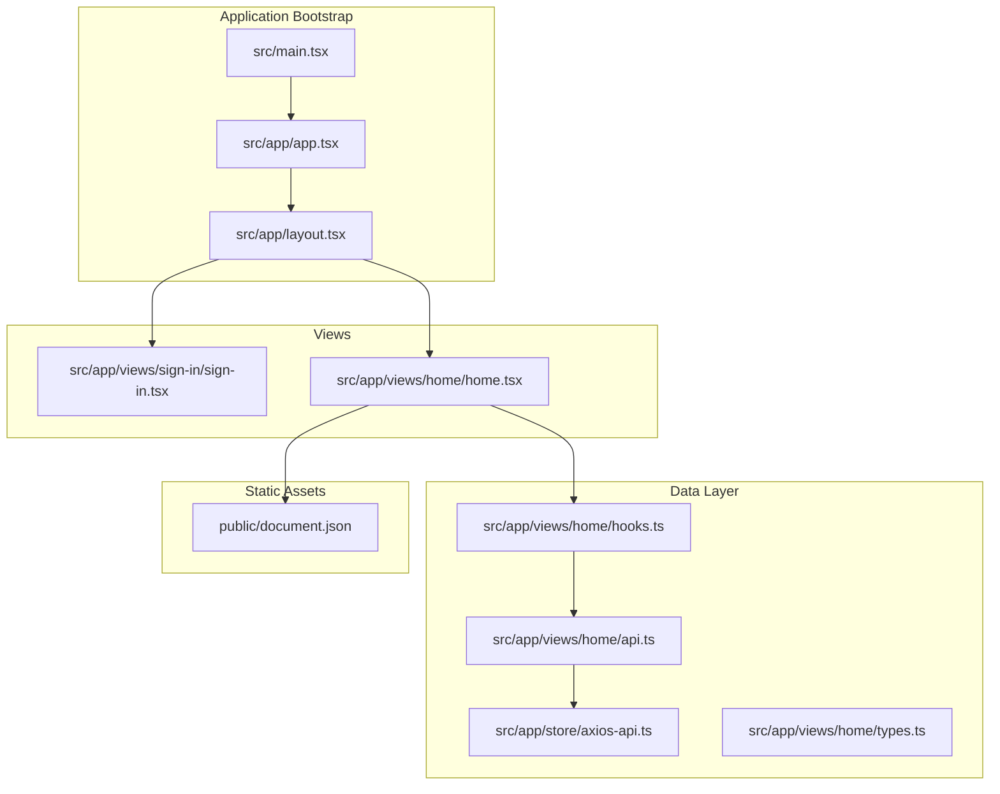
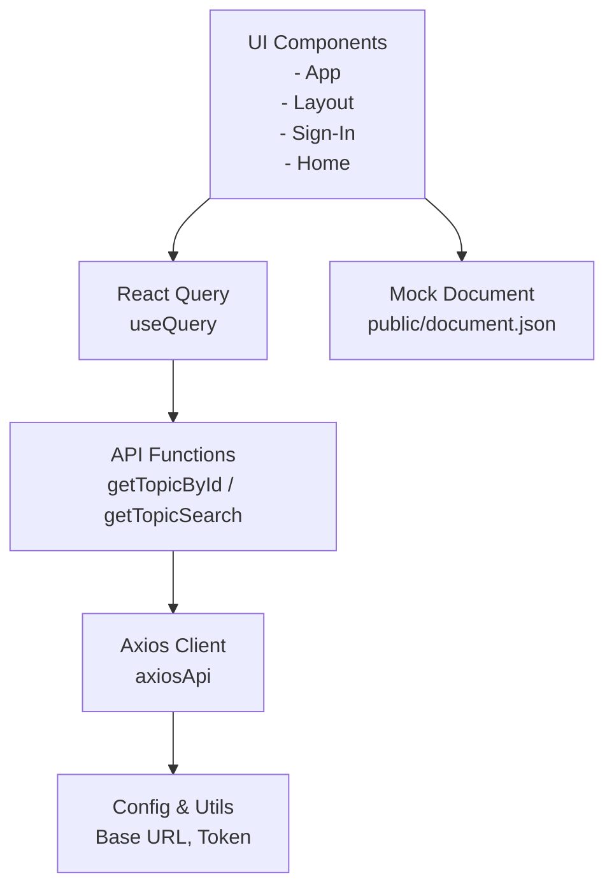
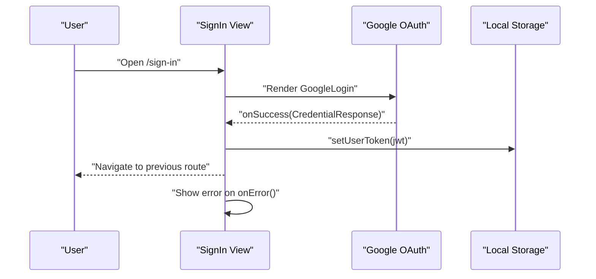
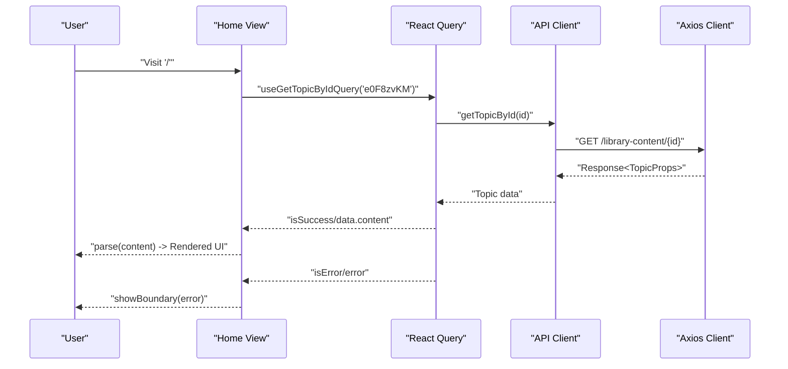
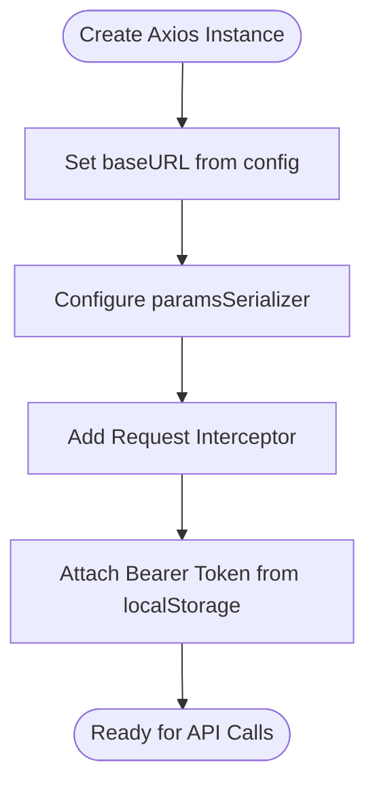
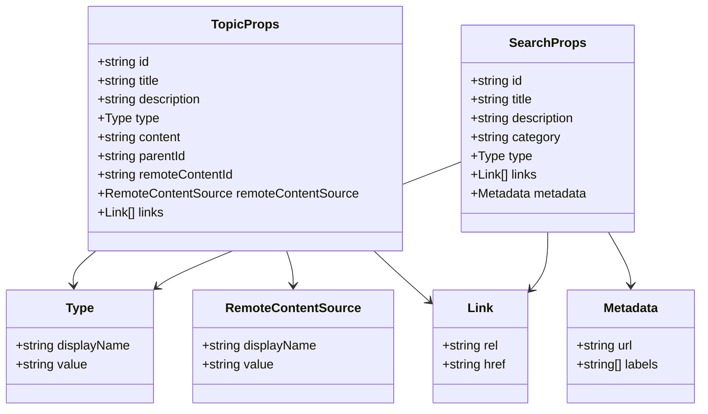
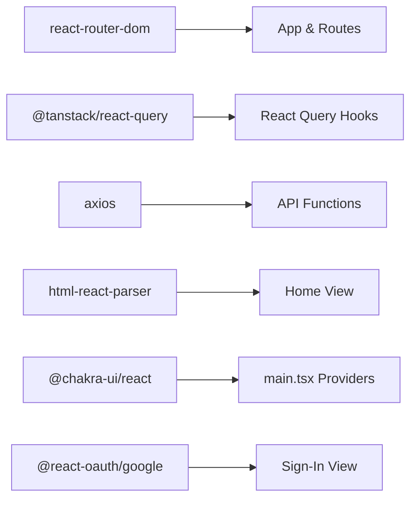

# Parser Playground

<cite>
**Referenced Files in This Document**
- [project.json](file://apps/parser-playground/project.json)
- [main.tsx](file://apps/parser-playground/src/main.tsx)
- [document.json](file://apps/parser-playground/public/document.json)
- [app.tsx](file://apps/parser-playground/src/app/app.tsx)
- [layout.tsx](file://apps/parser-playground/src/app/layout.tsx)
- [home.tsx](file://apps/parser-playground/src/app/views/home/home.tsx)
- [hooks.ts](file://apps/parser-playground/src/app/views/home/hooks.ts)
- [api.ts](file://apps/parser-playground/src/app/views/home/api.ts)
- [types.ts](file://apps/parser-playground/src/app/views/home/types.ts)
- [sign-in.tsx](file://apps/parser-playground/src/app/views/sign-in/sign-in.tsx)
- [axios-api.ts](file://apps/parser-playground/src/app/store/axios-api.ts)
</cite>

## Table of Contents
1. [Introduction](#introduction)
2. [Project Structure](#project-structure)
3. [Core Components](#core-components)
4. [Architecture Overview](#architecture-overview)
5. [Detailed Component Analysis](#detailed-component-analysis)
6. [Dependency Analysis](#dependency-analysis)
7. [Performance Considerations](#performance-considerations)
8. [Troubleshooting Guide](#troubleshooting-guide)
9. [Conclusion](#conclusion)

## Introduction
Parser Playground is a demonstration application designed to showcase document processing and parsing workflows. It renders HTML content from a remote library content endpoint, parses and visualizes the content in a React-based UI, and integrates with authentication and state management systems. The application focuses on transforming raw HTML into a structured, interactive document visualization while providing a clean separation of concerns across routing, data fetching, and presentation layers.

## Project Structure
The application follows a conventional React application layout with feature-based grouping under src/app. Key areas include:
- Routing and application bootstrap in src/main.tsx and src/app/app.tsx
- UI layout wrapper in src/app/layout.tsx
- Authentication flow in src/app/views/sign-in
- Document rendering and parsing in src/app/views/home
- Data fetching via React Query in src/app/views/home/hooks.ts and API clients in src/app/views/home/api.ts
- Shared HTTP client configuration in src/app/store/axios-api.ts
- Mock document data in public/document.json

**Diagram sources**
- [main.tsx:1-34](file://apps/parser-playground/src/main.tsx#L1-L34)
- [app.tsx:1-44](file://apps/parser-playground/src/app/app.tsx#L1-L44)
- [layout.tsx:1-13](file://apps/parser-playground/src/app/layout.tsx#L1-L13)
- [sign-in.tsx:1-71](file://apps/parser-playground/src/app/views/sign-in/sign-in.tsx#L1-L71)
- [home.tsx:1-35](file://apps/parser-playground/src/app/views/home/home.tsx#L1-L35)
- [hooks.ts:1-11](file://apps/parser-playground/src/app/views/home/hooks.ts#L1-L11)
- [api.ts:1-16](file://apps/parser-playground/src/app/views/home/api.ts#L1-L16)
- [types.ts:1-40](file://apps/parser-playground/src/app/views/home/types.ts#L1-L40)
- [axios-api.ts:1-22](file://apps/parser-playground/src/app/store/axios-api.ts#L1-L22)
- [document.json:1-21](file://apps/parser-playground/public/document.json#L1-L21)

**Section sources**
- [project.json:1-63](file://apps/parser-playground/project.json#L1-L63)
- [main.tsx:1-34](file://apps/parser-playground/src/main.tsx#L1-L34)
- [app.tsx:1-44](file://apps/parser-playground/src/app/app.tsx#L1-L44)
- [layout.tsx:1-13](file://apps/parser-playground/src/app/layout.tsx#L1-L13)
- [home.tsx:1-35](file://apps/parser-playground/src/app/views/home/home.tsx#L1-L35)
- [sign-in.tsx:1-71](file://apps/parser-playground/src/app/views/sign-in/sign-in.tsx#L1-L71)
- [hooks.ts:1-11](file://apps/parser-playground/src/app/views/home/hooks.ts#L1-L11)
- [api.ts:1-16](file://apps/parser-playground/src/app/views/home/api.ts#L1-L16)
- [types.ts:1-40](file://apps/parser-playground/src/app/views/home/types.ts#L1-L40)
- [axios-api.ts:1-22](file://apps/parser-playground/src/app/store/axios-api.ts#L1-L22)
- [document.json:1-21](file://apps/parser-playground/public/document.json#L1-L21)

## Core Components
- Application bootstrap and providers: Initializes React Query, Chakra UI theme, Google OAuth provider, and mounts the root App component.
- Router and layout: Defines routes, nested layouts, and protected routes using RequireAuth.
- Authentication view: Implements Google OAuth login flow and token storage.
- Document rendering view: Fetches topic content via React Query, parses HTML to React components, and displays loading/error states.
- Data layer: Provides typed interfaces for topics and search results, and exposes API functions for fetching content and search results.
- HTTP client: Configures Axios base URL, query serialization, and attaches bearer tokens from local storage.

**Section sources**
- [main.tsx:1-34](file://apps/parser-playground/src/main.tsx#L1-L34)
- [app.tsx:1-44](file://apps/parser-playground/src/app/app.tsx#L1-L44)
- [layout.tsx:1-13](file://apps/parser-playground/src/app/layout.tsx#L1-L13)
- [sign-in.tsx:1-71](file://apps/parser-playground/src/app/views/sign-in/sign-in.tsx#L1-L71)
- [home.tsx:1-35](file://apps/parser-playground/src/app/views/home/home.tsx#L1-L35)
- [types.ts:1-40](file://apps/parser-playground/src/app/views/home/types.ts#L1-L40)
- [api.ts:1-16](file://apps/parser-playground/src/app/views/home/api.ts#L1-L16)
- [hooks.ts:1-11](file://apps/parser-playground/src/app/views/home/hooks.ts#L1-L11)
- [axios-api.ts:1-22](file://apps/parser-playground/src/app/store/axios-api.ts#L1-L22)

## Architecture Overview
The application uses a layered architecture:
- Presentation layer: React components for routing, authentication, and document rendering.
- Data fetching layer: React Query manages caching, retries, and invalidation for API requests.
- HTTP client layer: Axios configuration with interceptors for authentication and query serialization.
- Static asset layer: Mock document JSON serves as a sample payload for rendering.

**Diagram sources**
- [app.tsx:1-44](file://apps/parser-playground/src/app/app.tsx#L1-L44)
- [layout.tsx:1-13](file://apps/parser-playground/src/app/layout.tsx#L1-L13)
- [sign-in.tsx:1-71](file://apps/parser-playground/src/app/views/sign-in/sign-in.tsx#L1-L71)
- [home.tsx:1-35](file://apps/parser-playground/src/app/views/home/home.tsx#L1-L35)
- [hooks.ts:1-11](file://apps/parser-playground/src/app/views/home/hooks.ts#L1-L11)
- [api.ts:1-16](file://apps/parser-playground/src/app/views/home/api.ts#L1-L16)
- [axios-api.ts:1-22](file://apps/parser-playground/src/app/store/axios-api.ts#L1-L22)
- [document.json:1-21](file://apps/parser-playground/public/document.json#L1-L21)

## Detailed Component Analysis

### Authentication Flow
The sign-in view integrates Google OAuth to obtain a JWT credential, stores it locally, and navigates to the protected home route. It handles error states and redirects authenticated users away from the sign-in page.

**Diagram sources**
- [sign-in.tsx:1-71](file://apps/parser-playground/src/app/views/sign-in/sign-in.tsx#L1-L71)

**Section sources**
- [sign-in.tsx:1-71](file://apps/parser-playground/src/app/views/sign-in/sign-in.tsx#L1-L71)

### Document Rendering and Parsing
The home view fetches a topic by ID using React Query, parses the returned HTML content into React components, and displays a loader during pending states. Error boundaries are triggered on failures.

**Diagram sources**
- [home.tsx:1-35](file://apps/parser-playground/src/app/views/home/home.tsx#L1-L35)
- [hooks.ts:1-11](file://apps/parser-playground/src/app/views/home/hooks.ts#L1-L11)
- [api.ts:1-16](file://apps/parser-playground/src/app/views/home/api.ts#L1-L16)
- [axios-api.ts:1-22](file://apps/parser-playground/src/app/store/axios-api.ts#L1-L22)

**Section sources**
- [home.tsx:1-35](file://apps/parser-playground/src/app/views/home/home.tsx#L1-L35)
- [hooks.ts:1-11](file://apps/parser-playground/src/app/views/home/hooks.ts#L1-L11)
- [api.ts:1-16](file://apps/parser-playground/src/app/views/home/api.ts#L1-L16)
- [types.ts:1-40](file://apps/parser-playground/src/app/views/home/types.ts#L1-L40)
- [axios-api.ts:1-22](file://apps/parser-playground/src/app/store/axios-api.ts#L1-L22)

### HTTP Client and Configuration
The Axios client sets the base URL from configuration, serializes arrays with repeat format, and injects the stored bearer token on every request. This ensures consistent API access across the application.

**Diagram sources**
- [axios-api.ts:1-22](file://apps/parser-playground/src/app/store/axios-api.ts#L1-L22)

**Section sources**
- [axios-api.ts:1-22](file://apps/parser-playground/src/app/store/axios-api.ts#L1-L22)

### Data Models
The application defines strongly-typed interfaces for topic and search results, enabling safer data handling and clearer expectations for consumers.

**Diagram sources**
- [types.ts:1-40](file://apps/parser-playground/src/app/views/home/types.ts#L1-L40)

**Section sources**
- [types.ts:1-40](file://apps/parser-playground/src/app/views/home/types.ts#L1-L40)

## Dependency Analysis
The application relies on several key libraries and their interactions:
- React Router: Manages routing and nested layouts.
- React Query: Centralizes data fetching, caching, and state synchronization.
- Axios: HTTP client with interceptors for authentication.
- html-react-parser: Converts HTML strings into React components for rendering.
- Chakra UI: Design system provider for UI primitives.
- @react-oauth/google: Google OAuth integration for authentication.

**Diagram sources**
- [app.tsx:1-44](file://apps/parser-playground/src/app/app.tsx#L1-L44)
- [home.tsx:1-35](file://apps/parser-playground/src/app/views/home/home.tsx#L1-L35)
- [hooks.ts:1-11](file://apps/parser-playground/src/app/views/home/hooks.ts#L1-L11)
- [api.ts:1-16](file://apps/parser-playground/src/app/views/home/api.ts#L1-L16)
- [axios-api.ts:1-22](file://apps/parser-playground/src/app/store/axios-api.ts#L1-L22)
- [main.tsx:1-34](file://apps/parser-playground/src/main.tsx#L1-L34)
- [sign-in.tsx:1-71](file://apps/parser-playground/src/app/views/sign-in/sign-in.tsx#L1-L71)

**Section sources**
- [app.tsx:1-44](file://apps/parser-playground/src/app/app.tsx#L1-L44)
- [home.tsx:1-35](file://apps/parser-playground/src/app/views/home/home.tsx#L1-L35)
- [hooks.ts:1-11](file://apps/parser-playground/src/app/views/home/hooks.ts#L1-L11)
- [api.ts:1-16](file://apps/parser-playground/src/app/views/home/api.ts#L1-L16)
- [axios-api.ts:1-22](file://apps/parser-playground/src/app/store/axios-api.ts#L1-L22)
- [main.tsx:1-34](file://apps/parser-playground/src/main.tsx#L1-L34)
- [sign-in.tsx:1-71](file://apps/parser-playground/src/app/views/sign-in/sign-in.tsx#L1-L71)

## Performance Considerations
- React Query defaults: Automatic retry and a short stale time reduce redundant network calls and improve perceived performance.
- HTML parsing: Converting large HTML strings to React components can be expensive. Consider chunking or virtualization if content grows substantially.
- Network optimization: The Axios client serializes arrays with repeat format, ensuring predictable query parameters and potentially better cacheability.
- Caching: React Query caches responses by query key, minimizing repeated fetches for the same topic ID.

[No sources needed since this section provides general guidance]

## Troubleshooting Guide
- Authentication errors: Verify the stored token and ensure the Google OAuth callback properly sets the token in local storage. Redirect logic prevents redirect loops after successful login.
- Network failures: Inspect the Axios interceptor for Authorization header injection and confirm the base URL configuration matches the target environment.
- Parsing issues: If HTML content fails to render, check the content field returned by the API and ensure it is valid HTML. The Home view triggers error boundaries on query errors.
- Mock data: The public document JSON can be used to validate rendering without hitting the backend. Confirm the content field contains valid HTML markup.

**Section sources**
- [sign-in.tsx:1-71](file://apps/parser-playground/src/app/views/sign-in/sign-in.tsx#L1-L71)
- [axios-api.ts:1-22](file://apps/parser-playground/src/app/store/axios-api.ts#L1-L22)
- [home.tsx:1-35](file://apps/parser-playground/src/app/views/home/home.tsx#L1-L35)
- [document.json:1-21](file://apps/parser-playground/public/document.json#L1-L21)

## Conclusion
Parser Playground demonstrates a clean, modular approach to document rendering and parsing. By separating concerns across routing, data fetching, and presentation layers, the application remains maintainable and extensible. The integration of React Query, Axios, and Google OAuth provides a robust foundation for building interactive document experiences, while the typed interfaces and mock data support rapid iteration and testing.