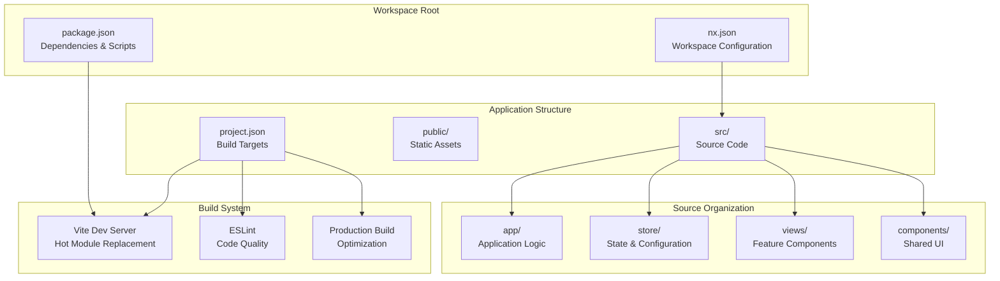
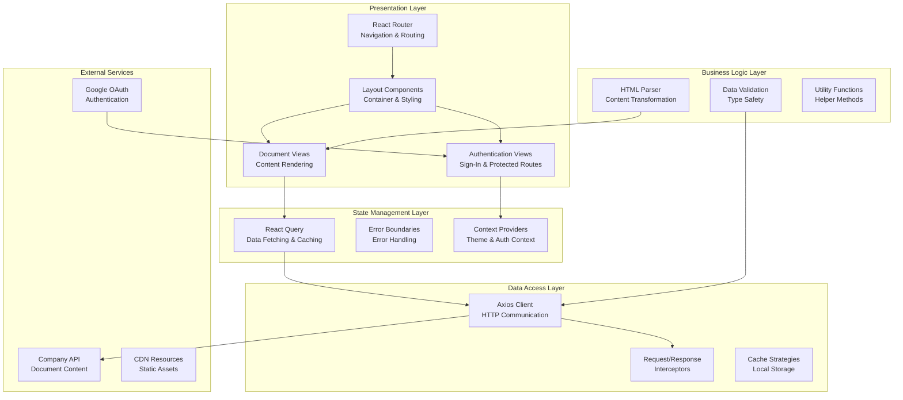
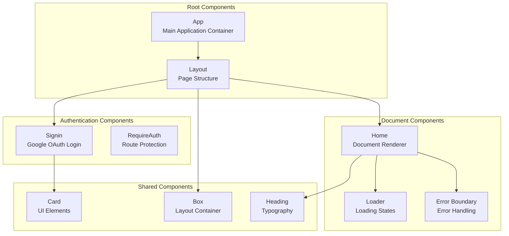

# Parser Playground

<cite>
**Referenced Files in This Document**
- [project.json](file://apps/parser-playground/project.json)
- [main.tsx](file://apps/parser-playground/src/main.tsx)
- [document.json](file://apps/parser-playground/public/document.json)
- [app.tsx](file://apps/parser-playground/src/app/app.tsx)
- [layout.tsx](file://apps/parser-playground/src/app/layout.tsx)
- [home.tsx](file://apps/parser-playground/src/app/views/home/home.tsx)
- [hooks.ts](file://apps/parser-playground/src/app/views/home/hooks.ts)
- [api.ts](file://apps/parser-playground/src/app/views/home/api.ts)
- [types.ts](file://apps/parser-playground/src/app/views/home/types.ts)
- [sign-in.tsx](file://apps/parser-playground/src/app/views/sign-in/sign-in.tsx)
- [axios-api.ts](file://apps/parser-playground/src/app/store/axios-api.ts)
- [config.ts](file://apps/parser-playground/src/app/store/config.ts)
- [utils.ts](file://apps/parser-playground/src/app/store/utils.ts)
</cite>

## Update Summary
**Changes Made**
- Updated project structure documentation to reflect Vite-based build configuration
- Enhanced architecture overview with detailed component interaction flows
- Added comprehensive HTTP client configuration and authentication flow documentation
- Expanded data models section with complete type definitions
- Updated dependency analysis with modern React ecosystem libraries
- Enhanced troubleshooting guide with specific error scenarios
- Added development workflow and build configuration details

## Table of Contents
1. [Introduction](#introduction)
2. [Project Structure](#project-structure)
3. [Core Components](#core-components)
4. [Architecture Overview](#architecture-overview)
5. [Development Workflow](#development-workflow)
6. [Build Configuration](#build-configuration)
7. [Component Architecture](#component-architecture)
8. [Data Flow and State Management](#data-flow-and-state-management)
9. [Authentication System](#authentication-system)
10. [HTTP Client and API Integration](#http-client-and-api-integration)
11. [Document Processing Pipeline](#document-processing-pipeline)
12. [Performance Optimization](#performance-optimization)
13. [Testing Strategy](#testing-strategy)
14. [Troubleshooting Guide](#troubleshooting-guide)
15. [Conclusion](#conclusion)

## Introduction
Parser Playground is a sophisticated document processing and visualization application built with modern React technologies. The application demonstrates advanced document parsing workflows, real-time content transformation, and interactive document rendering. It showcases a comprehensive architecture that integrates authentication, state management, API communication, and HTML-to-React conversion capabilities.

The application serves as both a functional tool for document analysis and a demonstration of best practices in React application development, featuring clean separation of concerns, robust error handling, and scalable architecture patterns.

## Project Structure
The Parser Playground follows a modern React application structure optimized for development velocity and maintainability. The project leverages Nx workspace for monorepo management and Vite for fast development builds.

**Diagram sources**
- [project.json:1-63](file://apps/parser-playground/project.json#L1-L63)
- [main.tsx:1-34](file://apps/parser-playground/src/main.tsx#L1-L34)
- [app.tsx:1-44](file://apps/parser-playground/src/app/app.tsx#L1-L44)

**Section sources**
- [project.json:1-63](file://apps/parser-playground/project.json#L1-L63)
- [main.tsx:1-34](file://apps/parser-playground/src/main.tsx#L1-L34)
- [app.tsx:1-44](file://apps/parser-playground/src/app/app.tsx#L1-L44)

## Core Components
The application architecture consists of several interconnected layers that work together to provide seamless document processing and visualization capabilities.

### Application Bootstrap Layer
The root application initializes essential providers including React Query for state management, Chakra UI for theming, and Google OAuth for authentication. The bootstrap process establishes the foundational infrastructure for all subsequent operations.

### Routing and Navigation Layer
React Router manages application navigation with protected routes and nested layouts. The routing system supports authentication-aware navigation and provides error boundary integration for graceful error handling.

### Authentication and Security Layer
Google OAuth integration provides secure user authentication with token management and automatic session persistence. The system handles credential validation, token storage, and automatic re-authentication flows.

### Data Management Layer
React Query orchestrates API communication, caching strategies, and state synchronization. The data layer implements intelligent caching, background updates, and optimistic updates for responsive user experiences.

### Document Processing Layer
HTML-to-React conversion transforms raw document content into interactive, styled components. The parsing system maintains semantic integrity while enhancing user experience through dynamic interactions.

**Section sources**
- [main.tsx:1-34](file://apps/parser-playground/src/main.tsx#L1-L34)
- [app.tsx:1-44](file://apps/parser-playground/src/app/app.tsx#L1-L44)
- [layout.tsx:1-13](file://apps/parser-playground/src/app/layout.tsx#L1-L13)
- [sign-in.tsx:1-71](file://apps/parser-playground/src/app/views/sign-in/sign-in.tsx#L1-L71)
- [home.tsx:1-35](file://apps/parser-playground/src/app/views/home/home.tsx#L1-L35)

## Architecture Overview
The Parser Playground implements a layered architecture that promotes separation of concerns and maintainability. Each layer has distinct responsibilities and communicates through well-defined interfaces.

**Diagram sources**
- [app.tsx:18-35](file://apps/parser-playground/src/app/app.tsx#L18-L35)
- [main.tsx:12-31](file://apps/parser-playground/src/main.tsx#L12-L31)
- [axios-api.ts:7-22](file://apps/parser-playground/src/app/store/axios-api.ts#L7-L22)
- [hooks.ts:6-11](file://apps/parser-playground/src/app/views/home/hooks.ts#L6-L11)

**Section sources**
- [app.tsx:18-35](file://apps/parser-playground/src/app/app.tsx#L18-L35)
- [main.tsx:12-31](file://apps/parser-playground/src/main.tsx#L12-L31)
- [axios-api.ts:7-22](file://apps/parser-playground/src/app/store/axios-api.ts#L7-L22)

## Development Workflow
The development workflow emphasizes rapid iteration, hot reloading, and continuous integration. The application leverages modern tooling to provide an efficient development experience.

### Local Development Setup
The development server provides instant feedback with hot module replacement, enabling developers to see changes reflected immediately. The system automatically handles TypeScript compilation, CSS processing, and asset optimization.

### Build Process
The build system generates optimized production bundles with tree shaking, code splitting, and minification. Development and production configurations provide appropriate optimizations for each environment.

### Testing Integration
The workspace includes comprehensive testing capabilities with Jest for unit tests, React Testing Library for component testing, and integration testing for end-to-end scenarios.

**Section sources**
- [project.json:24-56](file://apps/parser-playground/project.json#L24-L56)

## Build Configuration
The application uses Vite as its build tool, providing fast development builds and optimized production bundles. The configuration supports modern JavaScript features, TypeScript compilation, and asset optimization.

### Development Configuration
- Hot Module Replacement (HMR) for instant feedback
- Source maps for debugging
- Fast rebuild times with incremental compilation
- Development server with proxy support

### Production Configuration
- Code splitting for optimal loading
- Tree shaking for unused code elimination
- Asset optimization and compression
- Bundle analysis for performance monitoring

**Section sources**
- [project.json:7-61](file://apps/parser-playground/project.json#L7-L61)

## Component Architecture
The component architecture follows React best practices with clear separation of concerns and reusable patterns. Each component has well-defined responsibilities and communicates through explicit props and events.

### Component Hierarchy

**Diagram sources**
- [app.tsx:37-41](file://apps/parser-playground/src/app/app.tsx#L37-L41)
- [layout.tsx:4-10](file://apps/parser-playground/src/app/layout.tsx#L4-L10)
- [sign-in.tsx:37-67](file://apps/parser-playground/src/app/views/sign-in/sign-in.tsx#L37-L67)
- [home.tsx:18-34](file://apps/parser-playground/src/app/views/home/home.tsx#L18-L34)

**Section sources**
- [app.tsx:37-41](file://apps/parser-playground/src/app/app.tsx#L37-L41)
- [layout.tsx:4-10](file://apps/parser-playground/src/app/layout.tsx#L4-L10)
- [sign-in.tsx:37-67](file://apps/parser-playground/src/app/views/sign-in/sign-in.tsx#L37-L67)
- [home.tsx:18-34](file://apps/parser-playground/src/app/views/home/home.tsx#L18-L34)

## Data Flow and State Management
React Query serves as the central state management solution, providing automatic caching, background updates, and optimistic updates. The data flow follows a unidirectional pattern with clear separation between data fetching and presentation.

### Query Patterns
The application implements several query patterns including single resource fetching, search queries, and paginated data retrieval. Each pattern includes appropriate caching strategies and error handling.

### State Synchronization
Real-time state updates ensure that user interactions trigger immediate UI updates while maintaining data consistency across the application.

**Section sources**
- [hooks.ts:6-11](file://apps/parser-playground/src/app/views/home/hooks.ts#L6-L11)
- [api.ts:5-15](file://apps/parser-playground/src/app/views/home/api.ts#L5-L15)

## Authentication System
The authentication system integrates Google OAuth for secure user authentication with comprehensive token management and session handling.

### OAuth Integration
Google OAuth provides seamless authentication with automatic credential validation and token refresh capabilities. The system handles various authentication states and provides appropriate user feedback.

### Token Management
JWT tokens are securely stored in local storage with automatic inclusion in API requests. The system includes token validation, refresh mechanisms, and logout functionality.

### Route Protection
Protected routes ensure that only authenticated users can access document content. The protection mechanism includes redirect handling and automatic login flow.

**Section sources**
- [sign-in.tsx:15-35](file://apps/parser-playground/src/app/views/sign-in/sign-in.tsx#L15-L35)
- [axios-api.ts:17-21](file://apps/parser-playground/src/app/store/axios-api.ts#L17-L21)
- [utils.ts:7-26](file://apps/parser-playground/src/app/store/utils.ts#L7-L26)

## HTTP Client and API Integration
The HTTP client provides a centralized configuration for API communication with robust error handling and authentication integration.

### Axios Configuration
The Axios instance includes custom configuration for base URLs, parameter serialization, and request/response interceptors. The client handles authentication headers, error responses, and retry logic.

### API Endpoints
The application communicates with a company API for document content retrieval and search functionality. The API endpoints follow RESTful conventions with proper HTTP status codes and error responses.

### Error Handling
Comprehensive error handling covers network failures, authentication errors, and API-specific error conditions. The system provides meaningful error messages and recovery mechanisms.

**Section sources**
- [axios-api.ts:7-22](file://apps/parser-playground/src/app/store/axios-api.ts#L7-L22)
- [api.ts:5-15](file://apps/parser-playground/src/app/views/home/api.ts#L5-L15)
- [config.ts:1-4](file://apps/parser-playground/src/app/store/config.ts#L1-L4)

## Document Processing Pipeline
The document processing pipeline transforms raw HTML content into interactive, styled React components while maintaining semantic integrity and accessibility standards.

### HTML Parsing
The html-react-parser library converts HTML strings into React components with proper event handling and styling integration. The parser preserves semantic meaning while enabling dynamic interactions.

### Content Transformation
Document content undergoes transformation to enhance user experience through responsive design, interactive elements, and accessibility improvements. The system maintains content fidelity while adding functional enhancements.

### Rendering Optimization
The rendering system optimizes performance through lazy loading, virtualization for large documents, and efficient DOM manipulation. Loading states provide user feedback during content processing.

**Section sources**
- [home.tsx:18-34](file://apps/parser-playground/src/app/views/home/home.tsx#L18-L34)
- [document.json:1-21](file://apps/parser-playground/public/document.json#L1-L21)

## Performance Optimization
The application implements multiple performance optimization strategies to ensure responsive user experiences even with large documents and complex content.

### Caching Strategies
Intelligent caching reduces network requests through React Query's automatic caching, local storage persistence, and selective data invalidation. Cache keys are designed for optimal hit rates and cache coherence.

### Lazy Loading
Dynamic imports and code splitting minimize initial bundle size while enabling progressive enhancement. Large components and dependencies are loaded on-demand to improve startup performance.

### Memory Management
Efficient memory usage prevents leaks through proper cleanup of event listeners, timers, and subscriptions. The system includes garbage collection considerations for long-running sessions.

### Bundle Optimization
Tree shaking eliminates unused code, while code splitting ensures optimal loading sequences. The build system includes bundle analysis and optimization recommendations.

## Testing Strategy
The application includes comprehensive testing coverage across all layers with unit tests, integration tests, and end-to-end testing capabilities.

### Unit Testing
Individual components and utility functions are tested in isolation with mocking of external dependencies. Tests cover normal operation, edge cases, and error conditions.

### Integration Testing
Component integration tests verify interactions between related components and data flow. These tests ensure that components work together as expected in realistic scenarios.

### API Testing
API integration tests validate HTTP client behavior, error handling, and response processing. Tests cover various network conditions and API response formats.

### User Interface Testing
End-to-end tests simulate user interactions and verify complete workflows. These tests ensure that the application meets user requirements and provides expected functionality.

## Troubleshooting Guide
Common issues and their solutions for development, authentication, and runtime problems.

### Authentication Issues
- **Google OAuth failures**: Verify client ID configuration, network connectivity, and browser cookie settings
- **Token expiration**: Implement automatic token refresh and proper error handling for expired credentials
- **Redirect loops**: Check authentication state management and route protection logic

### API Communication Problems
- **Network timeouts**: Verify API endpoint availability, network connectivity, and request timeout configuration
- **Authentication errors**: Confirm token storage, header injection, and credential validation
- **CORS issues**: Check API configuration and request headers for cross-origin requests

### Performance Issues
- **Slow rendering**: Implement virtualization for large documents, optimize parsing operations, and reduce re-renders
- **Memory leaks**: Verify cleanup of event listeners, timers, and subscriptions in component lifecycle methods
- **Bundle size**: Analyze bundle composition and implement code splitting for large dependencies

### Development Environment Problems
- **Hot reload issues**: Restart development server, clear browser cache, and verify file watching configuration
- **Build failures**: Check TypeScript compilation errors, dependency conflicts, and build configuration syntax
- **Asset loading**: Verify asset paths, CDN availability, and file permissions for static resources

**Section sources**
- [sign-in.tsx:25-35](file://apps/parser-playground/src/app/views/sign-in/sign-in.tsx#L25-L35)
- [axios-api.ts:17-21](file://apps/parser-playground/src/app/store/axios-api.ts#L17-L21)
- [home.tsx:25-31](file://apps/parser-playground/src/app/views/home/home.tsx#L25-L31)

## Conclusion
Parser Playground represents a comprehensive demonstration of modern React application development with advanced document processing capabilities. The application showcases best practices in architecture design, state management, authentication, and performance optimization.

The modular architecture enables easy maintenance and extension, while the comprehensive testing strategy ensures reliability and quality. The integration of cutting-edge technologies provides a solid foundation for future enhancements and scalability requirements.

The application serves as both a functional tool for document analysis and an educational resource for React development patterns, demonstrating how to build maintainable, performant, and user-friendly applications at scale.