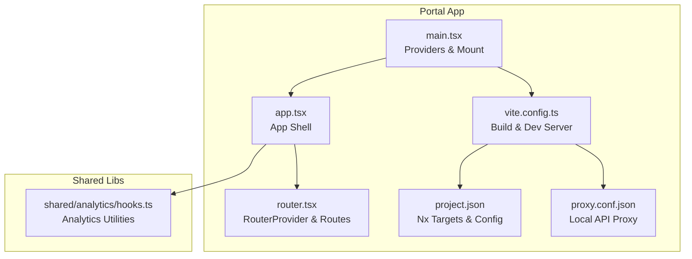
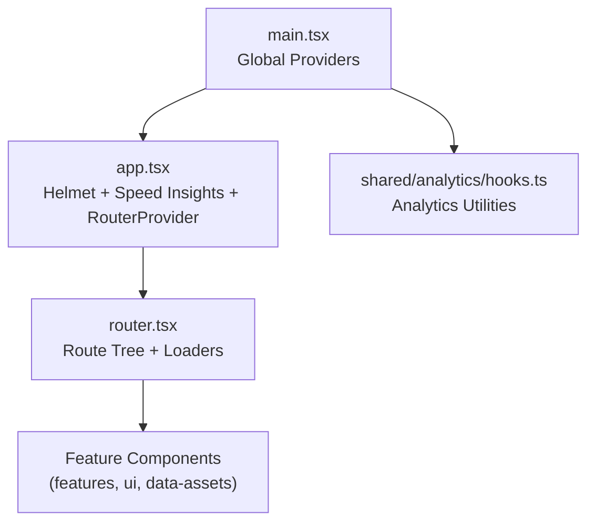
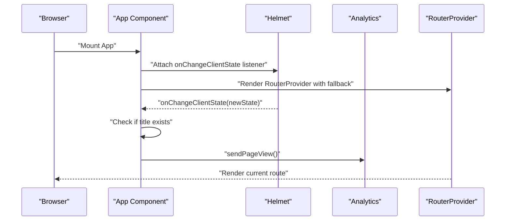
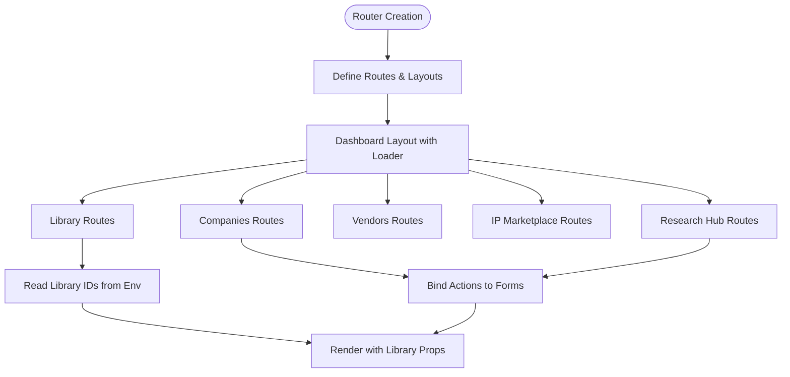
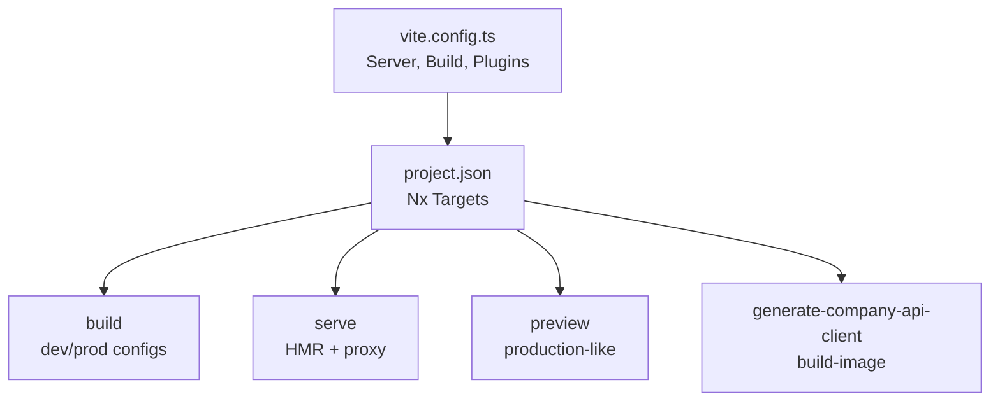
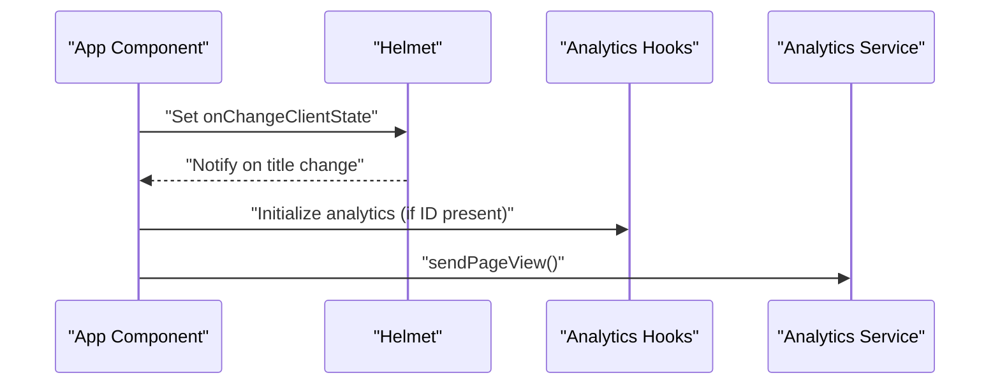
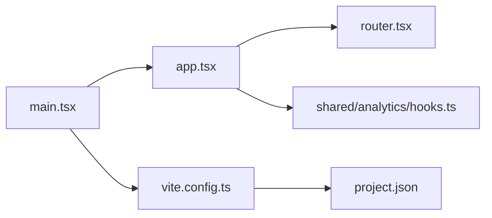

# Application Structure

<cite>
**Referenced Files in This Document**
- [main.tsx](file://apps/portal/src/main.tsx)
- [app.tsx](file://apps/portal/src/app/app.tsx)
- [router.tsx](file://apps/portal/src/router.tsx)
- [vite.config.ts](file://apps/portal/vite.config.ts)
- [project.json](file://apps/portal/project.json)
- [proxy.conf.json](file://apps/portal/proxy.conf.json)
- [hooks.ts](file://libs/shared/analytics/src/lib/hooks.ts)
</cite>

## Table of Contents
1. [Introduction](#introduction)
2. [Project Structure](#project-structure)
3. [Core Components](#core-components)
4. [Architecture Overview](#architecture-overview)
5. [Detailed Component Analysis](#detailed-component-analysis)
6. [Dependency Analysis](#dependency-analysis)
7. [Performance Considerations](#performance-considerations)
8. [Troubleshooting Guide](#troubleshooting-guide)
9. [Conclusion](#conclusion)

## Introduction
This document describes the Portal application structure, focusing on the main App component architecture, Helmet-based SEO and analytics integration, RouterProvider setup, fallback loading states, hot module replacement handling, Vite configuration and build process, project metadata, application initialization sequence, global providers, and performance monitoring with Speed Insights. It also covers the development server configuration, environment variables, and deployment preparation.

## Project Structure
The Portal application is organized as a Vite-powered React application under apps/portal. Key areas include:
- Entry point and providers: apps/portal/src/main.tsx
- Application shell and routing: apps/portal/src/app/app.tsx and apps/portal/src/router.tsx
- Build and dev server configuration: apps/portal/vite.config.ts and apps/portal/project.json
- Proxy configuration for local API traffic: apps/portal/proxy.conf.json
- Shared analytics utilities: libs/shared/analytics/src/lib/hooks.ts

**Diagram sources**
- [main.tsx](file://apps/portal/src/main.tsx)
- [app.tsx](file://apps/portal/src/app/app.tsx)
- [router.tsx](file://apps/portal/src/router.tsx)
- [vite.config.ts](file://apps/portal/vite.config.ts)
- [project.json](file://apps/portal/project.json)
- [proxy.conf.json](file://apps/portal/proxy.conf.json)
- [hooks.ts](file://libs/shared/analytics/src/lib/hooks.ts)

**Section sources**
- [main.tsx](file://apps/portal/src/main.tsx)
- [app.tsx](file://apps/portal/src/app/app.tsx)
- [router.tsx](file://apps/portal/src/router.tsx)
- [vite.config.ts](file://apps/portal/vite.config.ts)
- [project.json](file://apps/portal/project.json)
- [proxy.conf.json](file://apps/portal/proxy.conf.json)
- [hooks.ts](file://libs/shared/analytics/src/lib/hooks.ts)

## Core Components
- Providers and initialization sequence:
  - Global providers are established in the entry point and include OAuth, React Query, analytics, UI theme, and the application shell.
  - Environment variables are read for analytics and authentication.
- App shell:
  - Uses Helmet to manage document head changes and trigger analytics page views.
  - Integrates Speed Insights for performance monitoring.
  - Renders RouterProvider with a fallback loader.
- Router:
  - Centralized route tree with loaders, actions, nested routes, and environment-specific configuration.
  - Includes dashboard layout, library routes, company management, vendors, IP marketplace, research hub, and sign-in.

**Section sources**
- [main.tsx](file://apps/portal/src/main.tsx)
- [app.tsx](file://apps/portal/src/app/app.tsx)
- [router.tsx](file://apps/portal/src/router.tsx)

## Architecture Overview
The application follows a layered architecture:
- Entry point initializes providers and mounts the root component.
- App component sets up SEO/analytics via Helmet and renders the router with a fallback loader.
- RouterProvider manages route transitions, loaders, and nested layouts.
- Shared analytics utilities support initialization and event tracking.

**Diagram sources**
- [main.tsx](file://apps/portal/src/main.tsx)
- [app.tsx](file://apps/portal/src/app/app.tsx)
- [router.tsx](file://apps/portal/src/router.tsx)
- [hooks.ts](file://libs/shared/analytics/src/lib/hooks.ts)

## Detailed Component Analysis

### Entry Point and Provider Initialization
The entry point composes global providers and mounts the application:
- Initializes analytics and Hotjar if environment variables are present.
- Wraps the app with OAuth provider, React Query provider, devtools, and UI theme provider.
- Renders the root App component.

Key behaviors:
- Analytics initialization is controlled by environment variable.
- Hotjar initialization is controlled by environment variable.
- React Query devtools are enabled in the entry point.

**Section sources**
- [main.tsx](file://apps/portal/src/main.tsx)

### App Component: Helmet, Analytics, and RouterProvider
The App component orchestrates:
- Helmet integration to listen for head changes and dispatch analytics page views after the document title updates.
- Speed Insights integration for performance monitoring.
- RouterProvider with a fallback loader rendered while routes are loading.

Operational flow:
- On document title change, the app sends a page view to analytics only when a title exists.
- The router is disposed during hot module replacement to prevent memory leaks.

**Diagram sources**
- [app.tsx](file://apps/portal/src/app/app.tsx)

**Section sources**
- [app.tsx](file://apps/portal/src/app/app.tsx)

### RouterProvider Setup, Loaders, Actions, and Nested Routes
The router defines:
- A dashboard layout with a loader that fetches user info.
- Nested routes for libraries, companies, vendors, IP marketplace, research hub, and more.
- Environment-specific configuration via environment variables for library IDs.
- Actions bound to forms for infrastructure-related workflows.

Notable aspects:
- Error boundary is configured via a root boundary component.
- Route loaders ensure user context is available before rendering protected routes.
- Environment variables control library identifiers used in route props.

**Diagram sources**
- [router.tsx](file://apps/portal/src/router.tsx)

**Section sources**
- [router.tsx](file://apps/portal/src/router.tsx)

### Vite Configuration, Build Process, and Project Metadata
Vite configuration:
- Output directory for builds, dependency optimization, preview server, and plugin setup.
- Alias for a shim to bridge compatibility with chakra-react-select.
- Test configuration for Vitest.

Nx targets:
- Build executor with development and production configurations.
- Serve target with HMR and proxy configuration.
- Preview server target for production-like previews.
- Additional commands for generating external API clients and container builds.

**Diagram sources**
- [vite.config.ts](file://apps/portal/vite.config.ts)
- [project.json](file://apps/portal/project.json)

**Section sources**
- [vite.config.ts](file://apps/portal/vite.config.ts)
- [project.json](file://apps/portal/project.json)

### Development Server, Environment Variables, and Deployment Preparation
Development server:
- Vite dev server runs on a configurable port with HMR enabled by default.
- Proxy configuration forwards API requests to a local backend.

Environment variables:
- Analytics measurement ID and Hotjar site ID are read from environment variables.
- Library IDs for portal and developer library are read from environment variables and passed to route components.

Deployment preparation:
- Nx targets include a preview server for production-like testing.
- Container build target is available for deployment.

**Section sources**
- [vite.config.ts](file://apps/portal/vite.config.ts)
- [project.json](file://apps/portal/project.json)
- [proxy.conf.json](file://apps/portal/proxy.conf.json)
- [router.tsx](file://apps/portal/src/router.tsx)
- [main.tsx](file://apps/portal/src/main.tsx)

### Analytics Integration and Helmet-Based SEO Management
Analytics integration:
- Analytics utilities provide initialization and search event hooks.
- The App component uses Helmet to trigger page view events after the document title is set.

SEO management:
- Helmet listens to head changes and ensures page view events are sent only after dynamic titles are applied.

**Diagram sources**
- [app.tsx](file://apps/portal/src/app/app.tsx)
- [hooks.ts](file://libs/shared/analytics/src/lib/hooks.ts)

**Section sources**
- [app.tsx](file://apps/portal/src/app/app.tsx)
- [hooks.ts](file://libs/shared/analytics/src/lib/hooks.ts)

## Dependency Analysis
High-level dependencies:
- Entry point depends on providers and the App component.
- App component depends on RouterProvider and analytics utilities.
- Router depends on feature components and shared data assets.
- Vite configuration and Nx targets govern build and serve behavior.

**Diagram sources**
- [main.tsx](file://apps/portal/src/main.tsx)
- [app.tsx](file://apps/portal/src/app/app.tsx)
- [router.tsx](file://apps/portal/src/router.tsx)
- [vite.config.ts](file://apps/portal/vite.config.ts)
- [project.json](file://apps/portal/project.json)
- [hooks.ts](file://libs/shared/analytics/src/lib/hooks.ts)

**Section sources**
- [main.tsx](file://apps/portal/src/main.tsx)
- [app.tsx](file://apps/portal/src/app/app.tsx)
- [router.tsx](file://apps/portal/src/router.tsx)
- [vite.config.ts](file://apps/portal/vite.config.ts)
- [project.json](file://apps/portal/project.json)
- [hooks.ts](file://libs/shared/analytics/src/lib/hooks.ts)

## Performance Considerations
- Speed Insights integration is included at the App level for performance monitoring.
- Vite build configurations differ between development and production modes to balance build speed and runtime performance.
- React Query devtools are available in the entry point to aid debugging during development.

[No sources needed since this section provides general guidance]

## Troubleshooting Guide
Common issues and checks:
- Analytics not reporting:
  - Verify environment variables for analytics and Hotjar IDs.
  - Confirm Helmet title change triggers page view events.
- Router not loading:
  - Ensure loaders resolve and error boundaries are configured.
  - Check nested route paths and action bindings.
- Development server proxy errors:
  - Confirm proxy target matches the intended backend address.
- Build failures:
  - Review Nx build configurations and Vite plugin setup.

**Section sources**
- [main.tsx](file://apps/portal/src/main.tsx)
- [app.tsx](file://apps/portal/src/app/app.tsx)
- [router.tsx](file://apps/portal/src/router.tsx)
- [proxy.conf.json](file://apps/portal/proxy.conf.json)
- [project.json](file://apps/portal/project.json)

## Conclusion
The Portal application is structured around a clean provider initialization sequence, a Helmet-driven SEO/analytics pipeline, and a comprehensive RouterProvider setup with loaders and actions. Vite and Nx targets streamline development and deployment, while environment variables control feature-specific configuration. The architecture supports maintainability, observability, and scalable growth across feature domains.