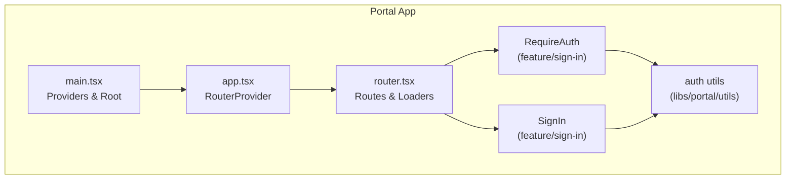
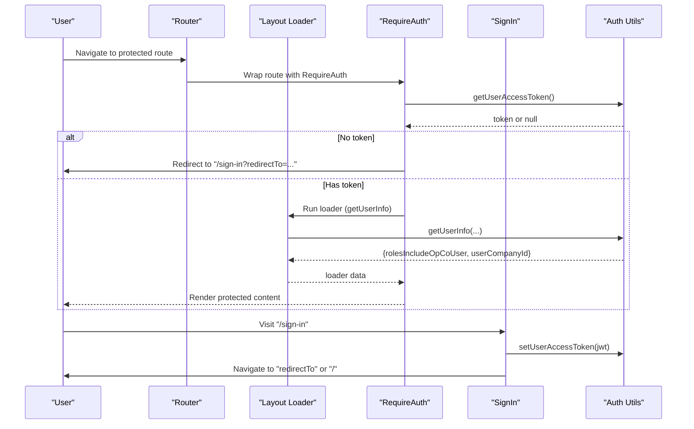
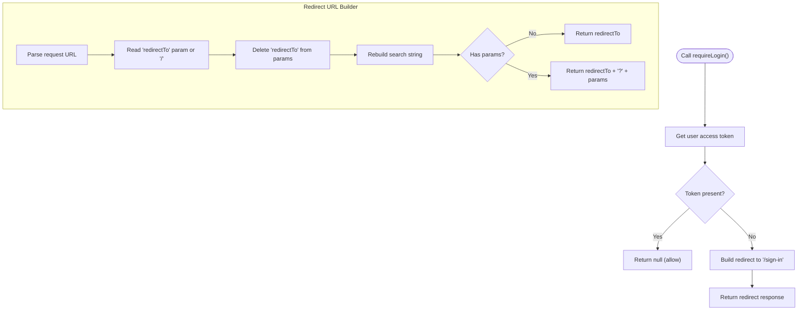
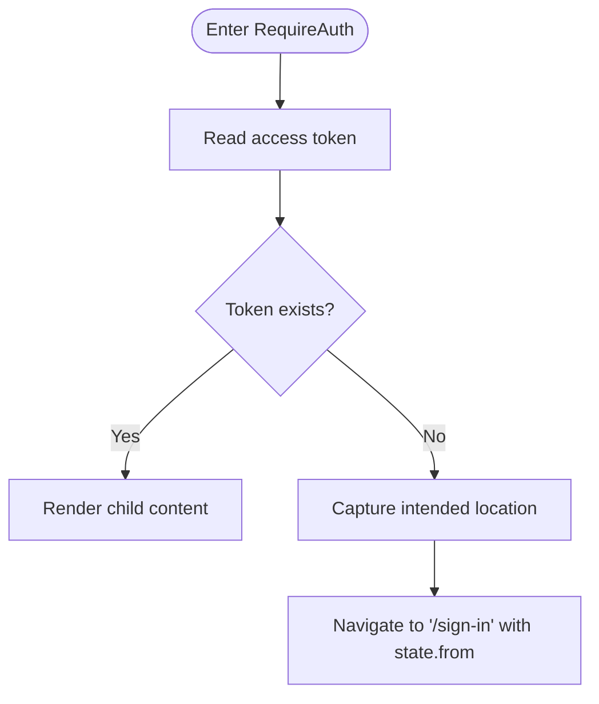
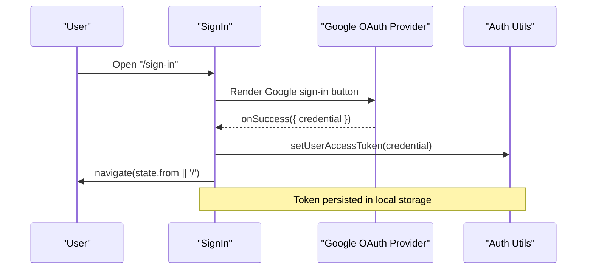
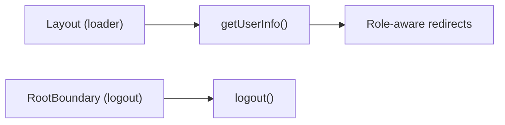
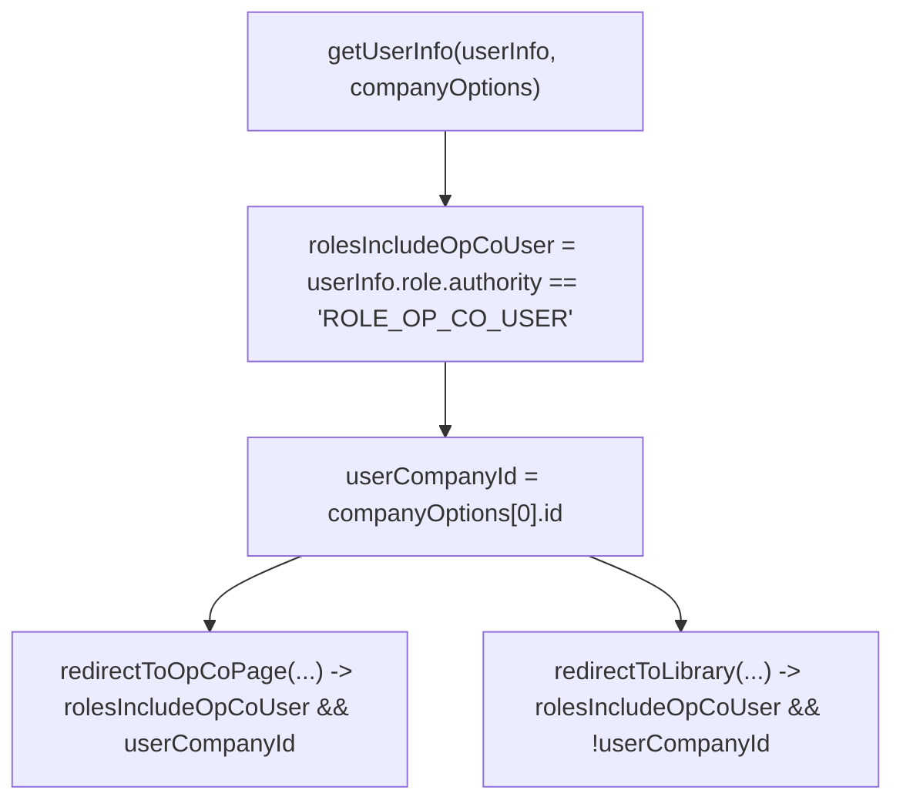
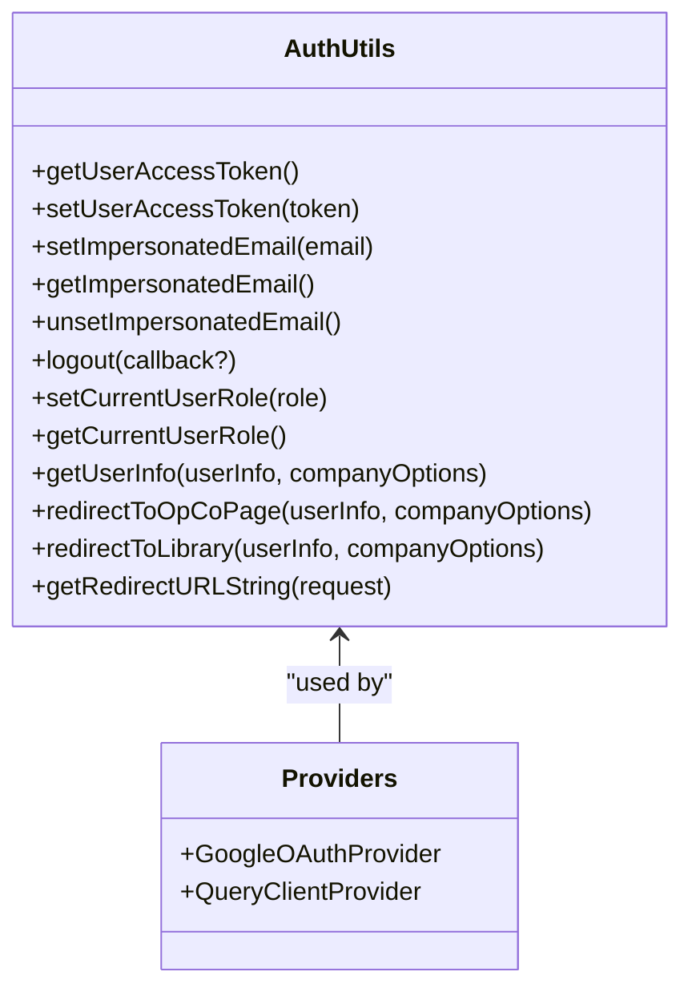
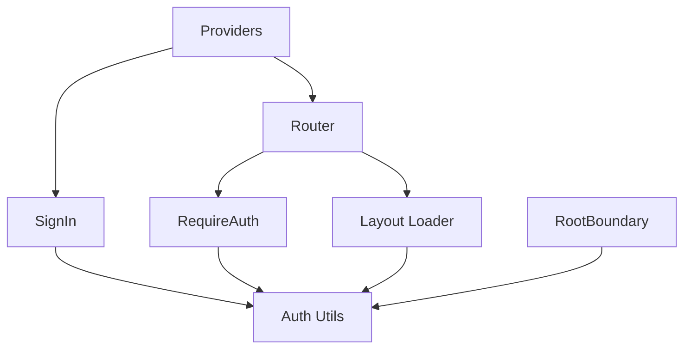

# Authentication Flow

<cite>
**Referenced Files in This Document**
- [auth.ts](file://libs/portal/utils/src/lib/auth.ts)
- [router.tsx](file://apps/portal/src/router.tsx)
- [app.tsx](file://apps/portal/src/app/app.tsx)
- [main.tsx](file://apps/portal/src/main.tsx)
- [require-auth.tsx](file://libs/portal/features/sign-in/src/lib/require-auth/require-auth.tsx)
- [sign-in.tsx](file://libs/portal/features/sign-in/src/lib/sign-in.tsx)
- [authentication.ts](file://libs/third-party-network/utils/src/lib/authentication.ts)
</cite>

## Table of Contents
1. [Introduction](#introduction)
2. [Project Structure](#project-structure)
3. [Core Components](#core-components)
4. [Architecture Overview](#architecture-overview)
5. [Detailed Component Analysis](#detailed-component-analysis)
6. [Dependency Analysis](#dependency-analysis)
7. [Performance Considerations](#performance-considerations)
8. [Troubleshooting Guide](#troubleshooting-guide)
9. [Conclusion](#conclusion)

## Introduction
This document explains the Portal application authentication flow, focusing on how users sign in, how sessions are managed, how protected routes are enforced, and how user state is handled. It covers the RequireAuth component implementation, protected route patterns, redirect logic, authentication utilities, token management, user profile handling, sign-in and logout flows, state persistence, role-based access control, and security considerations.

## Project Structure
The Portal application is a React SPA bootstrapped in Vite and configured with React Router. Authentication is implemented via Google OAuth integration and local storage-based token persistence. The sign-in page is provided by a feature library and is wired into the main application’s routing. Utilities encapsulate token and role management, and route loaders assist with initial user info resolution.

**Diagram sources**
- [main.tsx:1-41](file://apps/portal/src/main.tsx#L1-L41)
- [app.tsx:1-45](file://apps/portal/src/app/app.tsx#L1-L45)
- [router.tsx:1-250](file://apps/portal/src/router.tsx#L1-L250)
- [require-auth.tsx:1-19](file://libs/portal/features/sign-in/src/lib/require-auth/require-auth.tsx#L1-L19)
- [sign-in.tsx:1-70](file://libs/portal/features/sign-in/src/lib/sign-in.tsx#L1-L70)
- [auth.ts:1-117](file://libs/portal/utils/src/lib/auth.ts#L1-L117)

**Section sources**
- [main.tsx:1-41](file://apps/portal/src/main.tsx#L1-L41)
- [app.tsx:1-45](file://apps/portal/src/app/app.tsx#L1-L45)
- [router.tsx:1-250](file://apps/portal/src/router.tsx#L1-L250)

## Core Components
- Authentication utilities: Token retrieval, storage, impersonation handling, logout, and redirect helpers.
- RequireAuth: Route protection component that enforces authentication via token presence.
- SignIn: Google OAuth-based sign-in page that stores tokens and redirects users to their intended destination.
- Router: Defines protected routes, loaders, and the error boundary integration for logout.
- Providers: Google OAuth provider and React Query provider are initialized at the root.

Key responsibilities:
- Persist and retrieve user access tokens from local storage.
- Determine redirect URLs based on query parameters.
- Enforce authentication for dashboard routes.
- Provide role-aware redirection helpers.

**Section sources**
- [auth.ts:1-117](file://libs/portal/utils/src/lib/auth.ts#L1-L117)
- [require-auth.tsx:1-19](file://libs/portal/features/sign-in/src/lib/require-auth/require-auth.tsx#L1-L19)
- [sign-in.tsx:1-70](file://libs/portal/features/sign-in/src/lib/sign-in.tsx#L1-L70)
- [router.tsx:1-250](file://apps/portal/src/router.tsx#L1-L250)
- [main.tsx:1-41](file://apps/portal/src/main.tsx#L1-L41)

## Architecture Overview
The authentication flow integrates Google OAuth with local storage token management and React Router protections. The sign-in page captures the Google credential, persists the token, and navigates to the originally requested location. Protected routes rely on RequireAuth to enforce authentication, while route loaders fetch user info for role-aware rendering.

**Diagram sources**
- [router.tsx:82-94](file://apps/portal/src/router.tsx#L82-L94)
- [require-auth.tsx:1-19](file://libs/portal/features/sign-in/src/lib/require-auth/require-auth.tsx#L1-L19)
- [sign-in.tsx:1-70](file://libs/portal/features/sign-in/src/lib/sign-in.tsx#L1-L70)
- [auth.ts:17-24](file://libs/portal/utils/src/lib/auth.ts#L17-L24)
- [auth.ts:67-74](file://libs/portal/utils/src/lib/auth.ts#L67-L74)

## Detailed Component Analysis

### Authentication Utilities
The auth utilities module centralizes token and role management:
- Token storage and retrieval via local storage keys.
- Impersonation email handling for admin workflows.
- Logout clears tokens and impersonation state.
- Role-aware helpers compute redirect decisions based on user info and company options.
- Redirect URL builder supports preserving query parameters while honoring a redirectTo target.

**Diagram sources**
- [auth.ts:60-65](file://libs/portal/utils/src/lib/auth.ts#L60-L65)
- [auth.ts:99-116](file://libs/portal/utils/src/lib/auth.ts#L99-L116)

**Section sources**
- [auth.ts:1-117](file://libs/portal/utils/src/lib/auth.ts#L1-L117)

### RequireAuth Component
The RequireAuth component enforces authentication at the route level:
- Reads the stored access token.
- If absent, redirects to the sign-in page and preserves the intended destination in location state.
- If present, renders the child route content.

**Diagram sources**
- [require-auth.tsx:1-19](file://libs/portal/features/sign-in/src/lib/require-auth/require-auth.tsx#L1-L19)

**Section sources**
- [require-auth.tsx:1-19](file://libs/portal/features/sign-in/src/lib/require-auth/require-auth.tsx#L1-L19)

### SignIn Page
The SignIn page integrates Google OAuth:
- Uses Google OAuth provider from the root to render a sign-in button.
- On successful credential response, stores the token and navigates to the previously intended location.
- Preserves error UX for failed sign-ins.

**Diagram sources**
- [sign-in.tsx:1-70](file://libs/portal/features/sign-in/src/lib/sign-in.tsx#L1-L70)
- [main.tsx:30-40](file://apps/portal/src/main.tsx#L30-L40)
- [auth.ts:22-24](file://libs/portal/utils/src/lib/auth.ts#L22-L24)

**Section sources**
- [sign-in.tsx:1-70](file://libs/portal/features/sign-in/src/lib/sign-in.tsx#L1-L70)
- [main.tsx:1-41](file://apps/portal/src/main.tsx#L1-L41)

### Protected Routes and Layout Loader
Protected routes are organized under a dashboard layout with a loader that resolves user info. The error boundary integrates logout to clear session state on errors.

**Diagram sources**
- [router.tsx:88-94](file://apps/portal/src/router.tsx#L88-L94)
- [router.tsx:84-84](file://apps/portal/src/router.tsx#L84-L84)
- [auth.ts:42-47](file://libs/portal/utils/src/lib/auth.ts#L42-L47)

**Section sources**
- [router.tsx:82-94](file://apps/portal/src/router.tsx#L82-L94)

### Role-Based Access Control and Redirect Helpers
The auth utilities expose helpers to compute role-aware redirects:
- Determines if the user qualifies for OP_CO_USER redirection.
- Computes whether to redirect to an OP_CO page or library based on company association.

**Diagram sources**
- [auth.ts:67-96](file://libs/portal/utils/src/lib/auth.ts#L67-L96)

**Section sources**
- [auth.ts:67-96](file://libs/portal/utils/src/lib/auth.ts#L67-L96)

### Session Management and State Persistence
- Tokens are stored in local storage under dedicated keys.
- Impersonation email is stored separately for admin workflows and cleared during sign-in.
- Logout removes tokens and impersonation state, enabling clean re-authentication.
- Providers initialize at the root to enable OAuth and data fetching.

**Diagram sources**
- [auth.ts:17-116](file://libs/portal/utils/src/lib/auth.ts#L17-L116)
- [main.tsx:30-40](file://apps/portal/src/main.tsx#L30-L40)

**Section sources**
- [auth.ts:1-117](file://libs/portal/utils/src/lib/auth.ts#L1-L117)
- [main.tsx:1-41](file://apps/portal/src/main.tsx#L1-L41)

### Third-Party Network Authentication Utility
A separate utility library provides basic token storage and retrieval for third-party network features. While distinct from Portal’s auth, it demonstrates a consistent pattern for token management across the monorepo.

**Section sources**
- [authentication.ts:1-13](file://libs/third-party-network/utils/src/lib/authentication.ts#L1-L13)

## Dependency Analysis
The Portal authentication stack exhibits clear separation of concerns:
- UI and routing depend on RequireAuth and route loaders.
- Auth utilities encapsulate token and role logic.
- Providers enable OAuth and data fetching.
- The error boundary invokes logout to reset state.

**Diagram sources**
- [router.tsx:82-94](file://apps/portal/src/router.tsx#L82-L94)
- [require-auth.tsx:1-19](file://libs/portal/features/sign-in/src/lib/require-auth/require-auth.tsx#L1-L19)
- [sign-in.tsx:1-70](file://libs/portal/features/sign-in/src/lib/sign-in.tsx#L1-L70)
- [auth.ts:1-117](file://libs/portal/utils/src/lib/auth.ts#L1-L117)
- [main.tsx:30-40](file://apps/portal/src/main.tsx#L30-L40)

**Section sources**
- [router.tsx:1-250](file://apps/portal/src/router.tsx#L1-L250)
- [require-auth.tsx:1-19](file://libs/portal/features/sign-in/src/lib/require-auth/require-auth.tsx#L1-L19)
- [sign-in.tsx:1-70](file://libs/portal/features/sign-in/src/lib/sign-in.tsx#L1-L70)
- [auth.ts:1-117](file://libs/portal/utils/src/lib/auth.ts#L1-L117)
- [main.tsx:1-41](file://apps/portal/src/main.tsx#L1-L41)

## Performance Considerations
- Local storage reads/writes are synchronous and lightweight; keep token sizes minimal.
- Avoid frequent re-renders by memoizing computed role flags and redirect decisions.
- Defer heavy computations in loaders until user info is available.
- Use React Query to cache user info and reduce repeated network calls.

## Troubleshooting Guide
Common issues and resolutions:
- Stuck on sign-in: Verify Google OAuth credentials and that the token is being stored after sign-in.
- Redirect loops: Ensure redirectTo is sanitized and does not include redirectTo itself in query params.
- Role-based redirect incorrect: Confirm company options and user role authority align with expectations.
- Session not clearing: Invoke logout to remove tokens and impersonation state; confirm RootBoundary integration.
- Multi-factor authentication: Not currently integrated in the provided code; consult backend APIs and feature flags for MFA support.

**Section sources**
- [auth.ts:42-47](file://libs/portal/utils/src/lib/auth.ts#L42-L47)
- [auth.ts:99-116](file://libs/portal/utils/src/lib/auth.ts#L99-L116)
- [router.tsx:84-84](file://apps/portal/src/router.tsx#L84-L84)

## Conclusion
The Portal application implements a robust, modular authentication flow centered on Google OAuth and local storage token management. RequireAuth and route loaders provide strong protection for dashboard routes, while redirect helpers enable role-aware navigation. The design cleanly separates concerns across providers, utilities, and UI components, supporting maintainability and future enhancements such as MFA integration.