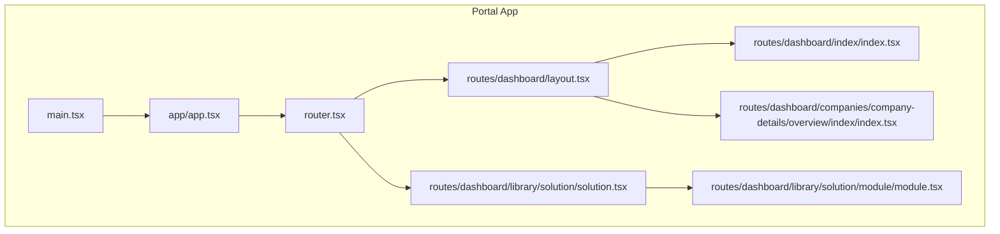
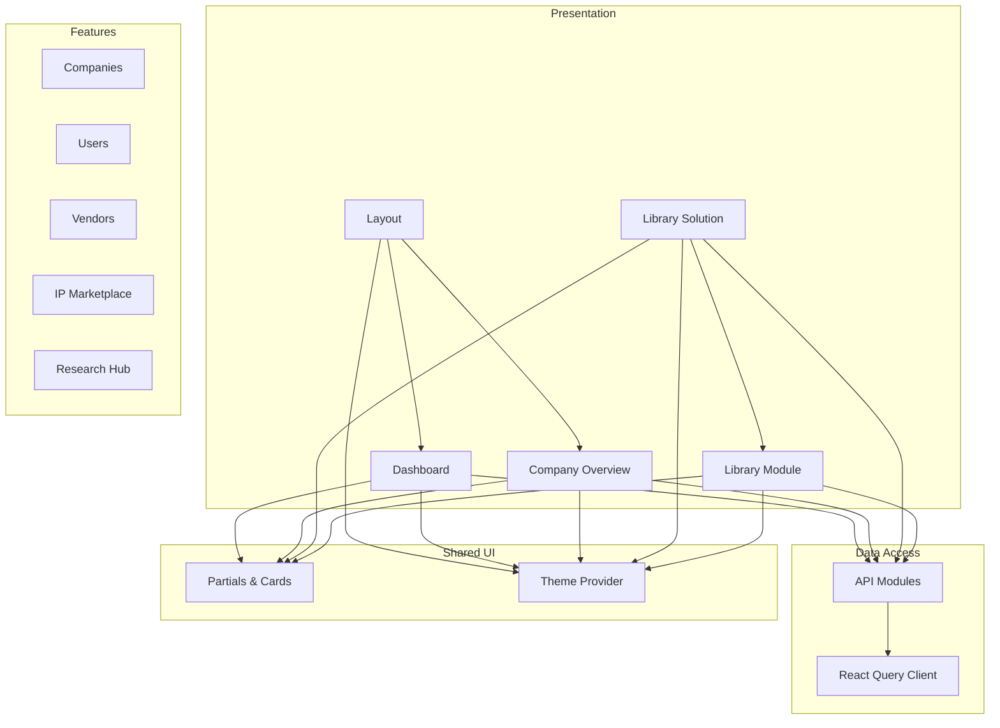
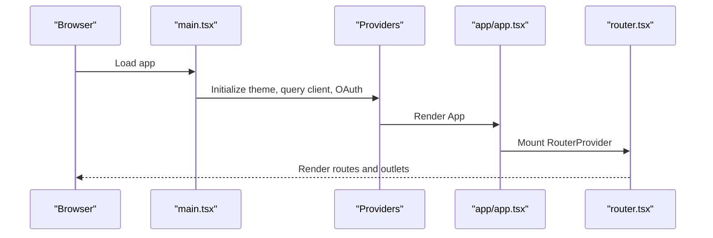
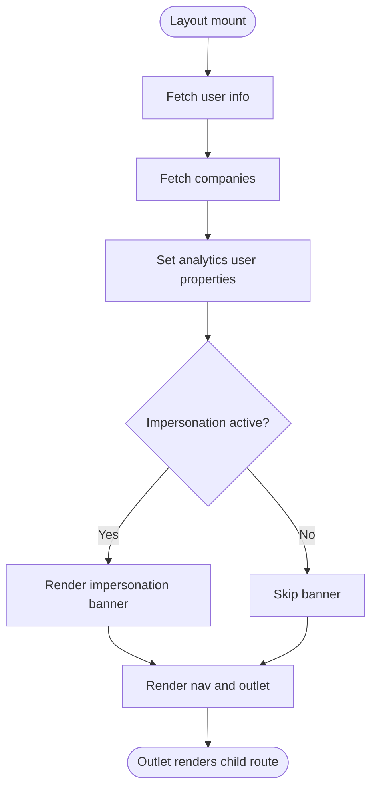
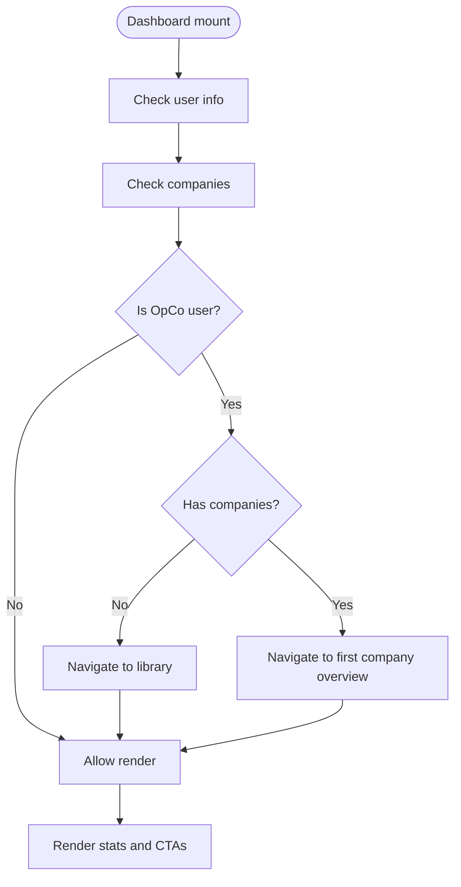
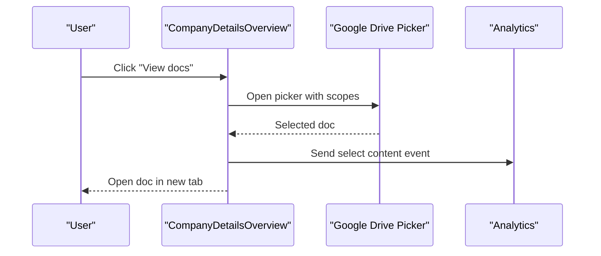
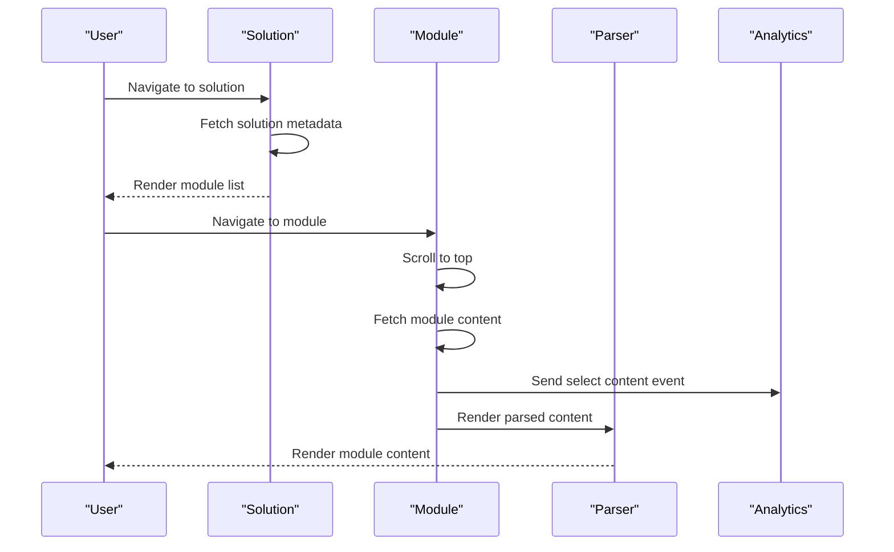
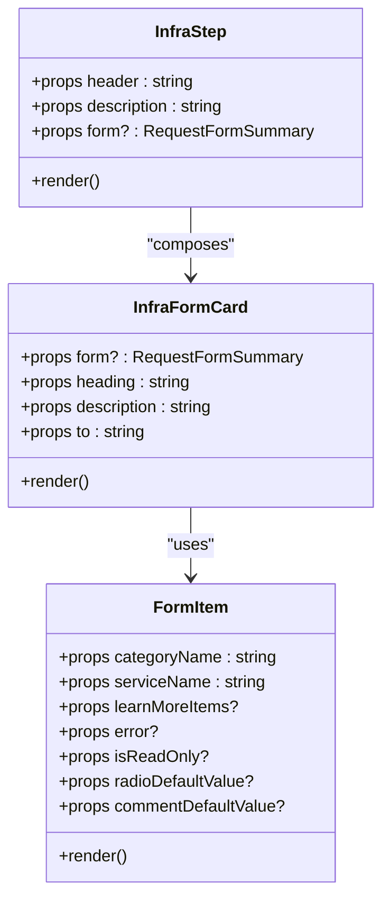
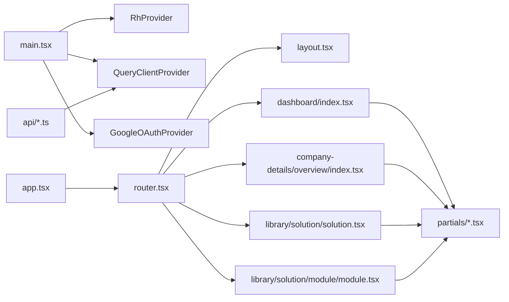

# Component Architecture

<cite>
**Referenced Files in This Document**
- [main.tsx](file://apps/portal/src/main.tsx)
- [app.tsx](file://apps/portal/src/app/app.tsx)
- [router.tsx](file://apps/portal/src/router.tsx)
- [layout.tsx](file://apps/portal/src/routes/dashboard/layout.tsx)
- [dashboard-index.tsx](file://apps/portal/src/routes/dashboard/index/index.tsx)
- [company-overview.tsx](file://apps/portal/src/routes/dashboard/companies/company-details/overview/index/index.tsx)
- [solution.tsx](file://apps/portal/src/routes/dashboard/library/solution/solution.tsx)
- [module.tsx](file://apps/portal/src/routes/dashboard/library/solution/module/module.tsx)
- [company-cta-card.tsx](file://apps/portal/src/routes/dashboard/index/partials/company-cta-card.tsx)
- [infra-step.tsx](file://apps/portal/src/routes/dashboard/companies/company-details/overview/index/partials/infra-step.tsx)
- [infra-form-card.tsx](file://apps/portal/src/routes/dashboard/companies/company-details/infrastructure/index/partials/infra-form-card.tsx)
- [form-item.tsx](file://apps/portal/src/routes/dashboard/companies/company-details/infrastructure/tech-stack/index/partials/form-item.tsx)
- [impersonate-banner.tsx](file://apps/portal/src/routes/dashboard/partials/impersonate-banner.tsx)
- [react-query.ts](file://apps/portal/src/api/react-query.ts)
- [api.ts](file://apps/portal/src/api/api.ts)
- [company/get.ts](file://apps/portal/src/api/company/get.ts)
- [person/get.ts](file://apps/portal/src/api/person/get.ts)
- [person-request/post.ts](file://apps/portal/src/api/person-request/post.ts)
- [role/get.ts](file://apps/portal/src/api/role/get.ts)
- [user-info/get.ts](file://apps/portal/src/api/user-info/get.ts)
- [chakra-react-select.ts](file://apps/portal/src/shims/chakra-react-select.ts)
</cite>

## Table of Contents
1. [Introduction](#introduction)
2. [Project Structure](#project-structure)
3. [Core Components](#core-components)
4. [Architecture Overview](#architecture-overview)
5. [Detailed Component Analysis](#detailed-component-analysis)
6. [Dependency Analysis](#dependency-analysis)
7. [Performance Considerations](#performance-considerations)
8. [Troubleshooting Guide](#troubleshooting-guide)
9. [Conclusion](#conclusion)
10. [Appendices](#appendices)

## Introduction
This document describes the Portal application’s component architecture with emphasis on component organization, reusability, composition, and dashboard-centric UI patterns. It covers dashboard components, reusable UI elements, company details and infrastructure management, library solution presentation, and the integration of state management, analytics, and theming. Accessibility, responsive design, testing strategies, and performance optimization are addressed to support maintainable and scalable development.

## Project Structure
The Portal application is organized around a dashboard-first routing model with nested routes for companies, library solutions, vendors, IP marketplace, research hub, and administrative features. Components are grouped by feature and route, with reusable UI elements and partials supporting composition across pages.

**Diagram sources**
- [main.tsx:1-41](file://apps/portal/src/main.tsx#L1-L41)
- [app.tsx:1-45](file://apps/portal/src/app/app.tsx#L1-L45)
- [router.tsx:1-250](file://apps/portal/src/router.tsx#L1-L250)
- [layout.tsx:1-75](file://apps/portal/src/routes/dashboard/layout.tsx#L1-L75)
- [dashboard-index.tsx:1-97](file://apps/portal/src/routes/dashboard/index/index.tsx#L1-L97)
- [solution.tsx:1-59](file://apps/portal/src/routes/dashboard/library/solution/solution.tsx#L1-L59)
- [module.tsx:1-56](file://apps/portal/src/routes/dashboard/library/solution/module/module.tsx#L1-L56)
- [company-overview.tsx:1-147](file://apps/portal/src/routes/dashboard/companies/company-details/overview/index/index.tsx#L1-L147)

**Section sources**
- [main.tsx:1-41](file://apps/portal/src/main.tsx#L1-L41)
- [app.tsx:1-45](file://apps/portal/src/app/app.tsx#L1-L45)
- [router.tsx:1-250](file://apps/portal/src/router.tsx#L1-L250)

## Core Components
- Application bootstrap and providers: Initializes analytics, telemetry, theming, and data fetching.
- Routing and layout: Centralized route configuration with a dashboard layout wrapper and outlet rendering.
- Dashboard: Home screen with stats, CTAs, and navigation to company overview.
- Library solution and module: Nested routes for solution pages and article/module rendering.
- Company details: Overview and infrastructure management with form cards and step indicators.
- Reusable UI partials: CTA cards, impersonation banner, infrastructure step indicators, and form items.

Key responsibilities:
- Provider initialization: Theme, analytics, authentication, and query client setup.
- Route orchestration: Dynamic loaders, nested routes, and redirects based on user roles and company membership.
- Composition: Partial components encapsulate UI patterns for reuse across pages.
- Data fetching: React Query client and typed API modules for company, person, roles, and user info.

**Section sources**
- [main.tsx:1-41](file://apps/portal/src/main.tsx#L1-L41)
- [app.tsx:1-45](file://apps/portal/src/app/app.tsx#L1-L45)
- [router.tsx:1-250](file://apps/portal/src/router.tsx#L1-L250)
- [layout.tsx:1-75](file://apps/portal/src/routes/dashboard/layout.tsx#L1-L75)
- [dashboard-index.tsx:1-97](file://apps/portal/src/routes/dashboard/index/index.tsx#L1-L97)
- [solution.tsx:1-59](file://apps/portal/src/routes/dashboard/library/solution/solution.tsx#L1-L59)
- [module.tsx:1-56](file://apps/portal/src/routes/dashboard/library/solution/module/module.tsx#L1-L56)
- [company-overview.tsx:1-147](file://apps/portal/src/routes/dashboard/companies/company-details/overview/index/index.tsx#L1-L147)

## Architecture Overview
The Portal follows a layered architecture:
- Presentation layer: React components and route handlers.
- Feature layer: Organized under routes/dashboard and feature packages.
- Data access layer: API modules and React Query integration.
- Shared UI layer: Design system and partial components.

**Diagram sources**
- [layout.tsx:1-75](file://apps/portal/src/routes/dashboard/layout.tsx#L1-L75)
- [dashboard-index.tsx:1-97](file://apps/portal/src/routes/dashboard/index/index.tsx#L1-L97)
- [company-overview.tsx:1-147](file://apps/portal/src/routes/dashboard/companies/company-details/overview/index/index.tsx#L1-L147)
- [solution.tsx:1-59](file://apps/portal/src/routes/dashboard/library/solution/solution.tsx#L1-L59)
- [module.tsx:1-56](file://apps/portal/src/routes/dashboard/library/solution/module/module.tsx#L1-L56)
- [react-query.ts](file://apps/portal/src/api/react-query.ts)
- [api.ts](file://apps/portal/src/api/api.ts)

## Detailed Component Analysis

### Application Bootstrap and Providers
- Initializes analytics and telemetry (GA4, Hotjar, Speed Insights).
- Wraps the app with theme provider, query client provider, and OAuth provider.
- Sets up React Query devtools and global environment variables.

**Diagram sources**
- [main.tsx:1-41](file://apps/portal/src/main.tsx#L1-L41)
- [app.tsx:1-45](file://apps/portal/src/app/app.tsx#L1-L45)
- [router.tsx:1-250](file://apps/portal/src/router.tsx#L1-L250)

**Section sources**
- [main.tsx:1-41](file://apps/portal/src/main.tsx#L1-L41)
- [app.tsx:1-45](file://apps/portal/src/app/app.tsx#L1-L45)

### Dashboard Layout and Navigation
- Provides responsive layout with mobile and desktop navigation.
- Manages impersonation banner visibility and analytics user properties.
- Exposes scroll container ID for smooth navigation.

**Diagram sources**
- [layout.tsx:1-75](file://apps/portal/src/routes/dashboard/layout.tsx#L1-L75)

**Section sources**
- [layout.tsx:1-75](file://apps/portal/src/routes/dashboard/layout.tsx#L1-L75)

### Dashboard Home Screen
- Redirects based on user role and company membership.
- Renders stats cards for admins and CTAs for company access.
- Uses partial components for reusable CTAs.

**Diagram sources**
- [dashboard-index.tsx:1-97](file://apps/portal/src/routes/dashboard/index/index.tsx#L1-L97)
- [company-cta-card.tsx:1-40](file://apps/portal/src/routes/dashboard/index/partials/company-cta-card.tsx#L1-L40)

**Section sources**
- [dashboard-index.tsx:1-97](file://apps/portal/src/routes/dashboard/index/index.tsx#L1-L97)
- [company-cta-card.tsx:1-40](file://apps/portal/src/routes/dashboard/index/partials/company-cta-card.tsx#L1-L40)

### Company Details Overview
- Integrates Google Drive picker via OAuth implicit flow.
- Opens onboarding docs and tracks analytics events.
- Links to external CRM experience cloud.

**Diagram sources**
- [company-overview.tsx:1-147](file://apps/portal/src/routes/dashboard/companies/company-details/overview/index/index.tsx#L1-L147)

**Section sources**
- [company-overview.tsx:1-147](file://apps/portal/src/routes/dashboard/companies/company-details/overview/index/index.tsx#L1-L147)

### Library Solution and Module Rendering
- Solution page fetches solution metadata and renders module navigation.
- Module page fetches module content and parses structured data.
- Uses Helmet for dynamic titles and analytics content selection.

**Diagram sources**
- [solution.tsx:1-59](file://apps/portal/src/routes/dashboard/library/solution/solution.tsx#L1-L59)
- [module.tsx:1-56](file://apps/portal/src/routes/dashboard/library/solution/module/module.tsx#L1-L56)

**Section sources**
- [solution.tsx:1-59](file://apps/portal/src/routes/dashboard/library/solution/solution.tsx#L1-L59)
- [module.tsx:1-56](file://apps/portal/src/routes/dashboard/library/solution/module/module.tsx#L1-L56)

### Infrastructure Management Components
- Infrastructure overview step indicator displays form status with icons.
- Infrastructure form card shows actionable statuses and navigational buttons.
- Tech stack form item encapsulates radio group, comments, and optional accordion.

**Diagram sources**
- [infra-step.tsx:1-55](file://apps/portal/src/routes/dashboard/companies/company-details/overview/index/partials/infra-step.tsx#L1-L55)
- [infra-form-card.tsx:1-114](file://apps/portal/src/routes/dashboard/companies/company-details/infrastructure/index/partials/infra-form-card.tsx#L1-L114)
- [form-item.tsx:1-77](file://apps/portal/src/routes/dashboard/companies/company-details/infrastructure/tech-stack/index/partials/form-item.tsx#L1-L77)

**Section sources**
- [infra-step.tsx:1-55](file://apps/portal/src/routes/dashboard/companies/company-details/overview/index/partials/infra-step.tsx#L1-L55)
- [infra-form-card.tsx:1-114](file://apps/portal/src/routes/dashboard/companies/company-details/infrastructure/index/partials/infra-form-card.tsx#L1-L114)
- [form-item.tsx:1-77](file://apps/portal/src/routes/dashboard/companies/company-details/infrastructure/tech-stack/index/partials/form-item.tsx#L1-L77)

### Reusable UI Elements and Partials
- Impersonate banner: Prominent alert with stop action to exit impersonation mode.
- Company CTA card: Conditional rendering based on admin role and company existence.
- Drawer form components: Encapsulated form controls for library and infrastructure forms.

**Section sources**
- [impersonate-banner.tsx:1-39](file://apps/portal/src/routes/dashboard/partials/impersonate-banner.tsx#L1-L39)
- [company-cta-card.tsx:1-40](file://apps/portal/src/routes/dashboard/index/partials/company-cta-card.tsx#L1-L40)
- [form-item.tsx:1-77](file://apps/portal/src/routes/dashboard/companies/company-details/infrastructure/tech-stack/index/partials/form-item.tsx#L1-L77)

## Dependency Analysis
- Provider dependencies: Theme provider, query client provider, OAuth provider, analytics, and telemetry.
- Route dependencies: Layout wraps all dashboard routes; nested routes depend on loaders and actions.
- Feature dependencies: Components import shared UI and data assets; partials are self-contained.
- API dependencies: Typed API modules consumed by data assets and route components.

**Diagram sources**
- [main.tsx:1-41](file://apps/portal/src/main.tsx#L1-L41)
- [app.tsx:1-45](file://apps/portal/src/app/app.tsx#L1-L45)
- [router.tsx:1-250](file://apps/portal/src/router.tsx#L1-L250)
- [layout.tsx:1-75](file://apps/portal/src/routes/dashboard/layout.tsx#L1-L75)
- [dashboard-index.tsx:1-97](file://apps/portal/src/routes/dashboard/index/index.tsx#L1-L97)
- [company-overview.tsx:1-147](file://apps/portal/src/routes/dashboard/companies/company-details/overview/index/index.tsx#L1-L147)
- [solution.tsx:1-59](file://apps/portal/src/routes/dashboard/library/solution/solution.tsx#L1-L59)
- [module.tsx:1-56](file://apps/portal/src/routes/dashboard/library/solution/module/module.tsx#L1-L56)
- [react-query.ts](file://apps/portal/src/api/react-query.ts)
- [api.ts](file://apps/portal/src/api/api.ts)

**Section sources**
- [router.tsx:1-250](file://apps/portal/src/router.tsx#L1-L250)
- [react-query.ts](file://apps/portal/src/api/react-query.ts)
- [api.ts](file://apps/portal/src/api/api.ts)

## Performance Considerations
- Lazy loading and route splitting: React Router handles route-level code splitting automatically.
- Query caching: React Query caches responses to avoid redundant network requests.
- Conditional rendering: Components guard against missing data to prevent unnecessary work.
- Analytics batching: Defer analytics until document titles are set to avoid premature tracking.
- Responsive design: Chakra UI responsive scales and breakpoints minimize layout thrashing.

[No sources needed since this section provides general guidance]

## Troubleshooting Guide
- Analytics not firing: Verify measurement IDs and environment variables; confirm page view listener triggers after title updates.
- OAuth failures: Ensure client ID and scopes are configured; check implicit flow callbacks and token availability.
- Route redirects: Confirm user role and company membership checks; verify loaders return expected data.
- Impersonation banner: Validate impersonation state and navigation reset behavior.
- Library rendering: Confirm module IDs and link maps; ensure analytics content events fire on load.

**Section sources**
- [main.tsx:1-41](file://apps/portal/src/main.tsx#L1-L41)
- [app.tsx:1-45](file://apps/portal/src/app/app.tsx#L1-L45)
- [layout.tsx:1-75](file://apps/portal/src/routes/dashboard/layout.tsx#L1-L75)
- [dashboard-index.tsx:1-97](file://apps/portal/src/routes/dashboard/index/index.tsx#L1-L97)
- [module.tsx:1-56](file://apps/portal/src/routes/dashboard/library/solution/module/module.tsx#L1-L56)

## Conclusion
The Portal application employs a clean, layered architecture with strong separation of concerns. Dashboard-centric routing, reusable partials, and typed API modules enable rapid iteration while maintaining consistency. The design system and responsive patterns ensure accessible, scalable UI. With thoughtful state management, analytics integration, and performance-conscious patterns, the component architecture supports long-term maintainability and growth.

[No sources needed since this section summarizes without analyzing specific files]

## Appendices

### Component Props and Composition Patterns
- Props typing: Strongly typed props for partials and cards to enforce contract compliance.
- Composition: Partial components accept minimal props and render cohesive UI blocks.
- Conditional rendering: Props like admin flags and company existence drive variant rendering.

**Section sources**
- [company-cta-card.tsx:1-40](file://apps/portal/src/routes/dashboard/index/partials/company-cta-card.tsx#L1-L40)
- [infra-step.tsx:1-55](file://apps/portal/src/routes/dashboard/companies/company-details/overview/index/partials/infra-step.tsx#L1-L55)
- [infra-form-card.tsx:1-114](file://apps/portal/src/routes/dashboard/companies/company-details/infrastructure/index/partials/infra-form-card.tsx#L1-L114)
- [form-item.tsx:1-77](file://apps/portal/src/routes/dashboard/companies/company-details/infrastructure/tech-stack/index/partials/form-item.tsx#L1-L77)

### State Management and Event Handling
- Global state: React Query manages server state and cache.
- Local state: Component-level state for UI interactions (e.g., module titles, scroll positions).
- Event handling: Analytics events triggered on navigation and content selection.

**Section sources**
- [react-query.ts](file://apps/portal/src/api/react-query.ts)
- [module.tsx:1-56](file://apps/portal/src/routes/dashboard/library/solution/module/module.tsx#L1-L56)
- [company-overview.tsx:1-147](file://apps/portal/src/routes/dashboard/companies/company-details/overview/index/index.tsx#L1-L147)

### Styling, Theming, and Responsive Design
- Theme provider: Centralized theme and design tokens.
- Responsive utilities: Breakpoints and responsive props from the design system.
- Accessibility: Semantic markup, ARIA attributes, and keyboard navigation support.

**Section sources**
- [main.tsx:1-41](file://apps/portal/src/main.tsx#L1-L41)
- [layout.tsx:1-75](file://apps/portal/src/routes/dashboard/layout.tsx#L1-L75)

### Testing Strategies
- Unit tests: Focus on pure functions and small component units.
- Integration tests: Test component interactions and prop-driven variants.
- E2E tests: Validate routing, redirects, and analytics page views.
- Mock providers: Wrap tests with theme, query client, and router providers.

[No sources needed since this section provides general guidance]

### API Surface and Contracts
- Company API: Get company by ID, list companies, and related links.
- Person API: Get person details and lists.
- Roles and user info: Role enumeration and user profile retrieval.
- Actions: Post person requests and submit forms.

**Section sources**
- [company/get.ts](file://apps/portal/src/api/company/get.ts)
- [person/get.ts](file://apps/portal/src/api/person/get.ts)
- [person-request/post.ts](file://apps/portal/src/api/person-request/post.ts)
- [role/get.ts](file://apps/portal/src/api/role/get.ts)
- [user-info/get.ts](file://apps/portal/src/api/user-info/get.ts)

### Shim and Third-Party Integration Notes
- Chakra React Select shim: Bridges external select component to the design system.
- OAuth and analytics: External SDKs integrated at the root level.

**Section sources**
- [chakra-react-select.ts](file://apps/portal/src/shims/chakra-react-select.ts)
- [main.tsx:1-41](file://apps/portal/src/main.tsx#L1-L41)