# Development Workflow

<cite>
**Referenced Files in This Document**
- [package.json](file://package.json)
- [nx.json](file://nx.json)
- [tsconfig.base.json](file://tsconfig.base.json)
- [.eslintrc.json](file://.eslintrc.json)
- [.prettierrc](file://.prettierrc)
- [apps/portal/README.md](file://apps/portal/README.md)
- [apps/portal/project.json](file://apps/portal/project.json)
- [apps/portal/vite.config.ts](file://apps/portal/vite.config.ts)
- [apps/portal/tsconfig.json](file://apps/portal/tsconfig.json)
- [apps/portal/tsconfig.app.json](file://apps/portal/tsconfig.app.json)
- [apps/portal/tsconfig.spec.json](file://apps/portal/tsconfig.spec.json)
- [apps/portal/.eslintrc.json](file://apps/portal/.eslintrc.json)
- [apps/portal/jest.config.ts](file://apps/portal/jest.config.ts)
- [apps/portal/Dockerfile](file://apps/portal/Dockerfile)
- [apps/portal/proxy.conf.json](file://apps/portal/proxy.conf.json)
- [apps/portal/.browserslistrc](file://apps/portal/.browserslistrc)
</cite>

## Table of Contents
1. [Introduction](#introduction)
2. [Project Structure](#project-structure)
3. [Core Components](#core-components)
4. [Architecture Overview](#architecture-overview)
5. [Detailed Component Analysis](#detailed-component-analysis)
6. [Dependency Analysis](#dependency-analysis)
7. [Performance Considerations](#performance-considerations)
8. [Troubleshooting Guide](#troubleshooting-guide)
9. [Conclusion](#conclusion)
10. [Appendices](#appendices)

## Introduction
This document describes the complete development workflow for the Portal application within the monorepo. It covers environment setup, build configuration, local development server, TypeScript configuration, linting and formatting, testing and debugging, performance profiling, deployment preparation, environment configuration, CI/CD integration, code splitting and bundle analysis, and optimization strategies. The goal is to enable efficient and consistent development across local machines and automated pipelines.

## Project Structure
The Portal application is an Nx-managed Vite-based React SPA located under apps/portal. It integrates with Nx targets for building, serving, testing, linting, type checking, and containerized preview. Shared configuration is centralized in the workspace base files.

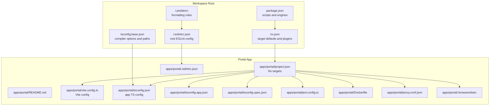

**Diagram sources**
- [package.json:1-267](file://package.json#L1-L267)
- [nx.json:1-149](file://nx.json#L1-L149)
- [tsconfig.base.json:1-95](file://tsconfig.base.json#L1-L95)
- [.eslintrc.json:1-225](file://.eslintrc.json#L1-L225)
- [.prettierrc:1-9](file://.prettierrc#L1-L9)
- [apps/portal/README.md:1-96](file://apps/portal/README.md#L1-L96)
- [apps/portal/project.json:1-138](file://apps/portal/project.json#L1-L138)
- [apps/portal/vite.config.ts:1-68](file://apps/portal/vite.config.ts#L1-L68)
- [apps/portal/tsconfig.json:1-30](file://apps/portal/tsconfig.json#L1-L30)
- [apps/portal/tsconfig.app.json:1-30](file://apps/portal/tsconfig.app.json#L1-L30)
- [apps/portal/tsconfig.spec.json:1-31](file://apps/portal/tsconfig.spec.json#L1-L31)
- [apps/portal/.eslintrc.json:1-22](file://apps/portal/.eslintrc.json#L1-L22)
- [apps/portal/jest.config.ts:1-12](file://apps/portal/jest.config.ts#L1-L12)
- [apps/portal/Dockerfile:1-7](file://apps/portal/Dockerfile#L1-L7)
- [apps/portal/proxy.conf.json:1-7](file://apps/portal/proxy.conf.json#L1-L7)
- [apps/portal/.browserslistrc:1-16](file://apps/portal/.browserslistrc#L1-L16)

**Section sources**
- [apps/portal/README.md:1-96](file://apps/portal/README.md#L1-L96)
- [apps/portal/project.json:1-138](file://apps/portal/project.json#L1-L138)
- [nx.json:1-149](file://nx.json#L1-L149)

## Core Components
- Nx Targets: Build, serve, lint, test, type check, container image build, and preview are defined in the project’s Nx configuration.
- Vite Dev Server: Provides fast HMR and local development with configurable ports and proxy.
- TypeScript Configurations: Separate configs for app, spec tests, and base workspace settings.
- Linting and Formatting: Root ESLint and Prettier configurations enforce consistent code quality.
- Testing: Jest-based unit tests configured via project Jest config; Vitest also supported in Vite config.
- Containerization: Nginx-based Docker image for preview and production-like deployments.

Key responsibilities and locations:
- Build and serve: [apps/portal/project.json:8-50](file://apps/portal/project.json#L8-L50), [apps/portal/vite.config.ts:7-31](file://apps/portal/vite.config.ts#L7-L31)
- TypeScript: [apps/portal/tsconfig.json:1-30](file://apps/portal/tsconfig.json#L1-L30), [apps/portal/tsconfig.app.json:1-30](file://apps/portal/tsconfig.app.json#L1-L30), [apps/portal/tsconfig.spec.json:1-31](file://apps/portal/tsconfig.spec.json#L1-L31), [tsconfig.base.json:1-95](file://tsconfig.base.json#L1-L95)
- Linting: [apps/portal/.eslintrc.json:1-22](file://apps/portal/.eslintrc.json#L1-L22), [.eslintrc.json:1-225](file://.eslintrc.json#L1-L225), [.prettierrc:1-9](file://.prettierrc#L1-L9)
- Tests: [apps/portal/jest.config.ts:1-12](file://apps/portal/jest.config.ts#L1-L12), [apps/portal/vite.config.ts:45-57](file://apps/portal/vite.config.ts#L45-L57)
- Docker: [apps/portal/Dockerfile:1-7](file://apps/portal/Dockerfile#L1-L7)

**Section sources**
- [apps/portal/project.json:1-138](file://apps/portal/project.json#L1-L138)
- [apps/portal/vite.config.ts:1-68](file://apps/portal/vite.config.ts#L1-L68)
- [apps/portal/tsconfig.json:1-30](file://apps/portal/tsconfig.json#L1-L30)
- [apps/portal/tsconfig.app.json:1-30](file://apps/portal/tsconfig.app.json#L1-L30)
- [apps/portal/tsconfig.spec.json:1-31](file://apps/portal/tsconfig.spec.json#L1-L31)
- [tsconfig.base.json:1-95](file://tsconfig.base.json#L1-L95)
- [apps/portal/.eslintrc.json:1-22](file://apps/portal/.eslintrc.json#L1-L22)
- [.eslintrc.json:1-225](file://.eslintrc.json#L1-L225)
- [.prettierrc:1-9](file://.prettierrc#L1-L9)
- [apps/portal/jest.config.ts:1-12](file://apps/portal/jest.config.ts#L1-L12)
- [apps/portal/Dockerfile:1-7](file://apps/portal/Dockerfile#L1-L7)

## Architecture Overview
The Portal development workflow centers around Nx orchestration and Vite for local development, with optional Jest/Vitest for testing and ESLint/Prettier for code quality. Production builds leverage Nx Vite executor with optimized settings, while preview and containerization use Nginx.

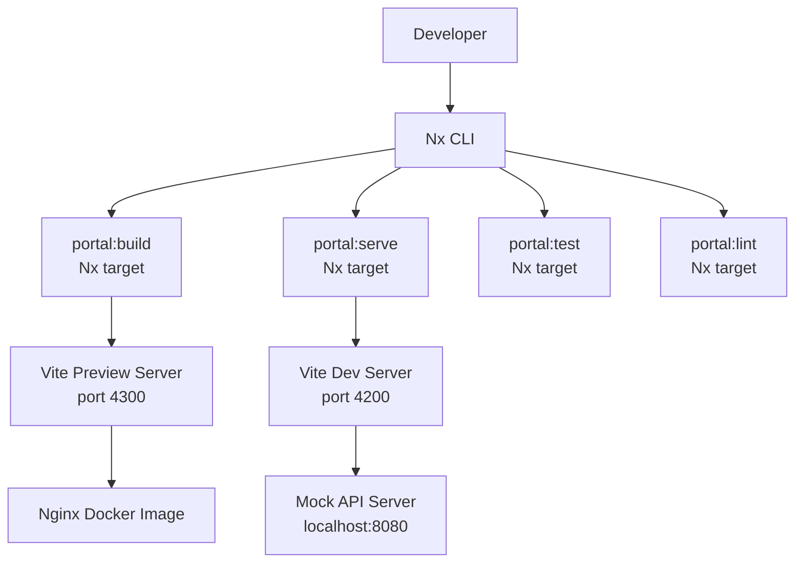

**Diagram sources**
- [apps/portal/project.json:8-50](file://apps/portal/project.json#L8-L50)
- [apps/portal/vite.config.ts:18-31](file://apps/portal/vite.config.ts#L18-L31)
- [apps/portal/Dockerfile:1-7](file://apps/portal/Dockerfile#L1-7)
- [apps/portal/proxy.conf.json:1-7](file://apps/portal/proxy.conf.json#L1-L7)

**Section sources**
- [apps/portal/project.json:1-138](file://apps/portal/project.json#L1-L138)
- [apps/portal/vite.config.ts:1-68](file://apps/portal/vite.config.ts#L1-L68)
- [apps/portal/Dockerfile:1-7](file://apps/portal/Dockerfile#L1-L7)
- [apps/portal/proxy.conf.json:1-7](file://apps/portal/proxy.conf.json#L1-L7)

## Detailed Component Analysis

### Local Development Server
- Ports: Dev server runs on port 4200; preview server on port 4300.
- HMR: Enabled by default during development.
- Proxy: Requests to /api are proxied to the mock API server on localhost:8080.
- Environment variables: Must be prefixed with VITE_ to be exposed at build time; examples include API hostname and Google OAuth client ID.

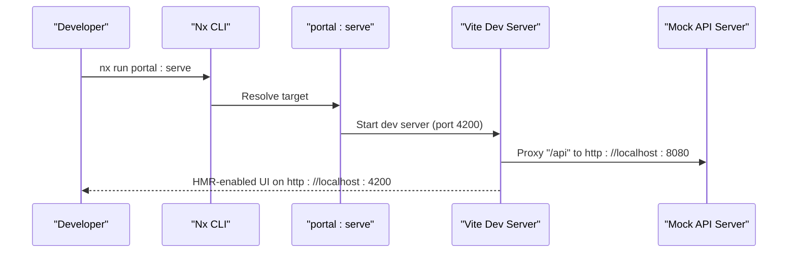

**Diagram sources**
- [apps/portal/project.json:33-49](file://apps/portal/project.json#L33-L49)
- [apps/portal/vite.config.ts:18-31](file://apps/portal/vite.config.ts#L18-L31)
- [apps/portal/proxy.conf.json:1-7](file://apps/portal/proxy.conf.json#L1-L7)
- [apps/portal/README.md:23-52](file://apps/portal/README.md#L23-L52)

**Section sources**
- [apps/portal/vite.config.ts:18-31](file://apps/portal/vite.config.ts#L18-L31)
- [apps/portal/proxy.conf.json:1-7](file://apps/portal/proxy.conf.json#L1-L7)
- [apps/portal/README.md:5-52](file://apps/portal/README.md#L5-L52)

### Build Configuration
- Nx Vite executor drives production and development builds.
- Development configuration disables optimization and enables source maps and HMR.
- Production configuration enables optimization, output hashing, and license extraction.
- Preview server mirrors production build behavior for local verification.

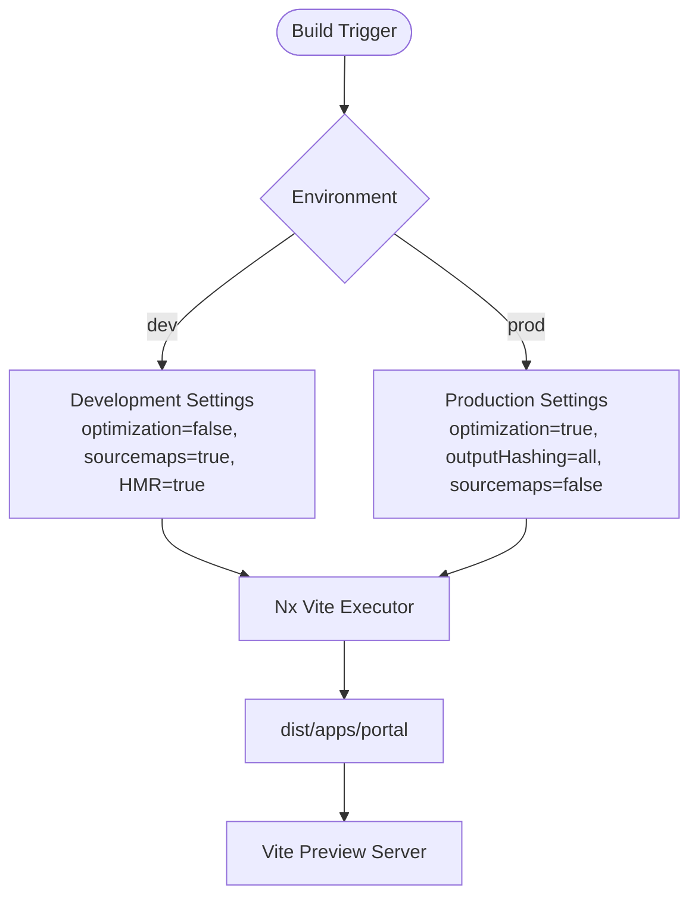

**Diagram sources**
- [apps/portal/project.json:8-32](file://apps/portal/project.json#L8-L32)
- [apps/portal/vite.config.ts:9-15](file://apps/portal/vite.config.ts#L9-L15)

**Section sources**
- [apps/portal/project.json:8-32](file://apps/portal/project.json#L8-L32)
- [apps/portal/vite.config.ts:9-15](file://apps/portal/vite.config.ts#L9-L15)

### TypeScript Configuration
- Workspace base sets module resolution, strictness, JSX runtime, and path aliases.
- App TS config extends base and adds Vite client types.
- Spec TS config adds Jest and related types for test files.
- Path aliases enable scoped imports across libraries tagged with scope:portal and scope:shared.

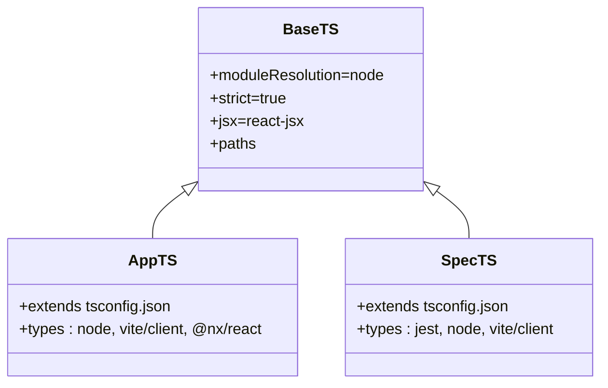

**Diagram sources**
- [tsconfig.base.json:1-95](file://tsconfig.base.json#L1-L95)
- [apps/portal/tsconfig.json:1-30](file://apps/portal/tsconfig.json#L1-L30)
- [apps/portal/tsconfig.app.json:1-30](file://apps/portal/tsconfig.app.json#L1-L30)
- [apps/portal/tsconfig.spec.json:1-31](file://apps/portal/tsconfig.spec.json#L1-L31)

**Section sources**
- [tsconfig.base.json:1-95](file://tsconfig.base.json#L1-L95)
- [apps/portal/tsconfig.json:1-30](file://apps/portal/tsconfig.json#L1-L30)
- [apps/portal/tsconfig.app.json:1-30](file://apps/portal/tsconfig.app.json#L1-L30)
- [apps/portal/tsconfig.spec.json:1-31](file://apps/portal/tsconfig.spec.json#L1-L31)

### Linting and Formatting
- Root ESLint config enforces TypeScript, React, React Hooks, JSX runtime, Storybook, accessibility, and TanStack Query rules.
- Project-level ESLint overrides the Nx React plugin for the Portal app.
- Prettier formatting rules are applied via lint-staged and Nx scripts.

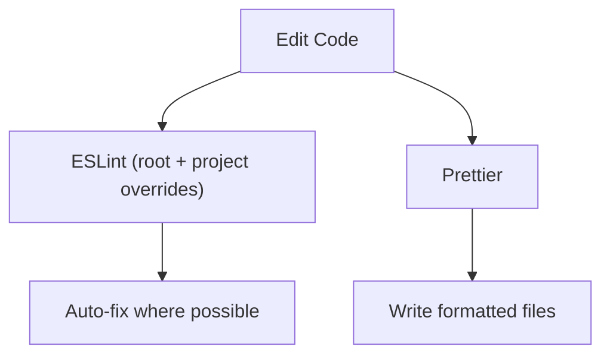

**Diagram sources**
- [.eslintrc.json:1-225](file://.eslintrc.json#L1-L225)
- [apps/portal/.eslintrc.json:1-22](file://apps/portal/.eslintrc.json#L1-L22)
- [.prettierrc:1-9](file://.prettierrc#L1-L9)
- [package.json:49-54](file://package.json#L49-L54)

**Section sources**
- [.eslintrc.json:1-225](file://.eslintrc.json#L1-L225)
- [apps/portal/.eslintrc.json:1-22](file://apps/portal/.eslintrc.json#L1-L22)
- [.prettierrc:1-9](file://.prettierrc#L1-L9)
- [package.json:49-54](file://package.json#L49-L54)

### Testing Setup and Debugging
- Unit tests use Jest with Babel transformation and coverage reporting.
- Vitest is configured within Vite for alternative testing scenarios.
- Nx target supports CI mode with increased reliability flags.

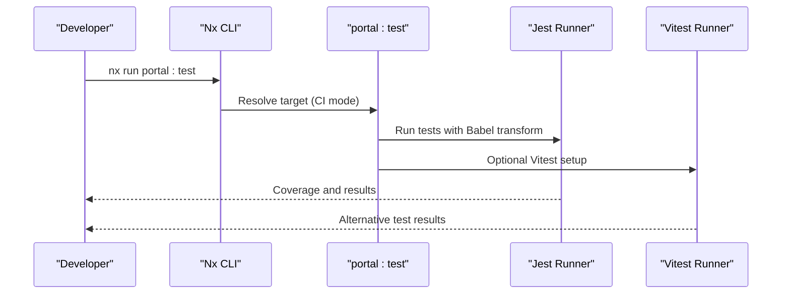

**Diagram sources**
- [apps/portal/project.json:64-79](file://apps/portal/project.json#L64-L79)
- [apps/portal/jest.config.ts:1-12](file://apps/portal/jest.config.ts#L1-L12)
- [apps/portal/vite.config.ts:45-57](file://apps/portal/vite.config.ts#L45-L57)

**Section sources**
- [apps/portal/project.json:64-79](file://apps/portal/project.json#L64-L79)
- [apps/portal/jest.config.ts:1-12](file://apps/portal/jest.config.ts#L1-L12)
- [apps/portal/vite.config.ts:45-57](file://apps/portal/vite.config.ts#L45-L57)

### Deployment Preparation and Containerization
- Nginx Docker image serves the built SPA with a dedicated SPA configuration.
- Nx container builder target prepares a container image for preview and deployment.
- Preview server validates production-like behavior locally before containerization.

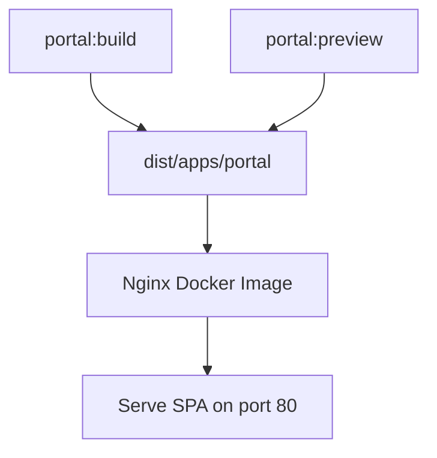

**Diagram sources**
- [apps/portal/project.json:111-135](file://apps/portal/project.json#L111-L135)
- [apps/portal/Dockerfile:1-7](file://apps/portal/Dockerfile#L1-L7)
- [apps/portal/vite.config.ts:28-31](file://apps/portal/vite.config.ts#L28-L31)

**Section sources**
- [apps/portal/project.json:111-135](file://apps/portal/project.json#L111-L135)
- [apps/portal/Dockerfile:1-7](file://apps/portal/Dockerfile#L1-L7)
- [apps/portal/vite.config.ts:28-31](file://apps/portal/vite.config.ts#L28-L31)

### Environment Configuration
- Environment variables must be prefixed with VITE_ to be embedded at build time.
- Examples include API hostname and Google OAuth client ID.
- Nx supports environment-specific files such as .env.build.<configuration>.

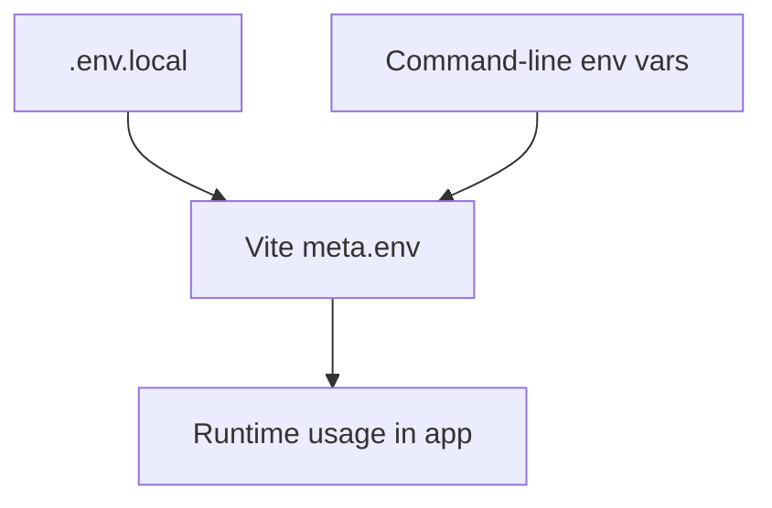

**Diagram sources**
- [apps/portal/README.md:23-52](file://apps/portal/README.md#L23-L52)
- [apps/portal/vite.config.ts:20-26](file://apps/portal/vite.config.ts#L20-L26)

**Section sources**
- [apps/portal/README.md:23-52](file://apps/portal/README.md#L23-L52)
- [apps/portal/vite.config.ts:20-26](file://apps/portal/vite.config.ts#L20-L26)

### CI/CD Integration
- Nx orchestrates caching and inputs for targets such as build, test, lint, and storybook.
- Target defaults define dependencies and inputs to optimize pipeline performance.
- Scripts at the root coordinate multi-application workflows.

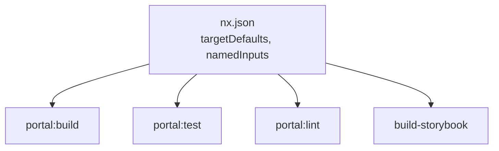

**Diagram sources**
- [nx.json:8-72](file://nx.json#L8-L72)
- [package.json:5-47](file://package.json#L5-L47)

**Section sources**
- [nx.json:1-149](file://nx.json#L1-L149)
- [package.json:1-267](file://package.json#L1-L267)

### Code Splitting and Bundle Analysis
- Vite handles code splitting automatically; Nx build target controls chunking and vendor extraction.
- Development configuration enables vendorChunk for faster rebuilds.
- Production configuration disables vendorChunk and enables output hashing for cache busting.
- Report compressed sizes during build for visibility.

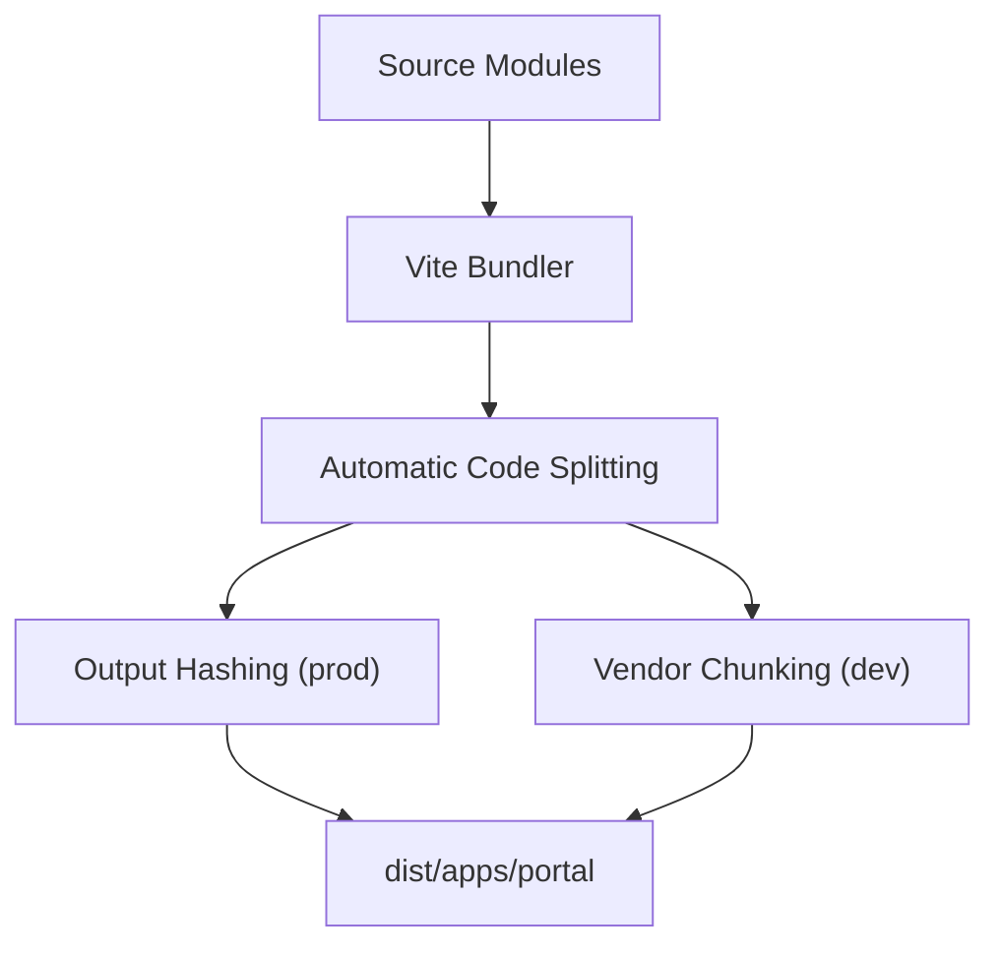

**Diagram sources**
- [apps/portal/project.json:16-30](file://apps/portal/project.json#L16-L30)
- [apps/portal/vite.config.ts:9-15](file://apps/portal/vite.config.ts#L9-L15)

**Section sources**
- [apps/portal/project.json:16-30](file://apps/portal/project.json#L16-L30)
- [apps/portal/vite.config.ts:9-15](file://apps/portal/vite.config.ts#L9-L15)

### Optimization Strategies
- Browser support defined via Browserslist to balance polyfills and bundle size.
- Strict TypeScript settings and ESLint rules reduce runtime errors and improve maintainability.
- HMR and incremental builds accelerate local iteration.
- Source maps disabled in production for performance; enabled in development for debugging.

**Section sources**
- [apps/portal/.browserslistrc:1-16](file://apps/portal/.browserslistrc#L1-L16)
- [tsconfig.base.json:1-95](file://tsconfig.base.json#L1-L95)
- [.eslintrc.json:1-225](file://.eslintrc.json#L1-L225)
- [apps/portal/project.json:16-30](file://apps/portal/project.json#L16-L30)

## Dependency Analysis
The Portal app relies on Nx for orchestration and Vite for bundling. ESLint and Prettier are coordinated via root and project configs. Tests integrate with Jest and Vitest. Dockerization leverages Nginx for static hosting.

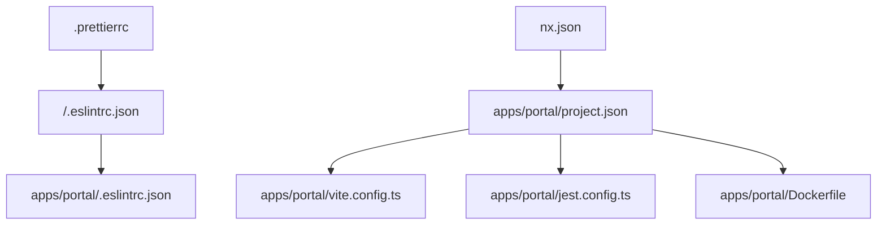

**Diagram sources**
- [apps/portal/project.json:1-138](file://apps/portal/project.json#L1-L138)
- [apps/portal/vite.config.ts:1-68](file://apps/portal/vite.config.ts#L1-L68)
- [.eslintrc.json:1-225](file://.eslintrc.json#L1-L225)
- [apps/portal/.eslintrc.json:1-22](file://apps/portal/.eslintrc.json#L1-L22)
- [.prettierrc:1-9](file://.prettierrc#L1-L9)
- [nx.json:1-149](file://nx.json#L1-L149)
- [apps/portal/jest.config.ts:1-12](file://apps/portal/jest.config.ts#L1-L12)
- [apps/portal/Dockerfile:1-7](file://apps/portal/Dockerfile#L1-L7)

**Section sources**
- [apps/portal/project.json:1-138](file://apps/portal/project.json#L1-L138)
- [apps/portal/vite.config.ts:1-68](file://apps/portal/vite.config.ts#L1-L68)
- [.eslintrc.json:1-225](file://.eslintrc.json#L1-L225)
- [apps/portal/.eslintrc.json:1-22](file://apps/portal/.eslintrc.json#L1-L22)
- [.prettierrc:1-9](file://.prettierrc#L1-L9)
- [nx.json:1-149](file://nx.json#L1-L149)
- [apps/portal/jest.config.ts:1-12](file://apps/portal/jest.config.ts#L1-L12)
- [apps/portal/Dockerfile:1-7](file://apps/portal/Dockerfile#L1-L7)

## Performance Considerations
- Prefer development configuration for local iteration; enable vendorChunk to speed up rebuilds.
- Disable source maps in production to minimize bundle size.
- Use output hashing for long-term caching of static assets.
- Monitor compressed bundle sizes during build to track regressions.
- Keep browser support narrow via Browserslist to limit polyfills.

[No sources needed since this section provides general guidance]

## Troubleshooting Guide
Common issues and resolutions:
- Missing environment variables: Ensure VITE_* variables are present in .env.local or passed via command line.
- Proxy failures: Verify /api proxy target matches the running mock API server port.
- Type errors: Run type checks via Nx target to catch issues early.
- Lint failures: Apply auto-fix via Nx lint target or run root ESLint with fix enabled.
- Test flakiness: Use CI mode for tests to enforce stricter execution.

**Section sources**
- [apps/portal/README.md:23-52](file://apps/portal/README.md#L23-L52)
- [apps/portal/proxy.conf.json:1-7](file://apps/portal/proxy.conf.json#L1-L7)
- [apps/portal/project.json:80-90](file://apps/portal/project.json#L80-L90)
- [apps/portal/project.json:51-63](file://apps/portal/project.json#L51-L63)
- [apps/portal/project.json:70-79](file://apps/portal/project.json#L70-L79)

## Conclusion
The Portal application’s development workflow is streamlined through Nx orchestration, Vite for rapid local iteration, robust TypeScript and ESLint configurations, and containerized preview. By following the outlined setup, testing, and optimization practices, developers can achieve reliable builds, predictable deployments, and efficient collaboration.

[No sources needed since this section summarizes without analyzing specific files]

## Appendices

### Quick Commands
- Serve: nx run portal:serve
- Build: nx run portal:build
- Test: nx run portal:test
- Lint: nx run portal:lint
- Type check: nx run portal:check-types
- Preview: nx run portal:preview
- Build image: nx run portal:build-image

**Section sources**
- [apps/portal/project.json:7-135](file://apps/portal/project.json#L7-L135)
- [package.json:5-12](file://package.json#L5-L12)