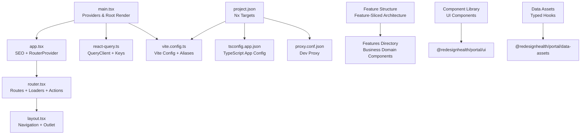
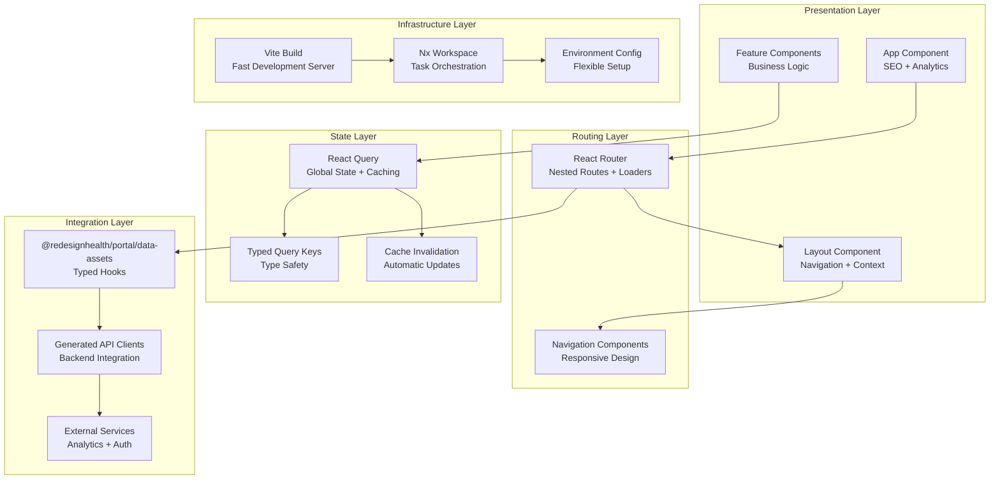
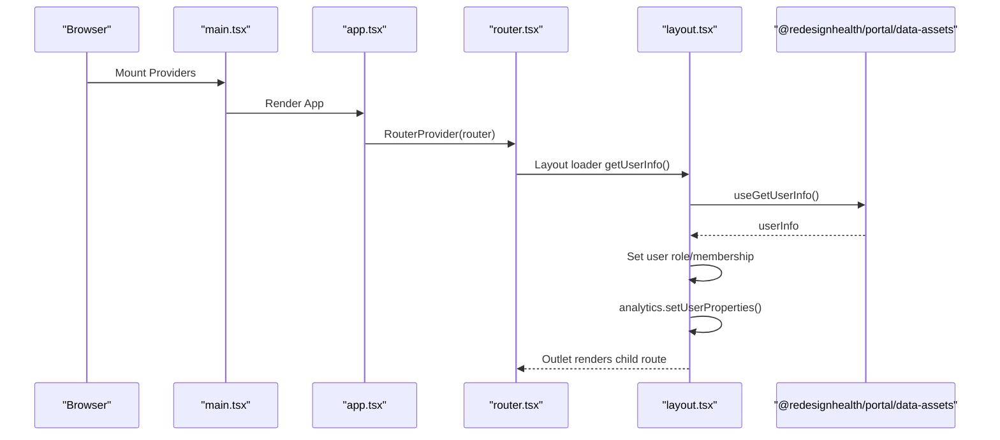
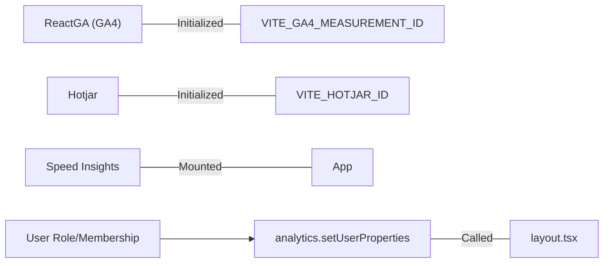
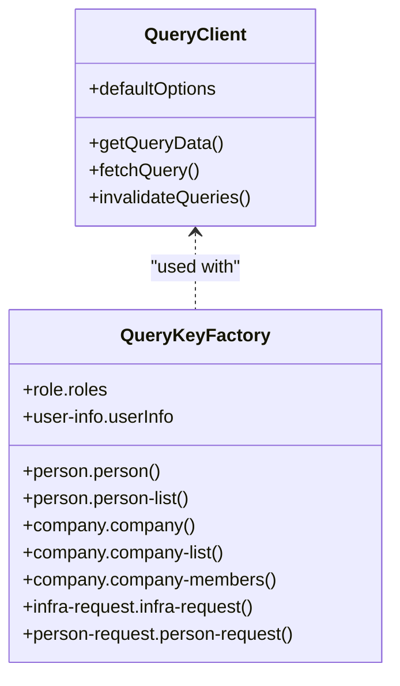
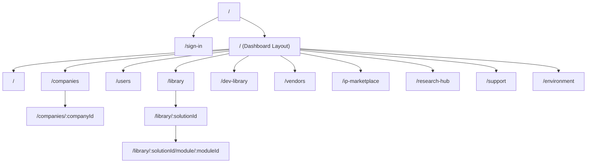

# Portal Application

<cite>
**Referenced Files in This Document**
- [main.tsx](file://apps/portal/src/main.tsx)
- [app.tsx](file://apps/portal/src/app/app.tsx)
- [router.tsx](file://apps/portal/src/router.tsx)
- [layout.tsx](file://apps/portal/src/routes/dashboard/layout.tsx)
- [react-query.ts](file://apps/portal/src/api/react-query.ts)
- [project.json](file://apps/portal/project.json)
- [vite.config.ts](file://apps/portal/vite.config.ts)
- [tsconfig.app.json](file://apps/portal/tsconfig.app.json)
- [package.json](file://apps/portal/package.json)
- [proxy.conf.json](file://apps/portal/proxy.conf.json)
- [data-assets package.json](file://libs/portal/data-assets/package.json)
- [solution.tsx](file://apps/portal/src/routes/dashboard/library/solution/solution.tsx)
</cite>

## Update Summary
**Changes Made**
- Added comprehensive documentation for feature-sliced architecture implementation
- Enhanced component structure documentation with feature boundaries
- Expanded routing system documentation with nested route patterns
- Documented state management patterns with React Query integration
- Added styling approach documentation with Chakra UI and theme system
- Included development workflow documentation with Nx build targets
- Enhanced backend integration patterns with generated API clients

## Table of Contents
1. [Introduction](#introduction)
2. [Project Structure](#project-structure)
3. [Feature-Sliced Architecture](#feature-sliced-architecture)
4. [Core Components](#core-components)
5. [Architecture Overview](#architecture-overview)
6. [Detailed Component Analysis](#detailed-component-analysis)
7. [Dependency Analysis](#dependency-analysis)
8. [Performance Considerations](#performance-considerations)
9. [Troubleshooting Guide](#troubleshooting-guide)
10. [Conclusion](#conclusion)
11. [Appendices](#appendices)

## Introduction
This document describes the Portal application, a React 19 and Next.js–style application built with Vite and React Router. The application follows a feature-sliced architecture pattern that organizes code by business features rather than technical layers. It covers the application structure, routing configuration, state management patterns, authentication flow, SEO management with helmet, analytics integration, project configuration, build and deployment setup, component architecture, styling approach, backend integration patterns, performance optimization, responsive design, development workflow, environment configuration, and troubleshooting approaches.

## Project Structure
The Portal application is organized as a Vite-based React application under apps/portal following a feature-sliced architecture. Key areas include:

- **Entry Point**: Initializes providers for analytics, authentication, and state management, then renders the root App component
- **App Component**: Sets up SEO with Helmet and page view tracking, and mounts the RouterProvider
- **Routing System**: Configured via React Router with loaders, actions, nested routes, and lazy-loaded route components
- **State Management**: Centralized using React Query with a singleton QueryClient and typed query keys
- **Feature Organization**: Structured by business domains (companies, users, vendors, IP marketplace, research hub, CEO directory)
- **Build Targets**: Configured via Nx executor plugins and Vite with separate development and production configurations



**Diagram sources**
- [main.tsx:1-41](file://apps/portal/src/main.tsx#L1-L41)
- [app.tsx:1-45](file://apps/portal/src/app/app.tsx#L1-L45)
- [router.tsx:1-250](file://apps/portal/src/router.tsx#L1-L250)
- [layout.tsx:1-75](file://apps/portal/src/routes/dashboard/layout.tsx#L1-L75)
- [react-query.ts:1-101](file://apps/portal/src/api/react-query.ts#L1-L101)
- [vite.config.ts:1-68](file://apps/portal/vite.config.ts#L1-L68)
- [project.json:1-138](file://apps/portal/project.json#L1-L138)
- [tsconfig.app.json:1-30](file://apps/portal/tsconfig.app.json#L1-L30)
- [proxy.conf.json](file://apps/portal/proxy.conf.json)

**Section sources**
- [main.tsx:1-41](file://apps/portal/src/main.tsx#L1-L41)
- [app.tsx:1-45](file://apps/portal/src/app/app.tsx#L1-L45)
- [router.tsx:1-250](file://apps/portal/src/router.tsx#L1-L250)
- [layout.tsx:1-75](file://apps/portal/src/routes/dashboard/layout.tsx#L1-L75)
- [react-query.ts:1-101](file://apps/portal/src/api/react-query.ts#L1-L101)
- [vite.config.ts:1-68](file://apps/portal/vite.config.ts#L1-L68)
- [project.json:1-138](file://apps/portal/project.json#L1-L138)
- [tsconfig.app.json:1-30](file://apps/portal/tsconfig.app.json#L1-L30)

## Feature-Sliced Architecture
The Portal application implements a feature-sliced architecture that organizes code by business features rather than traditional technical layers. This approach provides better maintainability, scalability, and team collaboration by grouping related functionality together.

### Feature Organization
Features are organized into distinct directories under `@redesignhealth/portal/features/`:

- **companies/**: Company management including CRUD operations, user management, vendor relationships, and infrastructure tracking
- **users/**: User management with profile editing and access control
- **vendors/**: Vendor directory and relationship management
- **ip-marketplace/**: Intellectual property listing and marketplace functionality
- **research-hub/**: Research sprint management and knowledge sharing
- **ceo-directory/**: CEO directory with onboarding workflows
- **admin/**: Administrative features and environment details
- **sign-in/**: Authentication and user onboarding

### Component Structure
Components are organized hierarchically within each feature:

```
features/
├── companies/
│   ├── AddCompany.tsx
│   ├── EditCompany.tsx
│   ├── Companies.tsx
│   ├── CompanyDetails.tsx
│   └── company-details/
│       ├── overview/
│       ├── users/
│       ├── vendors/
│       ├── expert-network/
│       └── infrastructure/
│           ├── index.tsx
│           ├── privacy/
│           └── tech-stack/
├── users/
│   ├── AddUser.tsx
│   ├── EditUser.tsx
│   └── Users.tsx
└── ui/
    ├── reusable components (shared across features)
```

### Benefits of Feature-Sliced Architecture
- **Team Scalability**: Multiple teams can work on different features simultaneously
- **Maintainability**: Related functionality stays together, reducing cognitive load
- **Testing**: Features can be tested in isolation
- **Reusability**: Shared components can be extracted to the UI library
- **Domain Alignment**: Code structure matches business domain understanding

**Section sources**
- [router.tsx:16-50](file://apps/portal/src/router.tsx#L16-L50)
- [router.tsx:156-244](file://apps/portal/src/router.tsx#L156-L244)

## Core Components
The Portal application consists of several core components that work together to provide a cohesive user experience:

### Providers and Initialization
- **Google OAuth Provider**: Handles authentication with Google OAuth
- **React Query Provider**: Manages global state caching and synchronization
- **RedesignHealth UI Provider**: Provides theme and component library
- **Analytics and Hotjar**: Initializes performance and behavioral analytics

### App Component
- **Helmet Integration**: Manages dynamic SEO titles and meta tags
- **Manual Page View Tracking**: Ensures analytics are sent after title updates
- **RouterProvider**: Mounts the routing system with fallback loading states
- **Vercel Speed Insights**: Monitors application performance

### Router System
- **Nested Routes**: Organized by business domains with parent-child relationships
- **Loaders**: Fetch user information and application context before rendering
- **Actions**: Handle mutations and form submissions with React Query integration
- **Dynamic Segments**: Support for parameterized routes and deep linking

### Layout System
- **Navigation Components**: Mobile and desktop navigation with responsive design
- **Terms Checker**: Enforces terms and conditions compliance
- **Impersonation Banner**: Indicates when admin users are acting as another user
- **Scroll Container**: Manages scrolling behavior across different screen sizes

### State Management
- **Singleton QueryClient**: Single source of truth for all data caching
- **Typed Query Keys**: Type-safe caching with query-key-factory
- **Automatic Invalidation**: React Query handles cache invalidation on mutations
- **Background Refetching**: Optimistic updates with automatic refresh

**Section sources**
- [main.tsx:1-41](file://apps/portal/src/main.tsx#L1-L41)
- [app.tsx:1-45](file://apps/portal/src/app/app.tsx#L1-L45)
- [router.tsx:82-249](file://apps/portal/src/router.tsx#L82-L249)
- [layout.tsx:23-74](file://apps/portal/src/routes/dashboard/layout.tsx#L23-L74)
- [react-query.ts:15-30](file://apps/portal/src/api/react-query.ts#L15-L30)

## Architecture Overview
The application follows a layered architecture with clear separation of concerns:

### Presentation Layer
- **App Component**: Top-level application wrapper with SEO and analytics
- **Layout Component**: Navigation and content container with responsive design
- **Feature Components**: Business-specific UI components organized by domain

### Routing Layer
- **React Router**: Handles navigation, nested routes, and route parameters
- **Loaders**: Data fetching before route rendering
- **Actions**: Form submissions and mutations with error handling

### State Layer
- **React Query**: Global state management with caching and synchronization
- **Typed Query Keys**: Type-safe data fetching and caching
- **Cache Invalidation**: Automatic cache updates on mutations

### Integration Layer
- **Data Assets Library**: Typed hooks for common data operations
- **Generated API Clients**: OpenAPI-generated clients for backend services
- **External Integrations**: Analytics, authentication, and third-party services

### Infrastructure Layer
- **Vite Build Pipeline**: Modern build system with fast development server
- **Nx Workspace**: Monorepo management with task orchestration
- **Environment Configuration**: Flexible configuration management



**Diagram sources**
- [app.tsx:1-45](file://apps/portal/src/app/app.tsx#L1-L45)
- [layout.tsx:1-75](file://apps/portal/src/routes/dashboard/layout.tsx#L1-L75)
- [router.tsx:1-250](file://apps/portal/src/router.tsx#L1-L250)
- [react-query.ts:1-101](file://apps/portal/src/api/react-query.ts#L1-L101)
- [vite.config.ts:1-68](file://apps/portal/vite.config.ts#L1-L68)
- [project.json:1-138](file://apps/portal/project.json#L1-L138)

**Section sources**
- [app.tsx:1-45](file://apps/portal/src/app/app.tsx#L1-L45)
- [layout.tsx:1-75](file://apps/portal/src/routes/dashboard/layout.tsx#L1-L75)
- [router.tsx:1-250](file://apps/portal/src/router.tsx#L1-L250)
- [react-query.ts:1-101](file://apps/portal/src/api/react-query.ts#L1-L101)
- [vite.config.ts:1-68](file://apps/portal/vite.config.ts#L1-L68)
- [project.json:1-138](file://apps/portal/project.json#L1-L138)

## Detailed Component Analysis

### Authentication Flow
The authentication system uses Google OAuth with comprehensive user session management:

#### Initialization Process
- **Provider Wrapping**: Google OAuth Provider wraps the entire application
- **Client Configuration**: Client ID loaded from environment variables
- **Session Persistence**: Automatic session restoration on page reload

#### User Session Management
- **Loader Integration**: User information fetched at the dashboard layout level
- **Role Assignment**: User roles and memberships automatically detected
- **Analytics Integration**: User properties sent to analytics services
- **Access Control**: Route protection based on user permissions

#### Logout Handling
- **Error Boundary Integration**: Centralized logout on authentication errors
- **State Cleanup**: Complete session cleanup and cache invalidation
- **Redirect Management**: Automatic navigation to sign-in page



**Diagram sources**
- [main.tsx:1-41](file://apps/portal/src/main.tsx#L1-L41)
- [app.tsx:1-45](file://apps/portal/src/app/app.tsx#L1-L45)
- [router.tsx:88-94](file://apps/portal/src/router.tsx#L88-L94)
- [layout.tsx:24-42](file://apps/portal/src/routes/dashboard/layout.tsx#L24-L42)

**Section sources**
- [main.tsx:32-40](file://apps/portal/src/main.tsx#L32-L40)
- [router.tsx:88-94](file://apps/portal/src/router.tsx#L88-L94)
- [layout.tsx:24-42](file://apps/portal/src/routes/dashboard/layout.tsx#L24-L42)

### SEO Management with Helmet
The application uses Helmet for comprehensive SEO management with dynamic title updates:

#### Title Management Strategy
- **Dynamic Titles**: Titles updated based on route content and user context
- **Helmet Integration**: Automatic title setting in route components
- **Analytics Trigger**: Page view tracking only after title updates
- **Fallback Handling**: Default titles when dynamic content unavailable

#### Page View Tracking
- **onChangeClientState**: Listens for title changes in document head
- **Conditional Tracking**: Analytics only sent when titles are valid
- **Performance Optimization**: Prevents unnecessary analytics calls


**Diagram sources**
- [app.tsx:27-31](file://apps/portal/src/app/app.tsx#L27-L31)

**Section sources**
- [app.tsx:13-31](file://apps/portal/src/app/app.tsx#L13-L31)

### Analytics Integration
The application integrates multiple analytics services for comprehensive insights:

#### Google Analytics 4
- **Conditional Initialization**: Only enabled when measurement ID is present
- **Manual Page Tracking**: Custom page view tracking after title updates
- **Event Tracking**: Custom events for user actions and feature usage

#### Hotjar Integration
- **Site Health Monitoring**: Behavioral analytics and conversion tracking
- **Session Recording**: User session recording for usability analysis
- **Survey Integration**: Feedback collection through surveys

#### Vercel Speed Insights
- **Performance Monitoring**: Real-time performance metrics collection
- **Field Data**: Browser performance data from real users
- **Error Tracking**: JavaScript error monitoring and reporting

#### User Property Management
- **Role-Based Properties**: User roles and permissions tracked as custom properties
- **Membership Information**: Organization and group memberships recorded
- **Dynamic Updates**: Properties updated when user context changes



**Diagram sources**
- [main.tsx:12-28](file://apps/portal/src/main.tsx#L12-L28)
- [app.tsx:27-31](file://apps/portal/src/app/app.tsx#L27-L31)
- [layout.tsx:33-41](file://apps/portal/src/routes/dashboard/layout.tsx#L33-L41)

**Section sources**
- [main.tsx:12-28](file://apps/portal/src/main.tsx#L12-L28)
- [app.tsx:27-31](file://apps/portal/src/app/app.tsx#L27-L31)
- [layout.tsx:33-41](file://apps/portal/src/routes/dashboard/layout.tsx#L33-L41)

### State Management Patterns
The application uses React Query for comprehensive state management:

#### Singleton QueryClient Pattern
- **Centralized Instance**: Single QueryClient instance shared across the application
- **Default Configuration**: Optimized defaults for refetch behavior and caching
- **Type Safety**: Typed query keys for compile-time safety

#### Cache Management
- **Automatic Invalidation**: Cache automatically invalidated on mutations
- **Background Refetch**: Optimistic updates with automatic cache refresh
- **Stale Time Configuration**: Balanced between freshness and performance

#### Query Key Factory
- **Type-Safe Keys**: Generated query keys with proper typing
- **Parameter Support**: Query keys support dynamic parameters
- **Consistent Naming**: Standardized naming conventions across the application



**Diagram sources**
- [react-query.ts:15-83](file://apps/portal/src/api/react-query.ts#L15-L83)

**Section sources**
- [react-query.ts:15-30](file://apps/portal/src/api/react-query.ts#L15-L30)
- [react-query.ts:34-83](file://apps/portal/src/api/react-query.ts#L34-L83)

### Routing Configuration
The routing system is organized around business domains with comprehensive nested route support:

#### Route Organization
- **Sign-In Route**: Dedicated authentication route
- **Dashboard Layout**: Parent route containing all authenticated routes
- **Feature-Specific Routes**: Organized by business domain
- **Nested Route Patterns**: Complex nested routes for detailed navigation

#### Loader Integration
- **User Information**: Loaded at dashboard layout level
- **Context Provision**: Provides user context to all child routes
- **Authentication Guard**: Ensures user is authenticated before rendering

#### Action Integration
- **Form Submissions**: Route-specific actions handle form submissions
- **Mutation Handling**: Actions integrate with React Query for optimistic updates
- **Error Management**: Comprehensive error handling for all actions



**Diagram sources**
- [router.tsx:82-249](file://apps/portal/src/router.tsx#L82-L249)

**Section sources**
- [router.tsx:82-249](file://apps/portal/src/router.tsx#L82-L249)

### Component Architecture and Styling
The application uses a comprehensive styling approach with responsive design:

#### UI Framework Integration
- **RedesignHealth UI Provider**: Centralized theming and component library
- **Chakra UI Foundation**: Component library with design tokens
- **Theme Customization**: Custom theme extending Chakra UI base

#### Responsive Design Implementation
- **Breakpoint System**: Mobile-first responsive design
- **Conditional Rendering**: Navigation adapts to screen size
- **Scroll Management**: Optimized scrolling behavior on different devices

#### Styling Approach
- **Design Tokens**: Consistent spacing, colors, and typography
- **Component Composition**: Reusable component patterns
- **Accessibility**: Built-in accessibility features

#### Alias Configuration
- **Package Resolution**: Vite aliases for consistent imports
- **Shim Implementation**: chakra-react-select shim for compatibility
- **Path Resolution**: Simplified import paths across the application

**Section sources**
- [layout.tsx:54-70](file://apps/portal/src/routes/dashboard/layout.tsx#L54-L70)
- [vite.config.ts:33-42](file://apps/portal/vite.config.ts#L33-L42)

### Backend Integration Patterns
The application integrates with multiple backend services through generated clients:

#### Data Assets Library
- **Typed Hooks**: Generated React hooks for common data operations
- **Type Safety**: Full TypeScript integration with backend schemas
- **Caching Strategy**: Intelligent caching with React Query integration

#### Generated API Clients
- **OpenAPI Integration**: Nx generator creates Axios clients from OpenAPI specs
- **Client Generation**: Automated client generation for backend services
- **Prettier Integration**: Code formatting for generated files

#### Proxy Configuration
- **Development Proxy**: Local development proxy for API requests
- **Environment-Specific**: Different proxies for different environments
- **Request Forwarding**: Automatic forwarding of API requests

**Section sources**
- [data-assets package.json:1-13](file://libs/portal/data-assets/package.json#L1-L13)
- [project.json:91-110](file://apps/portal/project.json#L91-L110)
- [proxy.conf.json](file://apps/portal/proxy.conf.json)

## Dependency Analysis
The application has a well-structured dependency graph with clear separation of concerns:

### External Dependencies
- **React Router**: Core routing functionality with modern React features
- **React Query**: Comprehensive state management and caching
- **Google OAuth**: Authentication with Google accounts
- **Analytics Libraries**: Multiple analytics integrations
- **UI Framework**: Chakra UI with RedesignHealth customization

### Internal Dependencies
- **Data Assets Library**: Shared typed hooks and utilities
- **Feature Packages**: Business logic organized by domain
- **UI Components**: Reusable component library
- **Utilities**: Common utility functions and helpers

### Build and Tooling Dependencies
- **Nx Workspace**: Monorepo management and task orchestration
- **Vite Build System**: Fast development server and build pipeline
- **TypeScript Configuration**: Strict type checking across all packages
- **Testing Framework**: Comprehensive testing setup with Vitest

```mermaid
graph TB
M["main.tsx"] --> RR["react-router-dom"]
M --> RQ["@tanstack/react-query"]
M --> GA["react-ga4"]
M --> HJ["@hotjar/browser"]
M --> GO["@react-oauth/google"]
M --> RH["@redesignhealth/ui"]
APP["app.tsx"] --> HM["react-helmet"]
APP --> SI["@vercel/speed-insights"]
RT["router.tsx"] --> DA["@redesignhealth/portal/data-assets"]
RT --> FE["@redesignhealth/portal/features/*"]
RT --> UI["@redesignhealth/portal/ui"]
LYT["layout.tsx"] --> DA
LYT --> UI
LYT --> UT["@redesignhealth/portal/utils"]
RQF["react-query.ts"] --> RQ
NX["project.json"] --> VITE["@nx/vite:*"]
NX --> ESLINT["@nx/eslint:*"]
NX --> JEST["@nx/jest:*"]
```



**Diagram sources**
- [main.tsx:1-10](file://apps/portal/src/main.tsx#L1-L10)
- [app.tsx:1-6](file://apps/portal/src/app/app.tsx#L1-L6)
- [router.tsx:1-61](file://apps/portal/src/router.tsx#L1-L61)
- [layout.tsx:1-16](file://apps/portal/src/routes/dashboard/layout.tsx#L1-L16)
- [react-query.ts:1-14](file://apps/portal/src/api/react-query.ts#L1-L14)
- [project.json:1-138](file://apps/portal/project.json#L1-L138)

**Section sources**
- [main.tsx:1-10](file://apps/portal/src/main.tsx#L1-L10)
- [app.tsx:1-6](file://apps/portal/src/app/app.tsx#L1-L6)
- [router.tsx:1-61](file://apps/portal/src/router.tsx#L1-L61)
- [layout.tsx:1-16](file://apps/portal/src/routes/dashboard/layout.tsx#L1-L16)
- [react-query.ts:1-14](file://apps/portal/src/api/react-query.ts#L1-L14)
- [project.json:1-138](file://apps/portal/project.json#L1-L138)

## Performance Considerations
The application implements multiple performance optimization strategies:

### React Query Optimizations
- **Refetch Disabled**: Window focus refetch disabled to prevent unnecessary network calls
- **Short Stale Time**: 10-second stale time balances freshness with performance
- **Background Updates**: Optimistic updates with automatic cache refresh

### Build Optimizations
- **Production Optimization**: Code splitting and tree shaking in production builds
- **Source Maps**: Disabled in production for smaller bundle size
- **Output Hashing**: Asset hashing for optimal caching strategy

### Development Optimizations
- **Fast Refresh**: Hot module replacement for rapid development iteration
- **Source Maps**: Enabled for debugging in development
- **Vendor Chunking**: Separate vendor bundles for faster incremental builds

### Vite Optimizations
- **Dependency Optimization**: Pre-bundling and optimizing dependencies
- **Alias Resolution**: Efficient path resolution for imports
- **Plugin System**: React and Nx plugins for optimal development experience

### Observability
- **Speed Insights**: Real-time performance monitoring
- **Analytics Integration**: User behavior tracking and conversion metrics
- **Error Reporting**: Comprehensive error tracking and reporting

**Section sources**
- [react-query.ts:16-23](file://apps/portal/src/api/react-query.ts#L16-L23)
- [project.json:23-30](file://apps/portal/project.json#L23-L30)
- [vite.config.ts:9-15](file://apps/portal/vite.config.ts#L9-L15)

## Troubleshooting Guide
Common issues and their solutions:

### Analytics Not Reporting
- **Environment Variables**: Verify GA4 and Hotjar IDs are set in environment
- **Initialization Order**: Ensure analytics initialization happens before page views
- **Conditional Loading**: Check that analytics only loads when IDs are present

### Authentication Issues
- **Google Client ID**: Verify VITE_GOOGLE_CLIENT_ID is configured correctly
- **OAuth Provider**: Ensure GoogleOAuthProvider wraps the entire application
- **Sign-In Route**: Check that sign-in route is accessible and functional
- **Error Boundary**: Verify logout handler works correctly on authentication errors

### Build Failures
- **Nx Targets**: Check that all Nx build targets are properly configured
- **Vite Plugins**: Verify Vite plugins are installed and configured correctly
- **TypeScript**: Ensure TypeScript compilation succeeds for all files
- **Dependencies**: Check that all dependencies are installed and compatible

### Proxy Errors
- **Proxy Configuration**: Verify proxy settings match backend service URLs
- **Local Development**: Check that backend services are running locally
- **Network Connectivity**: Ensure network connectivity to backend services

### Performance Issues
- **Bundle Size**: Monitor bundle size and optimize large dependencies
- **Cache Strategy**: Adjust React Query cache settings based on usage patterns
- **Rendering Performance**: Use React DevTools Profiler to identify rendering bottlenecks

**Section sources**
- [main.tsx:12-28](file://apps/portal/src/main.tsx#L12-L28)
- [app.tsx:27-31](file://apps/portal/src/app/app.tsx#L27-L31)
- [project.json:8-31](file://apps/portal/project.json#L8-L31)
- [vite.config.ts:1-68](file://apps/portal/vite.config.ts#L1-L68)
- [tsconfig.app.json:3-11](file://apps/portal/tsconfig.app.json#L3-L11)

## Conclusion
The Portal application demonstrates a mature React application architecture with comprehensive feature-sliced organization, robust state management, and integrated analytics. The application successfully combines modern development practices with business-focused organization, creating a scalable foundation for continued growth and feature development.

The feature-sliced architecture provides excellent maintainability and team scalability, while the React Query integration ensures efficient data management and caching. The comprehensive analytics integration provides valuable insights into user behavior and application performance.

## Appendices

### Development Workflow
The application uses Nx for comprehensive development workflow management:

#### Build Targets
- **Serve**: Development server with HMR and proxy configuration
- **Build**: Production builds with optimization and asset hashing
- **Preview**: Preview server for production builds
- **Test**: Comprehensive testing with coverage reporting

#### Type Checking
- **Separate Projects**: Distinct TypeScript projects for app and tests
- **Strict Mode**: Comprehensive type checking across all packages
- **CSS Modules**: Proper typing for CSS modules and images

#### Code Quality
- **ESLint Integration**: Code linting with Nx ESLint plugin
- **Prettier Formatting**: Code formatting enforcement
- **Jest Testing**: Comprehensive unit and integration testing

**Section sources**
- [project.json:33-79](file://apps/portal/project.json#L33-L79)
- [vite.config.ts:45-57](file://apps/portal/vite.config.ts#L45-L57)
- [tsconfig.app.json:1-30](file://apps/portal/tsconfig.app.json#L1-L30)

### Environment Configuration
The application supports flexible environment configuration:

#### Required Environment Variables
- **VITE_GA4_MEASUREMENT_ID**: Google Analytics 4 measurement ID
- **VITE_HOTJAR_ID**: Hotjar site ID for behavioral analytics
- **VITE_GOOGLE_CLIENT_ID**: Google OAuth client ID
- **Library IDs**: Consumer and developer library identifiers

#### Optional Configuration
- **Proxy Settings**: Local development proxy configuration
- **Feature Flags**: Runtime feature toggles
- **Debug Mode**: Development-only debugging features

#### Build Configuration
- **Development**: Fast builds with source maps and HMR
- **Production**: Optimized builds with minification and hashing
- **Preview**: Production-like preview server

**Section sources**
- [main.tsx:12-13](file://apps/portal/src/main.tsx#L12-L13)
- [router.tsx:105-107](file://apps/portal/src/router.tsx#L105-L107)
- [router.tsx:131-134](file://apps/portal/src/router.tsx#L131-L134)

### Feature Structure Examples
The application demonstrates comprehensive feature organization:

#### Library Feature Structure
- **Solution Component**: Main solution view with parameterized routing
- **Module Component**: Individual module display with library context
- **Nested Routes**: Deep linking support for complex navigation

#### Company Feature Structure
- **Company Details**: Comprehensive company information display
- **User Management**: Company-specific user administration
- **Vendor Relationships**: Company vendor management interface
- **Infrastructure Tracking**: Technical infrastructure management

**Section sources**
- [solution.tsx](file://apps/portal/src/routes/dashboard/library/solution/solution.tsx)
- [router.tsx:156-244](file://apps/portal/src/router.tsx#L156-L244)