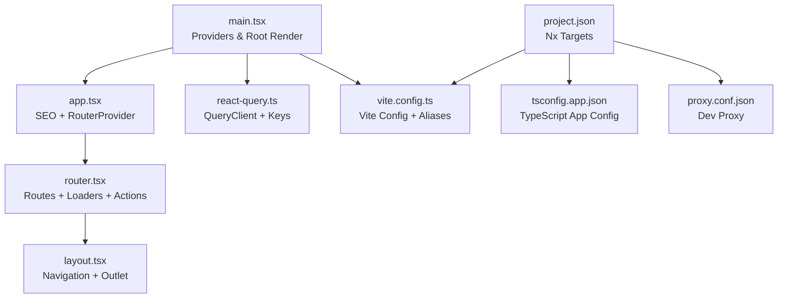
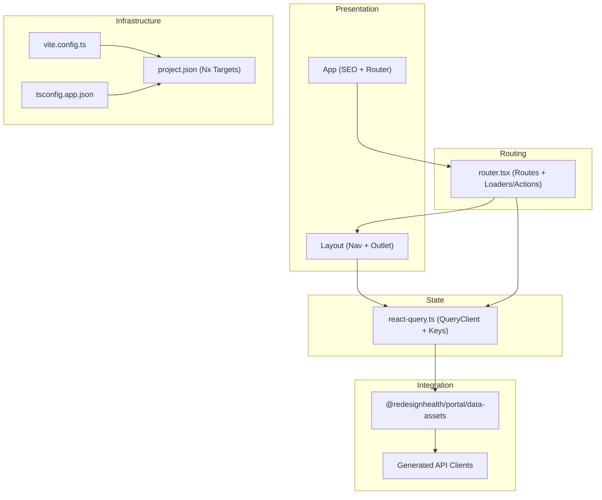
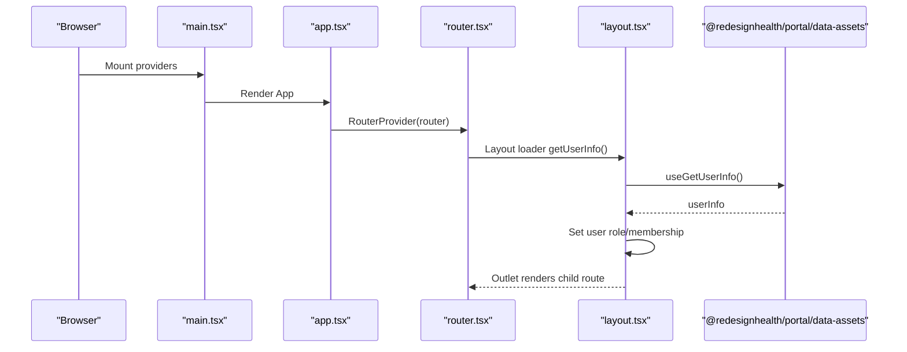
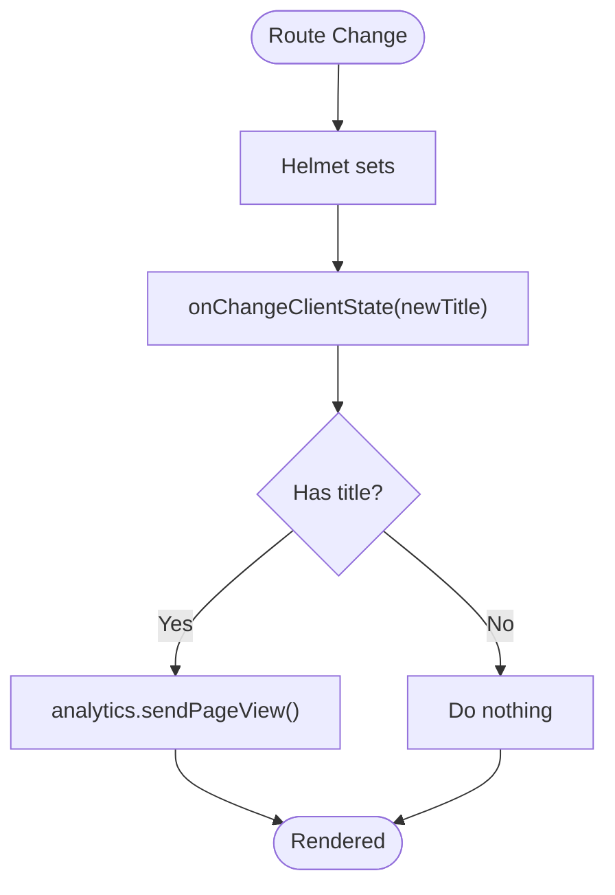
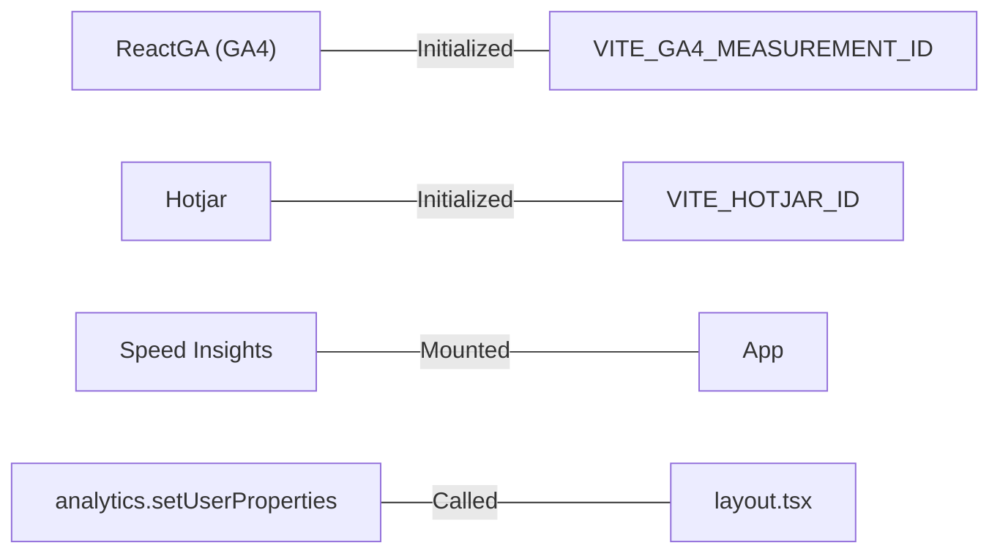
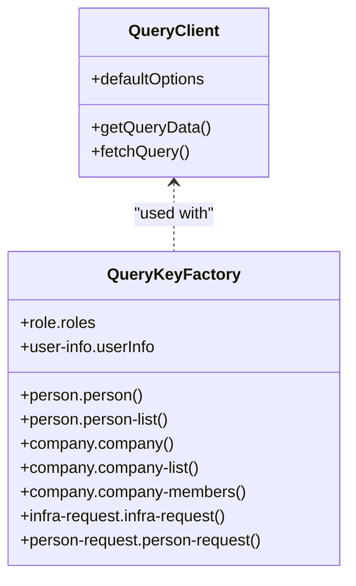
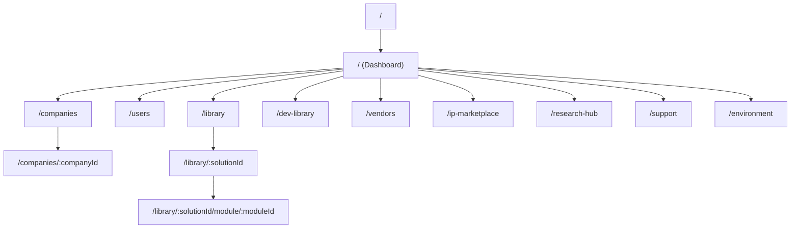
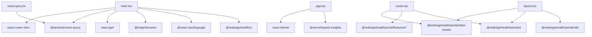

# Portal Application

<cite>
**Referenced Files in This Document**
- [main.tsx](file://apps/portal/src/main.tsx)
- [app.tsx](file://apps/portal/src/app/app.tsx)
- [router.tsx](file://apps/portal/src/router.tsx)
- [layout.tsx](file://apps/portal/src/routes/dashboard/layout.tsx)
- [react-query.ts](file://apps/portal/src/api/react-query.ts)
- [project.json](file://apps/portal/project.json)
- [vite.config.ts](file://apps/portal/vite.config.ts)
- [tsconfig.app.json](file://apps/portal/tsconfig.app.json)
- [package.json](file://apps/portal/package.json)
- [proxy.conf.json](file://apps/portal/proxy.conf.json)
- [data-assets package.json](file://libs/portal/data-assets/package.json)
</cite>

## Table of Contents
1. [Introduction](#introduction)
2. [Project Structure](#project-structure)
3. [Core Components](#core-components)
4. [Architecture Overview](#architecture-overview)
5. [Detailed Component Analysis](#detailed-component-analysis)
6. [Dependency Analysis](#dependency-analysis)
7. [Performance Considerations](#performance-considerations)
8. [Troubleshooting Guide](#troubleshooting-guide)
9. [Conclusion](#conclusion)
10. [Appendices](#appendices)

## Introduction
This document describes the Portal application, a React 19 and Next.js–style application built with Vite and React Router. It covers the application structure, routing configuration, state management patterns, authentication flow, SEO management with helmet, analytics integration, project configuration, build and deployment setup, component architecture, styling approach, backend integration patterns, performance optimization, responsive design, development workflow, environment configuration, and troubleshooting approaches.

## Project Structure
The Portal application is organized as a Vite-based React application under apps/portal. Key areas:
- Entry point initializes providers for analytics, authentication, and state management, then renders the root App component.
- App component sets up SEO with Helmet and page view tracking, and mounts the RouterProvider.
- Routing is configured via React Router with loaders, actions, nested routes, and lazy-loaded route components.
- State management is centralized using React Query with a singleton QueryClient and typed query keys.
- Build targets and development server are configured via Nx executor plugins and Vite.

**Diagram sources**
- [main.tsx:1-41](file://apps/portal/src/main.tsx#L1-L41)
- [app.tsx:1-45](file://apps/portal/src/app/app.tsx#L1-L45)
- [router.tsx:1-250](file://apps/portal/src/router.tsx#L1-L250)
- [layout.tsx:1-75](file://apps/portal/src/routes/dashboard/layout.tsx#L1-L75)
- [react-query.ts:1-101](file://apps/portal/src/api/react-query.ts#L1-L101)
- [vite.config.ts:1-68](file://apps/portal/vite.config.ts#L1-L68)
- [project.json:1-138](file://apps/portal/project.json#L1-L138)
- [tsconfig.app.json:1-30](file://apps/portal/tsconfig.app.json#L1-L30)
- [proxy.conf.json](file://apps/portal/proxy.conf.json)

**Section sources**
- [main.tsx:1-41](file://apps/portal/src/main.tsx#L1-L41)
- [app.tsx:1-45](file://apps/portal/src/app/app.tsx#L1-L45)
- [router.tsx:1-250](file://apps/portal/src/router.tsx#L1-L250)
- [layout.tsx:1-75](file://apps/portal/src/routes/dashboard/layout.tsx#L1-L75)
- [react-query.ts:1-101](file://apps/portal/src/api/react-query.ts#L1-L101)
- [vite.config.ts:1-68](file://apps/portal/vite.config.ts#L1-L68)
- [project.json:1-138](file://apps/portal/project.json#L1-L138)
- [tsconfig.app.json:1-30](file://apps/portal/tsconfig.app.json#L1-L30)

## Core Components
- Providers and initialization:
  - Google OAuth provider for authentication.
  - React Query provider with a singleton QueryClient.
  - RedesignHealth UI provider with theme.
  - Analytics and Hotjar initialization via environment variables.
- App component:
  - Helmet for SEO title management.
  - Manual page view tracking via onChangeClientState.
  - RouterProvider with a fallback loader.
  - Vercel Speed Insights integration.
- Router:
  - Nested routes with loaders fetching user info.
  - Dynamic routes for dashboard, libraries, companies, vendors, IP marketplace, research hub, and CEO directory.
  - Actions bound to React Query clients for mutations.
- Layout:
  - Navigation and mobile navigation.
  - Terms checker and impersonation banner.
  - Scroll container and outlet rendering child routes.
- State management:
  - Singleton QueryClient with disabled window focus refetch and short stale time.
  - Typed query keys via query-key-factory for type-safe caching.

**Section sources**
- [main.tsx:1-41](file://apps/portal/src/main.tsx#L1-L41)
- [app.tsx:1-45](file://apps/portal/src/app/app.tsx#L1-L45)
- [router.tsx:82-249](file://apps/portal/src/router.tsx#L82-L249)
- [layout.tsx:23-74](file://apps/portal/src/routes/dashboard/layout.tsx#L23-L74)
- [react-query.ts:15-30](file://apps/portal/src/api/react-query.ts#L15-L30)

## Architecture Overview
The application follows a layered architecture:
- Presentation layer: App, Layout, and route components.
- Routing layer: React Router with loaders/actions and nested routes.
- State layer: React Query for caching, invalidation, and mutations.
- Integration layer: Data assets library and external APIs via generated clients.
- Infrastructure layer: Vite build pipeline, Nx targets, and environment configuration.

**Diagram sources**
- [app.tsx:1-45](file://apps/portal/src/app/app.tsx#L1-L45)
- [layout.tsx:1-75](file://apps/portal/src/routes/dashboard/layout.tsx#L1-L75)
- [router.tsx:1-250](file://apps/portal/src/router.tsx#L1-L250)
- [react-query.ts:1-101](file://apps/portal/src/api/react-query.ts#L1-L101)
- [vite.config.ts:1-68](file://apps/portal/vite.config.ts#L1-L68)
- [project.json:1-138](file://apps/portal/project.json#L1-L138)
- [tsconfig.app.json:1-30](file://apps/portal/tsconfig.app.json#L1-L30)
- [data-assets package.json:1-13](file://libs/portal/data-assets/package.json#L1-L13)

## Detailed Component Analysis

### Authentication Flow
- Initialization:
  - Google OAuth Provider wraps the app with a client ID from environment variables.
- Sign-in route:
  - Dedicated sign-in route component triggers OAuth flow.
- User session and permissions:
  - A loader fetches user info at the dashboard layout level.
  - User roles and membership are set for analytics and UI decisions.
- Logout:
  - Error boundary invokes a logout handler to reset session state.

**Diagram sources**
- [main.tsx:1-41](file://apps/portal/src/main.tsx#L1-L41)
- [app.tsx:1-45](file://apps/portal/src/app/app.tsx#L1-L45)
- [router.tsx:88-94](file://apps/portal/src/router.tsx#L88-L94)
- [layout.tsx:24-42](file://apps/portal/src/routes/dashboard/layout.tsx#L24-L42)

**Section sources**
- [main.tsx:32-40](file://apps/portal/src/main.tsx#L32-L40)
- [router.tsx:88-94](file://apps/portal/src/router.tsx#L88-L94)
- [layout.tsx:24-42](file://apps/portal/src/routes/dashboard/layout.tsx#L24-L42)

### SEO Management with Helmet
- Helmet is used to dynamically set document titles.
- Page view tracking is triggered only after the document title changes, ensuring accurate analytics when content is dynamic.

**Diagram sources**
- [app.tsx:27-31](file://apps/portal/src/app/app.tsx#L27-L31)

**Section sources**
- [app.tsx:13-31](file://apps/portal/src/app/app.tsx#L13-L31)

### Analytics Integration
- Google Analytics 4:
  - Initialized conditionally using a measurement ID from environment variables.
  - Page views are manually sent after title updates.
- Hotjar:
  - Initialized conditionally using a site ID from environment variables.
- Vercel Speed Insights:
  - Integrated at the root for performance metrics collection.
- User properties:
  - Role and membership are set via analytics.setUserProperties during layout initialization.

**Diagram sources**
- [main.tsx:12-28](file://apps/portal/src/main.tsx#L12-L28)
- [app.tsx:27-31](file://apps/portal/src/app/app.tsx#L27-L31)
- [layout.tsx:33-41](file://apps/portal/src/routes/dashboard/layout.tsx#L33-L41)

**Section sources**
- [main.tsx:12-28](file://apps/portal/src/main.tsx#L12-L28)
- [app.tsx:27-31](file://apps/portal/src/app/app.tsx#L27-L31)
- [layout.tsx:33-41](file://apps/portal/src/routes/dashboard/layout.tsx#L33-L41)

### State Management Patterns
- Singleton QueryClient:
  - A single QueryClient instance is exported and reused across the app.
  - Default options disable refetch on window focus and set a short stale time.
- Typed query keys:
  - Query keys are generated via query-key-factory for type-safe caching.
- Deprecated helpers:
  - Legacy getQueryData helper remains for compatibility.

**Diagram sources**
- [react-query.ts:15-83](file://apps/portal/src/api/react-query.ts#L15-L83)

**Section sources**
- [react-query.ts:15-30](file://apps/portal/src/api/react-query.ts#L15-L30)
- [react-query.ts:34-83](file://apps/portal/src/api/react-query.ts#L34-L83)

### Routing Configuration
- Routes include sign-in, dashboard, libraries, companies, vendors, IP marketplace, research hub, CEO directory, and environment details.
- Loaders fetch user info at the dashboard layout level.
- Actions bind route-specific mutations to the QueryClient.
- Nested routes provide structured navigation and dynamic segments.

**Diagram sources**
- [router.tsx:82-249](file://apps/portal/src/router.tsx#L82-L249)

**Section sources**
- [router.tsx:82-249](file://apps/portal/src/router.tsx#L82-L249)

### Component Architecture and Styling
- UI framework:
  - RedesignHealth UI provider supplies theme and components.
- Responsive design:
  - Layout uses responsive breakpoints to show/hide navigation and scroll containers.
- Styling approach:
  - Theme-driven components with Chakra UI-based design tokens.
- Aliasing:
  - Vite aliases redirect chakra-react-select to a shim to avoid internal API mismatches.

**Section sources**
- [layout.tsx:54-70](file://apps/portal/src/routes/dashboard/layout.tsx#L54-L70)
- [vite.config.ts:33-42](file://apps/portal/vite.config.ts#L33-L42)

### Backend Integration Patterns
- Data assets:
  - A dedicated library exposes typed hooks for user info and company lists.
- Generated clients:
  - Nx generator tasks scaffold OpenAPI-generated Axios clients for backend services.
- Proxy configuration:
  - Development proxy forwards API requests to backend servers.

**Section sources**
- [data-assets package.json:1-13](file://libs/portal/data-assets/package.json#L1-L13)
- [project.json:91-110](file://apps/portal/project.json#L91-L110)
- [proxy.conf.json](file://apps/portal/proxy.conf.json)

## Dependency Analysis
- External dependencies:
  - React Router for routing.
  - React Query for caching and mutations.
  - Google OAuth for authentication.
  - Analytics and Hotjar for insights.
  - Helmet for SEO.
- Internal dependencies:
  - Data assets library for typed data hooks.
  - Feature packages for route components.
- Build and tooling:
  - Nx Vite executor for build/serve/preview.
  - TypeScript configuration for React and CSS modules.

**Diagram sources**
- [main.tsx:1-10](file://apps/portal/src/main.tsx#L1-L10)
- [app.tsx:1-6](file://apps/portal/src/app/app.tsx#L1-L6)
- [router.tsx:1-61](file://apps/portal/src/router.tsx#L1-L61)
- [layout.tsx:1-16](file://apps/portal/src/routes/dashboard/layout.tsx#L1-L16)
- [react-query.ts:1-14](file://apps/portal/src/api/react-query.ts#L1-L14)

**Section sources**
- [main.tsx:1-10](file://apps/portal/src/main.tsx#L1-L10)
- [app.tsx:1-6](file://apps/portal/src/app/app.tsx#L1-L6)
- [router.tsx:1-61](file://apps/portal/src/router.tsx#L1-L61)
- [layout.tsx:1-16](file://apps/portal/src/routes/dashboard/layout.tsx#L1-L16)
- [react-query.ts:1-14](file://apps/portal/src/api/react-query.ts#L1-L14)

## Performance Considerations
- React Query defaults:
  - Disabled refetch on window focus and set a short stale time to reduce unnecessary network calls.
- Build optimizations:
  - Production builds enable optimization, output hashing, and disables source maps.
  - Development builds enable source maps and vendor chunking.
- Vite:
  - Aliases and optimized dependency builds improve startup performance.
- Observability:
  - Speed Insights integration for runtime performance monitoring.

**Section sources**
- [react-query.ts:16-23](file://apps/portal/src/api/react-query.ts#L16-L23)
- [project.json:23-30](file://apps/portal/project.json#L23-L30)
- [vite.config.ts:9-15](file://apps/portal/vite.config.ts#L9-L15)

## Troubleshooting Guide
- Analytics not reporting:
  - Verify environment variables for GA4 and Hotjar are present.
  - Confirm page view tracking occurs after title changes.
- Authentication issues:
  - Ensure Google client ID is configured and OAuth provider wraps the app.
  - Check sign-in route and error boundary behavior.
- Build failures:
  - Review Nx build target configurations and Vite plugin settings.
  - Confirm TypeScript app configuration includes CSS module typings.
- Proxy errors:
  - Validate proxy configuration for backend endpoints.

**Section sources**
- [main.tsx:12-28](file://apps/portal/src/main.tsx#L12-L28)
- [app.tsx:27-31](file://apps/portal/src/app/app.tsx#L27-L31)
- [project.json:8-31](file://apps/portal/project.json#L8-L31)
- [vite.config.ts:1-68](file://apps/portal/vite.config.ts#L1-L68)
- [tsconfig.app.json:3-11](file://apps/portal/tsconfig.app.json#L3-L11)

## Conclusion
The Portal application integrates React Router, React Query, Helmet, analytics, and Hotjar within a Vite/Nx build pipeline. Its routing model leverages loaders and actions for efficient data fetching and mutations, while the layout centralizes navigation and user context. The architecture supports scalable feature development, robust state management, and strong observability.

## Appendices

### Development Workflow
- Serve:
  - Nx dev server with HMR and proxy configuration.
- Build:
  - Nx build with separate dev/prod configurations.
- Test:
  - Vitest with jsdom environment and coverage.
- Type checking:
  - Separate TypeScript projects for app and tests.

**Section sources**
- [project.json:33-79](file://apps/portal/project.json#L33-L79)
- [vite.config.ts:45-57](file://apps/portal/vite.config.ts#L45-L57)
- [tsconfig.app.json:1-30](file://apps/portal/tsconfig.app.json#L1-L30)

### Environment Configuration
- Required environment variables:
  - VITE_GA4_MEASUREMENT_ID for Google Analytics.
  - VITE_HOTJAR_ID for Hotjar.
  - VITE_GOOGLE_CLIENT_ID for OAuth.
  - Library IDs for developer and consumer libraries.
- Optional:
  - Proxy configuration for local backend integration.

**Section sources**
- [main.tsx:12-13](file://apps/portal/src/main.tsx#L12-L13)
- [router.tsx:105-107](file://apps/portal/src/router.tsx#L105-L107)
- [router.tsx:131-134](file://apps/portal/src/router.tsx#L131-L134)