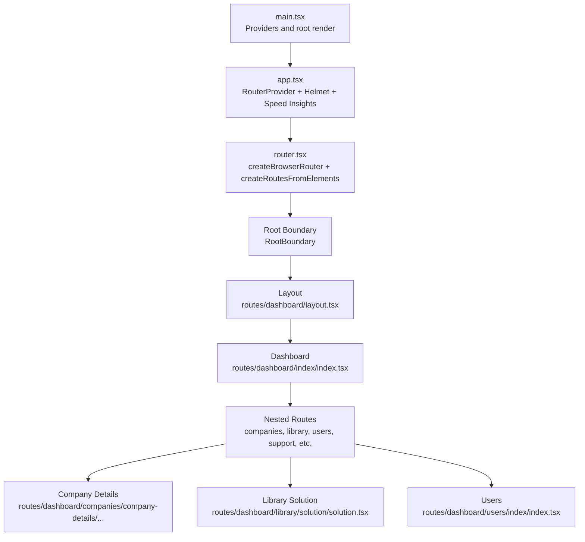
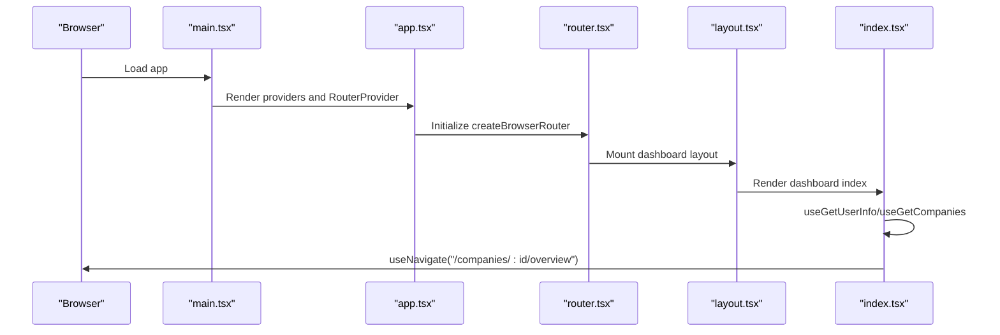
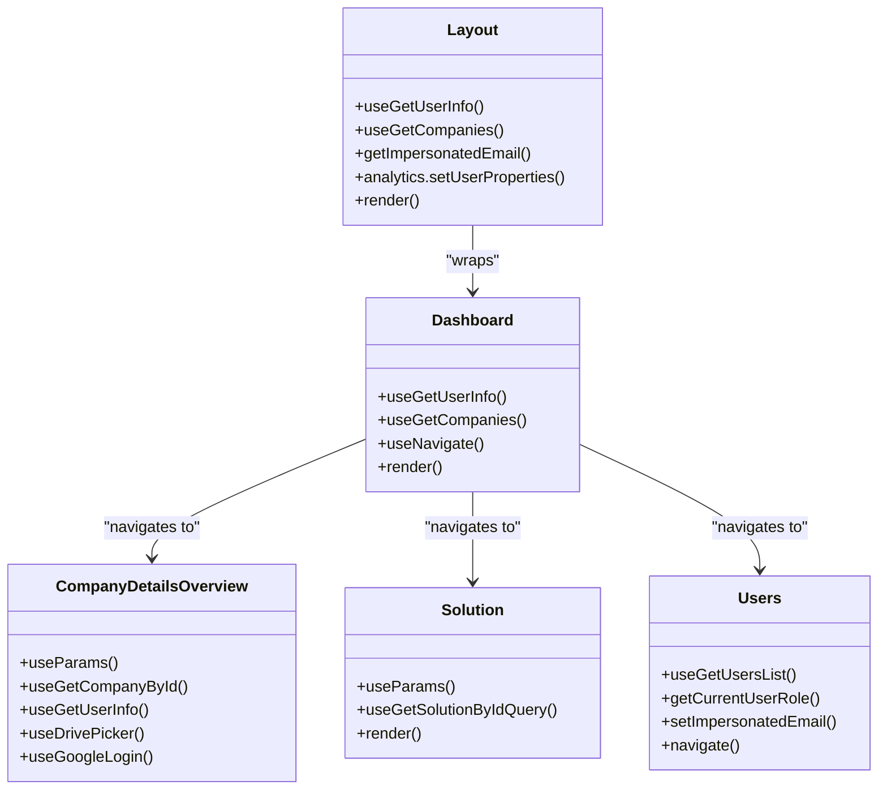
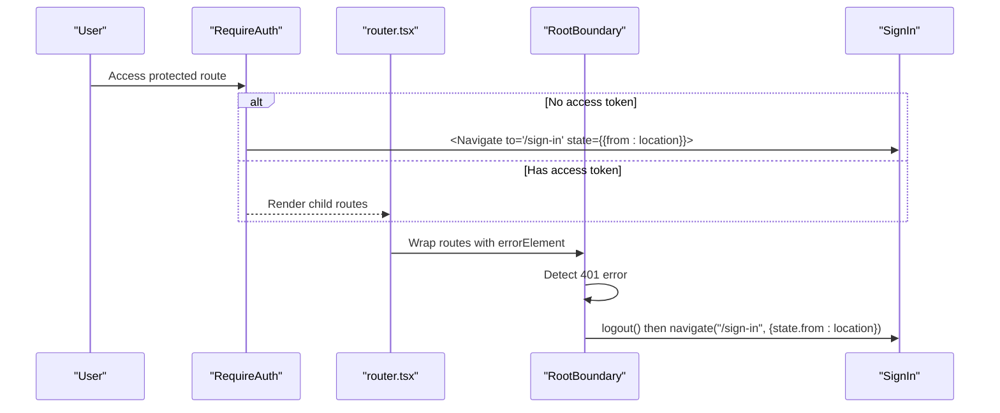
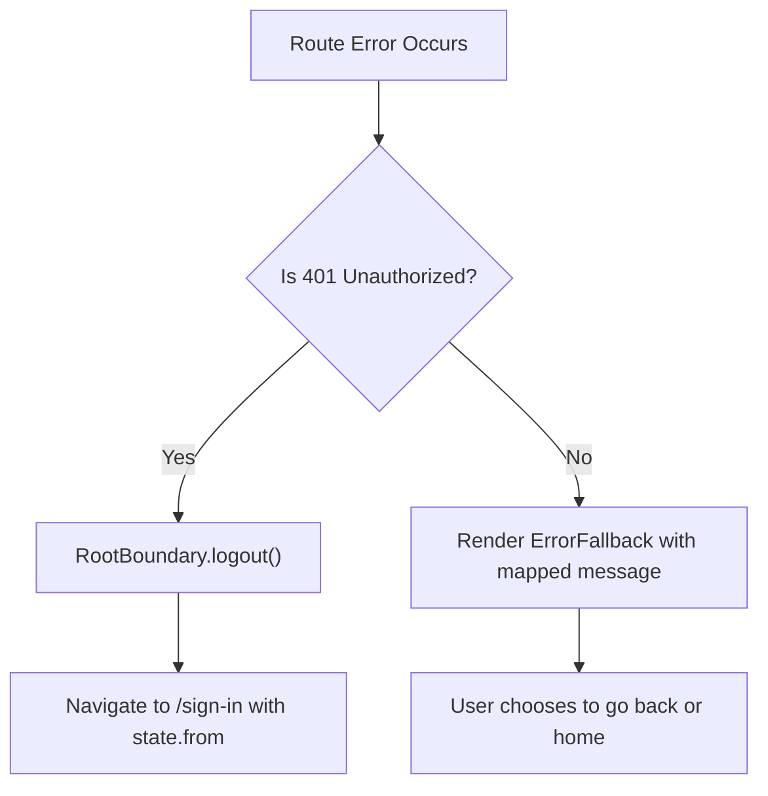
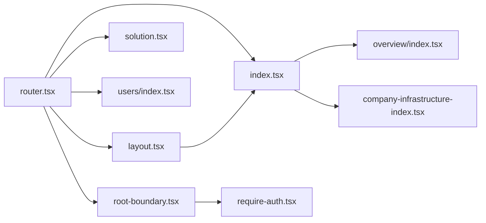

# Routing System

<cite>
**Referenced Files in This Document**
- [router.tsx](file://apps/portal/src/router.tsx)
- [app.tsx](file://apps/portal/src/app/app.tsx)
- [layout.tsx](file://apps/portal/src/routes/dashboard/layout.tsx)
- [index.tsx](file://apps/portal/src/routes/dashboard/index/index.tsx)
- [overview/index.tsx](file://apps/portal/src/routes/dashboard/companies/company-details/overview/index/index.tsx)
- [solution.tsx](file://apps/portal/src/routes/dashboard/library/solution/solution.tsx)
- [users/index.tsx](file://apps/portal/src/routes/dashboard/users/index/index.tsx)
- [root-boundary.tsx](file://libs/shared/ui/src/lib/root-boundary/root-boundary.tsx)
- [require-auth.tsx](file://libs/portal/features/sign-in/src/lib/require-auth/require-auth.tsx)
- [main.tsx](file://apps/portal/src/main.tsx)
- [company-infrastructure-index.tsx](file://apps/portal/src/routes/dashboard/companies/company-details/infrastructure/index/index.tsx)
</cite>

## Table of Contents
1. [Introduction](#introduction)
2. [Project Structure](#project-structure)
3. [Core Components](#core-components)
4. [Architecture Overview](#architecture-overview)
5. [Detailed Component Analysis](#detailed-component-analysis)
6. [Dependency Analysis](#dependency-analysis)
7. [Performance Considerations](#performance-considerations)
8. [Troubleshooting Guide](#troubleshooting-guide)
9. [Conclusion](#conclusion)

## Introduction
This document explains the Portal application’s routing system built with React Router. It covers the router configuration, route definitions, nested routing, layout components, guards, error handling, loading states, route parameters and queries, programmatic navigation, and performance strategies such as route-based code splitting and lazy loading.

## Project Structure
The routing system centers around a single browser router configured in the Portal app. Routes are organized under a dashboard layout with nested routes for companies, library, users, research hub, vendors, IP marketplace, CEO directory, and environment details. The router also defines a sign-in route and sets up a global error boundary.

**Diagram sources**
- [main.tsx:1-41](file://apps/portal/src/main.tsx#L1-L41)
- [app.tsx:1-45](file://apps/portal/src/app/app.tsx#L1-L45)
- [router.tsx:1-250](file://apps/portal/src/router.tsx#L1-L250)
- [layout.tsx:1-75](file://apps/portal/src/routes/dashboard/layout.tsx#L1-L75)
- [index.tsx:1-97](file://apps/portal/src/routes/dashboard/index/index.tsx#L1-L97)
- [overview/index.tsx:1-147](file://apps/portal/src/routes/dashboard/companies/company-details/overview/index/index.tsx#L1-L147)
- [solution.tsx:1-59](file://apps/portal/src/routes/dashboard/library/solution/solution.tsx#L1-L59)
- [users/index.tsx:1-74](file://apps/portal/src/routes/dashboard/users/index/index.tsx#L1-L74)

**Section sources**
- [router.tsx:1-250](file://apps/portal/src/router.tsx#L1-L250)
- [app.tsx:1-45](file://apps/portal/src/app/app.tsx#L1-L45)
- [main.tsx:1-41](file://apps/portal/src/main.tsx#L1-L41)

## Core Components
- Router provider and fallback: The app mounts the router with a fallback loader for initial rendering.
- Global error boundary: A root boundary handles route errors and redirects unauthenticated users to sign-in.
- Dashboard layout: Wraps nested routes, manages user info and company data, and renders navigation and outlet.
- Dashboard index: Performs programmatic navigation to the first company overview after user info loads.
- Nested routes: Companies, library, users, research hub, vendors, IP marketplace, CEO directory, and environment details.

**Section sources**
- [app.tsx:1-45](file://apps/portal/src/app/app.tsx#L1-L45)
- [root-boundary.tsx:139-156](file://libs/shared/ui/src/lib/root-boundary/root-boundary.tsx#L139-L156)
- [layout.tsx:1-75](file://apps/portal/src/routes/dashboard/layout.tsx#L1-L75)
- [index.tsx:1-97](file://apps/portal/src/routes/dashboard/index/index.tsx#L1-L97)

## Architecture Overview
The routing architecture uses a single browser router with nested routes. The dashboard layout acts as a shell for authenticated routes. Error boundaries are attached at the root level to centralize error handling. Programmatic navigation is used to redirect users after initial data loads.

**Diagram sources**
- [main.tsx:1-41](file://apps/portal/src/main.tsx#L1-L41)
- [app.tsx:1-45](file://apps/portal/src/app/app.tsx#L1-L45)
- [router.tsx:1-250](file://apps/portal/src/router.tsx#L1-L250)
- [layout.tsx:1-75](file://apps/portal/src/routes/dashboard/layout.tsx#L1-L75)
- [index.tsx:1-97](file://apps/portal/src/routes/dashboard/index/index.tsx#L1-L97)

## Detailed Component Analysis

### Router Configuration and Route Definitions
- Root routes:
  - Sign-in route for authentication entry.
  - Dashboard layout with loader fetching user info.
- Dashboard routes:
  - Home with add-company and add-user shortcuts.
  - Support, library, dev-library with nested module routes.
  - Companies: list, add, edit, details with nested overview, users, IP, infrastructure, vendors, expert network.
  - Users: list, add, edit by email.
  - Research Hub: research-sprints, call-notes, external-content with add routes.
  - Vendors: list, add, details, edit.
  - IP Marketplace: marketplace, listing details with nested ip-details and requests.
  - CEO Directory: list, add, onboarding, success, profile, edit.
  - Environment details page.

```mermaid
flowchart TD
Start(["Router Initialization"]) --> SignIn["Route: /sign-in"]
Start --> Dashboard["Route: dashboard layout"]
Dashboard --> Home["Route: / -> Dashboard index"]
Home --> AddCompany["Route: /add-company"]
Home --> AddUser["Route: /add-user"]
Dashboard --> Support["Route: /support"]
Dashboard --> Library["Route: /library -> Library"]
Library --> Solution["Route: /library/:solutionId -> Solution"]
Solution --> Module["Route: /library/:solutionId/module/:moduleId -> Module"]
Dashboard --> DevLibrary["Route: /dev-library -> DevLibrary"]
DevLibrary --> DevSolution["Route: /dev-library/:solutionId -> Solution"]
DevSolution --> DevModule["Route: /dev-library/:solutionId/module/:moduleId -> Module"]
Dashboard --> Companies["Route: /companies -> Companies"]
Companies --> CompaniesAdd["Route: /companies/add-company"]
Companies --> CompaniesEdit["Route: /companies/:companyId/edit"]
Companies --> CompanyDetails["Route: /companies/:companyId -> CompanyDetails"]
CompanyDetails --> Overview["Route: /companies/:companyId/overview"]
CompanyDetails --> OverviewEdit["Route: /companies/:companyId/overview/edit"]
CompanyDetails --> UsersTab["Route: /companies/:companyId/users -> CompanyUsers"]
CompanyDetails --> UsersAdd["Route: /companies/:companyId/users/add"]
CompanyDetails --> AllIP["Route: /companies/:companyId/all-ip -> CompanyIpListing"]
CompanyDetails --> Infrastructure["Route: /companies/:companyId/infrastructure -> CompanyInfra"]
Infrastructure --> Privacy["Route: /companies/:companyId/infrastructure/privacy"]
Infrastructure --> TechStack["Route: /companies/:companyId/infrastructure/tech-stack"]
CompanyDetails --> VendorsTab["Route: /companies/:companyId/vendors -> CompanyVendors"]
CompanyDetails --> ExpertNetwork["Route: /companies/:companyId/expert-network"]
Dashboard --> Users["Route: /users -> Users"]
Users --> UsersAdd["Route: /users/add-user"]
Users --> UsersEdit["Route: /users/edit-user/:email"]
Dashboard --> ResearchHub["Route: /research-hub -> ResearchHub"]
ResearchHub --> Sprints["Route: /research-hub/research-sprints"]
ResearchHub --> CallNotes["Route: /research-hub/call-notes"]
ResearchHub --> External["Route: /research-hub/external-content"]
ResearchHub --> AddSprint["Route: /research-hub/research-sprints/add"]
ResearchHub --> AddCallNote["Route: /research-hub/call-notes/add"]
Dashboard --> Vendors["Route: /vendors -> Vendors"]
Vendors --> VendorsAdd["Route: /vendors/add-vendor"]
Vendors --> VendorDetails["Route: /vendors/:vendorId -> VendorDetails"]
Vendors --> VendorEdit["Route: /vendors/:vendorId/edit"]
Dashboard --> IpMarketplace["Route: /ip-marketplace -> IpMarketplace"]
IpMarketplace --> IpDetails["Route: /ip-marketplace/:ipListingId -> IpListingDetails"]
IpDetails --> IpIpDetails["Route: /ip-marketplace/:ipListingId/ip-details"]
IpDetails --> IpRequests["Route: /ip-marketplace/:ipListingId/requests"]
Dashboard --> IpListings["Route: /ip-listings -> IpListing"]
Dashboard --> MyRequests["Route: /my-requests -> MyRequests"]
Dashboard --> CeoDirectory["Route: /ceo-directory -> CeoDirectory"]
CeoDirectory --> CeoAdd["Route: /ceo-directory/add"]
CeoDirectory --> CeoOnboarding["Route: /ceo-directory/onboarding"]
CeoDirectory --> CeoSuccess["Route: /ceo-directory/onboarding/success"]
CeoDirectory --> CeoProfile["Route: /ceo-directory/:ceoId -> CeoProfileDetails"]
CeoDirectory --> CeoEdit["Route: /ceo-directory/:ceoId/edit"]
Dashboard --> Environment["Route: /environment -> EnvironmentDetails"]
```

**Diagram sources**
- [router.tsx:1-250](file://apps/portal/src/router.tsx#L1-L250)

**Section sources**
- [router.tsx:1-250](file://apps/portal/src/router.tsx#L1-L250)

### Layout Components and Nested Routing
- Dashboard layout:
  - Fetches user info and companies via data hooks.
  - Sets analytics user properties and current role.
  - Renders mobile and desktop navigation, impersonation banner, and outlet for nested routes.
- Dashboard index:
  - On load, navigates to either library or the first company overview depending on user role and company availability.
  - Uses Helmet for page title and analytics integration.
- Company details overview:
  - Uses route parameters to fetch company data and links.
  - Integrates Google Drive picker and OAuth login for onboarding docs.
- Library solution:
  - Accepts libraryRoute prop to support both library and dev-library contexts.
  - Uses nested module routes and a feedback footer.
- Users:
  - Lists users, supports impersonation and navigation to edit routes.

**Diagram sources**
- [layout.tsx:1-75](file://apps/portal/src/routes/dashboard/layout.tsx#L1-L75)
- [index.tsx:1-97](file://apps/portal/src/routes/dashboard/index/index.tsx#L1-L97)
- [overview/index.tsx:1-147](file://apps/portal/src/routes/dashboard/companies/company-details/overview/index/index.tsx#L1-L147)
- [solution.tsx:1-59](file://apps/portal/src/routes/dashboard/library/solution/solution.tsx#L1-L59)
- [users/index.tsx:1-74](file://apps/portal/src/routes/dashboard/users/index/index.tsx#L1-L74)

**Section sources**
- [layout.tsx:1-75](file://apps/portal/src/routes/dashboard/layout.tsx#L1-L75)
- [index.tsx:1-97](file://apps/portal/src/routes/dashboard/index/index.tsx#L1-L97)
- [overview/index.tsx:1-147](file://apps/portal/src/routes/dashboard/companies/company-details/overview/index/index.tsx#L1-L147)
- [solution.tsx:1-59](file://apps/portal/src/routes/dashboard/library/solution/solution.tsx#L1-L59)
- [users/index.tsx:1-74](file://apps/portal/src/routes/dashboard/users/index/index.tsx#L1-L74)

### Route Guards and Authentication
- RequireAuth guard:
  - Checks for access token and redirects unauthenticated users to sign-in while preserving the intended destination.
- Root boundary:
  - Detects 401 errors and invokes logout, then navigates to sign-in with the current location in state.

**Diagram sources**
- [require-auth.tsx:1-20](file://libs/portal/features/sign-in/src/lib/require-auth/require-auth.tsx#L1-L20)
- [root-boundary.tsx:139-156](file://libs/shared/ui/src/lib/root-boundary/root-boundary.tsx#L139-L156)
- [router.tsx:1-250](file://apps/portal/src/router.tsx#L1-L250)

**Section sources**
- [require-auth.tsx:1-20](file://libs/portal/features/sign-in/src/lib/require-auth/require-auth.tsx#L1-L20)
- [root-boundary.tsx:139-156](file://libs/shared/ui/src/lib/root-boundary/root-boundary.tsx#L139-L156)

### Error Boundaries and Loading States
- Root boundary:
  - Centralized error handling with messages mapped to HTTP statuses and Axios errors.
  - On 401, triggers logout and redirects to sign-in with the original location preserved.
- App-level fallback:
  - RouterProvider uses a loader component as fallback during initial navigation.
- Layout and route-level loaders:
  - Dashboard layout loader fetches user info; dashboard index navigates after data resolves.
  - Company infrastructure route defines an action to submit infrastructure requests and invalidate caches.

**Diagram sources**
- [root-boundary.tsx:139-156](file://libs/shared/ui/src/lib/root-boundary/root-boundary.tsx#L139-L156)
- [app.tsx:1-45](file://apps/portal/src/app/app.tsx#L1-L45)
- [layout.tsx:1-75](file://apps/portal/src/routes/dashboard/layout.tsx#L1-L75)
- [index.tsx:1-97](file://apps/portal/src/routes/dashboard/index/index.tsx#L1-L97)
- [company-infrastructure-index.tsx:40-52](file://apps/portal/src/routes/dashboard/companies/company-details/infrastructure/index/index.tsx#L40-L52)

**Section sources**
- [root-boundary.tsx:139-156](file://libs/shared/ui/src/lib/root-boundary/root-boundary.tsx#L139-L156)
- [app.tsx:1-45](file://apps/portal/src/app/app.tsx#L1-L45)
- [layout.tsx:1-75](file://apps/portal/src/routes/dashboard/layout.tsx#L1-L75)
- [index.tsx:1-97](file://apps/portal/src/routes/dashboard/index/index.tsx#L1-L97)
- [company-infrastructure-index.tsx:40-52](file://apps/portal/src/routes/dashboard/companies/company-details/infrastructure/index/index.tsx#L40-L52)

### Route Parameters, Query Handling, and Programmatic Navigation
- Route parameters:
  - Companies: :companyId, :companyVendorId, :vendorId, :ipListingId, :solutionId, :moduleId, :ceoId, :email.
  - Example usage: company details overview uses :companyId to fetch data and compute links.
- Queries:
  - Users route uses query parameters for pagination and includes memberOf field.
- Programmatic navigation:
  - Dashboard index navigates to library or first company overview after user info and companies load.
  - Users route navigates to edit-user/:email after clicking an edit action.
  - Library solution route navigates back to library or dev-library based on libraryRoute prop.

**Section sources**
- [overview/index.tsx:1-147](file://apps/portal/src/routes/dashboard/companies/company-details/overview/index/index.tsx#L1-L147)
- [users/index.tsx:1-74](file://apps/portal/src/routes/dashboard/users/index/index.tsx#L1-L74)
- [solution.tsx:1-59](file://apps/portal/src/routes/dashboard/library/solution/solution.tsx#L1-L59)
- [index.tsx:1-97](file://apps/portal/src/routes/dashboard/index/index.tsx#L1-L97)

### Route-Based Code Splitting and Lazy Loading Strategies
- The router imports feature components and dashboard route modules directly. While explicit lazy() imports are not present in the router configuration, the overall architecture supports code splitting through:
  - Feature libraries and route modules organized per feature area.
  - React Router’s built-in lazy evaluation of route elements.
  - Recommendation: Wrap heavy route components with lazy() and Suspense boundaries to reduce initial bundle size and improve TTI.

[No sources needed since this section provides general guidance]

## Dependency Analysis
The routing system depends on:
- React Router for routing primitives and error handling.
- Shared UI components for the root boundary and layout.
- Feature libraries for route components.
- Providers for analytics, theming, and data fetching.

**Diagram sources**
- [router.tsx:1-250](file://apps/portal/src/router.tsx#L1-L250)
- [layout.tsx:1-75](file://apps/portal/src/routes/dashboard/layout.tsx#L1-L75)
- [index.tsx:1-97](file://apps/portal/src/routes/dashboard/index/index.tsx#L1-L97)
- [solution.tsx:1-59](file://apps/portal/src/routes/dashboard/library/solution/solution.tsx#L1-L59)
- [users/index.tsx:1-74](file://apps/portal/src/routes/dashboard/users/index/index.tsx#L1-L74)
- [overview/index.tsx:1-147](file://apps/portal/src/routes/dashboard/companies/company-details/overview/index/index.tsx#L1-L147)
- [company-infrastructure-index.tsx:1-236](file://apps/portal/src/routes/dashboard/companies/company-details/infrastructure/index/index.tsx#L1-L236)
- [root-boundary.tsx:139-156](file://libs/shared/ui/src/lib/root-boundary/root-boundary.tsx#L139-L156)
- [require-auth.tsx:1-20](file://libs/portal/features/sign-in/src/lib/require-auth/require-auth.tsx#L1-L20)

**Section sources**
- [router.tsx:1-250](file://apps/portal/src/router.tsx#L1-L250)
- [layout.tsx:1-75](file://apps/portal/src/routes/dashboard/layout.tsx#L1-L75)
- [index.tsx:1-97](file://apps/portal/src/routes/dashboard/index/index.tsx#L1-L97)
- [solution.tsx:1-59](file://apps/portal/src/routes/dashboard/library/solution/solution.tsx#L1-L59)
- [users/index.tsx:1-74](file://apps/portal/src/routes/dashboard/users/index/index.tsx#L1-L74)
- [overview/index.tsx:1-147](file://apps/portal/src/routes/dashboard/companies/company-details/overview/index/index.tsx#L1-L147)
- [company-infrastructure-index.tsx:1-236](file://apps/portal/src/routes/dashboard/companies/company-details/infrastructure/index/index.tsx#L1-L236)
- [root-boundary.tsx:139-156](file://libs/shared/ui/src/lib/root-boundary/root-boundary.tsx#L139-L156)
- [require-auth.tsx:1-20](file://libs/portal/features/sign-in/src/lib/require-auth/require-auth.tsx#L1-L20)

## Performance Considerations
- Initial load:
  - RouterProvider fallback ensures a smooth initial render while data loads.
  - Providers in main.tsx enable caching and analytics without blocking navigation.
- Navigation:
  - Programmatic navigation avoids unnecessary re-renders by redirecting after data is ready.
- Code splitting:
  - Recommended: Wrap heavy route components with lazy() and Suspense boundaries to defer loading until routes are accessed.
- Actions and caching:
  - Route actions invalidate related queries to keep data fresh without full reloads.

[No sources needed since this section provides general guidance]

## Troubleshooting Guide
- 401 Unauthorized:
  - Root boundary detects 401 and triggers logout, then navigates to sign-in with the original location preserved.
- 403/404/500:
  - Root boundary maps errors to user-friendly messages and offers navigation back or home.
- Missing environment variables:
  - Library routes rely on environment variables for library IDs; missing values are handled gracefully with defaults.
- Navigation loops:
  - Dashboard index checks user role and company existence before navigating to prevent loops.

**Section sources**
- [root-boundary.tsx:139-156](file://libs/shared/ui/src/lib/root-boundary/root-boundary.tsx#L139-L156)
- [router.tsx:100-138](file://apps/portal/src/router.tsx#L100-L138)
- [index.tsx:30-44](file://apps/portal/src/routes/dashboard/index/index.tsx#L30-L44)

## Conclusion
The Portal routing system uses a clean, nested structure with a dashboard layout, robust error handling via a root boundary, and programmatic navigation for a smooth user experience. Authentication is enforced through a dedicated guard and root boundary integration. The architecture supports scalability and performance improvements through route-based code splitting and optimized data fetching.