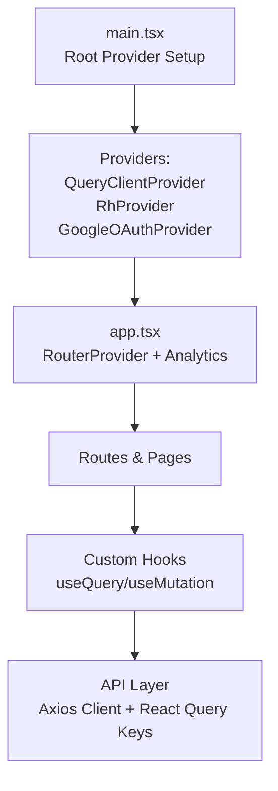
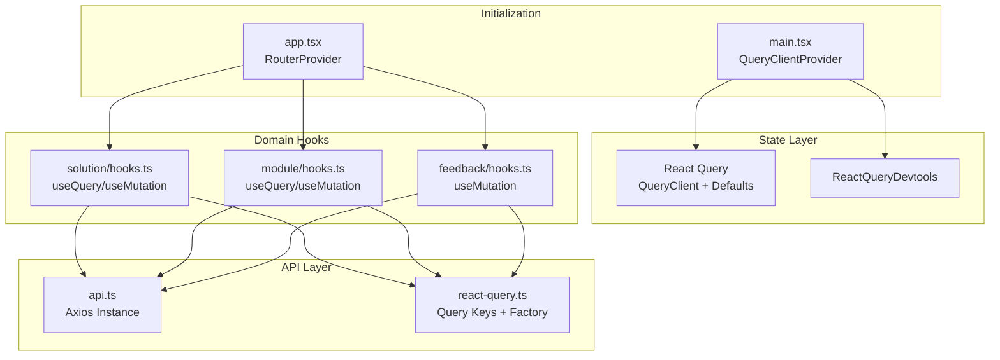
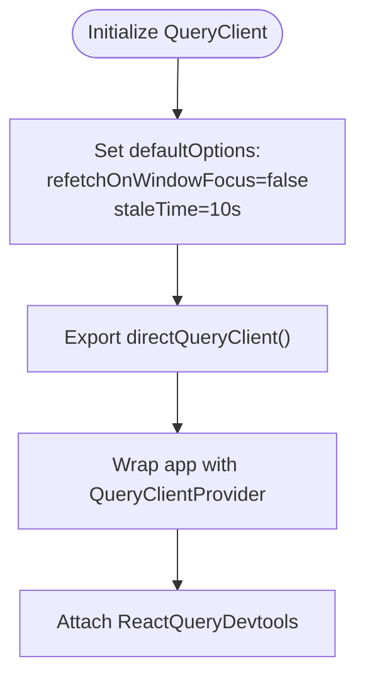
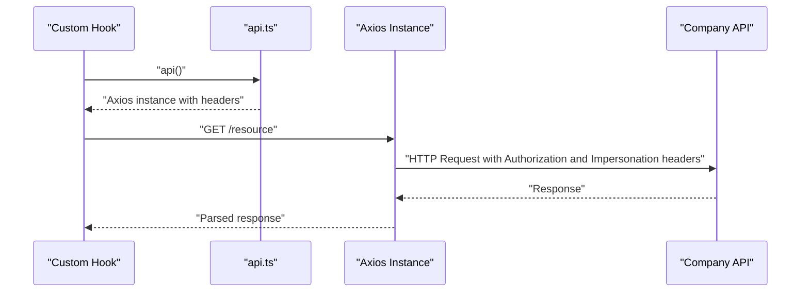
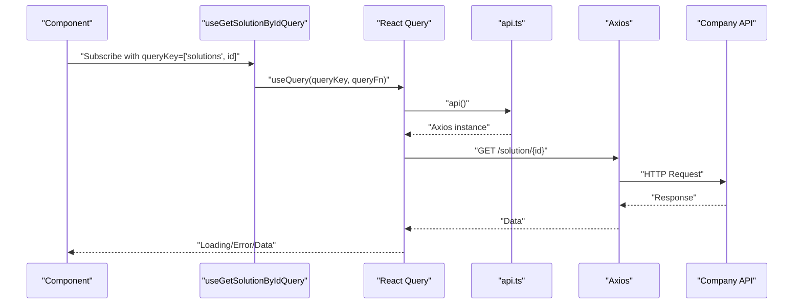
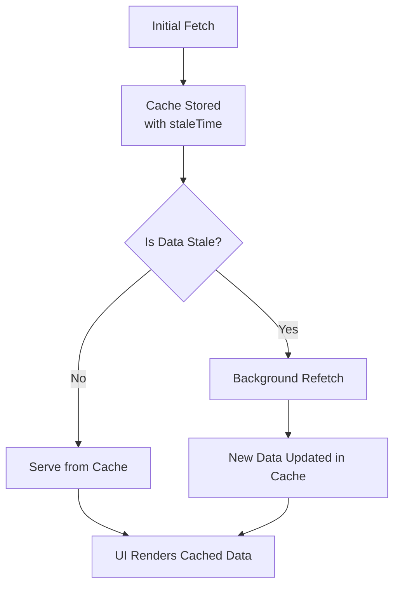
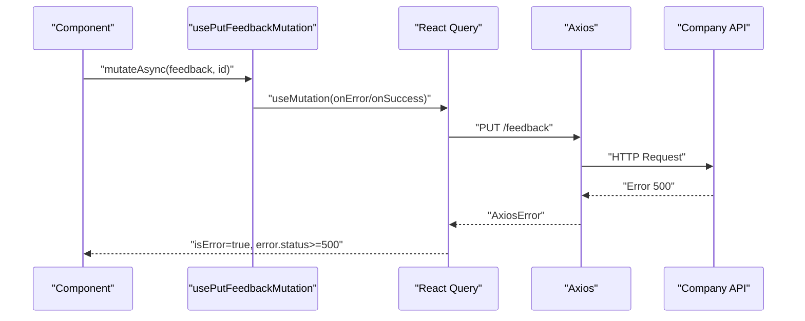
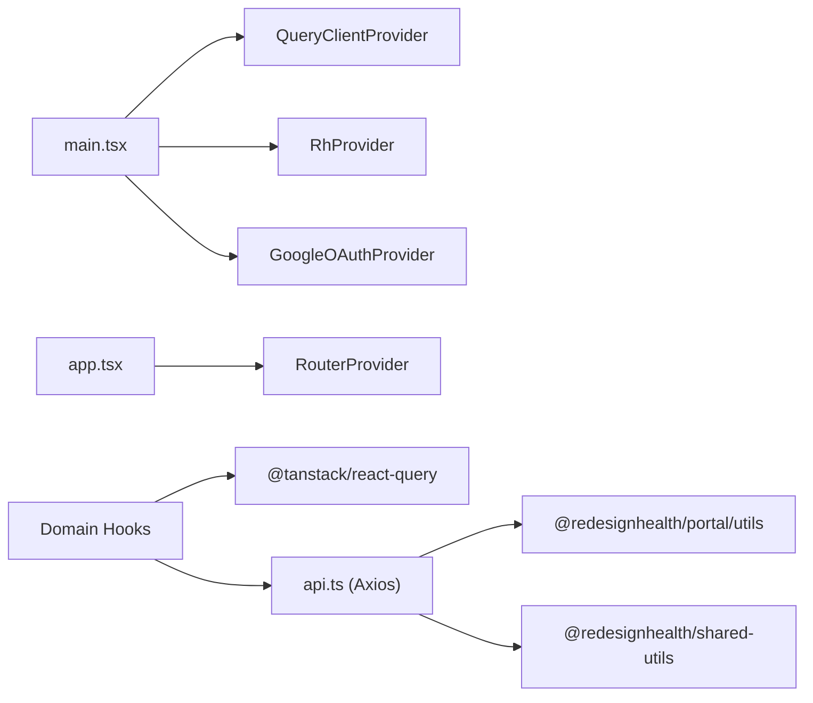

# State Management

<cite>
**Referenced Files in This Document**
- [apps/portal/src/main.tsx](file://apps/portal/src/main.tsx)
- [apps/portal/src/app/app.tsx](file://apps/portal/src/app/app.tsx)
- [apps/portal/src/api/react-query.ts](file://apps/portal/src/api/react-query.ts)
- [apps/portal/src/api/api.ts](file://apps/portal/src/api/api.ts)
- [apps/portal/src/routes/dashboard/library/solution/hooks.ts](file://apps/portal/src/routes/dashboard/library/solution/hooks.ts)
- [apps/portal/src/routes/dashboard/library/solution/feedback/hooks.ts](file://apps/portal/src/routes/dashboard/library/solution/feedback/hooks.ts)
- [apps/portal/src/routes/dashboard/library/solution/module/hooks.ts](file://apps/portal/src/routes/dashboard/library/solution/module/hooks.ts)
</cite>

## Table of Contents
1. [Introduction](#introduction)
2. [Project Structure](#project-structure)
3. [Core Components](#core-components)
4. [Architecture Overview](#architecture-overview)
5. [Detailed Component Analysis](#detailed-component-analysis)
6. [Dependency Analysis](#dependency-analysis)
7. [Performance Considerations](#performance-considerations)
8. [Troubleshooting Guide](#troubleshooting-guide)
9. [Conclusion](#conclusion)

## Introduction
This document explains the Portal application’s state management approach with a focus on React Query integration, caching strategies, data synchronization, and API client configuration. It covers how queries and mutations are structured, how caching and background synchronization work, and how errors are handled. It also documents the custom hooks used for data fetching, optimistic update patterns, local state management, context providers, and state persistence strategies. Finally, it provides guidance on cache invalidation, performance optimization, and debugging and monitoring approaches.

## Project Structure
The Portal application initializes React Query at the root and wraps the application with providers for analytics, theming, and authentication contexts. API clients are configured centrally and consumed by domain-specific query and mutation hooks.

**Diagram sources**
- [apps/portal/src/main.tsx:30-40](file://apps/portal/src/main.tsx#L30-L40)
- [apps/portal/src/app/app.tsx:26-41](file://apps/portal/src/app/app.tsx#L26-L41)

**Section sources**
- [apps/portal/src/main.tsx:1-41](file://apps/portal/src/main.tsx#L1-L41)
- [apps/portal/src/app/app.tsx:1-45](file://apps/portal/src/app/app.tsx#L1-L45)

## Core Components
- React Query client initialization and defaults
- Centralized API client creation with dynamic headers
- Domain-specific custom hooks for queries and mutations
- Deprecated query key factory pattern retained for compatibility

Key responsibilities:
- Provide a single source of truth for the QueryClient instance
- Configure caching behavior (staleTime) and refetch policies
- Encapsulate API requests with proper headers and environment-driven base URLs
- Expose typed hooks for data fetching and mutations
- Support background synchronization and cache invalidation via React Query APIs

**Section sources**
- [apps/portal/src/api/react-query.ts:15-29](file://apps/portal/src/api/react-query.ts#L15-L29)
- [apps/portal/src/api/react-query.ts:17-22](file://apps/portal/src/api/react-query.ts#L17-L22)
- [apps/portal/src/api/react-query.ts:34-83](file://apps/portal/src/api/react-query.ts#L34-L83)
- [apps/portal/src/api/api.ts:7-16](file://apps/portal/src/api/api.ts#L7-L16)

## Architecture Overview
The state management architecture centers on React Query for server state and local UI state managed by React hooks. The API client injects authentication and impersonation headers, while React Query manages caching, background refresh, and invalidation.

**Diagram sources**
- [apps/portal/src/main.tsx:30-40](file://apps/portal/src/main.tsx#L30-L40)
- [apps/portal/src/app/app.tsx:26-41](file://apps/portal/src/app/app.tsx#L26-L41)
- [apps/portal/src/api/react-query.ts:15-29](file://apps/portal/src/api/react-query.ts#L15-L29)
- [apps/portal/src/api/react-query.ts:34-83](file://apps/portal/src/api/react-query.ts#L34-L83)
- [apps/portal/src/api/api.ts:7-16](file://apps/portal/src/api/api.ts#L7-L16)
- [apps/portal/src/routes/dashboard/library/solution/hooks.ts:6-10](file://apps/portal/src/routes/dashboard/library/solution/hooks.ts#L6-L10)
- [apps/portal/src/routes/dashboard/library/solution/module/hooks.ts:5-9](file://apps/portal/src/routes/dashboard/library/solution/module/hooks.ts#L5-L9)
- [apps/portal/src/routes/dashboard/library/solution/feedback/hooks.ts:9-24](file://apps/portal/src/routes/dashboard/library/solution/feedback/hooks.ts#L9-L24)

## Detailed Component Analysis

### React Query Client Initialization and Defaults
- A singleton QueryClient is created with default options:
  - Disables refetch on window focus
  - Sets a global staleTime for cached data
- A dedicated function exposes the QueryClient instance to the rest of the app
- A deprecated query key factory is still exported for backward compatibility

**Diagram sources**
- [apps/portal/src/api/react-query.ts:15-29](file://apps/portal/src/api/react-query.ts#L15-L29)
- [apps/portal/src/api/react-query.ts:17-22](file://apps/portal/src/api/react-query.ts#L17-L22)
- [apps/portal/src/main.tsx:33-34](file://apps/portal/src/main.tsx#L33-L34)

**Section sources**
- [apps/portal/src/api/react-query.ts:15-29](file://apps/portal/src/api/react-query.ts#L15-L29)
- [apps/portal/src/api/react-query.ts:17-22](file://apps/portal/src/api/react-query.ts#L17-L22)

### API Client Configuration
- An Axios instance is created with:
  - Environment-driven base URL
  - Content-Type header set to JSON
  - Authorization header injected from a utility
  - Optional impersonation header derived from a utility
- This client is intended to be reused across domain-specific API modules

**Diagram sources**
- [apps/portal/src/api/api.ts:7-16](file://apps/portal/src/api/api.ts#L7-L16)
- [apps/portal/src/routes/dashboard/library/solution/hooks.ts:6-10](file://apps/portal/src/routes/dashboard/library/solution/hooks.ts#L6-L10)

**Section sources**
- [apps/portal/src/api/api.ts:7-16](file://apps/portal/src/api/api.ts#L7-L16)

### Custom Hooks: Queries and Mutations
- Solution domain:
  - useGetSolutionByIdQuery: fetches a solution by ID using a domain-specific query key
  - usePostCopyTemplateMutation: triggers a mutation to copy a template and opens the resulting document
- Module domain:
  - useGetModuleByIdQuery: fetches a module by ID
  - useGetArticleLinkMap: fetches article link map for a given library context
  - usePostCopyTemplateMutation: similar mutation as above
- Feedback domain:
  - usePutFeedbackMutation: submits feedback with automatic source attribution and error classification for 5xx responses

**Diagram sources**
- [apps/portal/src/routes/dashboard/library/solution/hooks.ts:6-10](file://apps/portal/src/routes/dashboard/library/solution/hooks.ts#L6-L10)
- [apps/portal/src/api/api.ts:7-16](file://apps/portal/src/api/api.ts#L7-L16)

**Section sources**
- [apps/portal/src/routes/dashboard/library/solution/hooks.ts:1-23](file://apps/portal/src/routes/dashboard/library/solution/hooks.ts#L1-L23)
- [apps/portal/src/routes/dashboard/library/solution/module/hooks.ts:1-31](file://apps/portal/src/routes/dashboard/library/solution/module/hooks.ts#L1-L31)
- [apps/portal/src/routes/dashboard/library/solution/feedback/hooks.ts:1-45](file://apps/portal/src/routes/dashboard/library/solution/feedback/hooks.ts#L1-L45)

### Caching Strategies and Data Synchronization
- Global staleTime is configured to balance freshness and performance
- Refetch on window focus is disabled to reduce unnecessary network activity
- Query keys are scoped per domain and parameterized to avoid collisions
- Background synchronization occurs automatically via React Query’s internal scheduling

**Diagram sources**
- [apps/portal/src/api/react-query.ts:17-22](file://apps/portal/src/api/react-query.ts#L17-L22)

**Section sources**
- [apps/portal/src/api/react-query.ts:17-22](file://apps/portal/src/api/react-query.ts#L17-L22)

### Error Handling and Monitoring
- Error classification distinguishes between client and server errors
- For feedback submission, 5xx errors are surfaced differently than other failures
- React Query Devtools are attached at the root for debugging and inspection
- Analytics integration tracks page views after dynamic titles are set

**Diagram sources**
- [apps/portal/src/routes/dashboard/library/solution/feedback/hooks.ts:9-24](file://apps/portal/src/routes/dashboard/library/solution/feedback/hooks.ts#L9-L24)

**Section sources**
- [apps/portal/src/routes/dashboard/library/solution/feedback/hooks.ts:15-17](file://apps/portal/src/routes/dashboard/library/solution/feedback/hooks.ts#L15-L17)
- [apps/portal/src/main.tsx:34-34](file://apps/portal/src/main.tsx#L34-L34)
- [apps/portal/src/app/app.tsx:27-31](file://apps/portal/src/app/app.tsx#L27-L31)

### Local State Management and Context Providers
- The application is wrapped with:
  - QueryClientProvider for React Query
  - RhProvider for theming
  - GoogleOAuthProvider for authentication
- Analytics and telemetry integrations are initialized at startup
- Local UI state is managed by React hooks within components; no global Redux-like store is evident in the analyzed files

**Section sources**
- [apps/portal/src/main.tsx:30-40](file://apps/portal/src/main.tsx#L30-L40)
- [apps/portal/src/app/app.tsx:26-41](file://apps/portal/src/app/app.tsx#L26-L41)

### Optimistic Updates and Cache Invalidation
- Optimistic updates are not implemented in the analyzed hooks
- Cache invalidation is expected to be performed via React Query APIs (e.g., queryClient.invalidateQueries) in components or event handlers
- The deprecated query key factory pattern supports generating typed query keys for invalidation

**Section sources**
- [apps/portal/src/api/react-query.ts:34-83](file://apps/portal/src/api/react-query.ts#L34-L83)

## Dependency Analysis
The state management layer depends on:
- React Query for caching and synchronization
- Axios for HTTP requests
- Utility modules for tokens and impersonation
- UI provider libraries for theming and OAuth

**Diagram sources**
- [apps/portal/src/main.tsx:30-40](file://apps/portal/src/main.tsx#L30-L40)
- [apps/portal/src/app/app.tsx:26-41](file://apps/portal/src/app/app.tsx#L26-L41)
- [apps/portal/src/routes/dashboard/library/solution/hooks.ts:1-2](file://apps/portal/src/routes/dashboard/library/solution/hooks.ts#L1-L2)
- [apps/portal/src/api/api.ts:1-5](file://apps/portal/src/api/api.ts#L1-L5)

**Section sources**
- [apps/portal/src/main.tsx:1-41](file://apps/portal/src/main.tsx#L1-L41)
- [apps/portal/src/routes/dashboard/library/solution/hooks.ts:1-2](file://apps/portal/src/routes/dashboard/library/solution/hooks.ts#L1-L2)
- [apps/portal/src/api/api.ts:1-5](file://apps/portal/src/api/api.ts#L1-L5)

## Performance Considerations
- Prefer granular query keys to minimize cache contention
- Use staleTime judiciously to balance freshness and bandwidth
- Avoid refetch on window focus for pages with heavy data loads
- Defer expensive computations to background via React Query’s scheduling
- Use devtools during development to inspect cache sizes and refetch behavior

[No sources needed since this section provides general guidance]

## Troubleshooting Guide
- Inspect cache state and query lifecycles using ReactQueryDevtools
- Verify headers (Authorization, impersonation) are present in requests
- Confirm environment variables for base URL and analytics IDs are set
- For feedback submissions, check whether errors are classified as 5xx to trigger appropriate UI feedback
- If stale data persists, invalidate queries explicitly using the QueryClient instance

**Section sources**
- [apps/portal/src/main.tsx:34-34](file://apps/portal/src/main.tsx#L34-L34)
- [apps/portal/src/api/api.ts:7-16](file://apps/portal/src/api/api.ts#L7-L16)
- [apps/portal/src/routes/dashboard/library/solution/feedback/hooks.ts:15-17](file://apps/portal/src/routes/dashboard/library/solution/feedback/hooks.ts#L15-L17)

## Conclusion
The Portal application employs a clean, scalable state management architecture centered on React Query for server state, with a centralized API client and domain-specific custom hooks. Caching is tuned via global defaults and explicit query keys, while background synchronization keeps data fresh. Error handling is explicit, and debugging is supported by React Query Devtools. There is no evidence of a global Redux-like store; local UI state is handled by React hooks. To maintain performance and correctness, leverage granular query keys, controlled staleTimes, and explicit invalidation where optimistic updates are not used.