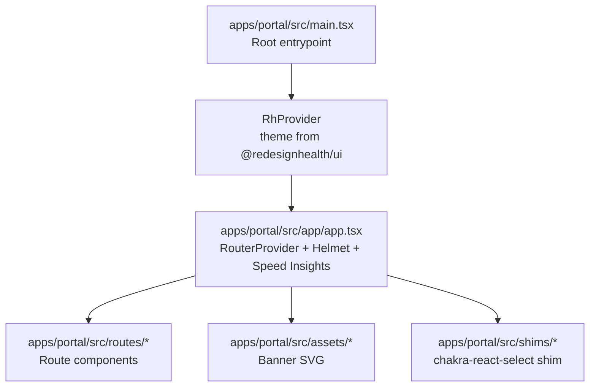
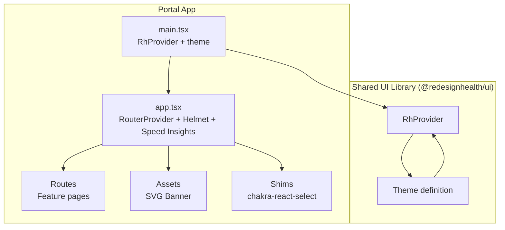
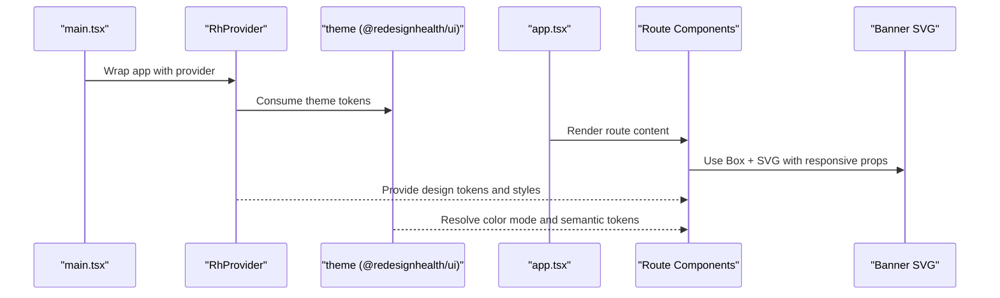
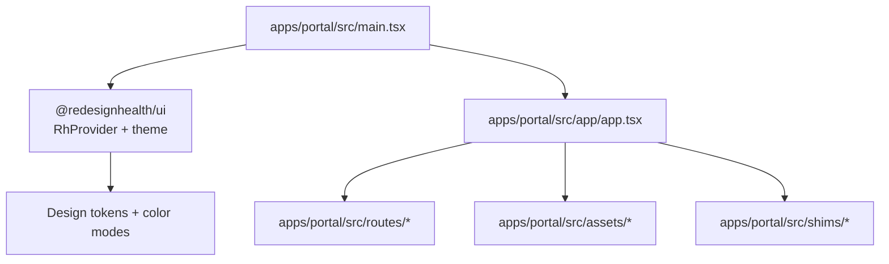

# Styling & Theming

<cite>
**Referenced Files in This Document**
- [main.tsx](file://apps/portal/src/main.tsx)
- [app.tsx](file://apps/portal/src/app/app.tsx)
- [banner.tsx](file://apps/portal/src/assets/banner.tsx)
- [index.ts](file://apps/portal/src/assets/index.ts)
- [chakra-react-select.ts](file://apps/portal/src/shims/chakra-react-select.ts)
- [use-theme.ts](file://libs/shared/ui/src/lib/hooks/use-theme/use-theme.ts)
</cite>

## Table of Contents
1. [Introduction](#introduction)
2. [Project Structure](#project-structure)
3. [Core Components](#core-components)
4. [Architecture Overview](#architecture-overview)
5. [Detailed Component Analysis](#detailed-component-analysis)
6. [Dependency Analysis](#dependency-analysis)
7. [Performance Considerations](#performance-considerations)
8. [Troubleshooting Guide](#troubleshooting-guide)
9. [Conclusion](#conclusion)

## Introduction
This document explains the Portal application’s styling and theming system. It covers Chakra UI integration, design tokens, component theming, CSS-in-JS patterns, responsive design, utility classes, custom styling approaches, component overrides, theme customization, asset management, SVG handling, media queries, dark/light mode, color schemes, accessibility, performance optimization, bundle size considerations, and browser compatibility.

## Project Structure
The Portal application initializes the Chakra UI provider at the root and renders routed content. Theme configuration is provided via a shared UI library and consumed by the application.

**Diagram sources**
- [main.tsx:1-41](file://apps/portal/src/main.tsx#L1-L41)
- [app.tsx:1-45](file://apps/portal/src/app/app.tsx#L1-L45)
- [banner.tsx:1-49](file://apps/portal/src/assets/banner.tsx#L1-L49)
- [chakra-react-select.ts:1-48](file://apps/portal/src/shims/chakra-react-select.ts#L1-L48)

**Section sources**
- [main.tsx:1-41](file://apps/portal/src/main.tsx#L1-L41)
- [app.tsx:1-45](file://apps/portal/src/app/app.tsx#L1-L45)

## Core Components
- Root provider and theme injection:
  - The application wraps the app in a provider supplied by a shared UI package and passes a theme object exported by that package. This establishes the global design system and theme context.
- Routing and page view tracking:
  - The app mounts a router and integrates analytics via Helmet and Speed Insights to track page views after dynamic titles are set.

Key responsibilities:
- Provide theme context to all components.
- Manage routing and analytics integration.
- Render route-based views and shared assets.

**Section sources**
- [main.tsx:1-41](file://apps/portal/src/main.tsx#L1-L41)
- [app.tsx:1-45](file://apps/portal/src/app/app.tsx#L1-L45)

## Architecture Overview
The styling and theming architecture centers on a shared UI library that exports a theme and a provider. The Portal app consumes this provider and theme to apply consistent design tokens and component styles across the application.

**Diagram sources**
- [main.tsx:1-41](file://apps/portal/src/main.tsx#L1-L41)
- [app.tsx:1-45](file://apps/portal/src/app/app.tsx#L1-L45)
- [banner.tsx:1-49](file://apps/portal/src/assets/banner.tsx#L1-L49)
- [chakra-react-select.ts:1-48](file://apps/portal/src/shims/chakra-react-select.ts#L1-L48)

## Detailed Component Analysis

### Theme Provider and Design Tokens
- Provider and theme:
  - The application imports a theme and a provider from the shared UI library and applies them at the root. This ensures consistent design tokens, spacing, colors, typography, and component defaults across the app.
- Theme customization:
  - The theme object can be extended or overridden at the app level by passing a merged or modified theme to the provider. This enables brand-specific adjustments while retaining shared tokens.

Implementation notes:
- The provider is a Chakra UI–compatible wrapper that surfaces design tokens and component styles.
- The theme object encapsulates color modes, semantic tokens, component base styles, and responsive breakpoints.

**Section sources**
- [main.tsx:1-41](file://apps/portal/src/main.tsx#L1-L41)
- [use-theme.ts](file://libs/shared/ui/src/lib/hooks/use-theme/use-theme.ts)

### Responsive Design Patterns and Media Queries
- Breakpoints and responsive scaling:
  - The theme defines breakpoints and spacing scales. Components consume these tokens to adapt layouts across screen sizes.
- Example usage in assets:
  - The banner SVG uses responsive sizing via a responsive height property and a scalable viewBox, ensuring proper rendering across devices.

Responsive patterns observed:
- Using responsive arrays for spacing and sizing (e.g., height values keyed by viewport).
- Scalable vector graphics with viewBox and preserveAspectRatio for crisp rendering.

**Section sources**
- [banner.tsx:1-49](file://apps/portal/src/assets/banner.tsx#L1-L49)

### Utility Classes and CSS-in-JS
- Utility-first approach:
  - The theme exposes design tokens that act as utilities for spacing, color, typography, and layout. Components consume these tokens directly, enabling a CSS-in-JS workflow.
- Component-level styling:
  - Components derive styles from the theme, ensuring consistency and reducing duplication.

Practical benefits:
- Centralized token management.
- Automatic dark/light mode alignment.
- Consistent responsive behavior.

**Section sources**
- [main.tsx:1-41](file://apps/portal/src/main.tsx#L1-L41)

### Component Overrides and Custom Styling
- Component-level overrides:
  - The theme supports component style overrides and base styles. These allow global adjustments to component appearance without modifying individual components.
- Select component compatibility:
  - A shim maps Chakra UI–style props to react-select, preserving the Chakra UI styling surface while using a compatible underlying library.

Guidelines:
- Prefer theme-based overrides for global changes.
- Use component-level props for targeted adjustments.
- Maintain consistency with design tokens.

**Section sources**
- [chakra-react-select.ts:1-48](file://apps/portal/src/shims/chakra-react-select.ts#L1-L48)

### Dark/Light Mode and Color Schemes
- Color mode support:
  - The theme includes color mode-aware tokens and component styles. The provider manages toggling between light and dark modes, propagating appropriate values to components.
- Color scheme strategy:
  - Semantic tokens define color roles (e.g., primary, secondary, background, text). Components read from these tokens, ensuring coherent color application across modes.

Best practices:
- Use semantic tokens instead of hard-coded colors.
- Test color contrast and readability in both modes.
- Keep color mode transitions smooth and predictable.

**Section sources**
- [use-theme.ts](file://libs/shared/ui/src/lib/hooks/use-theme/use-theme.ts)

### Asset Management and SVG Handling
- Inline SVG with responsive attributes:
  - The banner is implemented as an inline SVG component with responsive height and a scalable viewBox. It embeds a pattern and image to render a repeating background.
- Asset bundling:
  - Inline SVGs avoid network requests and integrate seamlessly with the theme’s color tokens.

Recommendations:
- Prefer inline SVGs for small, frequently used assets.
- Use vector formats for scalability.
- Keep SVGs accessible (labels, roles) when applicable.

**Section sources**
- [banner.tsx:1-49](file://apps/portal/src/assets/banner.tsx#L1-L49)
- [index.ts:1-2](file://apps/portal/src/assets/index.ts#L1-L2)

### Accessibility Compliance
- Contrast and readability:
  - Ensure sufficient contrast between foreground and background colors in both modes.
- Focus management:
  - Components should expose visible focus states aligned with the theme’s focus ring tokens.
- Semantic markup:
  - Use accessible HTML semantics and ARIA attributes where needed.

Integration tips:
- Leverage theme-provided focus and border radius tokens for consistent focus styles.
- Validate color pairs against WCAG guidelines.

[No sources needed since this section provides general guidance]

### API/Service Component Flow (Conceptual)
The following conceptual sequence illustrates how the provider and theme influence component rendering and styling across the app.

[No sources needed since this diagram shows conceptual workflow, not actual code structure]

## Dependency Analysis
The Portal app depends on a shared UI library for theme and provider. The provider consumes the theme and exposes it to the component tree. Assets and shims integrate with the theme and component ecosystem.

**Diagram sources**
- [main.tsx:1-41](file://apps/portal/src/main.tsx#L1-L41)
- [app.tsx:1-45](file://apps/portal/src/app/app.tsx#L1-L45)
- [banner.tsx:1-49](file://apps/portal/src/assets/banner.tsx#L1-L49)
- [chakra-react-select.ts:1-48](file://apps/portal/src/shims/chakra-react-select.ts#L1-L48)

**Section sources**
- [main.tsx:1-41](file://apps/portal/src/main.tsx#L1-L41)
- [app.tsx:1-45](file://apps/portal/src/app/app.tsx#L1-L45)

## Performance Considerations
- Bundle size:
  - Prefer theme-based styling to reduce component-specific CSS. Inline SVGs minimize network overhead for small assets.
- Rendering:
  - Use responsive tokens and scalable SVGs to avoid layout thrashing and excessive reflows.
- Theme stability:
  - Keep theme updates minimal and incremental to prevent unnecessary re-renders.
- DevTools:
  - Use React Query Devtools sparingly in production builds to avoid performance overhead.

[No sources needed since this section provides general guidance]

## Troubleshooting Guide
- Theme not applied:
  - Verify the provider wraps the app and the theme object is passed correctly.
- Color mode inconsistencies:
  - Ensure semantic tokens are used instead of hardcoded colors and that the provider manages color mode state.
- SVG rendering issues:
  - Confirm the SVG uses a responsive viewBox and appropriate fill/clip attributes.
- Select component styling:
  - Use the shim to maintain Chakra UI–style props while integrating react-select.

**Section sources**
- [main.tsx:1-41](file://apps/portal/src/main.tsx#L1-L41)
- [banner.tsx:1-49](file://apps/portal/src/assets/banner.tsx#L1-L49)
- [chakra-react-select.ts:1-48](file://apps/portal/src/shims/chakra-react-select.ts#L1-L48)

## Conclusion
The Portal application leverages a shared UI library to deliver a cohesive theming and styling system. By centralizing design tokens and component styles, the app achieves consistency, scalability, and maintainability. The provider–theme architecture, responsive design patterns, and asset strategies collectively support a robust, accessible, and performant user experience.