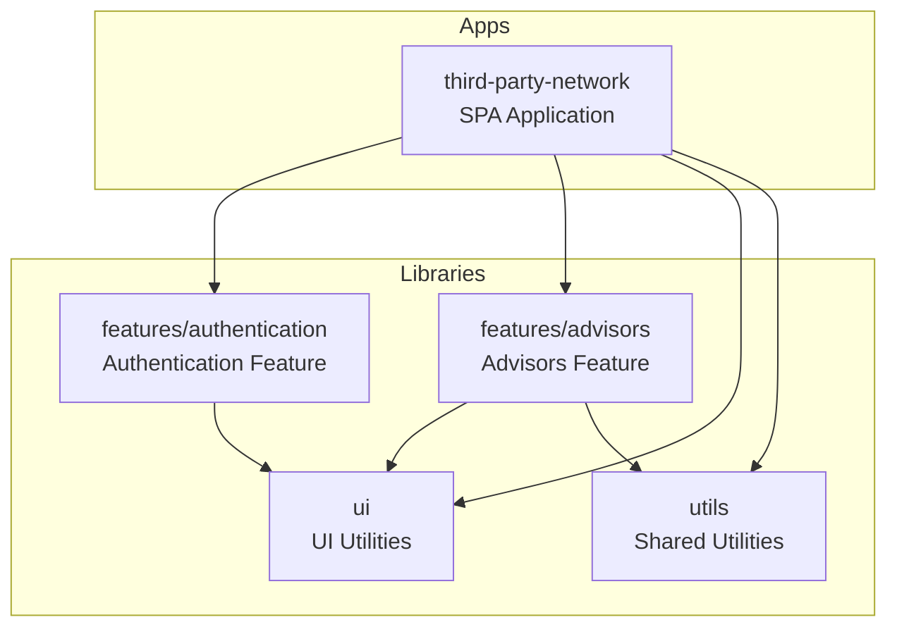
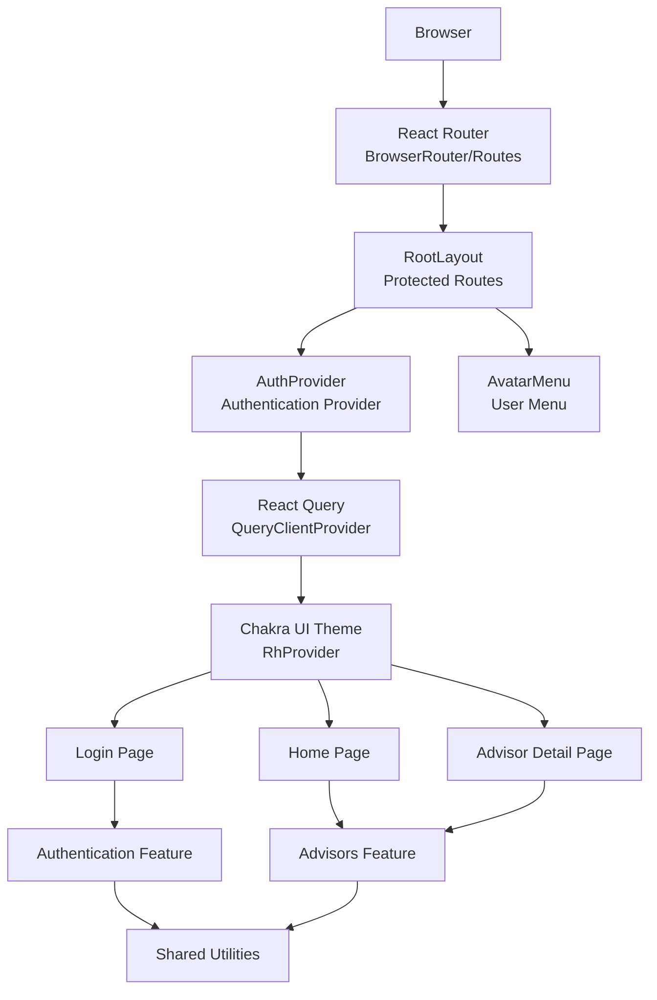
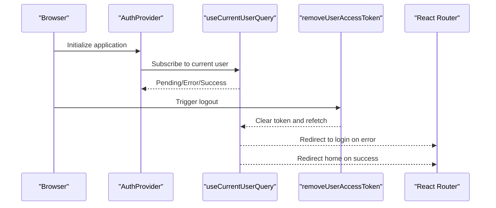
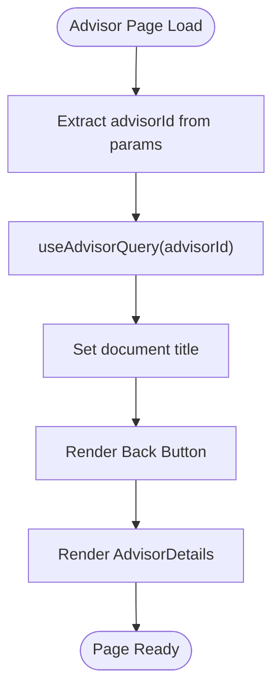
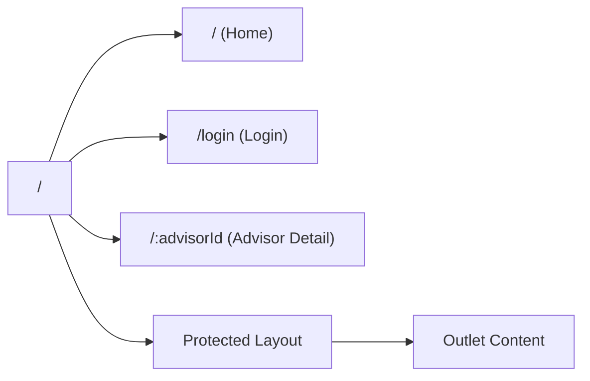
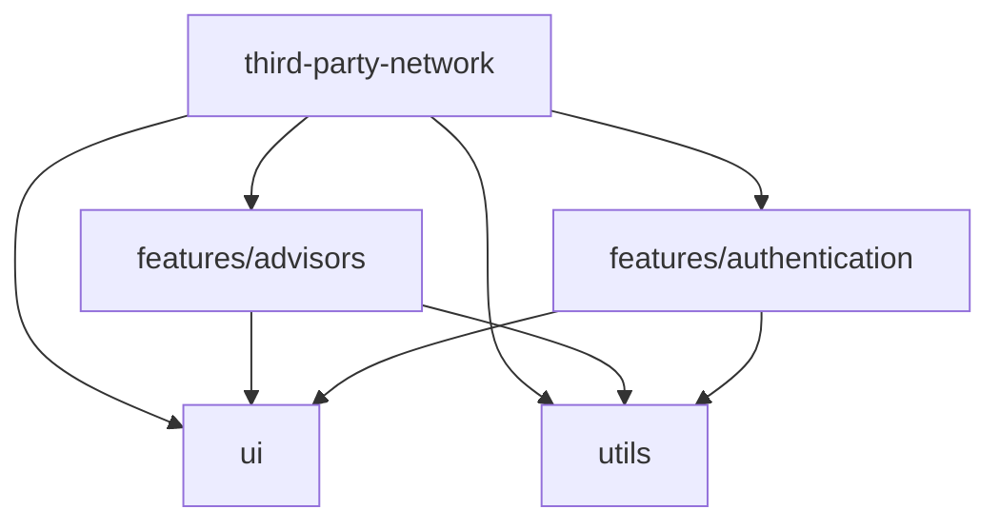
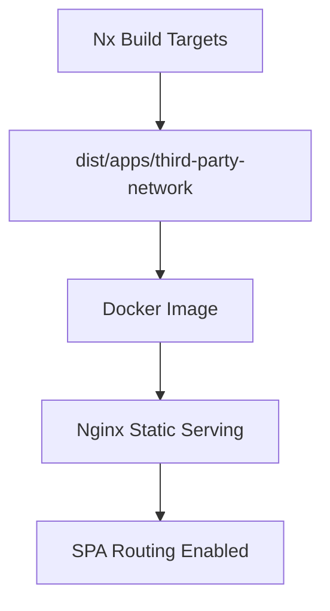
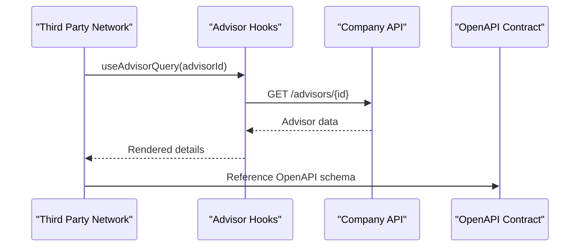

# Third Party Network

<cite>
**Referenced Files in This Document**
- [project.json](file://apps/third-party-network/project.json)
- [vite.config.ts](file://apps/third-party-network/vite.config.ts)
- [Dockerfile](file://apps/third-party-network/Dockerfile)
- [nginx-spa.conf](file://apps/third-party-network/nginx-spa.conf)
- [main.tsx](file://apps/third-party-network/src/main.tsx)
- [layout.tsx](file://apps/third-party-network/src/routes/layout/layout.tsx)
- [avatar-menu.tsx](file://apps/third-party-network/src/routes/layout/components/avatar-menu.tsx)
- [login.tsx](file://apps/third-party-network/src/routes/login/login.tsx)
- [advisor.tsx](file://apps/third-party-network/src/routes/advisor/advisor.tsx)
- [root.tsx](file://apps/third-party-network/src/routes/root/root.tsx)
- [auth-provider.tsx](file://libs/third-party-network/features/authentication/src/lib/login/components/auth-provider.tsx)
- [hooks.ts](file://libs/third-party-network/features/authentication/src/lib/login/hooks.ts)
- [api.ts](file://libs/third-party-network/features/authentication/src/lib/login/api.ts)
- [authentication.ts](file://libs/third-party-network/utils/src/lib/authentication.ts)
- [details.tsx](file://libs/third-party-network/features/advisors/src/lib/details/components/advisor-details.tsx)
- [advisor-list.tsx](file://libs/third-party-network/features/advisors/src/lib/list/advisor-list.tsx)
- [advisor-hooks.ts](file://libs/third-party-network/features/advisors/src/lib/details/hooks.ts)
- [advisor-api.ts](file://libs/third-party-network/features/advisors/src/lib/details/api.ts)
- [company-api.json](file://contracts/company-api/v1/company-api.json)
</cite>

## Update Summary
**Changes Made**
- Enhanced authentication mechanism documentation with Google OAuth integration details
- Expanded advisor feature implementation with comprehensive data presentation patterns
- Updated routing structure documentation with protected route handling
- Improved dependency analysis with feature-specific integration details
- Added comprehensive development workflow documentation
- Enhanced deployment process with containerization specifics
- Updated styling approach with Chakra UI theming and responsive design patterns

## Table of Contents
1. [Introduction](#introduction)
2. [Project Structure](#project-structure)
3. [Core Components](#core-components)
4. [Architecture Overview](#architecture-overview)
5. [Detailed Component Analysis](#detailed-component-analysis)
6. [Dependency Analysis](#dependency-analysis)
7. [Performance Considerations](#performance-considerations)
8. [Troubleshooting Guide](#troubleshooting-guide)
9. [Development Setup and Build Configuration](#development-setup-and-build-configuration)
10. [Deployment Process](#deployment-process)
11. [Integration with Backend Services](#integration-with-backend-services)
12. [Styling Approach and Accessibility](#styling-approach-and-accessibility)
13. [Conclusion](#conclusion)

## Introduction
Third Party Network is an advisor-facing application that enables users to discover, review, and engage with external advisors within the Redesign Health ecosystem. Built as a single-page application (SPA), it leverages modern frontend tooling and a modular feature architecture to deliver a responsive, accessible, and maintainable user experience. The application integrates with company API services for advisor data and authentication, while adhering to strict routing and authentication patterns to ensure secure access for authorized users.

## Project Structure
The application follows a Nx workspace monorepo layout with a dedicated application under apps/third-party-network and reusable features under libs/third-party-network. The structure emphasizes separation of concerns, with distinct packages for authentication, advisors, UI utilities, and shared utilities.

**Diagram sources**
- [project.json:1-78](file://apps/third-party-network/project.json#L1-L78)
- [main.tsx:1-40](file://apps/third-party-network/src/main.tsx#L1-L40)

**Section sources**
- [project.json:1-78](file://apps/third-party-network/project.json#L1-L78)
- [main.tsx:1-40](file://apps/third-party-network/src/main.tsx#L1-L40)

## Core Components
The application is composed of several core components that orchestrate routing, authentication, and advisor data presentation:

- **Routing and Navigation**
  - Root layout with protected routes and avatar menu
  - Login page with branding and authentication component
  - Advisor detail page with back navigation and dynamic metadata
  - Home page featuring advisor search and discovery

- **Authentication Layer**
  - Authentication provider wrapping the application
  - Current user query with loading, error, and success states
  - Logout functionality with token removal and refetch

- **Advisors Feature**
  - Advisor list component for browsing advisors
  - Advisor details component for individual profiles
  - Advisor-specific queries and API integrations

**Section sources**
- [layout.tsx:1-32](file://apps/third-party-network/src/routes/layout/layout.tsx#L1-L32)
- [avatar-menu.tsx:1-39](file://apps/third-party-network/src/routes/layout/components/avatar-menu.tsx#L1-L39)
- [login.tsx:1-24](file://apps/third-party-network/src/routes/login/login.tsx#L1-L24)
- [advisor.tsx:1-34](file://apps/third-party-network/src/routes/advisor/advisor.tsx#L1-L34)
- [root.tsx:1-38](file://apps/third-party-network/src/routes/root/root.tsx#L1-L38)

## Architecture Overview
The application employs a layered architecture with clear boundaries between presentation, feature domains, and shared utilities. The SPA renders routes via React Router, with Chakra UI providing theming and UI primitives. Authentication state is managed centrally, and advisor data is fetched through feature-specific hooks and APIs.

**Diagram sources**
- [main.tsx:1-40](file://apps/third-party-network/src/main.tsx#L1-L40)
- [layout.tsx:1-32](file://apps/third-party-network/src/routes/layout/layout.tsx#L1-L32)
- [login.tsx:1-24](file://apps/third-party-network/src/routes/login/login.tsx#L1-L24)
- [root.tsx:1-38](file://apps/third-party-network/src/routes/root/root.tsx#L1-L38)
- [advisor.tsx:1-34](file://apps/third-party-network/src/routes/advisor/advisor.tsx#L1-L34)
- [avatar-menu.tsx:1-39](file://apps/third-party-network/src/routes/layout/components/avatar-menu.tsx#L1-L39)

## Detailed Component Analysis

### Authentication Mechanisms
The authentication system centers around an AuthProvider that wraps the application, ensuring global access to authentication state and utilities. The current user query manages loading, error, and success states, while logout clears tokens and refreshes state.

**Diagram sources**
- [auth-provider.tsx:1-13](file://libs/third-party-network/features/authentication/src/lib/login/components/auth-provider.tsx#L1-L13)
- [hooks.ts:1-12](file://libs/third-party-network/features/authentication/src/lib/login/hooks.ts#L1-L12)
- [layout.tsx:1-32](file://apps/third-party-network/src/routes/layout/layout.tsx#L1-L32)
- [avatar-menu.tsx:1-39](file://apps/third-party-network/src/routes/layout/components/avatar-menu.tsx#L1-L39)
- [authentication.ts:1-14](file://libs/third-party-network/utils/src/lib/authentication.ts#L1-L14)

**Section sources**
- [auth-provider.tsx:1-13](file://libs/third-party-network/features/authentication/src/lib/login/components/auth-provider.tsx#L1-L13)
- [hooks.ts:1-12](file://libs/third-party-network/features/authentication/src/lib/login/hooks.ts#L1-L12)
- [layout.tsx:1-32](file://apps/third-party-network/src/routes/layout/layout.tsx#L1-L32)
- [avatar-menu.tsx:1-39](file://apps/third-party-network/src/routes/layout/components/avatar-menu.tsx#L1-L39)
- [authentication.ts:1-14](file://libs/third-party-network/utils/src/lib/authentication.ts#L1-L14)

### Advisor Feature Implementation
The advisors feature encapsulates advisor listing and detail presentation, integrating with company API services for data retrieval. The advisor detail page dynamically sets document titles and renders advisor attributes and engagements.

**Diagram sources**
- [advisor.tsx:1-34](file://apps/third-party-network/src/routes/advisor/advisor.tsx#L1-L34)
- [details.tsx:1-204](file://libs/third-party-network/features/advisors/src/lib/details/components/advisor-details.tsx#L1-L204)
- [advisor-hooks.ts:1-200](file://libs/third-party-network/features/advisors/src/lib/details/hooks.ts#L1-L200)

**Section sources**
- [advisor.tsx:1-34](file://apps/third-party-network/src/routes/advisor/advisor.tsx#L1-L34)
- [details.tsx:1-204](file://libs/third-party-network/features/advisors/src/lib/details/components/advisor-details.tsx#L1-L204)
- [advisor-hooks.ts:1-200](file://libs/third-party-network/features/advisors/src/lib/details/hooks.ts#L1-L200)

### Routing Structure
The application defines a clean routing hierarchy with nested layouts, protected routes, and dynamic segments for advisor profiles. RootLayout manages authentication-dependent rendering and redirects.

**Diagram sources**
- [main.tsx:15-25](file://apps/third-party-network/src/main.tsx#L15-L25)
- [layout.tsx:1-32](file://apps/third-party-network/src/routes/layout/layout.tsx#L1-L32)

**Section sources**
- [main.tsx:15-25](file://apps/third-party-network/src/main.tsx#L15-L25)
- [layout.tsx:1-32](file://apps/third-party-network/src/routes/layout/layout.tsx#L1-L32)

## Dependency Analysis
The application exhibits strong modularity with clear dependencies between the application shell and feature libraries. Authentication and advisors features depend on shared UI utilities and authentication utilities, while the application depends on both features and shared utilities.

**Diagram sources**
- [main.tsx:1-40](file://apps/third-party-network/src/main.tsx#L1-L40)
- [advisor.tsx:1-34](file://apps/third-party-network/src/routes/advisor/advisor.tsx#L1-L34)
- [login.tsx:1-24](file://apps/third-party-network/src/routes/login/login.tsx#L1-L24)

**Section sources**
- [main.tsx:1-40](file://apps/third-party-network/src/main.tsx#L1-L40)
- [advisor.tsx:1-34](file://apps/third-party-network/src/routes/advisor/advisor.tsx#L1-L34)
- [login.tsx:1-24](file://apps/third-party-network/src/routes/login/login.tsx#L1-L24)

## Performance Considerations
- **Client-side caching**: React Query manages caching and invalidation for advisor and authentication data, reducing redundant network requests.
- **Lazy loading**: Feature components are modularized, enabling efficient bundling and on-demand loading.
- **Environment-aware builds**: Vite configurations differentiate dev, staging, and prod modes for optimized builds.
- **Asset optimization**: Vite compresses output sizes and Node polyfills are selectively included to minimize bundle overhead.

## Troubleshooting Guide
Common issues and resolutions:
- **Authentication errors**: When current user queries fail, the layout redirects to the login page and clears stored tokens. Verify token validity and network connectivity.
- **Advisor data not loading**: Ensure advisor IDs are present and reachable via company API endpoints. Check query keys and error boundaries in advisor components.
- **Build/test failures**: Confirm Vite and Nx configurations match environment variables and that polyfills are configured correctly.

**Section sources**
- [layout.tsx:14-23](file://apps/third-party-network/src/routes/layout/layout.tsx#L14-L23)
- [authentication.ts:1-14](file://libs/third-party-network/utils/src/lib/authentication.ts#L1-L14)
- [vite.config.ts:1-38](file://apps/third-party-network/vite.config.ts#L1-L38)

## Development Setup and Build Configuration
- **Development server**: Nx Vite dev server runs on port 4200 with hot module replacement enabled.
- **Build targets**: Separate configurations for dev, staging, and prod modes with optimized outputs.
- **Testing**: Vitest configured with jsdom environment, coverage reporting, and include patterns for spec files.
- **Environment variables**: Vite reads environment files from the environments directory.

**Section sources**
- [vite.config.ts:1-38](file://apps/third-party-network/vite.config.ts#L1-L38)
- [project.json:7-75](file://apps/third-party-network/project.json#L7-L75)

## Deployment Process
The application is containerized using Nginx to serve the SPA statically. The Dockerfile copies the built output and serves it via Nginx with SPA routing enabled.

**Diagram sources**
- [Dockerfile:1-7](file://apps/third-party-network/Dockerfile#L1-L7)
- [nginx-spa.conf:1-10](file://apps/third-party-network/nginx-spa.conf#L1-L10)

**Section sources**
- [Dockerfile:1-7](file://apps/third-party-network/Dockerfile#L1-L7)
- [nginx-spa.conf:1-10](file://apps/third-party-network/nginx-spa.conf#L1-L10)

## Integration with Backend Services
The application integrates with company API services for advisor data and authentication. Company API contract definitions are available for reference, and feature hooks consume typed endpoints to fetch advisor details and related engagements.

**Diagram sources**
- [advisor-hooks.ts:1-200](file://libs/third-party-network/features/advisors/src/lib/details/hooks.ts#L1-L200)
- [advisor-api.ts:1-200](file://libs/third-party-network/features/advisors/src/lib/details/api.ts#L1-L200)
- [company-api.json:1-200](file://contracts/company-api/v1/company-api.json#L1-L200)

**Section sources**
- [advisor-hooks.ts:1-200](file://libs/third-party-network/features/advisors/src/lib/details/hooks.ts#L1-L200)
- [advisor-api.ts:1-200](file://libs/third-party-network/features/advisors/src/lib/details/api.ts#L1-L200)
- [company-api.json:1-200](file://contracts/company-api/v1/company-api.json#L1-L200)

## Styling Approach and Accessibility
- **Theming**: Chakra UI theme is applied globally via RhProvider, ensuring consistent design tokens and component styles.
- **Responsive design**: Components utilize responsive spacing and sizing props to adapt across screen sizes.
- **Accessibility**: AvatarMenu uses semantic markup and keyboard-friendly interactions through Chakra UI components. Ensure all interactive elements have appropriate ARIA roles and focus management.

**Section sources**
- [main.tsx:34-36](file://apps/third-party-network/src/main.tsx#L34-L36)
- [avatar-menu.tsx:21-36](file://apps/third-party-network/src/routes/layout/components/avatar-menu.tsx#L21-L36)

## Conclusion
Third Party Network delivers a robust, scalable solution for advisor discovery and engagement. Its modular architecture, centralized authentication, and feature-driven design enable maintainability and extensibility. By leveraging React Router, React Query, and Chakra UI, the application achieves a responsive, accessible, and performant user experience while integrating seamlessly with company API services.