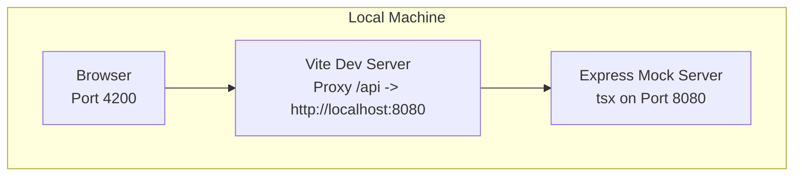
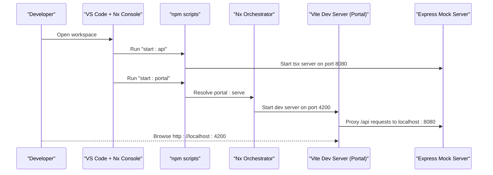
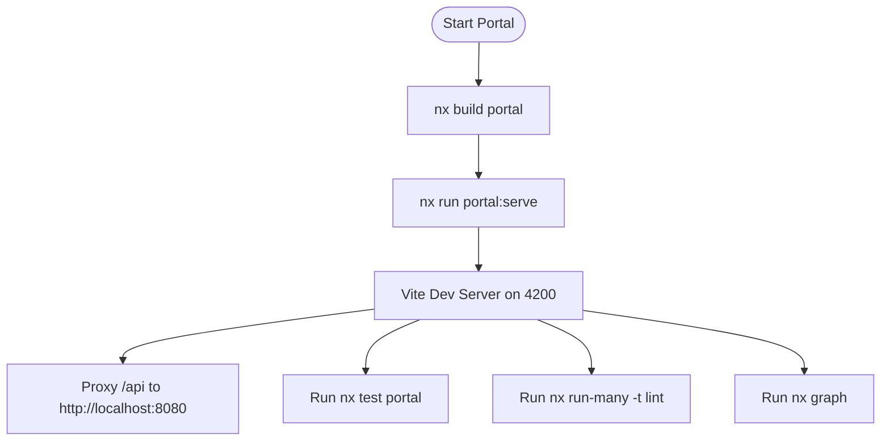
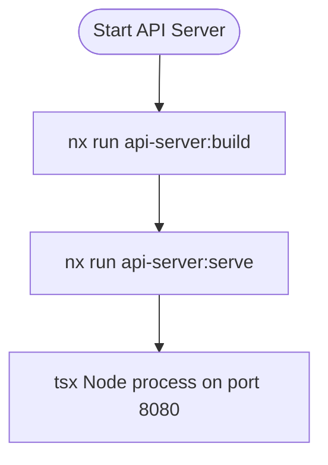
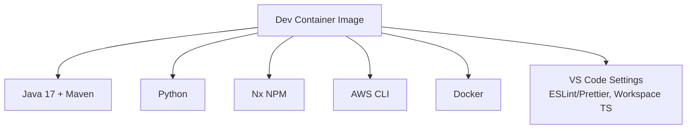
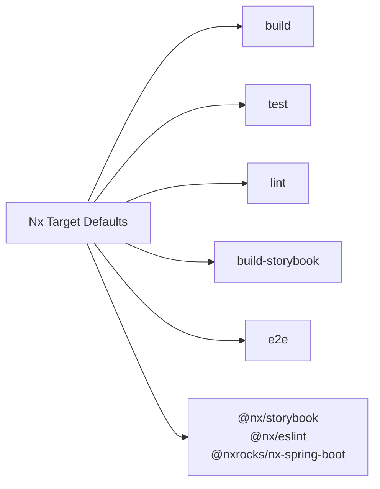

# Getting Started

<cite>
**Referenced Files in This Document**
- [README.md](file://README.md)
- [package.json](file://package.json)
- [nx.json](file://nx.json)
- [.devcontainer/devcontainer.json](file://.devcontainer/devcontainer.json)
- [.devcontainer/Dockerfile](file://.devcontainer/Dockerfile)
- [apps/portal/.env.local.example](file://apps/portal/.env.local.example)
- [apps/portal/project.json](file://apps/portal/project.json)
- [apps/api-server/project.json](file://apps/api-server/project.json)
- [apps/portal/vite.config.ts](file://apps/portal/vite.config.ts)
- [apps/portal/proxy.conf.json](file://apps/portal/proxy.conf.json)
- [tsconfig.base.json](file://tsconfig.base.json)
- [.eslintrc.json](file://.eslintrc.json)
- [.prettierrc](file://.prettierrc)
</cite>

## Table of Contents
1. [Introduction](#introduction)
2. [Project Structure](#project-structure)
3. [Core Components](#core-components)
4. [Architecture Overview](#architecture-overview)
5. [Detailed Component Analysis](#detailed-component-analysis)
6. [Dependency Analysis](#dependency-analysis)
7. [Performance Considerations](#performance-considerations)
8. [Troubleshooting Guide](#troubleshooting-guide)
9. [Conclusion](#conclusion)
10. [Appendices](#appendices)

## Introduction
This guide helps you set up and run the Redesign Health Nx monorepo locally. You will clone the repository, install prerequisites, configure the development environment, start the API server and the Portal application, and learn how to use Nx Console in VS Code. It also covers environment variables for development and production, essential commands for building, serving, testing, and linting, and how to use the devcontainer for a reproducible environment.

## Project Structure
The repository is organized as an Nx monorepo with:
- apps/: Application code (Portal, API server, POCs, and others)
- libs/: Shared libraries (design system, utilities, and feature libraries)
- tools/: Nx plugins and supporting tooling
- docs/, playwright/, contracts/, and other directories for documentation, tests, and contracts

Key applications:
- Portal (React 19 + Vite): serves on port 4200
- API server (Express via tsx): serves on port 8080
- Additional apps such as chat POCs, company API, and others

Workspace defaults:
- Default project is portal
- Nx Cloud token is configured for caching and orchestration

**Section sources**
- [README.md:41-70](file://README.md#L41-L70)
- [nx.json:108-148](file://nx.json#L108-L148)

## Core Components
- Nx workspace with Nx 22 and TypeScript 5
- Build system: Nx orchestrator with target defaults and caching
- Frontend: React 19 + Vite for the Portal app
- Backend: Express mock server via tsx for the API server
- Testing: Jest and Vitest for unit tests; Playwright for E2E
- Linting: ESLint + Prettier with shared configs
- Storybook: Shared UI and Portal UI storybooks

Essential commands (from the root):
- Install dependencies: npm install
- Serve API server: npm run start:api
- Serve Portal: npm run start:portal
- Build Portal: nx build portal
- Run all tests: nx run-many -t test
- Lint all projects: nx run-many -t lint
- Run E2E tests: nx e2e portal-e2e
- View dependency graph: nx graph
- Run Storybook: npm run storybook

Workspace notes:
- One root package.json installs all packages; Nx resolves per-project needs
- Affected commands run only on changed projects
- Path aliases under @redesignhealth/*

**Section sources**
- [README.md:28-40](file://README.md#L28-L40)
- [README.md:72-127](file://README.md#L72-L127)
- [package.json:5-47](file://package.json#L5-L47)

## Architecture Overview
High-level flow:
- The Portal app runs on Vite (port 4200) and proxies API requests to the Express mock server (port 8080).
- The API server serves mock endpoints for the Portal to consume.
- Nx orchestrates builds, tests, and tasks across apps and libs.

**Diagram sources**
- [apps/portal/vite.config.ts:18](file://apps/portal/vite.config.ts#L18)
- [apps/portal/proxy.conf.json:1-7](file://apps/portal/proxy.conf.json#L1-L7)
- [apps/api-server/project.json:65-82](file://apps/api-server/project.json#L65-L82)

## Detailed Component Analysis

### Prerequisites
- Node.js and npm versions are specified in the root package.json engines field.
- Docker is used for the devcontainer; a container runtime is required.
- VS Code with the Nx Console extension is recommended for task execution and project navigation.

Verification steps:
- Confirm Node.js and npm versions meet engines requirements.
- Verify Docker is installed and running.
- Launch VS Code and install recommended extensions (see VS Code setup section).

**Section sources**
- [package.json:262-266](file://package.json#L262-L266)
- [README.md:140-159](file://README.md#L140-L159)

### Step-by-Step Installation
1. Clone the repository to your machine.
2. From the repository root, install dependencies:
   - npm install
3. Start the API server:
   - npm run start:api
4. Start the Portal:
   - npm run start:portal
5. Open the Portal in your browser at http://localhost:4200.

Environment variables:
- Create apps/portal/.env.local using the example as a template.
- Set VITE_COMPANY_API_HOSTNAME to http://localhost:8080 for local API.
- Add VITE_GOOGLE_CLIENT_ID and optional analytics IDs as needed.

Verification:
- Confirm the API server responds at http://localhost:8080.
- Confirm the Portal loads at http://localhost:4200 and can reach /api endpoints.

**Section sources**
- [README.md:76-105](file://README.md#L76-L105)
- [apps/portal/.env.local.example:1-8](file://apps/portal/.env.local.example#L1-L8)

### Development Environment Setup (Devcontainer)
Recommended for a fully reproducible local environment:
- Prerequisites:
  - VS Code with Remote - Containers extension
  - Rancher Desktop or another container runtime (dockerd)
- Steps:
  - In VS Code, use “Dev Container: Clone Repository in Container Volume”
  - Enter the repository’s HTTPS URL
  - The devcontainer builds from .devcontainer/Dockerfile and .devcontainer/devcontainer.json
  - Features include Java 17, Maven, Python, AWS CLI, Docker, and Nx NPM
  - VS Code settings enable ESLint, Prettier, and workspace TypeScript

Notes:
- After modifying Dockerfile or devcontainer.json, rebuild the container from the Dev Container menu.

**Section sources**
- [README.md:140-159](file://README.md#L140-L159)
- [.devcontainer/devcontainer.json:1-145](file://.devcontainer/devcontainer.json#L1-L145)
- [.devcontainer/Dockerfile:1-6](file://.devcontainer/Dockerfile#L1-L6)

### Environment Variable Configuration
- Local development:
  - Create apps/portal/.env.local from the example
  - Point VITE_COMPANY_API_HOSTNAME to http://localhost:8080
  - Add VITE_GOOGLE_CLIENT_ID and optional analytics IDs
- Production:
  - Use your hosted company API hostname
  - Set client IDs and measurement IDs appropriate for the environment

Validation:
- Confirm the Portal can fetch data from /api endpoints proxied to the local API server.

**Section sources**
- [apps/portal/.env.local.example:1-8](file://apps/portal/.env.local.example#L1-L8)
- [apps/portal/proxy.conf.json:1-7](file://apps/portal/proxy.conf.json#L1-L7)

### Essential Commands
Common tasks from the root:
- Serve Portal: nx run portal:serve
- Serve API server: nx run api-server:serve
- Build Portal: nx build portal
- Run all tests: nx run-many -t test
- Run Portal tests: nx test portal
- Lint all projects: nx run-many -t lint
- Run E2E tests: nx e2e portal-e2e
- View dependency graph: nx graph
- Run Storybook: npm run storybook

Workspace-specific commands:
- Portal build and serve targets are defined in apps/portal/project.json
- API server build and serve targets are defined in apps/api-server/project.json

**Section sources**
- [README.md:107-119](file://README.md#L107-L119)
- [apps/portal/project.json:33-135](file://apps/portal/project.json#L33-L135)
- [apps/api-server/project.json:65-82](file://apps/api-server/project.json#L65-L82)

### Using Nx Console in VS Code
- Install the Nx Console extension from the marketplace.
- On first open, you may be prompted to use the workspace TypeScript version; accept or set it manually:
  - Open any TS file
  - Ctrl+Shift+P → “TypeScript: Select TypeScript Version”
  - Choose “Use Workspace Version”
- Use Nx Console to discover and run tasks for apps and libs.

**Section sources**
- [README.md:128-138](file://README.md#L128-L138)
- [.devcontainer/devcontainer.json:129-131](file://.devcontainer/devcontainer.json#L129-L131)

### Workspace TypeScript Version Selection
- The devcontainer sets TypeScript SDK to the workspace version.
- Alternatively, manually select the workspace TS version in VS Code.

**Section sources**
- [.devcontainer/devcontainer.json:129-131](file://.devcontainer/devcontainer.json#L129-L131)

### Path Aliases and Imports
- The base tsconfig defines @redesignhealth/* aliases for shared and portal libraries.
- These aliases simplify imports across the monorepo.

**Section sources**
- [tsconfig.base.json:20-91](file://tsconfig.base.json#L20-L91)

### Linting and Formatting
- ESLint and Prettier are configured globally.
- Prettier settings enforce consistent formatting across the monorepo.
- Nx target defaults include lint inputs and caching.

**Section sources**
- [.eslintrc.json:1-225](file://.eslintrc.json#L1-L225)
- [.prettierrc:1-9](file://.prettierrc#L1-L9)
- [nx.json:31-36](file://nx.json#L31-L36)

## Architecture Overview

**Diagram sources**
- [package.json:7-9](file://package.json#L7-L9)
- [apps/portal/project.json:33-49](file://apps/portal/project.json#L33-L49)
- [apps/api-server/project.json:65-82](file://apps/api-server/project.json#L65-L82)
- [apps/portal/vite.config.ts:18](file://apps/portal/vite.config.ts#L18)
- [apps/portal/proxy.conf.json:1-7](file://apps/portal/proxy.conf.json#L1-L7)

## Detailed Component Analysis

### Portal Application
- Executor: @nx/vite:build and @nx/vite:dev-server
- Ports: dev server on 4200, preview on 4300
- Proxy: /api routed to the API server on 8080
- Test setup: Vitest with jsdom environment and coverage
- Type checking: separate targets for app and spec tsconfigs

**Diagram sources**
- [apps/portal/project.json:8-135](file://apps/portal/project.json#L8-L135)
- [apps/portal/vite.config.ts:18](file://apps/portal/vite.config.ts#L18)
- [apps/portal/proxy.conf.json:1-7](file://apps/portal/proxy.conf.json#L1-L7)

**Section sources**
- [apps/portal/project.json:8-135](file://apps/portal/project.json#L8-L135)
- [apps/portal/vite.config.ts:1-68](file://apps/portal/vite.config.ts#L1-L68)
- [apps/portal/proxy.conf.json:1-7](file://apps/portal/proxy.conf.json#L1-L7)

### API Server Application
- Executor: @nx/esbuild:esbuild for build, @nx/js:node for serve
- Serves on port 8080 via tsx
- Build outputs to dist/apps/api-server with sourcemaps in development

**Diagram sources**
- [apps/api-server/project.json:8-82](file://apps/api-server/project.json#L8-L82)

**Section sources**
- [apps/api-server/project.json:8-82](file://apps/api-server/project.json#L8-L82)

### Devcontainer Configuration
- Base image with Debian Bullseye
- Git and bash-completion installed
- Features: Java 17 + Maven, Python, Nx NPM, AWS CLI, Docker
- VS Code settings: ESLint/Prettier on save, workspace TS SDK, search excludes

**Diagram sources**
- [.devcontainer/Dockerfile:1-6](file://.devcontainer/Dockerfile#L1-L6)
- [.devcontainer/devcontainer.json:18-38](file://.devcontainer/devcontainer.json#L18-L38)
- [.devcontainer/devcontainer.json:44-140](file://.devcontainer/devcontainer.json#L44-L140)

**Section sources**
- [.devcontainer/devcontainer.json:1-145](file://.devcontainer/devcontainer.json#L1-L145)
- [.devcontainer/Dockerfile:1-6](file://.devcontainer/Dockerfile#L1-L6)

## Dependency Analysis
- Nx target defaults define inputs for build, test, lint, and storybook tasks, enabling caching and incremental builds.
- Named inputs exclude test/spec files and story files from production inputs.
- Plugins include @nx/storybook, @nx/eslint, and @nxrocks/nx-spring-boot.

**Diagram sources**
- [nx.json:8-72](file://nx.json#L8-L72)
- [nx.json:109-126](file://nx.json#L109-L126)

**Section sources**
- [nx.json:1-149](file://nx.json#L1-L149)

## Performance Considerations
- Use affected commands to limit work to changed projects.
- Enable Nx Cloud caching for faster CI and local builds.
- Keep dev server HMR enabled for faster reloads.
- Prefer running tests in watch mode for iterative development.

[No sources needed since this section provides general guidance]

## Troubleshooting Guide
Common setup issues and resolutions:
- Node/npm version mismatch:
  - Ensure your Node.js and npm versions satisfy engines requirements.
- Port conflicts:
  - If ports 4200 or 8080 are in use, adjust the dev server ports in the relevant configuration files.
- Proxy not forwarding requests:
  - Verify proxy.conf.json forwards /api to the correct API server address.
- Missing environment variables:
  - Create apps/portal/.env.local and set VITE_COMPANY_API_HOSTNAME to http://localhost:8080.
- VS Code TypeScript version:
  - Use “TypeScript: Select TypeScript Version” and choose “Use Workspace Version”.
- Devcontainer build errors:
  - Rebuild the container after changes to Dockerfile or devcontainer.json.

Verification steps:
- Confirm the API server responds at http://localhost:8080.
- Confirm the Portal loads at http://localhost:4200 and can reach /api endpoints.
- Run nx run-many -t lint and nx run-many -t test to validate the setup.

**Section sources**
- [package.json:262-266](file://package.json#L262-L266)
- [apps/portal/proxy.conf.json:1-7](file://apps/portal/proxy.conf.json#L1-L7)
- [apps/portal/.env.local.example:1-8](file://apps/portal/.env.local.example#L1-L8)
- [README.md:128-138](file://README.md#L128-L138)
- [README.md:140-159](file://README.md#L140-L159)

## Conclusion
You now have the prerequisites, environment setup, and commands to run the Portal and API server locally. Use the devcontainer for a reproducible environment, configure environment variables for your scenario, and leverage Nx Console in VS Code for efficient task execution. Refer to the sections above for detailed steps and troubleshooting.

[No sources needed since this section summarizes without analyzing specific files]

## Appendices

### Appendix A: Quick Reference Commands
- Install: npm install
- Start API: npm run start:api
- Start Portal: npm run start:portal
- Build Portal: nx build portal
- Test: nx run-many -t test
- Lint: nx run-many -t lint
- E2E: nx e2e portal-e2e
- Graph: nx graph
- Storybook: npm run storybook

**Section sources**
- [README.md:76-119](file://README.md#L76-L119)
- [package.json:5-47](file://package.json#L5-L47)