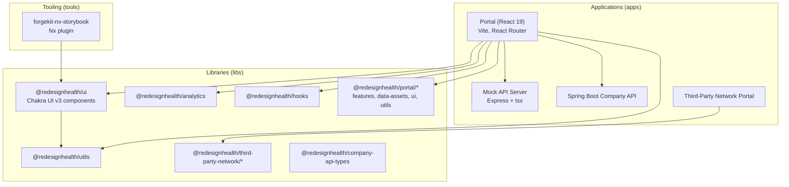
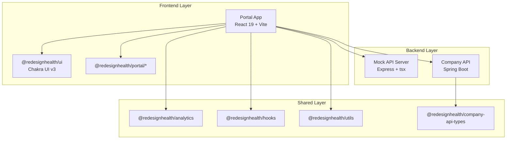
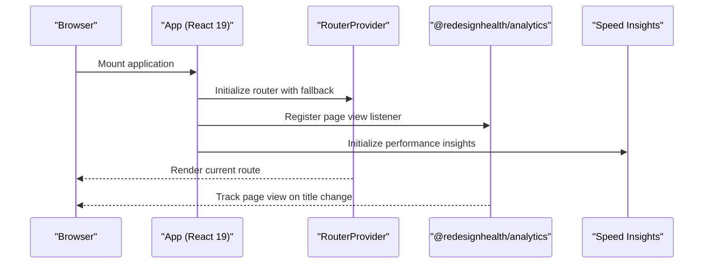
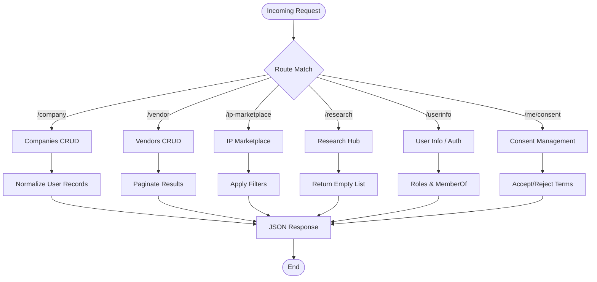
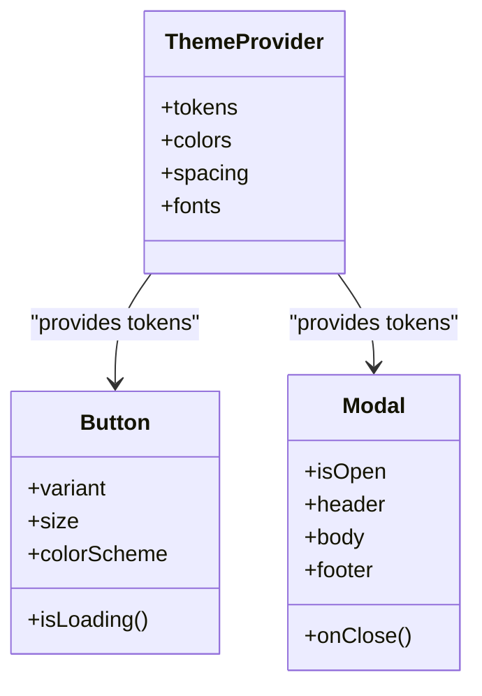
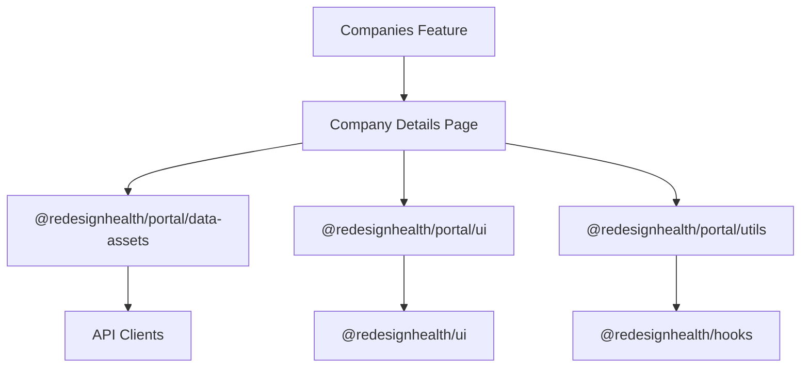
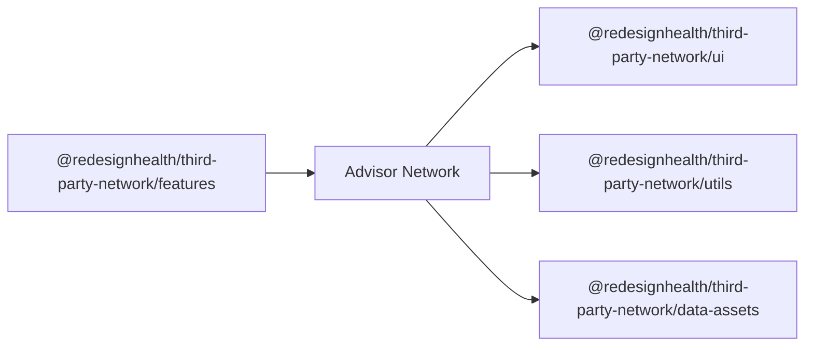
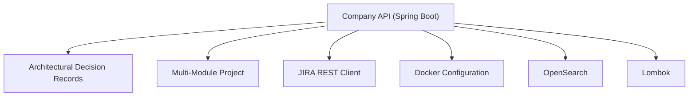
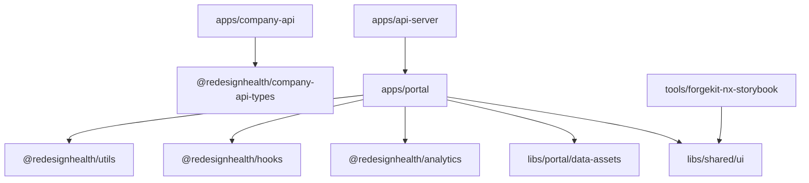

# Project Overview

<cite>
**Referenced Files in This Document**
- [README.md](file://README.md)
- [nx.json](file://nx.json)
- [package.json](file://package.json)
- [apps/portal/src/app/app.tsx](file://apps/portal/src/app/app.tsx)
- [apps/api-server/src/main.ts](file://apps/api-server/src/main.ts)
- [libs/shared/ui/src/lib/button/index.ts](file://libs/shared/ui/src/lib/button/index.ts)
- [libs/shared/ui/src/lib/theme/index.ts](file://libs/shared/ui/src/lib/theme/index.ts)
- [libs/portal/features/companies/src/lib/company-details/company-details.tsx](file://libs/portal/features/companies/src/lib/company-details/company-details.tsx)
- [libs/third-party-network/features/advisor-network/advisor-network.tsx](file://libs/third-party-network/features/advisor-network/advisor-network.tsx)
- [apps/company-api/project.json](file://apps/company-api/project.json)
- [apps/company-api/pom.xml](file://apps/company-api/pom.xml)
- [apps/portal/project.json](file://apps/portal/project.json)
- [apps/api-server/project.json](file://apps/api-server/project.json)
- [libs/portal/data-assets/project.json](file://libs/portal/data-assets/project.json)
- [libs/shared/ui/project.json](file://libs/shared/ui/project.json)
- [tools/forgekit-nx-storybook/README.md](file://tools/forgekit-nx-storybook/README.md)
- [contracts/company-api/v1/company-api.json](file://contracts/company-api/v1/company-api.json)
- [docs/platform-documentation-library/service-infrastructure-overview.md](file://docs/platform-documentation-library/service-infrastructure-overview.md)
- [docs/platform-documentation-library/telemetry-and-data-infrastructure-overview.md](file://docs/platform-documentation-library/telemetry-and-data-infrastructure-overview.md)
</cite>

## Table of Contents
1. [Introduction](#introduction)
2. [Project Structure](#project-structure)
3. [Core Components](#core-components)
4. [Architecture Overview](#architecture-overview)
5. [Detailed Component Analysis](#detailed-component-analysis)
6. [Dependency Analysis](#dependency-analysis)
7. [Performance Considerations](#performance-considerations)
8. [Troubleshooting Guide](#troubleshooting-guide)
9. [Conclusion](#conclusion)
10. [Appendices](#appendices)

## Introduction
Redesign Health is a healthcare-focused platform designed to connect companies, vendors, researchers, and stakeholders through a unified digital portal. The Nx monorepo serves as the foundational workspace that orchestrates frontend applications, backend services, and shared libraries. Its mission is to streamline collaboration, accelerate innovation, and provide a scalable foundation for health-tech ecosystems by offering a cohesive set of tools, design systems, and reusable components.

Key value propositions:
- Unified access to company profiles, vendor listings, IP marketplace, research hub, and community features
- Rapid iteration via Nx-powered build and test orchestration
- Consistent user experience through a modern design system (Chakra UI v3)
- Developer productivity with shared libraries, standardized tooling, and automated testing

Target audience:
- Healthcare companies and startups seeking visibility and connections
- Vendors and service providers targeting the health ecosystem
- Researchers and analysts exploring IP opportunities and market insights
- Stakeholders and advisors participating in the third-party network

**Section sources**
- [README.md:1-167](file://README.md#L1-L167)

## Project Structure
The repository follows an Nx monorepo architecture with clear separation of concerns across applications, libraries, tools, and documentation. The structure supports independent development, testing, and deployment of frontend portals, backend services, and shared components.

High-level layout:
- apps: Executable applications (frontend portals, API servers, Spring Boot services)
- libs: Reusable libraries (shared UI, portal-specific features, third-party network, company API types)
- tools: Nx plugins and developer tooling (Storybook MCP, generators)
- docs: Platform documentation and design system guides
- contracts: API contract definitions (OpenAPI)

**Diagram sources**
- [README.md:41-70](file://README.md#L41-L70)
- [nx.json:108-126](file://nx.json#L108-L126)
- [package.json:56-129](file://package.json#L56-L129)

**Section sources**
- [README.md:41-70](file://README.md#L41-L70)
- [nx.json:108-126](file://nx.json#L108-L126)
- [package.json:56-129](file://package.json#L56-L129)

## Core Components
This section outlines the primary building blocks of the platform and their responsibilities.

- Portal (React 19): The main user interface application built with Vite, routing via React Router, and powered by Chakra UI v3. It integrates analytics, performance insights, and a robust routing system.
- Mock API Server (Express + tsx): A lightweight Express server providing REST endpoints for companies, vendors, IP marketplace, research hub, user info, and consent management. It simulates backend interactions for development and testing.
- Shared UI (@redesignhealth/ui): A comprehensive Chakra UI v3 component library with design system tokens, theme configuration, and standardized components. It includes shims for backward compatibility during the v2→v3 migration.
- Portal Features (@redesignhealth/portal/*): Feature-sliced modules for companies, users, library, and other domain areas. They encapsulate data assets, UI components, utilities, and page-level logic.
- Third-Party Network (@redesignhealth/third-party-network/*): Dedicated features for advisor networks and related functionality.
- Company API Types (@redesignhealth/company-api-types): OpenAPI-generated TypeScript types for the Spring Boot Company API, enabling type-safe client integrations.
- forgekit-nx-storybook: An Nx plugin that auto-generates Storybook stories, interaction tests, Playwright component tests, and accessibility audits from component analysis.

Practical examples of platform capabilities:
- Company management: CRUD operations for companies, member management, and conflict resolution endpoints
- IP marketplace: Listings, filters, and contact request workflows
- Research hub: Research articles and expert notes ingestion and pagination
- Community platform: User profiles, roles, and consent management

**Section sources**
- [apps/portal/src/app/app.tsx:1-45](file://apps/portal/src/app/app.tsx#L1-L45)
- [apps/api-server/src/main.ts:66-480](file://apps/api-server/src/main.ts#L66-L480)
- [libs/shared/ui/src/lib/button/index.ts](file://libs/shared/ui/src/lib/button/index.ts)
- [libs/shared/ui/src/lib/theme/index.ts](file://libs/shared/ui/src/lib/theme/index.ts)
- [libs/portal/features/companies/src/lib/company-details/company-details.tsx](file://libs/portal/features/companies/src/lib/company-details/company-details.tsx)
- [tools/forgekit-nx-storybook/README.md](file://tools/forgekit-nx-storybook/README.md)

## Architecture Overview
The system architecture is layered and modular, emphasizing separation of concerns and scalability. The frontend portal communicates with backend services through well-defined APIs, while shared libraries provide consistent UI and utilities across applications.

**Diagram sources**
- [apps/portal/src/app/app.tsx:1-45](file://apps/portal/src/app/app.tsx#L1-L45)
- [apps/api-server/src/main.ts:66-480](file://apps/api-server/src/main.ts#L66-L480)
- [apps/company-api/project.json](file://apps/company-api/project.json)
- [libs/portal/data-assets/project.json](file://libs/portal/data-assets/project.json)
- [libs/shared/ui/project.json](file://libs/shared/ui/project.json)

## Detailed Component Analysis

### Portal Application
The Portal application initializes routing, analytics, and performance monitoring. It leverages React Router for navigation and Chakra UI for consistent UI rendering. The app manages page views through Helmet and integrates Vercel Speed Insights for performance metrics.

**Diagram sources**
- [apps/portal/src/app/app.tsx:26-42](file://apps/portal/src/app/app.tsx#L26-L42)

**Section sources**
- [apps/portal/src/app/app.tsx:1-45](file://apps/portal/src/app/app.tsx#L1-L45)

### Mock API Server Endpoints
The Express server exposes a comprehensive set of endpoints covering companies, vendors, IP marketplace, research hub, user info, and consent management. It normalizes user records, paginates lists, and handles various CRUD operations.

**Diagram sources**
- [apps/api-server/src/main.ts:66-480](file://apps/api-server/src/main.ts#L66-L480)

**Section sources**
- [apps/api-server/src/main.ts:66-480](file://apps/api-server/src/main.ts#L66-L480)

### Shared UI Library (Chakra UI v3)
The shared UI library provides a consistent design system across the platform. It includes components, theme tokens, and provider configurations. The migration to Chakra UI v3 involved updating component APIs and maintaining backward compatibility through shims.

**Diagram sources**
- [libs/shared/ui/src/lib/theme/index.ts](file://libs/shared/ui/src/lib/theme/index.ts)
- [libs/shared/ui/src/lib/button/index.ts](file://libs/shared/ui/src/lib/button/index.ts)

**Section sources**
- [libs/shared/ui/src/lib/theme/index.ts](file://libs/shared/ui/src/lib/theme/index.ts)
- [libs/shared/ui/src/lib/button/index.ts](file://libs/shared/ui/src/lib/button/index.ts)

### Portal Features (Companies)
The portal features module encapsulates company-related functionality, including company details and associated pages. Feature-sliced architecture promotes maintainability and testability.

**Diagram sources**
- [libs/portal/features/companies/src/lib/company-details/company-details.tsx](file://libs/portal/features/companies/src/lib/company-details/company-details.tsx)
- [libs/portal/data-assets/project.json](file://libs/portal/data-assets/project.json)

**Section sources**
- [libs/portal/features/companies/src/lib/company-details/company-details.tsx](file://libs/portal/features/companies/src/lib/company-details/company-details.tsx)

### Third-Party Network Features
The third-party network module provides advisor network features and related UI components, utilities, and data assets for stakeholder engagement.

**Diagram sources**
- [libs/third-party-network/features/advisor-network/advisor-network.tsx](file://libs/third-party-network/features/advisor-network/advisor-network.tsx)

**Section sources**
- [libs/third-party-network/features/advisor-network/advisor-network.tsx](file://libs/third-party-network/features/advisor-network/advisor-network.tsx)

### Spring Boot Company API
The Spring Boot service defines the Company API with architectural decision records, multi-module structure, and integration points. It is configured as an Nx project with Maven packaging and Docker support.

**Diagram sources**
- [apps/company-api/project.json](file://apps/company-api/project.json)
- [apps/company-api/pom.xml](file://apps/company-api/pom.xml)

**Section sources**
- [apps/company-api/project.json](file://apps/company-api/project.json)
- [apps/company-api/pom.xml](file://apps/company-api/pom.xml)

## Dependency Analysis
The monorepo enforces clear boundaries between applications and libraries, with Nx orchestrating build, test, and lint targets. Shared libraries reduce duplication and ensure consistency across the platform.

**Diagram sources**
- [nx.json:8-72](file://nx.json#L8-L72)
- [apps/portal/project.json](file://apps/portal/project.json)
- [apps/api-server/project.json](file://apps/api-server/project.json)
- [apps/company-api/project.json](file://apps/company-api/project.json)
- [libs/portal/data-assets/project.json](file://libs/portal/data-assets/project.json)
- [libs/shared/ui/project.json](file://libs/shared/ui/project.json)
- [tools/forgekit-nx-storybook/README.md](file://tools/forgekit-nx-storybook/README.md)

**Section sources**
- [nx.json:8-72](file://nx.json#L8-L72)
- [package.json:56-129](file://package.json#L56-L129)

## Performance Considerations
- Build orchestration: Nx target defaults and caching minimize rebuild times and optimize CI performance.
- Frontend performance: Vite provides fast development builds and optimized production bundles.
- Analytics and insights: Integration with Google Analytics 4 and Vercel Speed Insights enables performance monitoring and user behavior tracking.
- Testing strategy: Jest/Vitest for unit tests, Playwright for E2E, and Storybook for component testing ensures reliability and visual consistency.

[No sources needed since this section provides general guidance]

## Troubleshooting Guide
Common issues and resolutions:
- API server startup: Ensure the mock API server is running on the configured port and environment variables are set correctly.
- Portal development: Verify Vite dev server is reachable and CORS settings permit cross-origin requests.
- Shared UI migration: Confirm Chakra UI v3 components are used consistently and shims are applied where necessary.
- Nx tasks: Use affected commands to limit scope during development and leverage Nx graph to visualize dependencies.

**Section sources**
- [README.md:96-120](file://README.md#L96-L120)
- [apps/api-server/src/main.ts:18-30](file://apps/api-server/src/main.ts#L18-L30)

## Conclusion
The Redesign Health Nx monorepo delivers a scalable, developer-friendly platform for the healthcare ecosystem. By combining modern frontend technologies, a robust backend mock server, and a comprehensive shared design system, it accelerates feature delivery while maintaining consistency and quality. The architecture supports independent evolution of applications and libraries, enabling teams to collaborate efficiently and iterate rapidly.

[No sources needed since this section summarizes without analyzing specific files]

## Appendices

### Technology Stack
- Build System: Nx 22
- Frontend: React 19 + Vite
- UI Library: Chakra UI v3
- Language: TypeScript 5
- API Server: Express via tsx
- Unit Tests: Jest / Vitest
- E2E Tests: Playwright
- Linting: ESLint + Prettier

**Section sources**
- [README.md:28-40](file://README.md#L28-L40)

### API Contracts
- Company API: OpenAPI contract for type-safe client generation and integration.

**Section sources**
- [contracts/company-api/v1/company-api.json](file://contracts/company-api/v1/company-api.json)

### Infrastructure and Telemetry
- Service infrastructure overview and telemetry/data infrastructure documentation provide operational context for the platform.

**Section sources**
- [docs/platform-documentation-library/service-infrastructure-overview.md](file://docs/platform-documentation-library/service-infrastructure-overview.md)
- [docs/platform-documentation-library/telemetry-and-data-infrastructure-overview.md](file://docs/platform-documentation-library/telemetry-and-data-infrastructure-overview.md)