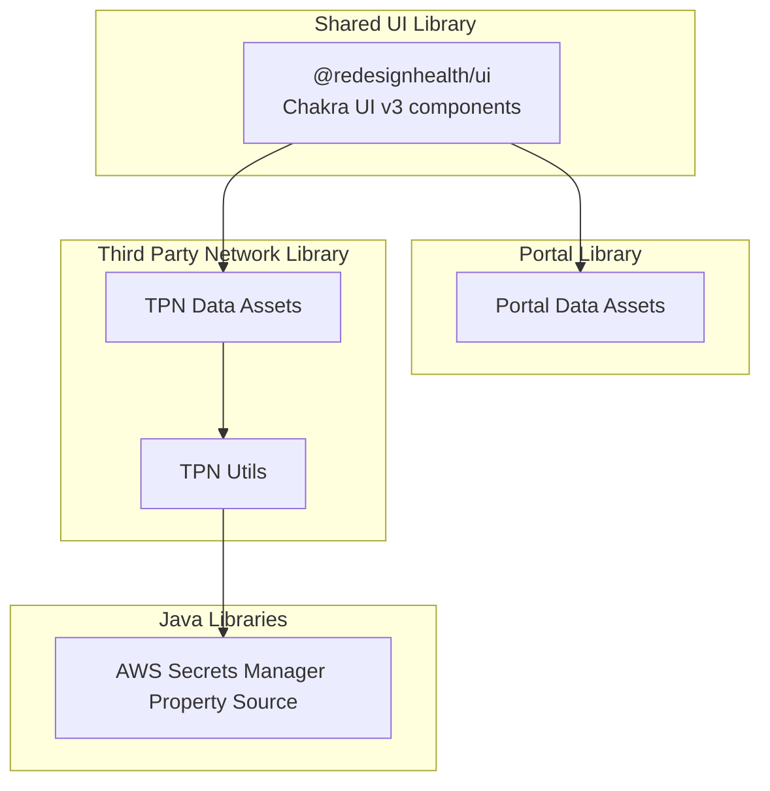
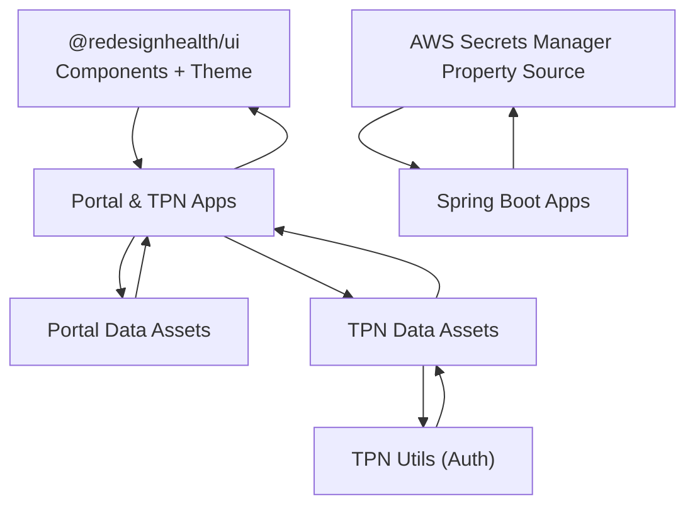
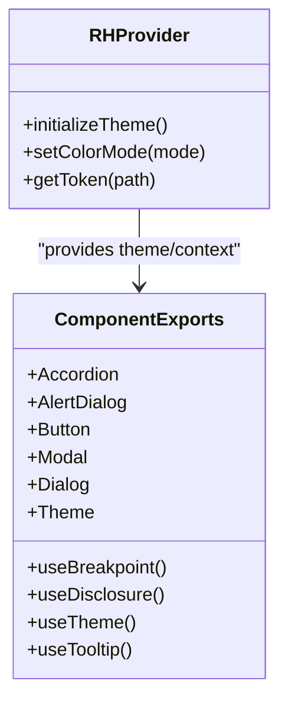
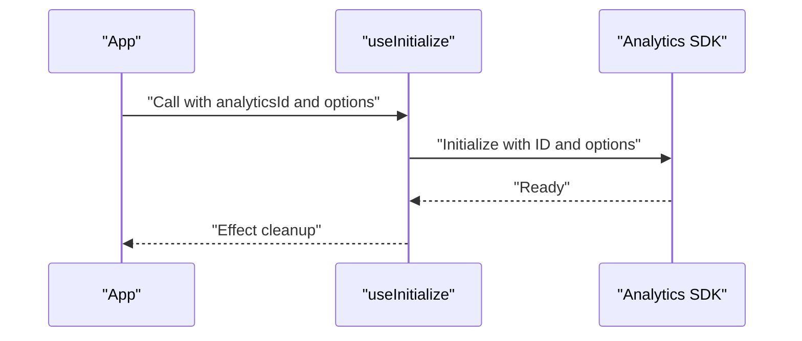
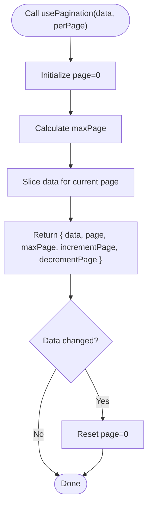
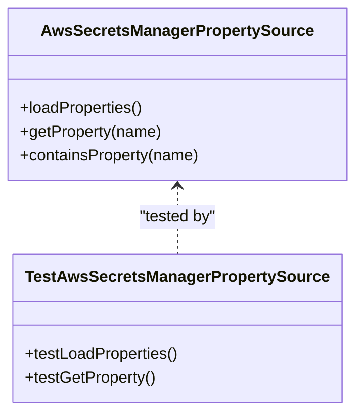
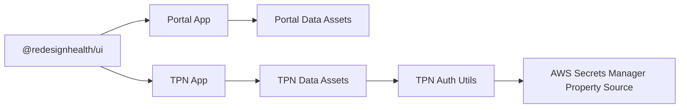

# Shared Libraries

<cite>
**Referenced Files in This Document**
- [package.json](file://libs/shared/ui/package.json)
- [MIGRATION.md](file://libs/shared/ui/MIGRATION.md)
- [index.ts](file://libs/shared/ui/src/index.ts)
- [hooks.ts](file://libs/shared/analytics/src/lib/hooks.ts)
- [use-pagination.tsx](file://libs/shared/hooks/src/lib/use-pagination/use-pagination.tsx)
- [company-api-types package.json](file://libs/company-api-types/package.json)
- [portal data-assets index.ts](file://libs/portal/data-assets/src/index.ts)
- [third-party-network data-assets index.ts](file://libs/third-party-network/data-assets/src/index.ts)
- [authentication.ts](file://libs/third-party-network/utils/src/lib/authentication.ts)
- [AwsSecretsManagerPropertySource.java](file://libs/shared-java/data-access-aws-secrets-manager-property-source/src/main/java/com/redesignhealth/property/AwsSecretsManagerPropertySource.java)
- [AwsSecretsManagerPropertySourceTest.java](file://libs/shared-java/data-access-aws-secrets-manager-property-source/src/test/com/redesignhealth/property/AwsSecretsManagerPropertySourceTest.java)
</cite>

## Table of Contents
1. [Introduction](#introduction)
2. [Project Structure](#project-structure)
3. [Core Components](#core-components)
4. [Architecture Overview](#architecture-overview)
5. [Detailed Component Analysis](#detailed-component-analysis)
6. [Dependency Analysis](#dependency-analysis)
7. [Performance Considerations](#performance-considerations)
8. [Troubleshooting Guide](#troubleshooting-guide)
9. [Conclusion](#conclusion)
10. [Appendices](#appendices)

## Introduction
This document describes the shared libraries in the Redesign Health monorepo with a focus on:
- The Chakra UI v3 component library (@redesignhealth/ui), including component exports, theming migration, and design system integration
- The Portal data assets library providing API clients, hooks, types, and mock data for the portal application
- The Third Party Network data assets library for advisor network features
- Shared Java libraries for common functionality and integration patterns

It also covers versioning, backward compatibility, upgrade paths, and integration guidelines for consumers of these libraries.

## Project Structure
The shared libraries are organized under libs/ with distinct packages for UI, analytics, hooks, utils, and Java-based integrations. Each package is an Nx-managed project with its own package.json, TypeScript configuration, and build/testing setup.

[No sources needed since this diagram shows conceptual structure, not actual code mapping]

**Section sources**
- [index.ts:1-84](file://libs/shared/ui/src/index.ts#L1-L84)

## Core Components
This section outlines the primary exported APIs and capabilities of each shared library.

- @redesignhealth/ui (Chakra UI v3)
  - Exports a comprehensive set of UI components and hooks for building applications with Chakra UI v3
  - Includes design system primitives, layout components, form controls, overlays, and utility components
  - Provides theming via a dedicated provider and tokens system
  - See the index export list for the full catalog of re-exported modules

- Analytics Utilities
  - Provides initialization and event hooks for analytics integrations
  - Includes a hook to initialize analytics and another to watch form state for search events

- Pagination Hook
  - Implements a generic pagination utility for arrays with configurable items per page

- Company API Types
  - Defines type metadata for the company API, including versioning

- Portal Data Assets
  - Centralized index for portal-related data assets and API clients

- Third Party Network Data Assets
  - Centralized index for advisor network data assets and API clients

- Authentication Utilities (TPN)
  - Utility functions for authentication flows

- AWS Secrets Manager Property Source (Java)
  - Spring property source implementation for AWS Secrets Manager

**Section sources**
- [index.ts:1-84](file://libs/shared/ui/src/index.ts#L1-L84)
- [hooks.ts:1-61](file://libs/shared/analytics/src/lib/hooks.ts#L1-L61)
- [use-pagination.tsx:1-17](file://libs/shared/hooks/src/lib/use-pagination/use-pagination.tsx#L1-L17)
- [company-api-types package.json:1-5](file://libs/company-api-types/package.json#L1-L5)
- [portal data-assets index.ts](file://libs/portal/data-assets/src/index.ts)
- [third-party-network data-assets index.ts](file://libs/third-party-network/data-assets/src/index.ts)
- [authentication.ts](file://libs/third-party-network/utils/src/lib/authentication.ts)

## Architecture Overview
The shared libraries are designed to be consumed by multiple applications within the monorepo. The UI library acts as the foundational design system, while data assets libraries provide typed APIs and utilities for specific domains (portal and third party network). Java libraries encapsulate infrastructure integrations.

[No sources needed since this diagram shows conceptual architecture, not actual code mapping]

## Detailed Component Analysis

### @redesignhealth/ui (Chakra UI v3 Component Library)
- Purpose
  - Provide a unified set of Chakra UI v3 components and design system primitives
  - Offer a theming provider and tokens-based theme configuration
  - Support dark/light mode and responsive breakpoints

- Exported Modules
  - Components: Accordion, Alert, AlertDialog, AspectRatio, AutoComplete, Avatar, Badge, Box, Breadcrumb, Button, Card, Center, Checkbox, Circle, CloseButton, Code, Divider, Drawer, Dialog (re-exported as Modal), ErrorFallback, Flex, FormControl, Grid, HStack, Heading, Icon, IconButton, Icons, Image, Input, Link, LinkOverlay, List, Loader, Logo, Menu, Modal (compatibility), Prose, NumberInput, Radio, RH, RH Provider, RootBoundary, SectionHeader, Select, ShadowBox, SideNav, SimpleGrid, Skeleton, Slider, Spinner, Square, Stack, Stat, StatCard, Stepper, Switch, Table, Tabs, Tag, Text, TextArea, Theme, Toaster, Tooltip, VStack, VisuallyHidden, Wrap, Portal
  - Hooks: useBreakpoint, useDisclosure, useTheme, useTooltip
  - Core: Styled system utilities

- Theming and Design System
  - Uses Chakra UI v3 createSystem and defineConfig
  - Semantic tokens replace legacy design tokens
  - Color mode provider and toggle included

- Migration to Chakra UI v3
  - Prop renames (e.g., colorScheme → colorPalette, isDisabled → disabled)
  - Component changes (Modal → Dialog, Drawer parts rework, Tooltip positioning)
  - Theming updates (createSystem + defineConfig replacing extendTheme)

- Usage Patterns
  - Wrap application with the RH Provider to enable theme and color mode
  - Import individual components from the index for tree-shaking
  - Use hooks for responsive behavior and UI state management

- Integration Guidelines
  - Align prop names with v3 migration guide
  - Replace deprecated v2 props and component names
  - Leverage semantic tokens for consistent design

- Versioning and Upgrade Paths
  - Follow the migration guide for breaking changes
  - Maintain compatibility shims (e.g., Modal re-export for Dialog)
  - Increment major versions when introducing breaking changes

**Diagram sources**
- [index.ts:1-84](file://libs/shared/ui/src/index.ts#L1-L84)
- [MIGRATION.md:1-34](file://libs/shared/ui/MIGRATION.md#L1-L34)

**Section sources**
- [index.ts:1-84](file://libs/shared/ui/src/index.ts#L1-L84)
- [MIGRATION.md:1-34](file://libs/shared/ui/MIGRATION.md#L1-L34)
- [package.json](file://libs/shared/ui/package.json)

### Analytics Utilities
- Purpose
  - Provide hooks to initialize analytics and track search events from forms

- APIs
  - useInitialize(analyticsId, options): Initialize analytics with optional automatic page view behavior
  - useWatchSearchEvent(watch, filterNames): Subscribe to form state changes and emit search events

- Usage Patterns
  - Call useInitialize in the application entry point with a configured analytics ID
  - Use useWatchSearchEvent with react-hook-form watch to capture search/filter interactions

- Integration Guidelines
  - Ensure analyticsId is provided; otherwise, the hook throws an error
  - Unsubscribe watchers appropriately to avoid memory leaks

**Diagram sources**
- [hooks.ts:20-37](file://libs/shared/analytics/src/lib/hooks.ts#L20-L37)

**Section sources**
- [hooks.ts:1-61](file://libs/shared/analytics/src/lib/hooks.ts#L1-L61)

### Pagination Hook
- Purpose
  - Paginate arrays with a simple, reusable hook

- API
  - usePagination(data, perPage?): Returns current page, max page, and navigation functions

- Usage Patterns
  - Pass an array and desired items per page
  - Reset to the first page when data changes

- Integration Guidelines
  - Use with lists, tables, or infinite scroll patterns
  - Combine with virtualization for large datasets

**Diagram sources**
- [use-pagination.tsx:3-16](file://libs/shared/hooks/src/lib/use-pagination/use-pagination.tsx#L3-L16)

**Section sources**
- [use-pagination.tsx:1-17](file://libs/shared/hooks/src/lib/use-pagination/use-pagination.tsx#L1-L17)

### Portal Data Assets Library
- Purpose
  - Provide centralized access to portal-specific API clients, types, and mock data

- Index
  - Acts as the single entry point for portal data assets

- Usage Patterns
  - Import from the index to access domain-specific clients and utilities
  - Use alongside @redesignhealth/ui for consistent UI and theming

- Integration Guidelines
  - Keep client configurations and types in sync with backend contracts
  - Maintain mock data for local development and testing

**Section sources**
- [portal data-assets index.ts](file://libs/portal/data-assets/src/index.ts)

### Third Party Network Data Assets Library
- Purpose
  - Provide advisor network features and related data assets

- Index
  - Centralized entry point for TPN data assets

- Usage Patterns
  - Integrate with authentication utilities for secure advisor features
  - Use alongside @redesignhealth/ui for consistent UX

- Integration Guidelines
  - Align API clients with backend contracts
  - Maintain separation between data assets and UI components

**Section sources**
- [third-party-network data-assets index.ts](file://libs/third-party-network/data-assets/src/index.ts)

### Authentication Utilities (TPN)
- Purpose
  - Provide authentication-related utilities for the Third Party Network

- Usage Patterns
  - Use for login flows, session management, and protected routes

- Integration Guidelines
  - Pair with the authentication feature module for complete flows
  - Ensure secure storage and transmission of credentials

**Section sources**
- [authentication.ts](file://libs/third-party-network/utils/src/lib/authentication.ts)

### Company API Types
- Purpose
  - Define type metadata for the company API

- Versioning
  - Versioned package.json indicates major/minor/patch releases

- Integration Guidelines
  - Consume in applications requiring type-safe interactions with the company API
  - Keep versions aligned with backend deployments

**Section sources**
- [company-api-types package.json:1-5](file://libs/company-api-types/package.json#L1-L5)

### AWS Secrets Manager Property Source (Java)
- Purpose
  - Provide a Spring PropertySource backed by AWS Secrets Manager

- Implementation
  - Loads secrets as application properties
  - Supports unit tests for validation

- Usage Patterns
  - Configure in Spring Boot applications to externalize secrets
  - Use standard @Value injection for secret values

- Integration Guidelines
  - Ensure IAM permissions for Secrets Manager access
  - Manage secret rotation and caching behavior

**Diagram sources**
- [AwsSecretsManagerPropertySource.java](file://libs/shared-java/data-access-aws-secrets-manager-property-source/src/main/java/com/redesignhealth/property/AwsSecretsManagerPropertySource.java)
- [AwsSecretsManagerPropertySourceTest.java](file://libs/shared-java/data-access-aws-secrets-manager-property-source/src/test/com/redesignhealth/property/AwsSecretsManagerPropertySourceTest.java)

**Section sources**
- [AwsSecretsManagerPropertySource.java](file://libs/shared-java/data-access-aws-secrets-manager-property-source/src/main/java/com/redesignhealth/property/AwsSecretsManagerPropertySource.java)
- [AwsSecretsManagerPropertySourceTest.java](file://libs/shared-java/data-access-aws-secrets-manager-property-source/src/test/com/redesignhealth/property/AwsSecretsManagerPropertySourceTest.java)

## Dependency Analysis
- UI Library Dependencies
  - Consumed by Portal and Third Party Network applications
  - Provides theme and component exports used across apps

- Data Assets Libraries
  - Depend on UI library for consistent styling
  - Provide domain-specific clients and utilities

- Java Library
  - Used by Spring Boot applications for secret management

[No sources needed since this diagram shows conceptual dependencies, not actual code mapping]

## Performance Considerations
- Tree Shaking
  - Prefer importing from the index to leverage selective exports
  - Avoid wildcard re-exports in application code to minimize bundle size

- Pagination
  - Use perPage wisely to balance rendering performance and UX
  - Consider virtualization for large lists

- Theming
  - Centralize theme configuration to reduce re-renders
  - Use semantic tokens for consistent and efficient styling

[No sources needed since this section provides general guidance]

## Troubleshooting Guide
- Chakra UI v3 Migration
  - Update prop names according to the migration guide
  - Replace Modal with Dialog and adjust Drawer parts
  - Update theming to use createSystem and defineConfig

- Analytics Initialization
  - Ensure analyticsId is provided; otherwise, initialization will fail
  - Verify automatic page view options match application needs

- Pagination Edge Cases
  - Confirm perPage is greater than zero
  - Handle empty data arrays gracefully

- Java Property Source
  - Verify IAM permissions for Secrets Manager access
  - Check secret ARNs and names for typos

**Section sources**
- [MIGRATION.md:1-34](file://libs/shared/ui/MIGRATION.md#L1-L34)
- [hooks.ts:20-37](file://libs/shared/analytics/src/lib/hooks.ts#L20-L37)
- [use-pagination.tsx:3-16](file://libs/shared/hooks/src/lib/use-pagination/use-pagination.tsx#L3-L16)
- [AwsSecretsManagerPropertySource.java](file://libs/shared-java/data-access-aws-secrets-manager-property-source/src/main/java/com/redesignhealth/property/AwsSecretsManagerPropertySource.java)

## Conclusion
The shared libraries in the Redesign Health monorepo provide a cohesive foundation for building applications with consistent UI, reliable data access, and secure integrations. The @redesignhealth/ui library modernizes the design system with Chakra UI v3, while the Portal and Third Party Network libraries offer domain-specific assets and utilities. The Java library ensures secure secret management. Following the migration and integration guidelines will help maintain backward compatibility and smooth upgrades.

[No sources needed since this section summarizes without analyzing specific files]

## Appendices
- Versioning Strategy
  - Major versions indicate breaking changes (e.g., Chakra UI v3 migration)
  - Minor versions add features and improvements
  - Patch versions fix bugs and regressions

- Backward Compatibility
  - Maintain compatibility shims (e.g., Modal re-export for Dialog)
  - Provide deprecation notices for removed features
  - Keep migration guides updated with breaking changes

- Upgrade Paths
  - Review migration guides before upgrading major versions
  - Test components and theming after applying changes
  - Validate analytics and authentication flows post-upgrade

[No sources needed since this section provides general guidance]