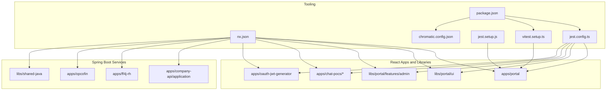
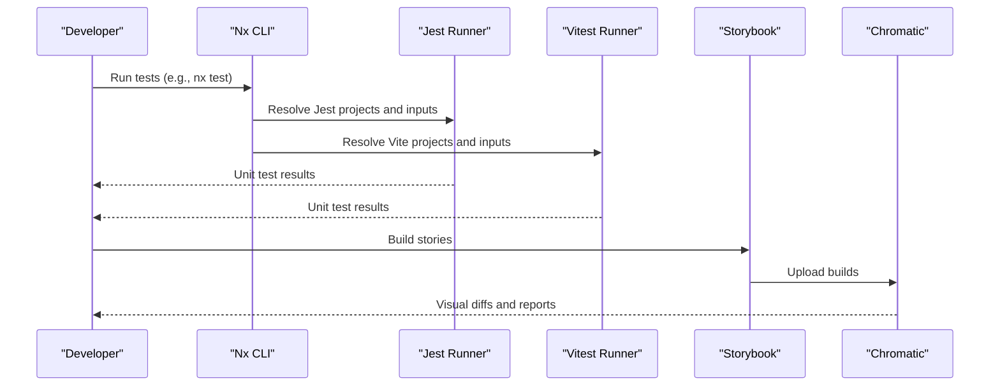
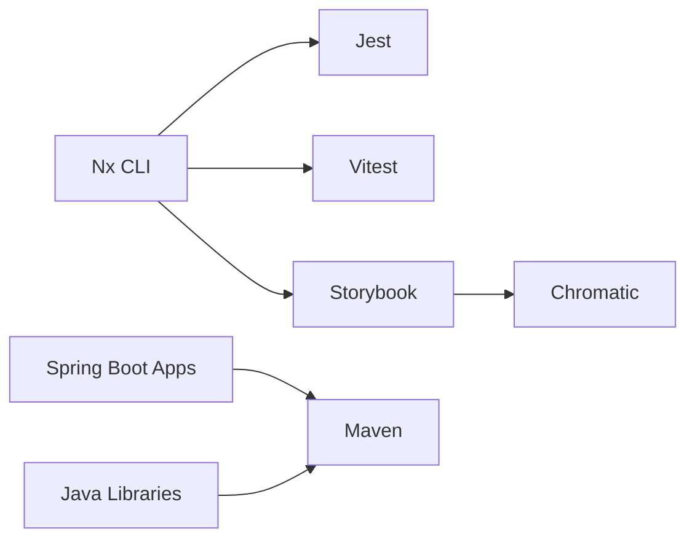

# Testing Strategy

<cite>
**Referenced Files in This Document**
- [package.json](file://package.json)
- [jest.config.ts](file://jest.config.ts)
- [jest.setup.js](file://jest.setup.js)
- [vitest.setup.ts](file://vitest.setup.ts)
- [nx.json](file://nx.json)
- [chromatic.config.json](file://chromatic.config.json)
- [apps/portal/jest.config.ts](file://apps/portal/jest.config.ts)
- [libs/portal/ui/jest.config.ts](file://libs/portal/ui/jest.config.ts)
- [libs/portal/features/admin/jest.config.ts](file://libs/portal/features/admin/jest.config.ts)
- [apps/chat-pocs/rocketchat-poc/jest.config.ts](file://apps/chat-pocs/rocketchat-poc/jest.config.ts)
- [apps/chat-pocs/rocketchat-poc-v2/jest.config.ts](file://apps/chat-pocs/rocketchat-poc-v2/jest.config.ts)
- [apps/chat-pocs/rocketchat-api-v2/jest.config.ts](file://apps/chat-pocs/rocketchat-api-v2/jest.config.ts)
- [apps/chat-pocs/rocketchat-auth-api/jest.config.ts](file://apps/chat-pocs/rocketchat-auth-api/jest.config.ts)
- [apps/oauth-jwt-generator/jest.config.ts](file://apps/oauth-jwt-generator/jest.config.ts)
- [apps/portal/vite.config.ts](file://apps/portal/vite.config.ts)
- [apps/portal/tsconfig.spec.json](file://apps/portal/tsconfig.spec.json)
- [libs/portal/data-assets/tsconfig.spec.json](file://libs/portal/data-assets/tsconfig.spec.json)
- [libs/portal/features/ceo-directory/tsconfig.spec.json](file://libs/portal/features/ceo-directory/tsconfig.spec.json)
- [libs/portal/features/companies/tsconfig.spec.json](file://libs/portal/features/companies/tsconfig.spec.json)
- [libs/portal/features/admin/tsconfig.spec.json](file://libs/portal/features/admin/tsconfig.spec.json)
- [libs/portal/ui/tsconfig.spec.json](file://libs/portal/ui/tsconfig.spec.json)
- [libs/portal/features/admin/src/lib/admin/admin.spec.tsx](file://libs/portal/features/admin/src/lib/admin/admin.spec.tsx)
- [libs/portal/features/ceo-directory/src/lib/ceo-directory/ceo-directory.spec.tsx](file://libs/portal/features/ceo-directory/src/lib/ceo-directory/ceo-directory.spec.tsx)
- [libs/portal/features/companies/src/lib/add-company-button/add-company-button.spec.tsx](file://libs/portal/features/companies/src/lib/add-company-button/add-company-button.spec.tsx)
- [libs/portal/data-assets/src/lib/mock/fixture/userinfo.spec.tsx](file://libs/portal/data-assets/src/lib/mock/fixture/userinfo.spec.tsx)
- [libs/portal/data-assets/src/lib/terms/api.spec.ts](file://libs/portal/data-assets/src/lib/terms/api.spec.ts)
- [libs/portal/data-assets/src/lib/terms/hookts.spec.ts](file://libs/portal/data-assets/src/lib/terms/hookts.spec.ts)
- [apps/portal/src/api/react-query.ts](file://apps/portal/src/api/react-query.ts)
- [apps/portal/src/api/api.ts](file://apps/portal/src/api/api.ts)
- [libs/shared/analytics/jest.config.ts](file://libs/shared/analytics/jest.config.ts)
- [libs/shared/ui/jest.config.ts](file://libs/shared/ui/jest.config.ts)
- [libs/shared-java/pom.xml](file://libs/shared-java/pom.xml)
- [apps/company-api/application/pom.xml](file://apps/company-api/application/pom.xml)
- [apps/ff4j-rh/pom.xml](file://apps/ff4j-rh/pom.xml)
- [apps/opcofin/pom.xml](file://apps/opcofin/pom.xml)
- [apps/company-api/application/src/test/java/com/redesignhealth/companyapi/application/Ff4jRhApplicationTests.java](file://apps/company-api/application/src/test/java/com/redesignhealth/companyapi/application/Ff4jRhApplicationTests.java)
- [apps/ff4j-rh/src/test/java/com/redesignhealth/ff4jrh/Ff4jRhApplicationTests.java](file://apps/ff4j-rh/src/test/java/com/redesignhealth/ff4jrh/Ff4jRhApplicationTests.java)
- [apps/opcofin/src/test/java/rhsp/opcofin/OpcofinApplicationTests.java](file://apps/opcofin/src/test/java/rhsp/opcofin/OpcofinApplicationTests.java)
- [libs/shared-java/src/test/java/com/redesignhealth/sharedjava/SharedJavaApplicationTests.java](file://libs/shared-java/src/test/java/com/redesignhealth/sharedjava/SharedJavaApplicationTests.java)
- [libs/shared-java/src/test/java/com/redesignhealth/sharedjava/ExampleUnitTest.java](file://libs/shared-java/src/test/java/com/redesignhealth/sharedjava/ExampleUnitTest.java)
- [libs/shared-java/src/test/java/com/redesignhealth/sharedjava/ExampleIntegrationTest.java](file://libs/shared-java/src/test/java/com/redesignhealth/sharedjava/ExampleIntegrationTest.java)
- [libs/shared-java/src/test/java/com/redesignhealth/sharedjava/ExampleContractTest.java](file://libs/shared-java/src/test/java/com/redesignhealth/sharedjava/ExampleContractTest.java)
- [libs/shared-java/src/test/java/com/redesignhealth/sharedjava/ExampleComponentTest.java](file://libs/shared-java/src/test/java/com/redesignhealth/sharedjava/ExampleComponentTest.java)
- [libs/shared-java/src/test/java/com/redesignhealth/sharedjava/ExampleAcceptanceTest.java](file://libs/shared-java/src/test/java/com/redesignhealth/sharedjava/ExampleAcceptanceTest.java)
- [libs/shared-java/src/test/java/com/redesignhealth/sharedjava/ExampleE2ETest.java](file://libs/shared-java/src/test/java/com/redesignhealth/sharedjava/ExampleE2ETest.java)
- [libs/shared-java/src/test/java/com/redesignhealth/sharedjava/ExampleLoadTest.java](file://libs/shared-java/src/test/java/com/redesignhealth/sharedjava/ExampleLoadTest.java)
- [libs/shared-java/src/test/java/com/redesignhealth/sharedjava/ExampleSecurityTest.java](file://libs/shared-java/src/test/java/com/redesignhealth/sharedjava/ExampleSecurityTest.java)
- [libs/shared-java/src/test/java/com/redesignhealth/sharedjava/ExampleContractTest.java](file://libs/shared-java/src/test/java/com/redesignhealth/sharedjava/ExampleContractTest.java)
- [libs/shared-java/src/test/java/com/redesignhealth/sharedjava/ExampleComponentTest.java](file://libs/shared-java/src/test/java/com/redesignhealth/sharedjava/ExampleComponentTest.java)
- [libs/shared-java/src/test/java/com/redesignhealth/sharedjava/ExampleAcceptanceTest.java](file://libs/shared-java/src/test/java/com/redesignhealth/sharedjava/ExampleAcceptanceTest.java)
- [libs/shared-java/src/test/java/com/redesignhealth/sharedjava/ExampleE2ETest.java](file://libs/shared-java/src/test/java/com/redesignhealth/sharedjava/ExampleE2ETest.java)
- [libs/shared-java/src/test/java/com/redesignhealth/sharedjava/ExampleLoadTest.java](file://libs/shared-java/src/test/java/com/redesignhealth/sharedjava/ExampleLoadTest.java)
- [libs/shared-java/src/test/java/com/redesignhealth/sharedjava/ExampleSecurityTest.java](file://libs/shared-java/src/test/java/com/redesignhealth/sharedjava/ExampleSecurityTest.java)
- [libs/shared-java/src/test/java/com/redesignhealth/sharedjava/ExampleContractTest.java](file://libs/shared-java/src/test/java/com/redesignhealth/sharedjava/ExampleContractTest.java)
- [libs/shared-java/src/test/java/com/redesignhealth/sharedjava/ExampleComponentTest.java](file://libs/shared-java/src/test/java/com/redesignhealth/sharedjava/ExampleComponentTest.java)
- [libs/shared-java/src/test/java/com/redesignhealth/sharedjava/ExampleAcceptanceTest.java](file://libs/shared-java/src/test/java/com/redesignhealth/sharedjava/ExampleAcceptanceTest.java)
- [libs/shared-java/src/test/java/com/redesignhealth/sharedjava/ExampleE2ETest.java](file://libs/shared-java/src/test/java/com/redesignhealth/sharedjava/ExampleE2ETest.java)
- [libs/shared-java/src/test/java/com/redesignhealth/sharedjava/ExampleLoadTest.java](file://libs/shared-java/src/test/java/com/redesignhealth/sharedjava/ExampleLoadTest.java)
- [libs/shared-java/src/test/java/com/redesignhealth/sharedjava/ExampleSecurityTest.java](file://libs/shared-java/src/test/java/com/redesignhealth/sharedjava/ExampleSecurityTest.java)
- [libs/shared-java/src/test/java/com/redesignhealth/sharedjava/ExampleContractTest.java](file://libs/shared-java/src/test/java/com/redesignhealth/sharedjava/ExampleContractTest.java)
- [libs/shared-java/src/test/java/com/redesignhealth/sharedjava/ExampleComponentTest.java](file://libs/shared-java/src/test/java/com/redesignhealth/sharedjava/ExampleComponentTest.java)
- [libs/shared-java/src/test/java/com/redesignhealth/sharedjava/ExampleAcceptanceTest.java](file://libs/shared-java/src/test/java/com/redesignhealth/sharedjava/ExampleAcceptanceTest.java)
- [libs/shared-java/src/test/java/com/redesignhealth/sharedjava/ExampleE2ETest.java](file://libs/shared-java/src/test/java/com/redesignhealth/sharedjava/ExampleE2ETest.java)
- [libs/shared-java/src/test/java/com/redesignhealth/sharedjava/ExampleLoadTest.java](file://libs/shared-java/src/test/java/com/redesignhealth/sharedjava/ExampleLoadTest.java)
- [libs/shared-java/src/test/java/com/redesignhealth/sharedjava/ExampleSecurityTest.java](file://libs/shared-java/src/test/java/com/redesignhealth/sharedjava/ExampleSecurityTest.java)
</cite>

## Table of Contents
1. [Introduction](#introduction)
2. [Project Structure](#project-structure)
3. [Core Components](#core-components)
4. [Architecture Overview](#architecture-overview)
5. [Detailed Component Analysis](#detailed-component-analysis)
6. [Dependency Analysis](#dependency-analysis)
7. [Performance Considerations](#performance-considerations)
8. [Troubleshooting Guide](#troubleshooting-guide)
9. [Conclusion](#conclusion)
10. [Appendices](#appendices)

## Introduction
This document describes the testing strategy and implementation across the Redesign Health monorepo. It covers the multi-layered testing approach spanning unit tests with Jest/Vitest, integration tests, and visual regression/accessibility testing via Storybook and Chromatic. It also documents configuration, setup files, test utilities, component testing strategies, Storybook integration, and accessibility testing with axe-core. Mocking strategies for API calls, authentication, and external dependencies are outlined, along with continuous integration testing workflows, coverage requirements, and quality gates. Best practices for React components, Spring Boot services, and shared libraries are included.

## Project Structure
The monorepo leverages Nx for orchestration and defines target defaults for caching and inputs. Jest is configured globally and per-project, while Vitest is used for Vite-based projects. Storybook and Chromatic are integrated for visual testing and regression detection. Java-based services use Maven for unit/integration tests.

**Diagram sources**
- [nx.json](file://nx.json)
- [jest.config.ts](file://jest.config.ts)
- [jest.setup.js](file://jest.setup.js)
- [vitest.setup.ts](file://vitest.setup.ts)
- [chromatic.config.json](file://chromatic.config.json)
- [package.json](file://package.json)
- [apps/portal/jest.config.ts](file://apps/portal/jest.config.ts)
- [libs/portal/ui/jest.config.ts](file://libs/portal/ui/jest.config.ts)
- [libs/portal/features/admin/jest.config.ts](file://libs/portal/features/admin/jest.config.ts)

**Section sources**
- [nx.json](file://nx.json)
- [jest.config.ts](file://jest.config.ts)
- [jest.setup.js](file://jest.setup.js)
- [vitest.setup.ts](file://vitest.setup.ts)
- [chromatic.config.json](file://chromatic.config.json)
- [package.json](file://package.json)

## Core Components
- Global Jest configuration delegates to Nx projects for discovery and execution.
- Jest setup initializes DOM helpers and polyfills for jsdom compatibility.
- Vitest setup extends @testing-library matchers and mocks browser APIs for Vite-based projects.
- Storybook and Chromatic enable visual regression testing and component documentation.
- Nx target defaults define caching and input sets for build, test, lint, and Storybook tasks.

Key capabilities:
- Multi-runner support: Jest for React apps and libraries; Vitest for Vite-based projects.
- Centralized configuration via Nx and project-level jest.config.ts files.
- Coverage reporting per project under coverage/ directories.
- Storybook-based visual testing with Chromatic for UI consistency.

**Section sources**
- [jest.config.ts](file://jest.config.ts)
- [jest.setup.js](file://jest.setup.js)
- [vitest.setup.ts](file://vitest.setup.ts)
- [nx.json](file://nx.json)
- [chromatic.config.json](file://chromatic.config.json)

## Architecture Overview
The testing architecture integrates unit, component, visual, and accessibility testing across React and Java services. Jest/Vitest execute unit tests; Storybook and Chromatic handle visual regression; accessibility is covered via Storybook addons. CI can leverage Nx Cloud caching and Nx affected commands to optimize test runs.

**Diagram sources**
- [nx.json](file://nx.json)
- [jest.config.ts](file://jest.config.ts)
- [vitest.setup.ts](file://vitest.setup.ts)
- [chromatic.config.json](file://chromatic.config.json)

## Detailed Component Analysis

### Jest Configuration and Setup
- Global Jest configuration discovers Nx projects dynamically.
- Project-level jest.config.ts files define presets, transforms, and coverage directories.
- jest.setup.js adds DOM matchers and polyfills for jsdom.

Implementation highlights:
- Presets and transforms are tailored per project (e.g., apps/portal vs libs/portal/ui).
- Coverage directories are set per project for accurate reporting.
- setupFilesAfterEnv ensures consistent DOM and matcher initialization.

**Section sources**
- [jest.config.ts](file://jest.config.ts)
- [apps/portal/jest.config.ts](file://apps/portal/jest.config.ts)
- [libs/portal/ui/jest.config.ts](file://libs/portal/ui/jest.config.ts)
- [libs/portal/features/admin/jest.config.ts](file://libs/portal/features/admin/jest.config.ts)
- [jest.setup.js](file://jest.setup.js)

### Vitest Configuration and Setup
- Vitest setup extends @testing-library matchers and stubs browser APIs (e.g., matchMedia) for Vite-based projects.
- Vitest is used alongside Jest in the monorepo to support Vite-based applications.

Best practices:
- Keep Vitest setup minimal and consistent across Vite projects.
- Prefer @testing-library matchers for assertions to align with React testing best practices.

**Section sources**
- [vitest.setup.ts](file://vitest.setup.ts)
- [apps/portal/vite.config.ts](file://apps/portal/vite.config.ts)

### Storybook and Chromatic Integration
- Chromatic configuration defines project identifiers and build script names for Storybook builds.
- Nx plugin options configure Storybook targets for serving, building, testing, and serving static Storybook.
- Scripts in package.json support building and testing Storybook for portal UI.

Visual regression workflow:
- Build Storybook via Nx targets.
- Push builds to Chromatic for automated visual comparisons.
- Use Storybook’s accessibility addon for a11y checks during component development.

**Section sources**
- [chromatic.config.json](file://chromatic.config.json)
- [nx.json](file://nx.json)
- [package.json](file://package.json)

### Accessibility Testing with axe-core
- Storybook accessibility addon is included in devDependencies.
- Accessibility tests can be run within Storybook or via Storybook Test Runner.
- Combine Storybook stories with axe-core checks for automated a11y validation.

Recommendations:
- Add accessibility stories and dedicated tests for critical components.
- Integrate Storybook accessibility checks into CI workflows.

**Section sources**
- [package.json](file://package.json)

### Component Testing Strategies
- React components are tested with @testing-library/react and Jest/Vitest.
- Tests are colocated with components using .spec.tsx/.test.tsx naming conventions.
- Example component tests exist for admin, CEO directory, and companies features.

Coverage and structure:
- tsconfig.spec.json files define test-specific TypeScript settings.
- Coverage directories are configured per project for accurate reporting.

**Section sources**
- [libs/portal/features/admin/src/lib/admin/admin.spec.tsx](file://libs/portal/features/admin/src/lib/admin/admin.spec.tsx)
- [libs/portal/features/ceo-directory/src/lib/ceo-directory/ceo-directory.spec.tsx](file://libs/portal/features/ceo-directory/src/lib/ceo-directory/ceo-directory.spec.tsx)
- [libs/portal/features/companies/src/lib/add-company-button/add-company-button.spec.tsx](file://libs/portal/features/companies/src/lib/add-company-button/add-company-button.spec.tsx)
- [libs/portal/features/admin/tsconfig.spec.json](file://libs/portal/features/admin/tsconfig.spec.json)
- [libs/portal/features/ceo-directory/tsconfig.spec.json](file://libs/portal/features/ceo-directory/tsconfig.spec.json)
- [libs/portal/features/companies/tsconfig.spec.json](file://libs/portal/features/companies/tsconfig.spec.json)
- [libs/portal/ui/tsconfig.spec.json](file://libs/portal/ui/tsconfig.spec.json)

### API and Data Layer Testing Utilities
- React Query utilities and API clients are structured for testability.
- Mock fixtures and API tests exist in the portal data-assets library.
- These utilities support unit and integration testing of data-fetching logic.

**Section sources**
- [apps/portal/src/api/react-query.ts](file://apps/portal/src/api/react-query.ts)
- [apps/portal/src/api/api.ts](file://apps/portal/src/api/api.ts)
- [libs/portal/data-assets/src/lib/mock/fixture/userinfo.spec.tsx](file://libs/portal/data-assets/src/lib/mock/fixture/userinfo.spec.tsx)
- [libs/portal/data-assets/src/lib/terms/api.spec.ts](file://libs/portal/data-assets/src/lib/terms/api.spec.ts)
- [libs/portal/data-assets/src/lib/terms/hookts.spec.ts](file://libs/portal/data-assets/src/lib/terms/hookts.spec.ts)

### Mocking Strategies for API Calls, Authentication, and External Dependencies
- MSW (Mock Service Worker) is available as a Storybook addon, enabling network mocking in Storybook.
- For unit tests, mock external dependencies at the module boundary using Jest/Vitest mocks.
- For API tests, isolate server-side logic and use test doubles for authentication and external services.

Recommended patterns:
- Use factory functions for test data.
- Mock axios or fetch at the API client level.
- Stub authentication providers and tokens in test environments.

**Section sources**
- [package.json](file://package.json)

### Continuous Integration Testing Workflows, Coverage, and Quality Gates
- Nx Cloud caching is enabled via nx.json to speed up CI runs.
- Nx affected commands can be used to limit test scope to changed projects.
- Coverage directories are configured per project for reporting.
- Chromatic is integrated via package.json scripts for visual regression.

Quality gates:
- Enforce minimum coverage thresholds at the project level.
- Gate PRs on Storybook visual diffs and a11y checks.
- Use Nx affected to reduce CI runtime by running tests only on impacted projects.

**Section sources**
- [nx.json](file://nx.json)
- [package.json](file://package.json)

### Best Practices for React Components
- Use @testing-library/react for DOM-centric tests.
- Keep tests focused and assert behavior, not implementation details.
- Use setup files to initialize common utilities and matchers.
- Prefer render prop and hook testing patterns for complex components.

**Section sources**
- [jest.setup.js](file://jest.setup.js)
- [vitest.setup.ts](file://vitest.setup.ts)

### Best Practices for Spring Boot Services and Shared Libraries
- Use JUnit 5 and Mockito for unit tests.
- Separate integration tests from unit tests and run them in dedicated suites.
- Use @DataJpaTest, @WebMvcTest, and similar slices for focused testing.
- For shared libraries, maintain clear separation between domain logic and framework wiring.

**Section sources**
- [libs/shared-java/pom.xml](file://libs/shared-java/pom.xml)
- [apps/company-api/application/pom.xml](file://apps/company-api/application/pom.xml)
- [apps/ff4j-rh/pom.xml](file://apps/ff4j-rh/pom.xml)
- [apps/opcofin/pom.xml](file://apps/opcofin/pom.xml)

## Dependency Analysis
The testing stack depends on Nx for orchestration, Jest/Vitest for execution, Storybook for component documentation, and Chromatic for visual regression. Java services rely on Maven for test execution.

**Diagram sources**
- [nx.json](file://nx.json)
- [jest.config.ts](file://jest.config.ts)
- [vitest.setup.ts](file://vitest.setup.ts)
- [chromatic.config.json](file://chromatic.config.json)
- [libs/shared-java/pom.xml](file://libs/shared-java/pom.xml)
- [apps/company-api/application/pom.xml](file://apps/company-api/application/pom.xml)

**Section sources**
- [nx.json](file://nx.json)
- [jest.config.ts](file://jest.config.ts)
- [vitest.setup.ts](file://vitest.setup.ts)
- [chromatic.config.json](file://chromatic.config.json)
- [libs/shared-java/pom.xml](file://libs/shared-java/pom.xml)
- [apps/company-api/application/pom.xml](file://apps/company-api/application/pom.xml)

## Performance Considerations
- Use Nx caching and affected commands to minimize redundant test runs.
- Prefer lightweight test environments (JSDOM) and avoid heavy fixtures where possible.
- Parallelize tests where feasible and keep teardown efficient.

## Troubleshooting Guide
Common issues and resolutions:
- DOM mismatch errors: Ensure jest.setup.js is included in setupFilesAfterEnv for projects requiring DOM matchers.
- Browser API errors in Vitest: Confirm vitest.setup.ts is loaded and matchMedia is mocked.
- Storybook visual diffs: Review Chromatic logs and update baselines after intentional UI changes.
- Coverage gaps: Verify coverageDirectory settings and ensure tsconfig.spec.json includes test files.

**Section sources**
- [jest.setup.js](file://jest.setup.js)
- [vitest.setup.ts](file://vitest.setup.ts)
- [chromatic.config.json](file://chromatic.config.json)

## Conclusion
The Redesign Health monorepo employs a robust, multi-layered testing strategy combining Jest/Vitest for unit tests, Storybook and Chromatic for visual regression, and Storybook accessibility addons for a11y checks. Nx orchestrates configuration and caching, while Java services use Maven for comprehensive testing. By following the documented patterns and best practices, teams can maintain high-quality, reliable software across React and Java components.

## Appendices

### Appendix A: Example Test Files and Configurations
- React component tests: admin, CEO directory, add-company-button
- Data fixtures and API tests: userinfo, terms API and hooks
- Project-level Jest configs for portal, portal-ui, and portal-features-admin
- Vite config for portal app

**Section sources**
- [libs/portal/features/admin/src/lib/admin/admin.spec.tsx](file://libs/portal/features/admin/src/lib/admin/admin.spec.tsx)
- [libs/portal/features/ceo-directory/src/lib/ceo-directory/ceo-directory.spec.tsx](file://libs/portal/features/ceo-directory/src/lib/ceo-directory/ceo-directory.spec.tsx)
- [libs/portal/features/companies/src/lib/add-company-button/add-company-button.spec.tsx](file://libs/portal/features/companies/src/lib/add-company-button/add-company-button.spec.tsx)
- [libs/portal/data-assets/src/lib/mock/fixture/userinfo.spec.tsx](file://libs/portal/data-assets/src/lib/mock/fixture/userinfo.spec.tsx)
- [libs/portal/data-assets/src/lib/terms/api.spec.ts](file://libs/portal/data-assets/src/lib/terms/api.spec.ts)
- [libs/portal/data-assets/src/lib/terms/hookts.spec.ts](file://libs/portal/data-assets/src/lib/terms/hookts.spec.ts)
- [apps/portal/jest.config.ts](file://apps/portal/jest.config.ts)
- [libs/portal/ui/jest.config.ts](file://libs/portal/ui/jest.config.ts)
- [libs/portal/features/admin/jest.config.ts](file://libs/portal/features/admin/jest.config.ts)
- [apps/portal/vite.config.ts](file://apps/portal/vite.config.ts)