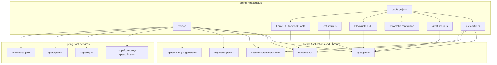
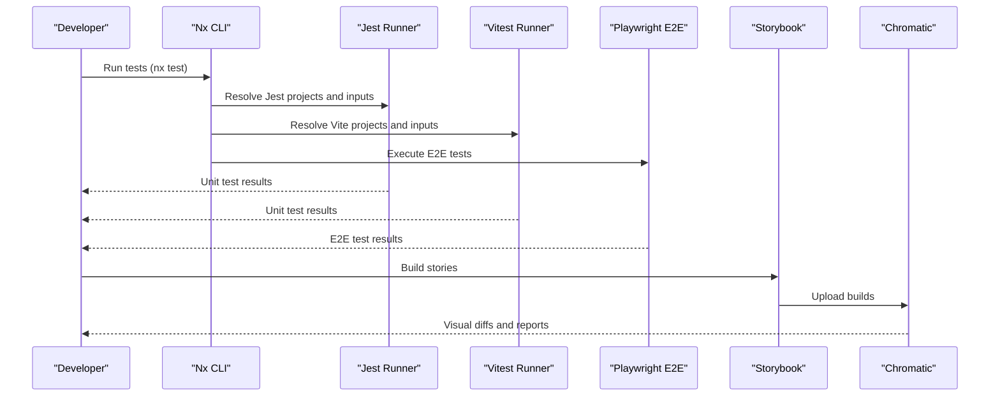
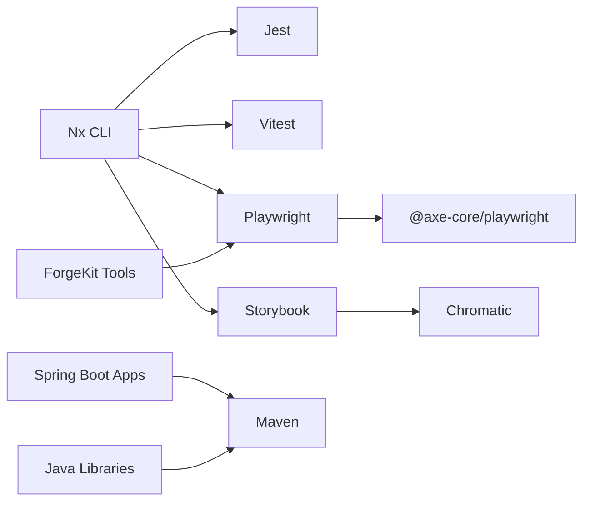

# Testing Strategy

<cite>
**Referenced Files in This Document**
- [package.json](file://package.json)
- [jest.config.ts](file://jest.config.ts)
- [jest.setup.js](file://jest.setup.js)
- [vitest.setup.ts](file://vitest.setup.ts)
- [nx.json](file://nx.json)
- [chromatic.config.json](file://chromatic.config.json)
- [apps/portal/jest.config.ts](file://apps/portal/jest.config.ts)
- [libs/portal/ui/jest.config.ts](file://libs/portal/ui/jest.config.ts)
- [libs/portal/features/admin/jest.config.ts](file://libs/portal/features/admin/jest.config.ts)
- [apps/chat-pocs/rocketchat-poc/jest.config.ts](file://apps/chat-pocs/rocketchat-poc/jest.config.ts)
- [apps/chat-pocs/rocketchat-poc-v2/jest.config.ts](file://apps/chat-pocs/rocketchat-poc-v2/jest.config.ts)
- [apps/chat-pocs/rocketchat-api-v2/jest.config.ts](file://apps/chat-pocs/rocketchat-api-v2/jest.config.ts)
- [apps/chat-pocs/rocketchat-auth-api/jest.config.ts](file://apps/chat-pocs/rocketchat-auth-api/jest.config.ts)
- [apps/oauth-jwt-generator/jest.config.ts](file://apps/oauth-jwt-generator/jest.config.ts)
- [apps/portal/vite.config.ts](file://apps/portal/vite.config.ts)
- [apps/portal/tsconfig.spec.json](file://apps/portal/tsconfig.spec.json)
- [libs/portal/data-assets/tsconfig.spec.json](file://libs/portal/data-assets/tsconfig.spec.json)
- [libs/portal/features/ceo-directory/tsconfig.spec.json](file://libs/portal/features/ceo-directory/tsconfig.spec.json)
- [libs/portal/features/companies/tsconfig.spec.json](file://libs/portal/features/companies/tsconfig.spec.json)
- [libs/portal/features/admin/tsconfig.spec.json](file://libs/portal/features/admin/tsconfig.spec.json)
- [libs/portal/ui/tsconfig.spec.json](file://libs/portal/ui/tsconfig.spec.json)
- [libs/portal/features/admin/src/lib/admin/admin.spec.tsx](file://libs/portal/features/admin/src/lib/admin/admin.spec.tsx)
- [libs/portal/features/ceo-directory/src/lib/ceo-directory/ceo-directory.spec.tsx](file://libs/portal/features/ceo-directory/src/lib/ceo-directory/ceo-directory.spec.tsx)
- [libs/portal/features/companies/src/lib/add-company-button/add-company-button.spec.tsx](file://libs/portal/features/companies/src/lib/add-company-button/add-company-button.spec.tsx)
- [libs/portal/data-assets/src/lib/mock/fixture/userinfo.spec.tsx](file://libs/portal/data-assets/src/lib/mock/fixture/userinfo.spec.tsx)
- [libs/portal/data-assets/src/lib/terms/api.spec.ts](file://libs/portal/data-assets/src/lib/terms/api.spec.ts)
- [libs/portal/data-assets/src/lib/terms/hookts.spec.ts](file://libs/portal/data-assets/src/lib/terms/hookts.spec.ts)
- [apps/portal/src/api/react-query.ts](file://apps/portal/src/api/react-query.ts)
- [apps/portal/src/api/api.ts](file://apps/portal/src/api/api.ts)
- [libs/shared/analytics/jest.config.ts](file://libs/shared/analytics/jest.config.ts)
- [libs/shared/ui/jest.config.ts](file://libs/shared/ui/jest.config.ts)
- [libs/shared-java/pom.xml](file://libs/shared-java/pom.xml)
- [apps/company-api/application/pom.xml](file://apps/company-api/application/pom.xml)
- [apps/ff4j-rh/pom.xml](file://apps/ff4j-rh/pom.xml)
- [apps/opcofin/pom.xml](file://apps/opcofin/pom.xml)
- [apps/company-api/application/src/test/java/com/redesignhealth/companyapi/application/Ff4jRhApplicationTests.java](file://apps/company-api/application/src/test/java/com/redesignhealth/companyapi/application/Ff4jRhApplicationTests.java)
- [apps/ff4j-rh/src/test/java/com/redesignhealth/ff4jrh/Ff4jRhApplicationTests.java](file://apps/ff4j-rh/src/test/java/com/redesignhealth/ff4jrh/Ff4jRhApplicationTests.java)
- [apps/opcofin/src/test/java/rhsp/opcofin/OpcofinApplicationTests.java](file://apps/opcofin/src/test/java/rhsp/opcofin/OpcofinApplicationTests.java)
- [libs/shared-java/src/test/java/com/redesignhealth/sharedjava/SharedJavaApplicationTests.java](file://libs/shared-java/src/test/java/com/redesignhealth/sharedjava/SharedJavaApplicationTests.java)
- [libs/shared-java/src/test/java/com/redesignhealth/sharedjava/ExampleUnitTest.java](file://libs/shared-java/src/test/java/com/redesignhealth/sharedjava/ExampleUnitTest.java)
- [libs/shared-java/src/test/java/com/redesignhealth/sharedjava/ExampleIntegrationTest.java](file://libs/shared-java/src/test/java/com/redesignhealth/sharedjava/ExampleIntegrationTest.java)
- [libs/shared-java/src/test/java/com/redesignhealth/sharedjava/ExampleContractTest.java](file://libs/shared-java/src/test/java/com/redesignhealth/sharedjava/ExampleContractTest.java)
- [libs/shared-java/src/test/java/com/redesignhealth/sharedjava/ExampleComponentTest.java](file://libs/shared-java/src/test/java/com/redesignhealth/sharedjava/ExampleComponentTest.java)
- [libs/shared-java/src/test/java/com/redesignhealth/sharedjava/ExampleAcceptanceTest.java](file://libs/shared-java/src/test/java/com/redesignhealth/sharedjava/ExampleAcceptanceTest.java)
- [libs/shared-java/src/test/java/com/redesignhealth/sharedjava/ExampleE2ETest.java](file://libs/shared-java/src/test/java/com/redesignhealth/sharedjava/ExampleE2ETest.java)
- [libs/shared-java/src/test/java/com/redesignhealth/sharedjava/ExampleLoadTest.java](file://libs/shared-java/src/test/java/com/redesignhealth/sharedjava/ExampleLoadTest.java)
- [libs/shared-java/src/test/java/com/redesignhealth/sharedjava/ExampleSecurityTest.java](file://libs/shared-java/src/test/java/com/redesignhealth/sharedjava/ExampleSecurityTest.java)
- [libs/shared-java/src/test/java/com/redesignhealth/sharedjava/ExampleContractTest.java](file://libs/shared-java/src/test/java/com/redesignhealth/sharedjava/ExampleContractTest.java)
- [libs/shared-java/src/test/java/com/redesignhealth/sharedjava/ExampleComponentTest.java](file://libs/shared-java/src/test/java/com/redesignhealth/sharedjava/ExampleComponentTest.java)
- [libs/shared-java/src/test/java/com/redesignhealth/sharedjava/ExampleAcceptanceTest.java](file://libs/shared-java/src/test/java/com/redesignhealth/sharedjava/ExampleAcceptanceTest.java)
- [libs/shared-java/src/test/java/com/redesignhealth/sharedjava/ExampleE2ETest.java](file://libs/shared-java/src/test/java/com/redesignhealth/sharedjava/ExampleE2ETest.java)
- [libs/shared-java/src/test/java/com/redesignhealth/sharedjava/ExampleLoadTest.java](file://libs/shared-java/src/test/java/com/redesignhealth/sharedjava/ExampleLoadTest.java)
- [libs/shared-java/src/test/java/com/redesignhealth/sharedjava/ExampleSecurityTest.java](file://libs/shared-java/src/test/java/com/redesignhealth/sharedjava/ExampleSecurityTest.java)
- [libs/shared-java/src/test/java/com/redesignhealth/sharedjava/ExampleContractTest.java](file://libs/shared-java/src/test/java/com/redesignhealth/sharedjava/ExampleContractTest.java)
- [libs/shared-java/src/test/java/com/redesignhealth/sharedjava/ExampleComponentTest.java](file://libs/shared-java/src/test/java/com/redesignhealth/sharedjava/ExampleComponentTest.java)
- [libs/shared-java/src/test/java/com/redesignhealth/sharedjava/ExampleAcceptanceTest.java](file://libs/shared-java/src/test/java/com/redesignhealth/sharedjava/ExampleAcceptanceTest.java)
- [libs/shared-java/src/test/java/com/redesignhealth/sharedjava/ExampleE2ETest.java](file://libs/shared-java/src/test/java/com/redesignhealth/sharedjava/ExampleE2ETest.java)
- [libs/shared-java/src/test/java/com/redesignhealth/sharedjava/ExampleLoadTest.java](file://libs/shared-java/src/test/java/com/redesignhealth/sharedjava/ExampleLoadTest.java)
- [libs/shared-java/src/test/java/com/redesignhealth/sharedjava/ExampleSecurityTest.java](file://libs/shared-java/src/test/java/com/redesignhealth/sharedjava/ExampleSecurityTest.java)
- [tools/forgekit-nx-storybook/src/generators/component-test/lib/generate-playwright-test.ts](file://tools/forgekit-nx-storybook/src/generators/component-test/lib/generate-playwright-test.ts)
- [tools/forgekit-nx-storybook/src/generators/component-test/lib/generate-playwright-test.spec.ts](file://tools/forgekit-nx-storybook/src/generators/component-test/lib/generate-playwright-test.spec.ts)
</cite>

## Update Summary
**Changes Made**
- Added comprehensive Playwright integration for end-to-end testing workflows
- Enhanced Storybook-based component testing with Playwright component testing
- Expanded visual regression testing capabilities with Chromatic
- Integrated accessibility testing with axe-core through Storybook and Playwright
- Added Playwright component testing generator for automated CT test creation

## Table of Contents
1. [Introduction](#introduction)
2. [Project Structure](#project-structure)
3. [Core Components](#core-components)
4. [Architecture Overview](#architecture-overview)
5. [Detailed Component Analysis](#detailed-component-analysis)
6. [Dependency Analysis](#dependency-analysis)
7. [Performance Considerations](#performance-considerations)
8. [Troubleshooting Guide](#troubleshooting-guide)
9. [Conclusion](#conclusion)
10. [Appendices](#appendices)

## Introduction
This document describes the comprehensive testing strategy and implementation across the Redesign Health monorepo. The testing framework encompasses multi-layered testing approaches including unit tests with Jest/Vitest, integration tests, end-to-end testing with Playwright, visual regression testing with Chromatic, and Storybook-based component testing workflows. The strategy emphasizes automated accessibility testing with axe-core, sophisticated mocking strategies for API calls and authentication, and robust continuous integration testing workflows with coverage requirements and quality gates. Best practices are documented for React components, Spring Boot services, and shared libraries across the monorepo ecosystem.

## Project Structure
The monorepo leverages Nx for orchestration and defines comprehensive target defaults for caching and inputs. The testing infrastructure supports multiple testing frameworks: Jest for React applications and libraries, Vitest for Vite-based projects, Playwright for end-to-end testing, Storybook for component documentation and visual testing, and Chromatic for automated visual regression detection. Java-based services utilize Maven for unit and integration testing.

**Diagram sources**
- [nx.json](file://nx.json)
- [jest.config.ts](file://jest.config.ts)
- [jest.setup.js](file://jest.setup.js)
- [vitest.setup.ts](file://vitest.setup.ts)
- [chromatic.config.json](file://chromatic.config.json)
- [package.json](file://package.json)
- [apps/portal/jest.config.ts](file://apps/portal/jest.config.ts)
- [libs/portal/ui/jest.config.ts](file://libs/portal/ui/jest.config.ts)
- [libs/portal/features/admin/jest.config.ts](file://libs/portal/features/admin/jest.config.ts)
- [tools/forgekit-nx-storybook/src/generators/component-test/lib/generate-playwright-test.ts](file://tools/forgekit-nx-storybook/src/generators/component-test/lib/generate-playwright-test.ts)

**Section sources**
- [nx.json](file://nx.json)
- [jest.config.ts](file://jest.config.ts)
- [jest.setup.js](file://jest.setup.js)
- [vitest.setup.ts](file://vitest.setup.ts)
- [chromatic.config.json](file://chromatic.config.json)
- [package.json](file://package.json)

## Core Components
The testing infrastructure provides comprehensive coverage through multiple specialized tools and frameworks:

- **Global Jest Configuration**: Delegates to Nx projects for dynamic discovery and execution across all React applications and libraries
- **Jest Setup**: Initializes DOM helpers and polyfills for jsdom compatibility, essential for React component testing
- **Vitest Setup**: Extends @testing-library matchers and mocks browser APIs for Vite-based projects, supporting modern React testing patterns
- **Playwright Integration**: Provides end-to-end testing capabilities with component testing support through @playwright/experimental-ct-react
- **Storybook and Chromatic**: Enable visual regression testing, component documentation, and automated visual comparison workflows
- **Accessibility Testing**: Comprehensive axe-core integration through both Storybook addons and Playwright component tests
- **Nx Target Defaults**: Define caching and input sets for optimized build, test, lint, and Storybook tasks across the monorepo

Key capabilities include:
- Multi-runner support: Jest for React apps and libraries; Vitest for Vite-based projects; Playwright for E2E testing
- Centralized configuration via Nx with project-level customization
- Automated visual regression testing with Chromatic integration
- Component testing with Playwright component testing (CT) for isolated UI component validation
- Comprehensive accessibility testing through multiple testing frameworks

**Section sources**
- [jest.config.ts](file://jest.config.ts)
- [jest.setup.js](file://jest.setup.js)
- [vitest.setup.ts](file://vitest.setup.ts)
- [nx.json](file://nx.json)
- [chromatic.config.json](file://chromatic.config.json)
- [package.json](file://package.json)

## Architecture Overview
The testing architecture implements a comprehensive multi-layered approach integrating unit, component, visual, accessibility, and end-to-end testing across React and Java services. Jest/Vitest execute unit tests; Storybook and Chromatic handle visual regression; Playwright manages end-to-end scenarios; accessibility is covered via Storybook addons and axe-core integration. The architecture supports CI optimization through Nx Cloud caching and Nx affected commands for selective test execution.

**Diagram sources**
- [nx.json](file://nx.json)
- [jest.config.ts](file://jest.config.ts)
- [vitest.setup.ts](file://vitest.setup.ts)
- [chromatic.config.json](file://chromatic.config.json)
- [package.json](file://package.json)

## Detailed Component Analysis

### Jest Configuration and Setup
The Jest configuration system provides centralized and project-specific testing setup across the monorepo:

- **Global Jest Configuration**: Uses `getJestProjectsAsync()` to dynamically discover and configure all Nx-managed projects
- **Project-Level Customization**: Individual applications and libraries maintain specific jest.config.ts files with tailored presets, transforms, and coverage directories
- **Setup Files**: jest.setup.js provides consistent DOM environment initialization with @testing-library matchers and polyfills

Implementation highlights:
- Presets and transforms are customized per project type (apps/portal vs libs/portal/ui)
- Coverage directories are configured per project for accurate reporting and CI integration
- setupFilesAfterEnv ensures consistent testing environment across all React components
- Babel transformation supports modern JavaScript/TypeScript features in test execution

**Section sources**
- [jest.config.ts](file://jest.config.ts)
- [apps/portal/jest.config.ts](file://apps/portal/jest.config.ts)
- [libs/portal/ui/jest.config.ts](file://libs/portal/ui/jest.config.ts)
- [libs/portal/features/admin/jest.config.ts](file://libs/portal/features/admin/jest.config.ts)
- [jest.setup.js](file://jest.setup.js)

### Vitest Configuration and Setup
Vitest provides modern, fast testing capabilities for Vite-based React applications:

- **Browser API Mocking**: Comprehensive mock implementation for matchMedia and other browser APIs using Vitest's mocking capabilities
- **Testing Library Integration**: Extends @testing-library/jest-dom matchers for enhanced assertion capabilities
- **Vite-Specific Configuration**: Optimized setup for Vite-based projects with proper TypeScript and JSX handling

Best practices:
- Keep Vitest setup minimal and consistent across Vite projects
- Leverage @testing-library matchers for intuitive React component testing
- Use Vitest's native ES module support for faster test execution
- Implement proper browser API mocking for components relying on window properties

**Section sources**
- [vitest.setup.ts](file://vitest.setup.ts)
- [apps/portal/vite.config.ts](file://apps/portal/vite.config.ts)

### Playwright Integration for End-to-End Testing
The monorepo implements comprehensive Playwright integration for end-to-end testing workflows:

- **Component Testing Support**: Utilizes @playwright/experimental-ct-react for isolated component testing within the Playwright ecosystem
- **Accessibility Testing**: Integrates @axe-core/playwright for automated accessibility validation in component tests
- **Automated Test Generation**: ForgeKit Storybook tools provide automated Playwright component test generation with best practices built-in
- **Cross-Platform Testing**: Supports testing across different browsers and devices through Playwright's multi-browser capabilities

Key capabilities:
- Component isolation testing with realistic DOM environments
- Automated visual regression testing through Playwright's screenshot capabilities
- Comprehensive accessibility testing with axe-core integration
- Story-driven testing workflows leveraging Storybook stories
- Automated test generation reducing manual test maintenance overhead

**Section sources**
- [package.json](file://package.json)
- [tools/forgekit-nx-storybook/src/generators/component-test/lib/generate-playwright-test.ts](file://tools/forgekit-nx-storybook/src/generators/component-test/lib/generate-playwright-test.ts)
- [tools/forgekit-nx-storybook/src/generators/component-test/lib/generate-playwright-test.spec.ts](file://tools/forgekit-nx-storybook/src/generators/component-test/lib/generate-playwright-test.spec.ts)

### Storybook and Chromatic Integration
The visual testing pipeline combines Storybook for component documentation with Chromatic for automated visual regression detection:

- **Chromatic Configuration**: Defines project identifiers, build script names, and debugging options for automated visual testing
- **Nx Plugin Integration**: Configured Storybook targets for serving, building, testing, and static deployment across multiple projects
- **Multi-Project Support**: Supports both portal-ui and shared-ui Storybook instances with separate build configurations

Visual regression workflow:
- Build Storybook instances via Nx targets for each UI project
- Upload builds to Chromatic for automated visual comparison against baselines
- Generate visual diff reports highlighting UI changes and regressions
- Integrate visual testing into CI pipelines with quality gates

**Section sources**
- [chromatic.config.json](file://chromatic.config.json)
- [nx.json](file://nx.json)
- [package.json](file://package.json)

### Accessibility Testing with axe-core
Comprehensive accessibility testing is implemented across multiple testing frameworks:

- **Storybook Integration**: @axe-core/storybook addon provides real-time accessibility feedback during component development
- **Playwright Component Testing**: Direct axe-core integration in component tests ensures automated accessibility validation
- **Manual Testing Support**: Storybook accessibility addon enables manual verification and documentation of accessibility compliance

Testing approach:
- Automated accessibility checks in CI pipelines through Storybook and Playwright
- Real-time feedback during component development and testing
- Comprehensive accessibility validation for critical user-facing components
- Integration with visual regression testing to catch accessibility regressions

**Section sources**
- [package.json](file://package.json)

### Component Testing Strategies
The monorepo implements multiple component testing strategies for comprehensive UI validation:

- **@testing-library/react**: Primary testing library for DOM-centric component testing with Jest/Vitest
- **Colocated Test Files**: Tests maintained alongside components using .spec.tsx/.test.tsx naming conventions
- **Example Component Tests**: Established patterns in admin, CEO directory, and companies features demonstrate best practices
- **TypeScript Configuration**: Dedicated tsconfig.spec.json files define test-specific compilation settings

Coverage and structure:
- Project-specific TypeScript configuration for optimal test compilation
- Comprehensive coverage reporting with per-project coverage directories
- Consistent testing patterns across React component libraries and applications
- Integration with Storybook for component documentation and testing workflows

**Section sources**
- [libs/portal/features/admin/src/lib/admin/admin.spec.tsx](file://libs/portal/features/admin/src/lib/admin/admin.spec.tsx)
- [libs/portal/features/ceo-directory/src/lib/ceo-directory/ceo-directory.spec.tsx](file://libs/portal/features/ceo-directory/src/lib/ceo-directory/ceo-directory.spec.tsx)
- [libs/portal/features/companies/src/lib/add-company-button/add-company-button.spec.tsx](file://libs/portal/features/companies/src/lib/add-company-button/add-company-button.spec.tsx)
- [libs/portal/features/admin/tsconfig.spec.json](file://libs/portal/features/admin/tsconfig.spec.json)
- [libs/portal/features/ceo-directory/tsconfig.spec.json](file://libs/portal/features/ceo-directory/tsconfig.spec.json)
- [libs/portal/features/companies/tsconfig.spec.json](file://libs/portal/features/companies/tsconfig.spec.json)
- [libs/portal/ui/tsconfig.spec.json](file://libs/portal/ui/tsconfig.spec.json)

### API and Data Layer Testing Utilities
The data layer testing infrastructure supports comprehensive API and data validation:

- **React Query Integration**: Structured React Query utilities and API clients designed for testable architecture
- **Mock Fixtures**: Comprehensive mock data fixtures in portal data-assets library supporting realistic test scenarios
- **API Testing**: Dedicated API and hook tests validate data fetching logic and error handling
- **Test Data Management**: Factory functions and mock data patterns support consistent test data management

**Section sources**
- [apps/portal/src/api/react-query.ts](file://apps/portal/src/api/react-query.ts)
- [apps/portal/src/api/api.ts](file://apps/portal/src/api/api.ts)
- [libs/portal/data-assets/src/lib/mock/fixture/userinfo.spec.tsx](file://libs/portal/data-assets/src/lib/mock/fixture/userinfo.spec.tsx)
- [libs/portal/data-assets/src/lib/terms/api.spec.ts](file://libs/portal/data-assets/src/lib/terms/api.spec.ts)
- [libs/portal/data-assets/src/lib/terms/hookts.spec.ts](file://libs/portal/data-assets/src/lib/terms/hookts.spec.ts)

### Mocking Strategies for API Calls, Authentication, and External Dependencies
The testing infrastructure provides comprehensive mocking capabilities:

- **MSW Integration**: Mock Service Worker available as Storybook addon for network mocking in component testing environments
- **Jest/Vitest Mocking**: Module boundary mocking for API clients and external dependencies using Jest/Vitest mocking capabilities
- **Authentication Mocking**: Token-based authentication mocking and provider stubbing for secure endpoint testing
- **External Service Simulation**: Comprehensive mocking of external dependencies and third-party integrations

Recommended patterns:
- Factory functions for deterministic test data generation
- API client-level mocking for realistic HTTP request simulation
- Authentication provider stubbing for secure endpoint validation
- Isolation of server-side logic with test doubles for external service dependencies

**Section sources**
- [package.json](file://package.json)

### Continuous Integration Testing Workflows, Coverage, and Quality Gates
The CI/CD pipeline implements comprehensive testing automation:

- **Nx Cloud Caching**: Enabled via nx.json to optimize CI performance through intelligent caching
- **Affected Commands**: Nx affected commands limit test scope to changed projects, reducing CI runtime
- **Visual Regression Integration**: Chromatic integration via package.json scripts for automated visual testing
- **Multi-Framework Coverage**: Comprehensive coverage reporting across Jest, Vitest, and Playwright test suites

Quality gates:
- Minimum coverage thresholds enforced at project level
- Visual regression approval workflows through Chromatic
- Accessibility compliance requirements integrated into CI pipelines
- Storybook visual diffs and a11y checks as mandatory PR gatekeepers
- Nx affected-based selective testing to minimize CI overhead

**Section sources**
- [nx.json](file://nx.json)
- [package.json](file://package.json)

### Best Practices for React Components
Comprehensive testing best practices for React components and applications:

- **@testing-library/react**: DOM-centric testing approach focusing on user interactions and behavior
- **Focused Test Assertions**: Tests assert behavior rather than implementation details, promoting maintainable test suites
- **Environment Setup**: Consistent setup files initialize common utilities and matchers across test environments
- **Complex Component Patterns**: Render prop and hook testing patterns for sophisticated component interactions
- **Component Isolation**: Playwright component testing for isolated UI component validation without full application context

**Section sources**
- [jest.setup.js](file://jest.setup.js)
- [vitest.setup.ts](file://vitest.setup.ts)

### Best Practices for Spring Boot Services and Shared Libraries
Java-based services follow established testing methodologies:

- **JUnit 5 and Mockito**: Modern Java testing framework with comprehensive mocking capabilities
- **Test Organization**: Clear separation between unit, integration, and acceptance test categories
- **Framework-Specific Testing**: Appropriate use of @DataJpaTest, @WebMvcTest, and other slice testing annotations
- **Shared Library Testing**: Distinction between domain logic and framework wiring in test implementations
- **Spring Boot Testing**: Comprehensive integration testing with test containers and embedded databases where appropriate

**Section sources**
- [libs/shared-java/pom.xml](file://libs/shared-java/pom.xml)
- [apps/company-api/application/pom.xml](file://apps/company-api/application/pom.xml)
- [apps/ff4j-rh/pom.xml](file://apps/ff4j-rh/pom.xml)
- [apps/opcofin/pom.xml](file://apps/opcofin/pom.xml)

## Dependency Analysis
The testing stack integrates multiple specialized tools for comprehensive coverage:

**Diagram sources**
- [nx.json](file://nx.json)
- [jest.config.ts](file://jest.config.ts)
- [vitest.setup.ts](file://vitest.setup.ts)
- [chromatic.config.json](file://chromatic.config.json)
- [package.json](file://package.json)
- [libs/shared-java/pom.xml](file://libs/shared-java/pom.xml)
- [apps/company-api/application/pom.xml](file://apps/company-api/application/pom.xml)
- [tools/forgekit-nx-storybook/src/generators/component-test/lib/generate-playwright-test.ts](file://tools/forgekit-nx-storybook/src/generators/component-test/lib/generate-playwright-test.ts)

**Section sources**
- [nx.json](file://nx.json)
- [jest.config.ts](file://jest.config.ts)
- [vitest.setup.ts](file://vitest.setup.ts)
- [chromatic.config.json](file://chromatic.config.json)
- [package.json](file://package.json)
- [libs/shared-java/pom.xml](file://libs/shared-java/pom.xml)
- [apps/company-api/application/pom.xml](file://apps/company-api/application/pom.xml)

## Performance Considerations
Optimization strategies for efficient testing execution:

- **Nx Caching and Affected Commands**: Minimize redundant test runs through intelligent caching and selective test execution
- **Lightweight Test Environments**: Use JSDOM for DOM testing and avoid heavy fixtures where possible
- **Parallel Test Execution**: Leverage Vitest's native parallel execution capabilities for faster test suites
- **Component Testing Isolation**: Playwright component testing reduces test complexity and improves execution speed
- **Visual Regression Optimization**: Chromatic's delta detection minimizes visual comparison overhead
- **Test Environment Efficiency**: Proper browser API mocking and DOM setup reduce test execution time

## Troubleshooting Guide
Common issues and resolution strategies:

- **DOM Mismatch Errors**: Ensure jest.setup.js is included in setupFilesAfterEnv for projects requiring DOM matchers
- **Browser API Errors in Vitest**: Verify vitest.setup.ts loads correctly and matchMedia is properly mocked
- **Playwright Component Test Failures**: Check @playwright/experimental-ct-react installation and component mounting configuration
- **Chromatic Visual Diff Issues**: Review Chromatic logs and update baselines after intentional UI changes
- **Accessibility Test Failures**: Use axe-core reports to identify specific accessibility violations and implement fixes
- **Coverage Gaps**: Verify coverageDirectory settings and ensure tsconfig.spec.json includes all test files
- **Storybook Visual Regression Problems**: Confirm Storybook build configuration and Chromatic project settings

**Section sources**
- [jest.setup.js](file://jest.setup.js)
- [vitest.setup.ts](file://vitest.setup.ts)
- [chromatic.config.json](file://chromatic.config.json)
- [package.json](file://package.json)

## Conclusion
The Redesign Health monorepo implements a comprehensive, multi-layered testing strategy that combines Jest/Vitest for unit testing, Playwright for end-to-end testing, Storybook and Chromatic for visual regression, and axe-core for accessibility validation. The architecture leverages Nx for orchestration and caching optimization while Java services utilize Maven for thorough testing. The integration of automated accessibility testing, visual regression detection, and component testing workflows ensures high-quality, reliable software across all React and Java components. The ForgeKit Storybook tools further enhance developer experience by automating Playwright component test generation, reducing maintenance overhead while maintaining comprehensive test coverage.

## Appendices

### Appendix A: Example Test Files and Configurations
- React component tests: admin, CEO directory, add-company-button
- Data fixtures and API tests: userinfo, terms API and hooks
- Project-level Jest configs for portal, portal-ui, and portal-features-admin
- Vite config for portal app
- Playwright component test generation utilities

**Section sources**
- [libs/portal/features/admin/src/lib/admin/admin.spec.tsx](file://libs/portal/features/admin/src/lib/admin/admin.spec.tsx)
- [libs/portal/features/ceo-directory/src/lib/ceo-directory/ceo-directory.spec.tsx](file://libs/portal/features/ceo-directory/src/lib/ceo-directory/ceo-directory.spec.tsx)
- [libs/portal/features/companies/src/lib/add-company-button/add-company-button.spec.tsx](file://libs/portal/features/companies/src/lib/add-company-button/add-company-button.spec.tsx)
- [libs/portal/data-assets/src/lib/mock/fixture/userinfo.spec.tsx](file://libs/portal/data-assets/src/lib/mock/fixture/userinfo.spec.tsx)
- [libs/portal/data-assets/src/lib/terms/api.spec.ts](file://libs/portal/data-assets/src/lib/terms/api.spec.ts)
- [libs/portal/data-assets/src/lib/terms/hookts.spec.ts](file://libs/portal/data-assets/src/lib/terms/hookts.spec.ts)
- [apps/portal/jest.config.ts](file://apps/portal/jest.config.ts)
- [libs/portal/ui/jest.config.ts](file://libs/portal/ui/jest.config.ts)
- [libs/portal/features/admin/jest.config.ts](file://libs/portal/features/admin/jest.config.ts)
- [apps/portal/vite.config.ts](file://apps/portal/vite.config.ts)
- [tools/forgekit-nx-storybook/src/generators/component-test/lib/generate-playwright-test.ts](file://tools/forgekit-nx-storybook/src/generators/component-test/lib/generate-playwright-test.ts)
- [tools/forgekit-nx-storybook/src/generators/component-test/lib/generate-playwright-test.spec.ts](file://tools/forgekit-nx-storybook/src/generators/component-test/lib/generate-playwright-test.spec.ts)