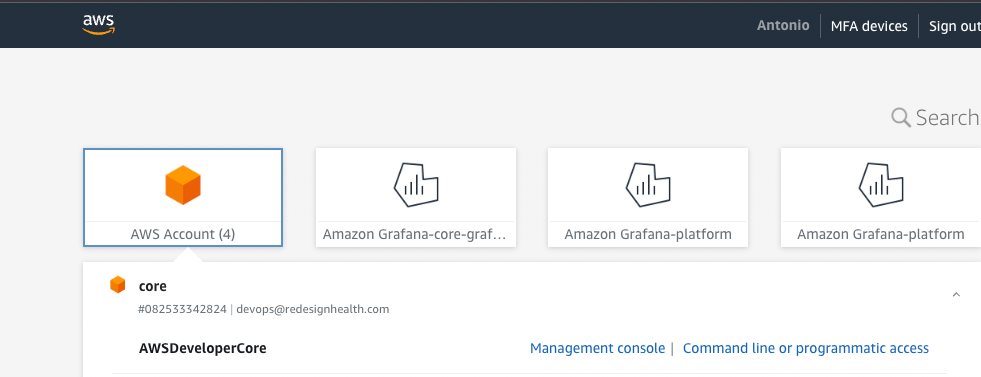

# Company API

## Purpose

Responsible for creating companies and spinning up services for those companies

## Documentation

- [Client Docs](https://dev-company-api.redesignhealth.com/public/docs)
- [Swagger](https://dev-company-api.redesignhealth.com/public/swagger)
- [OpenApi Definition](https://dev-company-api.redesignhealth.com/public/open-api)

## Environments

- [Dev](https://dev-company-api.redesignhealth.com)

## Running Locally

We currently support two ways to run the API: natively or via docker-compose. We recommend docker-compose if you are looking to get the app running quickly. Both ways will require java to be on your machine to build the project.

> This guide assumes you have [brew](https://brew.sh) installed.

### Install build tools

1. Install Java 17

```bash
$ brew tap homebrew/cask-versions
$ brew install --cask temurin17
```

2. Install Maven

```bash
$ brew install maven
```

I had some issues with this command installing `openjdk` as well. We are using `temurin` instead of `openjdk`.

Verify which JDK maven is using

```bash
$ mvn --version
Apache Maven 3.8.6 (84538c9988a25aec085021c365c560670ad80f63)
Maven home: /opt/homebrew/Cellar/maven/3.8.6/libexec
Java version: 17.0.4.1, vendor: Eclipse Adoptium, runtime: /Library/Java/JavaVirtualMachines/temurin-17.jdk/Contents/Home
Default locale: en_US, platform encoding: UTF-8
OS name: "mac os x", version: "12.3", arch: "aarch64", family: "mac"
```

Maven references `JAVA_HOME` for which JDK to use. If maven is using `openjdk`, add the following to your `~/.zshrc` file.

```
// .zshrc
....
export JAVA_HOME=$(/usr/libexec/java_home)
```

3. Install Node.js

I like [nodenv](https://github.com/nodenv/nodenv) but feel free to use whatever node manager you prefer.

3. Install Nx

```java
$ npm install --legacy-peer-deps
```

## Run with docker-compose

1. Install Rancher Desktop ([guide](https://redesignhealth.atlassian.net/wiki/spaces/PP/pages/208240686/Using+Docker+via+Rancher+Desktop#Download))
2. Update the Docker daemon to use Dockerd ([guide](https://redesignhealth.atlassian.net/wiki/spaces/PP/pages/208240686/Using+Docker+via+Rancher+Desktop#Configure-the-Docker-Daemon))
3. Add configuration to support search memory needs ([guide](https://redesignhealth.atlassian.net/wiki/spaces/PP/pages/208240686/Using+Docker+via+Rancher+Desktop#How-to-get-Elasticsearch%2FOpenSearch-running-locally))
4. Build target jar

```java
$ npx nx install company-api
```

5. Start app, db, and search server (see [docker-compose.yml](./docker-compose.yml))

```bash
$ cd apps/company-api
$ docker-compose up --build
```

6. To stop the services

Completely clean up services and volumes (this will not persist any opensearch or database data)

```bash
$ docker-compose down --volumes
```

Just stop the services and preserve the volumes.

```bash
$ docker-compose down
```

Note: if you want to rebuild the database to account for any seeding changes, use `docker-compose down --volumes` to remove the existing volumes.

## Run local services

> Note: 🚧 This currently does not support search. Use [Run with docker-compose](#run-with-docker-compose) if search is needed.

1. Install Cockroach

```bash
$ brew install cockroachdb/tap/cockroach
$ brew services start cockroachdb/tap/cockroach
```

This will startup a local cockroach db with the following connection string

```
cockroach://root@localhost:26257/defaultdb
```

2. Run the server

```bash
$ npx nx serve company-api
```

3. Call `GET http://localhost:8080`. The API response contains links to help you learn about the API (ex. http://localhost:8080/public/swagger).

```json
{
  "_links": {
    "documentation": {
      "href": "http://localhost:8080/public/docs"
    },
    "swagger": {
      "href": "http://localhost:8080/public/swagger"
    },
    "openApi": {
      "href": "http://localhost:8080/public/open-api"
    }
  },
  "Redesign Health": {
    "Own the outcome": "We do the work to get the job done",
    "Learn continuously": "We focus on constantly growing as individuals and as a team",
    "Redesign Healthcare": "We bring positive change to patients' lives",
    "Be trusted partners": "We strive to be the teammates and co-founders of choice",
    "Champion diverse perspectives": "We work to unlock our joint potential",
    "Practice kindness": "We aim to build bridges, not walls"
  }
}
```

4. Celebrate 🎉 (check out [Authorization](#authorization) to learn more about making requests)

### Docker

#### Remote Debugging

Add the following line to your Dockerfile

```Dockerfile
ENV JAVA_TOOL_OPTIONS -agentlib:jdwp=transport=dt_socket,server=y,suspend=n,address=*:5005
```

#### AWS credentials

From the aws page where are listed the accounts associated to your user.


Click on: `Command line or programmatic access` and get the information related to the env. variables defined in the docker-compose, fill the values and the container can get the values from secret manager.

Start up your app with port forwarding to `5005`

```bash
$ docker run -e SPRING_PROFILES_ACTIVE=local -p 8080:8080 -p 5005:5005 company-api
```

## Authorization

Authorization is done with a JSON Web Token (JWT). JWTs are generated with [Google ID](https://developers.google.com/identity/gsi/web/guides/overview).

Information on retrieving a JWT can be found here: https://redesignhealth.atlassian.net/wiki/x/AYCICQ

Note: Your user email must be in the database in order for the authorization to work. i.e. if running the backend locally, your user must be in the users table in the local database as well. Another way to preseed that information is to update the [application.yml](./application/src/main/resources/application.yml) file with your email. Check `db.seed.emails``.

## Run test

```bash
$ npx nx test company-api # runs integration tests and generates code coverage report
```

## Documentation Generation

Documentation requires tests to be ran for documentation snippets to be generated (i.e. avoid `-DskipTests`).
It's recommended that you run through the `package` phase when testing documentation.

```bash
$ mvn clean package -pl application
```

After running the above command, documenation can be found in the `target` folder under `application/target/static/public/docs/index.html`
Documentation is also hosted at `/public/docs`.

## Code Coverage

Code coverage is generated during [prepare-package](https://maven.apache.org/guides/introduction/introduction-to-the-lifecycle.html#default-lifecycle).
Running `mvn clean verify` will run `prepare-package` and generate a report at `application/target/site/jacoco/index.html`

## Activating Profiles

To change which `src/main/resources/application*.yml` file is used, leverage the `SPRING_PROFILES_ACTIVE=profilename` environment variable.

```bash
$ SPRING_PROFILES_ACTIVE=dev mvn spring-boot:run
```

Alternate ways to set spring profiles can be found [here](https://docs.spring.io/spring-boot/docs/1.2.0.M1/reference/html/boot-features-profiles.html).

## Secrets

Secrets are managed by AWS Secret Manager. `secret name` represents a bucket that houses many `secret properties`. (ex. [dev/company-api](https://us-east-1.console.aws.amazon.com/secretsmanager/secret?name=dev%2Fcompany-api&region=us-east-1)).

You can point this application to a different `secret name` by using the `aws.secret.name` property.

```yaml
# application.yml
aws:
  secret:
    name: dev/company-api
```

Each `secret property` represents a spring property (ex. `spring.datasource.password` represents the `spring.datasource.password` property).

AWS Secrets are treated as a fallback property instead of overriding properties with the same name. This gives developers the ability to override these properties through environment variables/properties files. A full list of [fallbacks](https://docs.spring.io/spring-boot/docs/2.1.9.RELEASE/reference/html/boot-features-external-config.html#boot-features-external-config) can be found here. AWS secrets would fall at the bottom this list. We can change this priority in the future if we see fit.

## Releases

Releases are handled by our [GitHub Actions Workflow](../../.github/workflows/company-api-versioning.yml).

You can do a test run of the release locally to learn more about how it works

```bash
$ mvn release:prepare -DdryRun
```

## Deployments

Dev deployments are handled by our [GitHub Actions Workflow](../../.github/workflows/company-api-deployment.yml) and dispatched anytime a `company-api-*` tag is created.

> Note: These are automatically created by our release builds.

### Supporting Infrastructure

- ECR: https://us-east-1.console.aws.amazon.com/ecr/repositories/private/082533342824/company-api?region=us-east-1
- ECS Task Definition: https://us-east-1.console.aws.amazon.com/ecs/v2/task-definitions/opco-service-api?region=us-east-1
- Cloudfront S3 Logs: https://s3.console.aws.amazon.com/s3/buckets/dev-opco-service-api-logs-2?region=us-west-2&tab=objects
- Cloudfront Distribution: https://us-east-1.console.aws.amazon.com/cloudfront/v3/home?region=us-east-1&skipRegion=true#/distributions/E3E5SE267YG84B
- Lambda for Jira webhook: https://us-east-1.console.aws.amazon.com/lambda/home?region=us-east-1#/functions/test-func?tab=code
- SQS for Jira webhook events: https://us-east-1.console.aws.amazon.com/sqs/v2/home?region=us-east-1#/queues/https%3A%2F%2Fsqs.us-east-1.amazonaws.com%2F082533342824%2FJiraWebhook0.fifo
