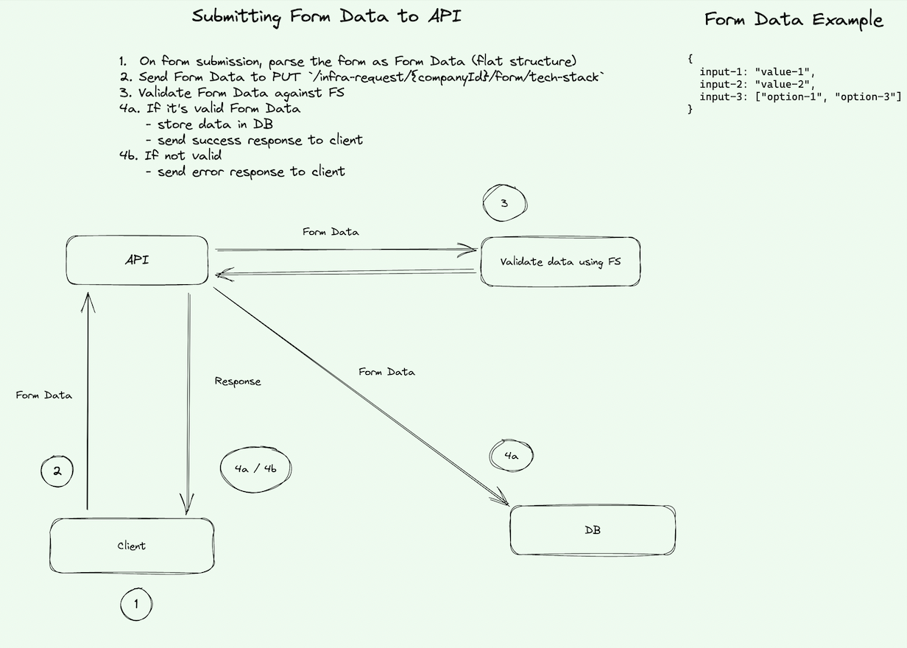
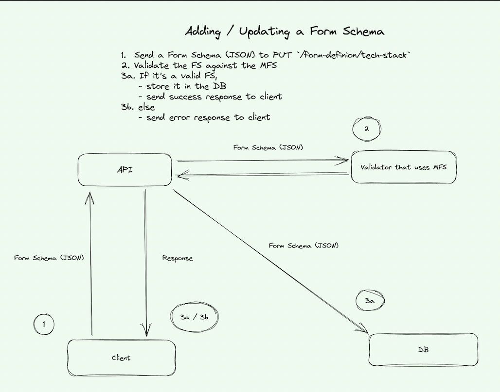

=== Form Definition

A framework for defining type-safe, predictable, and dynamic form data.

This framework is backed by https://json-schema.org/learn/getting-started-step-by-step.html#intro[JSON Schema].

TIP: We recommend using https://www.jsonschemavalidator.net to validate schemas before submitting them.

There are three components to the framework:

* xref:form-definition.adoc#_1_form_data[Form data]
* xref:form-definition.adoc#_2_form_schemas[Form schemas]
* xref:form-definition.adoc#_3_form_meta_schema[Form meta-schema]

===== 1. Form data

Form data is the core of this framework. Raw JSON can be sent to various resource in our API.

Below is an example of submitting a single field `firstName` with a form definition `PRIVACY_QUESTIONNAIRE` to the `/infra-request` resource (xref:infrastructure-request.adoc#_update_form[learn more about infrastructure requests]).

operation::infrastructure-request/update-form[snippets='http-request']

===== 2. Form schemas

Now the question is, "how do we enforce data to be sent as a single field `firstName` with a `string` value?"
"How can clients trust form data to be in a predictable format?"

The answer two both questions is form schemas.

Form schemas provides details about how a form should be rendered, validated, and submitted.

Below is an example of a form definition called `PRIVACY_QUESTIONNAIRE` with a schema defining a text input named `firstName` and label `First Name`.
It has field validation requirements of only allowing `string` values with alphabetical characters regex and a 10 character limit.

operation::form-definition/update[snippets='http-request']

Below is a diagram of what's going on behind the scenes:

===== 3. Form meta-schema

With this framework, any client can define form schemas.

This leads to the final question: "how do we enforce form schems
to conform to a specific structure?"

The answer is a Form meta-schema (FMS).

The FMS is responsible for defining what building blocks are available for defining a form--think `textarea`, `radio`, `checkbox` etc.

Below is a diagram of what is going on behind the scenes:

Below is our current FMS:

[source, json, subs=attributes+]
----
{
  "type": "object",
  "properties": {
    "meta": {
      "properties": {
        "form-id": { "type": "string" },
        "form-title": { "type": "string" },
        "form-description": { "type": "string" }
      },
      "required": ["form-id"]
    },
    "properties": {
      "patternProperties": {
        ".*": {
          "oneOf": [
            {
              "type": "object",
              "properties": {
                "type": { "const": "string" },
                "inputType": {"const":  "text" },
                "label": { "type": "string" },
                "placeholder": { "type": "string" },
                "pattern": { "type": "string" },
                "minLength": { "type": "number" },
                "maxLength": { "type": "number" }
              },
              "additionalProperties": false,
              "required": ["type","inputType"]
            },
            {
              "type": "object",
              "properties": {
                "type": { "const": "string" },
                "inputType": { "const": "text-area" },
                "label": { "type": "string" },
                "placeholder": { "type": "string" },
                "pattern": { "type": "string" },
                "minLength": { "type": "number" },
                "maxLength": { "type": "number" }
              },
              "additionalProperties": false,
              "required": ["type","inputType"]
            },
            {
              "type": "object",
              "properties": {
                "type": { "const": "number" },
                "inputType": { "const": "number" },
                "label": { "type": "string" },
                "placeholder": { "type": "string" },
                "minimum": { "type": "number" },
                "maximum": { "type": "number" }
              },
              "additionalProperties": false,
              "required": ["type", "inputType"]
            },
            {
              "type": "object",
              "properties": {
                "type": { "const": "string" },
                "inputType": { "const": "checkbox" },
                "label": { "type": "string" },
                "oneOf": {
                  "type": "array",
                  "items": {
                    "type": "object",
                    "properties": {
                      "displayName": { "type": "string" },
                      "const": { "type": "string" }
                    },
                    "required": ["displayName", "const"]
                  },
                  "minItems": 1
                }
              },
              "additionalProperties": false,
              "required": ["type", "inputType", "oneOf"]
            },
            {
              "type": "object",
              "properties": {
                "type": { "const": "string" },
                "inputType": { "const": "select" },
                "label": { "type": "string" },
                "oneOf": {
                  "type": "array",
                  "items": {
                    "type": "object",
                    "properties": {
                      "const": { "type": "string" },
                      "displayName": { "type": "string" }
                    },
                    "required": ["const", "displayName"]
                  },
                  "minItems": 1
                }
              },
              "additionalProperties": false,
              "required": ["type", "inputType", "oneOf"]
            },
            {
              "type": "object",
              "properties": {
                "type": { "const": "string" },
                "inputType": { "const": "radio" },
                "label": { "type": "string" },
                "helperText": { "type": "string" },
                "oneOf": {
                  "type": "array",
                  "items": {
                    "type": "object",
                    "properties": {
                      "displayName": { "type": "string" },
                      "const": { "type": "string" }
                    },
                    "minItems": 1,
                    "required": ["const", "displayName"]
                  }
                }
              },
              "additionalProperties": false,
              "required": ["type", "inputType", "oneOf"]
            }
          ]
        }
      }
    }
  },
  "required": ["meta", "properties"]
}
----

The form meta-schema defines guardrails around what's possible in a form. This allows clients
to create libraries that adhere to the form meta-schema and support all form schemas.

==== Get
Request a form schema.

Role requirement: none

operation::form-definition/get[snippets='http-request,http-response']

==== Update
Create or update a form schema. The form schema must conform to our xref:form-definition.adoc#_form_meta_schema[Form meta-schema].

Role requirement: `ROLE_RH_ADMIN`

operation::form-definition/update[snippets='http-request,http-response']
